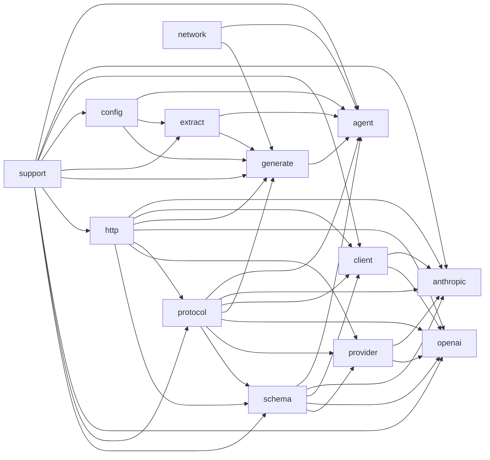

# API Reference

## Overview

This documentation set covers a C++ code assistance system that analyzes source projects and generates human-readable guide documents. The system is organized into three main subsystems: an extraction pipeline that parses translation units and builds a structured model of symbols and dependencies; an agent loop that drives an interactive exploration of the codebase through tool calls to a large language model; and a generation pipeline that produces final documentation pages. The networking core provides an HTTP layer, rate limiting, and protocol‑specific implementations for Anthropic and `OpenAI` `APIs`, all built on a shared set of data types and JSON Schema utilities. Supporting modules handle configuration, logging, and text processing. Readers should understand the project as a modular toolchain where extracted metadata is progressively refined through LLM interaction and then rendered into structured output.

## Modules

- [`agent`](modules/agent/index.md)
- [`agent:tools`](modules/agent/tools.md)
- [`anthropic`](modules/anthropic/index.md)
- [`client`](modules/client/index.md)
- [`config`](modules/config/index.md)
- [`config:load`](modules/config/load.md)
- [`config:normalize`](modules/config/normalize.md)
- [`config:schema`](modules/config/schema.md)
- [`config:validate`](modules/config/validate.md)
- [`extract`](modules/extract/index.md)
- [`extract:ast`](modules/extract/ast.md)
- [`extract:cache`](modules/extract/cache.md)
- [`extract:compiler`](modules/extract/compiler.md)
- [`extract:filter`](modules/extract/filter.md)
- [`extract:merge`](modules/extract/merge.md)
- [`extract:model`](modules/extract/model.md)
- [`extract:scan`](modules/extract/scan.md)
- [`generate`](modules/generate/index.md)
- [`generate:analysis`](modules/generate/analysis.md)
- [`generate:cache`](modules/generate/cache.md)
- [`generate:common`](modules/generate/common.md)
- [`generate:diagram`](modules/generate/diagram.md)
- [`generate:dryrun`](modules/generate/dryrun.md)
- [`generate:evidence`](modules/generate/evidence.md)
- [`generate:markdown`](modules/generate/markdown.md)
- [`generate:model`](modules/generate/model.md)
- [`generate:page`](modules/generate/page.md)
- [`generate:planner`](modules/generate/planner.md)
- [`generate:scheduler`](modules/generate/scheduler.md)
- [`generate:symbol`](modules/generate/symbol.md)
- [`http`](modules/http/index.md)
- [`network`](modules/network/index.md)
- [`openai`](modules/openai/index.md)
- [`protocol`](modules/protocol/index.md)
- [`provider`](modules/provider/index.md)
- [`schema`](modules/schema/index.md)
- [`support`](modules/support/index.md)

## Namespaces

- [`clore`](namespaces/clore/index.md)
- [`clore::agent`](namespaces/clore/agent/index.md)
- [`clore::config`](namespaces/clore/config/index.md)
- [`clore::extract`](namespaces/clore/extract/index.md)
- [`clore::extract::cache`](namespaces/clore/extract/cache/index.md)
- [`clore::generate`](namespaces/clore/generate/index.md)
- [`clore::generate::cache`](namespaces/clore/generate/cache/index.md)
- [`clore::logging`](namespaces/clore/logging/index.md)
- [`clore::net`](namespaces/clore/net/index.md)
- [`clore::net::anthropic`](namespaces/clore/net/anthropic/index.md)
- [`clore::net::anthropic::detail`](namespaces/clore/net/anthropic/detail/index.md)
- [`clore::net::anthropic::protocol`](namespaces/clore/net/anthropic/protocol/index.md)
- [`clore::net::anthropic::protocol::detail`](namespaces/clore/net/anthropic/protocol/detail/index.md)
- [`clore::net::anthropic::schema`](namespaces/clore/net/anthropic/schema/index.md)
- [`clore::net::detail`](namespaces/clore/net/detail/index.md)
- [`clore::net::openai`](namespaces/clore/net/openai/index.md)
- [`clore::net::openai::detail`](namespaces/clore/net/openai/detail/index.md)
- [`clore::net::openai::protocol`](namespaces/clore/net/openai/protocol/index.md)
- [`clore::net::openai::protocol::detail`](namespaces/clore/net/openai/protocol/detail/index.md)
- [`clore::net::openai::schema`](namespaces/clore/net/openai/schema/index.md)
- [`clore::net::openai::schema::detail`](namespaces/clore/net/openai/schema/detail/index.md)
- [`clore::net::protocol`](namespaces/clore/net/protocol/index.md)
- [`clore::net::schema`](namespaces/clore/net/schema/index.md)
- [`clore::support`](namespaces/clore/support/index.md)

## Module Dependency Diagram

