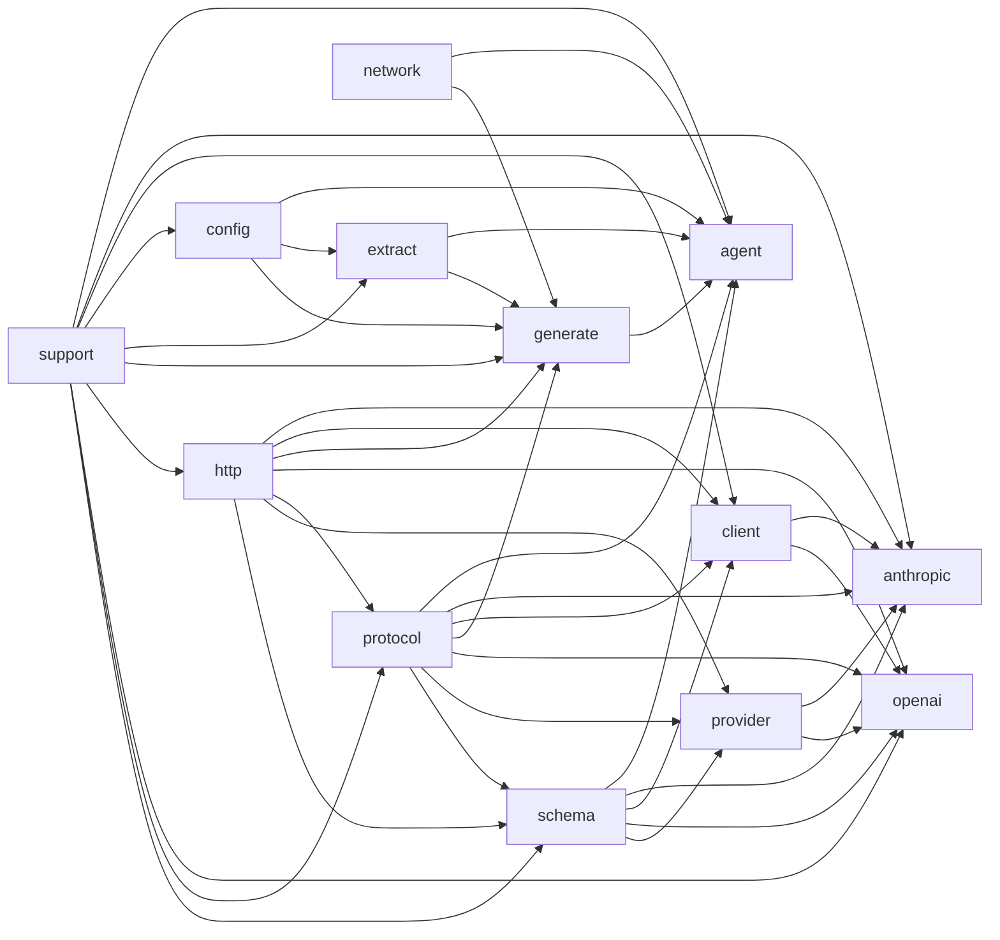

# API Reference

## Overview

This project is a C++ framework for generating documentation from source code using large language model (LLM) services. It comprises several interconnected subsystems: the **protocol** and **schema** modules define the data structures and JSON schema generation for LLM interactions; the **http** and **network** modules handle asynchronous communication with providers like `OpenAI` and Anthropic, while the **provider** module manages credentials and request validation for each service. The **extract** module asynchronously scans and parses project code to build an analysis store, which the **agent** module then explores via tool‑calling loops to produce documentation plans. Finally, the **generate** module renders those plans into output files, guided by settings from the **config** module. Readers should understand the project as a pipeline: extract code metadata, interact with `LLMs` to determine documentation content, and produce rendered pages, all orchestrated through a common asynchronous event loop.

## Modules

- [`agent`](modules/agent/index.md)
- [`agent:tools`](modules/agent/tools.md)
- [`anthropic`](modules/anthropic/index.md)
- [`client`](modules/client/index.md)
- [`config`](modules/config/index.md)
- [`config:load`](modules/config/load.md)
- [`config:normalize`](modules/config/normalize.md)
- [`config:schema`](modules/config/schema.md)
- [`config:validate`](modules/config/validate.md)
- [`extract`](modules/extract/index.md)
- [`extract:ast`](modules/extract/ast.md)
- [`extract:cache`](modules/extract/cache.md)
- [`extract:compiler`](modules/extract/compiler.md)
- [`extract:filter`](modules/extract/filter.md)
- [`extract:merge`](modules/extract/merge.md)
- [`extract:model`](modules/extract/model.md)
- [`extract:scan`](modules/extract/scan.md)
- [`generate`](modules/generate/index.md)
- [`generate:analysis`](modules/generate/analysis.md)
- [`generate:cache`](modules/generate/cache.md)
- [`generate:common`](modules/generate/common.md)
- [`generate:diagram`](modules/generate/diagram.md)
- [`generate:dryrun`](modules/generate/dryrun.md)
- [`generate:evidence`](modules/generate/evidence.md)
- [`generate:markdown`](modules/generate/markdown.md)
- [`generate:model`](modules/generate/model.md)
- [`generate:page`](modules/generate/page.md)
- [`generate:planner`](modules/generate/planner.md)
- [`generate:scheduler`](modules/generate/scheduler.md)
- [`generate:symbol`](modules/generate/symbol.md)
- [`http`](modules/http/index.md)
- [`network`](modules/network/index.md)
- [`openai`](modules/openai/index.md)
- [`protocol`](modules/protocol/index.md)
- [`provider`](modules/provider/index.md)
- [`schema`](modules/schema/index.md)
- [`support`](modules/support/index.md)

## Namespaces

- [`clore`](namespaces/clore/index.md)
- [`clore::agent`](namespaces/clore/agent/index.md)
- [`clore::config`](namespaces/clore/config/index.md)
- [`clore::extract`](namespaces/clore/extract/index.md)
- [`clore::extract::cache`](namespaces/clore/extract/cache/index.md)
- [`clore::generate`](namespaces/clore/generate/index.md)
- [`clore::generate::cache`](namespaces/clore/generate/cache/index.md)
- [`clore::logging`](namespaces/clore/logging/index.md)
- [`clore::net`](namespaces/clore/net/index.md)
- [`clore::net::anthropic`](namespaces/clore/net/anthropic/index.md)
- [`clore::net::anthropic::detail`](namespaces/clore/net/anthropic/detail/index.md)
- [`clore::net::anthropic::protocol`](namespaces/clore/net/anthropic/protocol/index.md)
- [`clore::net::anthropic::protocol::detail`](namespaces/clore/net/anthropic/protocol/detail/index.md)
- [`clore::net::anthropic::schema`](namespaces/clore/net/anthropic/schema/index.md)
- [`clore::net::detail`](namespaces/clore/net/detail/index.md)
- [`clore::net::openai`](namespaces/clore/net/openai/index.md)
- [`clore::net::openai::detail`](namespaces/clore/net/openai/detail/index.md)
- [`clore::net::openai::protocol`](namespaces/clore/net/openai/protocol/index.md)
- [`clore::net::openai::protocol::detail`](namespaces/clore/net/openai/protocol/detail/index.md)
- [`clore::net::openai::schema`](namespaces/clore/net/openai/schema/index.md)
- [`clore::net::openai::schema::detail`](namespaces/clore/net/openai/schema/detail/index.md)
- [`clore::net::protocol`](namespaces/clore/net/protocol/index.md)
- [`clore::net::schema`](namespaces/clore/net/schema/index.md)
- [`clore::support`](namespaces/clore/support/index.md)

## Module Dependency Diagram

```mermaid
graph LR
    M0["agent"]
    M1["anthropic"]
    M2["client"]
    M3["config"]
    M4["extract"]
    M5["generate"]
    M6["http"]
    M7["network"]
    M8["openai"]
    M9["protocol"]
    M10["provider"]
    M11["schema"]
    M12["support"]
    M3 --> M0
    M4 --> M0
    M5 --> M0
    M7 --> M0
    M9 --> M0
    M11 --> M0
    M12 --> M0
    M2 --> M1
    M6 --> M1
    M9 --> M1
    M10 --> M1
    M11 --> M1
    M12 --> M1
    M6 --> M2
    M9 --> M2
    M11 --> M2
    M12 --> M2
    M12 --> M3
    M3 --> M4
    M12 --> M4
    M3 --> M5
    M4 --> M5
    M6 --> M5
    M7 --> M5
    M9 --> M5
    M12 --> M5
    M12 --> M6
    M2 --> M8
    M6 --> M8
    M9 --> M8
    M10 --> M8
    M11 --> M8
    M12 --> M8
    M6 --> M9
    M12 --> M9
    M6 --> M10
    M9 --> M10
    M11 --> M10
    M6 --> M11
    M9 --> M11
    M12 --> M11
```

