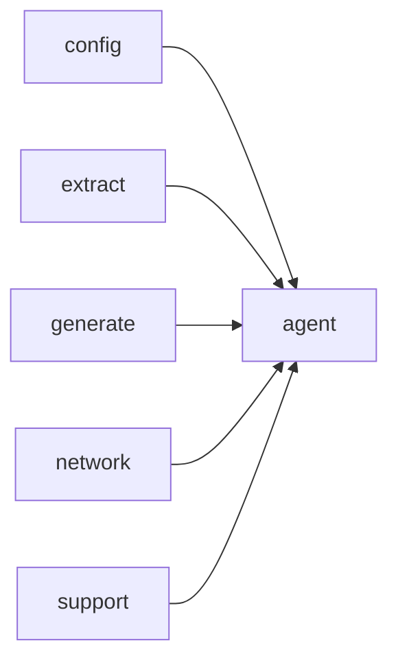

# Module `agent`

## Summary

The `agent` module orchestrates an interactive exploration of a source codebase through a loop of tool calls to a large language model (LLM), culminating in the generation of guide documents. Its public interface provides two entry points: `run_agent`, a synchronous function that drives the agent loop and returns the number of guides produced or an `AgentError`, and `run_agent_async`, an asynchronous variant designed for non‑blocking execution on a given event loop. Internally, the module manages agent state (conversation messages, tool definitions, cache keys, and output directory paths) and delegates to supporting operations such as serializing completion responses, hashing messages, and listing existing guide filenames. It relies on the `config`, `extract`, `generate`, `network`, `std`, and `support` modules for configuration, project metadata, documentation generation, LLM communication, standard utilities, and caching primitives.

## Imports

- [`config`](../config/index.md)
- [`extract`](../extract/index.md)
- [`generate`](../generate/index.md)
- [`network`](../network/index.md)
- `std`
- [`support`](../support/index.md)

## Dependency Diagram

## Types

### `clore::agent::AgentError`

Declaration: `agent/agent.cppm:21`

Definition: `agent/agent.cppm:21`

Declaration: [`Namespace clore::agent`](../../namespaces/clore/agent/index.md)

The struct `clore::agent::AgentError` is implemented as a simple wrapper around a single `std::string` field named `message`. No invariants are imposed beyond the validity of the underlying string; the struct does not define custom constructors, destructors, or assignment `operator`s, relying on the implicitly generated special members to manage the string's lifetime and content. Its purpose within the implementation is to hold a human-readable description of an error condition, but no additional metadata or error codes are stored.

#### Invariants

- The `message` member always contains a valid `std::string` object
- The `message` string may be empty

#### Key Members

- `std::string message` — the error description

#### Usage Patterns

- Created with a descriptive string when an error occurs in agent operations
- Likely used as a member of a `std::expected` or thrown as an exception

## Functions

### `clore::agent::run_agent`

Declaration: `agent/agent.cppm:27`

Definition: `agent/agent.cppm:524`

Declaration: [`Namespace clore::agent`](../../namespaces/clore/agent/index.md)

`clore::agent::run_agent` acts as a synchronous entry point that delegates to the asynchronous `run_agent_async` function. It first constructs a `kota::event_loop` and invokes `run_agent_async` with the provided `config`, `model`, `llm_model`, and `output_root` arguments, forwarding the loop instance. The returned `task` is scheduled onto the loop via `loop.schedule` and executed by calling `loop.run`. After the loop completes, `task.result()` is queried; if it holds an `AgentError`, that error is wrapped in `std::unexpected` and returned, otherwise the contained `std::size_t` count of created guides is returned directly.

The function depends on `kota::event_loop` for running the coroutine-based agent loop and on `run_agent_async` for the actual multi-turn interaction with the LLM. All configuration, model data, LLM model name, and output path are passed through without transformation (aside from converting `output_root` to an owned `std::string`). The sole purpose of this layer is to provide a blocking interface over the asynchronous machinery, handling result extraction and error conversion.

#### Side Effects

- Creates and runs a `kota::event_loop` to drive asynchronous execution
- Delegates to `run_agent_async` which performs codebase exploration and writes guide documents under `${output_root}/guides/`
- Transfers ownership of `output_root` via `std::move`

#### Reads From

- `config` parameter (`config::TaskConfig`)
- `model` parameter (`extract::ProjectModel`)
- `llm_model` parameter (`std::string_view`)
- `output_root` parameter (`std::string`)
- Result of the scheduled task via `task.result()`

#### Writes To

- Local `kota::event_loop loop` state via `schedule` and `run`
- Returned `std::expected<std::size_t, AgentError>` value
- Guide documents under `${output_root}/guides/` (through `run_agent_async`)

#### Usage Patterns

- Invoked as the synchronous top-level driver to execute the agent loop
- Callers branch on the returned `std::expected` to handle `AgentError` or consume the produced guide count

### `clore::agent::run_agent_async`

Declaration: `agent/agent.cppm:34`

Definition: `agent/agent.cppm:507`

Declaration: [`Namespace clore::agent`](../../namespaces/clore/agent/index.md)

The implementation of `clore::agent::run_agent_async` begins by attempting to load a persistent cache index from disk via `clore::generate::cache::load_cache_index`, using the workspace root from the given `config::TaskConfig`. If the cache loads successfully, the resulting `clore::generate::cache::CacheIndex` is retained; otherwise a warning is logged with the error message from `AgentError::message`. After this initialization, the function delegates all further work to `clore::agent::(anonymous namespace)::run_agent_loop`, passing the `config`, `model`, `llm_model`, `output_root`, the (possibly empty) `cache_index`, and the `kota::event_loop`. The coroutine returns via `co_return co_await`, yielding a `kota::task<std::size_t, AgentError>` that must be scheduled on the provided loop. Dependencies include the agent cache subsystem, the `kota` coroutine runtime, and the internal `run_agent_loop` function.

#### Side Effects

- loads cache index from disk via `clore::generate::cache::load_cache_index`
- logs cache load status via `clore::logging::info` and `clore::logging::warn`
- calls `run_agent_loop` which may perform further I/O or mutation

#### Reads From

- `config.workspace_root`
- `config` (fields used by `load_cache_index` and `run_agent_loop`)
- `model`
- `llm_model`
- `output_root`
- `loop`
- cache file on disk

#### Writes To

- `cache_index` (local, moved from cache result)
- logging output via `clore::logging` functions
- state mutated by `run_agent_loop` (e.g., output files, logs, cache updates)

#### Usage Patterns

- Called to start an asynchronous agent session with caching
- Callers schedule the returned task on the provided `kota::event_loop`
- Used in higher-level agent orchestration code

## Internal Structure

The `agent` module is decomposed into a public interface exposing two entry points—`run_agent` (synchronous) and `run_agent_async` (asynchronous)—and a private implementation confined to an anonymous namespace within `agent/agent.cppm`. Internally, the module layers an agent loop (`run_agent_loop`) that iterates up to `kMaxAgentTurns`, orchestrating tool calls via `run_tool_call`, caching conversation state through `hash_messages` and `make_agent_cache_key`, and persisting LLM responses with `serialize_completion_response` / `deserialize_completion_response`. Helper functions such as `list_existing_guide_filenames` enable the agent to track previously generated guide documents, while the `ToolCallResult` struct and `AgentError` struct provide uniform result and error types. The module imports `config`, `extract`, `generate`, `network`, `support`, and `std`; it relies on `network` for LLM interaction, `support` for hashing and caching primitives, and likely uses `extract` and `generate` during tool execution to explore the codebase and produce guide documents under the configured output root.

## Related Pages

- [Module config](../config/index.md)
- [Module extract](../extract/index.md)
- [Module generate](../generate/index.md)
- [Module network](../network/index.md)
- [Module support](../support/index.md)

