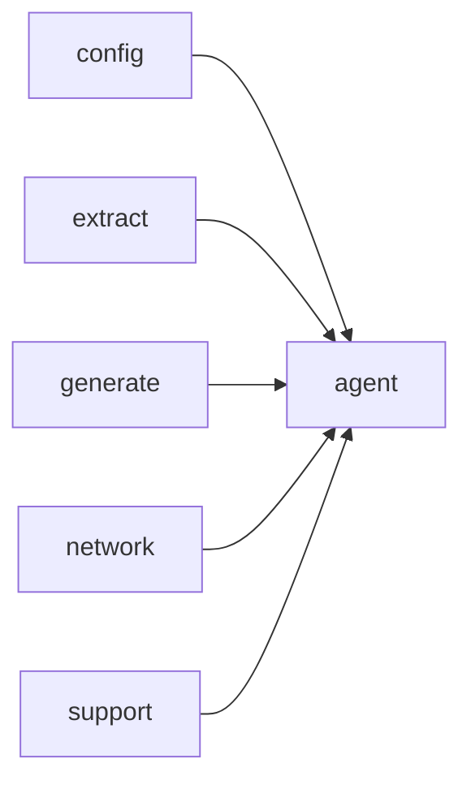

# Module `agent`

## Summary

The `agent` module implements the core agent loop that explores a codebase through tool calls and produces guide documents under a configured output directory. It manages the conversation with an LLM, caches responses to avoid redundant tool calls, and handles serialization and deserialization of completion data. Internally, it coordinates tasks like hashing message history, generating cache keys, and iterating over tool call results until the agent terminates or reaches a maximum number of turns.

The public-facing interface consists of two entry points: `clore::agent::run_agent` for synchronous execution and `clore::agent::run_agent_async` for asynchronous execution on a caller-provided event loop. Both functions accept parameters that define concurrency limits, output paths, and the LLM model. On success, they return a count of generated guides; on failure, they return a descriptive `AgentError`. The module also exposes the `AgentError` struct, which carries a human-readable message.

## Imports

- [`config`](../config/index.md)
- [`extract`](../extract/index.md)
- [`generate`](../generate/index.md)
- [`network`](../network/index.md)
- `std`
- [`support`](../support/index.md)

## Dependency Diagram

## Types

### `clore::agent::AgentError`

Declaration: `agent/agent.cppm:21`

Definition: `agent/agent.cppm:21`

Declaration: [`Namespace clore::agent`](../../namespaces/clore/agent/index.md)

The struct `clore::agent::AgentError` is a simple error type that holds a single `std::string message` member. Its purpose is to encapsulate a human-readable error description for operations within the `clore::agent` module. The class relies on compiler-generated special member functions, providing default construction, copy, move, and assignment semantics for the `message` field. The only invariant is that `message` contains a valid string; no non-trivial or complex state is maintained, making the implementation transparent and minimal.

#### Invariants

- message should be a valid, non-empty string when describing an error

#### Key Members

- message

#### Usage Patterns

- used as a return type or thrown as an exception to indicate agent-related errors

## Functions

### `clore::agent::run_agent`

Declaration: `agent/agent.cppm:27`

Definition: `agent/agent.cppm:524`

Declaration: [`Namespace clore::agent`](../../namespaces/clore/agent/index.md)

The function creates a `kota::event_loop` and delegates to `run_agent_async` to obtain a `task`. It schedules the task on the loop and then synchronously runs the loop until all pending work completes. Once the loop finishes, it retrieves the task result and either returns the contained `std::size_t` on success or wraps the error into `std::unexpected` as an `AgentError`.

Internally, `run_agent` acts as a thin synchronous wrapper around the asynchronous `run_agent_async`; all algorithm and I/O logic resides in that inner function. The only dependencies are on `kota::event_loop` for scheduling and execution, and on the `run_agent_async` function which implements the actual agent loop, LLM interaction, tool call dispatch, caching, and guide generation.

#### Side Effects

- runs an event loop which may perform I/O and other side effects
- schedules and executes the asynchronous agent task that explores the codebase and writes guide documents

#### Reads From

- `config` parameter of type `const config::TaskConfig&`
- `model` parameter of type `const extract::ProjectModel&`
- `llm_model` parameter of type `std::string_view`
- `output_root` parameter of type `std::string`
- `loop` local variable of type `kota::event_loop`

#### Writes To

- `loop` local variable (event loop state)
- `result` local variable (holds task result)
- potentially writes guide files under `output_root` via the async task

#### Usage Patterns

- synchronous entry point for running the agent
- callers use it to execute the agent loop and obtain a result
- typically called with a configuration, project model, LLM model name, and output directory

### `clore::agent::run_agent_async`

Declaration: `agent/agent.cppm:34`

Definition: `agent/agent.cppm:507`

Declaration: [`Namespace clore::agent`](../../namespaces/clore/agent/index.md)

The function begins by attempting to load a cache index from the workspace root specified in `config` via `clore::generate::cache::load_cache_index`. On success, the result is moved into a local `clore::generate::cache::CacheIndex` variable and a success message is logged; on failure, a warning is logged using the error’s `message` field. The function then suspends itself and `co_awaits` `clore::agent::(anonymous namespace)::run_agent_loop`, forwarding its own `config`, `model`, `llm_model`, `output_root`, `loop`, and the freshly‑loaded `cache_index`. This design ensures that cache state is established (or gracefully degraded) before the main loop begins, and that the coroutine integrates cleanly with the provided `kota::event_loop`. Dependencies include `kota::task`, the internal agent loop, and the `clore::generate::cache` module’s index types and loader.

#### Side Effects

- reads cache index from disk via `clore::generate::cache::load_cache_index`
- logs info or warn messages via `logging::info` and `logging::warn`

#### Reads From

- `config.workspace_root` (string path for cache file)
- `model` (`extract::ProjectModel`)
- `llm_model` (string)
- `output_root` (string)
- `loop` (`kota::event_loop`)

#### Writes To

- local variable `cache_index` (`clore::generate::cache::CacheIndex`) via move

#### Usage Patterns

- callers must schedule the returned task on the event loop and run it
- used to start an asynchronous agent loop with cache loading

## Internal Structure

The `agent` module orchestrates the top-level agent loop that explores a codebase and produces guide documents. It imports from five sibling modules — `config`, `extract`, `generate`, `network`, and `support` — along with `std`. Public entry points are `run_agent` and `run_agent_async`. Internally, the module is decomposed into an anonymous namespace containing the core agent loop (`run_agent_loop`), helper functions for caching (`hash_messages`, `make_agent_cache_key`, `serialize_completion_response`, `deserialize_completion_response`), tool call execution (`run_tool_call`), and guide discovery (`list_existing_guide_filenames`). A `ToolCallResult` struct and an `AgentError` type encapsulate internal results and failures. The implementation structure separates the synchronous synchronous from the asynchronous entry point, with the latter expecting a caller-provided event loop and relying on the `network` module for LLM communication and `support` for file I/O and path handling.

## Related Pages

- [Module config](../config/index.md)
- [Module extract](../extract/index.md)
- [Module generate](../generate/index.md)
- [Module network](../network/index.md)
- [Module support](../support/index.md)

