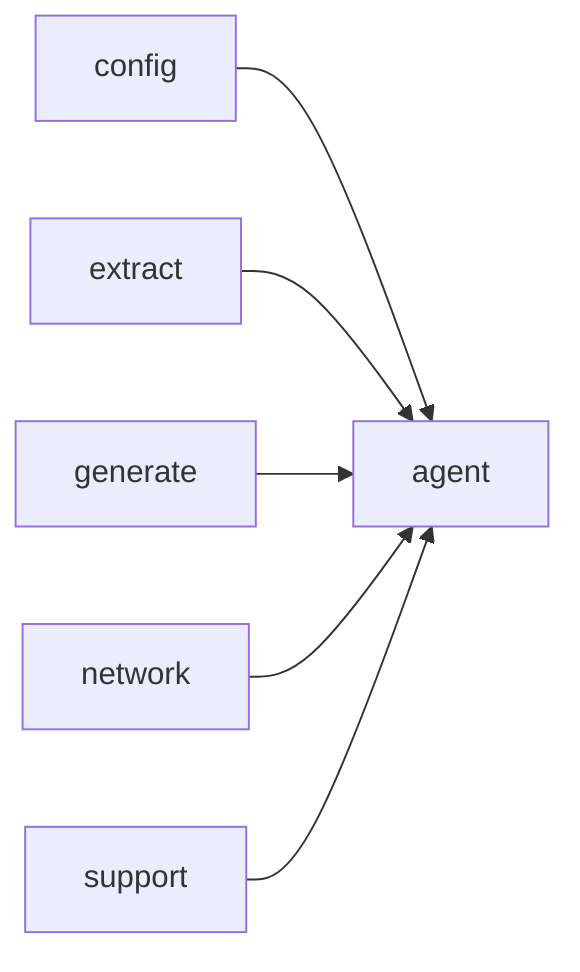

# Module `agent`

## Summary

The `agent` module is responsible for orchestrating the agent-based documentation generation loop. It drives an interactive process that uses tool calls to explore the codebase and produce guide documents, typically written under a specified output root. The module exposes two public entry points: `run_agent` and `run_agent_async`. The synchronous `run_agent` executes the loop directly and returns a result count or an `AgentError`, while `run_agent_async` performs the same work on a provided event loop for non‑blocking operation. Internally, the module manages model interaction, tool call dispatching, response parsing, caching, and guide file output, drawing on the `config`, `extract`, `generate`, `network`, and `support` modules for configuration, data extraction, page generation, LLM communication, and utility functions.

## Imports

- [`config`](../config/index.md)
- [`extract`](../extract/index.md)
- [`generate`](../generate/index.md)
- [`network`](../network/index.md)
- [`support`](../support/index.md)

## Dependency Diagram

```mermaid
graph LR
    M0["agent"]
    I0["config"]
    I0 --> M0
    I1["extract"]
    I1 --> M0
    I2["generate"]
    I2 --> M0
    I3["network"]
    I3 --> M0
    I4["support"]
    I4 --> M0
```

## Types

### `clore::agent::AgentError`

Declaration: `src/agent/agent.cppm:35`

Definition: `src/agent/agent.cppm:35`

Declaration: [`Namespace clore::agent`](../../namespaces/clore/agent/index.md)

The struct `clore::agent::AgentError` is a trivial error type that contains a single data member, `message`, of type `std::string`. This field holds a human-readable description of the error. Because the struct has no user‑defined constructors, destructor, or assignment `operator`s, all special member functions are implicitly generated by the compiler, which is sufficient for correct copy, move, and destruction behavior. No additional invariants are required beyond those inherent to `std::string`; the string’s value is the sole state of the error.

#### Invariants

- `message` is a valid `std::string` object

#### Key Members

- `message`

#### Usage Patterns

- Returned from functions to indicate an error condition
- Stores a human-readable error description

## Functions

### `clore::agent::run_agent`

Declaration: `src/agent/agent.cppm:41`

Definition: `src/agent/agent.cppm:538`

Declaration: [`Namespace clore::agent`](../../namespaces/clore/agent/index.md)

The function creates a local `kota::event_loop` named `loop` and constructs an asynchronous task by invoking `run_agent_async` with the provided `config`, `model`, `llm_model` (converted to `std::string`), `output_root` (moved into the call), and the `loop` reference. The task is scheduled on the event loop via `loop.schedule(task)` and the loop is run to completion with `loop.run()`. After the event loop finishes, the function retrieves the task’s result; if the result contains an error (checked via `result.has_error()`), it returns `std::unexpected` with the moved error. Otherwise, the contained `std::size_t` value (the number of guides created) is returned.

This function acts as a synchronous wrapper around the asynchronous `run_agent_async` core, which performs the actual agent loop over multiple turns. The dependency on `kota::event_loop` provides the single-threaded coroutine execution context, while `run_agent_async` handles message exchanges with the LLM, tool call dispatching, cache lookups, and guide file generation.

#### Side Effects

- writes guide documents to `${output_root}/guides/`
- executes tool calls that may perform I/O or modify files
- synchronizes asynchronous operations via the event loop

#### Reads From

- `config` parameter of type `const config::TaskConfig&`
- `model` parameter of type `const extract::ProjectModel&`
- `llm_model` parameter of type `std::string_view`
- `output_root` parameter of type `std::string`

#### Writes To

- output directory `${output_root}/guides/` (guide documents)
- possibly other files or resources via tool calls

#### Usage Patterns

- called to start the agent from a synchronous context
- used as a wrapper around the asynchronous `run_agent_async`

### `clore::agent::run_agent_async`

Declaration: `src/agent/agent.cppm:48`

Definition: `src/agent/agent.cppm:521`

Declaration: [`Namespace clore::agent`](../../namespaces/clore/agent/index.md)

The function `clore::agent::run_agent_async` is a coroutine that initializes the agent’s persistent cache before delegating the main loop to `run_agent_loop`. It first calls `clore::generate::cache::load_cache_index` with the workspace root from the `config::TaskConfig` to load any existing cache index. If loading succeeds, the cache index is stored locally and a log message reports the number of entries; on failure, a warning is logged with the error message. After this initialization, it `co_await`s `run_agent_loop`, passing the original `config`, `model`, `llm_model`, `output_root`, the newly populated `cache_index`, and the event loop. The return type is `kota::task<std::size_t, AgentError>`, matching the coroutine interface required by the event loop.

#### Side Effects

- File system read: loading cache index from disk
- Logging: info or warn messages via `logging::info` and `logging::warn`

#### Reads From

- `config.workspace_root`
- Cache file system (via `clore::generate::cache::load_cache_index`)

#### Writes To

- Logging output (e.g., console or log file)

#### Usage Patterns

- Callers schedule the returned task on the event loop
- Used to orchestrate the asynchronous agent workflow

## Internal Structure

The `agent` module is the top-level orchestration layer for the codebase exploration and guide generation workflow. Its public API exposes two entry points: `run_agent` (synchronous) and `run_agent_async` (asynchronous, requiring a `kota::event_loop`). Both functions accept project identifiers and output‑root paths and return either a count of produced guides or an `AgentError`. Internally, the module is decomposed into a set of anonymous‑namespace helpers that implement the core loop (`run_agent_loop`), tool‑call execution (`run_tool_call`), caching and serialization (`hash_messages`, `make_agent_cache_key`, `serialize_completion_response`, `deserialize_completion_response`), and file‑system scanning (`list_existing_guide_filenames`). The struct `ToolCallResult` captures the outcome of a single tool invocation.

The module imports five supporting modules — `config`, `extract`, `generate`, `network`, and `support` — establishing a clear internal layering. Configuration is obtained from the `config` module, the `network` module handles asynchronous LLM completion requests, `support` provides caching primitives and string utilities, while `extract` and `generate` are used to gather project data and produce final guide documents, respectively. The implementation structure places the main loop and all helper functions within an anonymous namespace to limit visibility, exposing only the two `run_agent` entry points and the public error type. This design encapsulates the agent’s turn‑based reasoning, cache lookups, and output assembly behind a narrow, well‑defined interface.

## Related Pages

- [Module config](../config/index.md)
- [Module extract](../extract/index.md)
- [Module generate](../generate/index.md)
- [Module network](../network/index.md)
- [Module support](../support/index.md)

