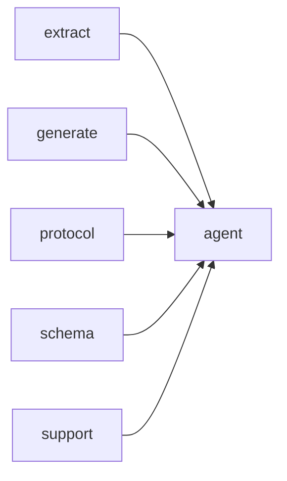

# Module `agent:tools`

## Summary

The `agent:tools` module defines the tool system used by the agent to interact with and analyze C++ codebases. It owns a collection of concrete tool implementations—such as listing files, searching symbols, retrieving namespace contents, getting module or dependency information, and managing project guides—all registered in a static registry. The public interface centers on `build_tool_definitions` to populate the registry and `dispatch_tool_call` to execute a named tool with JSON arguments, returning either a string result or a `ToolError`. Supporting public types include `ToolError`, `ToolContext` (carrying project root, model, and output root), and the `ToolResultCache` for memoizing results. The module also exposes helper functions like `extract_string_arg` for argument validation and normalization utilities for guide filenames.

## Imports

- [`extract`](../extract/index.md)
- [`generate`](../generate/index.md)
- [`protocol`](../protocol/index.md)
- [`schema`](../schema/index.md)
- `std`
- [`support`](../support/index.md)

## Dependency Diagram

## Types

### `clore::agent::ToolError`

Declaration: `agent/tools.cppm:16`

Definition: `agent/tools.cppm:16`

Declaration: [`Namespace clore::agent`](../../namespaces/clore/agent/index.md)

The struct `clore::agent::ToolError` is a trivial error‑reporting type that holds a single `std::string` member named `message`. Its internal structure imposes no invariants beyond those inherent in `std::string`; the field is intended to carry a human‑readable description of an error condition that occurred during tool execution within the agent module. Because `ToolError` provides no custom constructors, assignment `operator`s, or other member functions, it relies entirely on the compiler‑generated defaults, making it a lightweight, value‑type wrapper around a diagnostic string.

#### Invariants

- No explicit invariants beyond the presence of a message string.

#### Key Members

- `std::string message`

#### Usage Patterns

- Returned or thrown by tool-related functions to indicate failure with a descriptive message.

## Variables

### `arguments`

Declaration: `agent/tools.cppm:621`

It serves as an input to the containing function, providing structured data that the function processes without modifying it.

#### Mutation

No mutation is evident from the extracted code.

#### Usage Patterns

- provides input data
- read-only access

### `context`

Declaration: `agent/tools.cppm:621`

It provides a read-only view of a `ToolContext` object, allowing access to context information without modification.

#### Mutation

No mutation is evident from the extracted code.

## Functions

### `clore::agent::build_tool_definitions`

Declaration: `agent/tools.cppm:23`

Definition: `agent/tools.cppm:887`

Declaration: [`Namespace clore::agent`](../../namespaces/clore/agent/index.md)

The function `clore::agent::build_tool_definitions` begins by obtaining the static registry of tool specifications from `tool_registry()`, which returns a `const std::array<ToolSpec, 12>`. It reserves space in a local `std::vector<clore::net::FunctionToolDefinition>` for the expected number of definitions. The core loop iterates over each `ToolSpec` element in the registry and calls its `build_definition()` member. If any call returns a `std::expected` that does not contain a value, the function immediately returns `std::unexpected` with the moved `ToolError` from that failed attempt. Otherwise, the successfully built definition is moved into the output vector. After all tools are processed, the vector is returned on success.

This implementation has a single dependency on `tool_registry()` for enumerating the tools, and on each `ToolSpec`’s `build_definition()` to produce the corresponding `FunctionToolDefinition`. The algorithm is linear over the fixed set of twelve tool entries, with early termination on the first build failure. No caching or external state is involved beyond the registry.

#### Side Effects

No observable side effects are evident from the extracted code.

#### Reads From

- `tool_registry()` const array
- `ToolSpec` objects and their `build_definition()` method

#### Usage Patterns

- Obtain tool definitions for sending to a language model
- Called by agent initialization or tool call dispatch logic

### `clore::agent::dispatch_tool_call`

Declaration: `agent/tools.cppm:26`

Definition: `agent/tools.cppm:902`

Declaration: [`Namespace clore::agent`](../../namespaces/clore/agent/index.md)

The function first serializes the JSON `arguments` into a string; if serialization fails it returns a `ToolError` with a formatted message. It then constructs a cache key as `"{tool_name}:{serialized_arguments}"` and consults a global `ToolResultCache` (obtained via `tool_result_cache()`) under a shared lock. If a cached result for that key exists, it is returned immediately, avoiding redundant computation. Otherwise, a `ToolContext` is assembled from the `model`, `project_root`, and `output_root` parameters. The function then iterates through the static tool registry (returned by `tool_registry()`) to find a `ToolSpec` whose `name` matches `tool_name`. For the matching tool, it delegates to that tool’s `dispatch` callable, passing the `arguments` and `context`. If the tool is marked `cacheable` and the dispatch succeeds, the result is stored in the cache under a unique lock before being returned. If no tool with the given name is found in the registry, the function returns a `ToolError` indicating an unknown tool.

#### Side Effects

- updates the global tool result cache via `cache.result_by_key.insert_or_assign`
- acquires unique lock on cache mutex during cache write
- dispatches tool call via `tool.dispatch` (tool-specific side effects unknown from evidence)

#### Reads From

- parameter `tool_name`
- parameter `arguments`
- parameter `model`
- parameter `project_root`
- parameter `output_root`
- global `tool_result_cache()` (via shared lock)
- global `tool_registry()`
- local `encoded_arguments`
- local `cache_key`
- cached result from `cache.result_by_key`

#### Writes To

- `cache.result_by_key` (map of cache key to result string)
- cache mutex (unique lock acquisition)

#### Usage Patterns

- called to handle tool calls in agent execution loops
- used by functions such as `run_agent_async` and `run_agent` to process tool dispatch requests

### `clore::agent::extract_string_arg`

Declaration: `agent/tools.cppm:20`

Definition: `agent/tools.cppm:865`

Declaration: [`Namespace clore::agent`](../../namespaces/clore/agent/index.md)

The function `clore::agent::extract_string_arg` validates that the supplied `arguments` value is a JSON object; if not, it returns an error via `std::unexpected(ToolError{.message = "arguments is not an object"})`. It then dereferences the underlying object pointer (returning an error if the pointer is null) and performs a linear scan over the object’s entries. For each entry whose `key` matches the given `field_name`, it attempts to extract a string via `entry.value.get_string()`. On success the extracted string is returned; if the value is present but not a string, it yields a `ToolError` noting that the field is not a string. If no entry matches the field name, the function returns an error indicating the missing field. The error messages are formatted using `std::format` and packaged into `ToolError` structures. This function depends solely on the `json::Value` API (object checks, pointer retrieval, entry iteration) and the local `ToolError` type, with no reliance on any other part of the agent module.

#### Side Effects

No observable side effects are evident from the extracted code.

#### Reads From

- `arguments` parameter (`json::Value`&)
- `field_name` parameter (`std::string_view`)

#### Usage Patterns

- used by `dispatch_tool_call` to extract string arguments from tool call argument objects

## Internal Structure

The `agent:tools` module implements the tool-calling interface for the Clore agent, providing a set of individually defined tools that operate on project data managed by the `extract` and `generate` modules. It is structured around a common `ToolSpec` definition and a static registry built at startup via `build_tool_definitions`, which populates an `std::array` of tool specifications. Each tool, such as `ListFilesTool` or `SearchSymbolsTool`, is implemented as a struct with a `run` method and uses a template-based reflection mechanism (`dispatch_reflected_tool`, `make_tool_spec`) to automatically construct JSON schema definitions and argument parsing. The module imports `extract`, `generate`, `protocol`, `schema`, and `support` to access extracted symbol data, page generation helpers, LLM protocol types, JSON schema generation, and file system utilities.

Internally, a set of low-level helper functions (e.g., `tool_list_files`, `format_symbol_brief`, `tool_get_symbol`) encapsulate the core queries, while the `ToolResultCache` provides thread-safe caching of expensive operations. The public entry point `dispatch_tool_call` receives a tool name, JSON arguments, and a `ToolContext` (carrying project root, output root, model, etc.), routes to the correct tool, and returns either a string result or a `ToolError`.

## Related Pages

- [Module extract](../extract/index.md)
- [Module generate](../generate/index.md)
- [Module protocol](../protocol/index.md)
- [Module schema](../schema/index.md)
- [Module support](../support/index.md)

