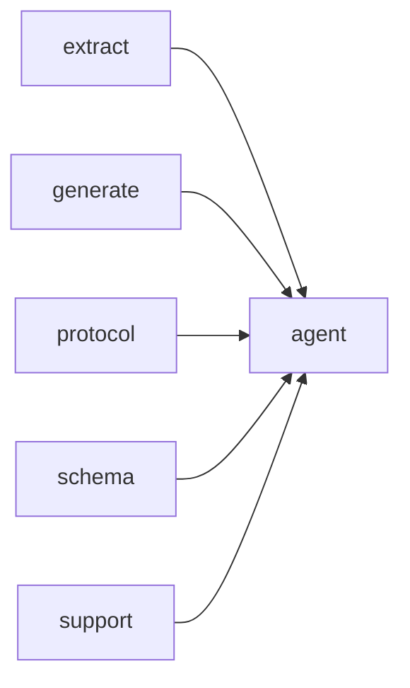

# Module `agent:tools`

## Summary

The `agent:tools` module encapsulates the implementation and dispatch logic for a suite of tools that an agent can use to inspect and manipulate the project's source code and documentation. It defines concrete tool implementations — such as `ProjectOverviewTool`, `ListFilesTool`, `ListModulesTool`, `SearchSymbolsTool`, and `CreateGuideTool` — each with a `run` method that takes arguments and a `ToolContext` and returns a result or error. Supporting infrastructure includes `ToolSpec`, `ToolContext`, `ToolResultCache`, argument type aliases, and utility functions for formatting symbols, normalizing filenames, and building reflected tool definitions.

The module's public interface provides `build_tool_definitions` to register all available tools, `dispatch_tool_call` to route a named tool invocation to its implementation, and `extract_string_arg` to safely extract string values from JSON arguments. It imports the `extract`, `generate`, `protocol`, `schema`, and `support` modules, relying on them for metadata extraction, page generation, API communication, and foundational utilities. The module owns the complete lifecycle of tool definition, caching, and dispatching, enabling the agent to perform queries and modifications on the codebase in a structured way.

## Imports

- [`extract`](../extract/index.md)
- [`generate`](../generate/index.md)
- [`protocol`](../protocol/index.md)
- [`schema`](../schema/index.md)
- `std`
- [`support`](../support/index.md)

## Dependency Diagram

## Types

### `clore::agent::ToolError`

Declaration: `agent/tools.cppm:16`

Definition: `agent/tools.cppm:16`

Declaration: [`Namespace clore::agent`](../../namespaces/clore/agent/index.md)

`clore::agent::ToolError` is implemented as a minimal aggregate struct holding a single `std::string message` member, declared at `agent/tools.cppm:16`. Since no constructors, destructors, or member functions are defined, it relies entirely on the compiler-generated defaults for construction, copy, move, and destruction.

The sole invariant is carried by the `message` field, whose lifetime and validity are managed by `std::string`'s own RAII semantics. Aggregate initialization (e.g. `ToolError{"..."}`) is the expected construction path, keeping the type lightweight and trivially composable within tool-handling code paths.

#### Invariants

- holds an error description in `message`
- aggregate-style struct with public data

#### Key Members

- `std::string message` field carrying the error text

#### Usage Patterns

- constructed to convey tool-related error details within `clore::agent`

## Variables

### `arguments`

Declaration: `agent/tools.cppm:621`

As a constant reference, `arguments` provides read-only access to a `json::Value` instance. It is intended to be used in surrounding logic without modification, likely to inspect or query the JSON data.

#### Mutation

No mutation is evident from the extracted code.

#### Usage Patterns

- Read-only access via `const` reference to `json::Value`

### `context`

Declaration: `agent/tools.cppm:621`

As a constant reference, `context` provides read-only access to the underlying `ToolContext` object, ensuring that the referenced object is not modified through this variable.

#### Mutation

No mutation is evident from the extracted code.

## Functions

### `clore::agent::build_tool_definitions`

Declaration: `agent/tools.cppm:23`

Definition: `agent/tools.cppm:887`

Declaration: [`Namespace clore::agent`](../../namespaces/clore/agent/index.md)

The implementation of `clore::agent::build_tool_definitions` first retrieves the static tool registry via the function `tool_registry()`, which returns a `const std::array<ToolSpec, 12>&`. It pre-allocates a `std::vector<clore::net::FunctionToolDefinition>` and iterates over every `ToolSpec` in the registry, invoking `tool.build_definition()`. If any call to `build_definition()` returns an error (`std::unexpected<ToolError>`), the function short-circuits and returns that error immediately. Otherwise, the successfully constructed `FunctionToolDefinition` is moved into the result vector. The final vector is returned wrapped in a `std::expected` as the success value. Dependencies are limited to the anonymous namespace’s `tool_registry()` function and the `ToolSpec` type’s `build_definition` method; no external I/O or complex branching occurs outside this iteration.

#### Side Effects

- Allocates dynamic memory for the output vector and moves each tool definition into it

#### Reads From

- the static array of `ToolSpec` objects returned by `tool_registry()`
- each `ToolSpec` visited during iteration

#### Usage Patterns

- Called during agent initialization to obtain tool definitions for network interactions

### `clore::agent::dispatch_tool_call`

Declaration: `agent/tools.cppm:26`

Definition: `agent/tools.cppm:902`

Declaration: [`Namespace clore::agent`](../../namespaces/clore/agent/index.md)

The function first serializes the `arguments` to a JSON string; if serialization fails, it returns a `ToolError`. A cache key is formed by concatenating `tool_name` with the serialized arguments. Using `tool_result_cache()`, it acquires a shared lock and checks whether a result already exists for that key; if so, the cached result is returned immediately, avoiding redundant tool execution.

Otherwise, a `ToolContext` is constructed from the `model`, `project_root`, and `output_root`. The function then iterates over the static `tool_registry()`—an array of `ToolSpec` entries—and locates the tool whose `name` matches `tool_name`. It invokes the `dispatch` function of that `ToolSpec`, passing the parsed `arguments` and the context. If the tool is marked as `cacheable` and the dispatch succeeds, the function acquires a unique lock on the cache and stores the result under the cache key. The dispatch result is returned. If no matching tool is found, an "unknown tool" `ToolError` is returned.

#### Side Effects

- acquires shared lock on the global tool result cache mutex
- acquires unique lock on the global tool result cache mutex
- inserts or assigns a result into the global tool result cache when the tool is cacheable and dispatch succeeds

#### Reads From

- `tool_name` parameter
- `arguments` parameter (serialized to string)
- `model` parameter
- `project_root` parameter
- `output_root` parameter
- global `tool_result_cache()` map
- global `tool_registry()` collection
- result of `tool.dispatch` call

#### Writes To

- global `tool_result_cache()` map (inserts or assigns key-value pairs when tool is cacheable and dispatch succeeds)

#### Usage Patterns

- called by agent execution functions like `run_agent_async` or `run_agent`
- used to invoke named tools with automatic caching of successful results

### `clore::agent::extract_string_arg`

Declaration: `agent/tools.cppm:20`

Definition: `agent/tools.cppm:865`

Declaration: [`Namespace clore::agent`](../../namespaces/clore/agent/index.md)

The implementation of `clore::agent::extract_string_arg` performs a linear scan over the JSON object entries to locate the field matching the given `field_name`. It first validates that the input `arguments` is a JSON object, returning `std::unexpected(ToolError{.message = "arguments is not an object"})` if the check fails. After obtaining a pointer to the underlying object (returning an error if the pointer is null), it iterates through each entry comparing `entry.key` to `field_name`. On a matching key, it attempts to retrieve the value as a string via `entry.value.get_string()`; if that succeeds, the string is returned. If the value is not a string, an error is returned stating that the field is not a string. If no entry with the given key is found, the function returns a missing‑field error. The entire control flow relies on the `json::Value`, `json::Object`, `std::expected`, and `ToolError` types, with error messages formatted via `std::format`. No recursion or external caching is used; the search is purely sequential.

#### Side Effects

No observable side effects are evident from the extracted code.

#### Reads From

- Parameter `arguments` of type `const json::Value&`
- Parameter `field_name` of type `std::string_view`
- Internal JSON object entries via `get_object()`

#### Usage Patterns

- Called by `clore::agent::dispatch_tool_call` to extract a required string argument from a tool call's JSON parameters
- Used within the tool‑call dispatch flow to parse individual fields of the argument object

## Internal Structure

The `agent:tools` module (`agent/tools.cppm`) implements the tool dispatch system for the agent, structuring each tool as a stateless struct with a `run` method, a `name`, a `cacheable` flag, and a `description`. Twelve such tools are defined in an anonymous namespace, covering project overview, file listing, symbol search, module discovery, dependency inspection, namespace exploration, symbol detail retrieval, and guide creation/reading. A `ToolSpec` struct holds the name, cacheability, a `build_definition` function, and a `dispatch` function; the tools are registered into a static `std::array<ToolSpec, 12>` via the `tool_registry` function. Internal layering separates tool implementations from dispatch: a generic template `dispatch_reflected_tool` deserialises JSON arguments into the tool’s `Args` type and invokes `run`, while `build_reflected_tool_definition` generates the JSON schema for the tool’s arguments. A `ToolResultCache` (with a mutex and a `result_by_key` map) enables caching of results for cacheable tools, and a dedicated `ToolContext` struct bundles the project root, output root, and a model pointer to pass contextual data to each tool.

The module imports five core submodules: `protocol`, `schema`, `extract`, `generate`, and `support`. This allows tools to construct response strings using the protocol’s types, validate arguments against generated schemas, query extracted project metadata, trigger page generation, and leverage support utilities for path normalisation and logging. The public API consists of `build_tool_definitions` (which returns an integer success code and must be called before any dispatch) and `dispatch_tool_call` (which takes a tool name, JSON arguments, a session identifier, and two ID strings, and returns either a tool output string or a `ToolError`). Internal helpers such as `extract_string_arg`, `normalize_guide_filename`, and the `tool_*` functions encapsulate argument parsing and core logic, keeping each tool’s `run` method focused on orchestration.

## Related Pages

- [Module extract](../extract/index.md)
- [Module generate](../generate/index.md)
- [Module protocol](../protocol/index.md)
- [Module schema](../schema/index.md)
- [Module support](../support/index.md)

