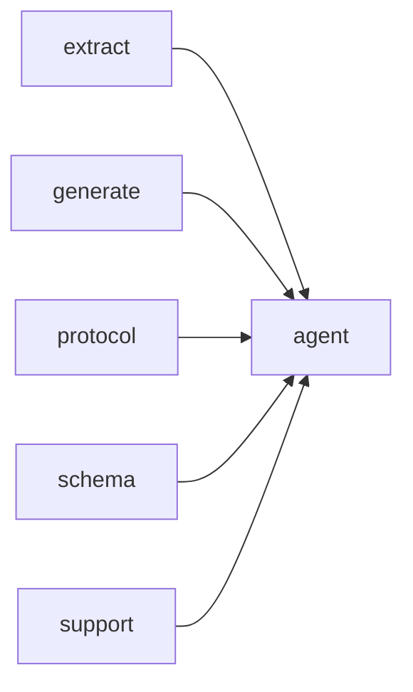

# Module `agent:tools`

## Summary

The `agent:tools` module implements the tool interface for the Clore agent, providing a collection of actionable tools that the agent can invoke to inspect and manipulate a C++ project’s metadata. It owns the definition, argument extraction, dispatch, and result caching for a set of around twelve concrete tools, including `ProjectOverviewTool`, `ListModulesTool`, `ListNamespacesTool`, `ListFilesTool`, `GetModuleTool`, `GetNamespaceTool`, `GetSymbolTool`, `GetFileSymbolsTool`, `SearchSymbolsTool`, `GetDependenciesTool`, `ReadGuideTool`, and `CreateGuideTool`. Each tool is backed by a function‑like implementation that operates on a shared `ToolContext` (providing the project root, output root, and model identifier) and returns either a string result or a `ToolError`.  

The module’s public interface consists of `build_tool_definitions()` (to register all tools), `dispatch_tool_call()` (to route a named tool call with JSON arguments to the correct implementation), and the utility function `extract_string_arg()` for safely extracting string parameters from JSON. Internally, it uses a static `tool_registry` array of `ToolSpec` records, a `ToolResultCache` for caching results of cache‑enabled tools, and several helper functions for formatting symbol details, sorting matches, and normalising guide filenames. The module depends on the `extract`, `generate`, `protocol`, `schema`, and `support` modules to perform its work.

## Imports

- [`extract`](../extract/index.md)
- [`generate`](../generate/index.md)
- [`protocol`](../protocol/index.md)
- [`schema`](../schema/index.md)
- [`support`](../support/index.md)

## Dependency Diagram

```mermaid
graph LR
    M0["agent"]
    I0["extract"]
    I0 --> M0
    I1["generate"]
    I1 --> M0
    I2["protocol"]
    I2 --> M0
    I3["schema"]
    I3 --> M0
    I4["support"]
    I4 --> M0
```

## Types

### `clore::agent::ToolError`

Declaration: `src/agent/tools.cppm:28`

Definition: `src/agent/tools.cppm:28`

Declaration: [`Namespace clore::agent`](../../namespaces/clore/agent/index.md)

The struct `clore::agent::ToolError` is implemented as a thin wrapper around a `std::string` member named `message`. Its entire internal structure consists solely of this field, which stores a human‑readable description of the error. No additional invariants are enforced; any valid `std::string` is permitted, including the empty string. The type serves as a lightweight, value‑oriented error representation within the agent tool subsystem, and all meaningful behavior is delegated to the contained string.

#### Invariants

- The `message` string is not guaranteed to be non-empty.

#### Key Members

- `message`: stores the error description as a `std::string`.

#### Usage Patterns

- Used to convey tool-level errors in the agent's error handling flow.
- Likely returned or thrown when a tool operation fails.

## Variables

### `arguments`

Declaration: `src/agent/tools.cppm:633`

The `const` qualifier ensures that `arguments` cannot be mutated through this reference. It is intended to be read-only, providing access to JSON argument data.

#### Mutation

No mutation is evident from the extracted code.

### `context`

Declaration: `src/agent/tools.cppm:633`

As a `const` reference, `context` cannot be modified and is used to inspect or query properties of the `ToolContext` without copying. It participates in surrounding logic by supplying contextual data for tool execution.

#### Mutation

No mutation is evident from the extracted code.

#### Usage Patterns

- function parameter
- read-only access to `ToolContext`

## Functions

### `clore::agent::build_tool_definitions`

Declaration: `src/agent/tools.cppm:35`

Definition: `src/agent/tools.cppm:899`

Declaration: [`Namespace clore::agent`](../../namespaces/clore/agent/index.md)

The function `clore::agent::build_tool_definitions` iterates over the static registry returned by `tool_registry()`, which contains twelve `ToolSpec` entries. For each entry, it invokes the stored `build_definition` callback (of type `auto () -> std::expected<std::string, ToolError>`) and collects the successfully built definitions into a `std::vector<clore::net::FunctionToolDefinition>`. If any individual `build_definition` call fails, the error is immediately propagated by returning `std::unexpected` containing the moved `ToolError`. The function reserves capacity equal to the registry size to avoid reallocation during the loop. Its only direct dependency is the `tool_registry()` function that provides the ordered set of tool specifications.

#### Side Effects

No observable side effects are evident from the extracted code.

#### Reads From

- `tool_registry()` (returns `const std::array<ToolSpec, 12>&`)

#### Usage Patterns

- called to collect all tool definitions for agent use
- used during initialization of `run_agent` and similar orchestration functions

### `clore::agent::dispatch_tool_call`

Declaration: `src/agent/tools.cppm:38`

Definition: `src/agent/tools.cppm:914`

Declaration: [`Namespace clore::agent`](../../namespaces/clore/agent/index.md)

The function first serializes the incoming `arguments` to a JSON string via `json::to_string`; if serialization fails, it returns an unexpected `ToolError` describing the failure. It then constructs a `cache_key` from the `tool_name` and the serialized arguments and consults the process-wide singleton returned by `tool_result_cache()`. Under a shared lock it checks the `result_by_key` map; if a cached result exists, it is returned immediately. Otherwise, a `ToolContext` is built from the provided `model`, `project_root`, and `output_root`, and the function iterates over the entries from `tool_registry()`. Each entry is a `ToolSpec` whose `name` is compared to the requested `tool_name`; upon a match, the corresponding `dispatch` function is invoked with the `arguments` and `context`. If the tool is `cacheable` and the dispatch succeeds, the result is stored in the cache under an exclusive lock for subsequent calls. If no matching tool is found, the function returns an unexpected `ToolError` indicating an unknown tool.

#### Side Effects

- Updates tool result cache under mutex protection

#### Reads From

- `tool_name` parameter
- arguments parameter
- model parameter
- `project_root` parameter
- `output_root` parameter
- `tool_result_cache()` global cache (`shared_lock` read)
- `tool_registry()` global registry

#### Writes To

- `tool_result_cache()` cache via `unique_lock` `insert_or_assign`

#### Usage Patterns

- Used to dispatch tool calls with caching
- Called from agent execution loops like `run_agent` or `run_agent_async`

### `clore::agent::extract_string_arg`

Declaration: `src/agent/tools.cppm:32`

Definition: `src/agent/tools.cppm:877`

Declaration: [`Namespace clore::agent`](../../namespaces/clore/agent/index.md)

The function first validates that the provided `arguments` JSON value is an object; if not, it returns a `ToolError` with an appropriate message. It then obtains the underlying object representation via `get_object()` and iterates over its entries. For each entry, it compares the key (`entry.first`) against the requested `field_name`. When a match is found, it attempts to extract a string from the value using `get_string()`. If the extraction succeeds, the string is returned; otherwise, a `ToolError` is returned indicating the field is not a string. If no matching key is found after the iteration completes, the function returns a `ToolError` stating the field is missing. This routine depends on the JSON library’s object iteration and string extraction, `std::format` for error messages, and the `ToolError` type for error reporting.

#### Side Effects

No observable side effects are evident from the extracted code.

#### Reads From

- `arguments` parameter
- `field_name` parameter

#### Usage Patterns

- Extract required string field from tool call arguments

## Internal Structure

The `agent:tools` module is decomposed into a minimal public API — `dispatch_tool_call`, `build_tool_definitions`, and `extract_string_arg` — and an internal implementation layer within an anonymous namespace. The internal layer defines a family of tool structs (e.g., `ListFilesTool`, `GetSymbolTool`, `ReadGuideTool`), each with a static `name`, `description`, `cacheable` flag, and a `run` method that accepts the tool’s arguments and a `ToolContext`. These common properties are captured in the `ToolSpec` structure, which is built from each tool via the template `make_tool_spec`. The dispatch mechanism leverages `dispatch_reflected_tool` to route a JSON arguments object to the appropriate tool’s `run` method without manual switch logic, and `ToolResultCache` provides thread-safe caching keyed on tool-specific arguments. The module imports `extract`, `generate`, `protocol`, `schema`, and `support`; these provide the underlying project data, output generation, LLM communication, JSON schema support, and utility functions that the tools rely on. This layered structure keeps the public interface simple while allowing new tools to be added by defining a struct and including it in the static registry.

## Related Pages

- [Module extract](../extract/index.md)
- [Module generate](../generate/index.md)
- [Module protocol](../protocol/index.md)
- [Module schema](../schema/index.md)
- [Module support](../support/index.md)

