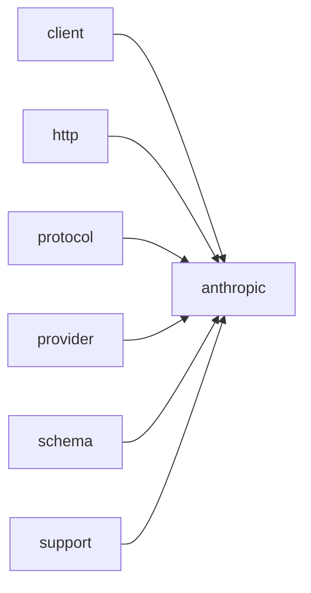

# Module `anthropic`

## Summary

The `anthropic` module implements protocol-level support for the Anthropic API within the broader LLM networking library. Its core responsibility is to construct, validate, and serialize requests conforming to the Anthropic Messages API format, and to parse responses into structured data that can be consumed by higher-level client abstractions. The module owns the `clore::net::anthropic` namespace, which contains three primary sub-areas: `protocol` for request building (`build_request_json`, `build_messages_url`, response parsing functions like `parse_response` and `text_from_response`), `detail` for internal utilities (environment variable reading, header construction, URL building, and validation), and `schema` for generating Anthropic-compatible tool and response format definitions.

The public-facing implementation scope includes the asynchronous calling functions `call_llm_async`, `call_completion_async`, and `call_structured_async`, which accept model identifiers, prompts, and event loop references, returning handles for pending operations. These functions bridge the generic client layer with Anthropic-specific request construction and response handling. The module also exposes constants for environment variable names (`kAnthropicApiKeyEnv`, `kAnthropicBaseUrlEnv`) and protocol versioning (`kAnthropicVersion`), enabling callers to configure and interact with the Anthropic API endpoint.

## Imports

- [`client`](../client/index.md)
- [`http`](../http/index.md)
- [`protocol`](../protocol/index.md)
- [`provider`](../provider/index.md)
- [`schema`](../schema/index.md)
- `std`
- [`support`](../support/index.md)

## Dependency Diagram



## Types

### `clore::net::anthropic::detail::Protocol`

Declaration: `network/anthropic.cppm:654`

Definition: `network/anthropic.cppm:654`

Declaration: [`Namespace clore::net::anthropic::detail`](../../namespaces/clore/net/anthropic/detail/index.md)

The struct `clore::net::anthropic::detail::Protocol` is a stateless policy class that bundles all Anthropic-specific networking steps into a single, internal interface. Every member is `static`; no instance state exists. The implementation enforces a strict pipeline: configuration is read from the environment via `read_environment`, which calls `clore::net::detail::read_credentials` with the constants `kAnthropicBaseUrlEnv` and `kAnthropicApiKeyEnv`. The URL is built by `build_url`, which delegates to `clore::net::anthropic::protocol::build_messages_url`, and the request JSON is produced by `build_request_json`, which in turn delegates to `clore::net::anthropic::protocol::build_request_json`. The headers constructed by `build_headers` always include `Content-Type`, `x-api-key`, and `anthropic-version`, with the version string taken from the constant `kAnthropicVersion`. The parsing logic in `parse_response` guards against empty bodies and then calls `clore::net::anthropic::protocol::parse_response`; if the HTTP status is >= 400, an error message with the HTTP code and an excerpt of the response body is generated, maintaining the invariant that any error path returns a descriptive `LLMError`. Finally, `capability_probe_key` produces a deterministic key by combining the provider name, the base URL from the environment, and the model identifier using `clore::net::make_capability_probe_key`.

#### Invariants

- All members are static; no instance state exists.
- Environment configuration must provide `api_base` and `api_key`.
- HTTP response parsing expects a non-empty body for success.
- Error mapping respects HTTP status codes >= 400.

#### Key Members

- `read_environment`
- `build_url`
- `build_headers`
- `build_request_json`
- `parse_response`
- `provider_name`
- `capability_probe_key`

#### Usage Patterns

- Used as a protocol policy for generic API client code that calls these static methods.
- Relied upon by higher-level networking to construct and send Anthropic API requests.
- Provides the provider identifier for capability probe key generation.

#### Member Functions

##### `clore::net::anthropic::detail::Protocol::build_headers`

Declaration: `network/anthropic.cppm:667`

Definition: `network/anthropic.cppm:667`

Declaration: [`Namespace clore::net::anthropic::detail`](../../namespaces/clore/net/anthropic/detail/index.md)

###### Implementation

```cpp
static auto build_headers(const clore::net::detail::EnvironmentConfig& environment)
        -> std::vector<kota::http::header> {
        return std::vector<kota::http::header>{
            kota::http::header{
                               .name = "Content-Type",
                               .value = "application/json; charset=utf-8",
                               },
            kota::http::header{
                               .name = "x-api-key",
                               .value = environment.api_key,
                               },
            kota::http::header{
                               .name = "anthropic-version",
                               .value = std::string(kAnthropicVersion),
                               },
        };
    }
```

##### `clore::net::anthropic::detail::Protocol::build_request_json`

Declaration: `network/anthropic.cppm:685`

Definition: `network/anthropic.cppm:685`

Declaration: [`Namespace clore::net::anthropic::detail`](../../namespaces/clore/net/anthropic/detail/index.md)

###### Implementation

```cpp
static auto build_request_json(const CompletionRequest& request)
        -> std::expected<std::string, LLMError> {
        return clore::net::anthropic::protocol::build_request_json(request);
    }
```

##### `clore::net::anthropic::detail::Protocol::build_url`

Declaration: `network/anthropic.cppm:663`

Definition: `network/anthropic.cppm:663`

Declaration: [`Namespace clore::net::anthropic::detail`](../../namespaces/clore/net/anthropic/detail/index.md)

###### Implementation

```cpp
static auto build_url(const clore::net::detail::EnvironmentConfig& environment) -> std::string {
        return clore::net::anthropic::protocol::build_messages_url(environment.api_base);
    }
```

##### `clore::net::anthropic::detail::Protocol::capability_probe_key`

Declaration: `network/anthropic.cppm:717`

Definition: `network/anthropic.cppm:717`

Declaration: [`Namespace clore::net::anthropic::detail`](../../namespaces/clore/net/anthropic/detail/index.md)

###### Implementation

```cpp
static auto capability_probe_key(const clore::net::detail::EnvironmentConfig& environment,
                                     const CompletionRequest& request) -> std::string {
        return clore::net::make_capability_probe_key(provider_name(),
                                                     environment.api_base,
                                                     request.model);
    }
```

##### `clore::net::anthropic::detail::Protocol::parse_response`

Declaration: `network/anthropic.cppm:690`

Definition: `network/anthropic.cppm:690`

Declaration: [`Namespace clore::net::anthropic::detail`](../../namespaces/clore/net/anthropic/detail/index.md)

###### Implementation

```cpp
static auto parse_response(const clore::net::detail::RawHttpResponse& raw_response)
        -> std::expected<CompletionResponse, LLMError> {
        if(raw_response.body.empty()) {
            return std::unexpected(LLMError("empty response from Anthropic"));
        }

        auto parsed = clore::net::anthropic::protocol::parse_response(raw_response.body);
        if(!parsed.has_value()) {
            if(raw_response.http_status >= 400) {
                return std::unexpected(
                    LLMError(std::format("Anthropic request failed with HTTP {}: {}",
                                         raw_response.http_status,
                                         clore::net::detail::excerpt_for_error(raw_response.body))));
            }
            return std::unexpected(std::move(parsed.error()));
        }
        if(raw_response.http_status >= 400) {
            return std::unexpected(LLMError(
                std::format("Anthropic request failed with HTTP {}", raw_response.http_status)));
        }
        return std::move(*parsed);
    }
```

##### `clore::net::anthropic::detail::Protocol::provider_name`

Declaration: `network/anthropic.cppm:713`

Definition: `network/anthropic.cppm:713`

Declaration: [`Namespace clore::net::anthropic::detail`](../../namespaces/clore/net/anthropic/detail/index.md)

###### Implementation

```cpp
static auto provider_name() -> std::string_view {
        return "Anthropic";
    }
```

##### `clore::net::anthropic::detail::Protocol::read_environment`

Declaration: `network/anthropic.cppm:655`

Definition: `network/anthropic.cppm:655`

Declaration: [`Namespace clore::net::anthropic::detail`](../../namespaces/clore/net/anthropic/detail/index.md)

###### Implementation

```cpp
static auto read_environment()
        -> std::expected<clore::net::detail::EnvironmentConfig, LLMError> {
        return clore::net::detail::read_credentials(clore::net::detail::CredentialEnv{
            .base_url_env = kAnthropicBaseUrlEnv,
            .api_key_env = kAnthropicApiKeyEnv,
        });
    }
```

## Variables

### `clore::net::anthropic::detail::kAnthropicApiKeyEnv`

Declaration: `network/anthropic.cppm:651`

Declaration: [`Namespace clore::net::anthropic::detail`](../../namespaces/clore/net/anthropic/detail/index.md)

This constant serves as the key for retrieving the Anthropic API key from the process environment. It is declared at `network/anthropic.cppm:651` but no direct usage or mutation is shown in the provided evidence.

#### Mutation

No mutation is evident from the extracted code.

### `clore::net::anthropic::detail::kAnthropicBaseUrlEnv`

Declaration: `network/anthropic.cppm:650`

Declaration: [`Namespace clore::net::anthropic::detail`](../../namespaces/clore/net/anthropic/detail/index.md)

This constant is used as the key to read the `ANTHROPIC_BASE_URL` environment variable at runtime. The retrieved value specifies the base endpoint for Anthropic API requests. It participates in configuration logic alongside other environment variable constants such as `kAnthropicApiKeyEnv`.

#### Mutation

No mutation is evident from the extracted code.

### `clore::net::anthropic::detail::kAnthropicVersion`

Declaration: `network/anthropic.cppm:652`

Declaration: [`Namespace clore::net::anthropic::detail`](../../namespaces/clore/net/anthropic/detail/index.md)

Being `constexpr`, its value is fixed at compile time and is intended to be used throughout the module to identify the API version in requests.

#### Mutation

No mutation is evident from the extracted code.

#### Usage Patterns

- intended to be used as the version string for Anthropic API requests

### `clore::net::anthropic::protocol::detail::kDefaultMaxTokens`

Declaration: `network/anthropic.cppm:23`

Declaration: [`Namespace clore::net::anthropic::protocol::detail`](../../namespaces/clore/net/anthropic/protocol/detail/index.md)

This constant provides a default value for the `max_tokens` parameter when constructing API requests via `build_request_json`. As a `constexpr`, its value is fixed at compile-time and cannot be mutated. The function `build_request_json` likely uses it as a fallback when no explicit token limit is provided.

#### Mutation

No mutation is evident from the extracted code.

#### Usage Patterns

- Referenced in `build_request_json` function as default value for `max_tokens`

## Functions

### `clore::net::anthropic::call_completion_async`

Declaration: `network/anthropic.cppm:729`

Definition: `network/anthropic.cppm:771`

Declaration: [`Namespace clore::net::anthropic`](../../namespaces/clore/net/anthropic/index.md)

The function `clore::net::anthropic::call_completion_async` is a thin coroutine adapter that delegates all work to the generic `clore::net::call_completion_async` template instantiated with the `clore::net::anthropic::detail::Protocol` class. Within that template, the actual algorithm is driven by the protocol’s methods — `Protocol::read_environment` reads environment variables such as `kAnthropicApiKeyEnv` and `kAnthropicBaseUrlEnv`; `Protocol::build_url` constructs the API endpoint via `protocol::build_messages_url`; `Protocol::build_headers` assembles authentication headers; `Protocol::build_request_json` composes the JSON body using helpers like `protocol::detail::make_role_message`, `protocol::detail::format_schema_instruction`, and `protocol::detail::append_text_with_gap`; and `Protocol::parse_response` delegates to `protocol::parse_response` to extract `protocol::detail::parse_json_text` results, tool call blocks via `protocol::detail::make_tool_use_block`, and response text through `protocol::text_from_response`. The function then `co_await`s the generic call and forwards the result via `or_fail()`, effectively chaining the Anthropic‑specific protocol logic into the general completion pipeline.

#### Side Effects

- Makes an asynchronous network request to the Anthropic API through the underlying `clore::net::call_completion_async` function
- The `.or_fail()` call may perform error-type conversion that affects the returned task's error channel

#### Reads From

- `request` (moved into the inner call)
- `loop` (used to schedule the asynchronous operation)
- `detail::Protocol` (type used to specialize the generic call)
- Result of `co_await clore::net::call_completion_async<detail::Protocol>(...)`

#### Writes To

- The `kota::task` object returned (its internal state will be written when the operation completes)

#### Usage Patterns

- Calling this function to initiate an asynchronous LLM completion request to the Anthropic API
- Awaiting the returned `kota::task` to obtain a `CompletionResponse` or handle an `LLMError`

### `clore::net::anthropic::call_llm_async`

Declaration: `network/anthropic.cppm:739`

Definition: `network/anthropic.cppm:789`

Declaration: [`Namespace clore::net::anthropic`](../../namespaces/clore/net/anthropic/index.md)

The function `clore::net::anthropic::call_llm_async` acts as a thin delegation layer: it immediately calls `clore::net::call_llm_async<detail::Protocol>` with the forwarded `model`, `system_prompt`, `prompt`, and a pointer to the `loop`, then applies `.or_fail()` on the returned coroutine to convert any error into an `LLMError` and unwrap the resulting `std::string`. All interactions with the Anthropic API — including building the request JSON and URL, sending the HTTP call, and parsing the response — are encapsulated within `detail::Protocol`, which is used as the template argument for the generic async LLM infrastructure. The function itself contains no request construction or response parsing logic; its sole purpose is to provide a clean, concrete entry point that hides the protocol-parameterised machinery from callers.

#### Side Effects

- Initiates an asynchronous network request to an LLM API via `clore::net::call_llm_async`
- Captures parameters and the event loop for the asynchronous operation
- Cooperatively yields execution until the LLM response is available

#### Reads From

- Parameter `model`
- Parameter `system_prompt`
- Parameter `prompt`
- Parameter `loop` (a `kota::event_loop&`)
- Result of `clore::net::call_llm_async<detail::Protocol>` (including potential error state)

#### Usage Patterns

- Called as a coroutine within an event-loop-driven context
- Used to obtain an LLM-generated string response asynchronously
- Serves as a high-level entry point for Anthropic API interactions, alongside `call_completion_async` and `call_structured_async`

### `clore::net::anthropic::call_llm_async`

Declaration: `network/anthropic.cppm:733`

Definition: `network/anthropic.cppm:778`

Declaration: [`Namespace clore::net::anthropic`](../../namespaces/clore/net/anthropic/index.md)

The function is a coroutine that delegates entirely to the generic `clore::net::call_llm_async` template, which is instantiated with the Anthropic‑specific `detail::Protocol` traits type. This indirection encapsulates all request construction and response parsing logic behind the Protocol abstraction. The function forwards the `model`, `system_prompt`, `PromptRequest`, and `kota::event_loop` reference to that template, then `co_await`s the returned task, converting any failure into an error via `.or_fail()`. Internally, the generic implementation calls `detail::Protocol` methods such as `build_url`, `build_headers`, `build_request_json`, and `parse_response`, which in turn rely on helpers in `clore::net::anthropic::protocol` (e.g., `build_messages_url`, `make_role_message`, `make_text_block`, `parse_json_text`, `format_schema_instruction`, `validate_request`) and environment variables like `kAnthropicApiKeyEnv` and `kAnthropicBaseUrlEnv`. The resulting HTTP request is dispatched through the event loop, and the response is parsed to produce the final string result.

#### Side Effects

- initiation of an asynchronous network request to the Anthropic API (via delegation to `clore::net::call_llm_async`)

#### Reads From

- `model` parameter
- `system_prompt` parameter
- `request` parameter (moved)
- `loop` parameter
- `clore::net::call_llm_async<detail::Protocol>` template function

#### Usage Patterns

- asynchronous LLM call with error propagation
- high-level wrapper over the core networking layer

### `clore::net::anthropic::call_structured_async`

Declaration: `network/anthropic.cppm:746`

Definition: `network/anthropic.cppm:801`

Declaration: [`Namespace clore::net::anthropic`](../../namespaces/clore/net/anthropic/index.md)

The function delegates directly to the generic `clore::net::call_structured_async` template, instantiating it with `clore::net::anthropic::detail::Protocol` as the protocol type. It passes the `model`, `system_prompt`, `prompt`, and a pointer to the `kota::event_loop` unchanged, then invokes `.or_fail()` on the returned task to convert any failure into an exception, yielding a `kota::task<T, LLMError>`. This structure isolates the Anthropic-specific protocol logic within `detail::Protocol`, which provides the core implementation for building requests, parsing responses, and handling tool calls. The function itself is purely an async adapter that makes the structured call interface available for the Anthropic provider by reusing the common call path.

#### Side Effects

- Performs asynchronous network I/O to the Anthropic API via the underlying `call_structured_async`
- Suspends and resumes the calling coroutine on the provided event loop

#### Reads From

- `model`, `system_prompt`, `prompt` string views
- the `kota::event_loop` reference for scheduling
- the result from the delegated `call_structured_async` call

#### Writes To

- the returned `kota::task<T, LLMError>` object (constructed and set via coroutine machinery)

#### Usage Patterns

- Called with a concrete type `T` for structured response deserialization
- Used in asynchronous contexts where a coroutine handles the result
- Typically chained with other `kota::task` combinators or awaited directly

### `clore::net::anthropic::protocol::append_tool_outputs`

Declaration: `network/anthropic.cppm:209`

Definition: `network/anthropic.cppm:628`

Declaration: [`Namespace clore::net::anthropic::protocol`](../../namespaces/clore/net/anthropic/protocol/index.md)

The implementation of `clore::net::anthropic::protocol::append_tool_outputs` is a direct delegation to the base protocol function `clore::net::protocol::append_tool_outputs`. It accepts a `std::span<const Message>` for the conversation history, a `const CompletionResponse&` containing the model’s last response, and a `std::span<const ToolOutput>` with the tool execution results. The function forwards these three arguments unchanged and returns the same `std::expected<std::vector<Message>, LLMError>` produced by the underlying call.

Internally, no Anthropic‑specific logic is applied at this level; the method serves as a pass‑through that adapts the generic protocol helper into the `clore::net::anthropic` namespace. The sole dependency is the common `clore::net::protocol::append_tool_outputs` implementation, which handles the actual task of creating tool result messages and appending them to the history for a subsequent inference request.

#### Side Effects

No observable side effects are evident from the extracted code.

#### Reads From

- history
- response
- outputs

#### Usage Patterns

- Delegates to generic protocol function
- Used to incorporate tool outputs into a message history

### `clore::net::anthropic::protocol::build_messages_url`

Declaration: `network/anthropic.cppm:201`

Definition: `network/anthropic.cppm:224`

Declaration: [`Namespace clore::net::anthropic::protocol`](../../namespaces/clore/net/anthropic/protocol/index.md)

Implementation: [Implementation](functions/build-messages-url.md)

`clore::net::anthropic::protocol::build_messages_url` normalises the provided `api_base` string by stripping trailing forward slashes, then determines the correct path to append for the Anthropic messages endpoint. If the cleaned base already ends with `"/v1"`, it appends the literal `"messages"` via `clore::net::detail::append_url_path`; otherwise it appends `"v1/messages"`. This logic ensures the resulting URL always points to the standard Anthropic `messages` API path regardless of whether the caller supplies a base URL that includes the version segment. The function depends solely on `clore::net::detail::append_url_path` (a generic path‑appending utility) and performs no network or I/O operations itself.

#### Side Effects

No observable side effects are evident from the extracted code.

#### Reads From

- parameter `api_base`

#### Usage Patterns

- called by `clore::net::anthropic::detail::Protocol::build_url` to produce the messages endpoint URL

### `clore::net::anthropic::protocol::build_request_json`

Declaration: `network/anthropic.cppm:203`

Definition: `network/anthropic.cppm:235`

Declaration: [`Namespace clore::net::anthropic::protocol`](../../namespaces/clore/net/anthropic/protocol/index.md)

The function first validates the provided `CompletionRequest` via `detail::validate_request`; on failure it immediately returns the error. After validation, it constructs a JSON root object, inserts the `model` and a constant `max_tokens` value, then builds a `messages` array by iterating over `request.messages`. Each message is dispatched using `std::visit`: `SystemMessage` content is aggregated into a `system_text` string via `detail::append_text_with_gap` and omitted from the array; other message types are converted to JSON role objects using `detail::make_role_message`, either with a single content string or an array of content blocks (text, `tool_use`, or `tool_result` blocks). Tool‑related blocks are assembled using `detail::make_text_block`, `detail::make_tool_use_block`, and `detail::make_tool_result_block`. After processing all messages, if a `response_format` is present, a schema instruction is appended to `system_text` via `detail::format_schema_instruction` and then `detail::append_text_with_gap`. The accumulated `system_text`, if non‑empty, is inserted as the `"system"` field. The `messages` array is then added to the root.

Optionally, the function serializes the `tools` array from `request.tools`, building each tool object with `name`, `description`, and a cloned `input_schema`. A `tool_choice` object is created if `request.tool_choice` is set or `parallel_tool_calls` is false; its `type` field is determined via `std::visit` on the tool choice variant, and `disable_parallel_tool_use` is added when appropriate. Finally, the entire JSON object is serialized via `kota::codec::json::to_string` and returned as a `std::string`, or an error is propagated from any helper invocation. Key dependencies include `detail::validate_request`, `detail::append_text_with_gap`, the block‑ and role‑making functions, and infrastructure from `clore::net::detail` for JSON construction.

#### Side Effects

No observable side effects are evident from the extracted code.

#### Reads From

- `request.model`
- `request.messages`
- `request.response_format`
- `request.tools`
- `request.tool_choice`
- `request.parallel_tool_calls`
- `detail::kDefaultMaxTokens`

#### Usage Patterns

- Construct HTTP request payload for Anthropic API
- Serialize `CompletionRequest` to JSON string

### `clore::net::anthropic::protocol::detail::append_text_with_gap`

Declaration: `network/anthropic.cppm:25`

Definition: `network/anthropic.cppm:25`

Declaration: [`Namespace clore::net::anthropic::protocol::detail`](../../namespaces/clore/net/anthropic/protocol/detail/index.md)

Implementation: [Implementation](functions/append-text-with-gap.md)

The function `clore::net::anthropic::protocol::detail::append_text_with_gap` appends a given `std::string_view text` to a `std::string& target` while inserting a gap separator when both strings are non‑empty. The control flow begins with an early return if `text` is empty, preserving the existing content of `target`. If `target` is not already empty, a double newline (`"\n\n"`) is appended to separate the previously stored content from the incoming `text`. Finally, the `text` itself is appended. This ensures that accumulated text blocks are visually separated by a blank line, while avoiding leading whitespace for the first block. The implementation relies solely on `std::string` and `std::string_view` operations, with no external dependencies beyond the standard library.

#### Side Effects

- Mutates the `target` string by appending `text` and optionally inserting a double-newline separator.

#### Reads From

- `target` parameter (reads its current content to check if empty for separator insertion)
- `text` parameter (reads its content and checks emptiness)

#### Writes To

- `target` parameter (appends separator and `text` content)

#### Usage Patterns

- Used by `build_request_json` to accumulate JSON text blocks with gap separation.

### `clore::net::anthropic::protocol::detail::format_schema_instruction`

Declaration: `network/anthropic.cppm:176`

Definition: `network/anthropic.cppm:176`

Declaration: [`Namespace clore::net::anthropic::protocol::detail`](../../namespaces/clore/net/anthropic/protocol/detail/index.md)

The function begins by checking whether the `schema` member of the provided `ResponseFormat` is populated. If absent, it immediately returns a hardcoded instruction string that tells the model to output only a JSON object without markdown fences. When a schema is present, the function calls `json::to_string` to serialize the schema value into a JSON string representation. If serialization fails, it delegates error handling to `clore::net::detail::unexpected_json_error`, constructing an `LLMError` result from the serialization error. On successful serialization, it uses `std::format` to produce a combined instruction that includes the schema's `name` and the serialized JSON text, again warning against markdown fences. The resulting string is returned inside a `std::expected<std::string, LLMError>`. The only external dependencies are the JSON serialization utility, the custom error helper, `std::format`, and the `ResponseFormat` type's members.

#### Side Effects

No observable side effects are evident from the extracted code.

#### Reads From

- `format.schema`
- `format.name`
- `json::to_string` (reads the JSON value)

#### Usage Patterns

- Called to format the JSON schema instruction for LLM prompts
- Used in constructing conversation messages with tool-use or structured output

### `clore::net::anthropic::protocol::detail::make_role_message`

Declaration: `network/anthropic.cppm:154`

Definition: `network/anthropic.cppm:154`

Declaration: [`Namespace clore::net::anthropic::protocol::detail`](../../namespaces/clore/net/anthropic/protocol/detail/index.md)

The function constructs a JSON object representing a role‑tagged message for the Anthropic Messages API. It first calls `clore::net::detail::make_empty_object` to allocate an empty `json::Object`; if that fails, the error is propagated immediately via `std::unexpected`. Next, `clore::net::detail::insert_string_field` is used to set the `"role"` key to the given `role` string. If insertion fails (e.g., due to a duplicate key), the error is again returned as an unexpected result. Finally, the `blocks` array is moved directly into the object under the key `"content"`. The function relies on two utility helpers from the lower‑level `clore::net::detail` namespace for object creation and safe field insertion, and returns a `std::expected<json::Object, LLMError>` to unify success and error paths.

#### Side Effects

- Moves the input `blocks` array into the newly created JSON object
- Allocates a new `json::Object`
- Inserts a string field and an array field into that object

#### Reads From

- Parameter `role`
- Parameter `blocks` (via move)

#### Writes To

- Returned `json::Object`

#### Usage Patterns

- Constructing a message object for Anthropic API requests
- Associating a role string with a list of content blocks

### `clore::net::anthropic::protocol::detail::make_role_message`

Declaration: `network/anthropic.cppm:130`

Definition: `network/anthropic.cppm:130`

Declaration: [`Namespace clore::net::anthropic::protocol::detail`](../../namespaces/clore/net/anthropic/protocol/detail/index.md)

The function `clore::net::anthropic::protocol::detail::make_role_message` constructs a JSON object representing a single message in the Anthropic Messages API format. It first creates an empty JSON object via `clore::net::detail::make_empty_object`, propagating any failure immediately as an `std::unexpected` error. The `role` parameter is then inserted as a string field using `clore::net::detail::insert_string_field`. The `text` content is normalized with `clore::net::detail::normalize_utf8` before being inserted as the `content` field. On any insertion failure, the function returns the error. The internal control flow follows a linear sequence of fallible steps, each checking the status of the previous operation and returning early on error.

The implementation depends on three utilities from `clore::net::detail`: `make_empty_object` for creating the initial JSON container, `insert_string_field` for safely adding key-value pairs, and `normalize_utf8` for ensuring the text content is valid UTF-8. All error paths return `LLMError` wrapped in `std::unexpected`.

#### Side Effects

No observable side effects are evident from the extracted code.

#### Reads From

- parameters `role` and `text`

#### Usage Patterns

- Used to generate a JSON role-content message pair for Anthropic protocol, typically as part of building a request payload.

### `clore::net::anthropic::protocol::detail::make_text_block`

Declaration: `network/anthropic.cppm:35`

Definition: `network/anthropic.cppm:35`

Declaration: [`Namespace clore::net::anthropic::protocol::detail`](../../namespaces/clore/net/anthropic/protocol/detail/index.md)

The function constructs a JSON object representing a text content block for the Anthropic API. It first creates an empty object via `clore::net::detail::make_empty_object`, aborting with the propagated error if that fails. It then inserts a `"type"` field set to the string `"text"` using `clore::net::detail::insert_string_field`, again returning early on failure. The input text is normalized through `clore::net::detail::normalize_utf8` to ensure valid UTF‑8, and the result is inserted as a `"text"` field. Each insertion step returns a `std::expected` and is checked for errors; any error immediately yields `std::unexpected` with the corresponding `LLMError`. The function depends on `clore::net::detail` utilities for object creation, string insertion, and UTF‑8 normalization, and follows a straight‑line control flow with three sequential error‑handled steps before returning the completed block.

#### Side Effects

- allocates a new `json::Object` and its contained strings
- normalizes UTF-8 input, which may allocate a new string

#### Reads From

- parameter `text`

#### Writes To

- returns a newly constructed `json::Object`

#### Usage Patterns

- creating text blocks for Anthropic API requests
- building message content parts in the protocol layer

### `clore::net::anthropic::protocol::detail::make_tool_result_block`

Declaration: `network/anthropic.cppm:98`

Definition: `network/anthropic.cppm:98`

Declaration: [`Namespace clore::net::anthropic::protocol::detail`](../../namespaces/clore/net/anthropic/protocol/detail/index.md)

The function constructs a JSON object representing an Anthropic tool‑result content block. It first calls `clore::net::detail::make_empty_object` to allocate an empty `json::Object` and returns a `std::unexpected` on failure. Then it sequentially inserts three string fields using `clore::net::detail::insert_string_field`: the literal `"type"` (value `"tool_result"`), the `"tool_use_id"` taken directly from the input `ToolResultMessage` parameter `message.tool_call_id`, and finally the `"content"` field. The content value is first normalized via `clore::net::detail::normalize_utf8` applied to `message.content`. Each insertion is checked for success; the function returns the appropriate `std::unexpected` upon the first error. If all inserts succeed, the constructed `json::Object` is returned as a `std::expected`.

#### Side Effects

- allocates JSON objects and strings
- may allocate memory during UTF-8 normalization

#### Reads From

- parameter `message`
- `message.tool_call_id`
- `message.content`

#### Writes To

- local variable `block`
- underlying JSON object modified via `insert_string_field`

#### Usage Patterns

- called to create `tool_result` blocks for Anthropic assistant responses
- used in higher-level message construction functions

### `clore::net::anthropic::protocol::detail::make_tool_use_block`

Declaration: `network/anthropic.cppm:58`

Definition: `network/anthropic.cppm:58`

Declaration: [`Namespace clore::net::anthropic::protocol::detail`](../../namespaces/clore/net/anthropic/protocol/detail/index.md)

The function first validates that the `call.arguments` member is an JSON object; otherwise it returns an error. It then creates an empty JSON object via `clore::net::detail::make_empty_object`, propagating any failure. The control flow proceeds linearly: each required field—`type`, `id`, and `name`—is inserted into the block using `clore::net::detail::insert_string_field`, and each insertion is checked for success. Finally, the `input` field is set by cloning `call.arguments` with `clore::net::detail::clone_value`, and the completed block is returned. The entire sequence is built on `std::expected` error handling, aborting at the first failure and forwarding the underlying `LLMError`.

#### Side Effects

- allocates a JSON object
- inserts string fields into JSON object
- clones a JSON value
- moves cloned value into object
- returns error state on failure

#### Reads From

- `ToolCall::arguments`
- `ToolCall::id`
- `ToolCall::name`

#### Writes To

- inserts 'type' field
- inserts 'id' field
- inserts 'name' field
- inserts 'input' field
- may write `LLMError` into expected

#### Usage Patterns

- used when constructing Anthropic API requests that include tool use blocks
- called by higher-level functions building message content or request bodies

### `clore::net::anthropic::protocol::detail::parse_json_text`

Declaration: `network/anthropic.cppm:171`

Definition: `network/anthropic.cppm:171`

Declaration: [`Namespace clore::net::anthropic::protocol::detail`](../../namespaces/clore/net/anthropic/protocol/detail/index.md)

The implementation of `parse_json_text` serves as a thin wrapper around the shared parsing utility `clore::net::detail::parse_json_object`. It forwards both the `raw` JSON string and the `context` `string_view` directly to that function, relying entirely on it for the actual JSON deserialization and error handling. No additional validation, transformation, or control flow is introduced at this level. The function’s sole purpose is to specialize the generic parser for the Anthropic protocol domain, accepting the same arguments and returning the same `std::expected<json::Object, LLMError>` result. The dependency on `clore::net::detail::parse_json_object` ensures consistent parsing semantics and error reporting across different network providers.

#### Side Effects

No observable side effects are evident from the extracted code.

#### Reads From

- parameter `raw` of type `std::string_view`
- parameter `context` of type `std::string_view`

#### Usage Patterns

- parsing JSON objects from raw text strings
- delegating to the core JSON parser `clore::net::detail::parse_json_object`
- used in Anthropic protocol message construction or response processing

### `clore::net::anthropic::protocol::detail::validate_request`

Declaration: `network/anthropic.cppm:193`

Definition: `network/anthropic.cppm:193`

Declaration: [`Namespace clore::net::anthropic::protocol::detail`](../../namespaces/clore/net/anthropic/protocol/detail/index.md)

The implementation of `clore::net::anthropic::protocol::detail::validate_request` is a thin delegating wrapper. Its single responsibility is to forward the incoming `CompletionRequest` to the shared generic validator `clore::net::detail::validate_completion_request`, passing the request and two `false` boolean flags. The flags likely indicate that no special validation modes (such as streaming or tool-specific checks) are required for this particular invocation path.

The internal control flow is trivial: the function simply returns the result of that delegated call, which is `std::expected<void, LLMError>`. The only dependencies are the `CompletionRequest` type and the common validation function located in the `clore::net::detail` namespace. No further transformation, error wrapping, or additional logic is performed; the function exists to provide a protocol‑specific entry point that enforces the same validation rules used across other parts of the Anthropic provider implementation.

#### Side Effects

No observable side effects are evident from the extracted code.

#### Reads From

- const `CompletionRequest` & request

#### Usage Patterns

- Called to validate a completion request before submitting to the API.

### `clore::net::anthropic::protocol::parse_response`

Declaration: `network/anthropic.cppm:205`

Definition: `network/anthropic.cppm:460`

Declaration: [`Namespace clore::net::anthropic::protocol`](../../namespaces/clore/net/anthropic/protocol/index.md)

The function first deserializes the incoming `json_text` via `detail::parse_json_text` and checks for a top-level `"error"` field; if present, it extracts the `"error.message"` string and returns an `LLMError`. After that, it validates the presence and type of the required `"id"` and `"model"` fields. The optional `"stop_reason"` field is read with a default of `"end_turn"`; a value of `"max_tokens"` causes an early error return.

The body of the response is processed by iterating the `"content"` array. For each content block the function inspects the `"type"` field: blocks of type `"text"` accumulate their text into either a `refusal` or a `text` string depending on `stop_reason`, while blocks of type `"tool_use"` are parsed for `"id"`, `"name"`, and an `"input"` object. The input object is cloned, serialized to a JSON string via `kota::codec::json::to_string`, and then re-parsed with `kota::codec::json::parse` to produce the `arguments` value and its JSON representation, which are stored in a `ToolCall` appended to the output. Blocks with other types are silently skipped. Finally, the non-empty text, refusal, and tool calls are bundled into an `AssistantOutput` and returned inside a `CompletionResponse` along with the original `id`, `model`, and raw JSON string.

#### Side Effects

No observable side effects are evident from the extracted code.

#### Reads From

- the `string_view` parameter `json_text`

#### Usage Patterns

- Used to parse Anthropic API response JSON into a structured result for further processing.

### `clore::net::anthropic::protocol::parse_response_text`

Declaration: `network/anthropic.cppm:215`

Definition: `network/anthropic.cppm:636`

Declaration: [`Namespace clore::net::anthropic::protocol`](../../namespaces/clore/net/anthropic/protocol/index.md)

The implementation of `clore::net::anthropic::protocol::parse_response_text` is a thin forwarding wrapper. Its sole body returns the result of calling `clore::net::protocol::parse_response_text<T>`, passing the incoming `response` argument unchanged. This delegates all parsing logic to a generic protocol‑level utility, which is shared across different providers (e.g., `OpenAI`). The function does not perform any additional validation or transformation itself; it relies entirely on the target `parse_response_text` in the parent namespace `clore::net::protocol` to extract the desired `T` from the serialized `CompletionResponse`.

The internal control flow is a single direct call. Dependencies are limited to the generic template `clore::net::protocol::parse_response_text`, which must be instantiated for the concrete `T` and the response type. No Anthropic‑specific parsing logic is introduced at this layer; any type‑dependent extraction (e.g., for `std::string`, `json::Value`, or custom structures) is handled by the protocol foundation.

#### Side Effects

No observable side effects are evident from the extracted code.

#### Reads From

- `response` parameter (const `CompletionResponse`&)

#### Usage Patterns

- delegation to generic `parse_response_text`
- template instantiation for response types

### `clore::net::anthropic::protocol::parse_tool_arguments`

Declaration: `network/anthropic.cppm:218`

Definition: `network/anthropic.cppm:641`

Declaration: [`Namespace clore::net::anthropic::protocol`](../../namespaces/clore/net/anthropic/protocol/index.md)

The implementation of `clore::net::anthropic::protocol::parse_tool_arguments` is a thin forwarding function. Its entire logic consists of delegating the call to `clore::net::protocol::parse_tool_arguments<T>`, passing through the provided `ToolCall` parameter and returning the resulting `std::expected<T, LLMError>` directly. No additional parsing, validation, or transformation is performed at this layer; the function exists solely to expose the generic protocol parsing mechanism through the `clore::net::anthropic::protocol` namespace with a consistent interface for the Anthropic provider.

#### Side Effects

No observable side effects are evident from the extracted code.

#### Reads From

- `const ToolCall& call` parameter

#### Usage Patterns

- Extract typed tool arguments from a `ToolCall`
- Bridge between Anthropic-specific and generic protocol parsing

### `clore::net::anthropic::protocol::text_from_response`

Declaration: `network/anthropic.cppm:207`

Definition: `network/anthropic.cppm:623`

Declaration: [`Namespace clore::net::anthropic::protocol`](../../namespaces/clore/net/anthropic/protocol/index.md)

The implementation of `clore::net::anthropic::protocol::text_from_response` is a thin forwarding function. It receives a `const CompletionResponse &` (the actual type of the parameter, despite the stub signature in the module interface) and immediately delegates to `clore::net::protocol::text_from_response`, passing the same response object. The return type is `std::expected<std::string, LLMError>`. No additional validation or transformation is performed; the core logic resides entirely in the base `clore::net::protocol::text_from_response` function, on which this implementation depends. The control flow is a single call with the forwarded argument, and the result is returned directly.

#### Side Effects

No observable side effects are evident from the extracted code.

#### Reads From

- parameter `response`

#### Usage Patterns

- extract text from Anthropic `CompletionResponse`
- called by higher-level response parsing code

### `clore::net::anthropic::schema::function_tool`

Declaration: `network/anthropic.cppm:762`

Definition: `network/anthropic.cppm:762`

Declaration: [`Namespace clore::net::anthropic::schema`](../../namespaces/clore/net/anthropic/schema/index.md)

The implementation of `clore::net::anthropic::schema::function_tool` is a thin forwarder. It takes a `name` and `description` as `std::string` parameters, moves them into a call to `clore::net::schema::function_tool<T>`, and returns the result directly. The control flow is linear: the function constructs the delegate call immediately and propagates its return type, which is `std::expected<FunctionToolDefinition, LLMError>`. The only dependency is the generic schema function `clore::net::schema::function_tool<T>`, which performs the actual tool definition construction; this function exists primarily to provide an Anthropic‑namespace entry point that reuses the common schema layer.

#### Side Effects

No observable side effects are evident from the extracted code.

#### Reads From

- `name`
- `description`

#### Usage Patterns

- Creating a function tool definition for Anthropic schema
- Delegating to generic function tool creator

### `clore::net::anthropic::schema::response_format`

Declaration: `network/anthropic.cppm:757`

Definition: `network/anthropic.cppm:757`

Declaration: [`Namespace clore::net::anthropic::schema`](../../namespaces/clore/net/anthropic/schema/index.md)

The implementation of `clore::net::anthropic::schema::response_format` is a thin template wrapper that delegates directly to `clore::net::schema::response_format<T>()`. It returns a `std::expected<ResponseFormat, LLMError>`, and its sole dependency is the generic schema infrastructure in the parent `clore::net::schema` namespace. There is no additional logic, branching, or data transformation inside the function; the entire internal control flow is a single forwarding call, with the template parameter `T` passed as-is.

#### Side Effects

No observable side effects are evident from the extracted code.

#### Usage Patterns

- Callers use this function to obtain the response format configuration for the template type `T` when interacting with the Anthropic API.

## Internal Structure

The `anthropic` module is decomposed into three layered namespaces within `clore::net::anthropic`: a public API surface, a protocol layer, and an internal implementation. The `protocol` namespace and its nested `detail` sub‑namespace contain request‑building and response‑parsing utilities (e.g., `build_messages_url`, `parse_response`, `make_text_block`) as well as validation and formatting helpers. A separate `detail` namespace houses the `Protocol` class, which encapsulates environment‑variable reading (`kAnthropicApiKeyEnv`, `kAnthropicBaseUrlEnv`, `kAnthropicVersion`), URL and header construction, request JSON assembly, and response parsing – providing a single internal interface for the module’s public functions. The `schema` namespace supplies `function_tool` and `response_format` templates for constructing structured schema objects. The module imports `client`, `http`, `protocol`, `provider`, `schema`, `std`, and `support`, placing it as a provider‑specific bridge between the generic HTTP/client infrastructure and the Anthropic API. Public entry points such as `call_llm_async`, `call_completion_async`, and `call_structured_async` delegate to the internal `Protocol` class, which manages all provider‑specific request formatting and response handling.

## Related Pages

- [Module client](../client/index.md)
- [Module http](../http/index.md)
- [Module protocol](../protocol/index.md)
- [Module provider](../provider/index.md)
- [Module schema](../schema/index.md)
- [Module support](../support/index.md)

