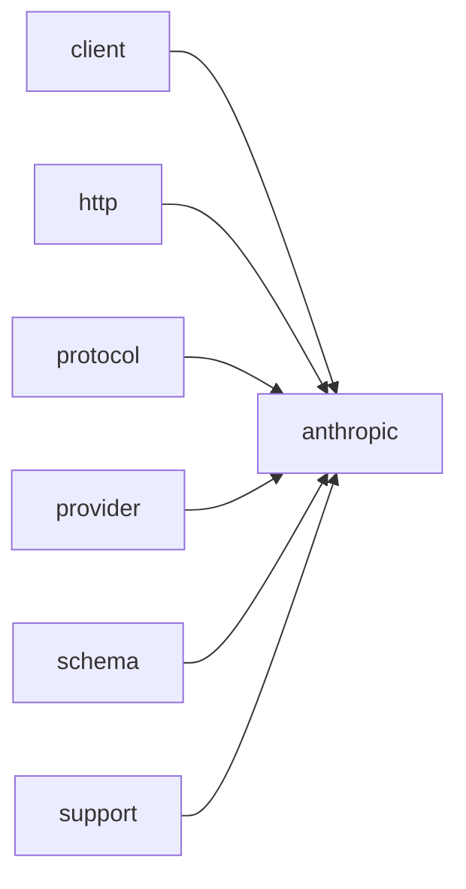

# Module `anthropic`

## Summary

The `anthropic` module implements the Anthropic-specific protocol layer within the network stack, bridging higher-level HTTP and client modules with the Anthropic Messages API. It owns the complete lifecycle of an API interaction: constructing endpoint `URLs` and headers from environment variables (such as `ANTHROPIC_API_KEY`), building JSON request bodies (including system prompts, messages, and tool definitions), parsing raw response payloads to extract text, tool arguments, and structured outputs, and validating outgoing requests against protocol constraints. Internal helpers handle the formatting of text blocks, role messages, and tool‑use/tool‑result blocks as required by the Anthropic schema.

The module’s public interface exposes three asynchronous call templates (`call_llm_async`, `call_completion_async`, `call_structured_async`) that drive the full request/response loop on a given `kota::event_loop`. It also provides schema utilities (`function_tool`, `response_format`) for defining tool‑callable functions and structured‑output models, together with protocol‑level parsing functions (`parse_response`, `parse_response_text`, `parse_tool_arguments`, `text_from_response`) that allow callers to decompose responses into the high‑level structures defined in the `protocol` module. In addition, the module maintains constants for default parameters (e.g., `kDefaultMaxTokens`) and environment variable names, ensuring that credential and configuration discovery remains self‑contained.

## Imports

- [`client`](../client/index.md)
- [`http`](../http/index.md)
- [`protocol`](../protocol/index.md)
- [`provider`](../provider/index.md)
- [`schema`](../schema/index.md)
- `std`
- [`support`](../support/index.md)

## Dependency Diagram



## Types

### `clore::net::anthropic::detail::Protocol`

Declaration: `network/anthropic.cppm:654`

Definition: `network/anthropic.cppm:654`

Declaration: [`Namespace clore::net::anthropic::detail`](../../namespaces/clore/net/anthropic/detail/index.md)

The struct `clore::net::anthropic::detail::Protocol` is a stateless collection of static member functions that encapsulate the Anthropic-specific protocol logic. Internally, it coordinates credential retrieval via `read_environment`, which reads environment variables using `clore::net::detail::read_credentials` with predefined environment key names. The `build_url` function constructs the messages endpoint by calling `clore::net::anthropic::protocol::build_messages_url` using the `api_base` from the environment config. Headers are built in `build_headers` to include `Content-Type`, the `x-api-key` from the environment, and a fixed `anthropic-version` header. The JSON request body is delegated to the corresponding `protocol::build_request_json` function. Response parsing in `parse_response` first checks for an empty body (returning a `LLMError`), then attempts to parse via `clore::net::anthropic::protocol::parse_response`; if parsing succeeds but the HTTP status is >= 400, an error is returned with the status code; if parsing fails, the raw response error or a formatted HTTP error is returned. The `provider_name` function returns the string `"Anthropic"`. All member functions are static, meaning `Protocol` acts as a pure policy type with no instance state; invariants are enforced by the delegation to shared protocol functions and the error‑handling logic in `parse_response`.

#### Invariants

- All methods are static and stateless
- Environment config must be valid before calling `build_url`, `build_headers`, or `build_request_json`
- `parse_response` expects a non-empty body or handles empty body with an error
- Provider name is always `"Anthropic"`

#### Key Members

- `read_environment`
- `build_url`
- `build_headers`
- `build_request_json`
- `parse_response`
- `provider_name`

#### Usage Patterns

- Used as a policy or adapter for the Anthropic provider in generic request workflows
- Methods are called sequentially: `read_environment`, then `build_url`, `build_headers`, `build_request_json`, and finally `parse_response`
- Likely substituable with other provider-specific `Protocol` structs via template or duck typing

#### Member Functions

##### `clore::net::anthropic::detail::Protocol::build_headers`

Declaration: `network/anthropic.cppm:667`

Definition: `network/anthropic.cppm:667`

Declaration: [`Namespace clore::net::anthropic::detail`](../../namespaces/clore/net/anthropic/detail/index.md)

###### Implementation

```cpp
static auto build_headers(const clore::net::detail::EnvironmentConfig& environment)
        -> std::vector<kota::http::header> {
        return std::vector<kota::http::header>{
            kota::http::header{
                               .name = "Content-Type",
                               .value = "application/json; charset=utf-8",
                               },
            kota::http::header{
                               .name = "x-api-key",
                               .value = environment.api_key,
                               },
            kota::http::header{
                               .name = "anthropic-version",
                               .value = std::string(kAnthropicVersion),
                               },
        };
    }
```

##### `clore::net::anthropic::detail::Protocol::build_request_json`

Declaration: `network/anthropic.cppm:685`

Definition: `network/anthropic.cppm:685`

Declaration: [`Namespace clore::net::anthropic::detail`](../../namespaces/clore/net/anthropic/detail/index.md)

###### Implementation

```cpp
static auto build_request_json(const CompletionRequest& request)
        -> std::expected<std::string, LLMError> {
        return clore::net::anthropic::protocol::build_request_json(request);
    }
```

##### `clore::net::anthropic::detail::Protocol::build_url`

Declaration: `network/anthropic.cppm:663`

Definition: `network/anthropic.cppm:663`

Declaration: [`Namespace clore::net::anthropic::detail`](../../namespaces/clore/net/anthropic/detail/index.md)

###### Implementation

```cpp
static auto build_url(const clore::net::detail::EnvironmentConfig& environment) -> std::string {
        return clore::net::anthropic::protocol::build_messages_url(environment.api_base);
    }
```

##### `clore::net::anthropic::detail::Protocol::parse_response`

Declaration: `network/anthropic.cppm:690`

Definition: `network/anthropic.cppm:690`

Declaration: [`Namespace clore::net::anthropic::detail`](../../namespaces/clore/net/anthropic/detail/index.md)

###### Implementation

```cpp
static auto parse_response(const clore::net::detail::RawHttpResponse& raw_response)
        -> std::expected<CompletionResponse, LLMError> {
        if(raw_response.body.empty()) {
            return std::unexpected(LLMError("empty response from Anthropic"));
        }

        auto parsed = clore::net::anthropic::protocol::parse_response(raw_response.body);
        if(!parsed.has_value()) {
            if(raw_response.http_status >= 400) {
                return std::unexpected(
                    LLMError(std::format("Anthropic request failed with HTTP {}: {}",
                                         raw_response.http_status,
                                         raw_response.body)));
            }
            return std::unexpected(std::move(parsed.error()));
        }
        if(raw_response.http_status >= 400) {
            return std::unexpected(LLMError(
                std::format("Anthropic request failed with HTTP {}", raw_response.http_status)));
        }
        return std::move(*parsed);
    }
```

##### `clore::net::anthropic::detail::Protocol::provider_name`

Declaration: `network/anthropic.cppm:713`

Definition: `network/anthropic.cppm:713`

Declaration: [`Namespace clore::net::anthropic::detail`](../../namespaces/clore/net/anthropic/detail/index.md)

###### Implementation

```cpp
static auto provider_name() -> std::string_view {
        return "Anthropic";
    }
```

##### `clore::net::anthropic::detail::Protocol::read_environment`

Declaration: `network/anthropic.cppm:655`

Definition: `network/anthropic.cppm:655`

Declaration: [`Namespace clore::net::anthropic::detail`](../../namespaces/clore/net/anthropic/detail/index.md)

###### Implementation

```cpp
static auto read_environment()
        -> std::expected<clore::net::detail::EnvironmentConfig, LLMError> {
        return clore::net::detail::read_credentials(clore::net::detail::CredentialEnv{
            .base_url_env = kAnthropicBaseUrlEnv,
            .api_key_env = kAnthropicApiKeyEnv,
        });
    }
```

## Variables

### `clore::net::anthropic::detail::kAnthropicApiKeyEnv`

Declaration: `network/anthropic.cppm:651`

Declaration: [`Namespace clore::net::anthropic::detail`](../../namespaces/clore/net/anthropic/detail/index.md)

This constant is used to look up the Anthropic API key from the process environment, typically by being passed to functions that read environment variables. It is part of the configuration logic alongside similar constants like `kAnthropicBaseUrlEnv`.

#### Mutation

No mutation is evident from the extracted code.

#### Usage Patterns

- used as environment variable name to retrieve Anthropic API key

### `clore::net::anthropic::detail::kAnthropicBaseUrlEnv`

Declaration: `network/anthropic.cppm:650`

Declaration: [`Namespace clore::net::anthropic::detail`](../../namespaces/clore/net/anthropic/detail/index.md)

This variable is intended to be used as the key to read the base URL from the environment during initialization of the Anthropic client. It is declared `constexpr` and is not mutated.

#### Mutation

No mutation is evident from the extracted code.

### `clore::net::anthropic::detail::kAnthropicVersion`

Declaration: `network/anthropic.cppm:652`

Declaration: [`Namespace clore::net::anthropic::detail`](../../namespaces/clore/net/anthropic/detail/index.md)

This variable serves as a version identifier for the Anthropic API. It is defined as a compile-time constant and is not modified after initialization. Its value is used to indicate the API version in requests.

#### Mutation

No mutation is evident from the extracted code.

### `clore::net::anthropic::protocol::detail::kDefaultMaxTokens`

Declaration: `network/anthropic.cppm:23`

Declaration: [`Namespace clore::net::anthropic::protocol::detail`](../../namespaces/clore/net/anthropic/protocol/detail/index.md)

Serves as the default maximum number of tokens for requests in the Anthropic protocol. It is referenced in `build_request_json` to provide a fallback value when no explicit limit is specified.

#### Mutation

No mutation is evident from the extracted code.

#### Usage Patterns

- used as default argument in `build_request_json`

## Functions

### `clore::net::anthropic::call_completion_async`

Declaration: `network/anthropic.cppm:722`

Definition: `network/anthropic.cppm:764`

Declaration: [`Namespace clore::net::anthropic`](../../namespaces/clore/net/anthropic/index.md)

This function is a coroutine that delegates to the generic `clore::net::call_completion_async` template parameterized with `clore::net::anthropic::detail::Protocol`. It moves the provided `CompletionRequest` and passes a pointer to the `kota::event_loop`, then unwraps the result via `or_fail()` to yield a `kota::task<CompletionResponse, LLMError>`. The internal control flow depends entirely on the generic `call_completion_async`, which uses the `Protocol` type to read environment variables (via `Protocol::read_environment`), build HTTP headers and URL (using `Protocol::build_headers` and `Protocol::build_url`), construct the JSON request body (through `Protocol::build_request_json`), perform the async HTTP call, and parse the response (via `Protocol::parse_response`). All Anthropic-specific logic — such as message formatting, tool handling, schema instruction generation, and response parsing — is encapsulated within the `Protocol` class and its associated functions in `clore::net::anthropic::detail` and `clore::net::anthropic::protocol`. This wrapper thus provides a clean, type‑specific entry point without exposing the generic infrastructure.

#### Side Effects

- Initiates an asynchronous network request to the Anthropic API via the underlying `clore::net::call_completion_async` specialization.
- Moves from the `request` parameter.

#### Reads From

- `request`: the `CompletionRequest` object (moved)
- `loop`: reference to the event loop

#### Usage Patterns

- Used to start an async completion call and obtain a task that can be awaited.
- Typically called from event-loop-driven code that needs to query an AI model.

### `clore::net::anthropic::call_llm_async`

Declaration: `network/anthropic.cppm:732`

Definition: `network/anthropic.cppm:782`

Declaration: [`Namespace clore::net::anthropic`](../../namespaces/clore/net/anthropic/index.md)

The implementation of `clore::net::anthropic::call_llm_async` is a thin coroutine adapter that delegates the core request lifecycle to the generic `clore::net::call_llm_async` template, instantiated with `detail::Protocol`. Inside, it forwards the `model`, `system_prompt`, `prompt`, and a pointer to the provided `kota::event_loop` reference, then applies `.or_fail()` on the returned `kota::task` to convert any error into the `LLMError` domain. This design keeps the Anthropic-specific glue (protocol encoding, header construction, URL building, and response parsing) entirely within `detail::Protocol`, while `call_llm_async` itself remains stateless and acts as the entry point for high-level LLM completion calls that expect a plain text response.

#### Side Effects

- Initiates an asynchronous HTTP request to an LLM API via the underlying `clore::net::call_llm_async` function.

#### Reads From

- model
- `system_prompt`
- prompt
- loop
- `detail::Protocol` (compile-time parameter)

#### Writes To

- The returned `kota::task<std::string, LLMError>` object that will eventually contain the response or error.

#### Usage Patterns

- Await the returned task to obtain the LLM response.
- Call from an async context with an active `kota::event_loop`.

### `clore::net::anthropic::call_llm_async`

Declaration: `network/anthropic.cppm:726`

Definition: `network/anthropic.cppm:771`

Declaration: [`Namespace clore::net::anthropic`](../../namespaces/clore/net/anthropic/index.md)

The implementation of `clore::net::anthropic::call_llm_async` acts as a thin, protocol‑specific adapter that delegates all core logic to the generic asynchronous LLM invocation template `clore::net::call_llm_async<clore::net::anthropic::detail::Protocol>`. Inside the coroutine, it passes the provided `model` and `system_prompt` strings, moves the `PromptRequest` object, and supplies the event loop pointer. The generic template handles the construction of HTTP headers, request body, and URL using the `Protocol` type’s methods (such as `build_headers`, `build_request_json`, and `build_url`), performs the asynchronous network call, and parses the response via `Protocol::parse_response`. The result of `or_fail()` unwraps the `kota::task` into a `std::string` on success or a `LLMError` on failure, which is then returned to the caller via `co_return co_await`. The only dependencies are the `detail::Protocol` struct (which encapsulates Anthropic‑specific API details like environment variable reads and JSON schema construction) and the generic `clore::net::call_llm_async` infrastructure.

#### Side Effects

- Performs asynchronous network I/O via the underlying HTTP client.
- Moves the `request` argument, transferring ownership.

#### Reads From

- model parameter
- `system_prompt` parameter
- request parameter
- loop parameter

#### Writes To

- Initiates a network request that writes data to the network.
- Returns a `kota::task` object that will be populated with the result.

#### Usage Patterns

- Called by other async functions to obtain an LLM response.
- Used with `kota::event_loop` for asynchronous execution.

### `clore::net::anthropic::call_structured_async`

Declaration: `network/anthropic.cppm:739`

Definition: `network/anthropic.cppm:794`

Declaration: [`Namespace clore::net::anthropic`](../../namespaces/clore/net/anthropic/index.md)

The implementation delegates to the generic `clore::net::call_structured_async` template, passing `clore::net::anthropic::detail::Protocol` as the protocol type and the supplied `model`, `system_prompt`, `prompt`, and a pointer to the `kota::event_loop`. The result of the coroutine is then unwrapped by calling `.or_fail()`, which converts the expected `kota::task<T, LLMError>` into a `kota::task<T, LLMError>` that will rethrow or return the error. This single‑step orchestration relies on `detail::Protocol` to provide all Anthropic‑specific request building (URL, headers, request JSON, schema instruction formatting) and response parsing (text extraction, tool call detection, argument parsing) that the generic `call_structured_async` uses internally to complete the structured output flow.

#### Side Effects

- Performs network I/O to Anthropic API
- Allocates coroutine frame and task objects
- Suspends and resumes coroutine execution
- May propagate `LLMError` on failure

#### Reads From

- `model`
- `system_prompt`
- `prompt`
- `loop`

#### Writes To

- Returns a `kota::task<T, LLMError>` object representing the asynchronous result

#### Usage Patterns

- Called to perform structured async LLM interactions with Anthropic
- Acts as a type-safe wrapper binding `detail::Protocol`
- Used in coroutine contexts where `co_await` is applied

### `clore::net::anthropic::protocol::append_tool_outputs`

Declaration: `network/anthropic.cppm:209`

Definition: `network/anthropic.cppm:628`

Declaration: [`Namespace clore::net::anthropic::protocol`](../../namespaces/clore/net/anthropic/protocol/index.md)

The implementation of `clore::net::anthropic::protocol::append_tool_outputs` is a thin delegation wrapper. It receives three parameters: a span of `history` messages, a `CompletionResponse` object, and a span of `ToolOutput` entries. The function immediately forwards these arguments to the generic `clore::net::protocol::append_tool_outputs` function, which performs the actual work of appending tool outputs into the message history. No additional validation, transformation, or Anthropic‑specific logic is added at this level; the function exists solely to provide a convenience entry point within the `clore::net::anthropic::protocol` namespace that matches the public interface contract for that module.

The internal control flow consists only of a single call to the shared generic protocol function. Dependencies are limited to the types `Message`, `CompletionResponse`, and `ToolOutput` (all defined elsewhere), and the target function from the `clore::net::protocol` namespace. The actual algorithm for constructing a tool‑result message block and inserting it into the history list is implemented in that generic routine, which this wrapper invokes unchanged.

#### Side Effects

No observable side effects are evident from the extracted code.

#### Reads From

- `history`
- `response`
- `outputs`

#### Writes To

- return value of type `std::expected<std::vector<Message>, LLMError>`

#### Usage Patterns

- Appending tool outputs to a conversation history
- Converting a completion response and tool outputs into an updated message list

### `clore::net::anthropic::protocol::build_messages_url`

Declaration: `network/anthropic.cppm:201`

Definition: `network/anthropic.cppm:224`

Declaration: [`Namespace clore::net::anthropic::protocol`](../../namespaces/clore/net/anthropic/protocol/index.md)

Implementation: [Implementation](functions/build-messages-url.md)

The function first normalizes the input `api_base` by removing any trailing forward slash characters. It then checks whether the resulting string already ends with the path segment `/v1`. If it does, the function delegates to `clore::net::detail::append_url_path` to directly append `"messages"` to the base URL. Otherwise, it appends the full path `"v1/messages"` using the same utility, ensuring the final URL correctly points to the Anthropic Messages API endpoint. The algorithm relies on `clore::net::detail::append_url_path` to handle path concatenation, which manages proper slash insertion between path components.

#### Side Effects

No observable side effects are evident from the extracted code.

#### Reads From

- `api_base` parameter

#### Writes To

- returned `std::string`

#### Usage Patterns

- Called by `clore::net::anthropic::detail::Protocol::build_url`

### `clore::net::anthropic::protocol::build_request_json`

Declaration: `network/anthropic.cppm:203`

Definition: `network/anthropic.cppm:235`

Declaration: [`Namespace clore::net::anthropic::protocol`](../../namespaces/clore/net/anthropic/protocol/index.md)

The function first validates a `CompletionRequest` via `detail::validate_request`. It then constructs a JSON root object, inserting `model` and `max_tokens` (using `detail::kDefaultMaxTokens`). Messages are iterated: inside a `std::visit`, each message type is handled separately. `SystemMessage` content is accumulated into a string `system_text` via `detail::append_text_with_gap`. For `UserMessage` and `AssistantMessage`, `detail::make_role_message` produces a role‑labeled JSON object; `AssistantToolCallMessage` builds a content array combining a text block (`detail::make_text_block`) and tool‑use blocks (`detail::make_tool_use_block`). The default case handles tool‑result messages by calling `detail::make_tool_result_block` and wrapping it in a user‑role object. Non‑system messages that yield valid objects are appended to the `messages` array. After messages, an optional `response_format` trigger a call to `detail::format_schema_instruction` whose result is appended to `system_text`; if `system_text` is non‑empty it is inserted as a `"system"` field. The `messages` array is then inserted. Tools are serialized into a `"tools"` array, each containing `name`, `description`, and a cloned `input_schema` from the tool’s parameters. For `tool_choice` and parallel tool control, a nested object is built using a second `std::visit` over `ToolChoiceAuto`, `ToolChoiceRequired`, `ToolChoiceNone`, and a named tool variant; if `parallel_tool_calls` is explicitly `false`, `disable_parallel_tool_use` is added. Finally the root JSON object is serialized via `kota::codec::json::to_string` and returned as a `std::string`. The function depends on several internal detail helpers (`detail::validate_request`, `detail::append_text_with_gap`, `detail::make_role_message`, `detail::make_text_block`, `detail::make_tool_use_block`, `detail::make_tool_result_block`, `detail::format_schema_instruction`) and on `clore::net::detail` utilities for JSON object/array construction and field insertion.

#### Side Effects

- Allocates JSON objects and strings via container operations
- Returns ownership of a newly allocated `std::string`

#### Reads From

- Parameter `request` of type `CompletionRequest`
- Constant `detail::kDefaultMaxTokens`
- Helper functions from `clore::net::detail` and `clore::net::anthropic::protocol::detail`

#### Writes To

- Local JSON objects (`root`, `messages`, `system_text`, etc.)
- Returned `std::string` containing the serialized JSON

#### Usage Patterns

- Called to generate the request body for an Anthropic API call

### `clore::net::anthropic::protocol::detail::append_text_with_gap`

Declaration: `network/anthropic.cppm:25`

Definition: `network/anthropic.cppm:25`

Declaration: [`Namespace clore::net::anthropic::protocol::detail`](../../namespaces/clore/net/anthropic/protocol/detail/index.md)

Implementation: [Implementation](functions/append-text-with-gap.md)

The function checks whether `text` is empty and exits immediately if so, avoiding unnecessary work. When `text` is non‑empty, it inspects `target`: if `target` already contains some content, a double newline (`"\n\n"`) separator is appended first, ensuring the new text is visually separated from any prior text. Finally, the content of `text` is appended to `target`. No external dependencies beyond the standard library’s `std::string` and `std::string_view` are required; the control flow is a straightforward linear sequence with a single conditional branch for the gap insertion.

#### Side Effects

- Modifies target string by appending text and optionally a gap

#### Reads From

- Parameter `target` (to check emptiness)
- Parameter `text` (to read content)

#### Writes To

- Parameter `target` (modified in place)

#### Usage Patterns

- Used in `build_request_json` to assemble text blocks with gaps

### `clore::net::anthropic::protocol::detail::format_schema_instruction`

Declaration: `network/anthropic.cppm:176`

Definition: `network/anthropic.cppm:176`

Declaration: [`Namespace clore::net::anthropic::protocol::detail`](../../namespaces/clore/net/anthropic/protocol/detail/index.md)

The implementation of `clore::net::anthropic::protocol::detail::format_schema_instruction` begins by testing whether the provided `ResponseFormat` object contains an optional schema. When `format.schema` is absent, the function immediately returns a fixed instruction string that requests a plain JSON object without markdown fences. If a schema is present, the function serializes it to a string using `json::to_string`. This serialization is fallible; upon failure the function delegates error reporting to `clore::net::detail::unexpected_json_error` and returns an `std::expected` containing an `LLMError`. On success, it constructs the final instruction via `std::format`, embedding the schema’s name and its JSON representation, appending the same warning about markdown fences. The logic is thus a straightforward linear chain: optionality check, serialization attempt, and formatted string construction.

#### Side Effects

No observable side effects are evident from the extracted code.

#### Reads From

- The `ResponseFormat` parameter `format` (specifically `format.schema` and `format.name`)
- The `std::expected` returned by `json::to_string`

#### Usage Patterns

- Generates instruction string for structured output in Anthropic API requests
- Called when constructing messages that require a JSON schema response format

### `clore::net::anthropic::protocol::detail::make_role_message`

Declaration: `network/anthropic.cppm:154`

Definition: `network/anthropic.cppm:154`

Declaration: [`Namespace clore::net::anthropic::protocol::detail`](../../namespaces/clore/net/anthropic/protocol/detail/index.md)

The function `clore::net::anthropic::protocol::detail::make_role_message` constructs a JSON object representing a single chat message for the Anthropic protocol. It first creates an empty object using `clore::net::detail::make_empty_object`, attaching a descriptive error message for failure cases. If that step fails, the error is propagated immediately. Otherwise, it inserts the `"role"` field via `clore::net::detail::insert_string_field`, checking the result for errors. After both fields are set, the provided `content` array (a `json::Array`) is moved into the object with `message->insert("content", std::move(blocks))`. The completed `json::Object` is returned on success, or a `LLMError` on any intermediate failure.

The control flow is a linear sequence of dependency‑based operations: object creation, field insertion (with error handling), and unconditional array insertion. The function relies on the utility helpers `clore::net::detail::make_empty_object` and `clore::net::detail::insert_string_field` for low‑level JSON manipulation and error reporting. This function is a building block used by higher‑level protocol assembly routines, such as `build_request_json`.

#### Side Effects

- Allocates a new `json::Object`
- Moves the input `blocks` array into the returned object

#### Reads From

- `role` parameter
- `blocks` parameter

#### Writes To

- Returned `json::Object`
- Local variable `message`

#### Usage Patterns

- Used to construct role-based message objects for the Anthropic protocol
- Called when building a request message with a role and content blocks

### `clore::net::anthropic::protocol::detail::make_role_message`

Declaration: `network/anthropic.cppm:130`

Definition: `network/anthropic.cppm:130`

Declaration: [`Namespace clore::net::anthropic::protocol::detail`](../../namespaces/clore/net/anthropic/protocol/detail/index.md)

The function begins by delegating to `clore::net::detail::make_empty_object` to allocate a new JSON object, propagating any failure immediately as an unexpected `LLMError`. It then uses `clore::net::detail::insert_string_field` to add the `"role"` key, using the `role` parameter directly; again, a failed insertion short‑circuits the call. For the `"content"` key, the function first normalizes the input `text` via `clore::net::detail::normalize_utf8`, ensuring valid UTF‑8 encoding before embedding the string. The normalized string is then inserted with the same error‑handling pattern. On successful completion, the fully constructed JSON object is returned.

All JSON manipulation dependencies are drawn from `clore::net::detail`, and the function’s own helpers live in the `clore::net::anthropic::protocol::detail` namespace. The algorithm is a straightforward sequence of guarded operations, where every step that can fail returns a `std::expected` and the function unwraps or forwards each error immediately.

#### Side Effects

No observable side effects are evident from the extracted code.

#### Reads From

- role parameter
- text parameter

#### Writes To

- returns a newly constructed `json::Object` with role and content fields set

#### Usage Patterns

- called to create a role message object for Anthropic protocol messages

### `clore::net::anthropic::protocol::detail::make_text_block`

Declaration: `network/anthropic.cppm:35`

Definition: `network/anthropic.cppm:35`

Declaration: [`Namespace clore::net::anthropic::protocol::detail`](../../namespaces/clore/net/anthropic/protocol/detail/index.md)

The function `clore::net::anthropic::protocol::detail::make_text_block` constructs a JSON object representing a text content block for the Anthropic API. It begins by calling `clore::net::detail::make_empty_object` to allocate a fresh `json::Object`, propagating any failure as a `std::unexpected` error. On success, it inserts the literal string `"text"` into the `"type"` field via `clore::net::detail::insert_string_field`, again forwarding errors immediately. The supplied input text is then normalized using `clore::net::detail::normalize_utf8` to ensure well‑formed UTF‑8, and the normalized result is stored in the `"text"` field. If any insertion step fails, the function returns an `LLMError` wrapped in `std::unexpected`; otherwise it returns the completed `json::Object` block. The entire operation follows an early‑return pattern on error, relying on the helper utilities `make_empty_object`, `insert_string_field`, and `normalize_utf8` from the `clore::net::detail` namespace.

#### Side Effects

No observable side effects are evident from the extracted code.

#### Reads From

- `text` parameter (`std::string_view`)

#### Usage Patterns

- Constructing a text content block for an Anthropic API message array

### `clore::net::anthropic::protocol::detail::make_tool_result_block`

Declaration: `network/anthropic.cppm:98`

Definition: `network/anthropic.cppm:98`

Declaration: [`Namespace clore::net::anthropic::protocol::detail`](../../namespaces/clore/net/anthropic/protocol/detail/index.md)

The function constructs a JSON object representing a tool result block by first creating an empty object via `clore::net::detail::make_empty_object`; if that call fails, it immediately returns the propagated error. It then inserts three fields sequentially using `clore::net::detail::insert_string_field`: the literal `"type"` set to `"tool_result"`, the `"tool_use_id"` from the input `message.tool_call_id`, and a `"content"` field. For the content, it normalizes `message.content` as UTF-8 via `clore::net::detail::normalize_utf8` before insertion. Each insertion step is guarded by an `if` that checks the returned `std::expected`; if any insertion fails, the function returns the corresponding `LLMError` early. On success, the fully populated JSON object is returned.

Internally, the function relies entirely on the utility layer in `clore::net::detail` for JSON construction (`make_empty_object`, `insert_string_field`) and text normalization (`normalize_utf8`). It does not perform any looping or branching beyond the three successive error checks, making its control flow a linear chain of fallible steps with early exit on the first error.

#### Side Effects

- Allocates a `json::Object` and may allocate a normalized UTF-8 string for the content field.
- Returns a `json::Object` by value, transferring ownership of the allocated object.

#### Reads From

- The `message` parameter of type `const ToolResultMessage&`: specifically `message.tool_call_id` and `message.content`.
- The result of `clore::net::detail::normalize_utf8(message.content, ...)`.

#### Writes To

- The temporary `json::Object` `block` via `clore::net::detail::insert_string_field` calls (modifies the object in place).
- The return value of type `std::expected<json::Object, LLMError>` (by move or unexpected error).

#### Usage Patterns

- Used when constructing a tool result message to be sent to the Anthropic API.
- Expected to be called from higher-level protocol message building functions.

### `clore::net::anthropic::protocol::detail::make_tool_use_block`

Declaration: `network/anthropic.cppm:58`

Definition: `network/anthropic.cppm:58`

Declaration: [`Namespace clore::net::anthropic::protocol::detail`](../../namespaces/clore/net/anthropic/protocol/detail/index.md)

The function constructs a JSON object representing a tool use block for the Anthropic protocol. It first validates that the incoming tool call’s `arguments` member is a JSON object; if not, it returns an `LLMError` describing the invalid input. The function then creates an empty JSON object via `clore::net::detail::make_empty_object`, propagates any error upward, and sequentially inserts three string fields – `"type"` set to `"tool_use"`, `"id"` from `call.id`, and `"name"` from `call.name` – using `clore::net::detail::insert_string_field`. Each insertion is checked for failure and the error is forwarded if it occurs. Finally, the tool call’s `arguments` object is cloned via `clore::net::detail::clone_value` and inserted under the key `"input"`. The completed JSON object is returned on success, or a `std::unexpected` error is propagated at the first failure point.

#### Side Effects

- allocates a `json::Object`
- clones a `json::Value`
- inserts fields into the JSON object

#### Reads From

- `call.arguments`
- `call.id`
- `call.name`

#### Writes To

- local `json::Object` `block`
- returned `json::Object`

#### Usage Patterns

- used to create a `tool_use` block for Anthropic protocol requests

### `clore::net::anthropic::protocol::detail::parse_json_text`

Declaration: `network/anthropic.cppm:171`

Definition: `network/anthropic.cppm:171`

Declaration: [`Namespace clore::net::anthropic::protocol::detail`](../../namespaces/clore/net/anthropic/protocol/detail/index.md)

The implementation of `parse_json_text` is a thin delegation wrapper. It forwards both the raw JSON string (`raw`) and a contextual description (`context`) directly to `clore::net::detail::parse_json_object`, which performs the actual parsing of a JSON object. The function solely relies on that lower‑level parser; it has no additional validation, error transformation, or control flow of its own. The return type `std::expected<json::Object, LLMError>` is inherited from the underlying call, enabling callers to handle parse failures via the expected interface.

#### Side Effects

No observable side effects are evident from the extracted code.

#### Reads From

- `raw`
- `context`

#### Usage Patterns

- Used internally to parse JSON text in Anthropic protocol implementation

### `clore::net::anthropic::protocol::detail::validate_request`

Declaration: `network/anthropic.cppm:193`

Definition: `network/anthropic.cppm:193`

Declaration: [`Namespace clore::net::anthropic::protocol::detail`](../../namespaces/clore/net/anthropic/protocol/detail/index.md)

The implementation of `clore::net::anthropic::protocol::detail::validate_request` is a thin wrapper that immediately delegates all validation logic to `clore::net::detail::validate_completion_request`. The call passes the `request` argument along with two boolean flags—both set to `false`—which likely control whether certain validation passes (such as tool‑use or streaming constraints) are applied. This design centralises common request validation in the `clore::net::detail` namespace, allowing the Anthropic‑specific layer to reuse the same checks while disabling any protocol‑dependent features that are not relevant for the Anthropic completion path. No additional branching, error handling, or data transformation occurs within the function itself; the entire internal control flow is inherited from the shared validator.

#### Side Effects

No observable side effects are evident from the extracted code.

#### Reads From

- `request` parameter
- fields of `CompletionRequest` (accessed via callee)

#### Usage Patterns

- Called before sending a completion request to Anthropic API
- Used in request construction and validation pipelines

### `clore::net::anthropic::protocol::parse_response`

Declaration: `network/anthropic.cppm:205`

Definition: `network/anthropic.cppm:460`

Declaration: [`Namespace clore::net::anthropic::protocol`](../../namespaces/clore/net/anthropic/protocol/index.md)

The function first parses the raw JSON into a `json::Value` using `detail::parse_json_text` and wraps the result in a `clore::net::detail::ObjectView` for structured field access. If the payload contains an `"error"` object, the function extracts the `"message"` field and returns an `LLMError`. Next, it validates mandatory top-level fields: `"id"` and `"model"` are required as strings, and `"stop_reason"` defaults to `"end_turn"` but is validated when present; a `"max_tokens"` stop reason causes an early error return. The `"content"` array is then iterated block by block. For each `"text"` block, the text content is appended to either `refusal` (if `stop_reason == "refusal"`) or `text`; `"tool_use"` blocks require `"id"`, `"name"`, and `"input"` – the input is cloned via `clore::net::detail::clone_object`, serialized to a JSON string using `kota::codec::json::to_string`, and then parsed back into a `kota::codec::json::Value` to produce a `ToolCall` inside `output.tool_calls`. After processing all blocks, non‑empty `text` or `refusal` are assigned to the `AssistantOutput`, and a `CompletionResponse` is constructed containing `id`, `model`, the assembled message, and the raw JSON string.

#### Side Effects

- Allocates memory for strings and vectors in the returned `CompletionResponse`
- Allocates memory for error messages in `LLMError`
- Moves ownership of parsed JSON values and strings

#### Reads From

- Input parameter `json_text` (a `std::string_view`)

#### Writes To

- Return value of type `std::expected<CompletionResponse, LLMError>`

#### Usage Patterns

- Called to deserialize an Anthropic API response string into a structured object
- Used in error handling to detect API errors or truncation
- Consumed by higher-level protocol functions that need a `CompletionResponse`

### `clore::net::anthropic::protocol::parse_response_text`

Declaration: `network/anthropic.cppm:215`

Definition: `network/anthropic.cppm:636`

Declaration: [`Namespace clore::net::anthropic::protocol`](../../namespaces/clore/net/anthropic/protocol/index.md)

The implementation of `clore::net::anthropic::protocol::parse_response_text` is a thin delegation wrapper. The internal control flow consists solely of forwarding the incoming `CompletionResponse` parameter to the generic base function `clore::net::protocol::parse_response_text<T>`, which performs the actual parsing. No Anthropic-specific logic or error handling is introduced at this level; the function relies entirely on the base protocol layer to extract and convert the response’s text content into the requested type `T`. Its primary dependency is the template function `clore::net::protocol::parse_response_text`, which must be instantiated with the same type `T` to satisfy the `std::expected<T, LLMError>` return. This design centralises parsing in the shared protocol module and avoids duplicating logic across provider‑specific implementations.

#### Side Effects

No observable side effects are evident from the extracted code.

#### Reads From

- response parameter of type `const CompletionResponse&`

#### Usage Patterns

- Called when parsing a text response from the Anthropic API
- Used to convert raw API response to a typed `expected` result

### `clore::net::anthropic::protocol::parse_tool_arguments`

Declaration: `network/anthropic.cppm:218`

Definition: `network/anthropic.cppm:641`

Declaration: [`Namespace clore::net::anthropic::protocol`](../../namespaces/clore/net/anthropic/protocol/index.md)

The implementation of `clore::net::anthropic::protocol::parse_tool_arguments` is a thin forwarding function that delegates immediately to `clore::net::protocol::parse_tool_arguments<T>`, passing the received `call` parameter of type `ToolCall`. No additional Anthropic‑specific logic or transformation is applied at this level. The algorithm consists solely of calling the generic protocol‑level function and returning its `std::expected<T, LLMError>` result. Control flow is linear: argument reception, single delegation, return. The only external dependency is the common protocol layer function `clore::net::protocol::parse_tool_arguments`, which contains the actual JSON parsing and schema‑driven extraction logic (e.g., using `detail::parse_json_text` and related helpers). The template parameter `T` is inferred from the caller and dictates the expected output type.

#### Side Effects

No observable side effects are evident from the extracted code.

#### Reads From

- `call` parameter (`const ToolCall&`)

#### Usage Patterns

- Used to deserialize tool call arguments into a strongly typed object

### `clore::net::anthropic::protocol::text_from_response`

Declaration: `network/anthropic.cppm:207`

Definition: `network/anthropic.cppm:623`

Declaration: [`Namespace clore::net::anthropic::protocol`](../../namespaces/clore/net/anthropic/protocol/index.md)

The function `clore::net::anthropic::protocol::text_from_response` simply delegates to `clore::net::protocol::text_from_response` with the given `response`. It acts as a thin adapter within the Anthropic protocol layer, forwarding the response object to the generic protocol helper. No additional parsing, transformation, or branching occurs inside this function; all extraction logic resides in the called routine.

Internally, the function’s control flow is a single call expression, with the return value passed directly back to the caller. The only dependency is the generic `clore::net::protocol::text_from_response` function, which is expected to handle the concrete message structure of Anthropic responses. Any error handling or text extraction is performed by that underlying implementation, not within this wrapper.

#### Side Effects

No observable side effects are evident from the extracted code.

#### Reads From

- the `response` parameter of type `CompletionResponse`

#### Usage Patterns

- Used to retrieve the textual content from a `CompletionResponse`.

### `clore::net::anthropic::schema::function_tool`

Declaration: `network/anthropic.cppm:755`

Definition: `network/anthropic.cppm:755`

Declaration: [`Namespace clore::net::anthropic::schema`](../../namespaces/clore/net/anthropic/schema/index.md)

The implementation of `clore::net::anthropic::schema::function_tool` is a thin forwarding wrapper. It receives `name` and `description` as `std::string` values, moves them into `clore::net::schema::function_tool<T>`, and returns the `std::expected` result directly. No additional validation, transformation, or branching occurs within this function; all logic is delegated to the generic schema layer. The only dependency is the template function `clore::net::schema::function_tool<T>`, which must be defined elsewhere in the codebase. This design keeps the Anthropic-specific entry point consistent with the common schema interface, allowing tool definitions to be constructed through a single code path.

#### Side Effects

No observable side effects are evident from the extracted code.

#### Reads From

- `name` parameter
- `description` parameter

#### Usage Patterns

- Used to construct a `FunctionToolDefinition` for a specific type `T`
- Called with name and description strings to create a tool definition for the Anthropic API

### `clore::net::anthropic::schema::response_format`

Declaration: `network/anthropic.cppm:750`

Definition: `network/anthropic.cppm:750`

Declaration: [`Namespace clore::net::anthropic::schema`](../../namespaces/clore/net/anthropic/schema/index.md)

The implementation of `clore::net::anthropic::schema::response_format` is a thin forwarding layer that delegates to the generic template function `clore::net::schema::response_format<T>()`. It performs no additional validation, transformation, or intermediate processing; the function simply returns the result of that underlying call. The internal control flow consists of a single return statement wrapping the dependent invocation. The primary dependency is on the `clore::net::schema` module, which provides the actual algorithm for computing the response format. No branching, loops, or side effects occur within this function.

#### Side Effects

No observable side effects are evident from the extracted code.

#### Usage Patterns

- Obtain a response format for the specified type T in the Anthropic context

## Internal Structure

The `anthropic` module is decomposed into several internal namespaces that separate protocol-level message construction (`clore::net::anthropic::protocol`) from provider-specific configuration and networking logic (`clore::net::anthropic::detail`). The `protocol` namespace contains public functions for building and parsing Anthropic API payloads (e.g., `build_request_json`, `parse_response`, `text_from_response`), while its `detail` sub‑namespace exposes low‑level helpers (e.g., `make_text_block`, `make_role_message`, `validate_request`) used by the higher‑level routines. The `detail` namespace at module level houses the `Protocol` struct, which encapsulates environment‑based API key and base‑URL discovery, URL construction, header assembly, and response parsing, providing a single provider‑specific implementation for the generic HTTP and async layers.

The module imports `client`, `http`, `protocol`, `provider`, `schema`, and `support` as its main dependencies, indicating that it builds on top of generic LLM types and transport abstractions to realise Anthropic‑specific serialization, endpoint management, and schema generation (e.g., `function_tool` and `response_format` in the `schema` namespace). The public async call interfaces (`call_llm_async`, `call_completion_async`, `call_structured_async`) rely on the `Protocol` struct for configuration and on the `http` module for actual network dispatch, while the internal helpers handle the fine‑grained construction of message blocks, tool‑call containers, and response text extraction.

## Related Pages

- [Module client](../client/index.md)
- [Module http](../http/index.md)
- [Module protocol](../protocol/index.md)
- [Module provider](../provider/index.md)
- [Module schema](../schema/index.md)
- [Module support](../support/index.md)

