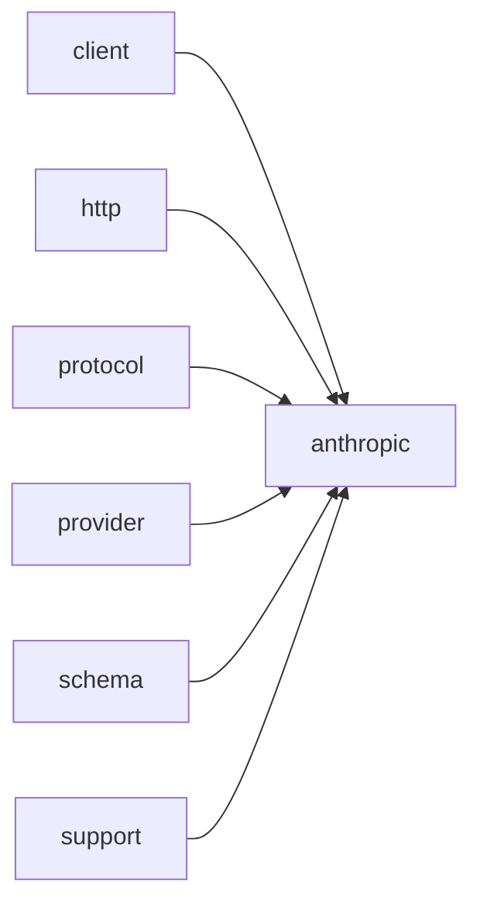

# Module `anthropic`

## Summary

The `anthropic` module implements the networking layer for interacting with the Anthropic API within the Clore framework. It is responsible for constructing, sending, and parsing requests and responses using the Anthropic Messages API, including support for text generation, tool calls, structured outputs, and schema-based response formatting. The module provides public asynchronous entry points such as `call_llm_async`, `call_structured_async`, and `call_completion_async`, which accept model identifiers, prompts, and event loops to initiate non-blocking API calls. It also exposes protocol-level utilities for building request JSON, parsing responses, extracting text, and handling tool arguments, along with schema functions like `function_tool` and `response_format` to define tool definitions and output contracts. Under the `detail` namespace, it manages environment-based configuration (API key, base URL, version), request validation, URL construction, and header generation, integrating with the `http`, `protocol`, `provider`, and `schema` modules to deliver a complete Anthropic provider implementation.

## Imports

- [`client`](../client/index.md)
- [`http`](../http/index.md)
- [`protocol`](../protocol/index.md)
- [`provider`](../provider/index.md)
- [`schema`](../schema/index.md)
- [`support`](../support/index.md)

## Dependency Diagram


```mermaid
graph LR
    M0["anthropic"]
    I0["client"]
    I0 --> M0
    I1["http"]
    I1 --> M0
    I2["protocol"]
    I2 --> M0
    I3["provider"]
    I3 --> M0
    I4["schema"]
    I4 --> M0
    I5["support"]
    I5 --> M0
```

## Types

### `clore::net::anthropic::detail::Protocol`

Declaration: `src/network/anthropic.cppm:663`

Definition: `src/network/anthropic.cppm:663`

Declaration: [`Namespace clore::net::anthropic::detail`](../../namespaces/clore/net/anthropic/detail/index.md)

The struct is a stateless, purely static protocol adapter that encapsulates all provider‑specific logic for the Anthropic API. Its member functions are implemented entirely by delegating to free functions in the `clore::net::anthropic::protocol` namespace (e.g. `build_messages_url`, `build_request_json`, `parse_response`) and to library utilities like `read_credentials` and `make_capability_probe_key`. A key invariant is that each method receives an `EnvironmentConfig` populated by `read_environment`, ensuring that credentials and the base URL are always obtained from the same environment variables (`kAnthropicBaseUrlEnv`, `kAnthropicApiKeyEnv`). 

The most structurally notable implementation is `parse_response`, which first checks for an empty body (returning an error immediately) and then delegates parsing to the core `protocol::parse_response`. If parsing fails and the HTTP status indicates an error (≥400), it formats a descriptive error message that includes the status code and an excerpt of the response body; if the status is successful but parsing still fails, the raw parser error is forwarded. The `capability_probe_key` method consistently uses the provider name `"Anthropic"` together with the environment’s API base and the request’s model to build a unique key.

#### Invariants

- All methods are static; no instance state exists.
- `read_environment` expects specific environment variable names defined elsewhere.
- `build_headers` always includes Content-Type, x-api-key, and anthropic-version headers.
- `parse_response` returns error for empty body or when HTTP status >= 400.
- `capability_probe_key` combines provider name, API base, and model name.

#### Key Members

- `read_environment`
- `build_url`
- `build_headers`
- `build_request_json`
- `parse_response`
- `provider_name`
- `capability_probe_key`

#### Usage Patterns

- Called by higher-level client code to perform Anthropic-specific tasks.
- Used to construct requests and interpret responses consistently.
- `read_environment` is invoked during initialization to load credentials.
- `build_url`, `build_headers`, `build_request_json` are used together to form HTTP requests.
- `parse_response` is used after receiving an HTTP response.

#### Member Functions

##### `clore::net::anthropic::detail::Protocol::build_headers`

Declaration: `src/network/anthropic.cppm:676`

Definition: `src/network/anthropic.cppm:676`

Declaration: [`Namespace clore::net::anthropic::detail`](../../namespaces/clore/net/anthropic/detail/index.md)

###### Implementation

```cpp
static auto build_headers(const clore::net::detail::EnvironmentConfig& environment)
        -> std::vector<kota::http::header> {
        return std::vector<kota::http::header>{
            kota::http::header{
                               .name = "Content-Type",
                               .value = "application/json; charset=utf-8",
                               },
            kota::http::header{
                               .name = "x-api-key",
                               .value = environment.api_key,
                               },
            kota::http::header{
                               .name = "anthropic-version",
                               .value = std::string(kAnthropicVersion),
                               },
        };
    }
```

##### `clore::net::anthropic::detail::Protocol::build_request_json`

Declaration: `src/network/anthropic.cppm:694`

Definition: `src/network/anthropic.cppm:694`

Declaration: [`Namespace clore::net::anthropic::detail`](../../namespaces/clore/net/anthropic/detail/index.md)

###### Implementation

```cpp
static auto build_request_json(const CompletionRequest& request)
        -> std::expected<std::string, LLMError> {
        return clore::net::anthropic::protocol::build_request_json(request);
    }
```

##### `clore::net::anthropic::detail::Protocol::build_url`

Declaration: `src/network/anthropic.cppm:672`

Definition: `src/network/anthropic.cppm:672`

Declaration: [`Namespace clore::net::anthropic::detail`](../../namespaces/clore/net/anthropic/detail/index.md)

###### Implementation

```cpp
static auto build_url(const clore::net::detail::EnvironmentConfig& environment) -> std::string {
        return clore::net::anthropic::protocol::build_messages_url(environment.api_base);
    }
```

##### `clore::net::anthropic::detail::Protocol::capability_probe_key`

Declaration: `src/network/anthropic.cppm:726`

Definition: `src/network/anthropic.cppm:726`

Declaration: [`Namespace clore::net::anthropic::detail`](../../namespaces/clore/net/anthropic/detail/index.md)

###### Implementation

```cpp
static auto capability_probe_key(const clore::net::detail::EnvironmentConfig& environment,
                                     const CompletionRequest& request) -> std::string {
        return clore::net::make_capability_probe_key(provider_name(),
                                                     environment.api_base,
                                                     request.model);
    }
```

##### `clore::net::anthropic::detail::Protocol::parse_response`

Declaration: `src/network/anthropic.cppm:699`

Definition: `src/network/anthropic.cppm:699`

Declaration: [`Namespace clore::net::anthropic::detail`](../../namespaces/clore/net/anthropic/detail/index.md)

###### Implementation

```cpp
static auto parse_response(const clore::net::detail::RawHttpResponse& raw_response)
        -> std::expected<CompletionResponse, LLMError> {
        if(raw_response.body.empty()) {
            return std::unexpected(LLMError("empty response from Anthropic"));
        }

        auto parsed = clore::net::anthropic::protocol::parse_response(raw_response.body);
        if(!parsed.has_value()) {
            if(raw_response.http_status >= 400) {
                return std::unexpected(
                    LLMError(std::format("Anthropic request failed with HTTP {}: {}",
                                         raw_response.http_status,
                                         clore::net::detail::excerpt_for_error(raw_response.body))));
            }
            return std::unexpected(std::move(parsed.error()));
        }
        if(raw_response.http_status >= 400) {
            return std::unexpected(LLMError(
                std::format("Anthropic request failed with HTTP {}", raw_response.http_status)));
        }
        return std::move(*parsed);
    }
```

##### `clore::net::anthropic::detail::Protocol::provider_name`

Declaration: `src/network/anthropic.cppm:722`

Definition: `src/network/anthropic.cppm:722`

Declaration: [`Namespace clore::net::anthropic::detail`](../../namespaces/clore/net/anthropic/detail/index.md)

###### Implementation

```cpp
static auto provider_name() -> std::string_view {
        return "Anthropic";
    }
```

##### `clore::net::anthropic::detail::Protocol::read_environment`

Declaration: `src/network/anthropic.cppm:664`

Definition: `src/network/anthropic.cppm:664`

Declaration: [`Namespace clore::net::anthropic::detail`](../../namespaces/clore/net/anthropic/detail/index.md)

###### Implementation

```cpp
static auto read_environment()
        -> std::expected<clore::net::detail::EnvironmentConfig, LLMError> {
        return clore::net::detail::read_credentials(clore::net::detail::CredentialEnv{
            .base_url_env = kAnthropicBaseUrlEnv,
            .api_key_env = kAnthropicApiKeyEnv,
        });
    }
```

## Variables

### `clore::net::anthropic::detail::kAnthropicApiKeyEnv`

Declaration: `src/network/anthropic.cppm:660`

Declaration: [`Namespace clore::net::anthropic::detail`](../../namespaces/clore/net/anthropic/detail/index.md)

This constant is intended to be used to retrieve the Anthropic API key from the process environment. As a `constexpr`, it is compile-time constant and cannot be modified.

#### Mutation

No mutation is evident from the extracted code.

### `clore::net::anthropic::detail::kAnthropicBaseUrlEnv`

Declaration: `src/network/anthropic.cppm:659`

Declaration: [`Namespace clore::net::anthropic::detail`](../../namespaces/clore/net/anthropic/detail/index.md)

This constant is used to read the `ANTHROPIC_BASE_URL` environment variable, which provides a custom base URL for the Anthropic API. It is likely consumed by code that initializes an HTTP client or request URL, falling back to a default if the environment variable is not set.

#### Mutation

No mutation is evident from the extracted code.

#### Usage Patterns

- Read as an environment variable name
- Used in HTTP request URL construction

### `clore::net::anthropic::detail::kAnthropicVersion`

Declaration: `src/network/anthropic.cppm:661`

Declaration: [`Namespace clore::net::anthropic::detail`](../../namespaces/clore/net/anthropic/detail/index.md)

Declared at `src/network/anthropic.cppm:661`, this `constexpr` variable is a compile-time constant that holds the Anthropic API version string. It is defined alongside other environment variable name constants and is expected to be used in constructing API request headers, though the provided evidence does not show its direct consumption.

#### Mutation

No mutation is evident from the extracted code.

#### Usage Patterns

- read as a `string_view`
- likely used in HTTP request headers as version identifier

### `clore::net::anthropic::protocol::detail::kDefaultMaxTokens`

Declaration: `src/network/anthropic.cppm:32`

Declaration: [`Namespace clore::net::anthropic::protocol::detail`](../../namespaces/clore/net/anthropic/protocol/detail/index.md)

This `constexpr` variable is used as a fallback default value when constructing requests via `clore::net::anthropic::protocol::build_request_json`, ensuring a sensible upper bound on token count if no explicit value is provided.

#### Mutation

No mutation is evident from the extracted code.

#### Usage Patterns

- default parameter value in request building

## Functions

### `clore::net::anthropic::call_completion_async`

Declaration: `src/network/anthropic.cppm:738`

Definition: `src/network/anthropic.cppm:780`

Declaration: [`Namespace clore::net::anthropic`](../../namespaces/clore/net/anthropic/index.md)

The implementation of `clore::net::anthropic::call_completion_async` is a thin delegating wrapper. It takes a `CompletionRequest` and an `kota::event_loop&`, then constructs and `co_await`s a call to `clore::net::call_completion_async<detail::Protocol>`, passing the request and a pointer to the loop. The result is immediately unwrapped via `.or_fail()`, which converts any error from the generic task into an `LLMError`. The core algorithm resides in the template function; this function simply selects the provider‑specific protocol type `detail::Protocol`, which encapsulates all Anthropic‑specific header, URL, JSON body construction, and response parsing. No additional logic or transformation is performed at this layer.

#### Side Effects

No observable side effects are evident from the extracted code.

#### Reads From

- `CompletionRequest request`
- `kota::event_loop &loop`

#### Usage Patterns

- Called to perform an Anthropic completion request asynchronously
- Part of the coroutine-based API for LLM calls

### `clore::net::anthropic::call_llm_async`

Declaration: `src/network/anthropic.cppm:742`

Definition: `src/network/anthropic.cppm:787`

Declaration: [`Namespace clore::net::anthropic`](../../namespaces/clore/net/anthropic/index.md)

The function is implemented as a thin coroutine wrapper that delegates all Anthropic-specific logic to the generic `clore::net::call_llm_async` template, instantiated with the `detail::Protocol` trait. It accepts a `model` identifier, a `system_prompt`, and a `PromptRequest` (which is moved into the internal call), together with a reference to a `kota::event_loop`. The body immediately `co_await`s the result of the generic call and chains `.or_fail()`, which converts any error from the protocol layer into the expected `LLMError` type. The actual HTTP request construction, header building, JSON serialization, response parsing, and error handling are all handled inside the generic function using the policy methods provided by `detail::Protocol` (such as `build_request_json`, `build_headers`, `build_url`, and `parse_response`), while the `kota::event_loop` drives the asynchronous network I/O.

#### Side Effects

No observable side effects are evident from the extracted code.

#### Reads From

- parameters: `model` (`std::string_view`), `system_prompt` (`std::string_view`), integer parameter, `loop` (`kota::event_loop`&)

#### Usage Patterns

- called as part of the `clore::net::anthropic` LLM API
- may be used to initiate an asynchronous LLM call with a given request ID

### `clore::net::anthropic::call_llm_async`

Declaration: `src/network/anthropic.cppm:748`

Definition: `src/network/anthropic.cppm:798`

Declaration: [`Namespace clore::net::anthropic`](../../namespaces/clore/net/anthropic/index.md)

The implementation of `clore::net::anthropic::call_llm_async` is a coroutine that serves as a thin async wrapper. Its internal algorithm consists solely of delegating to the generic template function `clore::net::call_llm_async<detail::Protocol>`, passing through the `model`, `system_prompt`, `prompt`, and `loop` parameters. After the underlying function completes, the result is unwrapped via `.or_fail()`, which converts a `kota::expected` into a `kota::task` yielding either the response text or an `LLMError`.

The control flow is linear: it co-awaits the delegated call and then co-returns the resulting string. All request construction, HTTP transport, response parsing, and error mapping are handled by the `detail::Protocol` implementation invoked through the generic template. The only dependency introduced by this function is the instantiation of `clore::net::call_llm_async` with `clore::net::anthropic::detail::Protocol`, which encapsulates the Anthropic-specific request formatting, header building, URL construction, and response validation logic.

#### Side Effects

- Delegates to a network I/O operation via the event loop
- Allocates a coroutine frame

#### Reads From

- model
- `system_prompt`
- prompt
- loop

#### Writes To

- coroutine frame
- task result

#### Usage Patterns

- Called from asynchronous contexts to obtain LLM completions
- Used as a wrapper around the generic `call_llm_async` with the Anthropic protocol

### `clore::net::anthropic::call_structured_async`

Declaration: `src/network/anthropic.cppm:755`

Definition: `src/network/anthropic.cppm:810`

Declaration: [`Namespace clore::net::anthropic`](../../namespaces/clore/net/anthropic/index.md)

The function is a thin coroutine wrapper that delegates entirely to the generic `clore::net::call_structured_async<detail::Protocol, T>` with the forwarded `model`, `system_prompt`, `prompt`, and address of `loop`. The result of that call is passed through `.or_fail()` to convert the internal `expected`‑based result into a `kota::task<T, LLMError>`. The `detail::Protocol` type supplies the Anthropic‑specific request construction (via `Protocol::build_request_json`), header and URL building, response parsing (using `Protocol::parse_response`), and environment reading for the API key and base URL. The `call_structured_async` template internally orchestrates the common flow of building the JSON payload, sending the HTTP request on the given `kota::event_loop`, parsing the response, and extracting the structured output of type `T`.

#### Side Effects

No observable side effects are evident from the extracted code.

#### Reads From

- model
- `system_prompt`
- prompt
- loop
- `detail::Protocol`

#### Usage Patterns

- Public entry point for structured async LLM calls
- Used to obtain a task that resolves to type T or `LLMError`

### `clore::net::anthropic::protocol::append_tool_outputs`

Declaration: `src/network/anthropic.cppm:218`

Definition: `src/network/anthropic.cppm:637`

Declaration: [`Namespace clore::net::anthropic::protocol`](../../namespaces/clore/net/anthropic/protocol/index.md)

The implementation of `clore::net::anthropic::protocol::append_tool_outputs` is a thin wrapper that immediately delegates the call to the generic `clore::net::protocol::append_tool_outputs` function. It forwards the `history`, `response`, and `outputs` arguments directly, and the return value (an expected vector of `Message` values or an `LLMError`) is passed through unchanged.

The internal control flow consists solely of this single forwarding step; there is no Anthropic‑specific transformation, validation, or additional logic. The core algorithm—inserting tool‑output blocks into the conversation history based on the previous tool‑use responses—resides entirely in the generic protocol function on which this function depends. No other modules or local utilities from the Anthropic namespace are invoked by this particular entry point.

#### Side Effects

No observable side effects are evident from the extracted code.

#### Reads From

- history
- response
- outputs

#### Usage Patterns

- Appending tool outputs to message history for Anthropic protocol
- Delegating to generic protocol function

### `clore::net::anthropic::protocol::build_messages_url`

Declaration: `src/network/anthropic.cppm:210`

Definition: `src/network/anthropic.cppm:233`

Declaration: [`Namespace clore::net::anthropic::protocol`](../../namespaces/clore/net/anthropic/protocol/index.md)

Implementation: [Implementation](functions/build-messages-url.md)

The function first copies the input `api_base` into a local `std::string` and then strips any trailing forward slashes by repeatedly calling `pop_back()` as long as the string is non‑empty and ends with `'/'`. After normalisation, it checks whether the resulting URL ends with the literal path `"/v1"` using `ends_with`. If it does, it delegates to `clore::net::detail::append_url_path`, appending only `"messages"` to the base. Otherwise it appends the full path `"v1/messages"` via the same helper. This ensures that the caller‑supplied base URL is correctly normalised before the Anthropic Messages API endpoint path is appended, avoiding duplicate `"v1"` segments when the base already includes the API version.

#### Side Effects

No observable side effects are evident from the extracted code.

#### Reads From

- param `api_base`

#### Usage Patterns

- called by `Protocol::build_url` to generate the final URL endpoint

### `clore::net::anthropic::protocol::build_request_json`

Declaration: `src/network/anthropic.cppm:212`

Definition: `src/network/anthropic.cppm:244`

Declaration: [`Namespace clore::net::anthropic::protocol`](../../namespaces/clore/net/anthropic/protocol/index.md)

The function begins by invoking `detail::validate_request` on the incoming `CompletionRequest` and short‑circuits on failure. Next it allocates a JSON root object and inserts the `model` field and a default `max_tokens` from `detail::kDefaultMaxTokens`. It then creates a `messages` array and an empty `system_text` accumulator. A loop over `request.messages` uses `std::visit` to dispatch on the concrete message type: `SystemMessage` appends content to `system_text` via `detail::append_text_with_gap` and yields no message object; `UserMessage` and `AssistantMessage` each produce a role‑message object through `detail::make_role_message`; `AssistantToolCallMessage` builds an array of content blocks (a text block via `detail::make_text_block`, then tool‑use blocks via `detail::make_tool_use_block`) and wraps them as an assistant‑role message; `ToolResultMessage` constructs a single tool‑result block via `detail::make_tool_result_block` and wraps it as a user‑role message. Messages that produce an object are appended to the `messages` array; `SystemMessage` contributes only to the accumulated system text.

After the loop, if `request.response_format` is present, the function calls `detail::format_schema_instruction` and appends the result to `system_text`. A non‑empty `system_text` is inserted into the root object under the key `"system"`. The `messages` array is then inserted. If `request.tools` is non‑empty, the function iterates over the tools, creating a JSON object per tool with `name`, `description`, and an `input_schema` cloned from `tool.parameters`. These objects are collected into a `"tools"` array. Next, `tool_choice` is handled: if `request.tool_choice` has a value or `parallel_tool_calls` is explicitly `false`, a `tool_choice` object is built. A visitor dispatches on the tool‑choice variant to set `"type"` to `"auto"`, `"any"`, `"none"`, or `"tool"` (with an appended `"name"`), and if `parallel_tool_calls` is `false`, `disable_parallel_tool_use` is set to `true`. Finally, the root object is serialized to a string via `kota::codec::json::to_string`. All intermediate operations use `std::expected` for error propagation, relying on `clore::net::detail` helpers for JSON creation, field insertion, and error formatting.

#### Side Effects

No observable side effects are evident from the extracted code.

#### Reads From

- `request` parameter of type `const clore::net::anthropic::protocol::CompletionRequest&`
- `detail::kDefaultMaxTokens` constant

#### Writes To

- Returned `std::string` containing the JSON request body

#### Usage Patterns

- Called when preparing an HTTP request to the Anthropic API endpoint

### `clore::net::anthropic::protocol::detail::append_text_with_gap`

Declaration: `src/network/anthropic.cppm:34`

Definition: `src/network/anthropic.cppm:34`

Declaration: [`Namespace clore::net::anthropic::protocol::detail`](../../namespaces/clore/net/anthropic/protocol/detail/index.md)

Implementation: [Implementation](functions/append-text-with-gap.md)

The function `clore::net::anthropic::protocol::detail::append_text_with_gap` appends the content of `text` (a `std::string_view`) to the `target` `std::string`. It first guards against an empty input by returning immediately if `text` is empty. When `target` already contains data, it inserts a double newline separator (`"\n\n"`) to create a visual gap before concatenating the new fragment. This ensures that the first piece of text is not preceded by an unnecessary separator while subsequent pieces are cleanly spaced. The implementation uses only standard library types and no external dependencies.

#### Side Effects

- mutates `target` by appending a gap and/or `text`

#### Reads From

- `target` contents via `target.empty()`
- `text` via `text.empty()` and `text` value

#### Writes To

- `target` string

#### Usage Patterns

- called by `build_request_json` to concatenate text segments with separation

### `clore::net::anthropic::protocol::detail::format_schema_instruction`

Declaration: `src/network/anthropic.cppm:185`

Definition: `src/network/anthropic.cppm:185`

Declaration: [`Namespace clore::net::anthropic::protocol::detail`](../../namespaces/clore/net/anthropic/protocol/detail/index.md)

The function begins by testing whether the `format.schema` member is absent (i.e., has no value). When the optional is empty, it immediately returns a hard‑coded instruction string that tells the model to return only a JSON object without markdown fencing. Otherwise, it serializes the contained schema object to a JSON string using `json::to_string`. If that serialization fails, it propagates the error by calling `clore::net::detail::unexpected_json_error` with a descriptive message and the inner error. On success, it uses `std::format` to compose a final instruction – prefixed by the schema name (`format.name`) and followed by the serialized schema – which again directs the model to output only a JSON object matching that schema, excluding markdown fences. The only external dependencies are the `json::to_string` utility and the error‑factory `unexpected_json_error` from the `clore::net::detail` namespace.

#### Side Effects

No observable side effects are evident from the extracted code.

#### Reads From

- `format.schema`
- `format.name`
- `json::to_string(*format.schema)`

#### Usage Patterns

- Used to generate the schema instruction part of a system prompt for Anthropic API requests

### `clore::net::anthropic::protocol::detail::make_role_message`

Declaration: `src/network/anthropic.cppm:139`

Definition: `src/network/anthropic.cppm:139`

Declaration: [`Namespace clore::net::anthropic::protocol::detail`](../../namespaces/clore/net/anthropic/protocol/detail/index.md)

The function first calls `clore::net::detail::make_empty_object` to obtain a `json::Object`, propagating any failure immediately. It then invokes `clore::net::detail::insert_string_field` to store the `role` parameter under the key `"role"`, again returning on error. For the `text` content, it normalizes UTF-8 encoding via `clore::net::detail::normalize_utf8` and inserts the result under `"content"` with the same error‑handling pattern. On success, the constructed object is returned.

The entire control flow is a linear sequence of guarded operations, each checking the `std::expected` return of a utility function and forwarding errors via `std::unexpected`. The function depends exclusively on internal helpers in `clore::net::detail` for JSON construction and string normalization; no external I/O or complex branching occurs.

#### Side Effects

- Allocates a `json::Object`
- Allocates memory for normalized UTF-8 string

#### Reads From

- `role` parameter
- `text` parameter

#### Writes To

- The returned `json::Object` via pointer

#### Usage Patterns

- Constructing user or assistant messages from plain text
- Part of message building pipeline in Anthropic protocol

### `clore::net::anthropic::protocol::detail::make_role_message`

Declaration: `src/network/anthropic.cppm:163`

Definition: `src/network/anthropic.cppm:163`

Declaration: [`Namespace clore::net::anthropic::protocol::detail`](../../namespaces/clore/net/anthropic/protocol/detail/index.md)

The function constructs a JSON object representing a single message in the Anthropic Messages API request body. It first creates an empty JSON object by calling `clore::net::detail::make_empty_object` with a descriptive failure string; if that call fails, the error is immediately propagated via `std::unexpected`. Next, it inserts the string field `role` into the object using `clore::net::detail::insert_string_field`, again forwarding any failure. Finally, the `content` field is populated by moving the provided `json::Array` of content blocks into the object, and the completed `json::Object` is returned inside a `std::expected`. The algorithm is purely sequential with early error returns, relying on two reusable helper functions from the lower-level `clore::net::detail` namespace for safe JSON construction and error handling.

#### Side Effects

No observable side effects are evident from the extracted code.

#### Reads From

- `role`
- `blocks`

#### Writes To

- local `message` object (which becomes the return value)
- the moved-from `blocks` parameter (local copy)

#### Usage Patterns

- Creating complete message objects for Anthropic API requests
- Combining a role with content blocks for dialogue messages

### `clore::net::anthropic::protocol::detail::make_text_block`

Declaration: `src/network/anthropic.cppm:44`

Definition: `src/network/anthropic.cppm:44`

Declaration: [`Namespace clore::net::anthropic::protocol::detail`](../../namespaces/clore/net/anthropic/protocol/detail/index.md)

The function `clore::net::anthropic::protocol::detail::make_text_block` constructs a JSON object representing a text content block for the Anthropic messages API. It first calls `clore::net::detail::make_empty_object` to allocate an empty JSON object; if that allocation fails, the error is immediately propagated via `std::unexpected`. Next, it inserts the literal type identifier `"text"` using `clore::net::detail::insert_string_field` into the block. The user-supplied text argument is then normalized through `clore::net::detail::normalize_utf8` to ensure valid UTF‑8 encoding, and the normalized string is inserted as the `"text"` field. Each insertion is guarded by a check on the returned `std::expected`; any failure short‑circuits the function and returns the corresponding error. Finally, the completed block object is returned.

Internally, the function depends solely on lower‑level utilities within `clore::net::detail` for object creation, field insertion, and UTF‑8 normalization. Error propagation follows the `std::expected` pattern used throughout the codebase, with all error messages provided as string literals passed to the helper calls. The implementation performs no I/O, parsing, or external lookups—its entire control flow is a linear sequence of guarded operations that build and validate a small, fixed‑shape JSON object.

#### Side Effects

- allocates memory for `json::Object`
- allocates memory for normalized string
- creates a new JSON object

#### Reads From

- text parameter

#### Writes To

- output `json::Object` (return value)
- local block object before return
- normalized UTF-8 string (internal)

#### Usage Patterns

- used to construct content blocks for Anthropic API requests
- called by higher-level message-building functions

### `clore::net::anthropic::protocol::detail::make_tool_result_block`

Declaration: `src/network/anthropic.cppm:107`

Definition: `src/network/anthropic.cppm:107`

Declaration: [`Namespace clore::net::anthropic::protocol::detail`](../../namespaces/clore/net/anthropic/protocol/detail/index.md)

The function constructs a tool result content block for Anthropic’s API by building a JSON object with three required fields. It first calls `clore::net::detail::make_empty_object` to obtain an initial JSON object, propagating any failure immediately. Then it sequentially inserts the string `"type"` with value `"tool_result"`, `"tool_use_id"` with the `tool_call_id` from the input `message`, and `"content"` with the normalized UTF‑8 version of `message.content`. Each insertion is performed via `clore::net::detail::insert_string_field`, which returns an `expected`; if any insertion fails, the function returns the corresponding error. On success, the completed JSON object is returned.

The function depends on the helper utilities in `clore::net::detail` for object creation and safe string insertion, as well as on `clore::net::detail::normalize_utf8` to ensure the content string is valid Unicode. The input is assumed to be a well‑formed `ToolResultMessage` structure; no validation of the message fields is performed here.

#### Side Effects

- Allocates a JSON object
- Inserts string fields into the object
- Normalizes UTF-8 content
- May create and propagate error values

#### Reads From

- message`.tool_call_id`
- message`.content`

#### Writes To

- Returned `json::Object`

#### Usage Patterns

- Called to build a tool result block for Anthropic API requests
- Used in higher-level protocol message construction

### `clore::net::anthropic::protocol::detail::make_tool_use_block`

Declaration: `src/network/anthropic.cppm:67`

Definition: `src/network/anthropic.cppm:67`

Declaration: [`Namespace clore::net::anthropic::protocol::detail`](../../namespaces/clore/net/anthropic/protocol/detail/index.md)

The function first validates that the incoming `ToolCall`’s `arguments` is a JSON object; if not, it returns an `std::unexpected` with a descriptive `LLMError`. It then constructs the block by calling `clore::net::detail::make_empty_object` to obtain a mutable JSON object, propagating any failure immediately. Using `clore::net::detail::insert_string_field`, it inserts three mandatory string fields in order: `type` (hardcoded to `"tool_use"`), `id` (from `call.id`), and `name` (from `call.name`). Each insertion is guarded by an error check; if any fails, the error is unwrapped and the function returns early. After the string fields are established, the tool input is cloned from `call.arguments` via `clore::net::detail::clone_value`, and the cloned value is moved into the block under the key `input`. The complete `json::Object` is then returned inside a `std::expected`. The entire control flow is a linear sequence of construction steps, each with explicit error propagation, relying on the helper utilities in `clore::net::detail` and the `LLMError` type.

#### Side Effects

No observable side effects are evident from the extracted code.

#### Reads From

- `call.arguments`, `call.id`, `call.name`

#### Writes To

- local `block` object (returned by value)

#### Usage Patterns

- Called to produce a JSON `tool_use` block from a parsed or provided `ToolCall`
- Used when constructing Anthropic API request messages

### `clore::net::anthropic::protocol::detail::parse_json_text`

Declaration: `src/network/anthropic.cppm:180`

Definition: `src/network/anthropic.cppm:180`

Declaration: [`Namespace clore::net::anthropic::protocol::detail`](../../namespaces/clore/net/anthropic/protocol/detail/index.md)

The implementation of `clore::net::anthropic::protocol::detail::parse_json_text` is a thin forwarding wrapper. It accepts a raw JSON string (`raw`) and a `context` string (likely for error reporting) and immediately delegates the entire parsing task to `clore::net::detail::parse_json_object`, passing both arguments through. The returned `std::expected<json::Object, LLMError>` is forwarded directly without any additional validation, transformation, or error handling at this level. The function’s sole purpose is to provide a protocol‑specific name for the generic parsing utility, keeping the higher‑level Anthropic protocol code isolated from the underlying implementation detail. No loops, branching, or control flow beyond the single delegation call exist; the internal logic is trivial and fully determined by the dependency on `clore::net::detail::parse_json_object`.

#### Side Effects

No observable side effects are evident from the extracted code.

#### Reads From

- raw parameter
- context parameter

#### Usage Patterns

- Delegates JSON parsing to `clore::net::detail::parse_json_object`
- Used by protocol layer to parse LLM responses or request bodies

### `clore::net::anthropic::protocol::detail::validate_request`

Declaration: `src/network/anthropic.cppm:202`

Definition: `src/network/anthropic.cppm:202`

Declaration: [`Namespace clore::net::anthropic::protocol::detail`](../../namespaces/clore/net/anthropic/protocol/detail/index.md)

The implementation of `clore::net::anthropic::protocol::detail::validate_request` is a thin delegation wrapper. Its entire body forwards the incoming `CompletionRequest` to the generic helper `clore::net::detail::validate_completion_request`, passing two `false` arguments that control validation mode or strictness. The result type `std::expected<void, LLMError>` is preserved directly from the delegate.

Dependencies are limited to the shared validation utility `clore::net::detail::validate_completion_request` and the type `LLMError`. No additional logic, error handling, or transformation is applied at this layer; the function acts solely as a namespace-specific entry point that adapts the generic validator to the Anthropic protocol’s validation expectations.

#### Side Effects

No observable side effects are evident from the extracted code.

#### Reads From

- request parameter of type `CompletionRequest`

#### Usage Patterns

- called before sending a completion request to ensure validity
- used in request preparation pipeline

### `clore::net::anthropic::protocol::parse_response`

Declaration: `src/network/anthropic.cppm:214`

Definition: `src/network/anthropic.cppm:469`

Declaration: [`Namespace clore::net::anthropic::protocol`](../../namespaces/clore/net/anthropic/protocol/index.md)

The implementation of `clore::net::anthropic::protocol::parse_response` begins by calling `detail::parse_json_text` on the raw JSON string to obtain a parsed value. If parsing fails, the function immediately returns an `LLMError`. Otherwise, it wraps the parsed value in a `clore::net::detail::ObjectView` and performs a sequence of field extractions and validations. First, it checks for an `"error"` field; if present, it extracts the error message via `clore::net::detail::expect_object` and `clore::net::detail::expect_string` and returns an `LLMError`. This early-exit path isolates API error payloads.

If no error is present, the function retrieves and validates the required `"id"`, `"model"`, and optional `"stop_reason"` fields using `clore::net::detail::expect_string`. If `"stop_reason"` equals `"max_tokens"`, it returns an `LLMError` indicating truncation. Next, the function retrieves the `"content"` array via `clore::net::detail::expect_array` and iterates over each element. For each content block, it checks the `"type"` field: for `"text"` blocks it extracts the text via `clore::net::detail::expect_string` and appends it to either `text` or `refusal` based on the stop reason; for `"tool_use"` blocks it extracts `"id"`, `"name"`, and `"input"`, clones the input object, serializes it to JSON using `kota::codec::json::to_string`, and parses the arguments into a `kota::codec::json::Value`. Each tool call is recorded in the `tool_calls` vector of the `AssistantOutput`. After processing all blocks, the assembled `AssistantOutput` is placed into a `CompletionResponse` along with the `id`, `model`, and raw JSON string, and returned as a success. Key dependencies include the `detail` helper functions for JSON navigation and validation, the `kota::codec::json` serialization library, and the `clore::net::detail::ObjectView` adapter.

#### Side Effects

- allocates `std::string` and `std::vector` objects
- constructs `ToolCall` and `CompletionResponse` objects
- moves and clones JSON values

#### Reads From

- `json_text` parameter

#### Writes To

- returned `CompletionResponse` object containing id, model, message (`AssistantOutput`), and `raw_json`
- allocated strings for id, model, text, refusal, tool call ids and names
- allocated vectors for `tool_calls`

#### Usage Patterns

- converts raw HTTP response body to structured result
- called after receiving Anthropic API response
- handles error payloads and missing fields

### `clore::net::anthropic::protocol::parse_response_text`

Declaration: `src/network/anthropic.cppm:224`

Definition: `src/network/anthropic.cppm:645`

Declaration: [`Namespace clore::net::anthropic::protocol`](../../namespaces/clore/net/anthropic/protocol/index.md)

The implementation acts as a thin delegation layer. It receives a `CompletionResponse` object (the response from the Anthropic API) and immediately forwards it to the generic `clore::net::protocol::parse_response_text<T>(response)` function. No additional parsing, validation, or transformation is performed within this function; all algorithmic work is offloaded to the base protocol layer’s template, which handles the conversion of the raw response into the output type `T` (typically a text string or a structured result). The sole dependency is on the generic parsing logic provided by `clore::net::protocol`, which itself may depend on lower-level helpers such as `clore::net::anthropic::protocol::parse_response` or internal detail functions. The function’s control flow is a simple one‑step forwarding call, relying on the calling template arguments to drive the appropriate specialization of the generic parser.

#### Side Effects

No observable side effects are evident from the extracted code.

#### Reads From

- response (const `CompletionResponse`& parameter)

#### Usage Patterns

- Called within the Anthropic protocol namespace to parse response text into a specific type T.

### `clore::net::anthropic::protocol::parse_tool_arguments`

Declaration: `src/network/anthropic.cppm:227`

Definition: `src/network/anthropic.cppm:650`

Declaration: [`Namespace clore::net::anthropic::protocol`](../../namespaces/clore/net/anthropic/protocol/index.md)

The implementation of `parse_tool_arguments` is a thin template wrapper that immediately delegates to `clore::net::protocol::parse_tool_arguments<T>(call)`. No parsing or validation logic resides in this function itself; it simply forwards the provided `ToolCall` to the generic protocol layer, preserving the template parameter `T` for the expected output type. The return type `std::expected<T, LLMError>` indicates that all error handling and type conversion are handled by the underlying implementation, making `parse_tool_arguments` a stable entry point for callers that abstracts away the details of tool argument extraction.

The function’s control flow is thus a single delegation call, with no branching, loops, or additional dependencies beyond the target function’s signature and the common protocol layer. Its primary role is to serve as the Anthropic‑specific interface for tool argument parsing, relying on the shared `clore::net::protocol` machinery to perform the actual JSON schema‑based conversion and error reporting.

#### Side Effects

No observable side effects are evident from the extracted code.

#### Reads From

- `call` parameter of type `ToolCall`

#### Usage Patterns

- used to deserialize tool arguments into a specific type
- called when handling tool use responses from the Anthropic API

### `clore::net::anthropic::protocol::text_from_response`

Declaration: `src/network/anthropic.cppm:216`

Definition: `src/network/anthropic.cppm:632`

Declaration: [`Namespace clore::net::anthropic::protocol`](../../namespaces/clore/net/anthropic/protocol/index.md)

The function delegates to `clore::net::protocol::text_from_response`, passing the supplied `CompletionResponse` directly. This generic counterpart is responsible for traversing the response structure, locating the textual content within the message blocks, and assembling it into a single string. The Anthropic‑specific function therefore acts as a thin adapter that bridges the concrete response type to the shared extraction logic defined in the common protocol layer. No Anthropic‑specific parsing or error handling is performed at this level; all algorithmic work is offloaded to the generic implementation, which expects a response conforming to the common `CompletionResponse` interface. Dependencies are limited to the `clore::net::protocol::text_from_response` function and the type of the input parameter.

#### Side Effects

No observable side effects are evident from the extracted code.

#### Reads From

- `response` parameter

#### Usage Patterns

- extract text content from an Anthropic `CompletionResponse`

### `clore::net::anthropic::schema::function_tool`

Declaration: `src/network/anthropic.cppm:771`

Definition: `src/network/anthropic.cppm:771`

Declaration: [`Namespace clore::net::anthropic::schema`](../../namespaces/clore/net/anthropic/schema/index.md)

The function `clore::net::anthropic::schema::function_tool` acts as a thin delegation wrapper. It accepts two `std::string` parameters, `name` and `description`, and forwards them by move into `clore::net::schema::function_tool<T>`, where `T` is the template parameter of the enclosing scope. The return type is `std::expected<FunctionToolDefinition, LLMError>`, which is produced by the delegated call. No additional validation or transformation is performed; the sole purpose is to expose the schema-level `function_tool` under the `clore::net::anthropic::schema` namespace, relying entirely on the cross-namespace implementation for construction and error handling.

#### Side Effects

No observable side effects are evident from the extracted code.

#### Reads From

- `name` parameter
- `description` parameter

#### Usage Patterns

- Used to create tool definitions for a specific type T in the Anthropic provider schema

### `clore::net::anthropic::schema::response_format`

Declaration: `src/network/anthropic.cppm:766`

Definition: `src/network/anthropic.cppm:766`

Declaration: [`Namespace clore::net::anthropic::schema`](../../namespaces/clore/net/anthropic/schema/index.md)

`_format_format_format_format_format_format_format` `response_format_format` `response_format_format` `response_format` `response_format` `response_format` `response_format` `response_format_format` `response_format` `response_format` `response_format` `response_format` `response_format` `response_format` `response_format` `response_format` `response_format` `response_format` `response_format` `response_format` `response_format` `response_format` `response_format` `response_format` `response_format` `response_format` `response_format` `response_format` `response_format` `response_format` `response_format` `response_format` `response_format` `response_format` `response_format` `response_format` `response_format` `response_format` `response_format` `response_format` `response_format` `response_format` `response_format` `response_format` `response_format` `response_format` `response_format` `response_format` `response_format_format` `response_format` `response_format` `response_format` `response_format` `response_format` `response_format_format` `response_format` `response_format` `response_format` `response_format` `response_format` `response_format` `response_format` `response_format` `response_format` `response_format` `response_format` `response_format` `response_format_format` `response_format` `response_format` `response_format` `response_format` `response_format` `response_format` `response_format` `response_format_format` `response_format` `response_format` `response_format` `response_format` `response_format` `response_format` `response_format` `response_format` `response_format` `response_format` `response_format_format` `response_format` `response_format` `response_format` `response_format` `response_format` `response_format` `response_format` `response_format` `response_format` `response_format` `response_format` `response_format` `response_format` `response_format` `response_format` `response_format` `response_format` `response_format` `response_format` `response_format` `response_format` `response_format` `response_format` `response_format` `response_format` `response_format` `response_format` `response_format` `response_format` `response_format` `response_format` `response_format` `response_format` `response_format` `response_format` `response_format` `response_format` `response_format` `response_format` `response_format` `response_format` `response_format` `response_format` `response_format` `response_format` `response_format` `response_format` `response_format` `response_format` `response_format` `response_format` `response_format` `response_format` `response_format` `response_format` `response_format` `response_format` `response_format` `response_format` `response_format` `response_format` `response_format` `response_format` `response_format` `response_format` `response_format` `response_format` `response_format` `response_format` `response_format` `response_format` `response_format` `response_format` `response_format` `response_format` `response_format` `response_format` `response_format` `response_format` `response_format` `response_format` `response_format` `response_format` `response_format` `response_format` `response_format` `response_format` `response_format` `response_format` `response_format` `response_format` `response_format` `response_format` `response_format` `response_format` `response_format` `response_format` `response_format` `response_format` `response_format` `response_format` `response_format` `response_format` `response_format` `response_format` `response_format` `response_format` `response_format` `response_format` `response_format` `response_format` `response_format` `response_format` `response_format` `response_format` `response_format` `response_format` `response_format` `response_format` `response_format` `response_format` `response_format` `response_format` `response_format` `response_format` `response_format` `response_format` `response_format` `response_format` `response_format` `response_format` `response_format` `response_format` `response_format` `response_format` `response_format` `response_format` `response_format` `response_format` `response_format` `response_format` `response_format` `response_format` `response_format` `response_format` `response_format` `response_format` `response_format` `response_format` `response_format` `response_format` `response_format` `response_format` `response_format` `response_format` `response_format` `response_format` `response_format` `response_format` `response_format` `response_format` `response_format` `response_format` `response_format` `response_format` `response_format` `response_format` `response_format` `response_format` `response_format` `response_format` `response_format` `response_format` `response_format` `response_format` `response_format` `response_format` `response_format` `response_format` `response_format` `response_format` `response_format` `response_format` `response_format` `response_format` `response_format` `response_format` `response_format` `response_format` `response_format` `response_format` `response_format` `response_format` `response_format` `response_format` `response_format` `response_format` `response_format` `response_format` `response_format` `response_format` `response_format` `response_format` `response_format` `response_format` `response_format` `response_format` `response_format` `response_format` `response_format` `response_format` `response_format` `response_format` `response_format` `response_format` `response_format` `response_format` `response_format` `response_format` `response_format` `response_format` `response_format` `response_format` `response_format` `response_format` `response_format` `response_format` `response_format` `response_format` `response_format` `response_format` `response_format` `response_format` `response_format` `response_format` `response_format` `response_format` `response_format` `response_format` `response_format` `response_format` `response_format` `response_format` `response_format` `response_format` `response_format` `response_format` `response_format` `response_format` `response_format` `response_format` `response_format` `response_format` `response_format` `response_format` `response_format` `response_format` `response_format` `response_format` `response_format` `response_format` `response_format` `response_format` `response_format` `response_format` `response_format` `response_format` `response_format` `response_format` `response_format` `response_format` `response_format` `response_format` `response_format` `response_format` `response_format` `response_format` `response_format` `response_format` `response_format` `response_format` `response_format` `response_format` `response_format` `response_format` `response_format` `response_format` `response_format` `response_format` `response_format` `response_format` `response_format` `response_format` `response_format` `response_format` `response_format` `response_format` `response_format` `response_format` `response_format` `response_format` `response_format` `response_format` `response_format` `response_format` `response_format` `response_format` `response_format` `response_format` `response_format` `response_format` `response_format` `response_format` `response_format` `response_format` `response_format` `response_format` `response_format` `response_format` `response_format` `response_format` `response_format` `response_format` `response_format` `response_format` `response_format` `response_format` `response_format` `response_format` `response_format` `response_format` `response_format` `response_format` `response_format` `response_format` `response_format` `response_format` `response_format` `response_format` `response_format` `response_format` `response_format` `response_format` `response_format` `response_format` `response_format` `response_format` `response_format` `response_format` `response_format` `response_format` `response_format` `response_format` `response_format` `response_format` `response_format` `response_format` `response_format` `response_format` `response_format` `response_format` `response_formatresponse_formatresponse_formatresponse_formatresponse_formatresponse_formatresponse_formatresponse_formatresponse_formatresponse_formatresponse_formatresponse_formatresponse_formatresponse_formatresponse_formatresponse_formatresponse_formatresponse_formatresponse_formatresponse_formatresponse_formatresponse_formatresponse_formatresponse_formatresponse_formatresponse_formatresponse_formatresponse_formatresponse_formatresponse_formatresponse_formatresponse_formatresponse_formatresponse_formatresponse_formatresponse_formatresponse_formatresponse_formatresponse_formatresponse_formatresponse_formatresponse_formatresponse_formatresponse_formatresponse_formatresponse_formatresponse_formatresponse_formatresponse_formatresponse_formatresponse_formatresponse_formatresponse_formatresponse_formatresponse_formatresponse_formatresponse_formatresponse_formatresponse_formatresponse_formatresponse_formatresponse_formatresponse_formatresponse_formatresponse_formatresponse_formatresponse_formatresponse_formatresponse_formatresponse_formatresponse_formatresponse_formatresponse_formatresponse_formatresponse_formatresponse_formatresponse_format_format` `response_format` `response_format` `response_format` `response_format` `response_format` `response_format` `response_format` `response_format` `response_format` `response_format` `response_format` `response_format` `response_format` `response_format` `response_format` `response_format` `response_format` `response_format` `response_format` `response_format` `response_format` `response_format` `response_format` `response_format` `response_format` `response_format` `response_format` `response_format` `response_format` `response_format` `response_format` `response_format` `response_format` `response_format` `response_format` `response_format` `response_format` `response_format` `response_format` `response_format` `response_format` `response_format` `response_format` `response_format` `response_format` `response_format` `response_format` `response_format` `response_format` `response_format` `response_format` `response_format` `response_format` `response_format` `response_format` `response_format` `response_format` `response_format` `response_format` `response_format` `response_format` `response_format` `response_format` `response_format` `response_format` `response_format` `response_format` `response_format` `response_format` `response_format` `response_format` `response_format` `response_format` `response_format` `response_format` `response_format` `response_format` `response_format` `response_format` `response_format` `response_format` `response_format` `response_format` `response_format` `response_format` `response_format` `response_format` `response_format` `response_format` `response_format` `response_format` `response_format` `response_format` `response_format` `response_format` `response_format` `response_format` `response_format` `response_format` `response_format` `response_format` `response_format` `response_format` `response_format` `response_format` `response_format` `response_format` `response_format` `response_format` `response_format` `response_format` `response_format` `response_format` `response_format` `response_format` `response_format` `response_format` `response_format` `response_format` `response_format` `response_format` `response_format` `response_format` `response_format` `response_format` `response_format` `response_format` `response_format` `response_format` `response_format` `response_format` `response_format` `response_format` `response_format` `response_format` `response_format` `response_format` `response_format` `response_format` `response_format` `response_format` `response_format` `response_format` `response_format` `response_format` `response_format` `response_format` `response_format` `response_format` `response_format` `response_format` `response_format` `response_format` `response_format` `response_format` `response_formatresponse_format` `response_format` `response_format` `response_format` `response_format` `response_format` `response_format` `response_format` `response_format` `response_format` `response_format` `response_format` `response_format` `response_format` `response_format` `response_format` `response_format` `response_format` `response_format` `response_format` `response_format` `response_format` `response_format` `response_format` `response_format` `response_format` `response_format` `response_format` `response_format` `response_format` `response_format` `response_format` `response_format` `response_format` `response_format` `response_format` `response_format` `response_format` `response_format` `response_format` `response_format` `response_format` `response_format` `response_format` `response_format` `response_format` `response_format` `response_format` `response_format` `response_format` `response_format` `response_format` `response_format` `response_format` `response_format` `response_format` `response_format` `response_format` `response_format` `response_format` `response_format` `response_format` `response_format` `response_format` `response_format` `response_format` `response_format` `response_format` `response_format` `response_format` `response_format` `response_format` `response_format` `response_format` `response_format` `response_format` `response_format` `response_format` `response_format` `response_format` `response_format` `response_format` `response_format` `response_format` `response_format` `response_format` `response_format` `response_format` `response_format` `response_format` `response_format` `response_format` `response_format` `response_format` `response_format` `response_format` `response_format` `response_format` `response_format` `response_format` `response_format` `response_format` `response_format` `response_format` `response_format` `response_format` `response_format` `response_format` `response_formatresponse_formatresponse_formatresponse_formatresponse_formatresponse_formatresponse_formatresponse_formatresponse_formatresponse_formatresponse_formatresponse_formatresponse_formatresponse_formatresponse_formatresponse_formatresponse_formatresponse_formatresponse_formatresponse_formatresponse_formatresponse_formatresponse_formatresponse_formatresponse_formatresponse_formatresponse_formatresponse_formatresponse_formatresponse_formatresponse_formatresponse_formatresponse_formatresponse_formatresponse_formatresponse_formatresponse_formatresponse_formatresponse_formatresponse_formatresponse_formatresponse_formatresponse_formatresponse_formatresponse_formatresponse_formatresponse_formatresponse_formatresponse_formatresponse_formatresponse_formatresponse_formatresponse_formatresponse_formatresponse_formatresponse_formatresponse_formatresponse_formatresponse_formatresponse_formatresponse_formatresponse_formatresponse_formatresponse_formatresponse_formatresponse_formatresponse_formatresponse_formatresponse_formatresponse_formatresponse_formatresponse_formatresponse_formatresponse_formatresponse_formatresponse_formatresponse_format_format` `response_format` `response_format` `response_format` `response_format` `response_format` `response_format` `response_format` `response_format` `response_format` `response_format` `response_format` `response_format` `response_format` `response_format` `response_format` `response_format` `response_format` `response_format` `response_format` `response_format` `response_format` `response_format` `response_format` `response_format` `response_format` `response_format` `response_format` `response_format` `response_format` `response_format` `response_format` `response_format` `response_format` `response_format` `response_format` `response_format` `response_format` `response_format` `response_format` `response_format` `response_format` `response_format` `response_format` `response_format` `response_format` `response_format` `response_format` `response_format` `response_format` `response_format` `response_format` `response_format` `response_format` `response_format` `response_format` `response_format` `response_format` `response_format` `response_format` `response_format` `response_format` `response_format` `response_format` `response_format` `response_format` `response_format` `response_format` `response_format` `response_format` `response_format` `response_format` `response_format` `response_format` `response_format` `response_format` `response_format` `response_format` `response_format` `response_format` `response_format` `response_format` `response_format` `response_format` `response_format` `response_format` `response_format` `response_format` `response_format` `response_format` `response_format` `response_format` `response_format` `response_format` `response_format` `response_format` `response_format` `response_format` `response_format` `response_format` `response_format` `response_format` `response_format` `response_format` `response_format` `response_format` `response_format` `response_format` `response_format` `response_format` `response_format` `response_format` `response_format` `response_format` `response_format` `response_format` `response_format` `response_format` `response_format` `response_format` `response_format` `response_format` `response_format` `response_format` `response_format` `response_format` `response_format` `response_format` `response_format` `response_format` `response_format` `response_format` `response_format` `response_format` `response_format` `response_format` `response_format` `response_format` `response_format` `response_format` `response_format` `response_format` `response_format` `response_format` `response_format` `response_format` `response_format` `response_format` `response_format` `response_format` `response_format` `response_format` `response_format` `response_format` `response_format` `response_format` `response_formatresponse_format` `response_format` `response_format` `response_format` `response_format` `response_format` `response_format` `response_format` `response_format` `response_format` `response_format` `response_format` `response_format` `response_format` `response_format` `response_format` `response_format` `response_format` `response_format` `response_format` `response_format` `response_format` `response_format` `response_format` `response_format` `response_format` `response_format` `response_format` `response_format` `response_format` `response_format` `response_format` `response_format` `response_format` `response_format` `response_format` `response_format` `response_format` `response_format` `response_format` `response_format` `response_format` `response_format` `response_format` `response_format` `response_format` `response_format` `response_format` `response_format` `response_format` `response_format` `response_format` `response_format` `response_format` `response_format` `response_format` `response_format` `response_format` `response_format` `response_format` `response_format` `response_format` `response_format` `response_format` `response_format` `response_format` `response_format` `response_format` `response_format` `response_format` `response_format` `response_format` `response_format` `response_format` `response_format` `response_format` `response_format` `response_format` `response_format` `response_format` `response_format` `response_format` `response_format` `response_format` `response_format` `response_format` `response_format` `response_format` `response_format` `response_format` `response_format` `response_format` `response_format` `response_format` `response_format` `response_format` `response_format` `response_format` `response_format` `response_format` `response_format` `response_format` `response_format` `response_format` `response_format` `response_format` `response_format` `response_format` `response_formatresponse_formatresponse_formatresponse_formatresponse_formatresponse_formatresponse_formatresponse_formatresponse_formatresponse_formatresponse_formatresponse_formatresponse_formatresponse_formatresponse_formatresponse_formatresponse_formatresponse_formatresponse_formatresponse_formatresponse_formatresponse_formatresponse_formatresponse_formatresponse_formatresponse_formatresponse_formatresponse_formatresponse_formatresponse_formatresponse_formatresponse_formatresponse_formatresponse_formatresponse_formatresponse_formatresponse_formatresponse_formatresponse_formatresponse_formatresponse_formatresponse_formatresponse_formatresponse_formatresponse_formatresponse_formatresponse_formatresponse_formatresponse_formatresponse_formatresponse_formatresponse_formatresponse_formatresponse_formatresponse_formatresponse_formatresponse_formatresponse_formatresponse_formatresponse_formatresponse_formatresponse_formatresponse_formatresponse_formatresponse_formatresponse_formatresponse_formatresponse_formatresponse_formatresponse_formatresponse_formatresponse_formatresponse_formatresponse_formatresponse_formatresponse_formatresponse_format` `response_format` `response_format` `response_format` `response_format` `response_format` `response_format` `response_format` `response_format` `response_format` `response_format` `response_format` `response_format` `response_format` `response_format` `response_format` `response_format` `response_format` `response_format` `response_format` `response_format` `response_format` `response_format` `response_format` `response_format` `response_format` `response_format` `response_format` `response_format` `response_format` `response_format` `response_format` `response_format` `response_format` `response_format` `response_format` `response_format` `response_format` `response_format` `response_format` `response_format` `response_format` `response_format` `response_format` `response_format` `response_format` `response_format` `response_format` `response_format` `response_format` `response_format` `response_format` `response_format` `response_format` `response_format` `response_format` `response_format` `response_format` `response_format` `response_format` `response_format` `response_format` `response_format` `response_format` `response_format` `response_format` `response_format` `response_format` `response_format` `response_format` `response_format` `response_format` `response_format` `response_format` `response_format` `response_format` `response_format` `response_format` `response_format` `response_format` `response_format` `response_format` `response_format` `response_format` `response_format` `response_format` `response_format` `response_format` `response_format` `response_format` `response_format` `response_format` `response_format` `response_format` `response_format` `response_format` `response_format` `response_format` `response_format` `response_format` `response_format` `response_format` `response_format` `response_format` `response_format` `response_format` `response_format` `response_format` `response_format` `response_format` `response_format` `response_format` `response_format` `response_format` `response_format` `response_format` `response_format` `response_format` `response_format` `response_format` `response_format` `response_format` `response_format` `response_format` `response_format` `response_format` `response_format` `response_format` `response_format` `response_format` `response_format` `response_format` `response_format` `response_format` `response_format` `response_format` `response_format` `response_format` `response_format` `response_format` `response_format` `response_format` `response_format` `response_format` `response_format` `response_format` `response_format` `response_format` `response_format` `response_format` `response_format` `response_format` `response_format` `response_format` `response_format` `response_format` `response_format` `response_formatresponse_format` `response_format` `response_format` `response_format` `response_format` `response_format` `response_format` `response_format` `response_format` `response_format` `response_format` `response_format` `response_format` `response_format` `response_format` `response_formatThe` function is a thin wrapper that delegates entirely to `clore::net::schema::response_format<T>()` to obtain a `std::expected<ResponseFormat, LLMError>`. This delegation means the actual JSON Schema generation logic resides in the shared `schema` namespace, which the Anthropic-specific layer re-exports with its own return type. The control flow is trivial: the template parameter `T` is forwarded unchanged, so no transformation or additional validation occurs at this level. The only dependency is on the `clore::net::schema` module and the common `LLMError` type used across the networking layer.

#### Side Effects

No observable side effects are evident from the extracted code.

#### Reads From

- template parameter T
- return value of `clore::net::schema::response_format<T>()`

#### Usage Patterns

- Used to obtain the response format for a specific type when interacting with the Anthropic API.
- Typically called as `response_format<SomeType>()`.

## Internal Structure

The `clore::net::anthropic` module implements the networking and protocol logic for interacting with the Anthropic Claude API. It is decomposed into three public layers: the top-level namespace exposes asynchronous entry points (`call_llm_async`, `call_completion_async`, `call_structured_async`) that dispatch requests on a `kota::event_loop`; the `protocol` sub‑namespace provides functions for building request JSON, parsing responses, and constructing message blocks; the `schema` sub‑namespace supplies utilities to generate `OpenAI`‑compatible JSON schemas for tool definitions and response formats. Internally, a `detail::Protocol` struct encapsulates environment‑specific configuration (API key, base URL, API version) and implements request construction and parsing methods. The module imports the `http` layer for network calls, the generic `protocol` and `provider` modules for request and credential handling, the `schema` module for type‑driven schema generation, and the `client` and `support` modules for asynchronous orchestration and utility functions. This layered organisation separates public API from internal protocol details, enabling reuse of cross‑provider components while keeping Anthropic‑specific logic isolated.

## Related Pages

- [Module client](../client/index.md)
- [Module http](../http/index.md)
- [Module protocol](../protocol/index.md)
- [Module provider](../provider/index.md)
- [Module schema](../schema/index.md)
- [Module support](../support/index.md)

