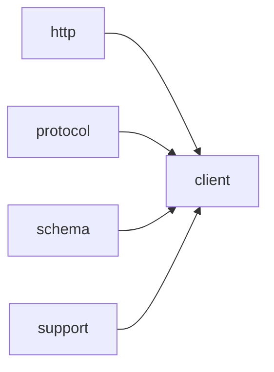

# Module `client`

## Summary

The module `client` is the asynchronous API client for large language model interactions. Its responsibility is to provide a clean, template‑based interface for initiating completion calls, LLM requests, and structured API calls using a protocol‑agnostic design (templated on `Protocol`). It manages the lifecycle of asynchronous operations including event loop selection (via `detail::select_event_loop`), submission of requests, and return of integer handles for tracking or cancellation. The public implementation scope covers three main template functions—`call_completion_async`, `call_llm_async` (with two overloads), and `call_structured_async`—each accepting appropriate arguments such as model identifiers, prompts, connection handles, and an optional pointer to a `kota::event_loop`.

Internally, the module coordinates with the underlying `http`, `protocol`, and `schema` modules to perform HTTP networking, model the request‑response data structures, and generate JSON Schema definitions. It also exposes a helper function in the `detail` namespace (`select_event_loop`) that resolves a null event loop pointer to a default loop. The module’s public interface abstracts away concurrency and networking details, allowing callers to dispatch asynchronous LLM operations while relying on the module to handle scheduling, capability probing, and response delivery via the provided event loop.

## Imports

- [`http`](../http/index.md)
- [`protocol`](../protocol/index.md)
- [`schema`](../schema/index.md)
- `std`
- [`support`](../support/index.md)

## Imported By

- [`anthropic`](../anthropic/index.md)
- [`openai`](../openai/index.md)

## Dependency Diagram

## Functions

### `clore::net::call_completion_async`

Declaration: `network/client.cppm:16`

Definition: `network/client.cppm:57`

Declaration: [`Namespace clore::net`](../../namespaces/clore/net/index.md)

The function implements a probe-and-retry loop (up to four iterations) to obtain a completion response from a language model provider. In each iteration it reads the provider’s environment via `Protocol::read_environment()`, retrieves or probes the provider’s capability set through `get_probed_capabilities`, and sanitizes the `request` by calling `sanitize_request_for_capabilities` to remove unsupported features. It then constructs a JSON payload with `Protocol::build_request_json` and dispatches an asynchronous HTTP POST using `detail::perform_http_request_async` on the event loop selected via `detail::select_event_loop`.  

If the HTTP response carries a client‑error status (4xx) and the body indicates a feature‑rejection error (`is_feature_rejection_error`), the function parses the rejected feature name (e.g., `"response_format"`, `"tool_choice"`, `"tools"`) and atomically updates the relevant capability flag in the `caps` cache. When such a capability is degraded (`changed == true`), it logs a warning and retries the loop with the already‑sanitized request. Otherwise, a successful parse via `Protocol::parse_response` yields a `CompletionResponse`; if the original request required tools but they were stripped by capabilities, the function fails immediately. After exhausting all retries without success, it fails with a `LLMError` indicating that capability probing for the provider has been exhausted.

#### Side Effects

- invokes asynchronous HTTP network I/O
- atomically modifies probed capability flags (atomic stores on caps fields)
- logs warnings via `logging::warn`
- suspends coroutine execution via `co_await`
- transfers ownership of `request` via `std::move` into local variable

#### Reads From

- `request` parameter (moved from)
- `loop` parameter (event loop pointer)
- environment variables via `Protocol::read_environment()`
- probed capabilities from `get_probed_capabilities` global state
- `raw_response.http_status` and `raw_response.body` from HTTP response

#### Writes To

- probing capability atomic flags in `caps` (e.g., `supports_json_schema`, `supports_tool_choice`, etc.)
- log output via `logging::warn`
- HTTP request/response network resources
- local variables (`sanitized`, `request` after move)

#### Usage Patterns

- called to perform async LLM completion with automatic capability probing
- used in coroutine contexts where `kota::task` is awaited
- parameterized with different protocol types to support multiple LLM providers

### `clore::net::call_llm_async`

Declaration: `network/client.cppm:20`

Definition: `network/client.cppm:138`

Declaration: [`Namespace clore::net`](../../namespaces/clore/net/index.md)

The implementation of `clore::net::call_llm_async` is a coroutine that serves as a thin wrapper around the internal `clore::net::detail::request_text_once_async` function. It first obtains a reference to the active event loop by calling `detail::select_event_loop` on the provided `loop` pointer, defaulting to the global loop if `nullptr`. The core work is delegated to `request_text_once_async`, which receives a lambda that invokes `call_completion_async<Protocol>` with the `CompletionRequest` and the event loop reference. The final result is unwrapped through `detail::unwrap_caught_result`, which converts a cancellation into a descriptive `LLMError`. This design separates the retry and orchestration logic (handled by `request_text_once_async`) from the actual completion call, allowing `call_llm_async` to remain focused on binding the model, system prompt, and `PromptRequest` together with the appropriate error handling.

#### Side Effects

- Initiates an asynchronous network request to an LLM endpoint
- Modifies internal asynchronous state via the event loop
- May update shared rate-limit or capability state through callee `detail::request_text_once_async`

#### Reads From

- model parameter
- `system_prompt` parameter
- request parameter (`PromptRequest`)
- loop parameter (event loop pointer)
- Global or static event loop state via `detail::select_event_loop`

#### Writes To

- The returned `kota::task` which will be completed asynchronously with either a string or `LLMError`
- Underlying network sockets or I/O resources
- Internal rate-limiting or capability probe caches (indirectly through callees)

#### Usage Patterns

- Called from coroutine context to obtain an LLM text response asynchronously
- Passed an explicit event loop when a specific loop is required
- Used by higher-level LLM interaction layers that build or wrap completion requests

### `clore::net::call_llm_async`

Declaration: `network/client.cppm:27`

Definition: `network/client.cppm:157`

Declaration: [`Namespace clore::net`](../../namespaces/clore/net/index.md)

The implementation of `clore::net::call_llm_async` is a coroutine that first selects an active event loop via `clore::net::detail::select_event_loop`; if the caller supplies a non-null `loop`, that loop is used, otherwise a default loop is chosen. It then delegates to the internal helper `clore::net::detail::request_text_once_async`, passing a lambda that dispatches the actual protocol‑specific network request through `call_completion_async<Protocol>`. The caller’s `prompt` is packed into a `clore::net::PromptRequest` with `response_format` set to `std::nullopt` and `output_contract` set to `PromptOutputContract::Markdown`, ensuring the LLM returns markdown‑formatted text. The result of `request_text_once_async` is unwrapped via `.or_fail()`, which converts any error into the function’s `kota::task` error channel, so the coroutine either yields the raw LLM response string or terminates with a `clore::net::LLMError`.

#### Side Effects

- Initiates an asynchronous network request to an LLM provider
- May interact with rate limiting mechanisms (rate limit initialization and shutdown functions exist in the same namespace)
- Invokes event loop scheduling for async completion

#### Reads From

- `model` parameter
- `system_prompt` parameter
- `prompt` parameter
- `loop` parameter (optional event loop pointer)
- global rate limit state (indirectly through `call_completion_async`)

#### Usage Patterns

- Used to perform asynchronous LLM completions with a generic protocol
- Invoked by higher-level functions like `call_structed_async`
- Supports different model and prompt configurations

### `clore::net::call_structured_async`

Declaration: `network/client.cppm:34`

Definition: `network/client.cppm:178`

Declaration: [`Namespace clore::net`](../../namespaces/clore/net/index.md)

The function first attempts to obtain a valid JSON schema for the requested type `T` via `clore::net::schema::response_format<T>()`. If the format is unavailable it immediately fails with `kota::fail`. Otherwise it constructs a `clore::net::CompletionRequest` containing the given `model`, `system_prompt`, and `prompt` as a system/user message pair, along with the obtained `response_format` (tools and `tool_choice` are set to `std::nullopt`). It then delegates the actual network call to `call_completion_async<Protocol>` using `.or_fail()` to propagate any `LLMError`. On success the raw response is parsed into `T` via `clore::net::protocol::parse_response_text<T>`; a parse failure triggers `kota::fail`, and a valid result is returned via `co_return`. The overall flow is a linear sequence of three asynchronous steps—format validation, completion request, and structural parsing—each with error handling that short‑circuits on failure.

#### Side Effects

- Performs network I/O via `call_completion_async`
- Allocates memory for string copies and request construction
- May propagate errors that affect coroutine state

#### Reads From

- Parameter `model`
- Parameter `system_prompt`
- Parameter `prompt`
- Parameter `loop`
- Static/global state accessed by `clore::net::schema::response_format<T>()`
- Response data from network call
- Static/global state accessed by `clore::net::protocol::parse_response_text<T>()`

#### Writes To

- Return value `kota::task<T, clore::net::LLMError>` (the coroutine result)
- Network output via the underlying `call_completion_async`

#### Usage Patterns

- Send a structured LLM completion request with system and user prompts and expect a typed response
- Typically invoked with a specific `Protocol` and response type `T`
- Used in async contexts where response format validation is required

### `clore::net::detail::select_event_loop`

Declaration: `network/client.cppm:45`

Definition: `network/client.cppm:45`

Declaration: [`Namespace clore::net::detail`](../../namespaces/clore/net/detail/index.md)

Implementation: [Implementation](functions/select-event-loop.md)

The function implements a simple fallback mechanism: it checks whether the provided `loop` pointer is non‑null, and if so, returns a reference to that object directly. If the pointer is null, it delegates to `kota::event_loop::current()`, which is expected to return a reference to the event loop active on the calling thread. The precondition is that a valid loop exists on the thread when the pointer is null; otherwise the behavior is undefined. The only external dependency is the `kota::event_loop` type and its static `current()` member.

#### Side Effects

No observable side effects are evident from the extracted code.

#### Reads From

- parameter `loop` (nullable pointer to `kota::event_loop`)
- result of `kota::event_loop::current()`

#### Usage Patterns

- Resolves an optional event loop pointer into a guaranteed-valid reference for downstream async operations
- Allows callers to pass `nullptr` to request the current thread's event loop

## Internal Structure

The `client` module provides the public asynchronous API for interacting with `LLMs` via the network. It is decomposed into several template functions (`call_completion_async`, `call_llm_async`, `call_structured_async`) that each accept a protocol template parameter and a `kota::event_loop` pointer, returning an `int` request handle. A detail namespace contains an internal helper `select_event_loop` that resolves a null pointer to a default loop, ensuring all asynchronous operations are scheduled on a valid event loop. Internally, the module builds request objects (e.g., `CompletionRequest`, `PromptRequest`) using types from the `protocol` module, then dispatches HTTP calls via the `http` module, and processes responses through the `schema` module. The implementation layer is structured around managing per‑request state variables such as `loop`, `active_loop`, `model`, `prompt`, `system_prompt`, and response holders (`raw_response`, `parsed`), enabling a clean separation between call initiation, capability probing, and result handling.

## Related Pages

- [Module http](../http/index.md)
- [Module protocol](../protocol/index.md)
- [Module schema](../schema/index.md)
- [Module support](../support/index.md)

