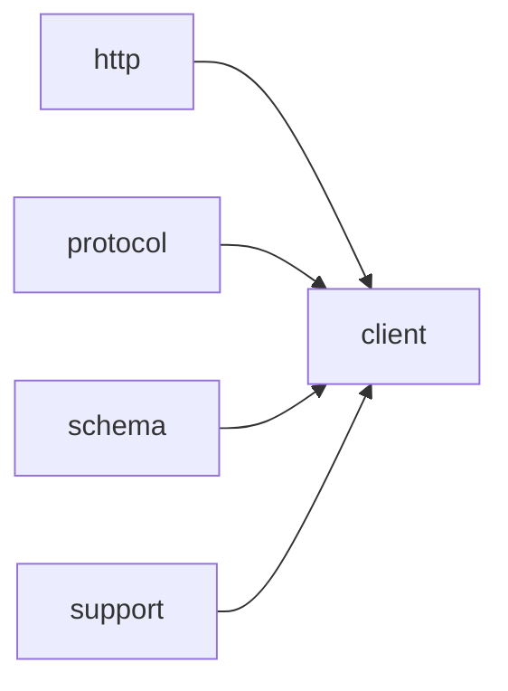

# Module `client`

## Summary

The `client` module provides the public-facing asynchronous interface for interacting with large language model (LLM) endpoints. It exposes three primary templated functions: `call_llm_async`, `call_completion_async`, and `call_structured_async`. These functions accept model identifiers, prompts, and optional event loop pointers, returning integer handles or status codes. The module internally manages event loop selection through `clore::net::detail::select_event_loop`, ensuring asynchronous operations are dispatched on a valid `kota::event_loop`. The public scope also includes variables for request construction, such as `system_prompt`, `model`, `prompt`, and tool-related flags, enabling callers to configure and track LLM calls without directly handling low-level networking.

The module builds upon the `http`, `protocol`, `schema`, and `support` modules, leveraging their capabilities for HTTP dispatch, request/response data structures, structured output schemas, and logging utilities. Its responsibility centers on orchestrating the complete lifecycle of an LLM request—from parameter assembly and event loop binding to response handling—while abstracting protocol-specific details behind the `Protocol` template parameter. This design allows callers to focus on application logic while the module ensures reliable asynchronous execution and integration with the broader `clore` networking layer.

## Imports

- [`http`](../http/index.md)
- [`protocol`](../protocol/index.md)
- [`schema`](../schema/index.md)
- `std`
- [`support`](../support/index.md)

## Imported By

- [`anthropic`](../anthropic/index.md)
- [`openai`](../openai/index.md)

## Dependency Diagram

## Functions

### `clore::net::call_completion_async`

Declaration: `network/client.cppm:16`

Definition: `network/client.cppm:57`

Declaration: [`Namespace clore::net`](../../namespaces/clore/net/index.md)

The implementation of `clore::net::call_completion_async` employs a capability-probing retry loop (up to four attempts) to gracefully handle provider limitations exposed via HTTP 4xx rejection errors. On each iteration, the request is first sanitized against the current probed capabilities via `sanitize_request_for_capabilities`. The `Protocol`‑specific methods `build_request_json`, `read_environment`, `build_url`, and `build_headers` are then called to construct the outgoing payload and endpoint details. An asynchronous HTTP request is dispatched using `clore::net::detail::perform_http_request_async` on the event loop returned by `clore::net::detail::select_event_loop`. If the response carries a 4xx status and the body indicates a feature rejection (e.g., `response_format`, `tool_choice`, `parallel_tool_calls`, or `tools`), the corresponding capability flag in `caps` is updated to `false`, and the loop continues with the sanitized request as the new input. If the sanitization stripped tools while the original request required them, the function immediately fails with an `LLMError`. Otherwise, the raw response is parsed via `Protocol::parse_response` and the parsed result is returned. If all probing attempts are exhausted without success, the coroutine fails with an exhaustion error.

#### Side Effects

- mutates global capabilities cache via atomic stores
- performs HTTP I/O
- logs warnings via `logging::warn`
- may fail `co_await` with `LLMError`

#### Reads From

- `CompletionRequest request`
- global capabilities cache from `get_probed_capabilities`
- environment variables via `Protocol::read_environment`
- HTTP response body
- event loop reference

#### Writes To

- capabilities cache atomic booleans (`supports_json_schema`, `supports_tool_choice`, `supports_parallel_tool_calls`, `supports_tools`)
- output task result (either `CompletionResponse` or `LLMError`)
- log output

#### Usage Patterns

- retry loop with capability probing
- used by higher-level completion functions
- handles feature rejection errors

### `clore::net::call_llm_async`

Declaration: `network/client.cppm:20`

Definition: `network/client.cppm:137`

Declaration: [`Namespace clore::net`](../../namespaces/clore/net/index.md)

The implementation of `clore::net::call_llm_async` is a coroutine that first resolves the active event loop via `detail::select_event_loop`, falling back to the provided `loop` or a default. It then delegates the core logic to `detail::request_text_once_async`, passing a lambda that invokes `call_completion_async<Protocol>` for the actual network request. The result is unwrapped using `detail::unwrap_caught_result`, and a cancellation of the inner `kota::task` is caught and re-raised as an `LLMError`. This design separates the retry and timeout logic (handled by `request_text_once_async`) from the single-shot completion call, while the template parameter `Protocol` allows the same flow to work with different LLM backends.

#### Side Effects

- performs an asynchronous LLM completion request via `call_completion_async`
- handles cancellation by setting a cancel error message

#### Reads From

- parameter `model`
- parameter `system_prompt`
- parameter `request`
- parameter `loop` (used to select event loop)
- result of `detail::select_event_loop`

#### Writes To

- return value of type `kota::task<std::string, clore::net::LLMError>`

#### Usage Patterns

- called to initiate an asynchronous LLM request with cancellation support
- used with an explicit event loop pointer or nullptr for default loop
- invoked as part of a coroutine chain for LLM completion

### `clore::net::call_llm_async`

Declaration: `network/client.cppm:27`

Definition: `network/client.cppm:156`

Declaration: [`Namespace clore::net`](../../namespaces/clore/net/index.md)

The implementation of `clore::net::call_llm_async` begins by resolving the event loop via `detail::select_event_loop`, which returns a reference to either the provided pointer or a default loop. The coroutine then delegates all work to `detail::request_text_once_async`, a generic internal helper that orchestrates the actual LLM request life cycle. The first argument to that helper is a lambda that builds a `CompletionRequest` and forwards it to `call_completion_async<Protocol>`, ensuring that the completion path uses the same protocol and loop. The second, third, and fourth arguments are the `model`, `system_prompt`, and a `PromptRequest` struct containing the user `prompt` together with a `Markdown` output contract and no response format. After `request_text_once_async` completes, the function applies `.or_fail()` to unwrap the result or propagate any `LLMError`. The main dependency is `detail::select_event_loop`; the actual network interaction is abstracted into `call_completion_async` and the `request_text_once_async` machinery.

#### Side Effects

- Initiates asynchronous network I/O to an LLM provider
- Creates a coroutine task enabling suspension and later resumption
- Allocates `PromptRequest`, `CompletionRequest`, and internal coroutine frame
- May trigger rate-limit state updates or logging via called functions

#### Reads From

- Parameters `model`, `system_prompt`, `prompt`
- Global or function-static event loop state via `detail::select_event_loop`
- Probed capabilities cache via `get_probed_capabilities` (indirectly through `call_completion_async`)

#### Writes To

- Event loop's pending task queue (via coroutine suspension)
- Rate-limit counters or logs (indirectly via callees)
- Promises and continuations in the coroutine pipeline

#### Usage Patterns

- Called by `clore::net::call_structured_async`
- Used in high-level async LLM request flows for text generation
- Invoked with template parameter `Protocol` to select the LLM protocol (e.g., `OpenAI`, Anthropic)

### `clore::net::call_structured_async`

Declaration: `network/client.cppm:34`

Definition: `network/client.cppm:177`

Declaration: [`Namespace clore::net`](../../namespaces/clore/net/index.md)

The function template first retrieves a JSON schema describing the expected structured output by calling `clore::net::schema::response_format<T>()`. If the schema is unavailable, the coroutine immediately fails by yielding to `kota::fail`. Otherwise, a `clore::net::CompletionRequest` is constructed, containing the model identifier and a sequence of a system message and a user message, along with the obtained `response_format` and empty tool-related fields. The coroutine then delegates to `clore::net::call_completion_async<Protocol>`, passing the request and the event loop resolved via `clore::net::detail::select_event_loop`. After awaiting the completion call, the raw response string is parsed through `clore::net::protocol::parse_response_text<T>`. If parsing succeeds, the parsed value is returned; otherwise, the coroutine fails with the parse error. This flow ensures that the output strictly adheres to the type’s schema and that any failure in schema retrieval, API call, or response parsing is surfaced as a `clore::net::LLMError` via the coroutine’s error channel.

#### Side Effects

- allocates strings for request construction
- performs asynchronous I/O via `call_completion_async`
- may propagate errors via `kota::fail`

#### Reads From

- model parameter
- `system_prompt` parameter
- prompt parameter
- loop parameter
- global schema registry via `clore::net::schema::response_format<T>()`

#### Writes To

- internal `CompletionRequest` variable
- response string from `call_completion_async`
- returned task containing parsed T value

#### Usage Patterns

- invoked to obtain a structured typed response from an LLM
- used in coroutine contexts requiring a `kota::task` for T
- relies on schema registration for type T

### `clore::net::detail::select_event_loop`

Declaration: `network/client.cppm:45`

Definition: `network/client.cppm:45`

Declaration: [`Namespace clore::net::detail`](../../namespaces/clore/net/detail/index.md)

Implementation: [Implementation](functions/select-event-loop.md)

The function `clore::net::detail::select_event_loop` provides a single dispatch point for obtaining an active event loop reference. It first checks whether the incoming pointer `loop` is non‑null; if so, it dereferences and returns that loop directly. When `loop` is `nullptr`, the function falls back to `kota::event_loop::current()`, which must return a valid loop—this precondition is undefined if no event loop is active on the calling thread. The implementation thus relies on the runtime state of the `kota::event_loop` singleton and ensures the caller always receives a usable loop reference without further validation.

#### Side Effects

No observable side effects are evident from the extracted code.

#### Reads From

- parameter `loop`
- thread-local state accessed by `kota::event_loop::current()`

#### Usage Patterns

- Used by async functions like `call_completion_async` and `call_llm_async` to resolve an optional event loop pointer to a valid reference before passing it to internal logic.

## Internal Structure

The `client` module (implemented in `network/client.cppm`) serves as the top-level orchestration layer for asynchronous interactions with large language models. It imports the `http` module for low‑level network dispatch, the `protocol` module for structured request/response types, and the `schema` module for generating `OpenAI`‑compliant JSON schemas, along with `support` for foundational utilities. Its public API consists of templated functions—`call_llm_async`, `call_completion_async`, and `call_structured_async`—each accepting a `kota::event_loop *` that defaults to an internally selected loop via the `detail::select_event_loop` helper. These functions manage the full lifecycle of an LLM request, from constructing payloads (e.g., from `system_prompt`, `model`, and `prompt` variables) to parsing responses and handling tool calls.

Internally, the module maintains state for active requests through variables such as `loop`, `active_loop`, `request_json`, `sanitized`, `tools_stripped`, and `caps`, which are exposed as public members for use by callers or inspectors. The `detail` namespace encapsulates the event‑loop selection logic, decoupling client code from the loop management details. This decomposition keeps the public interface clean while allowing the module to handle multiple concurrent asynchronous operations, rate‑limiting (via the `http` module), and structured‑output formatting transparently.

## Related Pages

- [Module http](../http/index.md)
- [Module protocol](../protocol/index.md)
- [Module schema](../schema/index.md)
- [Module support](../support/index.md)

