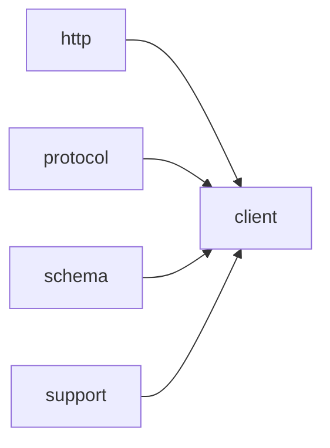

# Module `client`

## Summary

The `client` module provides the public asynchronous interface for interacting with language model services. Its primary responsibility is to initiate non‑blocking LLM requests using configurable network protocols, dispatching operations on a `kota::event_loop` and returning integer handles or status codes. The module exposes function templates such as `clore::net::call_llm_async`, `clore::net::call_structured_async`, and `clore::net::call_completion_async`, each parameterised by a `Protocol` type that selects the underlying transport. Through these templates callers supply prompts, system messages, model identifiers, and optionally a structured response schema, while the module manages the asynchronous lifecycle and delegates HTTP construction, protocol abstraction, and schema generation to its dependencies (`http`, `protocol`, `schema`, and `support`). A `detail` namespace provides internal helpers, notably `select_event_loop`, which resolves a valid event loop pointer to a reference so that higher‑level operations always run on an active loop.

## Imports

- [`http`](../http/index.md)
- [`protocol`](../protocol/index.md)
- [`schema`](../schema/index.md)
- [`support`](../support/index.md)

## Imported By

- [`anthropic`](../anthropic/index.md)
- [`openai`](../openai/index.md)

## Dependency Diagram

```mermaid
graph LR
    M0["client"]
    I0["http"]
    I0 --> M0
    I1["protocol"]
    I1 --> M0
    I2["schema"]
    I2 --> M0
    I3["support"]
    I3 --> M0
```

## Functions

### `clore::net::call_completion_async`

Declaration: `src/network/client.cppm:24`

Definition: `src/network/client.cppm:65`

Declaration: [`Namespace clore::net`](../../namespaces/clore/net/index.md)

The function loops up to four times, each time reading the provider environment via `Protocol::read_environment()` and retrieving probed capabilities through `get_probed_capabilities`. The incoming `request` is sanitized against those capabilities via `sanitize_request_for_capabilities`, and a JSON payload is built with `Protocol::build_request_json`. After selecting the active event loop via `detail::select_event_loop`, an asynchronous HTTP request is dispatched through `detail::perform_http_request_async`.

If the HTTP response carries a 4xx status, the function checks for a feature-rejection error by calling `is_feature_rejection_error` and `parse_rejected_feature_from_error`. When a recognized feature name (such as `"response_format"`, `"tool_choice"`, `"parallel_tool_calls"`, or `"tools"`) is identified, the corresponding capability flag in `caps` is set to `false` using relaxed memory ordering, the sanitized request replaces the original, and the loop retries the call with the reduced feature set. If tools were stripped from the request because the provider does not support them, the function immediately fails with an `LLMError`. On success, the response is parsed via `Protocol::parse_response` and returned. After exhausting all retry attempts, the function fails with an error indicating that capability probing was exhausted.

#### Side Effects

- Performs HTTP request via `detail::perform_http_request_async`
- Atomically modifies capability flags in `ProbedCapabilities` via `store` with `std::memory_order_relaxed`
- Logs warnings via `logging::warn`

#### Reads From

- Parameter `request` of type `clore::net::CompletionRequest`
- Parameter `loop` of type `kota::event_loop*`
- Environment variables read by `Protocol::read_environment()`
- Global probe cache returned by `get_probed_capabilities`
- HTTP response body and status from `raw_response`

#### Writes To

- Atomic booleans in `ProbedCapabilities`: `supports_json_schema`, `supports_tool_choice`, `supports_parallel_tool_calls`, `supports_tools` via `store`

#### Usage Patterns

- Called after environment validation via `validate_llm_provider_environment`
- Used in higher-level async flows that need completion responses with tool support detection
- Cooperates with `make_markdown_fragment_request` and `call_structured_async` as part of a module

### `clore::net::call_llm_async`

Declaration: `src/network/client.cppm:35`

Definition: `src/network/client.cppm:165`

Declaration: [`Namespace clore::net`](../../namespaces/clore/net/index.md)

The function `clore::net::call_llm_async` is a coroutine that orchestrates a single text‑based LLM completion request. It first resolves the event loop via `detail::select_event_loop`, ensuring all asynchronous work runs on the correct `kota::event_loop` reference. It then constructs a `clore::net::PromptRequest` containing the prompt, no explicit `response_format`, and a `PromptOutputContract::Markdown` output contract. The core algorithm delegates to `detail::request_text_once_async`, which accepts a factory lambda that converts the prompt into a `CompletionRequest` and invokes `call_completion_async<Protocol>` on the selected loop. The result produced by the completion call is unwrapped with `.or_fail()`, yielding the raw response string or propagating an error. This design separates concerns by offloading retry logic, timeout handling, and protocol‑specific I/O to the lower‑level `request_text_once_async` and `call_completion_async` machinery.

#### Side Effects

- network I/O to send LLM completion request
- asynchronous coroutine suspension
- error conversion via `or_fail()`

#### Reads From

- model
- `system_prompt`
- prompt
- loop
- event loop reference from `detail::select_event_loop`

#### Writes To

- network output (sending request)

#### Usage Patterns

- called with model, `system_prompt`, prompt, and `event_loop` pointer
- invoked by higher-level async LLM functions
- used to perform asynchronous text completion with markdown output

### `clore::net::call_llm_async`

Declaration: `src/network/client.cppm:28`

Definition: `src/network/client.cppm:146`

Declaration: [`Namespace clore::net`](../../namespaces/clore/net/index.md)

The implementation of `clore::net::call_llm_async` is a coroutine that first resolves the event loop by calling `clore::net::detail::select_event_loop` with the optional `loop` argument, obtaining a reference to `active_loop`. It then delegates the actual LLM request to `clore::net::detail::request_text_once_async`, passing a lambda that invokes `call_completion_async<Protocol>` with the constructed `clore::net::CompletionRequest` and a pointer to `active_loop`. The result of `request_text_once_async` is caught for cancellation via `.catch_cancel()`, and the final outcome is unwrapped through `clore::net::detail::unwrap_caught_result`, which transforms cancellation into a `clore::net::LLMError`. The entire chain runs as a coroutine returning `kota::task<std::string, clore::net::LLMError>`. Dependencies include the event‑loop selection helper, the reusable text‑request pipeline, and the completion call under the given protocol.

#### Side Effects

- initiates an asynchronous network request to an LLM provider
- registers callbacks on the given or default event loop
- potentially modifies internal rate-limiting state via `call_completion_async`
- handles cancellation, which may clean up pending operations

#### Reads From

- model parameter
- `system_prompt` parameter
- request parameter
- loop parameter (or global event loop if null)
- internal probed capabilities cache (indirectly via `call_completion_async`)

#### Writes To

- event loop's internal task queue
- network I/O buffers
- task result storage (via coroutine return)

#### Usage Patterns

- called with a `PromptRequest` and optional event loop to perform LLM text generation
- used as the primary entry point for asynchronous LLM calls in the library
- `co_awaited` by callers to obtain either a string result or an `LLMError`

### `clore::net::call_structured_async`

Declaration: `src/network/client.cppm:42`

Definition: `src/network/client.cppm:186`

Declaration: [`Namespace clore::net`](../../namespaces/clore/net/index.md)

The implementation obtains a structured response format by calling `clore::net::schema::response_format<T>()` and immediately returns a failure via `kota::fail` if the optional is empty.  A `clore::net::CompletionRequest` is then constructed with the given `model`, the provided `system_prompt` and `prompt` packaged as `SystemMessage` and `UserMessage`, and the retrieved `response_format`; the `tools`, `tool_choice`, and `parallel_tool_calls` fields are set to empty or `std::nullopt`.  The request is forwarded to `call_completion_async<Protocol>` along with the resolved event loop obtained from `detail::select_event_loop(loop)`; the resulting coroutine is awaited with `.or_fail()`, which propagates any `LLMError`.

After the raw response text is retrieved, the function invokes `clore::net::protocol::parse_response_text<T>` to deserialize it into the requested type `T`.  If parsing fails, the error is again surfaced via `kota::fail`.  On success, the parsed object is returned via `co_return`.  The major dependencies are the schema‑based format generation, the completion call chain, and the protocol‑specific response parser, all of which are resolved through the template parameter `Protocol`.

#### Side Effects

- Initiates an asynchronous network request to an LLM API via `call_completion_async`, which may involve I/O, rate limiting, and logging; potentially modifies state in rate limiters or probed capabilities caches indirectly through the call chain.

#### Reads From

- model (`string_view`)
- `system_prompt` (`string_view`)
- prompt (`string_view`)
- event loop pointer
- global schema registry via `schema::response_format<T>()`
- global probed capabilities cache (indirectly via `call_completion_async`)

#### Writes To

- Returns a coroutine task that transfers ownership of the parsed result to the caller; no direct mutation of external state.

#### Usage Patterns

- Used by callers that need structured, type-safe responses from an LLM; typically invoked on an event loop with appropriate protocol and response type template parameters.

### `clore::net::detail::select_event_loop`

Declaration: `src/network/client.cppm:53`

Definition: `src/network/client.cppm:53`

Declaration: [`Namespace clore::net::detail`](../../namespaces/clore/net/detail/index.md)

Implementation: [Implementation](functions/select-event-loop.md)

The function first checks whether the incoming `loop` pointer is non-null. If it is, the function immediately dereferences it and returns that reference, preserving an explicitly provided loop. Otherwise, it falls back to `kota::event_loop::current()`, which returns a reference to the active event loop for the calling thread. The implementation relies on the precondition that this static method always yields a valid loop; if no loop is active on the thread, the behavior is undefined. This two‑step control flow allows callers to optionally supply a loop while ensuring that a valid reference is always obtained without dynamic allocation.

#### Side Effects

No observable side effects are evident from the extracted code.

#### Reads From

- parameter `loop`
- current thread's event loop via `kota::event_loop::current()`

#### Usage Patterns

- used by `clore::net::call_llm_async` to resolve an event loop reference
- used by `clore::net::call_completion_async` to resolve an event loop reference
- provides fallback to current loop when caller passes null

## Internal Structure

The `client` module is the primary public interface for initiating asynchronous LLM requests, exposing a small set of template functions (`call_completion_async`, `call_llm_async`, `call_structured_async`) parameterized by a `Protocol` type that selects the underlying networking transport. Its decomposition separates the public API from internal helpers: a `detail` namespace contains `select_event_loop`, which resolves an optional `kota::event_loop*` to a valid reference, ensuring that all async operations execute on a live event loop without placing that burden on callers. Internally, the module imports `http` (for HTTP networking and rate-limiting), `protocol` (for request/response types and validation), `schema` (for JSON Schema generation used in structured outputs), and `support` (for string utilities, caching, and logging). This layering keeps the client focused on orchestration and event-loop management, while delegating wire-format construction, transport, and schema handling to specialized modules.

## Related Pages

- [Module http](../http/index.md)
- [Module protocol](../protocol/index.md)
- [Module schema](../schema/index.md)
- [Module support](../support/index.md)

