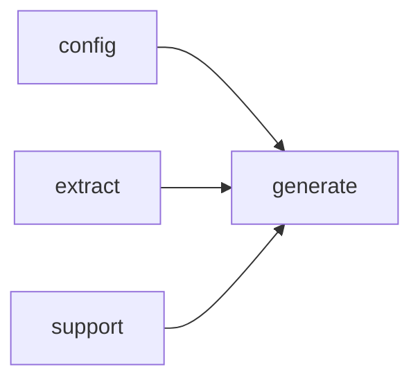

# Module `generate:analysis`

## Summary

The `generate:analysis` module is responsible for orchestrating the generation of structured analyses for code symbols—variables, functions, and types—by constructing AI prompts, parsing model responses, and normalizing the results. It owns the full pipeline of prompt building, response interpretation, fallback generation, and result persistence, ensuring that downstream consumers always have a well-formed analysis to work with.

Its public-facing scope includes entry points such as `parse_structured_response`, `normalize_markdown_fragment`, `build_symbol_analysis_prompt`, `apply_symbol_analysis_response`, `store_fallback_analysis`, and a set of predicate functions (`is_base_symbol_analysis_prompt`, `is_declaration_summary_prompt`, `analysis_prompt_kind_for_symbol`, `symbol_prompt_kinds_for_symbol`) that classify prompt kinds and drive the correct analysis strategy for each symbol. Internally, the module provides lenient parsing and fallback mechanisms for type, function, and variable analyses, as well as normalization and merging utilities to produce consistent, structured output from raw AI responses.

## Imports

- [`config`](../config/index.md)
- [`extract`](../extract/index.md)
- [`generate:evidence`](evidence.md)
- [`generate:markdown`](markdown.md)
- [`generate:model`](model.md)
- `std`
- [`support`](../support/index.md)

## Imported By

- [`generate:dryrun`](dryrun.md)
- [`generate:scheduler`](scheduler.md)

## Dependency Diagram

## Functions

### `clore::generate::analysis_prompt_kind_for_symbol`

Declaration: `generate/analysis.cppm:27`

Definition: `generate/analysis.cppm:286`

Declaration: [`Namespace clore::generate`](../../namespaces/clore/generate/index.md)

The function implements an early-return dispatch based on the kind of the input symbol. It sequentially tests `is_function_kind`, `is_type_kind`, and `is_variable_kind` on `sym.kind`, returning the corresponding `PromptKind` enumerator `FunctionAnalysis`, `TypeAnalysis`, or `VariableAnalysis` as soon as a match is found. If none of the kind predicates hold, it returns `std::nullopt`. This control flow relies on the `extract::SymbolInfo` type, the `PromptKind` enumeration, and the three helper predicates; no external state or complex branching is involved.

#### Side Effects

No observable side effects are evident from the extracted code.

#### Reads From

- `sym` (specifically `sym.kind`)

#### Usage Patterns

- Used to select the appropriate `PromptKind` when constructing analysis evidence and prompts for a symbol

### `clore::generate::apply_symbol_analysis_response`

Declaration: `generate/analysis.cppm:39`

Definition: `generate/analysis.cppm:348`

Declaration: [`Namespace clore::generate`](../../namespaces/clore/generate/index.md)

The function `clore::generate::apply_symbol_analysis_response` routes a raw LLM response into the appropriate symbol analysis store entry based on `PromptKind`. It first computes a `target_key` via `make_symbol_target_key` from the symbol `sym`. A `switch` on `kind` then dispatches to a case‑specific lenient parser (e.g., `parse_function_analysis_lenient`, `parse_type_analysis_lenient`, `parse_variable_analysis_lenient`, or `parse_markdown_prompt_output`). If parsing fails, the function returns `std::unexpected` with the captured error. On success, the outcome is integrated into `analyses`: for `FunctionAnalysis` and `TypeAnalysis`, a fallback analysis is generated (via `fallback_function_analysis` or `fallback_type_analysis`) and then merged with the parsed result using `merge_function_analysis` or `merge_type_analysis`; for declaration/implementation summary kinds, the parsed markdown is stored directly into the `overview_markdown` or `details_markdown` field of the appropriate function or type analysis; for `VariableAnalysis`, the parsed object is directly assigned to `analyses.variables[target_key]`. An unsupported `kind` triggers an error return. The implementation depends on the public lenient‑parsing helpers, fallback generators, and merge routines, all operating within the `clore::generate` namespace.

#### Side Effects

- Modifies `analyses` by inserting parsed data into `analyses.functions`, `analyses.types`, and `analyses.variables` maps

#### Reads From

- `analyses`: reads existing analysis entries via `analyses.functions[target_key]`, `analyses.types[target_key]`
- `sym`: used to build target key and for fallback analysis
- `model`: used for fallback type analysis
- `kind`: determines which parser and merge logic to apply
- `raw_response`: the input string to parse

#### Writes To

- `analyses.functions`: writes via `merge_function_analysis` or direct assignment of markdown fields
- `analyses.types`: writes via `merge_type_analysis` or direct assignment of markdown fields
- `analyses.variables`: writes via direct assignment after parsing

#### Usage Patterns

- Called by generation infrastructure to integrate AI responses into the analysis store
- Typically invoked after sending a prompt for a specific symbol and `PromptKind`
- The response is parsed and merged, with fallback logic for robustness

### `clore::generate::build_symbol_analysis_prompt`

Declaration: `generate/analysis.cppm:46`

Definition: `generate/analysis.cppm:429`

Declaration: [`Namespace clore::generate`](../../namespaces/clore/generate/index.md)

The function `clore::generate::build_symbol_analysis_prompt` constructs a complete analysis prompt for a given symbol. It begins by dispatching on the `PromptKind` to select the appropriate evidence builder (e.g., `build_evidence_for_function_analysis`), each of which gathers context from the `ProjectModel` and `SymbolAnalysisStore` into an `EvidencePack`. After building evidence, it sets common metadata fields ( `page_id`, `prompt_kind`, `subject_name` ) on the pack, then delegates to `build_prompt` to render the final prompt string. If the `PromptKind` is unsupported, or if `build_prompt` fails, the function returns a `GenerateError` describing the failure. Dependencies include the per‑kind evidence builders, `prompt_kind_name`, `make_symbol_target_key`, and the `build_prompt` utility.

#### Side Effects

No observable side effects are evident from the extracted code.

#### Reads From

- const `extract::SymbolInfo`& sym (specifically sym`.qualified_name`)
- `PromptKind` kind
- const `extract::ProjectModel`& model
- const `config::TaskConfig`& config (specifically config`.project_root`)
- const `SymbolAnalysisStore`& analyses

#### Usage Patterns

- generating prompts for function, type, and variable analysis
- called from higher-level generation functions to produce LLM prompts

### `clore::generate::is_base_symbol_analysis_prompt`

Declaration: `generate/analysis.cppm:31`

Definition: `generate/analysis.cppm:325`

Declaration: [`Namespace clore::generate`](../../namespaces/clore/generate/index.md)

The function `clore::generate::is_base_symbol_analysis_prompt` performs a simple membership test: it accepts a `PromptKind` value and returns `true` if and only if the kind matches one of three known enumeration members—`PromptKind::FunctionAnalysis`, `PromptKind::TypeAnalysis`, or `PromptKind::VariableAnalysis`. The implementation consists of a single `return` statement combining those three comparisons with the logical OR `operator`, making the control flow unconditional and branch-free. No external dependencies are required beyond the `PromptKind` enum definition; the function serves as a lightweight predicate used to classify prompt types before further processing in the analysis pipeline.

#### Side Effects

No observable side effects are evident from the extracted code.

#### Reads From

- parameter `kind`

#### Usage Patterns

- used to determine whether a given prompt kind belongs to the base symbol analysis category
- called when building prompts or caching keys for symbol analysis

### `clore::generate::is_declaration_summary_prompt`

Declaration: `generate/analysis.cppm:33`

Definition: `generate/analysis.cppm:330`

Declaration: [`Namespace clore::generate`](../../namespaces/clore/generate/index.md)

The function performs an equality check against two enumerators of `PromptKind`. It returns `true` if the input `kind` equals `PromptKind::FunctionDeclarationSummary` or `PromptKind::TypeDeclarationSummary`, and `false` otherwise. No additional logic, branching, or external state is involved. The only dependency is the definition of the `PromptKind` enumeration, which must contain the two named constants.

#### Side Effects

No observable side effects are evident from the extracted code.

#### Reads From

- `kind` parameter

#### Usage Patterns

- classifying prompt kinds
- determining if a prompt is a declaration summary

### `clore::generate::normalize_markdown_fragment`

Declaration: `generate/analysis.cppm:21`

Definition: `generate/analysis.cppm:267`

Declaration: [`Namespace clore::generate`](../../namespaces/clore/generate/index.md)

The function `clore::generate::normalize_markdown_fragment` takes a raw markdown string view and a context label, then produces a normalized `std::expected<std::string, GenerateError>`. It first ensures the input is valid UTF-8 via `clore::support::ensure_utf8`, strips any UTF-8 BOM with `clore::support::strip_utf8_bom`, and removes trailing ASCII whitespace using the internal helper `trim_trailing_ascii_whitespace`. If the result contains no non‑whitespace characters (checked by `contains_non_whitespace`), it returns an error with a descriptive message incorporating the `context` parameter. Otherwise it applies `normalize_analysis_markdown` to the string and returns the final normalized fragment.

All processing relies on utilities from the `clore::support` namespace for Unicode handling and on two anonymous‑namespace helpers (`trim_trailing_ascii_whitespace` and `contains_non_whitespace`), plus the complex `normalize_analysis_markdown` routine that performs further markdown‑specific normalization. The function does not parse or generate analysis data itself; it is a low‑level text preparation step used by higher‑level analysis parsing functions to produce consistent, error‑checked markdown fragments.

#### Side Effects

No observable side effects are evident from the extracted code.

#### Reads From

- `raw`
- `context`

#### Usage Patterns

- Called when a raw markdown fragment needs to be validated and normalized before further processing; returns an error if the fragment is empty.

### `clore::generate::parse_markdown_prompt_output`

Declaration: `generate/analysis.cppm:24`

Definition: `generate/analysis.cppm:281`

Declaration: [`Namespace clore::generate`](../../namespaces/clore/generate/index.md)

The function `clore::generate::parse_markdown_prompt_output` is a thin delegation wrapper that immediately calls `clore::generate::normalize_markdown_fragment` with the same `raw` and `context` arguments, then returns its result. Internally, control flow consists solely of that single function call; no additional processing or error handling is performed within this function itself. Its dependency is entirely on `normalize_markdown_fragment`, which performs the actual markdown normalization logic. By providing a dedicated entry point, `parse_markdown_prompt_output` isolates the markdown‑prompt parsing concern and offers a uniform signature that can be easily discovered or mocked elsewhere in the library.

#### Side Effects

No observable side effects are evident from the extracted code.

#### Reads From

- `raw` parameter (`std::string_view`)
- `context` parameter (`std::string_view`)

#### Writes To

- Return value of type `std::expected<std::string, GenerateError>`

#### Usage Patterns

- Used as a wrapper to normalize markdown prompt output fragments.
- Likely called when processing raw text from LLM responses or similar sources.

### `clore::generate::parse_structured_response`

Declaration: `generate/analysis.cppm:18`

Definition: `generate/analysis.cppm:252`

Declaration: [`Namespace clore::generate`](../../namespaces/clore/generate/index.md)

The function `parse_structured_response` first attempts to deserialize the provided `raw` JSON string into type `T` via `json::from_json<T>`. If this operation fails, it immediately returns a `GenerateError` whose message incorporates the `context` parameter (typically identifying the symbol or prompt being parsed) and the underlying parse error description. On success, the parsed object is moved into a local variable and passed to the internal helper `normalize_analysis`, which performs post‑processing (such as trimming whitespace, merging analyses, or normalizing markdown content) before the result is returned. This two‑step flow ensures that any malformed or incomplete structured response is reported with a descriptive error, while a valid response undergoes a consistent normalization step that aligns the data structure for downstream consumption.

#### Side Effects

No observable side effects are evident from the extracted code.

#### Reads From

- `raw` `string_view`
- `context` `string_view`

#### Usage Patterns

- parsing structured responses from AI prompts
- handling JSON parse errors with context
- normalizing parsed analysis objects

### `clore::generate::store_fallback_analysis`

Declaration: `generate/analysis.cppm:35`

Definition: `generate/analysis.cppm:335`

Declaration: [`Namespace clore::generate`](../../namespaces/clore/generate/index.md)

The function `clore::generate::store_fallback_analysis` dispatches to a kind-specific fallback generator based on the symbol type, then inserts the result into the appropriate analysis store. It first constructs a target key by calling `make_symbol_target_key(sym)`. Control then branches on the symbol kind: for function kinds, `fallback_function_analysis(sym)` is stored in `analyses.functions`; for type kinds, `fallback_type_analysis(sym, model)` is stored in `analyses.types`; for variable kinds, `fallback_variable_analysis(sym)` is stored in `analyses.variables`. The function relies on helper predicates `is_function_kind`, `is_type_kind`, and `is_variable_kind` to determine the branch, and on the three anonymous‑namespace fallback generators (`fallback_function_analysis`, `fallback_type_analysis`, `fallback_variable_analysis`) to produce the default analysis data. The updated `analyses` is the sole output, mutated via direct map assignment.

#### Side Effects

- Modifies the `analyses` object by inserting or overwriting a fallback analysis into its `functions`, `types`, or `variables` map.

#### Reads From

- `sym` (the `extract::SymbolInfo` parameter) including its `kind` field
- `model` (the `extract::ProjectModel` parameter)
- `analyses` is not read for values, only written to

#### Writes To

- `analyses.functions` (if symbol is a function kind)
- `analyses.types` (if symbol is a type kind)
- `analyses.variables` (if symbol is a variable kind)

#### Usage Patterns

- Called to store a fallback analysis for a symbol when direct analysis is missing or incomplete.
- Used in contexts where a symbol must have an analysis entry before further processing.

### `clore::generate::symbol_prompt_kinds_for_symbol`

Declaration: `generate/analysis.cppm:29`

Definition: `generate/analysis.cppm:299`

Declaration: [`Namespace clore::generate`](../../namespaces/clore/generate/index.md)

The function first obtains a base analysis `PromptKind` by delegating to `analysis_prompt_kind_for_symbol`. If that call returns `std::nullopt`, an empty vector is returned immediately. Otherwise, the function dispatches on the base kind: for `PromptKind::FunctionAnalysis` it returns a vector containing the base kind together with `PromptKind::FunctionDeclarationSummary` and `PromptKind::FunctionImplementationSummary`; for `PromptKind::TypeAnalysis` it similarly returns the base kind plus `TypeDeclarationSummary` and `TypeImplementationSummary`; for `PromptKind::VariableAnalysis` only the base kind is returned; all other values yield an empty vector. The control flow thus maps a high-level prompt category into a concrete set of `PromptKind` values that will be requested from the generation pipeline.

#### Side Effects

No observable side effects are evident from the extracted code.

#### Reads From

- `extract::SymbolInfo` parameter `sym`
- `analysis_prompt_kind_for_symbol`

#### Usage Patterns

- Called to decide which prompt variants to generate for a symbol (e.g., declaration summary, implementation summary).

## Internal Structure

The `generate:analysis` module is responsible for structuring the analysis of code symbols—functions, types, and variables—by classifying prompt kinds, building analysis prompts, parsing and normalizing model responses, and storing fallback analyses. It is organized into three internal layers: a set of anonymous-namespace helpers that handle lenient parsing (e.g., `parse_type_analysis_lenient`), merging (`merge_type_analysis`, `merge_function_analysis`), and fallback generation (`fallback_variable_analysis`, `fallback_function_analysis`); a normalization tier that transforms raw markdown fragments and analysis lists into consistent representations; and a public API that exposes functions such as `build_symbol_analysis_prompt`, `apply_symbol_analysis_response`, and `store_fallback_analysis`. The module imports `config`, `extract`, `generate:evidence`, `generate:markdown`, `generate:model`, `support`, and `std`, making it a higher-level consumer of evidence collection and Markdown formatting abstractions while remaining independent of page-level orchestration.

## Related Pages

- [Module config](../config/index.md)
- [Module extract](../extract/index.md)
- [Module generate:evidence](evidence.md)
- [Module generate:markdown](markdown.md)
- [Module generate:model](model.md)
- [Module support](../support/index.md)

