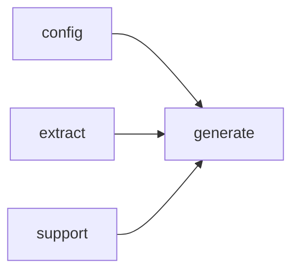

# Module `generate:analysis`

## Summary

The `generate:analysis` module is responsible for transforming raw language model outputs into structured symbol analyses—covering functions, types, variables, and declarations—that drive documentation generation. It owns all logic for parsing, normalizing, merging, and applying analyses: it constructs analysis prompts for individual symbols, interprets free‑form or structured model responses (via `parse_structured_response` and `parse_markdown_prompt_output`), applies fallback analyses when primary results are unavailable, and normalizes Markdown fragments for consistent downstream processing.

The public implementation scope includes functions such as `build_symbol_analysis_prompt`, `apply_symbol_analysis_response`, `store_fallback_analysis`, `normalize_markdown_fragment`, `parse_structured_response`, `parse_markdown_prompt_output`, and the predicate helpers `analysis_prompt_kind_for_symbol`, `symbol_prompt_kinds_for_symbol`, `is_declaration_summary_prompt`, and `is_base_symbol_analysis_prompt`. These entry points integrate with the broader generation pipeline by accepting lightweight integer handles for symbols, models, and contexts, and returning integer codes or handle results that indicate success, error conditions, or which prompt kinds apply. The module also provides internal fallback and lenient parsing routines for each analysis category (function, type, variable) and merges partial analyses into a coherent whole.

## Imports

- [`config`](../config/index.md)
- [`extract`](../extract/index.md)
- [`generate:evidence`](evidence.md)
- [`generate:markdown`](markdown.md)
- [`generate:model`](model.md)
- `std`
- [`support`](../support/index.md)

## Imported By

- [`generate:dryrun`](dryrun.md)
- [`generate:scheduler`](scheduler.md)

## Dependency Diagram

## Functions

### `clore::generate::analysis_prompt_kind_for_symbol`

Declaration: `generate/analysis.cppm:27`

Definition: `generate/analysis.cppm:286`

Declaration: [`Namespace clore::generate`](../../namespaces/clore/generate/index.md)

The function `clore::generate::analysis_prompt_kind_for_symbol` uses a straightforward sequence of conditional checks on the symbol kind to determine which category of analysis prompt is appropriate. It first verifies whether the kind corresponds to a function via `clore::generate::is_function_kind`, then a type via `clore::generate::is_type_kind`, and finally a variable via `clore::generate::is_variable_kind`. On the first match, it returns the corresponding enumerator of `PromptKind` (respectively `PromptKind::FunctionAnalysis`, `PromptKind::TypeAnalysis`, or `PromptKind::VariableAnalysis`). If none of the conditions hold, the function returns `std::nullopt`, indicating that no analysis prompt kind is applicable. The control flow is purely linear, with no loops or branching beyond the early-return pattern. Its only dependencies are the helper predicates for symbol kind classification and the `PromptKind` enum type.

#### Side Effects

No observable side effects are evident from the extracted code.

#### Reads From

- `sym.kind`
- `PromptKind::FunctionAnalysis`
- `PromptKind::TypeAnalysis`
- `PromptKind::VariableAnalysis`
- `std::nullopt`

#### Usage Patterns

- Used to determine which analysis prompt kind to generate for a symbol
- Called during page building to select analysis prompt template

### `clore::generate::apply_symbol_analysis_response`

Declaration: `generate/analysis.cppm:39`

Definition: `generate/analysis.cppm:348`

Declaration: [`Namespace clore::generate`](../../namespaces/clore/generate/index.md)

The function `clore::generate::apply_symbol_analysis_response` first computes a `target_key` from the symbol `sym` via `make_symbol_target_key`. It then dispatches on the `kind` parameter inside a `switch` statement. For each recognized `PromptKind`, it attempts to parse the `raw_response` using the appropriate lenient parser from the anonymous namespace: `parse_function_analysis_lenient`, `parse_markdown_prompt_output`, `parse_type_analysis_lenient`, or `parse_variable_analysis_lenient`. If parsing fails, a `std::unexpected` error is returned immediately. For `FunctionAnalysis` and `TypeAnalysis` kinds, the function also generates a fallback analysis via `fallback_function_analysis` or `fallback_type_analysis`, then merges the parsed result into the store using `merge_function_analysis` or `merge_type_analysis`. For declaration/implementation summary kinds (`FunctionDeclarationSummary`, `FunctionImplementationSummary`, `TypeDeclarationSummary`, `TypeImplementationSummary`), the parsed markdown is assigned to the corresponding `overview_markdown` or `details_markdown` field of the analysis in `analyses`. For `VariableAnalysis`, the parsed value is assigned directly to `analyses.variables[target_key]`. The default branch returns an error for unsupported `kind` values.

#### Side Effects

- Mutates the `SymbolAnalysisStore` passed by reference, updating function, type, or variable analysis entries.

#### Reads From

- `analyses` parameter (mutable reference, reads existing analysis maps)
- `sym` parameter (symbol info)
- `model` parameter (project model)
- `kind` parameter (prompt kind)
- `raw_response` parameter (response string)
- Output of `make_symbol_target_key(sym)`
- Output of `prompt_request_key(PromptRequest{...})`
- Internal parsing functions (e.g., `parse_function_analysis_lenient`, `parse_markdown_prompt_output`)

#### Writes To

- `analyses.functions[target_key]` (function analysis or markdown fields)
- `analyses.types[target_key]` (type analysis or markdown fields)
- `analyses.variables[target_key]` (variable analysis)

#### Usage Patterns

- Called to process a symbol analysis response and update the internal analysis store
- Used after receiving a response from a prompt request for a specific symbol and prompt kind

### `clore::generate::build_symbol_analysis_prompt`

Declaration: `generate/analysis.cppm:46`

Definition: `generate/analysis.cppm:429`

Declaration: [`Namespace clore::generate`](../../namespaces/clore/generate/index.md)

The function `clore::generate::build_symbol_analysis_prompt` begins with a `switch` on the `kind` parameter to dispatch to one of several `build_evidence_for_*` helper functions, each tailored to a specific `PromptKind` (e.g., `FunctionAnalysis`, `TypeDeclarationSummary`, `VariableAnalysis`). These helpers populate an `EvidencePack` object using the provided `sym`, `model`, `config`, and (in some cases) `analyses`. After the switch, the function sets common fields on the evidence: `page_id` to the string `"symbol_analysis_phase"`, `prompt_kind` to the result of `prompt_kind_name(kind)`, and `subject_name` to `sym.qualified_name`. It then delegates to `build_prompt(kind, evidence)` to assemble the final prompt string. If `build_prompt` fails, the error is wrapped into a `GenerateError` and returned via `std::unexpected`. The function also returns an error for any `kind` that does not match the supported cases.

Dependencies include the `build_evidence_for_*` family of functions, `build_prompt`, `prompt_kind_name`, and `make_symbol_target_key` (used in error messages). The overall control flow is a linear dispatch–assembly–construction pattern with two distinct failure points: the default switch case and a failed `build_prompt` call.

#### Side Effects

No observable side effects are evident from the extracted code.

#### Reads From

- `sym`
- `kind`
- `model`
- `config.project_root`
- `analyses`
- `prompt_kind_name(kind)`
- `sym.qualified_name`

#### Usage Patterns

- Called to build a prompt for a specific symbol analysis kind.
- Used in the documentation generation process to create LLM prompts for symbol analysis.

### `clore::generate::is_base_symbol_analysis_prompt`

Declaration: `generate/analysis.cppm:31`

Definition: `generate/analysis.cppm:325`

Declaration: [`Namespace clore::generate`](../../namespaces/clore/generate/index.md)

The function implements a membership test by comparing the `kind` parameter against three prompt-kind enumerators: `PromptKind::FunctionAnalysis`, `PromptKind::TypeAnalysis`, and `PromptKind::VariableAnalysis`. Internally, the control flow reduces to a single boolean expression composed of equality comparisons combined with logical OR. This function serves as a classification predicate that dispatches to a common decision point; its only dependency is the definition of `PromptKind` and its associated values.

#### Side Effects

No observable side effects are evident from the extracted code.

#### Reads From

- parameter `kind` of type `PromptKind`

#### Usage Patterns

- classifying prompt kinds as base symbol analysis
- filtering in conditional branches

### `clore::generate::is_declaration_summary_prompt`

Declaration: `generate/analysis.cppm:33`

Definition: `generate/analysis.cppm:330`

Declaration: [`Namespace clore::generate`](../../namespaces/clore/generate/index.md)

This function acts as a simple predicate that determines whether a given `PromptKind` corresponds to either a function or a type declaration summary. Internally, it performs a direct equality check against the two enumerators `PromptKind::FunctionDeclarationSummary` and `PromptKind::TypeDeclarationSummary`, returning `true` if either comparison succeeds and `false` otherwise. The only dependency is the `PromptKind` enumeration, which defines the set of prompt kinds used throughout the generation pipeline. The control flow is entirely linear—no branches other than the short‑circuited logical `or` `operator`.

#### Side Effects

No observable side effects are evident from the extracted code.

#### Reads From

- parameter `kind` of type `PromptKind`

#### Usage Patterns

- used to filter prompt kinds for declaration summaries
- called to classify a `PromptKind` as a declaration-related prompt

### `clore::generate::normalize_markdown_fragment`

Declaration: `generate/analysis.cppm:21`

Definition: `generate/analysis.cppm:267`

Declaration: [`Namespace clore::generate`](../../namespaces/clore/generate/index.md)

The function first normalizes the input to well-formed UTF-8 via `clore::support::ensure_utf8`, then strips any UTF-8 byte order mark using `clore::support::strip_utf8_bom`. Trailing ASCII whitespace is removed through the internal helper `trim_trailing_ascii_whitespace`. A presence check via `contains_non_whitespace` guards against completely blank fragments; if the string is empty or contains only whitespace, the function returns a `std::unexpected` with a `GenerateError` that includes the `context` string. Finally, `normalize_analysis_markdown` applies additional markdown‑level normalization (for example, trimming spaces inside code spans or normalizing list indentation) before the result is returned.

The control flow is entirely sequential and error‑oriented: initial encoding and BOM corrections, whitespace trimming, a validity gate that short‑circuits to an error, and a dedicated normalization step. Dependencies are limited to the `clore::support` string‑utility layer and several file‑local helper functions (`trim_trailing_ascii_whitespace`, `contains_non_whitespace`, `normalize_analysis_markdown`), all defined in the anonymous namespace of the implementation file.

#### Side Effects

No observable side effects are evident from the extracted code.

#### Reads From

- `raw` parameter
- `context` parameter

#### Usage Patterns

- Used to clean and standardize markdown fragments before embedding in generated documentation.

### `clore::generate::parse_markdown_prompt_output`

Declaration: `generate/analysis.cppm:24`

Definition: `generate/analysis.cppm:281`

Declaration: [`Namespace clore::generate`](../../namespaces/clore/generate/index.md)

The function `parse_markdown_prompt_output` is a thin wrapper that delegates all work to `normalize_markdown_fragment`. It receives the raw markdown prompt output in `raw` and a `context` string, then immediately calls `normalize_markdown_fragment(raw, context)` and returns its result (a `std::expected<std::string, GenerateError>`). The internal control flow consists solely of this single call; no additional parsing or validation logic is present in the function body. Its only dependency is `normalize_markdown_fragment`, which performs the actual markdown normalization and is itself part of the anonymous namespace within `clore::generate`.

#### Side Effects

No observable side effects are evident from the extracted code.

#### Reads From

- parameter `raw`
- parameter `context`

#### Usage Patterns

- Called to normalize the output of a markdown prompt before further processing
- Used in generation pipeline to clean up raw LLM responses

### `clore::generate::parse_structured_response`

Declaration: `generate/analysis.cppm:18`

Definition: `generate/analysis.cppm:252`

Declaration: [`Namespace clore::generate`](../../namespaces/clore/generate/index.md)

The function `clore::generate::parse_structured_response` accepts a raw JSON string (`raw`) and a human-readable `context` string (used only for error reporting) and returns a `std::expected<T, GenerateError>`. Internally it first attempts to deserialize `raw` into type `T` via `json::from_json`; if that fails, it constructs a `GenerateError` containing a formatted message that includes the `context` identifier and the parsing error description, then returns an unexpected result. On successful deserialization, the parsed value is moved into a local variable and passed to `normalize_analysis`, an anonymous‑namespace helper that applies any required post‑processing (such as trimming whitespace or merging partial analyses) before the final value is returned. The function therefore acts as a thin wrapper that combines JSON parsing with a mandatory normalization step, delegating the detailed analysis of the structured response’s content to the external `normalize_analysis` routine.

#### Side Effects

- Calls `normalize_analysis` on the parsed value, which may modify the value or perform other side effects.

#### Reads From

- raw (`std::string_view`)
- context (`std::string_view`)

#### Writes To

- The returned `std::expected<T, GenerateError>` (ownership of the parsed value is transferred)
- The local parsed value before normalization (through `normalize_analysis`)

#### Usage Patterns

- Parsing structured JSON responses from AI prompts
- Converting raw generative output into typed analysis objects

### `clore::generate::store_fallback_analysis`

Declaration: `generate/analysis.cppm:35`

Definition: `generate/analysis.cppm:335`

Declaration: [`Namespace clore::generate`](../../namespaces/clore/generate/index.md)

The function `clore::generate::store_fallback_analysis` populates a `SymbolAnalysisStore` with default analysis entries when the primary generation path fails. It accepts a mutable store reference, a constant symbol info object, and a project model. The algorithm first computes a unique key for the symbol via `make_symbol_target_key`, then dispatches on the symbol’s kind using `is_function_kind`, `is_type_kind`, and `is_variable_kind`. Depending on the kind, it assigns the result of one of three internal fallback generators—`fallback_function_analysis`, `fallback_type_analysis`, or `fallback_variable_analysis`—to the corresponding map within `analyses`. The function returns `void` and performs no merging or further processing; it simply inserts a single fallback entry keyed by `target_key`. All fallback functions are defined in the anonymous namespace of the same translation unit, and the call to `make_symbol_target_key` is assumed to produce a consistent string key for the symbol.

#### Side Effects

- Mutates the `analyses` object by inserting into its `functions`, `types`, or `variables` maps.

#### Reads From

- `sym.kind`
- `sym` (symbol info)
- `model` (project model, only for type fallback)

#### Writes To

- `analyses.functions`
- `analyses.types`
- `analyses.variables`

#### Usage Patterns

- Called when no real analysis is available to generate placeholder entries.
- Used during initial analysis phase to ensure every symbol has an entry.

### `clore::generate::symbol_prompt_kinds_for_symbol`

Declaration: `generate/analysis.cppm:29`

Definition: `generate/analysis.cppm:299`

Declaration: [`Namespace clore::generate`](../../namespaces/clore/generate/index.md)

The function determines the base analysis prompt kind for the given symbol by calling `analysis_prompt_kind_for_symbol`. If no base kind is available, it returns an empty vector. Otherwise, based on the base kind, it returns a sequence of `PromptKind` values: for `FunctionAnalysis` it returns `FunctionAnalysis`, `FunctionDeclarationSummary`, and `FunctionImplementationSummary`; for `TypeAnalysis` it returns `TypeAnalysis`, `TypeDeclarationSummary`, and `TypeImplementationSummary`; for `VariableAnalysis` it returns only `VariableAnalysis`; for any other base kind it returns an empty vector. This function effectively maps a single base analysis kind into the complete set of prompt kinds needed for that symbol's analysis pipeline.

#### Side Effects

No observable side effects are evident from the extracted code.

#### Reads From

- `sym` parameter (via `analysis_prompt_kind_for_symbol(sym)`)

#### Usage Patterns

- determining which prompts to generate for a given symbol

## Internal Structure

The `generate:analysis` module implements the pipeline that converts raw AI‑generated responses into structured analyses for symbols (functions, types, variables). Internal layering proceeds from low‑level utilities (e.g., `parse_structured_response`, `normalize_markdown_fragment`) through per‑kind lenient parsers and normalizers (`parse_type_analysis_lenient`, `normalize_analysis`) to merging and fallback generators (`merge_type_analysis`, `fallback_type_analysis`). The public surface combines these pieces into higher‑level functions such as `apply_symbol_analysis_response` and `build_symbol_analysis_prompt`, which orchestrate parsing, normalization, and storage of analysis results, while `store_fallback_analysis` ensures resilience when primary parsing fails. The module imports foundational types and contexts from `generate:model` and `support`, prompts from `generate:markdown` and `generate:evidence`, and configuration from `config` and `extract`, reflecting a clean separation between analysis logic and the extraction or presentation layers.

## Related Pages

- [Module config](../config/index.md)
- [Module extract](../extract/index.md)
- [Module generate:evidence](evidence.md)
- [Module generate:markdown](markdown.md)
- [Module generate:model](model.md)
- [Module support](../support/index.md)

