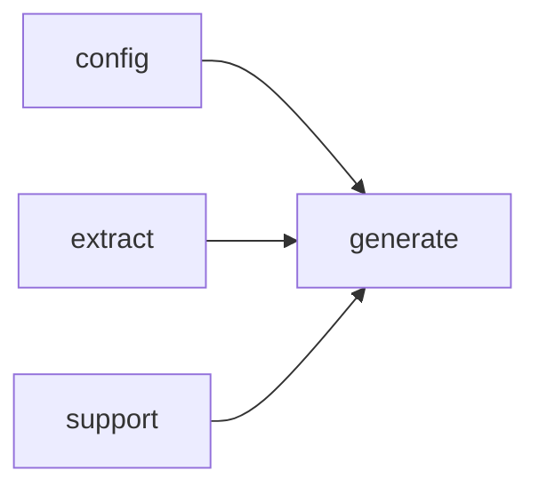

# Module `generate:analysis`

## Summary

The `generate:analysis` module is responsible for orchestrating the analysis phase of documentation generation. It builds prompts for symbol analysis using context from the `generate:model` and `generate:evidence` modules, sends them to a language model, and processes the responses. Its public interface includes functions to construct and classify analysis prompts (`build_symbol_analysis_prompt`, `analysis_prompt_kind_for_symbol`, `is_declaration_summary_prompt`), parse both structured and markdown outputs (`parse_structured_response`, `parse_markdown_prompt_output`), normalize markdown fragments, and apply analysis results back into the generation state (`apply_symbol_analysis_response`, `store_fallback_analysis`).

Internally, the module defines utility functions for lenient parsing, merging, and fallback logic for function, type, and variable analyses, as well as normalization of markdown content. It depends on the `config`, `extract`, `generate:evidence`, `generate:markdown`, `generate:model`, and `support` modules to handle configuration, extraction of project data, evidence packaging, markdown rendering, core model types, and foundational utilities.

## Imports

- [`config`](../config/index.md)
- [`extract`](../extract/index.md)
- [`generate:evidence`](evidence.md)
- [`generate:markdown`](markdown.md)
- [`generate:model`](model.md)
- [`support`](../support/index.md)

## Imported By

- [`generate:dryrun`](dryrun.md)
- [`generate:scheduler`](scheduler.md)

## Dependency Diagram

```mermaid
graph LR
    M0["generate"]
    I0["config"]
    I0 --> M0
    I1["extract"]
    I1 --> M0
    I2["support"]
    I2 --> M0
```

## Functions

### `clore::generate::analysis_prompt_kind_for_symbol`

Declaration: `src/generate/analysis.cppm:43`

Definition: `src/generate/analysis.cppm:302`

Declaration: [`Namespace clore::generate`](../../namespaces/clore/generate/index.md)

The function uses a simple if-else chain to map the `kind` field of the incoming `extract::SymbolInfo` to a `PromptKind` value. It first tests with `is_function_kind` and returns `PromptKind::FunctionAnalysis` if true; otherwise it tests with `is_type_kind` and `is_variable_kind` in that order, returning `PromptKind::TypeAnalysis` or `PromptKind::VariableAnalysis` respectively. When none of the three kind predicates match, it returns `std::nullopt`. This control flow depends only on the `extract::SymbolInfo` type, the three `is_*_kind` helper functions, and the `PromptKind` enumeration.

#### Side Effects

No observable side effects are evident from the extracted code.

#### Reads From

- sym`.kind`

#### Usage Patterns

- used to map a symbol to its required analysis prompt kind

### `clore::generate::apply_symbol_analysis_response`

Declaration: `src/generate/analysis.cppm:55`

Definition: `src/generate/analysis.cppm:364`

Declaration: [`Namespace clore::generate`](../../namespaces/clore/generate/index.md)

The function `clore::generate::apply_symbol_analysis_response` implements the core dispatch logic for processing a raw LLM response into the `SymbolAnalysisStore`. Its control flow is a switch over `PromptKind`. For each case, it first derives a stable `target_key` from `sym` via `make_symbol_target_key`, then selects a parsing strategy (e.g., `parse_function_analysis_lenient`, `parse_markdown_prompt_output`, `parse_type_analysis_lenient`, or `parse_variable_analysis_lenient`) and a fallback strategy (e.g., `fallback_function_analysis`, `fallback_type_analysis`) from the anonymous namespace helpers. For structured analysis kinds (`FunctionAnalysis`, `TypeAnalysis`), it merges the parsed values into the existing store entry using `merge_function_analysis` or `merge_type_analysis`, with the fallback acting as a default baseline. For markdown summary kinds (`FunctionDeclarationSummary`, `FunctionImplementationSummary`, `TypeDeclarationSummary`, `TypeImplementationSummary`), it directly assigns the parsed markdown to the appropriate `overview_markdown` or `details_markdown` field of the corresponding symbol’s analysis. For `VariableAnalysis`, the parsed result is stored directly, and any unsupported kind returns a `GenerateError`. The function depends on several internal parsing, normalization, and fallback routines, as well as on `prompt_request_key` for constructing request identifiers used during parsing.

#### Side Effects

- Modifies `analyses.functions`, `analyses.types`, or `analyses.variables` by adding or updating analysis data

#### Reads From

- `analyses` reference
- `sym` parameter
- `model` parameter
- `raw_response` parameter
- internally constructed `PromptRequest` objects

#### Writes To

- `analyses.functions[target_key]`
- `analyses.types[target_key]`
- `analyses.variables[target_key]`

#### Usage Patterns

- Called after receiving a prompt response to store analysis results
- Used in a loop over multiple prompt responses

### `clore::generate::build_symbol_analysis_prompt`

Declaration: `src/generate/analysis.cppm:62`

Definition: `src/generate/analysis.cppm:445`

Declaration: [`Namespace clore::generate`](../../namespaces/clore/generate/index.md)

The function `clore::generate::build_symbol_analysis_prompt` orchestrates the construction of a prompt string for a given symbol analysis task. It begins by dispatching on the `kind` parameter—a `PromptKind` enumerator—to invoke one of several dedicated evidence‑gathering helpers (e.g., `build_evidence_for_function_analysis` or `build_evidence_for_type_declaration_summary`). Each helper populates an `EvidencePack` with the information relevant to that particular analysis type, drawing from the symbol’s `extract::SymbolInfo`, the `extract::ProjectModel`, and optionally the existing `SymbolAnalysisStore`. After building the evidence, the function stamps the pack with a fixed page identifier, the kind name (via `prompt_kind_name`), and the symbol’s qualified name. It then passes the enriched evidence to `build_prompt`, a generic routine that composes the final prompt string. If prompt construction fails, the function returns a `std::unexpected` containing a `GenerateError` with a descriptive message, which includes the symbol’s target key (formatted by `make_symbol_target_key`). On success, the prompt string is moved into the result.

#### Side Effects

No observable side effects are evident from the extracted code.

#### Reads From

- parameter `sym` (a `const extract::SymbolInfo&`)
- parameter `kind` (a `PromptKind`)
- parameter `model` (a `const extract::ProjectModel&`)
- parameter `config` (a `const config::TaskConfig&`)
- parameter `analyses` (a `const SymbolAnalysisStore&`)
- the `qualified_name` member of `sym`
- the `project_root` member of `config`
- the `analyses` store (via evidence-builders)

#### Usage Patterns

- used to generate prompts for symbol analysis pipelines
- called when building prompts for function, type, or variable analysis
- typically invoked by higher-level prompt construction routines like `apply_symbol_analysis_response` or `build_dry_run_page_summary_texts`

### `clore::generate::is_base_symbol_analysis_prompt`

Declaration: `src/generate/analysis.cppm:47`

Definition: `src/generate/analysis.cppm:341`

Declaration: [`Namespace clore::generate`](../../namespaces/clore/generate/index.md)

The function `clore::generate::is_base_symbol_analysis_prompt` implements a simple equality check: it returns `true` if the `PromptKind` argument matches one of three enumerators—`FunctionAnalysis`, `TypeAnalysis`, or `VariableAnalysis`—and `false` otherwise. There is no branching or iteration beyond the direct comparison of the input value against each of these constants. The logic relies solely on the `PromptKind` enumeration and performs no additional computation or external calls. This predicate is used internally to classify whether a given prompt kind corresponds to a base symbol analysis task, enabling selection of the appropriate processing path in the larger prompt‑generation and response‑handling pipeline.

#### Side Effects

No observable side effects are evident from the extracted code.

#### Reads From

- Parameter `kind` of type `PromptKind` (int underlying)

#### Usage Patterns

- Used to test whether a prompt kind should trigger a base symbol analysis
- Possibly called before dispatching to analysis-specific builders

### `clore::generate::is_declaration_summary_prompt`

Declaration: `src/generate/analysis.cppm:49`

Definition: `src/generate/analysis.cppm:346`

Declaration: [`Namespace clore::generate`](../../namespaces/clore/generate/index.md)

The function `clore::generate::is_declaration_summary_prompt` implements a direct predicate check on its `PromptKind` parameter. It returns `true` only when the argument is `PromptKind::FunctionDeclarationSummary` or `PromptKind::TypeDeclarationSummary`; otherwise it returns `false`. The control flow consists of a single logical disjunction of two equality comparisons, with no loops, recursion, or branching beyond the expression itself. Its only dependencies are the definition of `PromptKind` and its two enumerator values.

#### Side Effects

No observable side effects are evident from the extracted code.

#### Reads From

- `kind` parameter

#### Usage Patterns

- used to branch prompt generation logic based on prompt kind
- called in contexts that need to treat declaration summary prompts distinctly

### `clore::generate::normalize_markdown_fragment`

Declaration: `src/generate/analysis.cppm:37`

Definition: `src/generate/analysis.cppm:283`

Declaration: [`Namespace clore::generate`](../../namespaces/clore/generate/index.md)

The function `clore::generate::normalize_markdown_fragment` first converts the input `raw` fragment into a well‑formed UTF‑8 string via `clore::support::ensure_utf8`. It then strips any leading UTF‑8 BOM using `clore::support::strip_utf8_bom` and calls the anonymous‑namespace helper `trim_trailing_ascii_whitespace` to remove trailing ASCII whitespace. If the result contains no non‑whitespace characters (checked by `contains_non_whitespace`), the function immediately returns `std::unexpected` with a `GenerateError` that includes the `context` identifier. Otherwise, it applies `normalize_analysis_markdown` to the cleaned string and returns the final normalized markdown as the expected value.

Internally, the control flow is strictly sequential with early exit on an empty fragment. The function depends on UTF‑8 utilities from the `clore::support` module, two anonymous‑namespace helpers for whitespace handling, and the `normalize_analysis_markdown` routine that performs the actual markdown cleanup. All identifiers, types, and functions are referenced using inline code.

#### Side Effects

No observable side effects are evident from the extracted code.

#### Reads From

- `raw` parameter (`std::string_view`)
- `context` parameter (`std::string_view`)

#### Usage Patterns

- Called during markdown fragment processing to ensure well-formed output
- Used to validate and normalize markdown content before embedding in generated documentation

### `clore::generate::parse_markdown_prompt_output`

Declaration: `src/generate/analysis.cppm:40`

Definition: `src/generate/analysis.cppm:297`

Declaration: [`Namespace clore::generate`](../../namespaces/clore/generate/index.md)

The implementation of `clore::generate::parse_markdown_prompt_output` is a thin delegating wrapper. It accepts two `std::string_view` parameters—`raw` (the model’s raw output) and `context` (supplementary contextual text)—and forwards them directly to `normalize_markdown_fragment`. The return type is `std::expected<std::string, GenerateError>`, so any normalization or parsing failure is propagated as an error rather than an exception. Internally, no extra control flow or intermediate transformations occur; the entire responsibility for trimming, validating, and normalizing the markdown content lies within `normalize_markdown_fragment`, which is defined in the same translation unit and is the sole dependency of this public entry point.

#### Side Effects

No observable side effects are evident from the extracted code.

#### Reads From

- parameter `raw`
- parameter `context`

#### Usage Patterns

- Used to parse and normalize markdown output from prompt responses before further processing.
- Called with the raw prompt output and the context in which the output was generated.

### `clore::generate::parse_structured_response`

Declaration: `src/generate/analysis.cppm:34`

Definition: `src/generate/analysis.cppm:268`

Declaration: [`Namespace clore::generate`](../../namespaces/clore/generate/index.md)

The implementation of `clore::generate::parse_structured_response` follows a straightforward parse-and-normalize pipeline. It first invokes `json::parse<T>` on the `raw` string view; if parsing fails, it immediately returns a `std::unexpected` containing a `GenerateError` with a descriptive message that includes the `context` and the underlying parse error string. On success, the parsed value is moved into a local variable, then `normalize_analysis` is called on that value to apply any necessary post-processing (e.g., trimming whitespace, merging fallback data). The function concludes by returning the normalized value. The key dependencies are the generic `json::parse<T>` utility for deserialization and the overloaded `normalize_analysis` function, which handles type‑specific normalization logic.

#### Side Effects

No observable side effects are evident from the extracted code.

#### Reads From

- `raw` parameter (string view)
- `context` parameter (string view)

#### Writes To

- returned `std::expected<T, GenerateError>` object

#### Usage Patterns

- Used to parse and validate structured AI responses within the generation pipeline.
- Typically called after receiving a prompt output, passing the raw response and a contextual identifier for error messages.

### `clore::generate::store_fallback_analysis`

Declaration: `src/generate/analysis.cppm:51`

Definition: `src/generate/analysis.cppm:351`

Declaration: [`Namespace clore::generate`](../../namespaces/clore/generate/index.md)

The function `clore::generate::store_fallback_analysis` populates a `SymbolAnalysisStore` with a default analysis for a given symbol when no generated analysis is available. It first derives the storage key by calling `make_symbol_target_key` on the symbol. Then, based on the symbol’s `kind` (determined via helpers like `is_function_kind`, `is_type_kind`, `is_variable_kind`), it dispatches to an anonymous-namespace fallback generator: `fallback_function_analysis`, `fallback_type_analysis` (which additionally accepts the `ProjectModel` for type‑level context), or `fallback_variable_analysis`. The returned analysis is inserted into the corresponding map (`functions`, `types`, or `variables`) inside `analyses`. This ensures that every symbol in the analysis store has at least a minimal placeholder entry, enabling downstream processing to proceed without missing entries.

#### Side Effects

- modifies the `SymbolAnalysisStore` by inserting a fallback analysis entry

#### Reads From

- `sym` (`SymbolInfo`)
- `sym.kind`
- `model` (`ProjectModel` for type analysis)
- `make_symbol_target_key` result

#### Writes To

- `analyses.functions` map
- `analyses.types` map
- `analyses.variables` map

#### Usage Patterns

- called when a symbol's analysis fails or is missing
- used as a default handler in analysis building pipelines

### `clore::generate::symbol_prompt_kinds_for_symbol`

Declaration: `src/generate/analysis.cppm:45`

Definition: `src/generate/analysis.cppm:315`

Declaration: [`Namespace clore::generate`](../../namespaces/clore/generate/index.md)

The function `clore::generate::symbol_prompt_kinds_for_symbol` determines the set of analysis prompt kinds to generate for a given symbol. It delegates to `analysis_prompt_kind_for_symbol` to obtain a single base `PromptKind` for the symbol. If no base kind exists (i.e., the symbol is not supported), it returns an empty vector. Otherwise, it maps the base kind to a list of specific prompt kinds: for `PromptKind::FunctionAnalysis` it yields the base kind followed by `PromptKind::FunctionDeclarationSummary` and `PromptKind::FunctionImplementationSummary`; for `PromptKind::TypeAnalysis` it similarly yields the base kind plus `PromptKind::TypeDeclarationSummary` and `PromptKind::TypeImplementationSummary`; for `PromptKind::VariableAnalysis` it returns only the base kind. Unrecognized base kinds produce an empty result.

This function depends on the `PromptKind` enumeration and the `analysis_prompt_kind_for_symbol` helper, which determines the most appropriate analysis category for the given `extract::SymbolInfo`. It also assumes the existence of distinct summary prompt kinds for functions and types, while variable analysis uses a single prompt kind. The returned vector is used by the caller to drive the generation of analysis prompts in the correct order.

#### Side Effects

No observable side effects are evident from the extracted code.

#### Reads From

- `sym` parameter
- `analysis_prompt_kind_for_symbol(sym)` result

#### Usage Patterns

- Determining the set of analysis prompts to generate for a symbol in page generation

## Internal Structure

The `generate:analysis` module, residing within the `clore::generate` namespace, is the core orchestration layer that constructs analysis prompts, processes LLM responses, and integrates the resulting evidence into the generation pipeline. It imports supporting infrastructure from the `config`, `extract`, `support`, and the sibling modules `generate:evidence`, `generate:markdown`, and `generate:model`, thereby depending on the project configuration, extraction services, common utilities, evidence packaging, markdown formatting, and the shared data types (such as `PromptKind`, `FunctionAnalysis`, and `SymbolAnalysisStore`).

Internally, the module is decomposed into an anonymous namespace containing focused utilities for parsing, merging, and normalizing analysis responses—for example, `parse_type_analysis_lenient`, `merge_function_analysis`, and `fallback_variable_analysis`. These are complemented by public entry points that drive the prompt lifecycle: `build_symbol_analysis_prompt` constructs the prompt for a given symbol; `apply_symbol_analysis_response` ingests raw LLM text into a mutable target; `store_fallback_analysis` populates a store when primary analysis is unavailable; and predicate functions such as `is_declaration_summary_prompt` and `is_base_symbol_analysis_prompt` classify prompt kinds to dispatch appropriate logic. This layered design separates the raw string processing from the higher‑level orchestration, allowing the module to sanitize, merge, and fall back to default analyses while keeping the prompt‑building and response‑application pathways clean and testable.

## Related Pages

- [Module config](../config/index.md)
- [Module extract](../extract/index.md)
- [Module generate:evidence](evidence.md)
- [Module generate:markdown](markdown.md)
- [Module generate:model](model.md)
- [Module support](../support/index.md)

