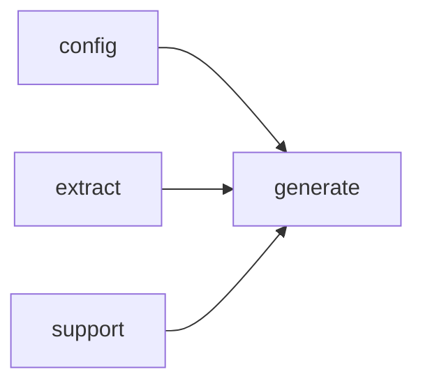

# Module `generate:diagram`

## Summary

The `generate:diagram` module provides a suite of functions for producing diagram code—primarily in Mermaid syntax—that visualises various structural and dependency relationships within a project. Its public API includes renderers for file dependency graphs, import diagrams, namespace structures, and module dependency diagrams, as well as a utility to escape labels for safe embedding in Mermaid output and a guard function (`should_emit_mermaid`) that determines whether a diagram should be emitted based on thresholds like minimum node or edge counts. The module owns all logic for traversing the extracted project model, collecting relevant symbols, and formatting the diagram text, while relying on the `config`, `extract`, and `generate:model` modules for configuration, data extraction, and page plan context.

## Imports

- [`config`](../config/index.md)
- [`extract`](../extract/index.md)
- [`generate:model`](model.md)
- `std`
- [`support`](../support/index.md)

## Imported By

- [`generate:scheduler`](scheduler.md)
- [`generate:symbol`](symbol.md)

## Dependency Diagram

## Functions

### `clore::generate::escape_mermaid_label`

Declaration: `generate/render/diagram.cppm:13`

Definition: `generate/render/diagram.cppm:109`

Declaration: [`Namespace clore::generate`](../../namespaces/clore/generate/index.md)

The function iterates over each character in the input `text`, using a `switch` to handle four categories. Backslash and double quote are each escaped by prefixing with a backslash, ensuring that the output remains syntactically valid within Mermaid quoted strings. Newline and carriage return characters are replaced with a space, since Mermaid labels cannot contain line breaks; all other characters are copied unchanged. The return value is built into a local `std::string escaped` whose capacity is pre‑reserved to `text.size()` to avoid reallocation. The only dependencies are `std::string_view` (the input parameter) and `std::string` (the return type), and no helper functions from the enclosing namespace are invoked.

#### Side Effects

No observable side effects are evident from the extracted code.

#### Reads From

- `text` parameter

#### Writes To

- return value (new `std::string`)

#### Usage Patterns

- Used when generating Mermaid diagram code to ensure labels are properly formatted and do not break the diagram syntax.

### `clore::generate::render_file_dependency_diagram_code`

Declaration: `generate/render/diagram.cppm:20`

Definition: `generate/render/diagram.cppm:222`

Declaration: [`Namespace clore::generate`](../../namespaces/clore/generate/index.md)

The function first checks whether `plan.owner_keys` is empty and returns an empty string if so. It then delegates the main work to `render_cached_diagram`, which wraps the actual generation. Inside the lambda, it attempts to locate the file record from `model.files` using the first owner key; if the file is not found, the diagram is skipped. The algorithm then builds a sorted, deduplicated list of include labels by iterating over the file’s `includes` and calling `make_source_relative` to produce paths relative to the project root. Next, it invokes `collect_implementation_symbols_for_diagram` with a predicate that selects symbols of type, local variable, or function kinds. The total `edge_count` is computed as the sum of the number of includes and the number of symbols, and `node_count` is set to `1 + edge_count`. If `should_emit_mermaid` returns `false` (typically when the diagram would be too small or too large), an empty string is returned immediately.

Otherwise, the function constructs a Mermaid `graph LR` diagram. It creates a node for the file using its source-relative label (falling back to the original key), then for each include it adds an `I` node with the include label and a directed edge from that node to the file node. Similarly, for each symbol it adds an `S` node with a short name obtained via `short_name_of_local` (or the raw name/qualified name as fallback) and an edge from the file node to the symbol node. All node labels are passed through `escape_mermaid_label`. The final Mermaid string is returned from the lambda, and `render_cached_diagram` handles caching of the result. Key dependencies include the diagram rendering infrastructure, the project model, configuration, and various utility functions for name shortening, path relativization, and Mermaid label escaping.

#### Side Effects

No observable side effects are evident from the extracted code.

#### Reads From

- plan`.owner_keys`
- config`.project_root`
- model`.files`
- `file_it`->second`.includes`
- `extract::SymbolInfo`

#### Usage Patterns

- called by page rendering pipeline for file pages
- produces diagram code for file dependency visualization

### `clore::generate::render_import_diagram_code`

Declaration: `generate/render/diagram.cppm:15`

Definition: `generate/render/diagram.cppm:124`

Declaration: [`Namespace clore::generate`](../../namespaces/clore/generate/index.md)

The implementation of `clore::generate::render_import_diagram_code` first delegates to `render_cached_diagram`, which wraps the core logic for deduplication and caching. Inside the lambda, it immediately returns an empty string if `mod_unit.imports` is empty. It then computes `module_label` by extracting the top‑level module name via a local `top_module` lambda that truncates at the first colon; if `is_std_name` returns true for that label, the function again returns empty.  

A deduplication pass collects unique import labels, skipping those equal to the current module or flagged as standard library names. After sorting the remaining imports, the function evaluates `should_emit_mermaid` with `node_count = 1 + imports.size()` and `edge_count = imports.size()`. If the check fails, an empty string is returned. Otherwise, it constructs a Mermaid graph string: a static node `M0` for the module, then for each import a node `I<i>` and a directed edge from that import node to `M0`. All labels are escaped using `escape_mermaid_label`. The final graph string is returned, and `render_cached_diagram` applies its caching layer.

#### Side Effects

- caches the generated Mermaid diagram result via `render_cached_diagram`

#### Reads From

- `mod_unit.imports`
- `mod_unit.name`

#### Writes To

- returns a `std::string` containing Mermaid diagram code

#### Usage Patterns

- called during module documentation generation to produce an import dependency diagram

### `clore::generate::render_module_dependency_diagram_code`

Declaration: `generate/render/diagram.cppm:24`

Definition: `generate/render/diagram.cppm:289`

Declaration: [`Namespace clore::generate`](../../namespaces/clore/generate/index.md)

The implementation of `clore::generate::render_module_dependency_diagram_code` constructs a Mermaid `graph LR` code string representing inter‑module dependencies. It begins by filtering the project model for interface module units, extracting the top‑level module name (everything before the first colon) for each unit. For each such module, it collects the set of modules it imports, excluding self‑references and any module flagged by `is_std_name`. These relations are stored in a `deps` map, and all referenced modules are tracked in a set. If fewer than two modules remain, the function returns an empty string. Next, it computes the total number of edges and calls `should_emit_mermaid` with the module and edge counts; if the diagram is not worth rendering, an empty string is returned again.

When emission is justified, the function sorts the module names alphabetically and assigns each a node identifier `M<i>` (e.g., `M0`, `M1`). It generates a `graph LR` header, then emits a node definition line for each module with an escaped label via `escape_mermaid_label`. Afterward, it iterates over the sorted module list in order, sorts each module’s dependency targets, and produces an edge line from the target node to the source node (arrow direction: `target --> source`). The entire string is built and returned through `render_cached_diagram`, which provides memoization for the result. Key internal helpers used are `is_std_name`, `escape_mermaid_label`, `should_emit_mermaid`, and `render_cached_diagram`.

#### Side Effects

No observable side effects are evident from the extracted code.

#### Reads From

- `model.modules`
- `model.modules[name].is_interface`
- `model.modules[name].name`
- `model.modules[name].imports`

#### Writes To

- return value of type `std::string`

#### Usage Patterns

- called to produce module dependency diagram for documentation pages
- used within rendering pipeline to add Mermaid code blocks

### `clore::generate::render_namespace_diagram_code`

Declaration: `generate/render/diagram.cppm:17`

Definition: `generate/render/diagram.cppm:168`

Declaration: [`Namespace clore::generate`](../../namespaces/clore/generate/index.md)

The function `clore::generate::render_namespace_diagram_code` first invokes `render_cached_diagram` with a lambda that encapsulates the diagram‑building logic. Inside the lambda, it looks up the given `namespace_name` in `model.namespaces`; if not found, it returns an empty string. For the found namespace, it iterates over `ns_it->second.symbols`, uses `extract::lookup_symbol` to retrieve each symbol, filters to type‑like kinds via `is_type_kind`, deduplicates by `SymbolID`, and stores the pointers in a vector. That vector is sorted by `qualified_name`. Next, it collects `ns_it->second.children`, filtering out any child string containing `"(anonymous namespace)"` or satisfying `is_std_name`, then transforms each with `short_name_of_local`. The child names are sorted and deduplicated. The total `edge_count` is `types.size() + children.size()` and `node_count` is `1 + edge_count`; if `should_emit_mermaid` returns `false`, an empty string is returned early. Otherwise, the function builds a Mermaid `graph TD` string: a node for the namespace itself (using `escape_mermaid_label` on its short name), then a node and edge for each type (prefixed `T` id), and similarly a node and edge for each child namespace (prefixed `NSC` id). The result is returned from the lambda and cached by `render_cached_diagram`.

#### Side Effects

No observable side effects are evident from the extracted code.

#### Reads From

- model`.namespaces`
- model`.symbols`
- `ns_it`->second`.symbols`
- `ns_it`->second`.children`
- types[i]->`qualified_name`
- children[i]

#### Usage Patterns

- called during namespace page generation to produce a Mermaid diagram

### `clore::generate::should_emit_mermaid`

Declaration: `generate/render/diagram.cppm:11`

Definition: `generate/render/diagram.cppm:105`

Declaration: [`Namespace clore::generate`](../../namespaces/clore/generate/index.md)

The function performs a simple threshold check: it returns `true` if either the `node_count` parameter meets or exceeds the constant `kMermaidMinNodes` or the `edge_count` parameter meets or exceeds the constant `kMermaidMinEdges`. Both constants are defined in the anonymous namespace and represent the minimum graph size (in nodes or edges) required to justify emitting a Mermaid diagram. The decision logic uses a short-circuiting logical OR; the caller can then skip rendering when the graph is too small to be useful.

#### Side Effects

No observable side effects are evident from the extracted code.

#### Reads From

- local parameters `node_count` and `edge_count`
- constants `kMermaidMinNodes` and `kMermaidMinEdges`

#### Usage Patterns

- called when deciding whether to render a Mermaid diagram in documentation pages

## Internal Structure

The `generate:diagram` module is organized around a small set of public rendering functions—`render_file_dependency_diagram_code`, `render_import_diagram_code`, `render_namespace_diagram_code`, and `render_module_dependency_diagram_code`—each returning an integer handle to the generated diagram text, plus `should_emit_mermaid` as a guard and `escape_mermaid_label` for label sanitization. Internally, the module decomposes work into several anonymous‑namespace helpers: `is_std_name`, `short_name_of_local`, `is_variable_kind_local`, `collect_implementation_symbols_for_diagram`, and a caching template `render_cached_diagram`. These helpers iterate over model objects (plans, configurations, symbol lists) to compute node and edge counts, construct labels, and produce Mermaid‑compatible output. The module depends on `generate:model` for its data structures, `extract` for symbol resolution, `support` for text and I/O utilities, and `config` for rendering options; thresholds like `kMermaidMinEdges` and `kMermaidMinNodes` control when diagrams are generated. State within each renderer is managed through local variables such as `node_id`, `edge_count`, `node_count`, `result`, `top_module`, `symbols`, and iteration indices, reflecting a straightforward traversal of the model graph without complex layering beyond the public‑helper split.

## Related Pages

- [Module config](../config/index.md)
- [Module extract](../extract/index.md)
- [Module generate:model](model.md)
- [Module support](../support/index.md)

