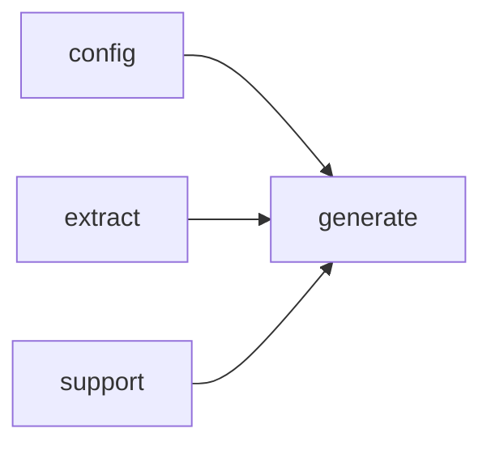

# Module `generate:diagram`

## Summary

The `generate:diagram` module is responsible for producing visual diagram code—typically in Mermaid syntax—that represents structural relationships within a codebase. It owns a family of public rendering functions that generate diagram snippets for file dependencies, import relationships, namespace hierarchies, and module dependencies. Each function accepts identifiers for the relevant entity and returns a handle to the resulting diagram code, which is intended for embedding into documentation pages.

The module also exposes a utility to determine whether a diagram should be emitted based on configurable thresholds, and an escaping function to ensure that labels containing special characters can be safely included in Mermaid diagrams. Internal helper functions handle caching, symbol collection, and name resolution, supporting the public API within the documentation generation pipeline.

## Imports

- [`config`](../config/index.md)
- [`extract`](../extract/index.md)
- [`generate:model`](model.md)
- `std`
- [`support`](../support/index.md)

## Imported By

- [`generate:scheduler`](scheduler.md)
- [`generate:symbol`](symbol.md)

## Dependency Diagram

## Functions

### `clore::generate::escape_mermaid_label`

Declaration: `generate/render/diagram.cppm:13`

Definition: `generate/render/diagram.cppm:109`

Declaration: [`Namespace clore::generate`](../../namespaces/clore/generate/index.md)

The function `clore::generate::escape_mermaid_label` processes each character in the input `text` via a simple `for` loop and a `switch` statement. For backslashes and double quotes, it appends their escaped Mermaid equivalents (`"\\\\"` for `'\\'`, `"\\\""` for `'\"'`). Carriage return and newline characters are replaced with a single space; all other characters are copied verbatim. The output `escaped` string pre-allocates storage matching the input size to minimize reallocations. The implementation relies only on `std::string` and `std::string_view` and has no other internal or external dependencies.

#### Side Effects

No observable side effects are evident from the extracted code.

#### Reads From

- the input parameter `text` of type `std::string_view`

#### Writes To

- the returned `std::string` containing the escaped label

#### Usage Patterns

- used to prepare label strings for Mermaid diagram generation
- called when constructing Mermaid diagram code to ensure label text does not break syntax

### `clore::generate::render_file_dependency_diagram_code`

Declaration: `generate/render/diagram.cppm:20`

Definition: `generate/render/diagram.cppm:222`

Declaration: [`Namespace clore::generate`](../../namespaces/clore/generate/index.md)

The function first checks whether the page plan contains any owner keys; if none are present it returns an empty string. It then delegates to `render_cached_diagram`, which wraps the actual generation logic. Inside the lambda, it retrieves the file record from the `extract::ProjectModel` for the first owner key; if no record is found, an empty string is returned.  

The algorithm constructs two sets of edges: include dependencies and symbols defined in the file. Include paths are extracted from the file record, made relative to the project root via `make_source_relative`, sorted, and deduplicated. Symbols are collected by calling `collect_implementation_symbols_for_diagram` with a predicate that selects symbols whose kind is a type, a local variable, or a function. Edge count is computed as the sum of include labels and symbols, node count as one plus the edge count. If `should_emit_mermaid` returns false, the diagram is suppressed. Otherwise, a Mermaid `graph LR` is built: a single node for the file, include nodes (prefixed `I`) with edges pointing to the file, and symbol nodes (prefixed `S`) with edges from the file to the symbol. Each label is escaped via `escape_mermaid_label`, and symbol labels are shortened with `short_name_of_local` if non‑empty. The constructed Mermaid code is returned from the lambda and cached by the outer `render_cached_diagram` call.

#### Side Effects

- Cache write via `render_cached_diagram`
- Allocation and construction of a `std::string` for the diagram code

#### Reads From

- `plan.owner_keys`
- `model.files`
- `config.project_root`
- `file_it->second.includes`
- Symbol info from model filtered by `is_type_kind`, `is_variable_kind_local`, `is_function_kind`

#### Writes To

- Cache state via `render_cached_diagram`
- Returned `std::string`

#### Usage Patterns

- Called during page rendering to produce file dependency diagrams
- Used in combination with `render_cached_diagram` for efficiency

### `clore::generate::render_import_diagram_code`

Declaration: `generate/render/diagram.cppm:15`

Definition: `generate/render/diagram.cppm:124`

Declaration: [`Namespace clore::generate`](../../namespaces/clore/generate/index.md)

The function `clore::generate::render_import_diagram_code` produces a Mermaid `graph LR` string representing the import dependencies of a given module unit. It delegates its work to the cached helper `render_cached_diagram`, which avoids redundant regeneration. Inside the lambda, it first short‑circuits if the unit’s `imports` list is empty or if the module’s own top‑level name (obtained via a local `top_module` lambda that extracts the part before the first colon) is identified as a standard library name by `is_std_name`. It then deduplicates the imports: for each import, it computes its top‑level name, discarding entries that match the module’s own name, are standard library names, or have already been seen. The surviving top‑level names are collected into a vector, and the edge count and node count are derived. If `should_emit_mermaid` returns `false`, an empty string is returned; otherwise the imports are sorted alphabetically, and a Mermaid graph is built with a node `M0` for the module and nodes `I0`, `I1`, … for each import, each connected by a directed edge to `M0`. Labels are escaped using `escape_mermaid_label`. The final string is returned and cached.

#### Side Effects

No observable side effects are evident from the extracted code.

#### Reads From

- `mod_unit.name`
- `mod_unit.imports`
- `is_std_name`
- `escape_mermaid_label`
- `should_emit_mermaid`

#### Usage Patterns

- Called when building module page documentation to embed an import dependency diagram.
- Used in the generation of `clore::generate::render_page_markdown` or similar rendering functions.

### `clore::generate::render_module_dependency_diagram_code`

Declaration: `generate/render/diagram.cppm:24`

Definition: `generate/render/diagram.cppm:289`

Declaration: [`Namespace clore::generate`](../../namespaces/clore/generate/index.md)

The function constructs a Mermaid directed graph representing module dependencies. It first iterates over the `model.modules` collection, filtering for interface units only. For each interface module, it extracts the top-level module name (the part before the first colon) using the local lambda `top_module`, skips names that satisfy `is_std_name`, and records the module as a node. For each import of that module, it computes the top-level target name and, if distinct from the source and not a standard name, adds a directed edge from the target to the source in `deps`. If fewer than two distinct modules are found, an empty string is returned. Otherwise, the total edge count is summed, and `should_emit_mermaid` is called with the node and edge counts; if it returns false, an empty string is returned. The unique module names are sorted alphabetically, each assigned a node ID (`M0`, `M1`, …) via `node_ids`. The Mermaid graph header `graph LR` is emitted, then each module appears as a node with its escaped label (using `escape_mermaid_label`). Finally, for each source module in sorted order, its targets (sorted) are written as edges in the form `node_ids[to] --> node_ids[from]`. The entire construction is wrapped inside a lambda passed to `render_cached_diagram`, which presumably caches the result per model.

#### Side Effects

No observable side effects are evident from the extracted code.

#### Reads From

- `model.modules`
- `mod_unit.name`
- `mod_unit.is_interface`
- `mod_unit.imports`
- `is_std_name`
- `escape_mermaid_label`
- `should_emit_mermaid`

#### Usage Patterns

- Called when generating module dependency diagrams for documentation pages
- Used in the page rendering pipeline for module overviews

### `clore::generate::render_namespace_diagram_code`

Declaration: `generate/render/diagram.cppm:17`

Definition: `generate/render/diagram.cppm:168`

Declaration: [`Namespace clore::generate`](../../namespaces/clore/generate/index.md)

The implementation first uses `render_cached_diagram` to wrap a lambda that performs the core logic. Inside the lambda, the function retrieves an iterator into `model.namespaces` for the given `namespace_name`; if the namespace is not found, an empty string is returned. Otherwise, it gathers all type symbols belonging to that namespace by iterating over `ns_it->second.symbols`, looking up each symbol via `extract::lookup_symbol`, filtering only those where `is_type_kind(sym->kind)` is true, and deduplicating by `sym->id` into a vector sorted by `qualified_name`. Simultaneously, it collects child namespace names from `ns_it->second.children`, excluding entries that contain `"(anonymous namespace)"` or satisfy `is_std_name`, then transforms each with `short_name_of_local`, sorts, and deduplicates.

The total `edge_count` is computed as the sum of type count and child count, with `node_count` equal to one more (the namespace node itself). If `should_emit_mermaid(node_count, edge_count)` returns false, an empty string is returned to skip the diagram. Otherwise, the Mermaid code string is built: a `graph TD` header, a node for the namespace (using `escape_mermaid_label` on its short name), then for each type symbol a node with ID `T0`, `T1`, … and a directed edge from `NS` to that node, and similarly for each child namespace (ID `NSC0`, `NSC1`, …). The final string is returned, effectively cached by the outer `render_cached_diagram` call.

#### Side Effects

No observable side effects are evident from the extracted code.

#### Reads From

- `extract::ProjectModel` object (the `model` parameter)
- `model.namespaces` map
- symbol lookup via `extract::lookup_symbol(model, sym_id)`
- `namespace_name` parameter

#### Writes To

- returned `std::string` (Mermaid diagram code)

#### Usage Patterns

- called to generate a namespace dependency diagram for documentation pages
- result is embedded in Markdown content for namespace overviews
- invoked within cached diagram generation to avoid redundant computation

### `clore::generate::should_emit_mermaid`

Declaration: `generate/render/diagram.cppm:11`

Definition: `generate/render/diagram.cppm:105`

Declaration: [`Namespace clore::generate`](../../namespaces/clore/generate/index.md)

The function `clore::generate::should_emit_mermaid` determines whether a Mermaid diagram should be generated based on the size of the diagram. It accepts two `std::size_t` parameters: `node_count` and `edge_count`. Internally, it evaluates a logical disjunction: the function returns `true` if `node_count` meets or exceeds the threshold defined by the anonymous namespace constant `kMermaidMinNodes` or if `edge_count` meets or exceeds the threshold defined by `kMermaidMinEdges`. Control flow is linear and unconditional, with no branching beyond the single `||` `operator`. The function depends only on these two constant values, which are assumed to be defined elsewhere in the anonymous namespace of the same translation unit.

#### Side Effects

No observable side effects are evident from the extracted code.

#### Reads From

- the parameters `node_count` and `edge_count`
- the constants `kMermaidMinNodes` and `kMermaidMinEdges`

#### Usage Patterns

- Used by diagram rendering functions such as `render_file_dependency_diagram_code` and `make_mermaid` to conditionally include diagrams

## Internal Structure

The module `generate:diagram` is responsible for producing Mermaid-formatted diagram code that visualises various relationships within a codebase, such as file dependencies, import diagrams, namespace structure, and module dependencies. It is decomposed into several public entry points—`render_file_dependency_diagram_code`, `render_import_diagram_code`, `render_namespace_diagram_code`, and `render_module_dependency_diagram_code`—each accepting entity identifiers and returning an integer handle to the generated diagram text. A separate helper, `escape_mermaid_label`, ensures labels are safe for Mermaid syntax. Internal layering is achieved through anonymous‑namespace utilities (e.g., `is_std_name`, `short_name_of_local`, `is_variable_kind_local`, `collect_implementation_symbols_for_diagram`, and the generic caching wrapper `render_cached_diagram`) that encapsulate common traversal, symbol collection, and caching logic. The module imports `generate:model` for core data structures, `extract` for project metadata, and `support` for foundational utilities, while relying on constants like `kMermaidMinNodes` and `kMermaidMinEdges` to determine when a diagram is meaningful enough to emit via `should_emit_mermaid`.

## Related Pages

- [Module config](../config/index.md)
- [Module extract](../extract/index.md)
- [Module generate:model](model.md)
- [Module support](../support/index.md)

