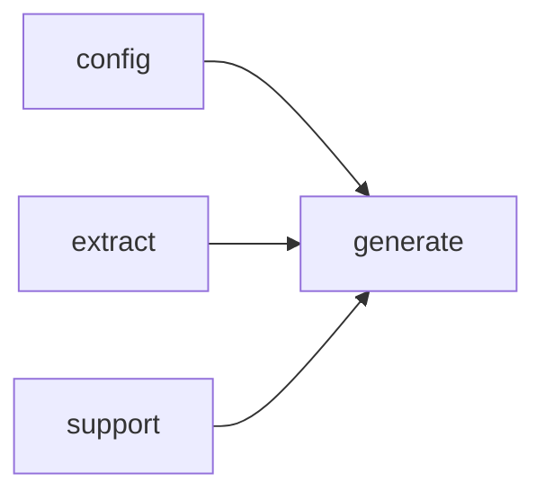

# Module `generate:diagram`

## Summary

The `generate:diagram` module is responsible for converting internal analysis data into textual diagram code (typically in Mermaid format) suitable for embedding into generated documentation pages. It provides a family of public rendering functions—`render_namespace_diagram_code`, `render_file_dependency_diagram_code`, `render_import_diagram_code`, and `render_module_dependency_diagram_code`—each tailored to a specific kind of structural graph. The module also exposes utility functions `escape_mermaid_label` to sanitize text for safe inclusion in Mermaid labels and `should_emit_mermaid` to decide, based on node and edge counts, whether a diagram is worth generating. Internally, it uses helper functions (e.g., `collect_implementation_symbols_for_diagram`, `short_name_of_local`, `is_std_name`, `is_variable_kind_local`, `render_cached_diagram`) and constants (`kMermaidMinNodes`, `kMermaidMinEdges`) to construct the output, relying on the `config`, `extract`, `generate:model`, and `support` modules for configuration, extraction results, data models, and foundational utilities.

## Imports

- [`config`](../config/index.md)
- [`extract`](../extract/index.md)
- [`generate:model`](model.md)
- [`support`](../support/index.md)

## Imported By

- [`generate:scheduler`](scheduler.md)
- [`generate:symbol`](symbol.md)

## Dependency Diagram

```mermaid
graph LR
    M0["generate"]
    I0["config"]
    I0 --> M0
    I1["extract"]
    I1 --> M0
    I2["support"]
    I2 --> M0
```

## Functions

### `clore::generate::escape_mermaid_label`

Declaration: `src/generate/render/diagram.cppm:27`

Definition: `src/generate/render/diagram.cppm:123`

Declaration: [`Namespace clore::generate`](../../namespaces/clore/generate/index.md)

Implementation: [Implementation](functions/escape-mermaid-label.md)

The function iterates character by character through the input `std::string_view`, pre-allocating a `std::string` with `reserve` to avoid reallocation. The core logic is a `switch` that transforms special characters: a backslash is doubled (`"\\\\"`), a double quote is preceded by a backslash (`"\\\""`), and line breaks (`\n`, `\r`) are replaced with a single space; all other characters are copied unchanged. This ensures that Mermaid labels are properly quoted and do not break the diagram syntax. The function relies solely on standard library types (`std::string_view`, `std::string`) and has no other dependencies, serving as a low-level utility called by the various Mermaid diagram rendering functions in the same translation unit.

#### Side Effects

No observable side effects are evident from the extracted code.

#### Reads From

- parameter `text` (`std::string_view`)

#### Writes To

- returned `std::string` (the escaped label)

#### Usage Patterns

- Sanitizing labels for Mermaid diagrams
- Called by `clore::generate::render_namespace_diagram_code`

### `clore::generate::render_file_dependency_diagram_code`

Declaration: `src/generate/render/diagram.cppm:34`

Definition: `src/generate/render/diagram.cppm:236`

Declaration: [`Namespace clore::generate`](../../namespaces/clore/generate/index.md)

The function `clore::generate::render_file_dependency_diagram_code` generates a Mermaid `graph LR` diagram for a single file’s includes and locally defined symbols. It first performs early‑exits: if `plan.owner_keys` is empty, or if the file is not found in `model.files`, it returns an empty string. The core work is wrapped in `render_cached_diagram` to avoid recomputation. Inside the lambda, the file’s include paths are made source‑relative via `make_source_relative`, sorted, and deduplicated. Then `collect_implementation_symbols_for_diagram` gathers symbols that satisfy a predicate (type kinds, variable‑local, or function kinds). The total number of edges is the sum of includes and symbols; `node_count` is one plus that total. If `should_emit_mermaid` returns `false` (typically when counts are too small), an empty string is returned. Otherwise, the Mermaid code is built: a file node `F` with an escaped relative path, followed by include nodes (`I0`, `I1`, …) each with a directed edge to `F`, and symbol nodes (`S0`, `S1`, …) with a directed edge from `F` to each symbol node. Symbol labels are shortened using `short_name_of_local`, with a fallback to the symbol’s name or qualified name. The final string is returned through the caching layer.

Key dependencies include `make_source_relative`, `escape_mermaid_label`, `short_name_of_local`, and the project‑wide utilities `collect_implementation_symbols_for_diagram` and `should_emit_mermaid`. The control flow is straightforward: early returns guard against missing data, then a linear scan collects and processes includes and symbols into Mermaid node/edge declarations.

#### Side Effects

No observable side effects are evident from the extracted code.

#### Reads From

- plan
- config
- model
- plan`.owner_keys`
- model`.files`
- `file_it`->second`.includes`
- config`.project_root`
- `collect_implementation_symbols_for_diagram`

#### Usage Patterns

- Used to generate Mermaid diagram code for file dependency visualization in documentation pages.

### `clore::generate::render_import_diagram_code`

Declaration: `src/generate/render/diagram.cppm:29`

Definition: `src/generate/render/diagram.cppm:138`

Declaration: [`Namespace clore::generate`](../../namespaces/clore/generate/index.md)

The function `render_import_diagram_code` generates a Mermaid dependency diagram showing which external top‑level modules a given `extract::ModuleUnit` imports. It delegates to `render_cached_diagram` for memoization. Inside the lambda, it first short‑circuits if `mod_unit.imports` is empty or if the module’s own top‑level name (extracted via a small `top_module` helper that truncates at the first colon) is classified as a standard library name by `is_std_name`. It then iterates over every import, computing its top‑level label; entries that match the module’s own label, are standard‑library names, or have already been seen are skipped. The remaining unique labels are collected into a vector.

After collecting, it computes `node_count` (1 for the module plus the number of distinct imports) and `edge_count` (same as import count). If `should_emit_mermaid` returns `false` (typically because the graph is too small or too large), the function returns an empty string. Otherwise, the import labels are sorted, and a `"graph LR"` Mermaid string is built: one node `M0` for the module, then for each import a node `I<i>` with an arrow `--> M0`. Labels are escaped via `escape_mermaid_label`. The assembled string is returned. Dependencies include the caching layer, size‑threshold policy, label escaping, and the standard‑library predicate.

#### Side Effects

No observable side effects are evident from the extracted code.

#### Reads From

- `mod_unit.imports`
- `mod_unit.name`

#### Usage Patterns

- called during module page rendering to generate import dependency diagrams
- used in conjunction with other diagram renderers like `render_module_dependency_diagram_code`

### `clore::generate::render_module_dependency_diagram_code`

Declaration: `src/generate/render/diagram.cppm:38`

Definition: `src/generate/render/diagram.cppm:303`

Declaration: [`Namespace clore::generate`](../../namespaces/clore/generate/index.md)

The function first wraps the core construction inside `render_cached_diagram` to support result caching. It builds a directed graph of top‑level module names by iterating over interface units in the project model. For each interface module, a local lambda extracts its top‑level name by taking the substring before the first colon; if `is_std_name` returns true, the module is skipped. Each unique non‑standard top‑level name is inserted into the `modules` set, and for every import of that module, the imported top‑level name (if different and non‑standard) is recorded as a dependency from the importing module to the imported module inside `deps`. After populating the graph, the function tests a minimum module count (fewer than two yields an empty string) and then calls `should_emit_mermaid` with the node and edge counts; a false return also produces an empty string.

If emission proceeds, the modules are sorted alphabetically, and each is assigned a numeric node identifier (e.g. `M0` through `M{N-1}`) via a `std::unordered_map`. The result string begins with `"graph LR\n"`, then emits one node per module using `escape_mermaid_label` to sanitize the label text. Finally, for each source module in sorted order, its dependency targets are sorted and an edge of the form `node_ids.at(to) --> node_ids.at(from)` is appended, producing a Mermaid diagram where the arrow points from the imported module to the importing module. The assembled diagram string is returned. The implementation relies on `should_emit_mermaid`, `escape_mermaid_label`, `is_std_name`, and the data structures from `extract::ProjectModel`.

#### Side Effects

No observable side effects are evident from the extracted code.

#### Reads From

- model`.modules`
- `mod_unit``.name`
- `mod_unit``.is_interface`
- `mod_unit``.imports`
- `is_std_name()`
- `escape_mermaid_label()`
- `should_emit_mermaid()`

#### Usage Patterns

- Called to produce a Mermaid diagram for module dependency visualization
- Used in module-level documentation pages
- Embedded in markdown via a Mermaid code fence

### `clore::generate::render_namespace_diagram_code`

Declaration: `src/generate/render/diagram.cppm:31`

Definition: `src/generate/render/diagram.cppm:182`

Declaration: [`Namespace clore::generate`](../../namespaces/clore/generate/index.md)

The function first looks up the given `namespace_name` in the project `model`. If the namespace is not found, an empty string is returned immediately. Otherwise, it collects all type symbols (filtered by a kind predicate and deduplicated via `seen_types`) and sorts them by qualified name. It also collects child namespace names, filtering out anonymous and standard library entries, then transforms each with `short_name_of_local`, sorts, and deduplicates. After computing the expected node and edge counts, it calls `should_emit_mermaid` to decide whether the diagram exceeds configurable thresholds; if so, an empty string is returned. When the diagram passes the size gate, a Mermaid `graph TD` string is built: the root node is labeled with the short name of the namespace, each type symbol gets a dedicated node (ID pattern `T` + index), and each child namespace gets a node (ID pattern `NSC` + index). All label text is escaped via `escape_mermaid_label`. For every type and child, an edge from the root `NS` node is appended. The entire construction is wrapped inside `render_cached_diagram`, which provides memoization by hashing the inputs.

#### Side Effects

No observable side effects are evident from the extracted code.

#### Reads From

- model`.namespaces`
- `ns_it`->second`.symbols`
- `ns_it`->second`.children`
- sym->kind
- sym->`qualified_name`
- sym->id

#### Usage Patterns

- called when rendering namespace documentation pages
- used to produce Mermaid diagram embed in namespace overview

### `clore::generate::should_emit_mermaid`

Declaration: `src/generate/render/diagram.cppm:25`

Definition: `src/generate/render/diagram.cppm:119`

Declaration: [`Namespace clore::generate`](../../namespaces/clore/generate/index.md)

The function `clore::generate::should_emit_mermaid` implements a simple threshold check to decide whether a Mermaid diagram should be produced. It accepts two `std::size_t` parameters: `node_count` and `edge_count`. The algorithm returns `true` if either `node_count` is greater than or equal to `kMermaidMinNodes` or `edge_count` is greater than or equal to `kMermaidMinEdges`; otherwise it returns `false`. This guard prevents generating diagrams for trivial or empty graphs, deferring to the caller only when the diagram would contain enough elements to be useful. The only dependencies are the two anonymous‑namespace constants `kMermaidMinNodes` and `kMermaidMinEdges`, which define the minimum complexity thresholds.

#### Side Effects

No observable side effects are evident from the extracted code.

#### Reads From

- `node_count`
- `edge_count`
- `kMermaidMinNodes`
- `kMermaidMinEdges`

#### Usage Patterns

- Called by diagram rendering functions to decide whether to include a Mermaid diagram

## Internal Structure

The `generate:diagram` module is the rendering backend for structural diagrams, producing Mermaid markup from analysis data. It imports `generate:model` for core data types, `extract` for the underlying symbol and dependency information, `config` for rendering thresholds, and `support` for text sanitization. The module is internally decomposed into a set of public diagram generators—`render_namespace_diagram_code`, `render_import_diagram_code`, `render_module_dependency_diagram_code`, `render_file_dependency_diagram_code`—each responsible for a specific kind of code‑structure visualization. A shared utility layer, implemented in an anonymous namespace, provides label escaping (`escape_mermaid_label`), size‑based emission gating (`should_emit_mermaid`), symbol collection helpers (`collect_implementation_symbols_for_diagram`), and a caching wrapper (`render_cached_diagram`) that avoids re‑generation for repeated identifiers. This layering keeps each public function focused on building its specific graph while reusing common formatting and decision logic.

## Related Pages

- [Module config](../config/index.md)
- [Module extract](../extract/index.md)
- [Module generate:model](model.md)
- [Module support](../support/index.md)

