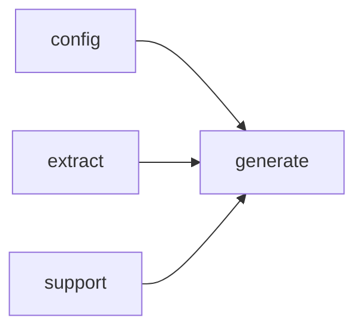

# Module `generate:page`

## Summary

The `generate:page` module is responsible for orchestrating the construction and rendering of individual documentation pages and page bundles within the generation pipeline. It owns the public functions that build the top‑level page structure for each page type—index, namespace, module, file, and bundle—by composing content from analysis data, symbol documentation, and layout plans. These functions return page root handles that are subsequently rendered into Markdown content via `render_page_markdown` and persisted to the filesystem by `write_page`.

The module’s public interface also includes `render_page_bundle`, which produces rendered output for a collection of related pages, and several builder functions such as `build_file_page_root`, `build_module_page_root`, and `build_namespace_page_root`. It relies on the `generate:model`, `generate:symbol`, `generate:markdown`, and `generate:common` modules for intermediate data structures, symbol documentation plans, Markdown node construction, and shared utilities, respectively. The module encapsulates all page‑level concerns from planning through output, ensuring that each page is correctly assembled before final rendering and writing.

## Imports

- [`config`](../config/index.md)
- [`extract`](../extract/index.md)
- [`generate:common`](common.md)
- [`generate:markdown`](markdown.md)
- [`generate:model`](model.md)
- [`generate:symbol`](symbol.md)
- `std`
- [`support`](../support/index.md)

## Imported By

- [`generate:scheduler`](scheduler.md)

## Dependency Diagram

## Functions

### `clore::generate::build_file_page_root`

Declaration: `generate/render/page.cppm:345`

Definition: `generate/render/page.cppm:345`

Declaration: [`Namespace clore::generate`](../../namespaces/clore/generate/index.md)

The function constructs a `SemanticSection` tree representing the root node for a file page. It first retrieves the file metadata from the `model` and, if found, appends two bullet-list sections: "Includes" (listing every include directive via `append_file_item`) and "Included By" (iterating all files in the model to find reverse inclusions, sorting by relative path). It then attempts to generate a Mermaid dependency diagram via `render_file_dependency_diagram_code`; if non‑empty, that diagram is placed in a dedicated sub‑section. Next, it delegates to `append_standard_symbol_sections` to populate symbol subsections (e.g., function, class, macro definitions) discovered through `collect_implementation_symbols`, adding an optional declaration link for each symbol. If the file belongs to a module (determined by `find_module_for_file`), a "Module Information" section is created with a link or code reference to the module name. Finally, a "Related Pages" bullet list is built from `build_related_page_targets`. The assembled root node is returned to the caller for further nesting, typically inside `build_page_root` or other page‑building functions.

#### Side Effects

No observable side effects are evident from the extracted code.

#### Reads From

- `plan.owner_keys`
- `plan.title`
- `plan.relative_path`
- `config.project_root`
- `model.files` (including includes)
- `analyses` (via `append_standard_symbol_sections`)
- `links` (via `resolve_module`, `find_declaration_page`, `build_related_page_targets`)
- return values from `render_file_dependency_diagram_code`, `collect_implementation_symbols`, `find_module_for_file`, `build_related_page_targets`

#### Usage Patterns

- called to generate the root semantic section for a file page in the documentation generation pipeline
- used within page-building functions such as `build_page_root`
- combines multiple sections into a single root for a file-level document

### `clore::generate::build_index_page_root`

Declaration: `generate/render/page.cppm:447`

Definition: `generate/render/page.cppm:447`

Declaration: [`Namespace clore::generate`](../../namespaces/clore/generate/index.md)

The function first constructs a root `SemanticSection` with kind `Index` and the provided page title. It then appends an "Overview" prompt section. If the project model uses modules, it builds a sorted "Modules" bullet list of interface module names that have a resolved link, filtering duplicates. A "Files" subsection follows, collecting source‑relative file paths, sorting them, and creating links. Next, a "Namespaces" list is generated from all namespaces except anonymous ones, again filtered by link resolution and sorted. A "Types" list uses `build_symbol_link_list` after filtering for type kinds and excluding anonymous symbols, sorted by qualified name. Finally, if the model provides a module dependency diagram, the function renders it as a Mermaid code block and appends it as a subsection. Throughout, the function depends on `clore::generate::LinkResolver` for resolving targets relative to the current page path, the `ProjectModel` for data, and helper utilities such as `build_list_section`, `build_symbol_link_list`, and `render_module_dependency_diagram_code` to produce the Markdown‑compatible content.

#### Side Effects

- allocates a `SemanticSection` and populates its `children` vector
- mutates the returned `SemanticSectionPtr` tree by appending `MarkdownNode` objects

#### Reads From

- parameter `plan`
- parameter `config`
- parameter `model`
- parameter `outputs`
- parameter `links`
- model`.modules`, model`.files`, model`.namespaces`, model`.symbols`
- outputs[`PromptKind::IndexOverview`]
- links`.resolve()`, links`.resolve_module()`

#### Writes To

- the returned `SemanticSectionPtr` (root) and its child nodes

#### Usage Patterns

- called during index page generation in the documentation pipeline
- used to compose the root content of a generated index page

### `clore::generate::build_module_page_root`

Declaration: `generate/render/page.cppm:255`

Definition: `generate/render/page.cppm:255`

Declaration: [`Namespace clore::generate`](../../namespaces/clore/generate/index.md)

The function creates a root semantic section for a module page by first constructing a `SemanticSection` with kind `SemanticKind::Module` using the plan’s owner key and title. It immediately appends a summary prompt section derived from `outputs` via `prompt_output_of` for `PromptKind::ModuleSummary`. If the module is located in the `extract::ProjectModel` using `extract::find_module_by_name`, it builds two ordered bullet lists: one for imports and one for “imported by” modules – each item is rendered through `append_module_item` with the current `plan.relative_path` and `links`. When the module has imports, a mermaid diagram is optionally appended using `render_import_diagram_code` wrapped in a `make_section` with `SemanticKind::Section`. The majority of the page content is produced by `append_standard_symbol_sections`, which collects symbols via a predicate-based callback and adds declaration links and symbol documentation links via supplied lambda functions. Following the standard sections, an internal structure prompt section for `PromptKind::ModuleArchitecture` is appended, and a “Related Pages” list is built from `build_related_page_targets`. No external I/O is performed; the returned `SemanticSectionPtr` is a tree structure consumed later by the page rendering pipeline.

#### Side Effects

- allocates memory for the returned `SemanticSectionPtr` and its child nodes via `make_section`, `build_prompt_section`, `build_list_section`, `make_mermaid`, and `append_standard_symbol_sections`

#### Reads From

- `plan` parameter (`const PagePlan&`)
- `config` parameter (`const config::TaskConfig&`)
- `model` parameter (`const extract::ProjectModel&`)
- `outputs` parameter (`const std::unordered_map<std::string, std::string>&`)
- `analyses` parameter (`const SymbolAnalysisStore&`)
- `links` parameter (`const LinkResolver&`)
- `layout` parameter (`const PageDocLayout&`)
- `plan.owner_keys`
- `plan.title`
- `plan.relative_path`
- `model.modules`
- `module->imports`
- `module->name`
- `PromptKind::ModuleSummary`
- `PromptKind::ModuleArchitecture`

#### Writes To

- constructed `SemanticSectionPtr` (`root`) and its internally built child nodes

#### Usage Patterns

- called during page generation for module pages
- part of the page building pipeline alongside `build_file_page_root` and `build_namespace_page_root`
- invoked with page plan, configuration, project model, analysis outputs, and layout to produce a modular documentation section

### `clore::generate::build_namespace_page_root`

Declaration: `generate/render/page.cppm:165`

Definition: `generate/render/page.cppm:165`

Declaration: [`Namespace clore::generate`](../../namespaces/clore/generate/index.md)

The function constructs the `SemanticSectionPtr` representing the root of a namespace documentation page. It first creates a root section with `SemanticKind::Namespace` and appends a prompt-generated summary section. If the namespace diagram (rendered via `render_namespace_diagram_code`) is non‑empty, it adds a mermaid diagram child. A subnamespaces list is built by scanning the model for direct children of the namespace, sorted and filtered to exclude anonymous namespaces; each resolved link is added via `make_link` with a relative target. The core content is supplied by `append_standard_symbol_sections`, which uses the provided lambdas to collect namespace symbols (via `collect_namespace_symbols`), add implementation page links (via `push_link_paragraph` and `find_implementation_pages`), and attach documentation links (via `add_symbol_doc_links` using `symbol_doc_view_for`). Finally, a “Related Pages” list is appended from `build_related_page_targets`. The function relies on the `plan`’s owner key, title, and relative path, and on the injected `config`, `model`, `analyses`, `links`, and `layout` to produce a fully populated section tree.

#### Side Effects

No observable side effects are evident from the extracted code.

#### Reads From

- `plan` parameters including `plan.owner_keys`, `plan.title`, `plan.relative_path`
- `config::TaskConfig` access via `config.project_root`
- `extract::ProjectModel` access via `model.namespaces`
- `outputs` hash map keyed by `PromptKind::NamespaceSummary`
- `SymbolAnalysisStore` (used in `append_standard_symbol_sections`)
- `LinkResolver` for resolving namespace and page links
- `PageDocLayout` for finding doc indices

#### Usage Patterns

- Called during namespace page generation to produce the root content section
- Used as a stage in the page building pipeline where the result is later rendered to markdown
- Typically invoked once per namespace from `generate_pages` or similar orchestration functions

### `clore::generate::build_page_root`

Declaration: `generate/render/page.cppm:546`

Definition: `generate/render/page.cppm:546`

Declaration: [`Namespace clore::generate`](../../namespaces/clore/generate/index.md)

The implementation of `clore::generate::build_page_root` acts as a dispatch hub. It examines `plan.page_type` and delegates to one of four specialized builders: `build_index_page_root`, `build_namespace_page_root`, `build_module_page_root`, or `build_file_page_root`. Each receives a tailored subset of the original parameters (`plan`, `config`, `model`, `outputs`, `analyses`, `links`, `layout`) appropriate to the page kind. If the page type does not match any known case, the function falls back to constructing a generic `SemanticSection` via `make_section` with a default title and depth.

Internal control flow is therefore a simple switch over the `PageType` enum. No further branching or computation occurs within this function; all page‑specific logic is pushed into the individual builder functions, each of which may internally call closure helpers such as `append_module_item`, `append_file_item`, or `select_primary_description_source_page`. Dependency resolution and cross‑linking are handled by the `LinkResolver` and `SymbolAnalysisStore` passed through to the builder.

#### Side Effects

No observable side effects are evident from the extracted code.

#### Reads From

- plan`.page_type`
- plan`.title`
- config
- model
- outputs
- analyses
- links
- layout

#### Usage Patterns

- Called during page rendering to select the appropriate page builder based on `PageType`
- Used as a central dispatch point in the page generation pipeline, likely invoked by `render_page_markdown` or similar functions

### `clore::generate::render_page_bundle`

Declaration: `generate/render/page.cppm:565`

Declaration: [`Namespace clore::generate`](../../namespaces/clore/generate/index.md)

The implementation of `clore::generate::render_page_bundle` coordinates the end-to-end rendering of a bundle of output pages. It accepts a `PagePlan` that defines the set of pages to produce, a `config::TaskConfig` supplying rendering options, an `extract::ProjectModel` with the project’s extracted data, a `std::unordered_map<std::string, std::string>` of `prompt_outputs` from prior LLM interactions, a `SymbolAnalysisStore` for per‑symbol annotation information, and a `LinkResolver` for resolving cross‑references across the generated documentation.

Internally, the function iterates over the page descriptors in the `PagePlan`. For each page, it invokes a rendering step that uses the `config::TaskConfig` to select templates and formats, the `extract::ProjectModel` to supply content, and the `prompt_outputs`, `SymbolAnalysisStore`, and `LinkResolver` to inject generated text, symbol metadata, and resolved links. The rendered pages are assembled into a bundle, and the function returns a `std::expected` that either holds the completed bundle or propagates an error from any step of the pipeline. Key dependencies include the page‑level rendering logic and the aggregation mechanism that merges the per‑page results.

#### Side Effects

No observable side effects are evident from the extracted code.

#### Reads From

- `const PagePlan& plan`
- `const config::TaskConfig& config`
- `const extract::ProjectModel& model`
- `const std::unordered_map<std::string, std::string>& prompt_outputs`
- `const SymbolAnalysisStore& analyses`
- `const LinkResolver& links`

#### Usage Patterns

- core orchestration function for page bundle rendering
- invoked by higher-level page generation workflows

### `clore::generate::render_page_bundle`

Declaration: `generate/render/page.cppm:573`

Declaration: [`Namespace clore::generate`](../../namespaces/clore/generate/index.md)

The function `clore::generate::render_page_bundle` orchestrates the generation of a complete page bundle by iterating over the entries defined in the `PagePlan`. For each page, it evaluates the `TaskConfig` to determine applicable formatting and processing options, then feeds the corresponding `ProjectModel` data together with any precomputed `prompt_outputs` into the rendering pipeline. The `LinkResolver` is used to resolve cross‑references and links both within and across pages, ensuring that the final bundle contains coherent inter‑page navigation. The algorithm proceeds in a two‑phase manner: first, it collects and possibly merges prompt‑generated content with static model data; second, it serializes each page using internal rendering primitives and assembles the results into the expected output type.

Dependencies of this implementation include the `extract::ProjectModel` for structural data, the `config::TaskConfig` for behavioural settings, and the `LinkResolver` for resolving references. The control flow depends on the layout defined by `PagePlan` and may branch on conditional pages or optional prompts. Error propagation is handled via the `std::expected` return type, which allows early termination if any sub‑render step fails, such as an unresolved link or a missing prompt output. No external file I/O occurs within this function; all input is passed as parameters and output is returned in‑memory.

#### Side Effects

No observable side effects are evident from the extracted code.

#### Reads From

- plan
- config
- model
- `prompt_outputs`
- links

#### Usage Patterns

- core rendering function
- called by page generation orchestrators
- used to produce final page content

### `clore::generate::render_page_markdown`

Declaration: `generate/render/page.cppm:602`

Definition: `generate/render/page.cppm:602`

Declaration: [`Namespace clore::generate`](../../namespaces/clore/generate/index.md)

The function assembles a markdown document by iterating over a `PagePlan` and combining data from `config::TaskConfig`, `extract::ProjectModel`, `prompt_outputs`, `linkResolver`, and optional `SymbolAnalysisStore`. It delegates page structure to builders like `build_page_root`, `build_frontmatter_page`, `build_module_page_root`, and `build_index_page_root`, and appends content sections via `append_standard_symbol_sections`, `append_module_item`, and `append_file_item`. The algorithm routes to `render_page_bundle` for bundled layouts, uses `write_page` to finalize output, and depends on internal anonymous-namespace helpers (`prompt_output_of_local_page`, `select_primary_description_source_page`) to resolve descriptions and prompt-based text.

#### Side Effects

No observable side effects are evident from the extracted code.

#### Reads From

- `plan` parameter
- `config` parameter
- `model` parameter
- `prompt_outputs` parameter (map)
- `links` parameter
- default-constructed `SymbolAnalysisStore`

#### Writes To

- returned `std::expected<std::string, RenderError>` value

#### Usage Patterns

- Entry point for page rendering
- Delegating to full overload with empty analysis store
- Called from page generation pipelines

### `clore::generate::render_page_markdown`

Declaration: `generate/render/page.cppm:582`

Definition: `generate/render/page.cppm:582`

Declaration: [`Namespace clore::generate`](../../namespaces/clore/generate/index.md)

The function delegates the heavy lifting to `clore::generate::render_page_bundle`, which produces a collection of `GeneratedPage` objects. After that call, `render_page_markdown` performs a linear search through the bundle, identifying the page whose `relative_path` matches the `plan.relative_path` from the input plan. If the bundle construction fails, the error is forwarded directly via `std::unexpected`. If the specific page is not found in the bundle, a `RenderError` is returned indicating the missing path. On success, the matched page’s `content` string is extracted and returned. The control flow is therefore a straightforward pipeline: bundle generation, then lookup, with early exit on failure. The primary dependency is `render_page_bundle`, which itself orchestrates calls to several builders and append helpers for modules, namespaces, files, and index pages.

#### Side Effects

No observable side effects are evident from the extracted code.

#### Reads From

- `plan` (the page plan)
- `config` (task configuration)
- `model` (project model)
- `prompt_outputs` (map of prompt outputs)
- `analyses` (symbol analysis store)
- `links` (link resolver)
- the bundle returned by `render_page_bundle`

#### Usage Patterns

- called by higher-level page generation functions
- used to retrieve markdown for a specific page after a bundle is rendered

### `clore::generate::write_page`

Declaration: `generate/render/page.cppm:666`

Definition: `generate/render/page.cppm:666`

Declaration: [`Namespace clore::generate`](../../namespaces/clore/generate/index.md)

The function begins by constructing an absolute target path from the provided `output_root` and the `relative_path` stored in the page. It validates that the relative path is indeed relative and does not contain any `.` or `..` components, returning an `std::unexpected` with a `RenderError` on violation. The target is normalized using `std::filesystem::path::lexically_normal`. The parent directory of the target is then created recursively via `std::filesystem::create_directories`, with error codes checked and propagated as `RenderError` on failure. Finally, the page content is written to the target file using `clore::support::write_utf8_text_file`, forwarding any write error into the same expected‑error channel. All filesystem operations use `std::error_code` to avoid exceptions, and every failure result is wrapped in a descriptive `RenderError`. The function depends on the `GeneratedPage` type (for `relative_path` and `content`), on `clore::support::write_utf8_text_file`, and on standard filesystem utilities.

#### Side Effects

- Creates parent directories on disk
- Writes UTF-8 text content to a file

#### Reads From

- `page.relative_path`
- `page.content`
- `output_root`

#### Writes To

- Filesystem at the constructed target path

#### Usage Patterns

- Called during the page output phase after generation
- Likely invoked in a loop by `write_pages` or similar batch writer
- Part of the `clore::generate` module's rendering pipeline

## Internal Structure

The `generate:page` module is responsible for assembling and rendering complete documentation pages from the project model. It decomposes page construction into specialized entry points for different page types: `build_file_page_root`, `build_module_page_root`, `build_namespace_page_root`, `build_index_page_root`, and the generic `build_page_root` that delegates to these. Rendering is handled separately by `render_page_markdown` (for a single page) and `render_page_bundle` (for a collection of related pages), with `write_page` managing final output to disk. The module imports a broad set of dependencies: `config` for generation settings, `extract` for analysis data, `generate:common` for shared link and view types, `generate:markdown` for Markdown node construction, `generate:model` for page plan and bundle definitions, `generate:symbol` for per-symbol documentation layout and grouping, and the `support` module for foundational utilities.

Internally, the module is layered with an anonymous namespace that contains helper functions such as `append_module_item`, `append_file_item`, `append_standard_symbol_sections`, `select_primary_description_source_page`, `prompt_output_of_local_page`, and `build_frontmatter_page`. These helpers handle low-level content assembly (e.g., iterating over symbol groups, appending standard sections, selecting the primary description source from a set of prompt outputs). The public API functions orchestrate these helpers, passing handles for the page plan, link resolvers, analysis data, model identifiers, and configuration. The implementation structure follows a builder pattern: each `build_*_page_root` function returns an integer handle to a newly created root node, which is later consumed by the rendering and writing stages. This separation of construction, rendering, and persistence keeps the pipeline modular and testable.

## Related Pages

- [Module config](../config/index.md)
- [Module extract](../extract/index.md)
- [Module generate:common](common.md)
- [Module generate:markdown](markdown.md)
- [Module generate:model](model.md)
- [Module generate:symbol](symbol.md)
- [Module support](../support/index.md)

