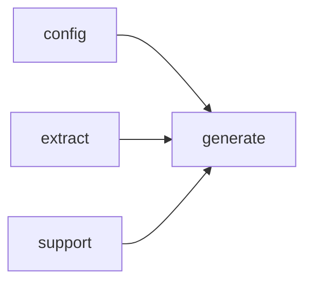

# Module `generate:page`

## Summary

The `generate:page` module is responsible for constructing and rendering the full set of documentation pages produced by the generation pipeline. It owns the page‑building and page‑rendering logic for all page types: module pages, file pages, namespace pages, index pages, and symbol‑specific pages. The module provides public entry points such as `build_page_root` (which dispatches to type‑specific builders like `build_module_page_root`, `build_file_page_root`, `build_namespace_page_root`, and `build_index_page_root`), `render_page_markdown` (which produces the final Markdown content for a single page), `render_page_bundle` (which renders a logical group of related pages together), and `write_page` (which serialises a completed page to its output file).

Beyond these orchestrating functions, the module also exposes internal helpers that operate on page components, such as `build_frontmatter_page`, `select_primary_description_source_page`, `prompt_output_of_local_page`, and the templated `append_standard_symbol_sections` (responsible for assembling the standard symbol documentation sections with links, analyses, and prompt outputs). The module depends on the `generate:model`, `generate:markdown`, `generate:common`, `generate:symbol`, and `extract` modules, using their types and utilities to build and render pages that are correct, link‑aware, and structured according to the project’s documentation plan.

## Imports

- [`config`](../config/index.md)
- [`extract`](../extract/index.md)
- [`generate:common`](common.md)
- [`generate:markdown`](markdown.md)
- [`generate:model`](model.md)
- [`generate:symbol`](symbol.md)
- `std`
- [`support`](../support/index.md)

## Imported By

- [`generate:scheduler`](scheduler.md)

## Dependency Diagram

## Functions

### `clore::generate::build_file_page_root`

Declaration: `generate/render/page.cppm:345`

Definition: `generate/render/page.cppm:345`

Declaration: [`Namespace clore::generate`](../../namespaces/clore/generate/index.md)

The function `clore::generate::build_file_page_root` constructs the root `SemanticSectionPtr` for a file page by assembling several sub‑sections in order. It first creates a root section of `SemanticKind::File` with the file’s title. If the file is present in the `model`, it adds two `BulletList` sections: one for "Includes" that iterates over `file_it->second.includes` and calls `append_file_item` for each, and another for "Included By" that collects all other files in `model.files` whose includes contain the current file — the list is sorted by relative path before appending. Next, if `render_file_dependency_diagram_code` returns a non‑empty diagram, a section with that diagram is appended via `make_mermaid`. Then `append_standard_symbol_sections` is invoked with a predicate from `collect_implementation_symbols`, a lambda to add declaration links via `push_optional_link_paragraph`, and an empty lambda for additional symbol adornments. If `find_module_for_file` discovers a module for the file, a "Module Information" section is added showing the module name as a link (if resolved) or as inline code. Finally, a "Related Pages" section is built from `build_related_page_targets`. The completed root is returned. The control flow is linear with conditional checks; dependencies include `config::TaskConfig`, `extract::ProjectModel`, `SymbolAnalysisStore`, `LinkResolver`, and numerous helper functions in the `generate` namespace.

#### Side Effects

- Allocates dynamic memory for the semantic section tree and its child nodes
- Modifies the children vector of the root section by appending markdown nodes

#### Reads From

- plan
- config
- model
- analyses
- links

#### Writes To

- returned `SemanticSectionPtr` pointing to allocated root section tree

#### Usage Patterns

- Used as a step in generating the content of a file documentation page
- Called by higher-level page generation functions

### `clore::generate::build_index_page_root`

Declaration: `generate/render/page.cppm:447`

Definition: `generate/render/page.cppm:447`

Declaration: [`Namespace clore::generate`](../../namespaces/clore/generate/index.md)

The function `clore::generate::build_index_page_root` assembles an index page by constructing a `SemanticSectionPtr` of kind `SemanticKind::Index`. It first creates a root `SemanticSection` with the page title and then sequentially appends child sections built from the provided `PagePlan` plan, `config::TaskConfig` config, `extract::ProjectModel` model, outputs map, and `LinkResolver` links. The overview section is generated via `build_prompt_section` using the prompt output keyed by `PromptKind::IndexOverview`. If the model indicates module usage, a "Modules" bullet list is added, containing links to each unique interface module name resolved through the link resolver. Next, a "Files" list links each resolvable file path (sorted by its source-relative label), followed by a "Namespaces" list that excludes anonymous namespaces and includes only resolvable names. A "Types" list collects all type-kind symbols, filters out those with anonymous namespace qualifiers, sorts them by qualified name, and renders them via `build_symbol_link_list`. Finally, if the model has a non-empty module dependency diagram (produced by `render_module_dependency_diagram_code`), a "Module Dependency Diagram" section containing a Mermaid code block is appended. The function returns the fully constructed root section pointer.

#### Side Effects

No observable side effects are evident from the extracted code.

#### Reads From

- `plan`
- `config`
- `model`
- `outputs`
- `links`
- `model.modules`
- `model.files`
- `model.namespaces`
- `model.symbols`
- `config.project_root`
- `plan.relative_path`
- `plan.title`

#### Writes To

- Allocates and returns a new `SemanticSection` root tree representing the index page

#### Usage Patterns

- Called during page generation to create the root content of an index page
- Used by higher-level page building functions that assemble full pages

### `clore::generate::build_module_page_root`

Declaration: `generate/render/page.cppm:255`

Definition: `generate/render/page.cppm:255`

Declaration: [`Namespace clore::generate`](../../namespaces/clore/generate/index.md)

The function constructs a `SemanticSection` root with `SemanticKind::Module` using the provided `PagePlan`, `config`, and `links`. It first inserts a summary prompt section sourced from the `outputs` map. When the module is found in the `extract::ProjectModel`, it builds "Imports" and "Imported By" bullet lists by calling `append_module_item` for each imported module name and for each module that imports this one (discovered via a linear scan across `model.modules`), respecting the `plan.relative_path` for link resolution. A "Dependency Diagram" section with a mermaid code block is conditionally appended via `render_import_diagram_code`. The core content is populated through `append_standard_symbol_sections`, which collects symbols via `collect_implementation_symbols` and for each symbol adds a declaration link from `find_declaration_page` and documentation links from `symbol_doc_view_for`. The function then appends an "Internal Structure" prompt section and a "Related Pages" list using `build_related_page_targets`. Every section and list item uses `make_section` and `build_list_section` helpers, and the entire tree is returned as the page root.

#### Side Effects

No observable side effects are evident from the extracted code.

#### Reads From

- `plan`
- `config`
- `model`
- `outputs`
- `analyses`
- `links`
- `layout`
- `extract::find_module_by_name(model, plan.owner_keys.front())`

#### Writes To

- returned `SemanticSectionPtr` (heap-allocated `root` and its children)

#### Usage Patterns

- called during page generation to build the root section of a module page
- used in `build_page_root` or similar page assembly functions

### `clore::generate::build_namespace_page_root`

Declaration: `generate/render/page.cppm:165`

Definition: `generate/render/page.cppm:165`

Declaration: [`Namespace clore::generate`](../../namespaces/clore/generate/index.md)

The function constructs a hierarchical `SemanticSectionPtr` representing the root of a namespace documentation page. It first creates a root section with `make_section` using `SemanticKind::Namespace`, the first owner key from `plan`, and the plan’s title. A summary prompt is added via `build_prompt_section` using the output for `PromptKind::NamespaceSummary`. If `render_namespace_diagram_code` returns a non-empty diagram, a diagram subsection is appended inside a `make_section` with `SemanticKind::Section`. Next, a "Subnamespaces" list is built by iterating over the model’s children of the current namespace, filtering out anonymous namespaces, and resolving each child link through `links.resolve` to produce a relative link via `make_relative_link_target`. The function then calls `append_standard_symbol_sections` with three lambdas: the first collects symbols from `collect_namespace_symbols` using the model and owner key; the second adds an implementation link paragraph via `push_link_paragraph` and `find_implementation_pages`; the third adds symbol documentation links via `add_symbol_doc_links` and `symbol_doc_view_for`. Finally, a "Related Pages" list is appended using `build_list_section` and `build_related_page_targets`. The resulting root section is returned.

The function depends on several internal components: `PagePlan`, `config::TaskConfig`, `extract::ProjectModel`, `SymbolAnalysisStore`, `LinkResolver`, and `PageDocLayout` for inputs; it leverages helpers like `make_section`, `build_prompt_section`, `build_list_section`, `render_namespace_diagram_code`, `append_standard_symbol_sections`, `collect_namespace_symbols`, `push_link_paragraph`, `find_implementation_pages`, `add_symbol_doc_links`, and `build_related_page_targets`. Control flow is linear with early returns only for diagram emptiness and missing namespace in model for the subnamespaces section.

#### Side Effects

No observable side effects are evident from the extracted code.

#### Reads From

- const `PagePlan`& plan
- const `config::TaskConfig`& config
- const `extract::ProjectModel`& model
- const `std::unordered_map<std::string, std::string>`& outputs
- const `SymbolAnalysisStore`& analyses
- const `LinkResolver`& links
- const `PageDocLayout`& layout

#### Usage Patterns

- Called when building the root node for a namespace documentation page
- Used in conjunction with `append_standard_symbol_sections` and `build_related_page_targets`

### `clore::generate::build_page_root`

Declaration: `generate/render/page.cppm:546`

Definition: `generate/render/page.cppm:546`

Declaration: [`Namespace clore::generate`](../../namespaces/clore/generate/index.md)

`clore::generate::build_page_root` acts as a dispatcher that selects the appropriate page construction strategy based on the `plan.page_type` field. It accepts a `PagePlan`, `config::TaskConfig`, `extract::ProjectModel`, a map of output paths, a `SymbolAnalysisStore`, a `LinkResolver`, and a `PageDocLayout`, then returns a `SemanticSectionPtr`. The function uses a `switch` statement over `PageType` values: for `PageType::Index` it delegates to `build_index_page_root`; for `PageType::Namespace` to `build_namespace_page_root`; for `PageType::Module` to `build_module_page_root`; and for `PageType::File` to `build_file_page_root`. A default fallback constructs a minimal section from the plan’s title using `make_section`. The function does no algorithm work itself; its sole responsibility is to route control to the dedicated builder corresponding to the page kind, centralizing the mapping of page types to their generation logic.

#### Side Effects

No observable side effects are evident from the extracted code.

#### Reads From

- `plan` (`PagePlan&`)
- `config` (`config::TaskConfig&`)
- `model` (`extract::ProjectModel&`)
- `outputs` (`const std::unordered_map<std::string, std::string>&`)
- `analyses` (`const SymbolAnalysisStore&`)
- `links` (`const LinkResolver&`)
- `layout` (`const PageDocLayout&`)
- `plan.page_type` (`PageType`)

#### Usage Patterns

- Called during page generation to obtain the root semantic section for a given page plan.

### `clore::generate::render_page_bundle`

Declaration: `generate/render/page.cppm:565`

Declaration: [`Namespace clore::generate`](../../namespaces/clore/generate/index.md)

The function `clore::generate::render_page_bundle` implements the core page-generation loop. It consumes a `PagePlan` to determine which pages must be produced, then iterates over each page entry. For each page, it retrieves the relevant content from the `ProjectModel` and `prompt_outputs`, applies the `LinkResolver` to resolve cross-references, and uses the `SymbolAnalysisStore` to attach symbol-level annotations. The `TaskConfig` supplies formatting and output settings that influence rendering. Each page’s output is collected, and any error (for example, missing template data or resolution failure) is propagated via the `std::expected` return type, bundling all successfully rendered pages on success. The algorithm’s control flow is sequential: validate input consistency, iterate over the plan in a single pass, accumulate results, and short‑circuit on the first unrecoverable error. Dependencies include the page‑plan data structure, the project model from extraction, the prompt‑output map from earlier generation phases, and the link‑resolver and analysis stores that were built during analysis and indexing.

#### Side Effects

- Generates rendered page content that may ultimately be written to files
- Invokes functions that perform I/O and state mutation during page construction

#### Reads From

- `PagePlan plan`
- `config::TaskConfig config`
- `extract::ProjectModel model`
- `std::unordered_map<std::string, std::string> prompt_outputs`
- `SymbolAnalysisStore analyses`
- `LinkResolver links`

#### Writes To

- Return value of type `std::expected` containing rendered page bundle

#### Usage Patterns

- Called by `generate_pages` and `generate_pages_async` to render a batch of pages
- Used in page generation pipeline after planning and analysis phases

### `clore::generate::render_page_bundle`

Declaration: `generate/render/page.cppm:573`

Declaration: [`Namespace clore::generate`](../../namespaces/clore/generate/index.md)

The function `clore::generate::render_page_bundle` serves as the orchestration point for rendering a complete bundle of output pages. It accepts a `PagePlan` describing the page structure, a `config::TaskConfig` with generation parameters, an `extract::ProjectModel` containing the extracted project data, a map of `prompt_outputs` keyed by string identifiers, and a `LinkResolver` for resolving inter-page references. Internally, the implementation iterates over the plan's sections, applying template logic and integrating the provided model and prompt outputs to produce a rendered result. Errors during processing are communicated through the `std::expected` return type, allowing the caller to handle failures gracefully without exceptions. Dependencies include the render module's internal utilities and the external model and configuration types.

#### Side Effects

- writes generated markdown files to disk

#### Reads From

- plan
- config
- model
- `prompt_outputs`
- links

#### Writes To

- generated markdown files

#### Usage Patterns

- invoked by `generate_pages` and `generate_pages_async` to produce final documentation output

### `clore::generate::render_page_markdown`

Declaration: `generate/render/page.cppm:602`

Definition: `generate/render/page.cppm:602`

Declaration: [`Namespace clore::generate`](../../namespaces/clore/generate/index.md)

The five-parameter overload of `clore::generate::render_page_markdown` is a convenience wrapper that delegates all work to the six-parameter overload. It receives a `PagePlan`, `config::TaskConfig`, `extract::ProjectModel`, a map of `prompt_outputs`, and a `LinkResolver`, then forwards them along with a default-constructed empty `SymbolAnalysisStore`. This allows callers to invoke page rendering without providing symbol analysis data when such information is not needed. The six-parameter overload (not shown in the snippet) contains the core algorithm that orchestrates building page roots, appending module and file items, resolving links, and assembling the final Markdown content. The delegation keeps the interface simple while retaining the option to supply analysis results for richer documentation output.

#### Side Effects

No observable side effects are evident from the extracted code.

#### Reads From

- const `PagePlan` &plan
- const `config::TaskConfig` &config
- const `extract::ProjectModel` &model
- const `std::unordered_map<std::string, std::string>` &`prompt_outputs`
- const `LinkResolver` &links

#### Usage Patterns

- called to obtain rendered page markdown for a given plan and configuration

### `clore::generate::render_page_markdown`

Declaration: `generate/render/page.cppm:582`

Definition: `generate/render/page.cppm:582`

Declaration: [`Namespace clore::generate`](../../namespaces/clore/generate/index.md)

The function `clore::generate::render_page_markdown` acts as a thin extraction layer over page rendering. It delegates all generation work to `clore::generate::render_page_bundle`, which produces a collection of `GeneratedPage` objects (a bundle). After the bundle is obtained (and checked for success), the function uses `std::ranges::find_if` to locate the page whose `relative_path` matches `plan.relative_path`. If such a page is found, its `content` is returned as the result; otherwise, an error containing the missing path is produced via `std::unexpected`. The function has a single, straightforward control flow: validate the bundle, search for the intended page, and return either the content or an error. Its primary dependency is `render_page_bundle`, and it also uses `std::format` for error construction and `std::ranges` for the search operation.

#### Side Effects

No observable side effects are evident from the extracted code.

#### Reads From

- the `plan` parameter
- the `config` parameter
- the `model` parameter
- the `prompt_outputs` parameter
- the `analyses` parameter
- the `links` parameter
- the `bundle` returned by `render_page_bundle`
- the `GeneratedPage` entries in the bundle

#### Usage Patterns

- Extracts a single page's markdown from a full bundle
- Used to obtain the final markdown string for a specific page plan
- Called after generating the entire page bundle

### `clore::generate::write_page`

Declaration: `generate/render/page.cppm:666`

Definition: `generate/render/page.cppm:666`

Declaration: [`Namespace clore::generate`](../../namespaces/clore/generate/index.md)

The function first constructs a `std::filesystem::path` from `output_root` and the page’s relative path, then validates that the relative path is non‑absolute and contains no `.` or `..` components, returning a `RenderError` on violation. After sanitization, it normalises the combined path with `lexically_normal` and extracts the parent directory. If the parent is non‑empty, it creates the directory tree via `fs::create_directories`, capturing any filesystem error into `ec` and returning an error with a descriptive message if creation fails. Finally, it delegates the actual file write to `clore::support::write_utf8_text_file`, forwarding any failure as a `RenderError`. The function depends on the filesystem library, the `write_utf8_text_file` utility, and the expected‑based error handling pattern using `RenderError`.

#### Side Effects

- Creates directories on disk
- Writes a UTF-8 text file to disk

#### Reads From

- `page.relative_path`
- `page.content`
- `output_root`

#### Writes To

- File at `target` path
- Parent directories of target path

#### Usage Patterns

- Called by `write_pages` to persist generated documentation pages

## Internal Structure

The module `generate:page` is the top-level orchestrator for constructing and rendering all documentation pages. It decomposes page generation into specialized builders—`build_index_page_root`, `build_module_page_root`, `build_file_page_root`, `build_namespace_page_root`, and `build_page_root` (the dispatcher)—each responsible for assembling the root content for a specific page type. Lower-level helpers in an anonymous namespace, such as `append_module_item`, `append_file_item`, `build_frontmatter_page`, and `select_primary_description_source_page`, encapsulate common substructures. The module imports `generate:model` for page plans and analysis data, `generate:markdown` for the Markdown AST, `generate:symbol` for symbol-pages, `generate:common` for linking and list utilities, and `config`, `extract`, `support`, and `std` for configuration, extraction, and foundational utilities. Internally, the module first calls the appropriate `build_*_page_root` to construct a page root (likely a `MarkdownDocument` or similar node), then uses `render_page_markdown` or `render_page_bundle` to produce the final output, and finally `write_page` to serialize it to disk, forming a clean three‑stage pipeline: build, render, write.

## Related Pages

- [Module config](../config/index.md)
- [Module extract](../extract/index.md)
- [Module generate:common](common.md)
- [Module generate:markdown](markdown.md)
- [Module generate:model](model.md)
- [Module generate:symbol](symbol.md)
- [Module support](../support/index.md)

