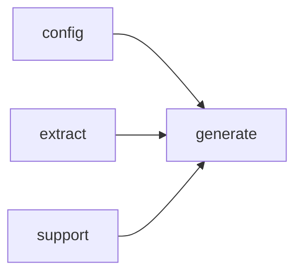

# Module `generate:page`

## Summary

The `generate:page` module is the top-level orchestration layer for producing complete documentation pages. It owns the pipeline that constructs page roots for index, namespace, module, and file overviews (`build_index_page_root`, `build_namespace_page_root`, `build_module_page_root`, `build_file_page_root`, and the generic `build_page_root`), then renders those roots into final Markdown content via `render_page_markdown`. It also provides bundling (`render_page_bundle`) and output serialization (`write_page`) to write rendered pages to disk. Internally, the module coordinates with the `generate:model`, `generate:symbol`, `generate:markdown`, and `generate:common` modules, and leverages `config` and `extract` for configuration and analysis data, while private helpers handle frontmatter assembly, symbol section appending, prompt output resolution, and description source selection.

## Imports

- [`config`](../config/index.md)
- [`extract`](../extract/index.md)
- [`generate:common`](common.md)
- [`generate:markdown`](markdown.md)
- [`generate:model`](model.md)
- [`generate:symbol`](symbol.md)
- [`support`](../support/index.md)

## Imported By

- [`generate:scheduler`](scheduler.md)

## Dependency Diagram

```mermaid
graph LR
    M0["generate"]
    I0["config"]
    I0 --> M0
    I1["extract"]
    I1 --> M0
    I2["support"]
    I2 --> M0
```

## Functions

### `clore::generate::build_file_page_root`

Declaration: `src/generate/render/page.cppm:364`

Definition: `src/generate/render/page.cppm:364`

Declaration: [`Namespace clore::generate`](../../namespaces/clore/generate/index.md)

The function constructs a `SemanticSectionPtr` representing the root of a file documentation page. It first queries the `ProjectModel` for the file identified by `plan.owner_keys.front()`; if the file exists, it builds two bullet lists — one for the file’s own includes (using `append_file_item` with a source-relative path) and one for files that include this file, sorted by their relative paths. An optional “Dependency Diagram” section is appended if `render_file_dependency_diagram_code` returns non‑empty content, embedded as a Mermaid block. Control then flows into `append_standard_symbol_sections`, which collects implementation symbols via `collect_implementation_symbols` and adds a “Declaration:” link paragraph (resolved through `find_declaration_page`) for each symbol. A “Module Information” section is conditionally added when `find_module_for_file` returns a module name; if the module has a known page target (from `links.resolve_module`), a hyperlink is rendered, otherwise inline code is used. Finally, a “Related Pages” section enumerates targets from `build_related_page_targets`, each rendered as a link item. The assembled children are returned as the root section.

#### Side Effects

No observable side effects are evident from the extracted code.

#### Reads From

- `plan`
- `config`
- `model.files`
- `analyses`
- `links`

#### Usage Patterns

- Called during documentation page generation to create the top-level semantic structure for a file page.

### `clore::generate::build_index_page_root`

Declaration: `src/generate/render/page.cppm:466`

Definition: `src/generate/render/page.cppm:466`

Declaration: [`Namespace clore::generate`](../../namespaces/clore/generate/index.md)

The function constructs the root `SemanticSectionPtr` for an index page by first creating a section with `SemanticKind::Index` and then appending a series of child sections in a fixed order. It begins with a prompt-based overview section built via `build_prompt_section` using the output keyed by `PromptKind::IndexOverview`. If the project model indicates that modules are used, it inserts a "Modules" bullet list that iterates over interface modules, deduplicates by name, sorts them, and creates links resolved through the `LinkResolver`. Next, it adds a "Files" list that pairs each file path with a source-relative label, sorts by label, and links to each file. A "Namespaces" list follows, excluding entries containing the anonymous namespace, sorted alphabetically. The "Types" list collects symbols whose kind satisfies `is_type_kind`, excludes anonymous namespace qualified names, sorts them by qualified name, and delegates rendering to `build_symbol_link_list`. Finally, if `render_module_dependency_diagram_code` returns a non-empty string, a "Module Dependency Diagram" section is appended as a Mermaid diagram. The function relies on page-plan metadata (`PagePlan::title`, `PagePlan::relative_path`), the `LinkResolver` to validate and resolve links, and the `extract::ProjectModel` to enumerate modules, files, namespaces, and symbols.

#### Side Effects

- Allocates and returns a new `SemanticSectionPtr`
- May trigger prompt generation via `build_prompt_section`

#### Reads From

- `plan.title`
- `plan.relative_path`
- `model.uses_modules`
- `model.modules`
- `model.files`
- `model.namespaces`
- `model.symbols`
- `config.project_root`
- `outputs` (map containing prompt outputs)
- `links` (`LinkResolver`)

#### Usage Patterns

- Called during index page generation to produce the root section
- Used as part of the page construction pipeline

### `clore::generate::build_module_page_root`

Declaration: `src/generate/render/page.cppm:274`

Definition: `src/generate/render/page.cppm:274`

Declaration: [`Namespace clore::generate`](../../namespaces/clore/generate/index.md)

The function constructs the top-level `SemanticSection` for a module documentation page. It begins by creating a root section with `SemanticKind::Module` using the plan's owner key and title. It then appends paragraphs from prompt outputs for the module summary. If the module is present in the project model, it adds bullet lists for imports and imported‑by modules, resolving each entry via `append_module_item` with the plan's relative path and link resolver. An import dependency diagram rendered as Mermaid code is conditionally inserted when the diagram generation produces non‑empty output. The bulk of the symbol documentation is delegated to `append_standard_symbol_sections`, which uses `collect_implementation_symbols` to gather symbols matching an internal predicate, and custom link and doc‑link lambdas to append declaration pages and symbol‑specific documentation. Further prompt sections for internal architecture and a list of related pages (built from `build_related_page_targets`) complete the root node before it is returned.

Key dependencies include the `extract::ProjectModel` for module data, `SymbolAnalysisStore` for symbol analyses, `LinkResolver` for page resolution, and `PageDocLayout` for documentation link formatting. The function relies on utility functions such as `build_prompt_section`, `build_list_section`, `make_section`, `append_module_item`, `render_import_diagram_code`, `append_standard_symbol_sections`, `collect_implementation_symbols`, `find_declaration_page`, `add_symbol_doc_links`, `symbol_doc_view_for`, and `build_related_page_targets`.

#### Side Effects

No observable side effects are evident from the extracted code.

#### Reads From

- plan
- config
- model
- outputs
- analyses
- links
- layout
- plan`.owner_keys`
- plan`.title`
- plan`.relative_path`
- module->imports
- model`.modules`

#### Usage Patterns

- Called during module page generation to build the top-level section.
- Used within `build_page_root` dispatch for module page types.

### `clore::generate::build_namespace_page_root`

Declaration: `src/generate/render/page.cppm:184`

Definition: `src/generate/render/page.cppm:184`

Declaration: [`Namespace clore::generate`](../../namespaces/clore/generate/index.md)

`clore::generate::build_namespace_page_root` constructs the root `SemanticSection` for a namespace documentation page. It begins by creating a section with `SemanticKind::Namespace`, using `plan.owner_keys.front()` as the owning entity and `plan.title` for the heading. A prompt‑based “Summary” subsection is added immediately from the precomputed `PromptKind::NamespaceSummary` output. If `render_namespace_diagram_code` returns a non‑empty Mermaid string, a “Diagram” subsection containing the diagram is inserted. A “Subnamespaces” subsection is built as a sorted bullet list, omitting anonymous namespaces, with each entry linked via `links.resolve`. The core symbol listings are delegated to `append_standard_symbol_sections`, which receives lambdas that invoke `collect_namespace_symbols` to gather entities, `find_implementation_pages` to add “Implementation:” links, and `add_symbol_doc_links` for documentation cross‑references. Finally, a “Related Pages” subsection is appended using `build_related_page_targets`. The function depends on several helpers from the `clore::generate` namespace, including `make_section`, `build_prompt_section`, `build_list_section`, `make_link`, and the various symbol‑collection and link‑resolution utilities.

#### Side Effects

No observable side effects are evident from the extracted code.

#### Reads From

- `plan`
- `config`
- `model`
- `outputs`
- `analyses`
- `links`
- `layout`
- `plan.owner_keys`
- `plan.title`
- `plan.relative_path`
- `model.namespaces`

#### Writes To

- returns a `SemanticSectionPtr` for the namespace page root

#### Usage Patterns

- called during namespace page generation
- used to build the top-level section of a namespace page

### `clore::generate::build_page_root`

Declaration: `src/generate/render/page.cppm:565`

Definition: `src/generate/render/page.cppm:565`

Declaration: [`Namespace clore::generate`](../../namespaces/clore/generate/index.md)

The function `clore::generate::build_page_root` acts as a dispatch hub that selects the appropriate page-specific builder based on the value of `plan.page_type`. Internally, a `switch` statement evaluates the `PageType` enumerator: for `PageType::Index` it delegates to `clore::generate::build_index_page_root`, passing `plan`, `config`, `model`, `outputs`, and `links`; for `PageType::Namespace` it invokes `clore::generate::build_namespace_page_root` with the full set of parameters including `analyses` and `layout`; for `PageType::Module` it calls `clore::generate::build_module_page_root`; and for `PageType::File` it calls `clore::generate::build_file_page_root`. If the page type does not match any known case, the function returns a minimal default section constructed via `make_section` with `SemanticKind::Section`, an empty children list, `plan.title`, heading level 1, and a `false` flag. This centralises the decision logic for constructing the root of a documentation page, isolating each page-type’s build algorithm in its own function and relying on the caller to supply all necessary analysis and configuration dependencies.

#### Side Effects

- allocates a `SemanticSectionPtr` via `make_section`
- calls builder functions that may allocate or modify state

#### Reads From

- `plan`
- `config`
- `model`
- `outputs`
- `analyses`
- `links`
- `layout`

#### Writes To

- allocated `SemanticSectionPtr` object

#### Usage Patterns

- called during page generation to create the root semantic section
- used as a central point for type-based page root construction

### `clore::generate::render_page_bundle`

Declaration: `src/generate/render/page.cppm:584`

Definition: `src/generate/render/page.cppm:629`

Declaration: [`Namespace clore::generate`](../../namespaces/clore/generate/index.md)

The function orchestrates the creation of a set of generated pages for a given `PagePlan`. It first builds a document layout via `build_page_doc_layout`, then constructs a `MarkdownDocument` whose root is produced by `build_page_root` using the plan, `config`, `model`, `prompt_outputs`, `analyses`, `links`, and the layout. After rendering the document via `render_markdown`, it checks for an empty body and returns an error if so; otherwise it creates frontmatter via `build_frontmatter_page` and assembles the primary `GeneratedPage` with the rendered content and the plan’s title and relative path. If `page_supports_symbol_subpages` returns true, the function iterates over symbol doc groups obtained from the layout using `for_each_symbol_doc_group`, invoking `append_symbol_doc_pages` to append additional pages; a failure in any group causes an early error return. Finally, it returns the collected vector of `GeneratedPage` instances.

#### Side Effects

- Allocates and returns a vector of `GeneratedPage` objects
- Modifies the local `MarkdownDocument` by assigning its `frontmatter` member

#### Reads From

- const `PagePlan`& plan
- const `config::TaskConfig`& config
- const `extract::ProjectModel`& model
- const `std::unordered_map<std::string, std::string>`& `prompt_outputs`
- const `SymbolAnalysisStore`& analyses
- const `LinkResolver`& links

#### Writes To

- The output `std::vector<GeneratedPage>` returned by the function
- The local `MarkdownDocument` object (via frontmatter assignment)

#### Usage Patterns

- Called from higher-level page generation routines such as `generate_pages` and `generate_pages_async`
- Used to produce a complete page bundle from a single page plan, including subpages when applicable

### `clore::generate::render_page_bundle`

Declaration: `src/generate/render/page.cppm:592`

Definition: `src/generate/render/page.cppm:592`

Declaration: [`Namespace clore::generate`](../../namespaces/clore/generate/index.md)

The function `clore::generate::render_page_bundle` is a convenience overload that directly forwards its arguments to the more general five‑parameter counterpart, supplying a default‑constructed `SymbolAnalysisStore` as the additional parameter. Internally, the algorithm is a simple delegation: it calls the overload that accepts the `SymbolAnalysisStore`, passing the `plan`, `config`, `model`, `prompt_outputs`, and `links` unchanged. This design centralizes the core page‑bundle generation logic—including building page roots, rendering markdown, and writing outputs—in the single overload that also incorporates symbol analysis, while offering a cleaner interface for callers that do not require that feature.

#### Side Effects

No observable side effects are evident from the extracted code.

#### Reads From

- plan
- config
- model
- `prompt_outputs`
- links

#### Usage Patterns

- Used to generate a page bundle from a plan without symbol analysis

### `clore::generate::render_page_markdown`

Declaration: `src/generate/render/page.cppm:621`

Definition: `src/generate/render/page.cppm:621`

Declaration: [`Namespace clore::generate`](../../namespaces/clore/generate/index.md)

The function constructs a complete Markdown document for a single documentation page by building a structured document tree and then rendering it to a string. It first determines the page type from the provided `plan` (e.g., namespace, module, file, index) and calls an appropriate builder such as `clore::generate::build_namespace_page_root`, `clore::generate::build_module_page_root`, `clore::generate::build_file_page_root`, or `clore::generate::build_index_page_root`. These builders populate a node tree (stored in `root`) with sections for the page title, front matter, headings, symbol descriptions, and optional diagrams (namespace, dependency, import). The function then uses `clore::generate::(anonymous namespace)::append_standard_symbol_sections` to insert per‑symbol sections, relying on a collect‑symbols callback and appending links and documentation links. After constructing the tree, `clore::generate::render_page_bundle` serializes the node hierarchy into the final Markdown text, incorporating layout settings from `config` and any pre‑rendered prompt outputs. The resulting string is returned via `std::expected`, with errors wrapped in a `RenderError` type. Internal control flow branches on the page kind, iterates over symbol lists, and conditionally includes visual diagrams, all while resolving cross‑page references through the `LinkResolver`.

#### Side Effects

No observable side effects are evident from the extracted code.

#### Reads From

- `plan`
- `config`
- `model`
- `prompt_outputs`
- `links`

#### Usage Patterns

- Called to obtain markdown content for a page before writing it to disk
- Used as a convenience overload when symbol analysis is not required

### `clore::generate::render_page_markdown`

Declaration: `src/generate/render/page.cppm:601`

Definition: `src/generate/render/page.cppm:601`

Declaration: [`Namespace clore::generate`](../../namespaces/clore/generate/index.md)

The function `clore::generate::render_page_markdown` first delegates the entire rendering process to `clore::generate::render_page_bundle`, which produces a collection of `GeneratedPage` objects representing all output pages for the given `PagePlan`. After the bundle is successfully produced, the function locates the single page whose `relative_path` equals `plan.relative_path` using `std::ranges::find_if`. If the bundle is missing (i.e., `render_page_bundle` returned an error) or the expected page is not found, the function returns a `std::unexpected` `RenderError` with a descriptive message; otherwise it returns the `content` field of the matching page. The implementation thus acts as a thin dispatch layer that isolates the caller from the multi-page bundle logic, relying entirely on the correctness of `render_page_bundle` and the assumption that every plan’s path appears exactly once in the output.

#### Side Effects

No observable side effects are evident from the extracted code.

#### Reads From

- plan (`PagePlan`)
- config (`config::TaskConfig`)
- model (`extract::ProjectModel`)
- `prompt_outputs` (`std::unordered_map<std::string, std::string>`)
- analyses (`SymbolAnalysisStore`)
- links (`LinkResolver`)

#### Usage Patterns

- Called to obtain the final rendered markdown for a specific page plan
- Used as a high-level entry point for page rendering

### `clore::generate::write_page`

Declaration: `src/generate/render/page.cppm:685`

Definition: `src/generate/render/page.cppm:685`

Declaration: [`Namespace clore::generate`](../../namespaces/clore/generate/index.md)

The function `clore::generate::write_page` implements file output for a single generated documentation page. It first validates that the given `page.relative_path` is a relative path without `.` or `..` components, returning an error via `std::unexpected` if the check fails. After validation, it constructs the absolute target filesystem path by combining `output_root` with the relative path and normalising it using `std::filesystem::path::lexically_normal`. It then ensures the parent directory exists by calling `std::filesystem::create_directories`, capturing any error code and returning an error if directory creation fails. Finally, it writes the page content to the target file using `clore::support::write_utf8_text_file`, propagating any write error.

The control flow is linear with early returns on validation failures and directory‑creation failures. The function relies on `std::filesystem` for path manipulation and directory creation, and on `clore::support::write_utf8_text_file` for the actual file write, with `RenderError` used for error reporting. There are no additional side effects or internal sub‑calls beyond those sketched.

#### Side Effects

- creates directories on the filesystem if they do not exist
- writes a UTF-8 text file to the specified output path

#### Reads From

- `page.relative_path` (string member of `GeneratedPage`)
- `page.content` (string member of `GeneratedPage`)
- `output_root` (`string_view` parameter)

#### Writes To

- filesystem directories under `output_root`
- a file at the resolved path containing `page.content`

#### Usage Patterns

- called by page generation pipeline to persist rendered pages
- used as a final step in file-based output generation

## Internal Structure

The `generate:page` module is organized around a set of public entry points that each handle a specific stage of page construction and rendering. The builders (`build_namespace_page_root`, `build_module_page_root`, `build_file_page_root`, `build_index_page_root`, and the generic `build_page_root`) assemble the top‑level structure for each page type, accepting opaque integer references that identity the relevant page plan, analysis store, and configuration. Higher‑level functions (`render_page_markdown`, `render_page_bundle`) transform a fully constructed page root into final Markdown output, while `write_page` serializes the result to a file. An anonymous‑namespace layer (e.g., `append_file_item`, `append_module_item`, `append_standard_symbol_sections`, `build_frontmatter_page`) provides reusable helpers for inserting common sub‑sections such as frontmatter, symbol lists, and cross‑reference links.

Internally, the module imports heavily from `generate:model` (for page plans, analysis stores, and link resolvers), `generate:markdown` (for the Markdown node hierarchy), `generate:symbol` (for per‑symbol rendering), and `config` (for generation settings). The use of integer handles throughout the public API allows callers to pass references to state that is maintained by the broader generation pipeline without exposing the concrete C++ types, while the private helpers operate directly on the imported model and markdown types. This layered decomposition keeps page‑type‑specific logic separate from the generic rendering and I/O infrastructure, and the reliance on opaque handles makes the public interface stable across internal refactoring.

## Related Pages

- [Module config](../config/index.md)
- [Module extract](../extract/index.md)
- [Module generate:common](common.md)
- [Module generate:markdown](markdown.md)
- [Module generate:model](model.md)
- [Module generate:symbol](symbol.md)
- [Module support](../support/index.md)

