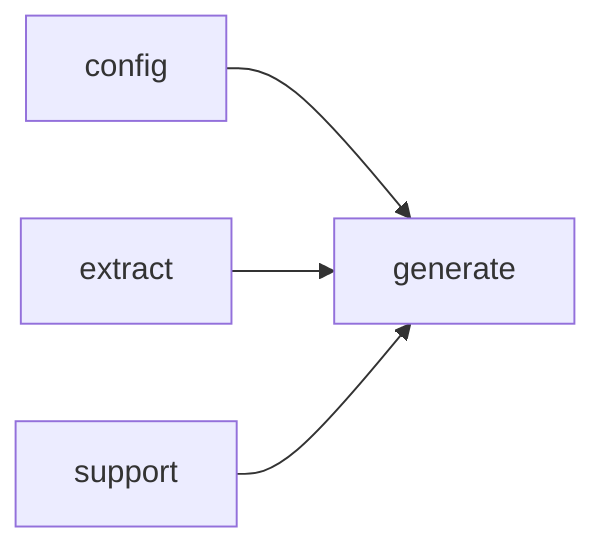

# Module `generate:planner`

## Summary

The `generate:planner` module is responsible for producing the complete set of page plans that drive the documentation generation pipeline. It translates the extracted project model and user configuration into a structured plan set, enumerating pages for modules, namespaces, files, and symbols while handling topological ordering and error detection. The module owns the public entry point `build_page_plan_set`, which accepts model and configuration handles and returns a plan set handle, and the `PlanError` struct for reporting planning failures. Internally, a `PlanBuilder` orchestrates the enumeration and construction of individual page prompts, relying on supporting utilities for identifier validation and namespace resolution.

## Imports

- [`config`](../config/index.md)
- [`extract`](../extract/index.md)
- [`generate:model`](model.md)
- `std`
- [`support`](../support/index.md)

## Imported By

- [`generate:scheduler`](scheduler.md)

## Dependency Diagram

## Types

### `clore::generate::PlanError`

Declaration: `generate/planner.cppm:11`

Definition: `generate/planner.cppm:11`

Declaration: [`Namespace clore::generate`](../../namespaces/clore/generate/index.md)

The `clore::generate::PlanError` struct is a simple data holder that conveys a descriptive error message from the planner. Its only member is a `std::string` field named `message`, which stores the error text. There are no invariants enforced on `message`; the struct relies on the implicit default constructor, copy/move operations, and destructor generated by the compiler. This minimal design allows the planner to return or throw error information without additional overhead.

#### Invariants

- No explicit constraints are placed on the value of `message`; it may be any valid `std::string`.
- The struct has no invariant beyond those inherent to `std::string`.

#### Key Members

- `message`

#### Usage Patterns

- Returned or thrown to indicate a plan‑generation error.
- Logged or inspected by callers to diagnose the cause of failure.

## Functions

### `clore::generate::build_page_plan_set`

Declaration: `generate/planner.cppm:15`

Definition: `generate/planner.cppm:369`

Declaration: [`Namespace clore::generate`](../../namespaces/clore/generate/index.md)

The function constructs a `PagePlanSet` by first instantiating a `PlanBuilder` from the given `config` and `model`. It then delegates page enumeration to helper functions in a fixed sequence: if the model uses modules, `enumerate_module_pages` is called; otherwise `enumerate_file_pages`. After recording the count of these implementation pages, it calls `enumerate_namespace_pages` to add namespace index pages, then `enumerate_index_page` to add a single top-level index. Each enumeration step propagates errors via the `expected` pattern, logging intermediate counts. Once all pages are collected in `builder.plans`, the function validates that no two pages share the same output path using `validate_no_path_conflicts`, and applies `topological_sort` on the plan list (using `builder.id_to_index` for dependency resolution) to compute the final generation order. The result is packaged as a `PagePlanSet` containing the plans and the sorted order.

#### Side Effects

- Logs informational messages about page counts at each enumeration step
- Constructs a local `PlanBuilder` and mutates its internal state
- Moves builder`.plans` and builder`.generation_order` into the returned `PagePlanSet`
- May result in allocation of `PagePlanSet` and associated vectors
- Emits error objects via `std::unexpected` on failure

#### Reads From

- `config::TaskConfig` config
- `extract::ProjectModel` model
- model`.uses_modules`
- builder`.plans`
- builder`.path_entries`
- builder`.id_to_index`

#### Writes To

- builder`.plans`
- builder`.path_entries`
- builder`.id_to_index`
- Returned `PagePlanSet::plans`
- Returned `PagePlanSet::generation_order`
- Local `PlanBuilder` builder
- Local variables (e.g., `impl_count`, order, `path_check`, `emit_modules`)

#### Usage Patterns

- Called by high-level generation entry points to create a plan set from configuration and project model
- Used as a prerequisite before rendering or writing pages based on the plan

## Internal Structure

The `generate::planner` module is organized around a private `PlanBuilder` class that acts as the central accumulator for page plans. The module decomposes planning into focused, anonymous-namespace helper functions—`enumerate_file_pages`, `enumerate_namespace_pages`, `enumerate_module_pages`, and `enumerate_index_page`—each responsible for translating a corresponding category of source model entities into a set of `PagePlan` entries. Supporting utilities such as `topological_sort`, `namespace_of`, `is_renderable_namespace_name`, and `has_reserved_identifier_prefix` provide the internal layering needed to resolve dependencies, validate names, and order output. The single public entry point, `build_page_plan_set`, consumes a configuration and model (imported from `generate:model`) and returns an opaque plan set handle that downstream stages use for rendering or evidence collection. Imports from `config`, `extract`, and `support` supply configuration data, source‑extraction results, and foundational utilities (e.g., caching, path handling); `PlanError` is defined as a uniform error type for planning‑stage failures.

## Related Pages

- [Module config](../config/index.md)
- [Module extract](../extract/index.md)
- [Module generate:model](model.md)
- [Module support](../support/index.md)

