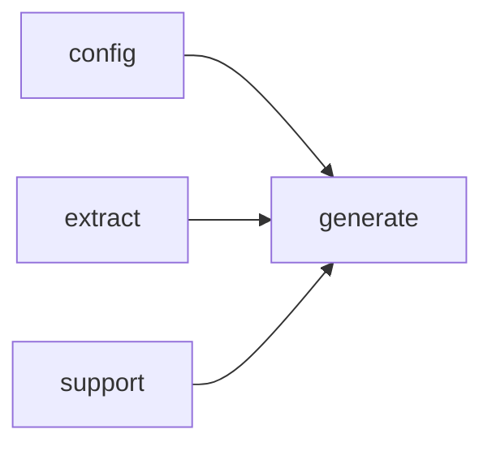

# Module `generate:planner`

## Summary

The `generate:planner` module is responsible for constructing a complete set of page plans that guide the documentation generation process. It takes the extracted symbol and module model from the `extract` module and the generation configuration, then enumerates page plans for modules, files, namespaces, and an index page. Internal helper functions determine renderable namespaces, perform topological sorting of plans, and build plan identifiers from the model. The module also handles error conditions through the `PlanError` type, which contains a descriptive message.

The public-facing interface is limited to the function `clore::generate::build_page_plan_set`, which accepts two identifiers (likely representing a model and configuration) and returns an integer handle to a set of page plans. This handle can be used by downstream generation routines, such as the link resolver and page root builder. All other symbols in the module, including the `PlanBuilder` helper struct and the various enumeration functions, are internal to the implementation.

## Imports

- [`config`](../config/index.md)
- [`extract`](../extract/index.md)
- [`generate:model`](model.md)
- `std`
- [`support`](../support/index.md)

## Imported By

- [`generate:scheduler`](scheduler.md)

## Dependency Diagram

## Types

### `clore::generate::PlanError`

Declaration: `generate/planner.cppm:11`

Definition: `generate/planner.cppm:11`

Declaration: [`Namespace clore::generate`](../../namespaces/clore/generate/index.md)

The struct `clore::generate::PlanError` is a trivial aggregate type whose sole member is the `message` field of type `std::string`. It serves as a lightweight error carrier within the planning subsystem, with no custom constructors, destructors, or assignment `operator`s; all special member functions are implicitly defined. The internal invariant is simply that `message` may contain any `std::string` value, including an empty string, and the struct imposes no additional constraints. Because the type is an aggregate, direct brace-initialization is the intended way to construct instances, and the layout is determined solely by the single `std::string` member.

#### Invariants

- `message` must contain a non-empty string describing the error.

#### Key Members

- `message`: a `std::string` holding error details.

#### Usage Patterns

- Returned or thrown by generation functions to indicate failure.
- Checked by callers to determine the cause of a plan generation error.

## Functions

### `clore::generate::build_page_plan_set`

Declaration: `generate/planner.cppm:15`

Definition: `generate/planner.cppm:369`

Declaration: [`Namespace clore::generate`](../../namespaces/clore/generate/index.md)

The implementation proceeds in four sequential enumeration phases, each delegating to a dedicated helper that populates a shared `PlanBuilder` instance. First, the function branches on `builder.model.uses_modules` to call either `enumerate_module_pages` or `enumerate_file_pages`; these two paths are mutually exclusive, corresponding to module‑based or header‑based projects. After recording the count of content pages, `enumerate_namespace_pages` and `enumerate_index_page` are invoked in order, ensuring that the index page is built after all content pages are known. Every enumeration helper returns an `expected`; a failure at any point immediately propagates the `PlanError` message via `std::unexpected`.

Once the page plans are assembled, the function validates that no two pages share the same output path using `validate_no_path_conflicts`. If that check passes, a topological sort is computed over the plans using `topological_sort(builder.plans, builder.id_to_index)` to determine the final `generation_order`. The result is packaged as a `PagePlanSet` containing both the `plans` vector and the sorted order. The entire algorithm is structured as a linear pipeline, with error handling at every step and a final empty‑plans guard that returns an error if no pages were generated.

#### Side Effects

- logs informational messages about page counts

#### Reads From

- `config::TaskConfig` parameter `config`
- `extract::ProjectModel` parameter `model`
- `PlanBuilder` local variable `builder` (including its `plans`, `path_entries`, `id_to_index`)
- internal state of helper functions `enumerate_module_pages`, `enumerate_file_pages`, `enumerate_namespace_pages`, `enumerate_index_page`, `validate_no_path_conflicts`, `topological_sort`

#### Writes To

- local variable `builder.plans` (via emplace/move from helper enumeration functions)
- local variable `builder.path_entries` (likely mutated during enumeration)
- local variable `builder.id_to_index` (used in topological sort)
- return value `PagePlanSet` (contains moved `plans` and `generation_order`)

#### Usage Patterns

- called as part of the page generation pipeline
- invoked after configuration and project model are available
- returned value used to drive subsequent page rendering steps

## Internal Structure

The `generate:planner` module acts as the orchestration layer that transforms extracted project data and configuration into a complete set of page plans. Its decomposition centers on a private `PlanBuilder` class that carries the configuration, model, and an incremental plan collection along with a mapping from entity identifiers to plan indices. Several internal helper functions—such as `enumerate_module_pages`, `enumerate_namespace_pages`, `enumerate_file_pages`, and `enumerate_index_page`—each populate the builder with plans for a specific document category, while utility functions like `namespace_of`, `has_reserved_identifier_prefix`, and `is_renderable_namespace_name` provide low‑level namespace and identifier screening. A topological sort is then performed on the accumulated plans to establish a consistent generation order. The module imports `config`, `extract`, `generate:model`, and `support`, leveraging the extracted symbol graph, configuration parameters, and foundational utility types. The public entry point `build_page_plan_set` accepts two identifiers (likely representing the project configuration and model) and returns an integer handle to the resulting ordered plan set, which downstream consumers such as the link resolver and page root builder can then use.

## Related Pages

- [Module config](../config/index.md)
- [Module extract](../extract/index.md)
- [Module generate:model](model.md)
- [Module support](../support/index.md)

