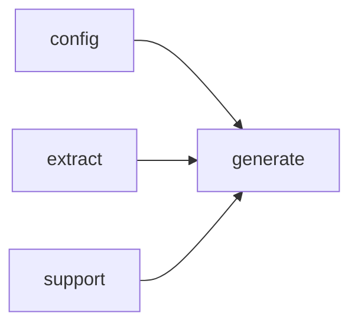

# Module `generate:planner`

## Summary

The `generate:planner` module is responsible for the page planning phase of the documentation generation pipeline. It takes the extracted project model and configuration, then enumerates all pages that need to be generated—covering namespaces, files, modules, and the top-level index—and constructs a dependency-resolved `PagePlanSet`. This plan set establishes the complete ordering and identity for each output page, enabling subsequent link resolution and rendering steps. The module’s public interface is centered on the function `build_page_plan_set`, which returns an integer handle to the plan set for use by downstream builders. Internally, the module owns the `PlanBuilder` helper class, topological sorting logic, and namespace/filename analysis utilities that collectively determine page boundaries, paths, and dependency edges. Error conditions during planning are reported via the `PlanError` struct.

## Imports

- [`config`](../config/index.md)
- [`extract`](../extract/index.md)
- [`generate:model`](model.md)
- [`support`](../support/index.md)

## Imported By

- [`generate:scheduler`](scheduler.md)

## Dependency Diagram

```mermaid
graph LR
    M0["generate"]
    I0["config"]
    I0 --> M0
    I1["extract"]
    I1 --> M0
    I2["support"]
    I2 --> M0
```

## Types

### `clore::generate::PlanError`

Declaration: `src/generate/planner.cppm:28`

Definition: `src/generate/planner.cppm:28`

Declaration: [`Namespace clore::generate`](../../namespaces/clore/generate/index.md)

The struct `clore::generate::PlanError` is implemented as a simple aggregate with a single member `message` of type `std::string`. No custom constructors, destructors, or member functions are defined, so the compiler generates the default special members. The struct imposes no additional invariants beyond those of `std::string`; the string may be empty or contain any valid UTF‑8 text. This minimal design makes `clore::generate::PlanError` a lightweight and trivially copyable error type used internally for reporting planner failures.

#### Invariants

- `message` may be empty or contain arbitrary error text.
- No other state is stored.

#### Key Members

- `message` field - stores the error description.

#### Usage Patterns

- Returned or thrown as an error type in generation planner functions.
- Likely used in conjunction with other error handling mechanisms.

## Functions

### `clore::generate::build_page_plan_set`

Declaration: `src/generate/planner.cppm:32`

Definition: `src/generate/planner.cppm:386`

Declaration: [`Namespace clore::generate`](../../namespaces/clore/generate/index.md)

The function `clore::generate::build_page_plan_set` orchestrates the construction of a complete `PagePlanSet` from a `config::TaskConfig` and `extract::ProjectModel`. Execution begins by initializing a `PlanBuilder` and selecting the page enumeration strategy based on module usage: header‑based projects call `enumerate_file_pages`, while module‑based projects call `enumerate_module_pages`. After these content pages are built, `enumerate_namespace_pages` appends namespace pages, and `enumerate_index_page` adds a single index page. If the resulting plan set is empty, an error is returned immediately. The algorithm then validates output path uniqueness via `validate_no_path_conflicts` on the builder’s `path_entries` and topologically sorts the collected plans using `topological_sort` to determine a valid `generation_order`. On success, it returns a `PagePlanSet` holding the plans and order; any intermediate failure is propagated as a `PlanError` via the `std::expected` return type.

Key internal dependencies include the `PlanBuilder` state machine, which aggregates plans and path entries across all enumeration phases, and the helper functions `enumerate_module_pages`, `enumerate_file_pages`, `enumerate_namespace_pages`, and `enumerate_index_page`. The topological sort and path‑conflict validation are private free functions in the anonymous namespace, ensuring that the build order respects plan dependencies and that no two pages produce the same output path.

#### Side Effects

- Logs info messages about page counts via `logging::info`
- Allocates and returns a new `PagePlanSet` by value (ownership transfer)

#### Reads From

- `config::TaskConfig config`
- `extract::ProjectModel model`
- Internal fields of `PlanBuilder`: `plans`, `path_entries`, `id_to_index`

#### Writes To

- Logging output (via `logging::info`)
- Returned `PagePlanSet` (written to by the function body and passed to caller)

#### Usage Patterns

- Called during page generation to produce a sorted set of plans
- Used by higher-level generation functions like `generate_pages`

## Internal Structure

The `generate:planner` module is responsible for constructing a complete set of page plans (a `PagePlanSet`) from extracted project data. It decomposes the planning process into several internal phases, each implemented as a free function in an anonymous namespace: namespace page enumeration, module page enumeration, file page enumeration, and index page creation. A central `PlanBuilder` struct holds the aggregated configuration, model, suffix tree (id‑to‑index mapping), path entries, and generated plans, and exposes methods to add plans and produce prompts for pages and symbols. Topological sorting of pages is performed to determine a valid output order, and the module uses a graph (in‑degree, reverse edges) to track dependencies. The only public entry point is `build_page_plan_set`, which accepts two opaque integer references (representing the analysis context and generation configuration) and returns an integer handle to the resulting plan set.

The module imports `config` for configuration loading, `extract` for asynchronous project data extraction, `generate:model` for core data types (page identities, plans, errors), and `support` for foundational utilities such as string normalization and caching. Internal layering separates the public API from the implementation details: all enumeration and ordering logic resides within the anonymous namespace, while `PlanBuilder` serves as the internal state container. Error handling is encapsulated in the `PlanError` struct, and the module returns `std::expected<void, PlanError>` from most internal operations, propagating failures to the caller.

## Related Pages

- [Module config](../config/index.md)
- [Module extract](../extract/index.md)
- [Module generate:model](model.md)
- [Module support](../support/index.md)

