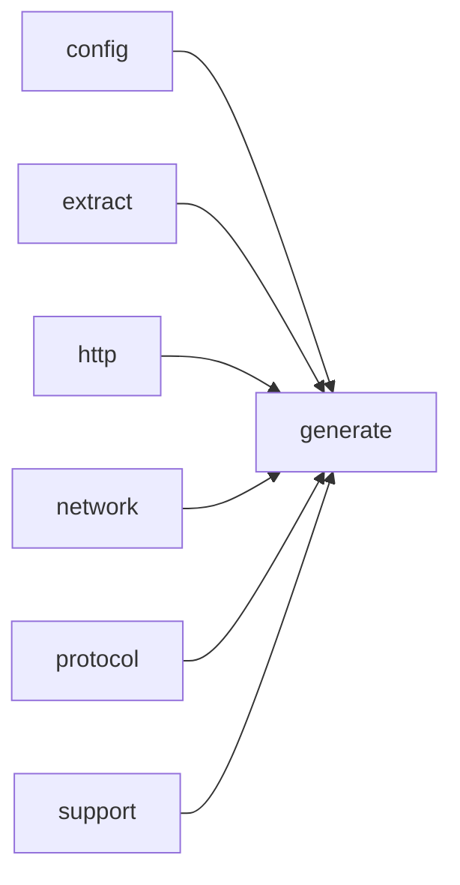

# Module `generate:scheduler`

## Summary

The `generate:scheduler` module orchestrates the end‑to‑end documentation generation pipeline. It is responsible for scheduling and executing all LLM prompt requests (symbol analysis, page prompts), managing work queues and dependency tracking, handling caching and retries, and coordinating the rendering and writing of generated pages. The module owns the central `PageGenerationScheduler` class along with supporting infrastructure: the `WorkQueue` for task management, the `DependencyTracker` for tracking page and symbol analysis readiness, and the `PageRenderer` for final output. Public scope also includes entry‑point functions such as `request_llm_async`, `prepare_generation_context`, `build_evidence_for_request`, `build_directory_index_pages`, and `render_generated_pages` that tie together the analysis, planning, evidence, and markdown submodules to produce the final documentation output.

## Imports

- [`config`](../config/index.md)
- [`extract`](../extract/index.md)
- [`generate:analysis`](analysis.md)
- [`generate:cache`](cache.md)
- [`generate:diagram`](diagram.md)
- [`generate:dryrun`](dryrun.md)
- [`generate:evidence`](evidence.md)
- [`generate:markdown`](markdown.md)
- [`generate:model`](model.md)
- [`generate:page`](page.md)
- [`generate:planner`](planner.md)
- [`generate:symbol`](symbol.md)
- [`http`](../http/index.md)
- [`network`](../network/index.md)
- [`protocol`](../protocol/index.md)
- `std`
- [`support`](../support/index.md)

## Dependency Diagram

## Internal Structure

The `generate:scheduler` module is the central orchestrator of the documentation generation pipeline. It imports nearly every other module in the generate subsystem—`planner`, `model`, `page`, `symbol`, `analysis`, `evidence`, `markdown`, `cache`, `diagram`, `dryrun`, as well as `http`, `network`, `protocol`, `config`, `extract`, and `support`—and is responsible for decomposing page plans into concrete LLM prompt work, managing prompt dependencies, and emitting final rendered pages. Internally, the module is layered into several distinct subsystems: `PageGenerationScheduler` owns the high-level run loop and coordinates the lifecycle of all work; `DependencyTracker` models per‑page states and tracks which prompts must complete (symbol analyses, page prompts) before a page is ready; `WorkQueue` provides a thread‑safe work pool with deferred and immediate enqueue operations; and `PageRenderer` writes completed page content to disk (or simulates it in dry‑run mode). Supporting types such as `PreparedPrompt`, `PreparedSymbolAnalysisTarget`, `PageState`, and `SymbolAnalysisWork` capture the inputs, metadata, and results for each unit of work.

Implementation structure follows a clear phase-oriented pattern: preparation (building `PreparedGenerationContext` and `PreparedSymbolAnalyses`), scheduling (queueing symbol‑analysis and page‑prompt tasks), execution (worker tasks that invoke the LLM via `request_llm_async`, interpret responses, and feed results back into the dependency tracker), and finalization (rendering pages once all dependencies are satisfied). The scheduler also integrates caching (`cache_index_`), dry‑run estimation, and error‑recovery mechanisms (consecutive failure thresholds, retry limits). This decomposition keeps prompt generation, dependency resolution, and output rendering decoupled while still allowing the scheduler to orchestrate the entire generation process from plans to written files.

## Related Pages

- [Module config](../config/index.md)
- [Module extract](../extract/index.md)
- [Module generate:analysis](analysis.md)
- [Module generate:cache](cache.md)
- [Module generate:diagram](diagram.md)
- [Module generate:dryrun](dryrun.md)
- [Module generate:evidence](evidence.md)
- [Module generate:markdown](markdown.md)
- [Module generate:model](model.md)
- [Module generate:page](page.md)
- [Module generate:planner](planner.md)
- [Module generate:symbol](symbol.md)
- [Module http](../http/index.md)
- [Module network](../network/index.md)
- [Module protocol](../protocol/index.md)
- [Module support](../support/index.md)

