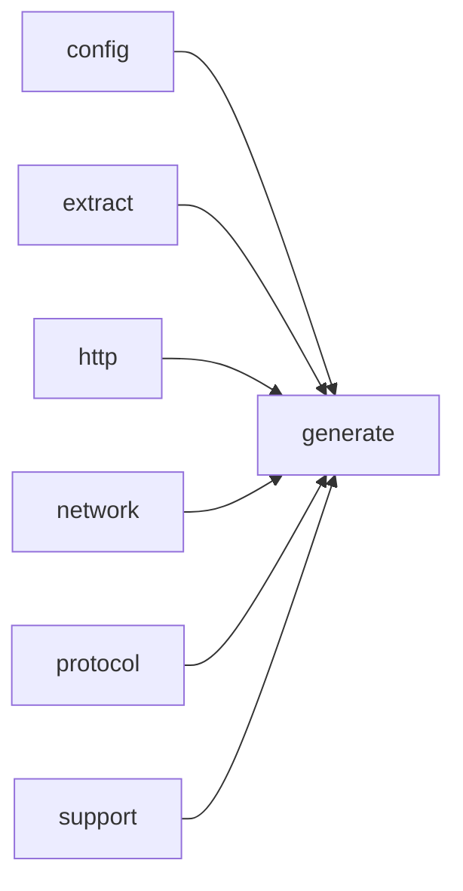

# Module `generate:scheduler`

## Summary

The `generate:scheduler` module orchestrates the end‑to‑end execution of the documentation generation pipeline. It owns the central scheduling logic that prepares generation contexts from project models and configuration, manages dependency‑driven work flows for both per‑symbol analyses and full‑page prompts, and drives asynchronous LLM requests. Internally, it maintains a work queue with deferred enqueuing, a dependency tracker to determine when pages become ready to render, and a page renderer that produces final Markdown output. The module also handles caching of prompt responses, failure tracking with retry limits, and coordination of dry‑run page generation.

The public interface includes the main `PageGenerationScheduler` class with its `run` entry point and worker task mechanism, factory functions such as `prepare_generation_context` and `build_directory_index_pages`, and helper utilities for prompt caching identity, error construction, and page summary collection. It exposes the complete scheduling, execution, and output lifecycle for the generation pipeline while encapsulating concurrency control, rate limiting, and persistent cache interaction.

## Imports

- [`config`](../config/index.md)
- [`extract`](../extract/index.md)
- [`generate:analysis`](analysis.md)
- [`generate:cache`](cache.md)
- [`generate:diagram`](diagram.md)
- [`generate:dryrun`](dryrun.md)
- [`generate:evidence`](evidence.md)
- [`generate:markdown`](markdown.md)
- [`generate:model`](model.md)
- [`generate:page`](page.md)
- [`generate:planner`](planner.md)
- [`generate:symbol`](symbol.md)
- [`http`](../http/index.md)
- [`network`](../network/index.md)
- [`protocol`](../protocol/index.md)
- `std`
- [`support`](../support/index.md)

## Dependency Diagram

## Internal Structure

The `generate:scheduler` module orchestrates the documentation generation pipeline by decomposing the workload into three phases: symbol analysis, page prompt completion, and page rendering. It defines internal types such as `PreparedGenerationContext`, `DependencyTracker`, `WorkQueue`, and `PageRenderer` to manage concurrency, track inter-page dependencies, and coordinate asynchronous LLM requests. The central `PageGenerationScheduler` class owns the event loop, work queue, and renderer, and exposes entry points like `run`, `submit_after_symbol_analysis`, and `try_submit_ready_pages` to drive generation step by step.

Internally, the module imports broadly from the generation stack — including `generate:analysis`, `generate:cache`, `generate:diagram`, `generate:markdown`, `generate:page`, `generate:planner`, and `generate:symbol` — as well as from `http`, `network`, and `protocol` for LLM communication. Implementation is confined to a single module partition (`scheduler.cppm`) and uses an anonymous namespace to encapsulate private data structures, helper functions (e.g., `deduplicate_prompt_requests`, `wrap_prompt_output_for_embed`, `extract_summary_from_prompt_output`), and the `WorkerActivity` RAII guard. This layering ensures that scheduling logic remains decoupled from the specifics of prompt construction, caching, and rendering, while still retaining full control over generation ordering and failure handling.

## Related Pages

- [Module config](../config/index.md)
- [Module extract](../extract/index.md)
- [Module generate:analysis](analysis.md)
- [Module generate:cache](cache.md)
- [Module generate:diagram](diagram.md)
- [Module generate:dryrun](dryrun.md)
- [Module generate:evidence](evidence.md)
- [Module generate:markdown](markdown.md)
- [Module generate:model](model.md)
- [Module generate:page](page.md)
- [Module generate:planner](planner.md)
- [Module generate:symbol](symbol.md)
- [Module http](../http/index.md)
- [Module network](../network/index.md)
- [Module protocol](../protocol/index.md)
- [Module support](../support/index.md)

