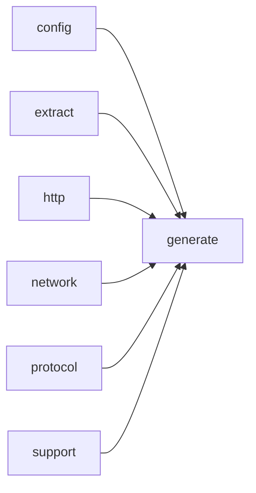

# Module `generate:scheduler`

## Summary

The `generate:scheduler` module orchestrates the asynchronous documentation generation pipeline. It manages the scheduling and execution of LLM prompt requests, tracks inter‑page and symbol dependencies, handles caching and retry logic, and coordinates the rendering of final output pages. The public‑facing scope centers on the `PageGenerationScheduler` class, which owns the work queue, dependency tracker, page renderer, and worker lifecycle, along with supporting types such as `DependencyTracker`, `WorkQueue`, `PageRenderer`, and the various work‑item structs used to drive prompt analysis and page production.

## Imports

- [`config`](../config/index.md)
- [`extract`](../extract/index.md)
- [`generate:analysis`](analysis.md)
- [`generate:cache`](cache.md)
- [`generate:diagram`](diagram.md)
- [`generate:dryrun`](dryrun.md)
- [`generate:evidence`](evidence.md)
- [`generate:markdown`](markdown.md)
- [`generate:model`](model.md)
- [`generate:page`](page.md)
- [`generate:planner`](planner.md)
- [`generate:symbol`](symbol.md)
- [`http`](../http/index.md)
- [`network`](../network/index.md)
- [`protocol`](../protocol/index.md)
- [`support`](../support/index.md)

## Dependency Diagram

```mermaid
graph LR
    M0["generate"]
    I0["config"]
    I0 --> M0
    I1["extract"]
    I1 --> M0
    I2["http"]
    I2 --> M0
    I3["network"]
    I3 --> M0
    I4["protocol"]
    I4 --> M0
    I5["support"]
    I5 --> M0
```

## Internal Structure

The `generate:scheduler` module orchestrates the entire documentation generation pipeline. It imports lower‑level generation modules (`generate:analysis`, `generate:cache`, `generate:diagram`, `generate:dryrun`, `generate:evidence`, `generate:markdown`, `generate:model`, `generate:page`, `generate:planner`, `generate:symbol`), alongside `config`, `extract`, `http`, `network`, `protocol`, and `support`. The module is implemented as a single translation unit with internal linkage helpers and a main orchestrator class `PageGenerationScheduler`. Its internal decomposition includes `DependencyTracker` for managing page dependency graphs and readiness, `WorkQueue` with deferred and immediate queues for concurrency‑safe task scheduling, `PageRenderer` for output accumulation and dry‑run support, and several lightweight value types (`PageState`, `PreparedPrompt`, `SymbolAnalysisWork`, `PagePromptWork`, etc.). The scheduler splits work into symbol‑analysis tasks and page‑prompt tasks, tracks progress via counters and caches, enforces retry limits, and coordinates a pool of worker activities that dequeue from the work queue. Free functions in the internal namespace handle context preparation, symbol enumeration, prompt deduplication, directory‑index construction, and evidence packaging. The overall structure is a single‑module design where `PageGenerationScheduler` acts as the top‑level state machine, owning the tracker, work queue, renderer, and analysis state, and exposing a single public `run()` method.

## Related Pages

- [Module config](../config/index.md)
- [Module extract](../extract/index.md)
- [Module generate:analysis](analysis.md)
- [Module generate:cache](cache.md)
- [Module generate:diagram](diagram.md)
- [Module generate:dryrun](dryrun.md)
- [Module generate:evidence](evidence.md)
- [Module generate:markdown](markdown.md)
- [Module generate:model](model.md)
- [Module generate:page](page.md)
- [Module generate:planner](planner.md)
- [Module generate:symbol](symbol.md)
- [Module http](../http/index.md)
- [Module network](../network/index.md)
- [Module protocol](../protocol/index.md)
- [Module support](../support/index.md)

