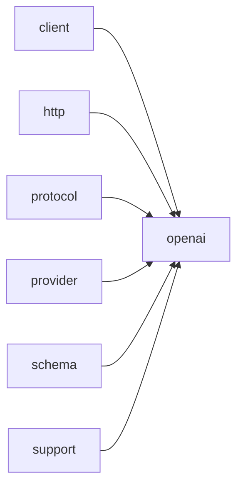

# Module `openai`

## Summary

The `openai` module implements the `OpenAI`-specific protocol within the `clore::net` framework. It owns the public async API functions `call_completion_async`, `call_llm_async`, and `call_structured_async`, each of which initiates an asynchronous request to an `OpenAI`-compatible endpoint and returns an integer handle for tracking or cancellation. The module also comprises internal protocol detail helpers for building request JSON, serializing messages, tool definitions, tool choices, and response formats, as well as parsing response content, tool calls, and validating requests. These helpers reside in the `clore::net::openai::protocol::detail` namespace and are not intended for direct use by application code.

The public implementation scope further includes the `clore::net::openai::detail::Protocol` struct with methods such as `build_url`, `build_headers`, `build_request_json`, `parse_response`, `read_environment`, `provider_name`, and `capability_probe_key`. These methods encapsulate the provider-specific networking and authentication logic, reading environment variables for API keys and base `URLs`, and constructing the appropriate HTTP requests and response parsers for `OpenAI`. The module depends on the `client`, `http`, `protocol`, `provider`, `schema`, `std`, and `support` modules, leveraging their generic abstractions while supplying the `OpenAI`-specific serialization and validation logic.

## Imports

- [`client`](../client/index.md)
- [`http`](../http/index.md)
- [`protocol`](../protocol/index.md)
- [`provider`](../provider/index.md)
- [`schema`](../schema/index.md)
- `std`
- [`support`](../support/index.md)

## Dependency Diagram



## Types

### `clore::net::openai::detail::Protocol`

Declaration: `network/openai.cppm:692`

Definition: `network/openai.cppm:692`

Declaration: [`Namespace clore::net::openai::detail`](../../namespaces/clore/net/openai/detail/index.md)

The struct `clore::net::openai::detail::Protocol` is a purely static policy class that encapsulates the `OpenAI`-specific wire protocol for LLM completions. No instances are created; every member function is `static`. Its internal structure consists of a set of stateless functions that each handle one facet of protocol interaction: `read_environment` reads credentials from environment variables (`OPENAI_BASE_URL`, `OPENAI_API_KEY`), `build_url` appends the standard `chat/completions` path to the base URL, `build_headers` sets the `Content-Type` and `Authorization` (Bearer) headers, and `build_request_json` delegates to a generic builder. The `parse_response` member enforces an invariant: a non-empty body with an HTTP status below 400; if the body is empty or the status is >= 400, it returns an `std::unexpected` with a descriptive `LLMError`. The `capability_probe_key` member composes a probe key from `provider_name`, the API base, and the model, enabling the framework to distinguish capabilities across different endpoints. Together, these members form a cohesive protocol adapter with no shared mutable state.

#### Invariants

- All member functions are `static`; there is no instance state.
- Environment configuration is derived solely from environment variables at call time.
- HTTP request construction assumes a JSON-based chat completions endpoint.
- Response parsing delegates error handling for empty bodies and HTTP error codes.

#### Key Members

- `read_environment`
- `build_url`
- `build_headers`
- `build_request_json`
- `parse_response`
- `provider_name`
- `capability_probe_key`

#### Usage Patterns

- Used as a concrete policy in higher-level code that dispatches to provider-specific networking logic.
- `build_url`, `build_headers`, `build_request_json`, and `parse_response` are called in sequence to perform a chat completion request.
- `provider_name` and `capability_probe_key` are used to cache or distinguish capabilities per model and base URL.

#### Member Functions

##### `clore::net::openai::detail::Protocol::build_headers`

Declaration: `network/openai.cppm:705`

Definition: `network/openai.cppm:705`

Declaration: [`Namespace clore::net::openai::detail`](../../namespaces/clore/net/openai/detail/index.md)

###### Implementation

```cpp
static auto build_headers(const clore::net::detail::EnvironmentConfig& environment)
        -> std::vector<kota::http::header> {
        return std::vector<kota::http::header>{
            kota::http::header{
                               .name = "Content-Type",
                               .value = "application/json; charset=utf-8",
                               },
            kota::http::header{
                               .name = "Authorization",
                               .value = std::format("Bearer {}", environment.api_key),
                               },
        };
    }
```

##### `clore::net::openai::detail::Protocol::build_request_json`

Declaration: `network/openai.cppm:719`

Definition: `network/openai.cppm:719`

Declaration: [`Namespace clore::net::openai::detail`](../../namespaces/clore/net/openai/detail/index.md)

###### Implementation

```cpp
static auto build_request_json(const CompletionRequest& request)
        -> std::expected<std::string, LLMError> {
        return clore::net::protocol::build_request_json(request);
    }
```

##### `clore::net::openai::detail::Protocol::build_url`

Declaration: `network/openai.cppm:701`

Definition: `network/openai.cppm:701`

Declaration: [`Namespace clore::net::openai::detail`](../../namespaces/clore/net/openai/detail/index.md)

###### Implementation

```cpp
static auto build_url(const clore::net::detail::EnvironmentConfig& environment) -> std::string {
        return clore::net::detail::append_url_path(environment.api_base, "chat/completions");
    }
```

##### `clore::net::openai::detail::Protocol::capability_probe_key`

Declaration: `network/openai.cppm:743`

Definition: `network/openai.cppm:743`

Declaration: [`Namespace clore::net::openai::detail`](../../namespaces/clore/net/openai/detail/index.md)

###### Implementation

```cpp
static auto capability_probe_key(const clore::net::detail::EnvironmentConfig& environment,
                                     const CompletionRequest& request) -> std::string {
        return clore::net::make_capability_probe_key(provider_name(),
                                                     environment.api_base,
                                                     request.model);
    }
```

##### `clore::net::openai::detail::Protocol::parse_response`

Declaration: `network/openai.cppm:724`

Definition: `network/openai.cppm:724`

Declaration: [`Namespace clore::net::openai::detail`](../../namespaces/clore/net/openai/detail/index.md)

###### Implementation

```cpp
static auto parse_response(const clore::net::detail::RawHttpResponse& raw_response)
        -> std::expected<CompletionResponse, LLMError> {
        if(raw_response.body.empty()) {
            return std::unexpected(LLMError("empty response from LLM"));
        }
        if(raw_response.http_status >= 400) {
            return std::unexpected(
                LLMError(std::format("LLM request failed with HTTP {}: {}",
                                     raw_response.http_status,
                                     clore::net::detail::excerpt_for_error(raw_response.body))));
        }

        return clore::net::protocol::parse_response(raw_response.body);
    }
```

##### `clore::net::openai::detail::Protocol::provider_name`

Declaration: `network/openai.cppm:739`

Definition: `network/openai.cppm:739`

Declaration: [`Namespace clore::net::openai::detail`](../../namespaces/clore/net/openai/detail/index.md)

###### Implementation

```cpp
static auto provider_name() -> std::string_view {
        return "LLM";
    }
```

##### `clore::net::openai::detail::Protocol::read_environment`

Declaration: `network/openai.cppm:693`

Definition: `network/openai.cppm:693`

Declaration: [`Namespace clore::net::openai::detail`](../../namespaces/clore/net/openai/detail/index.md)

###### Implementation

```cpp
static auto read_environment()
        -> std::expected<clore::net::detail::EnvironmentConfig, LLMError> {
        return clore::net::detail::read_credentials(clore::net::detail::CredentialEnv{
            .base_url_env = "OPENAI_BASE_URL",
            .api_key_env = "OPENAI_API_KEY",
        });
    }
```

## Functions

### `clore::net::openai::call_completion_async`

Declaration: `network/openai.cppm:755`

Definition: `network/openai.cppm:782`

Declaration: [`Namespace clore::net::openai`](../../namespaces/clore/net/openai/index.md)

The function first constructs a generic completion call by forwarding the request and event loop to `clore::net::call_completion_async<detail::Protocol>`. This template specialisation handles provider‑specific wiring: it relies on the `detail::Protocol` struct to implement `build_url`, `build_headers`, `build_request_json`, and `parse_response`. During execution the protocol reads the environment (via `read_environment`), validates the request (using `protocol::detail::validate_request`), and assembles the JSON payload through helper functions like `serialize_message`, `serialize_tool_choice`, and `serialize_response_format`. After the HTTP call completes, `parse_response` extracts the top‑level structure, iterates over choices, and for each choice dispatches to `parse_content_parts` and `parse_tool_calls` to reconstruct the final `CompletionResponse`. Any error is captured and returned via `.or_fail()`, ensuring the coroutine meets its expected task signature.

#### Side Effects

- Initiates an asynchronous HTTP request to an `OpenAI` completion endpoint
- Schedules and manages asynchronous work via the provided `kota::event_loop`

#### Reads From

- `CompletionRequest` parameter (moved into callee)
- `kota::event_loop&` parameter (for scheduling and I/O context)
- `detail::Protocol` template parameter (type-level configuration)

#### Usage Patterns

- Used to asynchronously request a text completion from an `OpenAI` model
- Called when integrating with an event loop for concurrent or non-blocking LLM inference

### `clore::net::openai::call_llm_async`

Declaration: `network/openai.cppm:759`

Definition: `network/openai.cppm:789`

Declaration: [`Namespace clore::net::openai`](../../namespaces/clore/net/openai/index.md)

This function is a thin coroutine adapter that delegates the `OpenAI` LLM call to the generic `clore::net::call_llm_async` template, parameterized with `clore::net::openai::detail::Protocol`. The internal control flow consists of a single `co_await` on the returned task, followed by `.or_fail()` to unwrap the result or propagate the error. All substantive logic—model routing, request construction, response parsing, and protocol-specific handling—resides in the template function and its associated helper types, such as `clore::net::openai::detail::Protocol` methods (`build_request_json`, `build_headers`, `build_url`, `parse_response`, `read_environment`, `provider_name`, `capability_probe_key`) and the supporting functions in `clore::net::openai::protocol` and `clore::net::openai::protocol::detail`. The key dependency is the generic `clore::net::call_llm_async` template, which this function instantiates with the `OpenAI` protocol layer.

#### Side Effects

- moves the request argument via `std::move`
- performs network I/O

#### Reads From

- model
- `system_prompt`
- request
- loop

#### Usage Patterns

- called with model identifier, system prompt, prompt request, and event loop
- returns a task that resolves to a string or `LLMError`

### `clore::net::openai::call_llm_async`

Declaration: `network/openai.cppm:765`

Definition: `network/openai.cppm:800`

Declaration: [`Namespace clore::net::openai`](../../namespaces/clore/net/openai/index.md)

The function `clore::net::openai::call_llm_async` is a thin wrapper that delegates to `clore::net::call_llm_async<detail::Protocol>`. Its implementation consists solely of a `co_return co_await` expression that invokes the generic template with the same four arguments (`model`, `system_prompt`, `prompt`, and a pointer to `loop`) and then calls `.or_fail()` to turn the result into the expected coroutine type. The actual algorithm and control flow reside in the parametric function; `detail::Protocol` provides the concrete network and serialization logic, including `build_url`, `build_request_json`, `build_headers`, `parse_response`, `read_environment`, and `capability_probe_key` methods. Dependencies include the `kota::event_loop` for asynchronous execution, `kota::task` for the coroutine return type, and `LLMError` for error reporting.

#### Side Effects

- Performs asynchronous network I/O to call the LLM
- Schedules work on the provided `kota::event_loop`
- May allocate coroutine frame and other async task resources

#### Reads From

- `model` parameter
- `system_prompt` parameter
- `prompt` parameter
- `loop` parameter (event loop state)

#### Writes To

- Returns a `kota::task` that eventually writes the LLM response string to the caller
- May modify internal state of the event loop

#### Usage Patterns

- Asynchronously invoke an LLM model with a system prompt and user prompt
- Integrate with `kota::event_loop` for non-blocking operation
- Wrap lower-level LLM call with error handling via `.or_fail()`

### `clore::net::openai::call_structured_async`

Declaration: `network/openai.cppm:772`

Definition: `network/openai.cppm:812`

Declaration: [`Namespace clore::net::openai`](../../namespaces/clore/net/openai/index.md)

The function `clore::net::openai::call_structured_async` is a thin template wrapper that delegates to `clore::net::call_structured_async`, passing the protocol type `clore::net::openai::detail::Protocol` along with the `model`, `system_prompt`, `prompt`, and a pointer to the `kota::event_loop`. Internally, the generic implementation constructs a JSON request by calling `clore::net::openai::detail::Protocol::build_request_json`, which uses helper functions such as `clore::net::openai::protocol::detail::serialize_response_format` to embed the requested JSON schema as a structured output format and `clore::net::openai::protocol::detail::serialize_tool_definition` to define a single tool that enforces the schema. The HTTP request is sent asynchronously via `call_llm_async`, and the raw response is parsed by the protocol's `parse_response` method. The parser inspects the `choices` array, extracts `message` content and potential tool calls, validates the finish reason, and returns the parsed structured arguments as the requested type `T`. The `.or_fail()` call at the end propagates any `LLMError` that occurs during the process.

#### Side Effects

- initiates an asynchronous HTTP request to the `OpenAI` API
- creates a coroutine state that may dynamically allocate memory
- interacts with the provided event loop for scheduling completion callbacks

#### Reads From

- `model`: `std::string_view`
- `system_prompt`: `std::string_view`
- `prompt`: `std::string_view`
- `loop`: `kota::event_loop&`

#### Writes To

- the return value of type `kota::task<T, LLMError>` representing a future result
- the coroutine's internal promise object (as part of the task lifecycle)

#### Usage Patterns

- used to request structured output from an `OpenAI` model asynchronously
- called by higher-level functions when a typed response is required from the language model

### `clore::net::openai::protocol::detail::parse_content_parts`

Declaration: `network/openai.cppm:288`

Definition: `network/openai.cppm:288`

Declaration: [`Namespace clore::net::openai::protocol::detail`](../../namespaces/clore/net/openai/protocol/detail/index.md)

The function `clore::net::openai::protocol::detail::parse_content_parts` iterates over the given `json::Array` of content parts, extracting `text` and `refusal` content into an `AssistantOutput` result. For each value, it expects a JSON object, reads the `type` field (defaulting to `"text"`), and dispatches accordingly: a `"refusal"` part appends its `refusal` string and sets a flag; a `"text"` or `"output_text"` part expects a `text` field that is either a direct string or an object containing a `value` string, appending the text and setting a flag; any other type is silently skipped. After the loop, the function populates `output.text` or `output.refusal` only if the corresponding flag was set. The function depends on `clore::net::detail::expect_object` and `clore::net::detail::expect_string` for structured validation and error reporting, and returns `std::expected<AssistantOutput, LLMError>` to propagate descriptive errors when a required field is missing or malformed.

#### Side Effects

No observable side effects are evident from the extracted code.

#### Reads From

- `const json::Array& parts` parameter
- JSON object fields via `part->get("type")`, `part->get("refusal")`, `part->get("text")`, `text_object->get("value")`
- Helper functions `clore::net::detail::expect_object` and `clore::net::detail::expect_string`

#### Usage Patterns

- Called to deserialize the content field from an `OpenAI` chat completion response
- Used in protocol layer to convert JSON content array into structured `AssistantOutput`
- Part of the `clore::net::openai::protocol::detail` parsing pipeline

### `clore::net::openai::protocol::detail::parse_tool_calls`

Declaration: `network/openai.cppm:369`

Definition: `network/openai.cppm:369`

Declaration: [`Namespace clore::net::openai::protocol::detail`](../../namespaces/clore/net/openai/protocol/detail/index.md)

The function iterates over each element of the input `json::Array`, expecting each to be a JSON object. It extracts and validates the `id`, `type`, and `function` sub-object sequentially, using `clore::net::detail::expect_object` and `clore::net::detail::expect_string` for both existence and type checks. Duplicate `id` values are detected via an internal `std::unordered_set<std::string>`, and any repetition causes an early failure. The `type` field must equal the literal `"function"`; otherwise, an error is returned. From the `function` object, both `name` and `arguments` are extracted as strings, and the `arguments` string is further parsed into a `json::Value` using `json::parse`. Each successfully validated tool call is accumulated into a `std::vector<ToolCall>`. The function returns the complete vector on success, or an `LLMError` on the first encountered validation or parsing failure.

#### Side Effects

No observable side effects are evident from the extracted code.

#### Reads From

- the `calls` parameter (a `const json::Array &`)
- JSON object fields `id`, `type`, `function`, `function.name`, `function.arguments` within each array element

#### Usage Patterns

- parse tool calls from a chat completion response
- extract and validate tool call objects from a raw JSON array
- convert JSON tool call representation to structured `ToolCall` instances

### `clore::net::openai::protocol::detail::serialize_message`

Declaration: `network/openai.cppm:27`

Definition: `network/openai.cppm:27`

Declaration: [`Namespace clore::net::openai::protocol::detail`](../../namespaces/clore/net/openai/protocol/detail/index.md)

The function `clore::net::openai::protocol::detail::serialize_message` converts a single `Message` variant into a JSON object and appends it to the provided output `json::Array`. It begins by creating a new empty JSON object via `clore::net::detail::make_empty_object`. The core logic dispatches on the concrete message type using `std::visit`. For `SystemMessage`, `UserMessage`, and `AssistantMessage`, it inserts a `"role"` string and normalizes the message content with `clore::net::detail::normalize_utf8` before inserting it as the `"content"` field via `clore::net::detail::insert_string_field`. The `AssistantToolCallMessage` case optionally writes the `content` field if present, then iterates over its tool calls to build a nested structure: each tool call adds an `id` and `type` (`"function"`) to a call object, plus a `function` sub‑object containing `name` and `arguments` (normalized from `tool_call.arguments_json`). All these call objects are collected into a `"tool_calls"` array. The `ToolResultMessage` case inserts `"role"`, `"tool_call_id"`, and normalized `"content"`. Every JSON operation uses error‑returning helpers; any failure propagates as `std::unexpected` immediately. On success, the completed object is moved into the output array with `out.push_back`. The function depends on the `Message` variant types, the `clore::net::detail` namespace for JSON creation and string insertion, and the `LLMError` type for error reporting.

#### Side Effects

- Modifies output array `out` by appending a JSON object
- Allocates memory for JSON objects and strings via helper functions
- Moves temporary objects into the output array
- Calls `clore::net::detail::normalize_utf8` which may allocate new strings
- Calls `clore::net::detail::insert_string_field` which may modify the JSON object

#### Reads From

- The `message` parameter of type `const Message&`
- Accesses fields: `.content`, `.tool_calls`, `.tool_call_id`, `.id`, `.name`, `.arguments_json`, `.has_value()`

#### Writes To

- Output parameter `out` of type `json::Array&`
- Temporary JSON objects and arrays that are moved into `out`

#### Usage Patterns

- Used to convert a single message into JSON for inclusion in an `OpenAI` API request payload
- Called during serialization of a conversation history to a JSON array of messages

### `clore::net::openai::protocol::detail::serialize_response_format`

Declaration: `network/openai.cppm:209`

Definition: `network/openai.cppm:209`

Declaration: [`Namespace clore::net::openai::protocol::detail`](../../namespaces/clore/net/openai/protocol/detail/index.md)

The function `clore::net::openai::protocol::detail::serialize_response_format` serializes a `ResponseFormat` object into a provided `json::Object` `root` under the key `"response_format"`. It begins by creating two empty JSON objects via helper `clore::net::detail::make_empty_object`: one for the top-level response format object and one for its optional schema. If either allocation fails, the error is propagated. The core branch depends on whether `format.schema` contains a value. If it does not, the format type is set to `"json_object"`. If a schema is present, the type becomes `"json_schema"`, and the function populates the schema object with the `"name"` (via `clore::net::detail::insert_string_field`), the `"strict"` flag from `format.strict`, and a deep copy of the schema itself using `clore::net::detail::clone_object`. This schema object is then embedded into the response format object under `"json_schema"`. Finally, the completed object is inserted into `root`. Every insertion or helper call that may fail returns a `std::expected` – any failure causes an immediate early return with the corresponding `LLMError`, making the entire serialization a sequence of guarded steps with no retry logic.

#### Side Effects

- mutates the `root` JSON object by inserting the `response_format` key
- allocates and mutates temporary JSON objects via insert and move operations

#### Reads From

- the `format` parameter (fields `schema`, `name`, `strict`)
- the dereferenced `format.schema` for cloning

#### Writes To

- the `root` JSON object (key `response_format`)
- temporary JSON objects created within the function

#### Usage Patterns

- called during construction of an `OpenAI` chat completion request containing a response format
- invoked within the protocol serialization pipeline for request building

### `clore::net::openai::protocol::detail::serialize_tool_choice`

Declaration: `network/openai.cppm:167`

Definition: `network/openai.cppm:167`

Declaration: [`Namespace clore::net::openai::protocol::detail`](../../namespaces/clore/net/openai/protocol/detail/index.md)

The function employs `std::visit` on the `ToolChoice` variant to dispatch based on the concrete tool‑choice type. Inside the visitor, compile‑time type inspection via `if constexpr` branches for the three predefined modes: `ToolChoiceAuto`, `ToolChoiceRequired`, and `ToolChoiceNone` each cause a simple string insertion (`"auto"`, `"required"`, `"none"`) into the root JSON object under the key `"tool_choice"`. The fallback case handles a forced tool choice by constructing a nested JSON object: it first creates an empty object using `clore::net::detail::make_empty_object` (which can produce an error), sets its `"type"` to `"function"`, then uses `clore::net::detail::insert_string_field` to add the function’s `"name"` from the variant’s `name` member. The resulting function object is moved into the outer `"function"` field, and the whole structure is inserted as the `"tool_choice"` value. Every step that may fail propagates the error via `std::expected<void, LLMError>`, returning an error immediately if any intermediate operation fails.

#### Side Effects

- Mutates the `root` JSON object by inserting the `"tool_choice"` key with a string or object value.
- Allocates temporary JSON objects via `clore::net::detail::make_empty_object` and moves them into `root`.
- May produce an error (side effect of propagating failures) via `std::unexpected`.

#### Reads From

- Parameter `choice` (a `ToolChoice` variant)
- Field `current.name` (string view) from the forced tool choice case

#### Writes To

- The `root` JSON object (via `insert`)
- Temporary `object` and `function_object` JSON objects (subsequently moved into `root`)

#### Usage Patterns

- Used during serialization of `OpenAI` chat completion requests to encode the `tool_choice` field.
- Called by higher-level serialization functions that build the JSON payload.

### `clore::net::openai::protocol::detail::serialize_tool_definition`

Declaration: `network/openai.cppm:248`

Definition: `network/openai.cppm:248`

Declaration: [`Namespace clore::net::openai::protocol::detail`](../../namespaces/clore/net/openai/protocol/detail/index.md)

The function builds a JSON representation of a single tool definition by first creating a top-level JSON object via `clore::net::detail::make_empty_object`. It sets the `"type"` key to the literal `"function"`, then constructs a nested function object. Inside the function object it inserts the `"name"` and `"description"` string fields using `clore::net::detail::insert_string_field`, and clones the `tool.parameters` object via `clore::net::detail::clone_object` before inserting it. The `strict` boolean is set directly. Each JSON mutation is guarded by error‑propagation via the `std::expected` monad: if any sub‑operation fails, the function immediately returns `std::unexpected` with the propagated `LLMError`. On success, the completed tool object is appended to the output `tools` array. The implementation depends solely on the internal JSON utility functions and the `FunctionToolDefinition` structure, with no external service calls.

#### Side Effects

- modifies the `tools` array by appending a new tool definition object
- allocates and writes temporary JSON objects via `make_empty_object` and `clone_object`

#### Reads From

- `tool.name`
- `tool.description`
- `tool.parameters`
- `tool.strict`
- `tools` reference (array to append to)

#### Writes To

- `tools` (the `json::Array` passed by reference) – appended object
- local `object` and `function_object` (constructed and then moved into `tools`)

#### Usage Patterns

- called during serialization of a list of tool definitions in an `OpenAI` API request
- used by functions that construct the request body before sending to the API

### `clore::net::openai::protocol::detail::validate_request`

Declaration: `network/openai.cppm:23`

Definition: `network/openai.cppm:23`

Declaration: [`Namespace clore::net::openai::protocol::detail`](../../namespaces/clore/net/openai/protocol/detail/index.md)

The function `clore::net::openai::protocol::detail::validate_request` is implemented as a thin delegation wrapper around `clore::net::detail::validate_completion_request`. It forwards the `request` parameter and passes two boolean literals `true` and `true`, which enable both structural and semantic validation checks. This design centralizes the core validation logic in a shared helper, ensuring that the `OpenAI` protocol layer applies the same strict constraint enforcement (e.g., required fields, value ranges, and allowed combinations) as other protocol implementations. The function returns a `std::expected<void, LLMError>`, propagating any validation failure from the common validation routine without introducing additional logic or branching.

#### Side Effects

No observable side effects are evident from the extracted code.

#### Reads From

- `request` parameter (const `CompletionRequest`&)

#### Usage Patterns

- Called to validate a completion request before using it in a protocol operation

### `clore::net::protocol::build_request_json`

Declaration: `network/openai.cppm:457`

Definition: `network/openai.cppm:465`

Declaration: [`Namespace clore::net::protocol`](../../namespaces/clore/net/protocol/index.md)

The function begins by delegating validation to `openai::protocol::detail::validate_request`, returning an error immediately if the request is invalid. It then constructs a JSON root object and an empty messages array using `clore::net::detail::make_empty_object` and `make_empty_array`. The `model` field is inserted directly. Each message in `request.messages` is serialized into the array via `openai::protocol::detail::serialize_message`. Optional request components are conditionally appended: `response_format` via `serialize_response_format`, `tools` via `serialize_tool_definition` for each tool, and `tool_choice` via `serialize_tool_choice`. A `parallel_tool_calls` boolean, if present, is inserted directly. Finally, the root object is serialized to a JSON string using `kota::codec::json::to_string`, and the string is returned. All serialization steps propagate errors back through `std::expected`.

#### Side Effects

- Allocates and populates JSON objects and arrays
- Serializes a composite JSON structure to a string
- Moves ownership of intermediate JSON containers

#### Reads From

- `request` parameter and its fields (`model`, `messages`, `response_format`, `tools`, `tool_choice`, `parallel_tool_calls`)
- `openai::protocol::detail::validate_request`
- `openai::protocol::detail::serialize_message`
- `openai::protocol::detail::serialize_response_format`
- `openai::protocol::detail::serialize_tool_definition`
- `openai::protocol::detail::serialize_tool_choice`

#### Writes To

- Local variables `validation`, `root`, `messages`, `tools`, `response_format`, `tool_choice`, `encoded`
- Returned `std::string` (or error state in `LLMError`)

#### Usage Patterns

- Serializing a `CompletionRequest` into a JSON string for network transmission
- Building the request payload for an `OpenAI` API call

### `clore::net::protocol::parse_response`

Declaration: `network/openai.cppm:459`

Definition: `network/openai.cppm:532`

Declaration: [`Namespace clore::net::protocol`](../../namespaces/clore/net/protocol/index.md)

The function begins by parsing the input `json_text` into a `json::Object` via `kota::codec::json::parse`. If parsing fails, it immediately returns an `LLMError`. It then checks for an `"error"` key in the root object; if present, it extracts the `"error.message"` string and returns an error. Next, it retrieves the required top-level fields `"id"`, `"model"`, and `"choices"`, using `clore::net::detail` helper functions to validate and extract each value. If any required field is missing or malformed, the function returns an error.

The first element of the `"choices"` array is examined. Its `"finish_reason"` is checked: values `"length"` and `"content_filter"` cause early errors, while `"stop"` and `"tool_calls"` are accepted; any other value is rejected. The function then processes the `"message"` object inside the choice: it looks for `"refusal"`, `"content"` (which may be a string or an array of content parts, or null), and `"tool_calls"`. Content parts are parsed via `openai::protocol::detail::parse_content_parts`, and tool calls via `openai::protocol::detail::parse_tool_calls`. After extraction, consistency checks are performed—for example, `"tool_calls"` with `finish_reason == "stop"` or an empty tool calls array with `finish_reason == "tool_calls"` both produce errors. Finally, the function assembles a `CompletionResponse` containing the extracted `id`, `model`, `AssistantOutput` (with text, refusal, and tool calls), and the raw JSON string, returning it on success.

#### Side Effects

No observable side effects are evident from the extracted code.

#### Reads From

- `json_text` parameter
- parsed `kota::codec::json::Object` from `kota::codec::json::parse`

#### Usage Patterns

- parsing an LLM API JSON response
- extracting a `CompletionResponse` from raw response text
- validating response structure and error conditions

## Internal Structure

The `openai` module is decomposed into three layers: a `protocol::detail` namespace containing low-level serialization and parsing helpers (e.g., `serialize_message`, `serialize_tool_choice`, `parse_content_parts`, `validate_request`); a `detail` namespace that provides the `Protocol` struct – a concrete adapter implementing the provider‑specific interface (with methods like `build_request_json`, `parse_response`, `read_environment`); and a set of public async entry points (`call_completion_async`, `call_llm_async`, `call_structured_async`) that orchestrate requests using the `Protocol` adapter and a `kota::event_loop`.

The module imports `client`, `http`, `protocol`, `provider`, `schema`, `support`, and `std`. The `client` and `http` modules supply the asynchronous execution framework and raw HTTP networking; `protocol` provides the abstract request/response types; `provider` and `schema` handle authentication, URL construction, and JSON schema generation; `support` delivers foundational utilities. Internally, the `Protocol` struct translates between the generic `protocol` types and `OpenAI`‑specific JSON wire format by delegating to the `protocol::detail` functions, while the top‑level async functions bind the lifecycle and error handling.

## Related Pages

- [Module client](../client/index.md)
- [Module http](../http/index.md)
- [Module protocol](../protocol/index.md)
- [Module provider](../provider/index.md)
- [Module schema](../schema/index.md)
- [Module support](../support/index.md)

