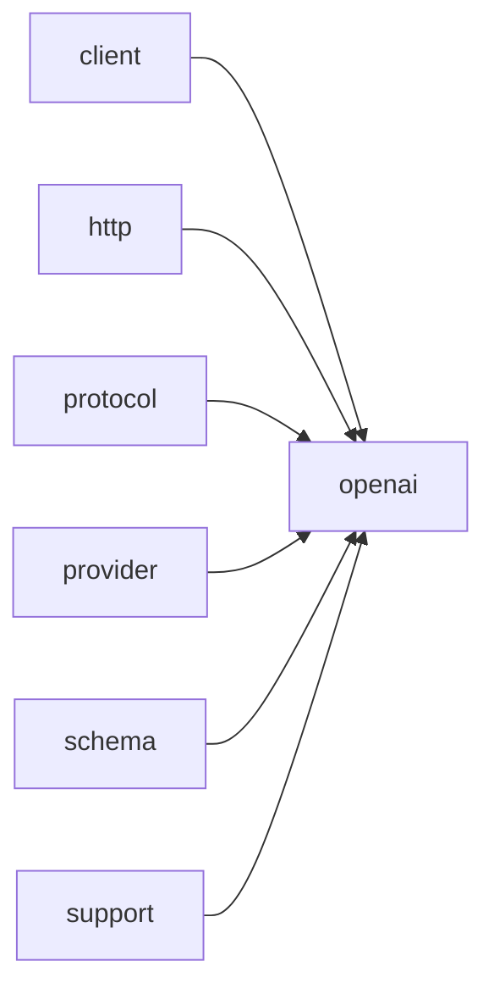

# Module `openai`

## Summary

The `openai` module implements the `OpenAI`-specific protocol layer within the networking framework. It owns the public async calling functions (`call_completion_async`, `call_llm_async`, and the templated `call_structured_async`) that initiate requests to `OpenAI`-compatible LLM endpoints, returning integer handles for tracking or cancellation. Internally, the module provides the `detail::Protocol` struct responsible for reading environment credentials, building request `URLs`, headers, and JSON payloads, as well as parsing responses—including tool calls, content parts, and structured output formats.

On the protocol side, the module exposes serialization and validation helpers under `clore::net::openai::protocol::detail`, such as `serialize_message`, `serialize_tool_choice`, `serialize_tool_definition`, `serialize_response_format`, `validate_request`, and parsing functions like `parse_content_parts` and `parse_tool_calls`. These functions form the public-facing implementation scope for constructing and interpreting `OpenAI` API requests and responses, ensuring type-safe and correct communication with the service.

## Imports

- [`client`](../client/index.md)
- [`http`](../http/index.md)
- [`protocol`](../protocol/index.md)
- [`provider`](../provider/index.md)
- [`schema`](../schema/index.md)
- `std`
- [`support`](../support/index.md)

## Dependency Diagram



## Types

### `clore::net::openai::detail::Protocol`

Declaration: `network/openai.cppm:692`

Definition: `network/openai.cppm:692`

Declaration: [`Namespace clore::net::openai::detail`](../../namespaces/clore/net/openai/detail/index.md)

The struct `clore::net::openai::detail::Protocol` is a stateless protocol adapter that encapsulates all `OpenAI`-specific HTTP interactions. All member functions are `static`, and the struct holds no data; it simply composes lower-level utilities from `clore::net::detail` and `clore::net::protocol`. The central invariant is that `read_environment` must succeed before any request-building functions are called, as they depend on the returned `clore::net::detail::EnvironmentConfig`. `build_url` appends `"chat/completions"` to the configured API base, while `build_headers` sets `"Content-Type"` and `"Authorization"` using the API key. `build_request_json` delegates to `clore::net::protocol::build_request_json`, and `parse_response` validates the raw HTTP response: it rejects empty bodies or status codes >=400 with descriptive `LLMError` values, then delegates successful responses to `clore::net::protocol::parse_response`. The `provider_name` returns `"LLM"` as a fixed string view.

#### Invariants

- All member functions are static and constexpr-compatible on compilers supporting constexpr `std::string`?
- No mutable state is held by the struct.
- Environment variables `OPENAI_BASE_URL` and `OPENAI_API_KEY` must be set for `read_environment` to succeed.
- `build_request_json` and `parse_response` rely on external protocol utilities.

#### Key Members

- `read_environment`
- `build_url`
- `build_headers`
- `build_request_json`
- `parse_response`
- `provider_name`

#### Usage Patterns

- Called by a client to obtain environment configuration for constructing HTTP requests.
- `build_url` and `build_headers` are used to prepare the HTTP request.
- `build_request_json` serializes a `CompletionRequest` to JSON.
- `parse_response` deserializes the HTTP response body into `CompletionResponse`.
- `provider_name` is used for logging or identification.

#### Member Functions

##### `clore::net::openai::detail::Protocol::build_headers`

Declaration: `network/openai.cppm:705`

Definition: `network/openai.cppm:705`

Declaration: [`Namespace clore::net::openai::detail`](../../namespaces/clore/net/openai/detail/index.md)

###### Implementation

```cpp
static auto build_headers(const clore::net::detail::EnvironmentConfig& environment)
        -> std::vector<kota::http::header> {
        return std::vector<kota::http::header>{
            kota::http::header{
                               .name = "Content-Type",
                               .value = "application/json; charset=utf-8",
                               },
            kota::http::header{
                               .name = "Authorization",
                               .value = std::format("Bearer {}", environment.api_key),
                               },
        };
    }
```

##### `clore::net::openai::detail::Protocol::build_request_json`

Declaration: `network/openai.cppm:719`

Definition: `network/openai.cppm:719`

Declaration: [`Namespace clore::net::openai::detail`](../../namespaces/clore/net/openai/detail/index.md)

###### Implementation

```cpp
static auto build_request_json(const CompletionRequest& request)
        -> std::expected<std::string, LLMError> {
        return clore::net::protocol::build_request_json(request);
    }
```

##### `clore::net::openai::detail::Protocol::build_url`

Declaration: `network/openai.cppm:701`

Definition: `network/openai.cppm:701`

Declaration: [`Namespace clore::net::openai::detail`](../../namespaces/clore/net/openai/detail/index.md)

###### Implementation

```cpp
static auto build_url(const clore::net::detail::EnvironmentConfig& environment) -> std::string {
        return clore::net::detail::append_url_path(environment.api_base, "chat/completions");
    }
```

##### `clore::net::openai::detail::Protocol::parse_response`

Declaration: `network/openai.cppm:724`

Definition: `network/openai.cppm:724`

Declaration: [`Namespace clore::net::openai::detail`](../../namespaces/clore/net/openai/detail/index.md)

###### Implementation

```cpp
static auto parse_response(const clore::net::detail::RawHttpResponse& raw_response)
        -> std::expected<CompletionResponse, LLMError> {
        if(raw_response.body.empty()) {
            return std::unexpected(LLMError("empty response from LLM"));
        }
        if(raw_response.http_status >= 400) {
            return std::unexpected(
                LLMError(std::format("LLM request failed with HTTP {}: {}",
                                     raw_response.http_status,
                                     clore::net::detail::excerpt_for_error(raw_response.body))));
        }

        return clore::net::protocol::parse_response(raw_response.body);
    }
```

##### `clore::net::openai::detail::Protocol::provider_name`

Declaration: `network/openai.cppm:739`

Definition: `network/openai.cppm:739`

Declaration: [`Namespace clore::net::openai::detail`](../../namespaces/clore/net/openai/detail/index.md)

###### Implementation

```cpp
static auto provider_name() -> std::string_view {
        return "LLM";
    }
```

##### `clore::net::openai::detail::Protocol::read_environment`

Declaration: `network/openai.cppm:693`

Definition: `network/openai.cppm:693`

Declaration: [`Namespace clore::net::openai::detail`](../../namespaces/clore/net/openai/detail/index.md)

###### Implementation

```cpp
static auto read_environment()
        -> std::expected<clore::net::detail::EnvironmentConfig, LLMError> {
        return clore::net::detail::read_credentials(clore::net::detail::CredentialEnv{
            .base_url_env = "OPENAI_BASE_URL",
            .api_key_env = "OPENAI_API_KEY",
        });
    }
```

## Functions

### `clore::net::openai::call_completion_async`

Declaration: `network/openai.cppm:748`

Definition: `network/openai.cppm:775`

Declaration: [`Namespace clore::net::openai`](../../namespaces/clore/net/openai/index.md)

The implementation of `clore::net::openai::call_completion_async` serves as a thin delegation layer that invokes the generic `clore::net::call_completion_async` template, explicitly instantiating it with `clore::net::openai::detail::Protocol`. The function moves the incoming `CompletionRequest` and passes a pointer to the provided `kota::event_loop`, then applies `.or_fail()` on the returned coroutine task to convert any failure into a `kota::task<CompletionResponse, LLMError>`. No additional logic, validation, or transformation is performed at this level; all protocol‑specific behavior (URL construction, header building, JSON serialization, and response parsing) is delegated to the `detail::Protocol` class and its associated free functions in `clore::net::openai::protocol` and `clore::net::openai::protocol::detail`.

#### Side Effects

- performs an asynchronous network request to a completion API

#### Reads From

- `request` parameter of type `CompletionRequest`
- `loop` parameter of type `kota::event_loop&`
- network state via `clore::net::call_completion_async`

#### Usage Patterns

- called with a `CompletionRequest` and an event loop reference
- typically `co_await`ed within another coroutine

### `clore::net::openai::call_llm_async`

Declaration: `network/openai.cppm:752`

Definition: `network/openai.cppm:782`

Declaration: [`Namespace clore::net::openai`](../../namespaces/clore/net/openai/index.md)

The implementation is a thin coroutine wrapper that delegates to the generic template `clore::net::call_llm_async` instantiated with `clore::net::openai::detail::Protocol`. After awaiting the generic call, it invokes `.or_fail()` to convert the outcome into a `kota::task<std::string, LLMError>`. All request construction, HTTP transport, and response parsing are handled by the generic pipeline, which uses `detail::Protocol` for `OpenAI`-specific URL building, header creation, JSON serialization, and response deserialization.

#### Side Effects

- Initiates an asynchronous LLM request (network I/O)
- Schedules a coroutine or callback on the event loop

#### Reads From

- `model` parameter
- `system_prompt` parameter
- `request` (int) parameter
- `loop` (event loop) parameter

#### Usage Patterns

- Called with a model name, system prompt, integer parameter, and event loop to start an async LLM call
- Used to submit a request to an LLM endpoint asynchronously

### `clore::net::openai::call_llm_async`

Declaration: `network/openai.cppm:758`

Definition: `network/openai.cppm:793`

Declaration: [`Namespace clore::net::openai`](../../namespaces/clore/net/openai/index.md)

The function `clore::net::openai::call_llm_async` is a thin async adapter that delegates to the generic templated `clore::net::call_llm_async<detail::Protocol>`. It passes the `model`, `system_prompt`, and `prompt` string arguments directly, and provides a pointer to the `kota::event_loop` obtained from the reference. The inner call returns a `kota::task<std::string, LLMError>`; the `.or_fail()` member is called to transform the outcome into a coroutine that resumes with the result string or throws the `LLMError` on failure. The underlying implementation relies on the `detail::Protocol` class, which encapsulates `OpenAI`‑specific request building (via `Protocol::build_url`, `Protocol::build_request_json`, and `Protocol::build_headers`), response parsing (`Protocol::parse_response`), and environment reading (`Protocol::read_environment`). The protocol‑specific logic further uses helpers from `clore::net::openai::protocol::detail` to serialize messages, tool definitions, and tool choices, and to parse tool calls and content parts from the JSON response.

#### Side Effects

- Initiates an asynchronous HTTP request to an LLM API endpoint, sending the provided prompts and model identifier, and receiving a response. This involves observable I/O as a side effect.

#### Reads From

- model
- `system_prompt`
- prompt
- loop

#### Writes To

- network socket
- response buffer (internal)

#### Usage Patterns

- Used to invoke large language models asynchronously in a coroutine context
- Commonly called from other async functions that compose LLM calls

### `clore::net::openai::call_structured_async`

Declaration: `network/openai.cppm:765`

Definition: `network/openai.cppm:805`

Declaration: [`Namespace clore::net::openai`](../../namespaces/clore/net/openai/index.md)

This implementation is a thin coroutine wrapper that delegates all protocol-specific logic to the generic function template `clore::net::call_structured_async<detail::Protocol, T>`, passing through the `model`, `system_prompt`, `prompt`, and a pointer to the `loop`. Control flow begins by entering a `co_await` on the generic call, which internally uses `detail::Protocol` to build the request URL (via `Protocol::build_url`), construct the JSON body (via `Protocol::build_request_json`), and assemble HTTP headers (via `Protocol::build_headers`). After the network round trip, the generic function invokes `Protocol::parse_response` to deserialize the JSON response and extract the structured type `T`, handling error objects and tool-call parsing through helpers like `clore::net::openai::protocol::detail::parse_tool_calls` and `validate_request`. The `.or_fail()` call converts any expected failure (e.g., `LLMError`) into a thrown exception or immediate error, so the caller receives either a valid `T` or an error. Dependencies include the protocol infrastructure (`detail::Protocol`, its nested types and free functions), the JSON utilities in `clore::net::openai::protocol::detail`, and the generic `call_structured_async` template that orchestrates the execution lifecycle.

#### Side Effects

- Initiates an asynchronous network request to an `OpenAI`-compatible API via the underlying `clore::net::call_structured_async` function
- Allocates a coroutine frame for the async operation

#### Reads From

- `std::string_view model`
- `std::string_view system_prompt`
- `std::string_view prompt`
- `kota::event_loop& loop`

#### Writes To

- Returns a `kota::task<T, LLMError>` that will eventually contain the structured result or error

#### Usage Patterns

- Used to obtain structured outputs from an `OpenAI` language model in an asynchronous context
- Called from other coroutines that require structured data from LLM completions

### `clore::net::openai::protocol::detail::parse_content_parts`

Declaration: `network/openai.cppm:288`

Definition: `network/openai.cppm:288`

Declaration: [`Namespace clore::net::openai::protocol::detail`](../../namespaces/clore/net/openai/protocol/detail/index.md)

The function `clore::net::openai::protocol::detail::parse_content_parts` iterates over a `json::Array` of content parts, extracting plain text and refusal content into a single `AssistantOutput`. For each element, it validates the structure using `clore::net::detail::expect_object` and reads the `"type"` field (defaulting to `"text"`). Parts with type `"refusal"` require a `"refusal"` string field, which is appended to a local `refusal` accumulator; a `saw_refusal` flag is set. Parts with type `"text"` or `"output_text"` look for a `"text"` payload—either a direct string or an object containing a `"value"` string—and append it to a `text` accumulator, setting `saw_text`. Other types are silently skipped. After processing all elements, the function assigns the accumulated strings to `output.text` and `output.refusal` only if their respective flags were set, then returns the assembled `AssistantOutput`. Dependencies include `clore::net::detail::expect_object` and `clore::net::detail::expect_string` for JSON validation, and the function returns `std::expected<AssistantOutput, LLMError>`.

#### Side Effects

No observable side effects are evident from the extracted code.

#### Reads From

- the `const json::Array& parts` parameter
- nested JSON objects and strings accessed via `part->get()` and `text_object->get()`

#### Writes To

- the returned `std::expected<AssistantOutput, LLMError>` object

#### Usage Patterns

- Called to parse the `content` array of an assistant message in the `OpenAI` protocol
- Used within message deserialization to convert raw JSON into domain types

### `clore::net::openai::protocol::detail::parse_tool_calls`

Declaration: `network/openai.cppm:369`

Definition: `network/openai.cppm:369`

Declaration: [`Namespace clore::net::openai::protocol::detail`](../../namespaces/clore/net/openai/protocol/detail/index.md)

The function iterates over each element of the input `calls` JSON array. For each element, it first validates that the element is a JSON object using `clore::net::detail::expect_object`. It then extracts the `id` field, ensures it is a non-empty string via `clore::net::detail::expect_string`, and checks for duplicate ids using a local `std::unordered_set<std::string>`; any duplicate causes an immediate `std::unexpected` error. Next, the `type` field is extracted and must equal the string `"function"`; otherwise an unsupported-type error is returned. From the `function` object the `name` and `arguments` fields are retrieved: `name` is taken as a plain string, while `arguments` must be a string that is then parsed into a `json::Value` via `json::parse`. If any required field is missing or fails its type check, the function returns `std::unexpected` with an `LLMError` describing the problem. On success, a `ToolCall` struct is populated with `id`, `name`, the raw `arguments_json` string, and the parsed `arguments` JSON value, and appended to the result vector. After processing all elements, the vector is returned as a success value. The implementation relies on `clore::net::detail::expect_object` and `expect_string` for safe typed field access, and on `json::parse` for converting the arguments string into a structured JSON value.

#### Side Effects

No observable side effects are evident from the extracted code.

#### Reads From

- input `const json::Array& calls` parameter

#### Writes To

- local `std::vector<ToolCall> parsed_calls`
- return value in `std::expected`

#### Usage Patterns

- parse tool calls from `OpenAI` API response
- deserialize tool call array in protocol layer

### `clore::net::openai::protocol::detail::serialize_message`

Declaration: `network/openai.cppm:27`

Definition: `network/openai.cppm:27`

Declaration: [`Namespace clore::net::openai::protocol::detail`](../../namespaces/clore/net/openai/protocol/detail/index.md)

The function `clore::net::openai::protocol::detail::serialize_message` uses `std::visit` to dispatch over the variant-based `Message` type. For each concrete message variant (`SystemMessage`, `UserMessage`, `AssistantMessage`, `AssistantToolCallMessage`, or `ToolResultMessage`), it constructs a JSON object by setting the `"role"` field, inserting UTF‑8‑normalized content via `clore::net::detail::insert_string_field`, and, for `AssistantToolCallMessage`, iterating over `tool_calls` to build nested `"function"` objects with `"name"` and `"arguments"`. The completed object is appended to the output `json::Array`. All JSON creation and field insertion is guarded by `clore::net::detail::make_empty_object` and `clore::net::detail::insert_string_field`; any failure causes an early return of `std::unexpected` with an `LLMError`. Error propagation is uniform across all branches through the `std::expected<void, LLMError>` return type.

#### Side Effects

- mutates output array `out`
- allocates memory for JSON objects and strings

#### Reads From

- `message` parameter
- message fields: `content`, `tool_calls`, `tool_call_id`, `name`, `arguments_json`

#### Writes To

- output array `out`
- temporary JSON objects that are moved into `out`

#### Usage Patterns

- called during request serialization to convert a `Message` variant to JSON
- used in constructing the messages array for `OpenAI` chat completions API

### `clore::net::openai::protocol::detail::serialize_response_format`

Declaration: `network/openai.cppm:209`

Definition: `network/openai.cppm:209`

Declaration: [`Namespace clore::net::openai::protocol::detail`](../../namespaces/clore/net/openai/protocol/detail/index.md)

The function begins by allocating two empty JSON objects through `clore::net::detail::make_empty_object`—one for the response format and one for its optional schema. Allocation failure is immediately propagated as an `std::unexpected` error. It then inspects `format.schema`: if absent, a simple `"json_object"` type is assigned; if present, the type is set to `"json_schema"` and the function fills the schema object by inserting the `format.name` (using `clore::net::detail::insert_string_field`), the `format.strict` flag, and a cloned copy of the schema content via `clore::net::detail::clone_object`. Every intermediate operation that may fail returns the error via `std::unexpected`. Finally, the constructed response format object is moved into the provided `root` under the key `"response_format"`, and a success value is returned.

#### Side Effects

- Modifies the provided `json::Object& root` by inserting a `response_format` field.
- Allocates memory for JSON objects and clones schema via `make_empty_object` and `clone_object`.

#### Reads From

- `format` parameter (of type `const ResponseFormat&`): reads `format.schema`, `format.name`, `format.strict`.

#### Writes To

- `root` (`json::Object`&): inserts `"response_format"` with the serialized object.
- Local `object` and `schema_object` `json::Object` instances, which are then moved into `root`.

#### Usage Patterns

- Used in request serialization for `OpenAI` API calls.
- Called alongside `serialize_message`, `serialize_tool_choice`, etc. to build a full request body.

### `clore::net::openai::protocol::detail::serialize_tool_choice`

Declaration: `network/openai.cppm:167`

Definition: `network/openai.cppm:167`

Declaration: [`Namespace clore::net::openai::protocol::detail`](../../namespaces/clore/net/openai/protocol/detail/index.md)

The function uses `std::visit` to pattern-match on the `ToolChoice` variant. For the trivial alternatives (`ToolChoiceAuto`, `ToolChoiceRequired`, `ToolChoiceNone`), it directly inserts the corresponding string literal (`"auto"`, `"required"`, or `"none"`) into the output `json::Object` under the key `"tool_choice"` and returns success. The default branch handles a forced tool choice that carries a `name`. It allocates two temporary JSON objects via `clore::net::detail::make_empty_object`, sets `"type": "function"` on the outer object, uses `clore::net::detail::insert_string_field` to write the `name` into a nested function object, and then embeds that function object into the outer object before inserting the complete structure into `root`. Each allocation or insertion can fail; failures are propagated as `std::unexpected<LLMError>` through the returned `std::expected<void, LLMError>`.

#### Side Effects

- Modifies `root` by inserting the `"tool_choice"` key and its corresponding value.
- Creates temporary `json::Object` instances via `clore::net::detail::make_empty_object`.

#### Reads From

- `choice` parameter (a variant)
- `current.name` for forced tool choice

#### Writes To

- `root` (the `json::Object&` parameter)
- Error state in the return value

#### Usage Patterns

- Called during `OpenAI` API request serialization to set the `tool_choice` field.
- Part of the `clore::net::openai::protocol::detail` namespace for protocol implementation.

### `clore::net::openai::protocol::detail::serialize_tool_definition`

Declaration: `network/openai.cppm:248`

Definition: `network/openai.cppm:248`

Declaration: [`Namespace clore::net::openai::protocol::detail`](../../namespaces/clore/net/openai/protocol/detail/index.md)

The function constructs a JSON tool definition object and appends it to the provided `json::Array`. It begins by creating two empty JSON objects using `clore::net::detail::make_empty_object`; if either allocation fails, the function immediately returns `std::unexpected` with the propagated error. The outer object receives a `"type"` field set to `"function"`. Then, using `clore::net::detail::insert_string_field`, the tool’s `name` and `description` are inserted into the inner `function_object`; each insertion is checked and any failure causes an early error return. The tool’s `parameters` are cloned via `clore::net::detail::clone_object`, and both the cloned parameters and the `strict` boolean are placed into the `function_object`. The completed `function_object` is moved into the outer object under the `"function"` key, and the outer object is appended to the array via `push_back`. On success, the function returns an empty `std::expected`.

The implementation depends on several helper utilities from `clore::net::detail`: `make_empty_object` for error-checked object creation, `insert_string_field` for string insertion with error reporting, and `clone_object` to deep‑copy the parameters schema. All error paths propagate through `std::expected` as `LLMError`, ensuring no partial modifications persist in the output array when a step fails.

#### Side Effects

- Appends a new JSON object representing the tool definition to the `tools` array.

#### Reads From

- `tool` parameter: `tool.name`, `tool.description`, `tool.parameters`, `tool.strict`

#### Writes To

- Output parameter `tools` (`json::Array`)

#### Usage Patterns

- Serializes a single tool definition for inclusion in an `OpenAI` API request
- Called by higher-level serialization functions that build the tools array

### `clore::net::openai::protocol::detail::validate_request`

Declaration: `network/openai.cppm:23`

Definition: `network/openai.cppm:23`

Declaration: [`Namespace clore::net::openai::protocol::detail`](../../namespaces/clore/net/openai/protocol/detail/index.md)

The function `clore::net::openai::protocol::detail::validate_request` validates a `CompletionRequest` for the `OpenAI` protocol. Its implementation forwards directly to `clore::net::detail::validate_completion_request(request, true, true)`, enabling both standard request validation and tool-call validation. This design centralizes core validation logic within the `clore::net::detail` namespace, allowing the `OpenAI`-specific layer to reuse it without duplication. The function returns `std::expected<void, LLMError>`, where success indicates the request is well-formed, and failure provides an error description.

The control flow is trivial: no additional checks or processing occur beyond the delegate call. The primary dependency is the shared validation function that inspects field completeness, type correctness, and semantic constraints such as tool call consistency. This ensures that downstream code in the `OpenAI` protocol—such as `build_request_json` or `serialize_message`—receives a valid request before constructing the API payload.

#### Side Effects

No observable side effects are evident from the extracted code.

#### Reads From

- const `CompletionRequest`& request

#### Usage Patterns

- Used to validate a `CompletionRequest` before processing

### `clore::net::protocol::build_request_json`

Declaration: `network/openai.cppm:457`

Definition: `network/openai.cppm:465`

Declaration: [`Namespace clore::net::protocol`](../../namespaces/clore/net/protocol/index.md)

The function first validates the incoming request via `openai::protocol::detail::validate_request`, returning an error immediately if validation fails. It then constructs the top-level JSON object and a messages array using utility helpers from `clore::net::detail`. The request’s `model` is inserted directly into the root, and each message in `request.messages` is serialized by `openai::protocol::detail::serialize_message` and appended to the array. After inserting the messages array, optional fields are handled: if `request.response_format` is present, it is serialized via `openai::protocol::detail::serialize_response_format`; if `request.tools` is non‑empty, a tools array is built using `openai::protocol::detail::serialize_tool_definition` for each tool; similarly, `request.tool_choice` (if set) is serialized via `openai::protocol::detail::serialize_tool_choice`, and `request.parallel_tool_calls` (if set) is inserted directly. Finally, the complete JSON object is converted to a string by `kota::codec::json::to_string`, and any serialization error is wrapped in an `LLMError`. The implementation relies entirely on the `OpenAI`‑protocol detail functions for type‑specific serialization and on `kota`’s JSON library for the final string encoding.

#### Side Effects

No observable side effects are evident from the extracted code.

#### Reads From

- request

#### Writes To

- a JSON string inside the returned expected

#### Usage Patterns

- serializing a completion request to JSON
- preparing data for HTTP request
- converting `CompletionRequest` to JSON string

### `clore::net::protocol::parse_response`

Declaration: `network/openai.cppm:459`

Definition: `network/openai.cppm:532`

Declaration: [`Namespace clore::net::protocol`](../../namespaces/clore/net/protocol/index.md)

The implementation of `clore::net::protocol::parse_response` first parses the incoming `json_text` as a JSON object using `kota::codec::json::parse`. If parsing fails, it returns an `LLMError` describing the parse failure. It then checks for a top-level `"error"` field; if present, it extracts the `"message"` sub-field and returns an `LLMError` with that message, or a generic error if the message is missing. After confirming no error, the function extracts the required `"id"` and `"model"` strings from the root object, failing with descriptive `LLMError` values if either is missing or not a string. It then retrieves the `"choices"` array, ensuring it is non-empty, and focuses on `choices[0]`, from which it obtains the `"finish_reason"` string. The function validates the `finish_reason` against known values: `"length"` and `"content_filter"` are treated as errors, `"stop"` and `"tool_calls"` are accepted, and any other value triggers an unsupported error.

Next, the function extracts the `"message"` object from the first choice. It handles an optional `"refusal"` field (non-null) and the `"content"` field, which may be a plain string, a JSON array of content parts, or null. If content is an array, it delegates to `openai::protocol::detail::parse_content_parts` to separate text and refusal segments. An optional `"tool_calls"` array, if present, is parsed by `openai::protocol::detail::parse_tool_calls`. After extracting these fields, the function enforces consistency: if `finish_reason` is `"tool_calls"` but no tool calls were returned, it returns an error; conversely, if `finish_reason` is `"stop"` but tool calls exist, it also returns an error. Finally, it verifies that at least one of `text`, `refusal`, or `tool_calls` is present before constructing and returning a `CompletionResponse` containing the extracted `id`, `model`, the assembled message (`AssistantOutput`), and the raw JSON string for downstream consumers.

#### Side Effects

No observable side effects are evident from the extracted code.

#### Reads From

- `json_text` parameter
- global JSON parsing library (`kota::codec::json::parse`)

#### Usage Patterns

- Called to parse a raw JSON response from an LLM API endpoint
- Used in the protocol layer to convert HTTP response body to domain object
- Typically invoked by higher-level functions that handle network responses

## Internal Structure

The module `openai` implements the `OpenAI` provider within `clore::net` and is organized into three internal layers: a `protocol::detail` namespace with low-level serialization and parsing functions (e.g., `serialize_message`, `serialize_tool_choice`, `parse_content_parts`, `parse_tool_calls`, `validate_request`, `build_request_json`, and `parse_response`); a `detail` namespace containing the `Protocol` struct, which encapsulates provider-specific concerns such as environment reading, URL/header construction, request JSON building, and response parsing; and a public API layer exposing `call_llm_async`, `call_completion_async`, and the template `call_structured_async`. The module depends on `client`, `http`, `protocol`, `provider`, `schema`, `std`, and `support` modules, leveraging the core networking layer for HTTP dispatch, the protocol types for request/response models, the provider module for credential management, schema generation for structured outputs, and support utilities for JSON and string handling. Internally, the `Protocol` struct orchestrates HTTP interactions through the imported `http` module, while the `protocol::detail` functions handle the conversion between internal representation and `OpenAI`-specific JSON formats, ensuring a clean separation of concerns that facilitates independent testing and future provider additions.

## Related Pages

- [Module client](../client/index.md)
- [Module http](../http/index.md)
- [Module protocol](../protocol/index.md)
- [Module provider](../provider/index.md)
- [Module schema](../schema/index.md)
- [Module support](../support/index.md)

