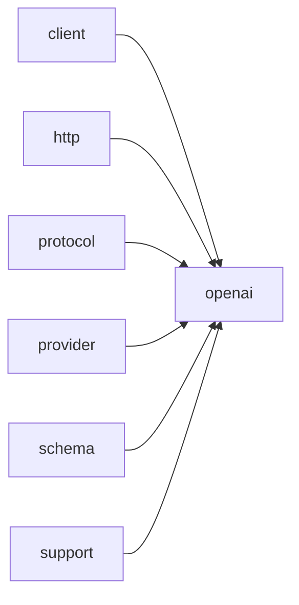

# Module `openai`

## Summary

The `openai` module implements the `OpenAI`-specific protocol for interacting with the API, handling request construction, response parsing, and tool-call serialization within the `clore::net::openai` namespace. It owns the public asynchronous entry points `call_completion_async`, `call_llm_async`, and `call_structured_async`, which accept prompts, model identifiers, and a `kota::event_loop` to drive non-blocking operations, returning integer request handles. The module also provides internal details such as the `Protocol` class (with methods for building `URLs`, headers, and request JSON, as well as parsing responses and probing capabilities) and a set of serialization and validation functions under `clore::net::openai::protocol::detail`. It depends on the `client`, `http`, `protocol`, `provider`, `schema`, and `support` modules to integrate HTTP networking, protocol data types, provider utilities, schema generation, and foundational helpers.

## Imports

- [`client`](../client/index.md)
- [`http`](../http/index.md)
- [`protocol`](../protocol/index.md)
- [`provider`](../provider/index.md)
- [`schema`](../schema/index.md)
- [`support`](../support/index.md)

## Dependency Diagram


```mermaid
graph LR
    M0["openai"]
    I0["client"]
    I0 --> M0
    I1["http"]
    I1 --> M0
    I2["protocol"]
    I2 --> M0
    I3["provider"]
    I3 --> M0
    I4["schema"]
    I4 --> M0
    I5["support"]
    I5 --> M0
```

## Types

### `clore::net::openai::detail::Protocol`

Declaration: `src/network/openai.cppm:702`

Definition: `src/network/openai.cppm:702`

Declaration: [`Namespace clore::net::openai::detail`](../../namespaces/clore/net/openai/detail/index.md)

The struct `clore::net::openai::detail::Protocol` is a concrete protocol implementation providing static member functions for the `OpenAI` chat completions API. It enforces a stateless, functional interface with no mutable state. All public methods return `std::expected` or plain types, propagating errors via `LLMError`. The environment configuration is obtained by `read_environment` using hard‑coded environment variable names `OPENAI_BASE_URL` and `OPENAI_API_KEY`. The invariant is that every call re‑reads credentials; no caching is performed.

Notable internal decisions include the explicit validation in `parse_response`, which checks for empty response bodies and HTTP status codes >= 400, returning a descriptive `LLMError` with an excerpt of the error body. The `build_url` method appends the fixed path `"chat/completions"` to the base URL. The `build_headers` method hard‑codes a `Content-Type` header for JSON and an `Authorization` header using the Bearer scheme, formatting the API key from the environment config. The request/response JSON construction is delegated to common protocol functions (`clore::net::protocol::build_request_json` and `clore::net::protocol::parse_response`). The `capability_probe_key` method builds a deterministic string using `provider_name` (which returns `"LLM"`), the API base URL, and the requested model.

#### Invariants

- Static methods only, no state
- No mutable state
- Requires environment variables set for credential retrieval
- Relies on external protocol functions for request/response serialization

#### Key Members

- `read_environment`
- `build_url`
- `build_headers`
- `build_request_json`
- `parse_response`
- `provider_name`
- `capability_probe_key`

#### Usage Patterns

- Used as a template parameter or policy in generic network code within the `clore::net::openai` namespace
- Called to construct API requests and parse responses for `OpenAI`-compatible endpoints

#### Member Functions

##### `clore::net::openai::detail::Protocol::build_headers`

Declaration: `src/network/openai.cppm:715`

Definition: `src/network/openai.cppm:715`

Declaration: [`Namespace clore::net::openai::detail`](../../namespaces/clore/net/openai/detail/index.md)

###### Implementation

```cpp
static auto build_headers(const clore::net::detail::EnvironmentConfig& environment)
        -> std::vector<kota::http::header> {
        return std::vector<kota::http::header>{
            kota::http::header{
                               .name = "Content-Type",
                               .value = "application/json; charset=utf-8",
                               },
            kota::http::header{
                               .name = "Authorization",
                               .value = std::format("Bearer {}", environment.api_key),
                               },
        };
    }
```

##### `clore::net::openai::detail::Protocol::build_request_json`

Declaration: `src/network/openai.cppm:729`

Definition: `src/network/openai.cppm:729`

Declaration: [`Namespace clore::net::openai::detail`](../../namespaces/clore/net/openai/detail/index.md)

###### Implementation

```cpp
static auto build_request_json(const CompletionRequest& request)
        -> std::expected<std::string, LLMError> {
        return clore::net::protocol::build_request_json(request);
    }
```

##### `clore::net::openai::detail::Protocol::build_url`

Declaration: `src/network/openai.cppm:711`

Definition: `src/network/openai.cppm:711`

Declaration: [`Namespace clore::net::openai::detail`](../../namespaces/clore/net/openai/detail/index.md)

###### Implementation

```cpp
static auto build_url(const clore::net::detail::EnvironmentConfig& environment) -> std::string {
        return clore::net::detail::append_url_path(environment.api_base, "chat/completions");
    }
```

##### `clore::net::openai::detail::Protocol::capability_probe_key`

Declaration: `src/network/openai.cppm:753`

Definition: `src/network/openai.cppm:753`

Declaration: [`Namespace clore::net::openai::detail`](../../namespaces/clore/net/openai/detail/index.md)

###### Implementation

```cpp
static auto capability_probe_key(const clore::net::detail::EnvironmentConfig& environment,
                                     const CompletionRequest& request) -> std::string {
        return clore::net::make_capability_probe_key(provider_name(),
                                                     environment.api_base,
                                                     request.model);
    }
```

##### `clore::net::openai::detail::Protocol::parse_response`

Declaration: `src/network/openai.cppm:734`

Definition: `src/network/openai.cppm:734`

Declaration: [`Namespace clore::net::openai::detail`](../../namespaces/clore/net/openai/detail/index.md)

###### Implementation

```cpp
static auto parse_response(const clore::net::detail::RawHttpResponse& raw_response)
        -> std::expected<CompletionResponse, LLMError> {
        if(raw_response.body.empty()) {
            return std::unexpected(LLMError("empty response from LLM"));
        }
        if(raw_response.http_status >= 400) {
            return std::unexpected(
                LLMError(std::format("LLM request failed with HTTP {}: {}",
                                     raw_response.http_status,
                                     clore::net::detail::excerpt_for_error(raw_response.body))));
        }

        return clore::net::protocol::parse_response(raw_response.body);
    }
```

##### `clore::net::openai::detail::Protocol::provider_name`

Declaration: `src/network/openai.cppm:749`

Definition: `src/network/openai.cppm:749`

Declaration: [`Namespace clore::net::openai::detail`](../../namespaces/clore/net/openai/detail/index.md)

###### Implementation

```cpp
static auto provider_name() -> std::string_view {
        return "LLM";
    }
```

##### `clore::net::openai::detail::Protocol::read_environment`

Declaration: `src/network/openai.cppm:703`

Definition: `src/network/openai.cppm:703`

Declaration: [`Namespace clore::net::openai::detail`](../../namespaces/clore/net/openai/detail/index.md)

###### Implementation

```cpp
static auto read_environment()
        -> std::expected<clore::net::detail::EnvironmentConfig, LLMError> {
        return clore::net::detail::read_credentials(clore::net::detail::CredentialEnv{
            .base_url_env = "OPENAI_BASE_URL",
            .api_key_env = "OPENAI_API_KEY",
        });
    }
```

## Functions

### `clore::net::openai::call_completion_async`

Declaration: `src/network/openai.cppm:765`

Definition: `src/network/openai.cppm:792`

Declaration: [`Namespace clore::net::openai`](../../namespaces/clore/net/openai/index.md)

The implementation of `clore::net::openai::call_completion_async` is a thin wrapper that immediately forwards to the generic template `clore::net::call_completion_async<detail::Protocol>`, passing the `CompletionRequest` and the `kota::event_loop`. The generic function uses `detail::Protocol` which provides a family of protocol-specific methods (`build_url`, `build_headers`, `build_request_json`, and `parse_response`) to construct the HTTP request, send it asynchronously on the given event loop, and parse the JSON response. Within the request‑building phase, helpers from `clore::net::openai::protocol::detail` are employed for tasks such as validation via `validate_request`, serialization of tool definitions and tool choices via `serialize_tool_definition` and `serialize_tool_choice`, and building the messages array. On the response side, the same protocol layer deserializes the JSON payload, extracting choices, tool calls, content parts, and any error information, then returns the result as a `kota::task<CompletionResponse, LLMError>` after calling `or_fail()` to handle error propagation.

#### Side Effects

- Initiates an asynchronous HTTP request to the `OpenAI` completion API via the generic `clore::net::call_completion_async`
- Schedules coroutine continuation on the provided `kota::event_loop`
- Potentially performs network I/O and error handling via `.or_fail()`

#### Reads From

- `CompletionRequest request` (moved into underlying call)
- `kota::event_loop& loop` (reference used for scheduling)
- `detail::Protocol` type used for template specialization

#### Usage Patterns

- Used to asynchronously obtain a `CompletionResponse` for `OpenAI` completions
- Called with a constructed `CompletionRequest` and an event loop
- Part of a family of async `OpenAI` call functions (`call_structured_async`, `call_llm_async`)

### `clore::net::openai::call_llm_async`

Declaration: `src/network/openai.cppm:769`

Definition: `src/network/openai.cppm:799`

Declaration: [`Namespace clore::net::openai`](../../namespaces/clore/net/openai/index.md)

The implementation forwards directly to the generic `clore::net::call_llm_async` template, parameterized with `clore::net::openai::detail::Protocol`. After the underlying coroutine completes, the result is unwrapped by calling `or_fail()`, which transforms the expected `kota::expected` into a `kota::task<std::string, LLMError>` that will throw on error. All input arguments—`model`, `system_prompt`, `request`, and a pointer to the caller’s `kota::event_loop`—are passed through unchanged.

Internally, the function never inspects the request body or constructs HTTP messages; these responsibilities are delegated entirely to the `detail::Protocol` class and the generic networking layer. The only dependency beyond the standard library is the `kota` coroutine framework, used both for the async return type and for the event loop that drives completion. This thin wrapper ensures that all `OpenAI`-specific protocol details (URL building, header construction, JSON serialization/deserialization) remain encapsulated in `detail::Protocol` and its helper namespaces.

#### Side Effects

- Moves the `PromptRequest` argument, leaving it in a valid but unspecified state.
- Allocates a coroutine frame for the `co_await` expression.
- The returned `task` will perform network I/O and allocate resources when awaited.

#### Reads From

- `model`
- `system_prompt`
- `request` (moved from)
- `loop` (reference to obtain pointer)

#### Writes To

- `request` (moved-from state)
- Coroutine frame (implicit allocation)

#### Usage Patterns

- Used to asynchronously call an LLM from within an event-loop-based async context.
- Typically awaited to obtain the model's text response.

### `clore::net::openai::call_llm_async`

Declaration: `src/network/openai.cppm:775`

Definition: `src/network/openai.cppm:810`

Declaration: [`Namespace clore::net::openai`](../../namespaces/clore/net/openai/index.md)

The function is a thin convenience wrapper that delegates entirely to the generic `clore::net::call_llm_async` template, specialized with `clore::net::openai::detail::Protocol`. It passes the provided `model`, `system_prompt`, `prompt`, and a pointer to the `kota::event_loop` to that generic implementation, which handles all protocol‑specific logic including JSON request construction, HTTP interaction, and response parsing. The result is immediately converted into a `kota::task<std::string, LLMError>` via `.or_fail()`, which either yields the response string on success or propagates an `LLMError` on failure. No additional transformation or control flow occurs at this level; the function simply exposes a streamlined, protocol‑specific entry point for the caller.

#### Side Effects

No observable side effects are evident from the extracted code.

#### Reads From

- model
- `system_prompt`
- prompt
- loop
- result of `clore::net::call_llm_async<detail::Protocol>`

#### Usage Patterns

- Entry point for asynchronous LLM calls with default protocol
- Part of overloaded set including `call_structured_async` and `call_completion_async`

### `clore::net::openai::call_structured_async`

Declaration: `src/network/openai.cppm:782`

Definition: `src/network/openai.cppm:822`

Declaration: [`Namespace clore::net::openai`](../../namespaces/clore/net/openai/index.md)

The function `clore::net::openai::call_structured_async` is a thin coroutine wrapper that delegates all work to the generic `clore::net::call_structured_async` instantiated with the `OpenAI` protocol adapter `clore::net::openai::detail::Protocol` and the template parameter `T`. It passes the `model`, `system_prompt`, `prompt`, and a pointer to the `loop` directly to that generic function, then awaits the returned task and unwraps the result via `.or_fail()`. The implementation contains no additional algorithmic logic or control flow beyond this delegation; its role is purely to specialize the generic structured‑calling machinery for the `OpenAI` provider. Dependencies are limited to the protocol adapter and the generic asynchronous call infrastructure.

#### Side Effects

- Performs network I/O via underlying `call_structured_async` implementation
- Allocates coroutine frame for async execution

#### Reads From

- `model` parameter
- `system_prompt` parameter
- `prompt` parameter
- `loop` parameter

#### Writes To

- Returns a `kota::task<T, LLMError>` that eventually contains the result

#### Usage Patterns

- Used in async contexts requiring structured output from an LLM
- Called with a concrete `T` type for type-safe parsing
- Wraps the more general `clore::net::call_structured_async` for `OpenAI`-specific protocol

### `clore::net::openai::protocol::detail::parse_content_parts`

Declaration: `src/network/openai.cppm:298`

Definition: `src/network/openai.cppm:298`

Declaration: [`Namespace clore::net::openai::protocol::detail`](../../namespaces/clore/net/openai/protocol/detail/index.md)

The function iterates over each element of the input `json::Array` and processes it as a content part. For every element it first validates it as a JSON object using `clore::net::detail::expect_object`, returning an error on failure. It then reads the `"type"` field and dispatches accordingly: if the type is `"refusal"`, it extracts the `"refusal"` string field and appends it to a local accumulator, setting a `saw_refusal` flag. For types `"text"` or `"output_text"`, it attempts to extract the `"text"` field; if the text value is a string it is appended directly, otherwise the field must be an object containing a `"value"` string. Any unrecognised type is silently skipped. After processing all parts, the accumulated text and refusal are moved into the `AssistantOutput` result only if their respective `saw_*` flags are `true`. The entire function relies on the `clore::net::detail` validation utilities (`expect_object` and `expect_string`) for structured error propagation and returns `std::expected` to distinguish a successful parse from an `LLMError`.

#### Side Effects

No observable side effects are evident from the extracted code.

#### Reads From

- `parts` parameter (JSON array)
- `clore::net::detail::expect_object` and `expect_string` helpers
- JSON object fields: `type`, `refusal`, `text`, `value`

#### Usage Patterns

- Used internally to convert API response content parts
- Called when processing assistant messages

### `clore::net::openai::protocol::detail::parse_tool_calls`

Declaration: `src/network/openai.cppm:379`

Definition: `src/network/openai.cppm:379`

Declaration: [`Namespace clore::net::openai::protocol::detail`](../../namespaces/clore/net/openai/protocol/detail/index.md)

The function iterates over each element of the input JSON array, treating each as a tool call object. For each element it validates the required top-level fields `id`, `type`, and `function` using `clore::net::detail::expect_object` and `expect_string` helpers. After extracting the `id` as a string, it checks for duplicates by attempting insertion into a local `std::unordered_set<std::string> ids`; a duplicate triggers an immediate error return. The `type` field must equal `"function"`; any other value is rejected. The nested `function` object must contain `name` (a string) and `arguments` (a JSON string). The arguments string is parsed into a `json::Value` via `json::parse`; a parse failure also produces an error. On success, each validated call is emplaced into a `std::vector<ToolCall>` that is returned upon completion.

The function relies entirely on the external validation utilities from `clore::net::detail` and the `json` parsing library. Control flow is strictly sequential with early returns on any missing or malformed field. No retry or fallback logic exists; the first error aborts the entire parse. The `ids` set enforces uniqueness of tool call identifiers, and the final `arguments` value is stored both as its original JSON string and as the parsed `json::Value` for downstream use.

#### Side Effects

No observable side effects are evident from the extracted code.

#### Reads From

- `calls` parameter (`const json::Array &`)
- nested JSON properties via `call->get()` and `function->get()`

#### Writes To

- local `parsed_calls` vector (returned as result)

#### Usage Patterns

- called to convert raw tool call JSON from API responses into structured data

### `clore::net::openai::protocol::detail::serialize_message`

Declaration: `src/network/openai.cppm:37`

Definition: `src/network/openai.cppm:37`

Declaration: [`Namespace clore::net::openai::protocol::detail`](../../namespaces/clore/net/openai/protocol/detail/index.md)

The function `clore::net::openai::protocol::detail::serialize_message` transforms a `Message` variant into a JSON object and appends it to a provided output `json::Array`. It begins by constructing an empty JSON object via `clore::net::detail::make_empty_object`; if allocation fails, the error is immediately returned as an unexpected result. The core of the algorithm is a `std::visit` call on the message, where a generic lambda uses `if constexpr` to dispatch on each concrete message type—`SystemMessage`, `UserMessage`, `AssistantMessage`, `AssistantToolCallMessage`, and `ToolResultMessage`. For all types except `ToolResultMessage`, the visitor sets a `"role"` field (one of `"system"`, `"user"`, or `"assistant"`) and inserts the message’s content using `clore::net::detail::normalize_utf8` followed by `clore::net::detail::insert_string_field`. The `AssistantToolCallMessage` branch handles the optional `content` and also iterates over its `tool_calls` container: for each tool call it creates a nested object with `"id"`, `"type": "function"`, and a `"function"` sub‑object containing `"name"` and `"arguments"` (the arguments are also normalized). The `ToolResultMessage` branch adds `"tool_call_id"` and its own content. After visitation succeeds, the fully populated object is moved into the output array via `push_back`. All intermediate operations propagate errors through the `std::expected` monad, and any failure short‑circuits the entire function.

#### Side Effects

- Modifies the output JSON array `out` by appending a new JSON object
- Allocates memory internally for JSON objects and arrays via `clore::net::detail::make_empty_object` and `clore::net::detail::make_empty_array`
- Potentially modifies error state through `std::expected` propagation

#### Reads From

- `out` (input-output parameter, read only for appending)
- `message` parameter and its fields (`content`, `tool_call_id`, `tool_calls`, `id`, `name`, `arguments_json`)

#### Writes To

- Output JSON array `out` (modified by appending)
- Local JSON objects and arrays created for serialization

#### Usage Patterns

- Called when building the JSON payload for `OpenAI` chat completion requests
- Used within serialization routines for different message types

### `clore::net::openai::protocol::detail::serialize_response_format`

Declaration: `src/network/openai.cppm:219`

Definition: `src/network/openai.cppm:219`

Declaration: [`Namespace clore::net::openai::protocol::detail`](../../namespaces/clore/net/openai/protocol/detail/index.md)

The function constructs a JSON response format object and inserts it into the provided `root` object. It first creates an empty `object` and, if a schema is present, an auxiliary `schema_object`. When `format.schema` is absent, the function sets the `type` field to `"json_object"`; otherwise, it sets `type` to `"json_schema"` and populates the schema sub‑object. The sub‑object is built by inserting `name` (via `clore::net::detail::insert_string_field`), `strict` from `format.strict`, and a cloned copy of `format.schema` (obtained through `clore::net::detail::clone_object`). The assembled `schema_object` is then placed under the key `"json_schema"` inside the main `object`. Finally, the completed `object` is stored in `root` under the key `"response_format"`. Every intermediate JSON creation or insertion failure is propagated as an error, and the function returns `std::expected<void, LLMError>`.

#### Side Effects

- Allocates two temporary JSON objects via `make_empty_object`
- Clones a JSON schema object via `clone_object`
- Modifies the root JSON object by inserting a new key-value pair

#### Reads From

- `format` parameter (its members schema, name, strict)
- `root` parameter (insertion may read existing keys?)

#### Writes To

- `root` parameter (inserts `response_format` object)

#### Usage Patterns

- Called when constructing a request body for `OpenAI` API calls
- Part of serialization pipeline for protocol parameters

### `clore::net::openai::protocol::detail::serialize_tool_choice`

Declaration: `src/network/openai.cppm:177`

Definition: `src/network/openai.cppm:177`

Declaration: [`Namespace clore::net::openai::protocol::detail`](../../namespaces/clore/net/openai/protocol/detail/index.md)

The function uses `std::visit` to dispatch on the `ToolChoice` variant, handling each alternative. For the three predefined choices (`ToolChoiceAuto`, `ToolChoiceRequired`, `ToolChoiceNone`), it directly inserts a string literal ("auto", "required", or "none") into the JSON object under the key `"tool_choice"`. For the forced tool choice (the remaining branch), it first calls `clore::net::detail::make_empty_object` to allocate both an outer object and an inner function object; if either allocation fails, the error is propagated via `std::unexpected`. It then sets the outer object's `"type"` to `"function"` and, using `clore::net::detail::insert_string_field`, places the tool’s name into the inner object under the key `"name"`. The inner object is moved into the outer object under `"function"`, and the outer object replaces `"tool_choice"` in `root`. Any intermediate failure returns an `LLMError` embedded in the `std::expected` result.

#### Side Effects

- Modifies the `json::Object& root` by inserting fields (`tool_choice` with string or nested object).
- Allocates temporary `json::Object` instances via `make_empty_object` (likely heap allocation).

#### Reads From

- Parameter `const ToolChoice& choice` (variant value and potentially `current.name`).

#### Writes To

- Reference parameter `json::Object& root` (mutated via `insert` calls).
- Temporary `json::Object` objects created by `make_empty_object` (moved into `root`).

#### Usage Patterns

- Called during serialization of an `OpenAI` chat completion request to set the `tool_choice` field.
- Part of `detail` namespace serialization utilities for protocol handling.

### `clore::net::openai::protocol::detail::serialize_tool_definition`

Declaration: `src/network/openai.cppm:258`

Definition: `src/network/openai.cppm:258`

Declaration: [`Namespace clore::net::openai::protocol::detail`](../../namespaces/clore/net/openai/protocol/detail/index.md)

The function constructs a single tool definition in JSON format and appends it to the provided `tools` array. It begins by creating two empty JSON objects via `clore::net::detail::make_empty_object`: one for the top-level tool (`object`) and one for the embedded function descriptor (`function_object`). If either allocation fails, the function returns `std::unexpected` with the propagated error. It then inserts the string `"function"` as the `"type"` field into `object`. Next, it serializes the tool’s `name` and `description` into `function_object` using `clore::net::detail::insert_string_field`, checking each result and returning early on failure. The `parameters` field is populated by cloning the tool’s parameter schema via `clore::net::detail::clone_object`, and the `strict` boolean is inserted directly. After assembling the `function_object`, it is moved into `object` under the `"function"` key. Finally, the completed `object` is moved into `tools` via `push_back`. The entire process is governed by `std::expected` error propagation, relying on helper functions from the `clore::net::detail` namespace for low-level JSON operations.

#### Side Effects

- Appends a new JSON object to the `tools` output array
- Allocates memory for JSON objects
- Clones the `tool.parameters` object

#### Reads From

- `tool` parameter: `name`, `description`, `parameters`, `strict`
- Error messages from `clore::net::detail::make_empty_object`, `insert_string_field`, and `clone_object`

#### Writes To

- `tools` array (by pushing a new element)

#### Usage Patterns

- Called when constructing the JSON payload for an `OpenAI` chat request that includes tool definitions
- Used in serialization pipelines for `OpenAI` protocol

### `clore::net::openai::protocol::detail::validate_request`

Declaration: `src/network/openai.cppm:33`

Definition: `src/network/openai.cppm:33`

Declaration: [`Namespace clore::net::openai::protocol::detail`](../../namespaces/clore/net/openai/protocol/detail/index.md)

The function `clore::net::openai::protocol::detail::validate_request` is a thin wrapper that delegates all validation logic to `clore::net::detail::validate_completion_request`. It passes the incoming `CompletionRequest` along with two fixed boolean arguments that likely enable structural and semantic checks specific to `OpenAI` protocol requests. The control flow is a single delegation call, ensuring that request validation follows the same centralised path used elsewhere in the codebase, while keeping the `OpenAI`‑specific entry point distinct.

#### Side Effects

No observable side effects are evident from the extracted code.

#### Reads From

- const `CompletionRequest`& request

#### Usage Patterns

- called to validate a completion request before further processing in the `OpenAI` protocol layer

### `clore::net::protocol::build_request_json`

Declaration: `src/network/openai.cppm:467`

Definition: `src/network/openai.cppm:475`

Declaration: [`Namespace clore::net::protocol`](../../namespaces/clore/net/protocol/index.md)

The function first invokes `openai::protocol::detail::validate_request` on the input `CompletionRequest`; if validation fails, it immediately returns the resulting error.  A root JSON object and a messages array are then created via `clore::net::detail::make_empty_object` and `clore::net::detail::make_empty_array`, with early return on allocation failure.  The request’s `model` is inserted into the root, and each message in `request.messages` is serialized into the array using `openai::protocol::detail::serialize_message`.  After inserting the messages array, the function conditionally serializes `request.response_format` via `serialize_response_format`, any tools via `serialize_tool_definition`, and the `tool_choice` via `serialize_tool_choice`; each serialization step checks for success and propagates errors.  A `parallel_tool_calls` boolean, if present, is inserted directly.  Finally, the assembled JSON object is encoded to a string with `kota::codec::json::to_string`; a failure there produces an `LLMError` indicating serialization failure.  The resulting string is returned on success.  The algorithm relies throughout on a chain of detail‑level serializers and allocation helpers, all returning `std::expected` to propagate errors without exceptions.

#### Side Effects

- allocates memory for the returned JSON string

#### Reads From

- `CompletionRequest` parameter 'request'
- request`.model`
- request`.messages`
- request`.response_format`
- request`.tools`
- request`.tool_choice`
- request`.parallel_tool_calls`

#### Writes To

- returned `std::string` containing JSON

#### Usage Patterns

- called by higher-level networking functions to build request payloads
- used in the `OpenAI` protocol implementation to convert request objects to JSON strings

### `clore::net::protocol::parse_response`

Declaration: `src/network/openai.cppm:469`

Definition: `src/network/openai.cppm:542`

Declaration: [`Namespace clore::net::protocol`](../../namespaces/clore/net/protocol/index.md)

The function `clore::net::protocol::parse_response` parses a raw JSON string from an LLM API into a `CompletionResponse`. Internally, it first validates the JSON structure using `kota::codec::json::parse` and checks for top‑level errors. It then extracts the mandatory fields `id`, `model`, and the `choices` array, taking the first choice. The algorithm validates the `finish_reason` string against known values (e.g., `"stop"`, `"tool_calls"`) and returns an error for truncated or filtered responses. From the first choice’s `message` object, it conditionally extracts `refusal`, `content` (which may be a plain string, a content‑parts array parsed via `openai::protocol::detail::parse_content_parts`, or null), and `tool_calls` (parsed via `openai::protocol::detail::parse_tool_calls`). Consistency checks ensure that `finish_reason` matches the presence of tool calls and that at least one of `text`, `refusal`, or `tool_calls` is present. The function relies on helper utilities from `clore::net::detail` for type‑safe JSON access (`expect_object`, `expect_string`, `expect_array`) and delegates content and tool‑call parsing to the `openai::protocol::detail` namespace.

#### Side Effects

No observable side effects are evident from the extracted code.

#### Reads From

- `json_text` parameter

#### Usage Patterns

- Parse a JSON response from an LLM API into a structured result
- Used after receiving the HTTP response body of a chat completion request

## Internal Structure

The `openai` module is decomposed into three layers: the public namespace `clore::net::openai`, an internal `detail` namespace, and the protocol‑specific `clore::net::openai::protocol` namespace (with its own `detail` sublayer). The public layer exports asynchronous entry points (`call_llm_async`, `call_completion_async`, `call_structured_async`) that accept `kota::event_loop` references and delegate to internal helpers. The `detail` layer provides the `Protocol` struct, which encapsulates environment configuration, URL/header/request‑body construction, and response parsing. The `protocol` layer owns request validation, JSON serialization of messages, tool definitions, response formats, and tool‑choice values, as well as deserialization of content parts and tool calls from the API response.

The module imports the `client`, `http`, `protocol`, `provider`, `schema`, and `support` modules, relying on them for HTTP transport, shared LLM request/response types, credential management, JSON schema generation, and utility functions. Internally, the protocol‑specific serializers and parsers are implemented as free functions in `clore::net::openai::protocol::detail`, while the `detail::Protocol` class orchestrates request lifecycle steps. This separation keeps the public API thin and the protocol logic isolated from the async dispatching layer.

## Related Pages

- [Module client](../client/index.md)
- [Module http](../http/index.md)
- [Module protocol](../protocol/index.md)
- [Module provider](../provider/index.md)
- [Module schema](../schema/index.md)
- [Module support](../support/index.md)

