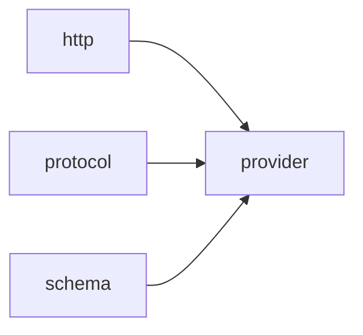

# Module `provider`

## Summary

The `provider` module is responsible for orchestrating provider‑specific networking operations that bridge the generic HTTP layer with the protocol and schema modules. It owns the logic for reading authentication credentials from environment variables, constructing and normalizing URL paths, parsing JSON objects, serializing tool arguments into request payloads, and validating completion requests against expected constraints. These operations are exposed as public functions within the `clore::net::detail` namespace, enabling downstream code to build and validate requests tailored to a particular LLM provider.

The module also manages internal state variables—such as base `URLs`, environment configuration, and request/response schemas—that are used across its utility functions. By consolidating provider‑specific handling in one place, the module abstracts away the details of credential resolution, request formatting, and validation, allowing higher‑level components to interact with providers through a consistent and reusable interface.

## Imports

- [`http`](../http/index.md)
- [`protocol`](../protocol/index.md)
- [`schema`](../schema/index.md)
- `std`

## Imported By

- [`anthropic`](../anthropic/index.md)
- [`openai`](../openai/index.md)

## Dependency Diagram

## Types

### `clore::net::detail::CredentialEnv`

Declaration: `network/provider.cppm:14`

Definition: `network/provider.cppm:14`

Declaration: [`Namespace clore::net::detail`](../../namespaces/clore/net/detail/index.md)

The struct `clore::net::detail::CredentialEnv` is implemented as a trivial aggregate data holder. It contains two `std::string_view` members, `base_url_env` and `api_key_env`, which store the names of environment variables expected to provide the base URL and API key, respectively. The key invariant is that both fields must refer to memory with a lifetime extending at least as long as the `CredentialEnv` instance itself, since `std::string_view` does not own the underlying character data. No custom constructors, destructors, or assignment `operator`s are defined; initialization relies entirely on aggregate initialization, allowing direct brace‑enclosed assignment of the two names.

#### Invariants

- Members are valid `std::string_view` objects; no further guarantees are provided

#### Key Members

- `base_url_env`: environment variable name for the base URL
- `api_key_env`: environment variable name for the API key

#### Usage Patterns

- No usage patterns are explicitly documented in the evidence

## Functions

### `clore::net::detail::append_url_path`

Declaration: `network/provider.cppm:21`

Definition: `network/provider.cppm:43`

Declaration: [`Namespace clore::net::detail`](../../namespaces/clore/net/detail/index.md)

The function `clore::net::detail::append_url_path` constructs a single URL string from a `base_url` and a `path` by performing two trimming operations and a conditional join. It first copies `base_url` into a `std::string` named `url` and strips any trailing forward slashes using a while loop that repeatedly calls `pop_back()`. Similarly, it copies `path` into a second `std::string` called `suffix` and removes all leading forward slashes by erasing from the beginning. If `suffix` is non‑empty after trimming, the algorithm appends a single `/` followed by the cleaned suffix to the cleaned base URL. The resulting string is returned, guaranteeing that the junction between the two parts never contains more than one slash.  

The implementation depends only on the C++ standard library types `std::string` and `std::string_view`; no external helpers, encryption, or networking primitives are used. The control flow is purely sequential with two trivial loops and one conditional, making the function self‑contained and suitable for inline use in URL construction tasks within the `clore::net::detail` namespace.

#### Side Effects

No observable side effects are evident from the extracted code.

#### Reads From

- the parameter `base_url`
- the parameter `path`

#### Writes To

- the returned `std::string` object

#### Usage Patterns

- constructing a full URL by combining a base URL and a relative path
- ensuring a single slash separator between URL components

### `clore::net::detail::parse_json_object`

Declaration: `network/provider.cppm:27`

Definition: `network/provider.cppm:148`

Declaration: [`Namespace clore::net::detail`](../../namespaces/clore/net/detail/index.md)

The function first attempts to parse the input `raw` string into a `json::Object` by invoking `json::parse<json::Object>`. If the parse result does not hold a value, the function constructs a descriptive error: it formats the `context` string together with the error message from the failed parse (obtained via `parsed.error().to_string()`) into an `LLMError`, which is then returned inside a `std::unexpected`. On success, the parsed `json::Object` is moved out and returned directly. The entire logic depends on the JSON parser’s return type (`std::expected<json::Object, ParseError>`), the `LLMError` type, and `std::format` for error message construction.

#### Side Effects

No observable side effects are evident from the extracted code.

#### Reads From

- `raw` parameter
- `context` parameter
- `json::parse<json::Object>(raw)` return value

#### Writes To

- local variable `parsed`
- return value (`std::expected`)

#### Usage Patterns

- parsing JSON objects from raw string input
- deserializing with error context for diagnostics
- used as a utility in higher-level parsing or validation functions

### `clore::net::detail::read_credentials`

Declaration: `network/provider.cppm:19`

Definition: `network/provider.cppm:39`

Declaration: [`Namespace clore::net::detail`](../../namespaces/clore/net/detail/index.md)

The function `clore::net::detail::read_credentials` serves as a thin wrapper around a helper function `read_environment`. It extracts the `base_url_env` and `api_key_env` fields from the provided `CredentialEnv` object and forwards them directly to `read_environment`, which performs the actual environment variable lookup and returns an `std::expected<EnvironmentConfig, LLMError>`. The implementation involves no branching, error recovery, or intermediate transformation; its entire control flow consists of a single delegation call. Dependencies are limited to the `CredentialEnv` struct and the `read_environment` function (not shown in the snippet), meaning that any change to the credential‑reading logic must be made in `read_environment`, while `read_credentials` remains a stable, type‑safe interface for the caller.

#### Side Effects

No observable side effects are evident from the extracted code.

#### Reads From

- the `base_url_env` field of the `CredentialEnv` parameter `env`
- the `api_key_env` field of the `CredentialEnv` parameter `env`

#### Usage Patterns

- Obtaining configuration from environment variables for network requests
- Retrieving base URL and API key to build a complete environment configuration

### `clore::net::detail::serialize_tool_arguments`

Declaration: `network/provider.cppm:30`

Definition: `network/provider.cppm:158`

Declaration: [`Namespace clore::net::detail`](../../namespaces/clore/net/detail/index.md)

The function first serializes the provided `arguments` JSON value into a string using `json::to_string`. If this serialization fails, it returns an `unexpected_json_error` with the given `context`. On success, it re-parses that serialized string back into a `json::Value` via `json::parse`. If parsing fails, it returns an `LLMError` containing the `context` and the parser error string. On success, it returns a `std::pair` containing the serialized string and the re-parsed JSON value. This round-trip both verifies that the arguments constitute valid JSON and normalizes the representation (e.g., key ordering, formatting), ensuring that the string form and the parsed form are consistent before further processing by downstream validation steps.

#### Side Effects

No observable side effects are evident from the extracted code.

#### Reads From

- arguments
- context

#### Usage Patterns

- normalizing tool arguments JSON representation
- validating tool arguments by round-trip encoding/decoding

### `clore::net::detail::validate_completion_request`

Declaration: `network/provider.cppm:23`

Definition: `network/provider.cppm:61`

Declaration: [`Namespace clore::net::detail`](../../namespaces/clore/net/detail/index.md)

The function `clore::net::detail::validate_completion_request` performs a sequence of invariant checks on a `CompletionRequest`, returning `std::expected<void, LLMError>`. It first rejects empty `request.model` or `request.messages`. If `validate_response_format_schema` is true and `request.response_format` is present, it delegates to `validate_response_format`; similarly, if `validate_tool_schemas` is true, it validates each tool definition in `request.tools` via `validate_tool_definition`. It then enforces that `request.tool_choice` or `request.parallel_tool_calls` are set only when `request.tools` is non‑empty, and if `request.tool_choice` holds a `ForcedFunctionToolChoice`, requires that the forced tool name exists among `request.tools`. Finally, it uses `std::visit` over each message in `request.messages` to validate per‑type rules: `AssistantToolCallMessage` must have non‑empty `content` or `tool_calls`, and every tool call ID must be unique and non‑empty; `ToolResultMessage` must have a non‑empty `tool_call_id`. Any violation returns `std::unexpected` with a descriptive `LLMError`, otherwise the function succeeds with an empty expected. The implementation depends on `validate_response_format` and `validate_tool_definition` (presumably detail helpers), the type‑erased message dispatch via `std::visit`, and the `std::format` utility for error messages.

#### Side Effects

No observable side effects are evident from the extracted code.

#### Reads From

- `request.model`
- `request.messages`
- `request.response_format`
- `request.tools`
- `request.tool_choice`
- `request.parallel_tool_calls`
- parameters `validate_response_format_schema` and `validate_tool_schemas`
- individual message variant types via `std::visit`

#### Usage Patterns

- Called before processing a completion request to ensure validity
- Used with optional schema validation flags to conditionally validate response format and tool schemas

## Internal Structure

The `provider` module implements the networking layer for LLM API providers, building on the foundation of the `http`, `protocol`, and `schema` modules. It imports these to leverage raw HTTP communication, structured request/response types, and JSON Schema generation. The module is decomposed into internal detail functions that handle credential reading via a `CredentialEnv` struct (which maps to environment variable names for base URL and API key), URL path construction, JSON object parsing, tool argument serialization, and completion request validation. This internal layering separates low-level concerns—such as environment variable lookup and string manipulation—from higher-level orchestration. The implementation structure relies on these utilities to assemble and validate completion requests before passing them to the underlying HTTP layer, ensuring that provider-specific boilerplate is isolated within this module.

## Related Pages

- [Module http](../http/index.md)
- [Module protocol](../protocol/index.md)
- [Module schema](../schema/index.md)

