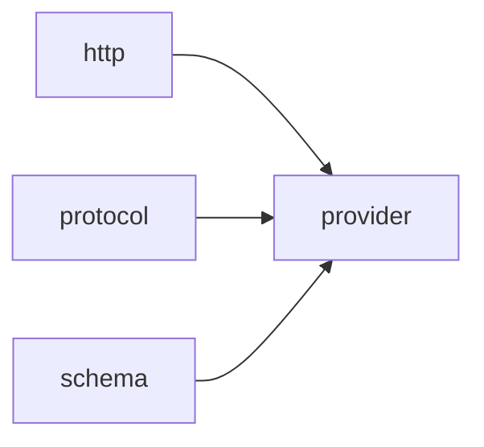

# Module `provider`

## Summary

The `provider` module encapsulates the network-layer logic specific to interacting with a single LLM provider, such as `OpenAI`. It owns the responsibility for reading provider-specific credentials (API keys and base `URLs`) from the environment, constructing well-formed request paths, and parsing JSON responses with contextual error reporting. The module also handles serialization of tool call arguments and validation of completion requests, ensuring that outgoing requests conform to the expected schema and structure before they reach the HTTP layer.

Public-facing entities exposed by this module include `read_credentials`, `append_url_path`, `parse_json_object`, `serialize_tool_arguments`, and `validate_completion_request`. These functions serve as the primary interface for configuring authentication, building provider-specific endpoint `URLs`, and validating the shape of completion requests and tool-related payloads. The module builds on the lower-level `http`, `protocol`, and `schema` modules to coordinate the credential discovery, request construction, and structural validation needed before dispatching an HTTP request to the provider's API.

## Imports

- [`http`](../http/index.md)
- [`protocol`](../protocol/index.md)
- [`schema`](../schema/index.md)
- `std`

## Imported By

- [`anthropic`](../anthropic/index.md)
- [`openai`](../openai/index.md)

## Dependency Diagram

## Types

### `clore::net::detail::CredentialEnv`

Declaration: `network/provider.cppm:14`

Definition: `network/provider.cppm:14`

Declaration: [`Namespace clore::net::detail`](../../namespaces/clore/net/detail/index.md)

The struct `clore::net::detail::CredentialEnv` is a lightweight aggregate that bundles two environment variable names as `std::string_view` members: `base_url_env` and `api_key_env`. It serves solely as a compile‑time or runtime container for the symbolic names of the environment variables that will be read to obtain provider connection parameters. The struct imposes no invariants beyond those inherent to `std::string_view` (i.e., the pointed‑to character sequences must outlive the view and remain valid). There are no user‑defined constructors, assignment `operator`s, or member functions; the type is a plain aggregate whose fields are intended to be accessed directly. This design keeps the credential environment specification trivially copyable and usable in `constexpr` or `static const` contexts where the underlying environment variable names are known at compile time.

#### Invariants

- Members are set to valid `std::string_view` objects.
- No other invariants implied by the evidence.

#### Key Members

- `base_url_env`
- `api_key_env`

#### Usage Patterns

- Likely passed as a parameter to functions that read environment variables.
- Used in the implementation of credential retrieval or connection setup.

## Functions

### `clore::net::detail::append_url_path`

Declaration: `network/provider.cppm:21`

Definition: `network/provider.cppm:43`

Declaration: [`Namespace clore::net::detail`](../../namespaces/clore/net/detail/index.md)

The implementation of `clore::net::detail::append_url_path` follows a straightforward three‑step algorithm. First, it copies the input `base_url` into a local `std::string` and strips any trailing `'/'` characters using a `while` loop. Second, it copies the input `path` into a local `suffix` and removes any leading `'/'` characters via another `while` loop. Finally, if the trimmed `suffix` is not empty, it appends a single `'/'` and the `suffix` to the trimmed base URL. The function returns the resulting concatenated string. No external dependencies are required beyond the standard library’s string manipulation operations; the control flow consists solely of simple loops and a conditional guard.

#### Side Effects

No observable side effects are evident from the extracted code.

#### Reads From

- `base_url` parameter
- `path` parameter

#### Writes To

- local `std::string url`
- local `std::string suffix`
- returned `std::string`

#### Usage Patterns

- URL path normalization before HTTP requests

### `clore::net::detail::parse_json_object`

Declaration: `network/provider.cppm:27`

Definition: `network/provider.cppm:148`

Declaration: [`Namespace clore::net::detail`](../../namespaces/clore/net/detail/index.md)

The function attempts to parse the raw JSON string `raw` into a `json::Object` using `json::parse<json::Object>`. If parsing fails (the result has no value), it returns a `std::unexpected` containing an `LLMError` constructed with the context string and the parser’s error description. Otherwise, it returns the successfully parsed object by dereferencing the expected value.

The control flow is a single conditional branch after the parse attempt. Its only dependencies are the `json::parse` template (specialized for `json::Object`) and the `LLMError` type, which is used to wrap error information. The `context` parameter is used solely to prefix the error message, aiding in identification of the source of the parsing failure.

#### Side Effects

No observable side effects are evident from the extracted code.

#### Reads From

- `raw` parameter (`std::string_view`)
- `context` parameter (`std::string_view`)
- global string literals for formatting (implied)

#### Usage Patterns

- parsing a JSON object from a raw response string
- wrapping parse errors with contextual information

### `clore::net::detail::read_credentials`

Declaration: `network/provider.cppm:19`

Definition: `network/provider.cppm:39`

Declaration: [`Namespace clore::net::detail`](../../namespaces/clore/net/detail/index.md)

The function `clore::net::detail::read_credentials` is a thin delegation wrapper that extracts the two fields from its `CredentialEnv` parameter — `base_url_env` and `api_key_env` — and forwards them to `clore::net::detail::read_environment`.  The underlying function is responsible for reading the actual environment variables identified by those names, parsing the values, and constructing the resulting `EnvironmentConfig` or returning an error.  Consequently, the algorithm of `read_credentials` is purely structural: it unpacks the configuration struct, passes the two environment variable names (as `std::string_view` instances) to the core routine, and relays the outcome.  Dependencies are limited to the `CredentialEnv` type and the `read_environment` function, along with the error type `LLMError`.

#### Side Effects

- Reads environment variables (I/O)

#### Reads From

- env`.base_url_env`
- env`.api_key_env`
- Environment variables named by these strings

#### Writes To

- Return value (`std::expected<EnvironmentConfig, LLMError>`)

#### Usage Patterns

- Used to load credentials from environment variables
- Called during initialization of network connections

### `clore::net::detail::serialize_tool_arguments`

Declaration: `network/provider.cppm:30`

Definition: `network/provider.cppm:158`

Declaration: [`Namespace clore::net::detail`](../../namespaces/clore/net/detail/index.md)

The implementation of `clore::net::detail::serialize_tool_arguments` performs a round‑trip validation of the provided `json::Value` arguments. It first attempts to serialize `arguments` into a JSON string using `json::to_string`. If serialization fails, the function immediately returns an error constructed via `unexpected_json_error` using the supplied `context` and the error from `json::to_string`. On success, it re‑parses the resulting string back into a `json::Value` with `json::parse`. If parsing fails, it returns `std::unexpected` wrapping a `LLMError` that includes `context` and the parsing error. Otherwise, the function returns a `std::pair` containing both the serialized string form and the re‑parsed value, guaranteeing that the output JSON representation is valid and consistent.

The algorithm thus relies on the symmetry of serialization and parsing to detect malformed or unserializable JSON values early. Key dependencies include `json::to_string`, `json::parse`, and the error‑handling utilities `unexpected_json_error` and `LLMError`. The `context` parameter is used solely for enriching error messages, with no effect on the core control flow.

#### Side Effects

No observable side effects are evident from the extracted code.

#### Reads From

- `json::Value arguments`
- `std::string_view context`

#### Usage Patterns

- Used to re-serialize and validate tool arguments
- Called when tool arguments need to be normalized or error-checked

### `clore::net::detail::validate_completion_request`

Declaration: `network/provider.cppm:23`

Definition: `network/provider.cppm:61`

Declaration: [`Namespace clore::net::detail`](../../namespaces/clore/net/detail/index.md)

The function performs a series of preflight checks on the provided `CompletionRequest` before it is submitted to an upstream API. It first verifies that `request.model` and `request.messages` are non‑empty, returning `std::unexpected(LLMError(...))` if either condition fails. When `validate_response_format_schema` is `true` and `request.response_format` is present, the schema is validated via `validate_response_format`; similarly, when `validate_tool_schemas` is `true`, each element of `request.tools` is validated using `validate_tool_definition`. Additional cross‑field constraints are enforced: if `request.tool_choice` or `request.parallel_tool_calls` are set, at least one tool must be defined, and a `ForcedFunctionToolChoice` requires that its `name` exists among the provided tools.

The message payload is then inspected by iterating over `request.messages` and applying a `std::visit`‑based validator. For `AssistantToolCallMessage` entries, either `content` or at least one `tool_calls` must be present; each tool call must have non‑empty `id` and `name`, and all `id` values must be unique (enforced with a `std::unordered_set`). For `ToolResultMessage` entries, the `tool_call_id` must be non‑empty. Any validation failure causes an immediate `std::unexpected` return with a descriptive `LLMError`. The function returns an empty `std::expected<void, LLMError>` on success.

#### Side Effects

No observable side effects are evident from the extracted code.

#### Reads From

- `CompletionRequest` fields: `model`, `messages`, `response_format`, `tools`, `tool_choice`, `parallel_tool_calls`
- message fields: `content`, `tool_calls`, `tool_call_id`, `id`, `name`

#### Usage Patterns

- called before initiating a completion request to validate the request structure
- part of request validation pipeline

## Internal Structure

The `provider` module is the network‑layer component responsible for orchestrating communication with a specific LLM provider. It decomposes provider‑specific concerns into a set of `detail`‑scoped utilities: `read_credentials` probes environment variables defined by `CredentialEnv` (which carries `base_url_env` and `api_key_env` names) to obtain authentication and endpoint configuration; `append_url_path` constructs clean URL paths from base and segment strings; `parse_json_object` attempts JSON‑object parsing with context‑aware error reporting; `serialize_tool_arguments` converts tool‑call argument JSON into a serialized form; and `validate_completion_request` performs structural validation of a completion request against boolean flags.

Imports reflect a three‑layer dependency: `std` for core language support, `http` for actual request dispatch and rate‑limiting, `protocol` for the request/response types (e.g., `CompletionRequest`, `ToolCall`), and `schema` for generating `OpenAI`‑compatible JSON schemas used in tool definitions and response format validation. Internally, `provider` uses variable‑scoped schemas (`validate_tool_schemas`, `validate_response_format_schema`) that are likely loaded once and reused across validation calls. The module does not own HTTP transport or protocol types; instead it composes them into a cohesive provider client that translates high‑level tool call and completion requests into properly authenticated, validated, and serialized network operations.

## Related Pages

- [Module http](../http/index.md)
- [Module protocol](../protocol/index.md)
- [Module schema](../schema/index.md)

