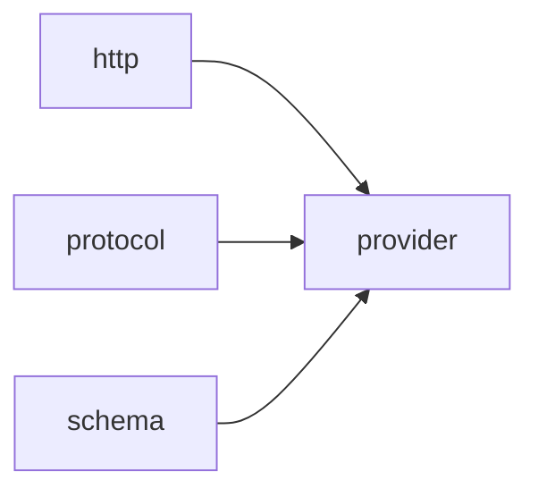

# Module `provider`

## Summary

The `provider` module consolidates the network-layer logic specific to interacting with LLM service providers. It owns credential management through `read_credentials` and the `CredentialEnv` structure, URL normalization with `append_url_path`, and request‑level validation via `validate_completion_request`. Additionally, it provides serialization and parsing utilities—`serialize_tool_arguments` and `parse_json_object`—to prepare tool arguments and handle JSON responses. The module depends on the `http`, `protocol`, and `schema` modules, integrating them to construct, validate, and process completion requests for supported providers.

Public‑facing functions in the `detail` sub‑namespace form the module’s implementation scope. These cover credential reading, URL construction, request validation (including schema and tool‑argument validation), and JSON parsing. The module does not expose types directly; instead, it offers these utility functions that higher‑level network code uses to ensure provider‑specific requirements are met before issuing HTTP calls.

## Imports

- [`http`](../http/index.md)
- [`protocol`](../protocol/index.md)
- [`schema`](../schema/index.md)

## Imported By

- [`anthropic`](../anthropic/index.md)
- [`openai`](../openai/index.md)

## Dependency Diagram

```mermaid
graph LR
    M0["provider"]
    I0["http"]
    I0 --> M0
    I1["protocol"]
    I1 --> M0
    I2["schema"]
    I2 --> M0
```

## Types

### `clore::net::detail::CredentialEnv`

Declaration: `src/network/provider.cppm:21`

Definition: `src/network/provider.cppm:21`

Declaration: [`Namespace clore::net::detail`](../../namespaces/clore/net/detail/index.md)

The struct `clore::net::detail::CredentialEnv` is a plain aggregate with two `std::string_view` fields: `base_url_env` and `api_key_env`. These store the names of environment variables that will be read to obtain the service base URL and API key respectively. No constructors, destructors, or special member functions are declared, so the struct defaults to aggregate initialization and trivial copying. The key invariant is that each `std::string_view` is expected to point to a non‑empty, null‑terminated string literal (or storage with a lifetime matching the parent component), though the struct itself does not enforce this. Its role within the implementation is to bundle the two environment‑variable names together, allowing higher‑level credential‑loading logic to retrieve and use them without separately managing two string handles.

#### Invariants

- No explicit invariants; both fields are accessible and modifiable.
- No requirement that the string views point to valid environment variables.

#### Key Members

- `base_url_env` – holds the name of the environment variable for the base URL.
- `api_key_env` – holds the name of the environment variable for the API key.

#### Usage Patterns

- Used to pass environment variable names to credential lookup functions.
- Likely consumed internally within the networking layer to read credentials from the environment.
- Stored as a simple value object; may be copied or passed by reference.

## Functions

### `clore::net::detail::append_url_path`

Declaration: `src/network/provider.cppm:28`

Definition: `src/network/provider.cppm:50`

Declaration: [`Namespace clore::net::detail`](../../namespaces/clore/net/detail/index.md)

The function first copies `base_url` into a local `std::string` `url` and removes any trailing forward slashes by repeatedly calling `pop_back()` while the last character is `'/'`. It then copies `path` into a `std::string` `suffix` and erases any leading forward slashes by erasing the first character while the first character is `'/'`. If the trimmed `suffix` is not empty, the function appends a single `'/'` followed by `suffix` to `url`. The resulting combined string is returned. The implementation relies solely on the standard library containers and algorithms; no external dependencies are used.

#### Side Effects

No observable side effects are evident from the extracted code.

#### Reads From

- `base_url` parameter
- `path` parameter

#### Writes To

- local variable `url`
- local variable `suffix`
- return value

#### Usage Patterns

- URL path concatenation
- joining base URL with relative path
- normalizing URL segments

### `clore::net::detail::parse_json_object`

Declaration: `src/network/provider.cppm:34`

Definition: `src/network/provider.cppm:155`

Declaration: [`Namespace clore::net::detail`](../../namespaces/clore/net/detail/index.md)

The function attempts to parse the provided `raw` string into a `json::Object` via `json::parse<json::Object>`. On success, it returns the resulting object. On failure, it constructs an `LLMError` by formatting the `context` string together with the parse error description from `json::parse`, and returns `std::unexpected` with that error. This design centralizes JSON object parsing with a consistent error‑reporting pattern that includes caller‑supplied context, making it reusable across different call sites within the networking layer.

#### Side Effects

No observable side effects are evident from the extracted code.

#### Reads From

- `raw` (`string_view`)
- `context` (`string_view`)

#### Writes To

- returned `json::Object` (via allocation and move)
- returned `LLMError` (temporary)

#### Usage Patterns

- Parsing JSON object from raw HTTP response
- Validating JSON structure with context for error reporting

### `clore::net::detail::read_credentials`

Declaration: `src/network/provider.cppm:26`

Definition: `src/network/provider.cppm:46`

Declaration: [`Namespace clore::net::detail`](../../namespaces/clore/net/detail/index.md)

The function `clore::net::detail::read_credentials` implements a thin delegation layer that extracts the two environment-variable names from the `CredentialEnv` structure and forwards them to the lower-level `read_environment` helper. It destructures the `env` parameter, passing `env.base_url_env` and `env.api_key_env` directly into the call. The function’s sole control-flow path is the delegation; the actual environment lookup, parsing, and error mapping are handled by `read_environment`. The return type `std::expected<EnvironmentConfig, LLMError>` preserves any failure originating from `read_environment`, so callers treat errors uniformly without inspecting environment‑variable logic locally.

#### Side Effects

- Reads environment variables specified by `CredentialEnv` fields

#### Reads From

- `env.base_url_env`
- `env.api_key_env`
- environment variables via `read_environment`

#### Usage Patterns

- Called to obtain environment-based configuration for network operations

### `clore::net::detail::serialize_tool_arguments`

Declaration: `src/network/provider.cppm:37`

Definition: `src/network/provider.cppm:165`

Declaration: [`Namespace clore::net::detail`](../../namespaces/clore/net/detail/index.md)

The function `clore::net::detail::serialize_tool_arguments` accepts a `json::Value` named `arguments` and a `std::string_view` named `context`, and returns a `std::expected<std::pair<std::string, json::Value>, LLMError>`. Internally, it first serializes the `arguments` value using `json::to_string`. If that fails, it constructs an `LLMError` via `unexpected_json_error` and returns the error. Otherwise, it parses the resulting string back into a `json::Value` using `json::parse`. If that second step fails, it returns an `LLMError` with the parse error appended to `context`. On success, it moves the string and the parsed value into a `std::pair` and returns it. The algorithm therefore performs a round‑trip encode‑decode to produce a normalized JSON string and its corresponding validated value, ensuring the input is well‑formed. Dependencies include `json::to_string`, `json::parse`, `unexpected_json_error`, `std::format`, and `LLMError`.

#### Side Effects

No observable side effects are evident from the extracted code.

#### Reads From

- arguments (`json::Value`)
- context (`std::string_view`)

#### Usage Patterns

- tool argument serialization before HTTP request
- normalization of JSON value

### `clore::net::detail::validate_completion_request`

Declaration: `src/network/provider.cppm:30`

Definition: `src/network/provider.cppm:68`

Declaration: [`Namespace clore::net::detail`](../../namespaces/clore/net/detail/index.md)

The implementation of `clore::net::detail::validate_completion_request` performs a multi‑stage validation pipeline on the provided `CompletionRequest`. It first rejects requests with an empty `model` or empty `messages`. If the flag `validate_response_format_schema` is set and `request.response_format` is present, it delegates to `validate_response_format`; similarly, if `validate_tool_schemas` is enabled, each entry in `request.tools` is validated via `validate_tool_definition`. The function then enforces that `request.tool_choice` or `request.parallel_tool_calls` may only be specified when at least one tool exists, and for a `ForcedFunctionToolChoice` it verifies that the named tool is present among `request.tools`.

The final stage iterates over every message in `request.messages` using `std::visit`. For `AssistantToolCallMessage` instances, it ensures either `content` is present or `tool_calls` is non‑empty, that every tool call has non‑empty `id` and `name`, and that no duplicate tool call `id` exists. For `ToolResultMessage` instances, it checks that `tool_call_id` is non‑empty. Any violation causes the function to return `std::unexpected` with an appropriate `LLMError`, while successful validation returns an empty `std::expected`. The implementation relies on the external validation helpers and `std::format` for constructing error strings, and uses `std::unordered_set` to track duplicate identifiers.

#### Side Effects

No observable side effects are evident from the extracted code.

#### Reads From

- `CompletionRequest::model`
- `CompletionRequest::messages`
- `CompletionRequest::response_format`
- `CompletionRequest::tools`
- `CompletionRequest::tool_choice`
- `CompletionRequest::parallel_tool_calls`
- message fields (content, `tool_calls`, `tool_call_id`, name, id)
- `validate_response_format`
- `validate_tool_definition`

#### Usage Patterns

- validation before making a completion API call
- used to ensure request integrity and consistency

## Internal Structure

The `provider` module serves as a low‑level utility layer for constructing and validating HTTP requests to LLM provider endpoints. It depends on the `http`, `protocol`, and `schema` modules — the first for networking primitives, the second for protocol‑specific data structures (e.g., `CompletionRequest`), and the third for JSON schema generation and validation. Internally, the module is decomposed into a public API and a `detail` namespace that houses helper types and functions. The `CredentialEnv` struct encapsulates the environment variable names for API key and base URL, while `read_credentials` extracts those values from the environment. URL construction is handled by `append_url_path`, which normalises path separators. JSON‑related operations — parsing objects and serialising tool arguments — are provided by `parse_json_object` and `serialize_tool_arguments`, respectively. Request integrity is checked by `validate_completion_request`, which returns an error code if any precondition fails. This layered structure isolates credential management, URL manipulation, data serialisation, and validation from the higher‑level request‑building logic, promoting maintainability and testability.

## Related Pages

- [Module http](../http/index.md)
- [Module protocol](../protocol/index.md)
- [Module schema](../schema/index.md)

