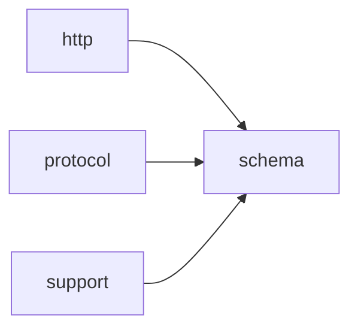

# Module `schema`

## Summary

The `schema` module is responsible for generating `OpenAI`‑compatible JSON schema representations from C++ types. It provides type‑aware utilities that produce schema objects for structured‑output response formats and function‑tool definitions, enabling type‑safe integration with `OpenAI`’s tool‑calling and structured‑response protocols. The module also includes internal validation machinery to ensure constructed schemas conform to the expected shape and constraints.

The public‑facing scope of the module includes the `clore::net::schema::response_format` and `clore::net::schema::function_tool` template functions, which return integer handles representing a schema for a given C++ type. Supporting public validation functions, such as `clore::net::detail::validate_response_format` and `clore::net::detail::validate_tool_definition`, are also provided. Under the hood, the `openai::schema::detail` namespace contains metaprogramming traits and construction routines that handle containers, optionals, and scalar types, together with recursive validation passes that check properties, types, and structural completeness.

## Imports

- [`http`](../http/index.md)
- [`protocol`](../protocol/index.md)
- `std`
- [`support`](../support/index.md)

## Imported By

- [`agent:tools`](../agent/tools.md)
- [`anthropic`](../anthropic/index.md)
- [`client`](../client/index.md)
- [`openai`](../openai/index.md)
- [`provider`](../provider/index.md)

## Dependency Diagram

## Types

### `clore::net::openai::schema::detail::array_inner`

Declaration: `network/schema.cppm:72`

Declaration: [`Namespace clore::net::openai::schema::detail`](../../namespaces/clore/net/openai/schema/detail/index.md)

The template struct `clore::net::openai::schema::detail::array_inner` is an implementation detail that captures the inner type information for array schemas. It is designed to provide a type alias or metadata for the element type contained within an array, supporting the broader schema machinery without exposing internal helpers. As a template parameterized by `T`, it maintains a conceptual invariant that `T` represents the value type of the array, enabling consistent type‑based dispatch or deduction within the detail namespace. The struct does not store runtime state; its purpose is purely compile‑time, typically exposing a nested type alias or static member to denote the contained type. This design isolates the array‑inner logic from the public API while preserving type safety and composability.

### `clore::net::openai::schema::detail::is_array`

Declaration: `network/schema.cppm:63`

Definition: `network/schema.cppm:63`

Declaration: [`Namespace clore::net::openai::schema::detail`](../../namespaces/clore/net/openai/schema/detail/index.md)

The template struct `clore::net::openai::schema::detail::is_array` is a type trait predicate that defaults to `std::false_type`. Its primary template provides a compile‑time constant `value` equal to `false` for any type `T`. This struct is intended to be specialised for array types, such that `is_array<T>::value` becomes `true` for those types. As a `detail` implementation helper, it supports the internal detection of array‑like categories within the schema module, typically used to dispatch or constrain template instantiations based on whether a type is an array. The struct itself contains no data members or custom logic beyond the inherited `std::false_type`; the invariants are maintained by the implicit `std::integral_constant` base, ensuring a consistent `value` member for all supported specialisations.

#### Invariants

- The primary template defines `value` as `false`.
- Only specializations can change the boolean value.

#### Key Members

- Base class `std::false_type`
- Inherited member `value` (static constexpr bool)

#### Usage Patterns

- Used in compile-time type checking, e.g., with `std::enable_if`.
- Expected to be specialized for array types to enable or disable template overloads.

### `clore::net::openai::schema::detail::is_optional`

Declaration: `network/schema.cppm:23`

Definition: `network/schema.cppm:23`

Declaration: [`Namespace clore::net::openai::schema::detail`](../../namespaces/clore/net/openai/schema/detail/index.md)

The struct `clore::net::openai::schema::detail::is_optional` is a primary template type trait that inherits from `std::false_type`. As a default definition, it serves as a negative sentinel: its static member `value` is always `false`, indicating that any type `T` not covered by a specialization is not considered an optional. The internal structure is trivial—no additional members or base classes beyond the inherited `std::false_type`—and it functions as a detection hook. Specializations (not shown here) that derive from `std::true_type` are expected to be provided elsewhere for types that should be recognized as optionals, thereby establishing a compile-time predicate for conditional logic in the schema or serialization machinery.

#### Invariants

- Primary template always yields `value == false`
- Specializations must be consistent with the detected optional type
- Inheritance from `std::false_type` implies `value` is a compile-time constant

#### Key Members

- `T` template parameter representing the type to test
- Inherited `value` static constexpr bool member

#### Usage Patterns

- Used in SFINAE or `if constexpr` to conditionally handle optional types
- Specialized for `std::optional` to enable `value == true`
- Consulted by serialization or conversion utilities to determine null handling

### `clore::net::openai::schema::detail::is_vector`

Declaration: `network/schema.cppm:43`

Definition: `network/schema.cppm:43`

Declaration: [`Namespace clore::net::openai::schema::detail`](../../namespaces/clore/net/openai/schema/detail/index.md)

The primary template of `clore::net::openai::schema::detail::is_vector` inherits from `std::false_type`, establishing a default `value` of `false` for any type `T`. This invariant ensures that unqualified types are not recognized as vectors unless an explicit specialization overrides the base class. No additional members or functions are defined; the sole implementation detail is the inheritance chain that provides the compile-time boolean constant. The type trait is intended to be specialized for `std::vector` (and potentially other container types) to yield `std::true_type`, enabling template metaprogramming decisions based on vector semantics.

#### Invariants

- `is_vector<T>::value` is `false` for all types `T` in the primary template
- The struct is trivially constructible and destructible

#### Key Members

- Inherited `value` from `std::false_type` (static constexpr bool)

#### Usage Patterns

- Used as a type trait to detect vector types via template specialization
- Employed in template metaprogramming for conditional logic

### `clore::net::openai::schema::detail::optional_inner`

Declaration: `network/schema.cppm:32`

Declaration: [`Namespace clore::net::openai::schema::detail`](../../namespaces/clore/net/openai/schema/detail/index.md)

The struct `clore::net::openai::schema::detail::optional_inner<T>` is a template implementation detail used internally to manage optional schema fields. It encapsulates a value of type `T` along with a presence flag, providing a storage layout that avoids unnecessary default construction when the value is absent. The class maintains the invariant that the stored object is only constructed when the flag is `true`, and it manually manages the lifetime of `T` through placement new and explicit destructor calls in its constructors, assignment `operator`s, and destructor. Accessor member functions such as `has_value` and `value` are provided, with `value` throwing an exception if the flag is `false`. The design supports copy and move semantics, ensuring proper handling of the underlying value’s state transitions.

### `clore::net::openai::schema::detail::schema_subject`

Declaration: `network/schema.cppm:83`

Definition: `network/schema.cppm:83`

Declaration: [`Namespace clore::net::openai::schema::detail`](../../namespaces/clore/net/openai/schema/detail/index.md)

The template struct `clore::net::openai::schema::detail::schema_subject` is a type‑level metafunction that normalises its template parameter `T` by removing top‑level `const`, `volatile`, and reference qualifiers. Its sole internal member is the alias `type`, defined as `std::remove_cvref_t<T>`. This ensures that any type passed through `schema_subject` is reduced to its cv‑unqualified, non‑reference form, providing a consistent base type for subsequent schema‑related operations. The implementation is trivial but carries the invariant that `type` always names the underlying type without any outer qualifiers or references.

#### Invariants

- The `type` member always yields the decayed type without cv-ref qualifiers.
- The struct is trivially constructible and empty.

#### Key Members

- `using type = std::remove_cvref_t<T>`

#### Usage Patterns

- Used to obtain a canonical type from possibly qualified types.
- Likely used in type traits or metaprogramming contexts within the namespace.

### `clore::net::openai::schema::detail::schema_subject_t`

Declaration: `network/schema.cppm:95`

Declaration: [`Namespace clore::net::openai::schema::detail`](../../namespaces/clore/net/openai/schema/detail/index.md)

The type alias `schema_subject_t` resolves to `typename schema_subject<T>::type`, providing a shorthand for accessing the nested `type` member of the `schema_subject` class template. Its definition is entirely dependent on the primary template or any partial/explicit specializations of `schema_subject<T>`, making it a compile-time alias whose concrete type is determined by the argument `T`. Internally, `schema_subject<T>` is expected to define a `type` member; the alias exists solely to simplify usage in template metaprogramming contexts within the detail namespace. As a dependent type alias, it carries the invariant that `schema_subject<T>::type` must be a valid type for the alias to be well‑formed; no additional constraints or implementations are introduced by the alias itself.

#### Invariants

- The alias is only valid for types `T` for which `schema_subject<T>` has a visible specialization defining a `type` member.
- The resolved type must be a valid type; otherwise, compilation fails.

#### Key Members

- `schema_subject<T>` trait class
- `::type` nested type alias

#### Usage Patterns

- Used to obtain the subject type of a schema type without requiring `typename`.
- Likely used in template metaprogramming to constrain or transform types based on schema definitions.

### `clore::net::openai::schema::detail::vector_inner`

Declaration: `network/schema.cppm:52`

Declaration: [`Namespace clore::net::openai::schema::detail`](../../namespaces/clore/net/openai/schema/detail/index.md)

The template struct `clore::net::openai::schema::detail::vector_inner` is an implementation detail within the `OpenAI` schema representation. It is parameterized by type `T` and serves as an internal container or marker for vector‑like schema types. The struct’s exact member layout is not publicly exposed; it is intended solely to support schema generation for arrays or sequences where the element type is `T`.

## Variables

### `clore::net::openai::schema::detail::is_array_v`

Declaration: `network/schema.cppm:69`

Declaration: [`Namespace clore::net::openai::schema::detail`](../../namespaces/clore/net/openai/schema/detail/index.md)

The variable is a `constexpr bool` that is evaluated at compile time, providing a type trait for array detection. It is read in template metaprogramming contexts to conditionally select or generate schema representations. No mutation is observed because it is defined as `constexpr`.

#### Mutation

No mutation is evident from the extracted code.

#### Usage Patterns

- Used as a compile-time type trait to check if a type is an array
- Referenced in template metaprogramming for schema generation logic

### `clore::net::openai::schema::detail::is_optional_v`

Declaration: `network/schema.cppm:29`

Declaration: [`Namespace clore::net::openai::schema::detail`](../../namespaces/clore/net/openai/schema/detail/index.md)

As a `constexpr` template variable, `is_optional_v` is evaluated at compile time and participates in template metaprogramming to conditionally enable or disable code paths based on whether `T` is an optional type. It is read by the compiler during template instantiation, but no explicit read or usage sites are shown in the provided evidence.

#### Mutation

No mutation is evident from the extracted code.

### `clore::net::openai::schema::detail::is_vector_v`

Declaration: `network/schema.cppm:49`

Declaration: [`Namespace clore::net::openai::schema::detail`](../../namespaces/clore/net/openai/schema/detail/index.md)

As a compile-time constant, `is_vector_v` participates in template metaprogramming to conditionally select schema generation logic for vector types. It is read via template instantiation but not mutated.

#### Mutation

No mutation is evident from the extracted code.

#### Usage Patterns

- type trait detection
- compile-time conditional branching

## Functions

### `clore::net::detail::validate_response_format`

Declaration: `network/schema.cppm:527`

Definition: `network/schema.cppm:535`

Declaration: [`Namespace clore::net::detail`](../../namespaces/clore/net/detail/index.md)

The function `clore::net::detail::validate_response_format` implements a two‑step validation of a `ResponseFormat` object. It first performs trivial pre‑checks: if `format.schema` lacks a value, it returns an empty success; if `format.name` is empty, it returns a `std::unexpected` with an appropriate `LLMError`. Only after these checks pass does it delegate the actual schema compliance verification to `openai::schema::detail::validate_openai_schema`, passing the dereferenced `format.schema`, the `format.name` as the schema path, and `true` for the `is_root` flag. This delegation hands control to a recursive validator that traverses the JSON schema, resolves type markers, and enforces `OpenAI` Schema constraints. The outcome is a `std::expected<void, LLMError>` that signals either successful validation or a structured error containing the first violation encountered.

#### Side Effects

No observable side effects are evident from the extracted code.

#### Reads From

- `format.schema`
- `format.name`

#### Usage Patterns

- Called to validate response format parameters
- Used before constructing a completion request

### `clore::net::detail::validate_tool_definition`

Declaration: `network/schema.cppm:529`

Definition: `network/schema.cppm:545`

Declaration: [`Namespace clore::net::detail`](../../namespaces/clore/net/detail/index.md)

The function first performs lightweight validation of the tool’s metadata: if `tool.name` is empty, it returns an `LLMError` indicating that the tool name must not be empty. If `tool.name` is present but `tool.description` is empty, it returns a formatted `LLMError` specifying which tool lacks a description. After these checks pass, the core validation is delegated to `openai::schema::detail::validate_openai_schema`, passing `tool.parameters`, the tool’s name as a path prefix, and the boolean `true` to indicate that this schema is a root definition. The return value of that call becomes the return value of the function. All non‑local dependencies are limited to the `openai::schema::detail` validation machinery and the `LLMError` type.

#### Side Effects

No observable side effects are evident from the extracted code.

#### Reads From

- tool`.name`
- tool`.description`
- tool`.parameters`

#### Usage Patterns

- Called during tool registration or schema validation to ensure tool definitions are well-formed.

### `clore::net::openai::schema::detail::make_any_of_schema`

Declaration: `network/schema.cppm:156`

Definition: `network/schema.cppm:156`

Declaration: [`Namespace clore::net::openai::schema::detail`](../../namespaces/clore/net/openai/schema/detail/index.md)

The function `clore::net::openai::schema::detail::make_any_of_schema` assembles a JSON Schema `anyOf` combinator from a vector of pre‑built JSON schema values. It first attempts to create an empty JSON object via `clore::net::detail::make_empty_object`. If that operation fails, the error is forwarded immediately through `std::unexpected`. The same pattern is repeated for an empty JSON array via `clore::net::detail::make_empty_array`. After both containers are successfully created, the function moves each element of the `choices` vector into the array, then inserts the completed array into the object under the key `"anyOf"`. Finally, the object is wrapped in a `json::Value` and returned. No schema validation or type‑specific logic is performed here—the function solely handles ownership transfer and structural composition, relying on the standard library and the `clore::net::detail` utility functions for error‑aware resource creation.

#### Side Effects

- Allocates memory for JSON object and array structures
- Transfers ownership of elements from `choices` parameter into the created JSON array

#### Reads From

- Parameter `choices` (elements are moved)

#### Writes To

- Returned `json::Value` containing the constructed schema
- Modified `choices` vector (elements are moved out)

#### Usage Patterns

- Called to wrap multiple schema alternatives into a single `anyOf` schema
- Used in template metaprogramming for generating union type schemas

### `clore::net::openai::schema::detail::make_scalar_type_schema`

Declaration: `network/schema.cppm:146`

Definition: `network/schema.cppm:146`

Declaration: [`Namespace clore::net::openai::schema::detail`](../../namespaces/clore/net/openai/schema/detail/index.md)

The function `clore::net::openai::schema::detail::make_scalar_type_schema` begins by calling `clore::net::detail::make_empty_object` to allocate a new JSON object. If this allocation fails, the function immediately returns `std::unexpected` with the error from `make_empty_object`. Upon success, it inserts a `"type"` key into the object, setting its value to the provided `type_name` string (converted to `std::string`). The constructed object is then wrapped in a `json::Value` and returned as the function’s result. The implementation is straightforward and type‑agnostic; its only dependency is the `make_empty_object` helper, which supplies the initial empty JSON object and any associated error handling.

#### Side Effects

- allocates a new `json::Object`
- inserts a key-value pair into the object
- moves ownership of the object into a `json::Value`

#### Reads From

- `type_name` parameter

#### Writes To

- the returned `std::expected<json::Value, LLMError>`
- the internal `json::Object` created and returned

#### Usage Patterns

- used to generate schema entries for scalar types
- called when the element being schematized is a primitive

### `clore::net::openai::schema::detail::make_schema_object`

Declaration: `network/schema.cppm:132`

Definition: `network/schema.cppm:132`

Declaration: [`Namespace clore::net::openai::schema::detail`](../../namespaces/clore/net/openai/schema/detail/index.md)

The function first delegates to `clore::net::openai::schema::detail::make_schema_value<T>` to generate the complete JSON schema representation for the type `T`. If that call fails, the error is immediately forwarded via `std::unexpected`. Otherwise, the resulting `json::Value` is inspected to ensure it contains a `json::Object`; if the top‑level value is not an object (e.g., it is an array or primitive), the function returns a `LLMError` indicating the generated schema root is not an object. On success, a copy of that object is returned as a `std::expected<json::Object, LLMError>`.

The algorithm is a thin wrapper that validates the shape of the schema produced by the internal schema‑generation machinery. Its control flow consists solely of two error‑handling steps: propagation of errors from `make_schema_value` and a null‑check on the extracted object pointer. The primary dependencies are the template‑level helper `make_schema_value` and the `json::Object` and `LLMError` types from the library.

#### Side Effects

No observable side effects are evident from the extracted code.

#### Reads From

- `make_schema_value<T>()` return value
- `json::Value::get_object()` method

#### Usage Patterns

- Called to generate the top-level JSON schema object for a type `T`
- Used in the schema creation pipeline, often after validation

### `clore::net::openai::schema::detail::make_schema_value`

Declaration: `network/schema.cppm:129`

Definition: `network/schema.cppm:225`

Declaration: [`Namespace clore::net::openai::schema::detail`](../../namespaces/clore/net/openai/schema/detail/index.md)

The function `make_schema_value` is a template that generates a JSON Schema representation for a given C++ type `T`, returning an `std::expected<json::Value, LLMError>`. Its internal control flow uses compile-time `if constexpr` branching based on the deduced `schema_subject_t<T>` type.

For scalar types (`std::string`, `bool`, `integral`, `floating_point`), it delegates to `make_scalar_type_schema` with the appropriate JSON type string. For `std::optional`, it recursively invokes `make_schema_value` on the inner type and combines the result with a `"null"` schema via `make_any_of_schema`. Containers (`std::vector`, `std::array`) are handled by first generating the item schema recursively, then constructing an object with `"type": "array"` and an `"items"` field; fixed‑size arrays additionally add `"minItems"` and `"maxItems"`. For reflectable classes, it creates an empty JSON object and calls `populate_object_schema` to fill properties. Every step propagates errors from helper functions, ensuring the whole operation either produces a valid schema or an error.

#### Side Effects

- allocates heap memory for JSON objects and values
- moves ownership of allocated JSON data

#### Usage Patterns

- main entry for generating JSON schema from a type
- recursively called for nested types inside optional, vector, array
- used in higher-level schema generation functions

### `clore::net::openai::schema::detail::populate_object_schema`

Declaration: `network/schema.cppm:173`

Definition: `network/schema.cppm:173`

Declaration: [`Namespace clore::net::openai::schema::detail`](../../namespaces/clore/net/openai/schema/detail/index.md)

The function begins by performing a compile-time validation of the field schema using `meta_attrs::validate_field_schema<Object>()`; a failed assertion halts compilation. It then allocates an empty JSON object for `properties` and an empty array for `required` via `clore::net::detail::make_empty_object` and `clore::net::detail::make_empty_array`, respectively, returning an error on failure.  

A local lambda `append_field` is defined to process each field index. For a given index constant, it calls `meta_attrs::resolve_field<Object, index>` to obtain the field’s schema attributes. If the field is marked `is_skipped`, it returns success immediately; if `is_flattened`, it returns an error because flattening is unsupported. Otherwise, it deduces the field type via `meta::field_type<Object, index>` and invokes `make_schema_value<field_type>()` to generate a JSON sub-schema. On success, the sub-schema is inserted into `properties` under the field’s `canonical_name`, and that name is appended to the `required` array.  

The indices from the template parameter pack are expanded into an `std::array` of expected results by calling `append_field` for each index. The function then iterates over the array, returning early with an error if any element is invalid. Finally, the top-level `object` is populated with the `type` value `"object"`, the completed `properties` and `required` JSON values, and `"additionalProperties"` set to `false`. Dependencies include `meta_attrs` for field introspection, `meta::field_type`, `make_schema_value` for recursive schema generation, and the utility functions for creating empty JSON containers.

#### Side Effects

- mutates the `json::Object` argument by inserting schema keys
- allocates JSON objects and arrays via `make_empty_object` and `make_empty_array`
- potentially creates `LLMError` values on failure (returned as unexpected)

#### Reads From

- compile-time field metadata from `meta_attrs::resolve_field<Object, index>()`
- template parameter `Object` for field types and names
- parameter pack `Indices` for field indices

#### Writes To

- the `json::Object& object` parameter (inserts `"type"`, `"properties"`, `"required"`, `"additionalProperties"` and their values)

#### Usage Patterns

- called during automatic `OpenAI` schema generation for structured tool calls
- used with a compile-time `std::index_sequence` from the object's field count

### `clore::net::openai::schema::detail::sanitize_schema_name`

Declaration: `network/schema.cppm:97`

Definition: `network/schema.cppm:97`

Declaration: [`Namespace clore::net::openai::schema::detail`](../../namespaces/clore/net/openai/schema/detail/index.md)

The implementation of `clore::net::openai::schema::detail::sanitize_schema_name` performs a simple character-by-character transformation on the input string view `raw_name`. It first reserves space for the output `sanitized` string to avoid reallocation, then iterates over each character `ch`. Each character is cast to `unsigned char` and checked against ASCII ranges for uppercase letters, lowercase letters, and digits. If the character falls within any of these ranges, it is appended unchanged; otherwise, an underscore is appended in its place. After the loop, any leading underscores are removed by erasing from the front, and any trailing underscores are removed by popping from the back. The final `sanitized` string is returned.

The algorithm is purely local and does not rely on any other functions or types from the codebase—it uses only standard library string operations (`std::string::reserve`, `push_back`, `erase`, `pop_back`). The control flow is a single `for` loop followed by two `while` loops for trimming. No external dependencies or validation logic are involved; the function’s purpose is to produce a valid identifier-like name from arbitrary input.

#### Side Effects

No observable side effects are evident from the extracted code.

#### Reads From

- `raw_name` parameter

#### Writes To

- return value (`std::string`)

#### Usage Patterns

- Sanitizing schema names for identifier generation
- Converting arbitrary input strings to valid identifiers

### `clore::net::openai::schema::detail::schema_type_name`

Declaration: `network/schema.cppm:120`

Definition: `network/schema.cppm:120`

Declaration: [`Namespace clore::net::openai::schema::detail`](../../namespaces/clore/net/openai/schema/detail/index.md)

The function `clore::net::openai::schema::detail::schema_type_name` generates a sanitized string name for a given type `T`. It first retrieves the raw, implementation-defined type name via `meta::type_name<T>()` and then passes it to `clore::net::openai::schema::detail::sanitize_schema_name`. If the sanitized result is an empty string, the function returns an error wrapped in `std::unexpected`. Otherwise, it returns the sanitized name. The implementation relies crucially on the reflection-like `meta::type_name<T>()` to obtain a string representation and on the name‑cleaning logic in `sanitize_schema_name` to produce a valid schema identifier.

#### Side Effects

No observable side effects are evident from the extracted code.

#### Reads From

- template parameter `T` via `meta::type_name<T>()`
- string returned by `sanitize_schema_name`

#### Usage Patterns

- used by other schema detail functions to derive `OpenAPI` type names from C++ types
- invoked in `make_scalar_type_schema` and similar conversion functions

### `clore::net::openai::schema::detail::validate_openai_schema`

Declaration: `network/schema.cppm:328`

Definition: `network/schema.cppm:373`

Declaration: [`Namespace clore::net::openai::schema::detail`](../../namespaces/clore/net/openai/schema/detail/index.md)

The function first checks if the input Object contains an `anyOf` field. If so, it rejects any root-level schema and otherwise validates each entry in the `anyOf` array by recursively calling `validate_openai_schema_value`. After that, it reads the `type` field, which may be a string or an array of strings; the first non-null string becomes the effective schema type. The root schema must have type `"object"`. For an object schema, the function requires `properties`, `required`, and `additionalProperties` (set to `false`), then calls `validate_required_properties` to ensure every required key exists in the properties object, and recurses into each property value. For an array schema, it validates the `items` field. Finally, if a `$defs` entry is present, the function recurses into each definition. All structural validation errors produce an `LLMError` via `std::unexpected`, and the function relies on `clore::net::detail::ObjectView`, `clore::net::detail::expect_array`, and `clore::net::detail::expect_object` for safe JSON traversal.

#### Side Effects

No observable side effects are evident from the extracted code.

#### Reads From

- parameter `object` (const `json::Object`&)
- parameter `path` (`std::string_view`)
- parameter `is_root` (bool)
- JSON object fields: `anyOf`, `type`, `properties`, `required`, `additionalProperties`, `items`, `$defs` via `ObjectView::get`

#### Usage Patterns

- called to validate a schema before registration or API call
- used in schema generation pipeline to ensure compliance

### `clore::net::openai::schema::detail::validate_openai_schema_value`

Declaration: `network/schema.cppm:331`

Definition: `network/schema.cppm:331`

Declaration: [`Namespace clore::net::openai::schema::detail`](../../namespaces/clore/net/openai/schema/detail/index.md)

The implementation delegates the actual validation to `clore::net::openai::schema::detail::validate_openai_schema` after first unwrapping a JSON object from the given `json::Value`. It uses `clore::net::detail::expect_object` to extract an `json::Object` reference; if that extraction fails, it immediately returns the error from `expect_object`. Otherwise, it dereferences the returned optional and passes the underlying object, along with the original `path` and `is_root` flag, into the core schema validation routine. This function therefore serves as a thin adapter that normalises an arbitrary JSON value into the object‑typed expected by the downstream `validate_openai_schema`.

#### Side Effects

No observable side effects are evident from the extracted code.

#### Reads From

- const `json::Value`& value
- `std::string_view` path
- bool `is_root`

#### Usage Patterns

- Called to validate a schema represented as a JSON value
- Used when the input is not already a known object reference
- Part of the validation pipeline for `OpenAI` schema endpoints

### `clore::net::openai::schema::detail::validate_openai_schema_value`

Declaration: `network/schema.cppm:340`

Definition: `network/schema.cppm:340`

Declaration: [`Namespace clore::net::openai::schema::detail`](../../namespaces/clore/net/openai/schema/detail/index.md)

The function first invokes `clore::net::detail::expect_object` on the provided `json::Cursor` to obtain an expected `json::Object`. If that extraction fails, it immediately returns the resulting `LLMError` by moving the error out of the `std::expected`. On success, it dereferences the object and delegates the actual validation to `clore::net::openai::schema::detail::validate_openai_schema`, passing the extracted `json::Object` along with the `path` and `is_root` parameters, and forwarding whatever `std::expected<void, LLMError>` that call returns.

#### Side Effects

No observable side effects are evident from the extracted code.

#### Reads From

- value (`json::Cursor`)
- path (`std::string_view`)
- `is_root` (bool)

#### Usage Patterns

- Used to validate a JSON value against `OpenAI` schema starting from a cursor
- Called internally during schema validation pipeline

### `clore::net::openai::schema::detail::validate_required_properties`

Declaration: `network/schema.cppm:349`

Definition: `network/schema.cppm:349`

Declaration: [`Namespace clore::net::openai::schema::detail`](../../namespaces/clore/net/openai/schema/detail/index.md)

The function processes two views — `properties` as an `ObjectView` and `required` as an `ArrayView` — alongside the error-context string `path`. It first builds a `std::unordered_set<std::string>` named `required_names` by iterating over each element of `required`; each element is expected to be a string (via `clore::net::detail::expect_string`), and extraction failure causes an early return with the resulting `LLMError`. After populating the set, the function iterates over each entry in `properties`. For every property key (`entry.key`), it checks whether that key is present in `required_names`. If any key is missing, it returns an `LLMError` indicating that the property must be listed in `required` when using strict structured output. If all property names are covered, the function returns a success (an empty `std::expected<void, LLMError>`). The validation ensures exact correspondence between the properties defined in the schema object and the names declared in its `required` array, a constraint enforced for strict mode.

#### Side Effects

No observable side effects are evident from the extracted code.

#### Reads From

- `properties` parameter (`clore::net::detail::ObjectView`)
- `required` parameter (`clore::net::detail::ArrayView`)
- `path` parameter (`std::string_view`)

#### Usage Patterns

- Used in `OpenAI` schema validation pipeline
- Called to enforce required property lists in structured output schemas

### `clore::net::openai::schema::detail::validate_schema_array_of_types`

Declaration: `network/schema.cppm:295`

Definition: `network/schema.cppm:295`

Declaration: [`Namespace clore::net::openai::schema::detail`](../../namespaces/clore/net/openai/schema/detail/index.md)

The function iterates over each item in the input `json::Array` using a range-based `for` loop. For each value, it calls `clore::net::detail::expect_string` to obtain a validated string representation of a type name, returning an error immediately if that fails. If the type is the literal `"null"`, it sets a local `saw_null` flag and skips to the next element. Otherwise, if a `primary_type` has already been recorded (i.e., a non‑null type was seen earlier), the function returns an error because only one concrete non‑null type is permitted in the union. If `is_root` is `true`, any array‑of‑types is rejected outright since the root schema must be an object and cannot be nullable. After the loop, the function checks that exactly one concrete type was found and that `saw_null` is `true`; if either condition fails, an error is returned. On success, the function returns an empty expected result. The algorithm depends on `expect_string` for value extraction, `LLMError` for error representation, and `std::optional` to track the single allowed non‑null type.

#### Side Effects

No observable side effects are evident from the extracted code.

#### Reads From

- `array` parameter
- `path` parameter
- `is_root` parameter
- elements of `array`

#### Usage Patterns

- called from `validate_openai_schema` when handling an array type
- used to validate type union constraints in schema definitions

### `clore::net::schema::function_tool`

Declaration: `network/schema.cppm:520`

Definition: `network/schema.cppm:584`

Declaration: [`Namespace clore::net::schema`](../../namespaces/clore/net/schema/index.md)

The implementation begins by deducing the root type via `openai::schema::detail::schema_subject_t<T>` and verifying at compile time that it satisfies `kota::meta::reflectable_class`, ensuring automatic schema generation is possible. It then validates the supplied `name` and `description` strings, returning a `std::unexpected` with an `LLMError` message if either is empty. The core schema construction is delegated to `openai::schema::detail::make_schema_object<root_type>()`; if this call fails, the error is forwarded directly. On success, a `FunctionToolDefinition` is assembled, setting the `name`, `description`, and the generated `parameters` object, with `strict` unconditionally set to `true`.

#### Side Effects

- allocates memory for the returned `FunctionToolDefinition` and its string members
- moves input strings `name` and `description`
- calls `openai::schema::detail::make_schema_object` which may allocate and construct a schema object

#### Reads From

- function parameter `name`
- function parameter `description`
- template parameter `T` (via `root_type`)
- result of `openai::schema::detail::make_schema_object<root_type>()`

#### Writes To

- returns a new `FunctionToolDefinition` object by value (ownership transferred to caller)

#### Usage Patterns

- used to create function tool definitions for LLM calls with automatic schema generation
- typically called with a reflectable type as the template argument

### `clore::net::schema::response_format`

Declaration: `network/schema.cppm:517`

Definition: `network/schema.cppm:561`

Declaration: [`Namespace clore::net::schema`](../../namespaces/clore/net/schema/index.md)

The function first resolves the root schema subject type via `clore::net::openai::schema::detail::schema_subject_t<T>` and statically asserts that it is a reflectable class. It then retrieves a sanitized schema name by calling `clore::net::openai::schema::detail::schema_type_name<root_type>()`. If that call fails, the function returns an error early. Otherwise, it proceeds to construct the complete JSON schema object by invoking `clore::net::openai::schema::detail::make_schema_object<root_type>()`. This internal function is responsible for recursively building the schema, validating property types, handling optional and array fields, and populating object properties. If schema construction fails, an error is returned; otherwise, the result is assembled into a `ResponseFormat` structure with the obtained name, the generated schema, and `strict` set to `true`.

The main dependencies are the helper templates and functions within `clore::net::openai::schema::detail`, including `schema_subject_t`, `schema_type_name`, and `make_schema_object`. These rely on compile‑time reflection (`kota::meta::reflectable_class`) and the JSON value types (`json::Value`, `json::Object`, `json::Array`) used to represent the `OpenAI` schema structure. The function does not perform direct validation of the schema content but delegates that to the internal helpers; the overall flow is a linear sequence of type‑name extraction, schema object construction, and result packaging with error propagation at each step.

#### Side Effects

No observable side effects are evident from the extracted code.

#### Reads From

- template parameter `T`
- static reflection metadata for `T`

#### Writes To

- return value (new `ResponseFormat` object)

#### Usage Patterns

- used to obtain a structured output schema for LLM API calls requiring a `ResponseFormat`

## Internal Structure

The `schema` module is an internal component within the `clore::net` library responsible for generating and validating `OpenAI`‑compatible JSON Schema representations from C++ types. It depends on the `http`, `protocol`, `support`, and standard library modules, and is organized into two primary namespaces: `clore::net::openai::schema` for `OpenAI`‑specific schema construction (including a `detail` sub‑namespace) and `clore::net::schema` for higher‑level integration that produces response formats and function tool definitions. Internally, the module is layered with a compile‑time metaprogramming layer (traits like `is_vector`, `is_optional`, `is_array`, and unwrapping helpers `vector_inner`, `optional_inner`, `array_inner`) that strips container wrappers to identify the core subject type via `schema_subject` / `schema_subject_t`, a schema object construction layer (functions such as `make_schema_object`, `make_scalar_type_schema`, `make_any_of_schema`, `populate_object_schema`) that builds JSON schema structures, and a validation layer (`validate_openai_schema`, `validate_openai_schema_value`, `validate_required_properties`, `validate_schema_array_of_types`) that checks conformance. Sanitization utilities (`sanitize_schema_name`) ensure names are safe for schema identifiers. This layered design keeps type introspection, schema generation, and validation concerns separated, while the public entry points `response_format` and `function_tool` provide the module’s primary API for integrating with the rest of the networking stack.

## Related Pages

- [Module http](../http/index.md)
- [Module protocol](../protocol/index.md)
- [Module support](../support/index.md)

