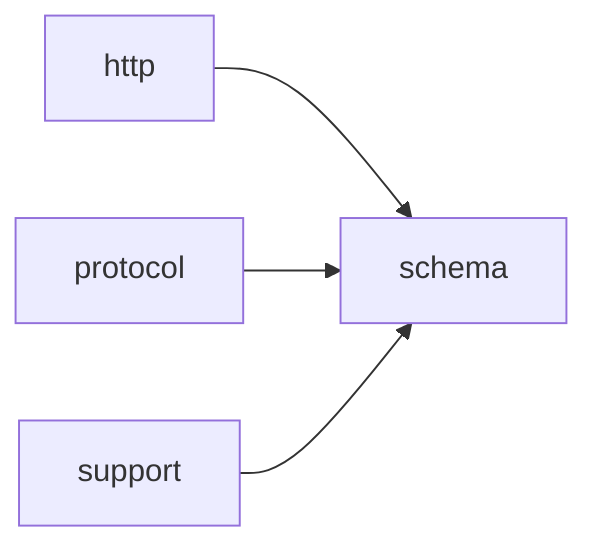

# Module `schema`

## Summary

The module `schema` is responsible for generating and validating JSON Schema definitions used for `OpenAI` API communication. It owns the public interface for producing structured schemas, including `response_format` and `function_tool` functions, which convert C++ types into `OpenAI`-compatible schema objects. Internally, the module provides a comprehensive set of utilities for schema construction, type trait introspection (detecting optional, vector, and array types), schema name sanitization, and validation of schema values, objects, and property constraints. By separating public schema tools from detailed implementation, it enables safe and automatic generation of API request schemas from C++ type definitions.

## Imports

- [`http`](../http/index.md)
- [`protocol`](../protocol/index.md)
- `std`
- [`support`](../support/index.md)

## Imported By

- [`agent:tools`](../agent/tools.md)
- [`anthropic`](../anthropic/index.md)
- [`client`](../client/index.md)
- [`openai`](../openai/index.md)
- [`provider`](../provider/index.md)

## Dependency Diagram

## Types

### `clore::net::openai::schema::detail::array_inner`

Declaration: `network/schema.cppm:72`

Declaration: [`Namespace clore::net::openai::schema::detail`](../../namespaces/clore/net/openai/schema/detail/index.md)

The template struct `clore::net::openai::schema::detail::array_inner` serves as the internal representation of the inner schema of an array within the `OpenAI` schema machinery. Its single template parameter `T` models the item type of the array. Internal invariants ensure that the stored type information adheres to the constraints expected by the `OpenAI` specification for array schemas, and member implementations (such as constructors or accessors) are designed to preserve these invariants when constructing or querying the array’s element schema.

### `clore::net::openai::schema::detail::is_array`

Declaration: `network/schema.cppm:63`

Definition: `network/schema.cppm:63`

Declaration: [`Namespace clore::net::openai::schema::detail`](../../namespaces/clore/net/openai/schema/detail/index.md)

The template struct `clore::net::openai::schema::detail::is_array` is a type trait whose primary template inherits from `std::false_type`, providing a static `value` constant equal to `false`. This default implementation establishes the baseline invariant that an arbitrary type `T` is not considered an array in the context of the Clore `OpenAI` schema. The struct contains no additional members or member functions; its sole functionality is derived from the base class. Specializations of `is_array` that inherit from `std::true_type` are expected to be defined separately to mark specific types as array-like, thereby enabling differentiated schema generation logic.

#### Invariants

- Primary template always yields `false` for the `value` member
- Inherits from `std::false_type`, not `std::integral_constant` directly
- Template parameter `T` is unconstrained

#### Key Members

- Inherited `static constexpr bool value` from `std::false_type`

#### Usage Patterns

- Used as a type trait in compile-time checks for array types
- Likely specialized for array forms (e.g., `T[]`, `T[N]`) to enable SFINAE or `enable_if` conditions

### `clore::net::openai::schema::detail::is_optional`

Declaration: `network/schema.cppm:23`

Definition: `network/schema.cppm:23`

Declaration: [`Namespace clore::net::openai::schema::detail`](../../namespaces/clore/net/openai/schema/detail/index.md)

The primary template for `clore::net::openai::schema::detail::is_optional` inherits from `std::false_type`, establishing a default value of `false` for all types. This type trait is designed to be specialised for `std::optional<T>`, where the specialised form would inherit from `std::true_type`. The invariant enforced by the primary template is that any type not explicitly recognised as an `std::optional` is considered non‑optional. There are no member implementations beyond the inherited static constant `value` from `std::false_type`, making the trait a straightforward compile‑time flag.

#### Invariants

- Inherits from `std::false_type`
- Member `value` is always `false` for the primary template
- Member `type` is `std::false_type`

#### Key Members

- Inherited constant `is_optional<T>::value`
- Inherited type `is_optional<T>::type`

#### Usage Patterns

- Used as a default trait in generic code that checks whether a type is optional
- Expected to be specialized for `std::optional` and similar wrapper types

### `clore::net::openai::schema::detail::is_vector`

Declaration: `network/schema.cppm:43`

Definition: `network/schema.cppm:43`

Declaration: [`Namespace clore::net::openai::schema::detail`](../../namespaces/clore/net/openai/schema/detail/index.md)

The struct `clore::net::openai::schema::detail::is_vector` is a template type trait serving as the primary (default) definition within a set of specializations that detect whether a given type `T` represents a vector. It inherits from `std::false_type`, establishing a constant member `value` equal to `false`. This base implementation provides the fallback for all types that are not recognized as vectors. Specializations of this trait (not shown) will inherit from `std::true_type` for specific vector-like types. The trait is defined in the `detail` namespace, indicating it is an internal implementation helper rather than part of the public API. Its key invariant is that the primary template always evaluates to false; the correct detection is achieved only through explicit specializations.

#### Invariants

- Always provides a `value` member constant of type `bool` (inherited from `std::false_type`).
- The primary template unconditionally declares `value == false`.

#### Key Members

- Inherited member `value` (static constexpr bool).
- Inherited member `type` (alias for `std::false_type`).

#### Usage Patterns

- Used within the `clore::net::openai::schema::detail` namespace as a type trait to distinguish vectors from other types.
- Expected to be specialized for `std::vector` to enable compile-time branching on whether a type is a vector.

### `clore::net::openai::schema::detail::optional_inner`

Declaration: `network/schema.cppm:32`

Declaration: [`Namespace clore::net::openai::schema::detail`](../../namespaces/clore/net/openai/schema/detail/index.md)

The `clore::net::openai::schema::detail::optional_inner` struct is a template parameterized by a single type `T`. It is declared within the `schema.cppm` module file and resides in the `detail` namespace, marking it as an internal implementation component not exposed through the public API. The struct’s definition provides the foundational type abstraction used by the optional schema facilities.

#### Invariants

- No invariants are evident from the provided source snippets.

#### Key Members

- No key members are evident from the provided source snippets.

#### Usage Patterns

- No usage patterns are evident from the provided source snippets.

### `clore::net::openai::schema::detail::schema_subject`

Declaration: `network/schema.cppm:83`

Definition: `network/schema.cppm:83`

Declaration: [`Namespace clore::net::openai::schema::detail`](../../namespaces/clore/net/openai/schema/detail/index.md)

The `schema_subject` struct is a minimal type transformation wrapper. Its sole purpose is to expose a nested `type` alias defined as `std::remove_cvref_t<T>`. This strips any `const`, `volatile`, and reference qualifiers from the template parameter `T`, yielding the underlying unqualified type. The implementation contains no data members, no constructors, no member functions – only the `type` alias. There are no invariants to enforce because the struct is stateless; the correctness of the alias depends entirely on the standard library’s `std::remove_cvref_t` metafunction for any given `T`.

#### Invariants

- The `type` alias is always `std::remove_cvref_t<T>`.
- The struct has no other members or methods.
- The template parameter `T` must be a complete type for alias resolution (though this is typical for type traits).

#### Key Members

- `type` alias

#### Usage Patterns

- Used internally to obtain the canonical type of a schema subject.
- Likely employed in template metaprogramming to normalize types before schema generation.

### `clore::net::openai::schema::detail::schema_subject_t`

Declaration: `network/schema.cppm:95`

Declaration: [`Namespace clore::net::openai::schema::detail`](../../namespaces/clore/net/openai/schema/detail/index.md)

The alias `schema_subject_t` is defined as `typename schema_subject<T>::type`, making it a dependent type that resolves the `type` member of the `schema_subject<T>` trait. This trait is a metafunction responsible for mapping a given C++ type `T` to its corresponding "subject" type used in schema computation (e.g., for `OpenAI` API request/response schemas). The alias simply shortens the pattern `typename schema_subject<T>::type` where the trait is expected to be specialized for various types.

Internally, the correctness of `schema_subject_t` relies on `schema_subject<T>` being a complete type that defines a nested `type`. The trait resides in the `detail` namespace, indicating it is an implementation helper not intended for direct external use. Because it is an alias template, it inherits the template parameter `T` and does not introduce additional constraints or logic of its own; it merely re-exposes the result of the trait's specialization for `T`.

#### Invariants

- The type `schema_subject_t<T>` is well-defined only if `schema_subject<T>` is a complete type with an accessible `type` member.
- The alias does not constrain the set of types `T` for which it is valid; validity is determined by the specialization of `schema_subject`.

#### Key Members

- The nested `type` alias in `schema_subject<T>`
- The alias template `schema_subject_t<T>` itself

#### Usage Patterns

- Used wherever the subject type of a schema for a given type `T` needs to be referenced.
- Often appears in return types or template arguments of other traits and utilities within the `detail` namespace.

### `clore::net::openai::schema::detail::vector_inner`

Declaration: `network/schema.cppm:52`

Declaration: [`Namespace clore::net::openai::schema::detail`](../../namespaces/clore/net/openai/schema/detail/index.md)

The struct `clore::net::openai::schema::detail::vector_inner` is a template implementation detail parameterized on `T`. It serves as the internal storage and management layer for contiguous sequences of elements used by higher‑level schema constructs. The type guarantees that the underlying buffer is properly allocated and deallocated via RAII, and that the element count remains consistent with the allocated capacity. All iteration and element access performed by the enclosing classes rely on the invariants maintained by `vector_inner`—most notably, that the pointer to the first element is always valid when the size is positive, and that no external mutation of the internal state is permitted outside the controlled member functions.

#### Usage Patterns

- Used internally by the `clore::net::openai::schema` module as a building block for vector schema types.
- Templated on the inner element type `T`, likely to allow type-safe representation of vector elements in the schema.

## Variables

### `clore::net::openai::schema::detail::is_array_v`

Declaration: `network/schema.cppm:69`

Declaration: [`Namespace clore::net::openai::schema::detail`](../../namespaces/clore/net/openai/schema/detail/index.md)

As a `constexpr` constant, it is read-only and not mutated after initialization. It is intended to be used in template metaprogramming for compile-time type checks, similar to `std::is_array_v`. The evidence shows its declaration but does not provide explicit usage examples.

#### Mutation

No mutation is evident from the extracted code.

### `clore::net::openai::schema::detail::is_optional_v`

Declaration: `network/schema.cppm:29`

Declaration: [`Namespace clore::net::openai::schema::detail`](../../namespaces/clore/net/openai/schema/detail/index.md)

This variable template evaluates to `true` at compile time if `T` satisfies the criteria for an optional type, likely based on specialization or SFINAE. As a `constexpr` boolean, it is used in template metaprogramming contexts to conditionally enable or disable certain code paths, particularly for JSON schema generation or validation logic. There is no evidence that `clore::net::openai::schema::detail::is_optional_v` is mutated after initialization; its value is determined entirely at compile time.

#### Mutation

No mutation is evident from the extracted code.

### `clore::net::openai::schema::detail::is_vector_v`

Declaration: `network/schema.cppm:49`

Declaration: [`Namespace clore::net::openai::schema::detail`](../../namespaces/clore/net/openai/schema/detail/index.md)

This `constexpr bool` is read at compile time to discriminate between vector and non-vector types within the schema parsing logic. It is never mutated after initialization, as it is defined as a constant expression.

#### Mutation

No mutation is evident from the extracted code.

#### Usage Patterns

- checked in template conditional branches
- used as a type trait in `enable_if` or `if constexpr`
- referenced alongside traits like `is_optional_v` and `is_array_v`

## Functions

### `clore::net::detail::validate_response_format`

Declaration: `network/schema.cppm:527`

Definition: `network/schema.cppm:535`

Declaration: [`Namespace clore::net::detail`](../../namespaces/clore/net/detail/index.md)

The function begins by checking whether the optional `schema` member of the incoming `ResponseFormat` is absent; if so, it immediately returns a valid `std::expected<void, LLMError>`. Otherwise it validates that `format.name` is non‑empty, returning `std::unexpected(LLMError(...))` on failure. Finally it delegates to `openai::schema::detail::validate_openai_schema`, passing the dereferenced schema object, the format name as a `std::string_view` path, and `true` for the `is_root` parameter. This internal call relies on the full `OpenAI` schema validation pipeline defined in namespace `clore::net::openai::schema::detail`.

#### Side Effects

No observable side effects are evident from the extracted code.

#### Reads From

- format`.schema`
- format`.name`

#### Usage Patterns

- Called during completion request processing to validate the `response_format` part of a request.
- Used in conjunction with `validate_completion_request` to ensure the response format specification is correct.

### `clore::net::detail::validate_tool_definition`

Declaration: `network/schema.cppm:529`

Definition: `network/schema.cppm:545`

Declaration: [`Namespace clore::net::detail`](../../namespaces/clore/net/detail/index.md)

The function first checks that the `name` field of the provided `FunctionToolDefinition` object is not empty, returning a `LLMError` with a descriptive message if it is. It then performs the same emptiness check on the `description` field, formatting the error message to include the tool `name`. After these two preconditions pass, it delegates the remaining validation of the tool’s parameters schema to `openai::schema::detail::validate_openai_schema`, passing `tool.parameters`, the `tool.name` as the schema path, and `true` for the `is_root` flag. The control flow is purely sequential: early returns on invalid input, then a single call to the schema validation subsystem.

#### Side Effects

No observable side effects are evident from the extracted code.

#### Reads From

- `tool.name`
- `tool.description`
- `tool.parameters`

#### Usage Patterns

- Validating tool definitions before registration or use
- Ensuring required fields are present in `FunctionToolDefinition`

### `clore::net::openai::schema::detail::make_any_of_schema`

Declaration: `network/schema.cppm:156`

Definition: `network/schema.cppm:156`

Declaration: [`Namespace clore::net::openai::schema::detail`](../../namespaces/clore/net/openai/schema/detail/index.md)

The function constructs a JSON schema object representing an `anyOf` composition. It first attempts to create an empty JSON object and an empty JSON array using `clore::net::detail::make_empty_object` and `clore::net::detail::make_empty_array`; if either helper fails, the error is immediately propagated as an `std::unexpected`. After both resources are successfully allocated, it iterates over the input `choices` vector, moving each schema value into the array. It then inserts the completed array under the key `"anyOf"` into the object and returns the resulting `json::Value`. The entire routine is a straightforward builder that delegates error handling to its dependencies and has no branching beyond the early-exit guards for allocation failures.

#### Side Effects

- Allocates dynamic memory for JSON object and array via `make_empty_object` and `make_empty_array`
- Moves elements from the input `choices` vector into the created array
- Modifies the created JSON object by inserting the array under the key `"anyOf"`

#### Reads From

- Input parameter `choices` (values moved from)

#### Writes To

- Allocated `json::Object` (via `make_empty_object`)
- Allocated `json::Array` (via `make_empty_array`)
- Returned `json::Value` (the constructed schema object)

#### Usage Patterns

- Used to construct `OpenAI`-compatible `anyOf` schema objects
- Called when generating schema definitions for types with multiple alternatives
- Part of the schema construction pipeline in `clore::net::openai::schema`

### `clore::net::openai::schema::detail::make_scalar_type_schema`

Declaration: `network/schema.cppm:146`

Definition: `network/schema.cppm:146`

Declaration: [`Namespace clore::net::openai::schema::detail`](../../namespaces/clore/net/openai/schema/detail/index.md)

The function `clore::net::openai::schema::detail::make_scalar_type_schema` constructs a minimal JSON Schema object representing a scalar type. It takes a `std::string_view` parameter `type_name` (e.g., `"string"` or `"number"`) and returns a `std::expected<json::Value, LLMError>`. Internally, it first calls `clore::net::detail::make_empty_object` to obtain a base JSON object. If that call fails (returning an `LLMError`), the error is immediately propagated via `std::unexpected`. Otherwise, the function inserts a key `"type"` with the value `type_name` into the object and wraps the result in a `json::Value`. The sole dependency beyond core JSON types is `make_empty_object`, which handles the initial object creation and error reporting. There are no loops, conditionals beyond the error check, or further branching—the control flow is linear: allocate object, insert field, return.

#### Side Effects

- allocates a JSON object
- allocates a string for the type name
- returns a JSON value that owns allocated memory

#### Reads From

- `type_name` parameter

#### Writes To

- the returned JSON object (by inserting a `type` field)

#### Usage Patterns

- used to create JSON schema objects for scalar types like `"string"`, `"integer"`, `"boolean"`, etc.
- likely called by higher-level schema generation functions that map C++ types to `OpenAI` API schema

### `clore::net::openai::schema::detail::make_schema_object`

Declaration: `network/schema.cppm:132`

Definition: `network/schema.cppm:132`

Declaration: [`Namespace clore::net::openai::schema::detail`](../../namespaces/clore/net/openai/schema/detail/index.md)

The implementation of `clore::net::openai::schema::detail::make_schema_object` serves as a top-level entry point for generating a JSON Schema object from a C++ type `T`. Internally, it calls `make_schema_value<T>()` to produce a `json::Value`. If that call fails (returning an unexpected `LLMError`), the error is propagated immediately. Otherwise, it attempts to extract a `json::Object` pointer from the resulting `json::Value`; a null pointer indicates the generated schema root is not an object, leading to an `LLMError`. If both checks pass, a copy of the `json::Object` is returned.

The function’s control flow is linear with two early-exit error paths. Its primary dependency is `make_schema_value`, which recursively builds the schema representation from the type `T`. Error handling relies on the `LLMError` type, and the JSON data structures (`json::Value`, `json::Object`) are provided by the library’s JSON layer.

#### Side Effects

No observable side effects are evident from the extracted code.

#### Reads From

- result of `clore::net::openai::schema::detail::make_schema_value<T>()`

#### Writes To

- returned `std::expected<json::Object, LLMError>` object

#### Usage Patterns

- used to generate a JSON schema object for type `T`
- called within schema generation pipeline

### `clore::net::openai::schema::detail::make_schema_value`

Declaration: `network/schema.cppm:129`

Definition: `network/schema.cppm:225`

Declaration: [`Namespace clore::net::openai::schema::detail`](../../namespaces/clore/net/openai/schema/detail/index.md)

The function `clore::net::openai::schema::detail::make_schema_value` is a template that generates a JSON schema value for a given type `T`. It follows a compile-time dispatch pattern using `if constexpr` on the resolved `schema_subject_t<T>` type. For scalar types (e.g. `std::string`, `bool`, integral, floating-point), it delegates to `make_scalar_type_schema` with the appropriate JSON type string. When `T` is an `std::optional`, it recursively generates an inner schema and a `null` schema, then combines both into an `anyOf` schema via `make_any_of_schema`. For `std::vector` and `std::array`, it produces an array-type schema by first generating the item schema through recursion, then populating a JSON object with `"type": "array"`, the `"items"` key, and for arrays also `"minItems"` and `"maxItems"` equal to the compile‑time size. For reflectable class types, it creates an empty schema object using `clore::net::detail::make_empty_object` and fills it via `populate_object_schema` with a compile‑time index sequence over the class fields. Error handling uses `std::expected` throughout: each sub‑operation returns a value or an error, which is propagated by early returning `std::unexpected` on failure. The function depends on type traits (`is_optional_v`, `is_vector_v`, `is_array_v`), inner type aliases (e.g. `vector_inner_t`, `optional_inner_t`), and the `schema_subject_t` trait to determine the effective schema type.

#### Side Effects

- allocates new `json::Value` and `json::Object` objects
- transfers ownership of error values via `std::move`

#### Reads From

- template parameter `T` through type traits `schema_subject_t`, `is_optional_v`, `is_vector_v`, `is_array_v`, `meta::reflectable_class`
- `std::tuple_size_v` for fixed-size arrays

#### Writes To

- local variables of types `std::expected<json::Value, LLMError>`, `json::Value`, `json::Object`
- returned `std::expected` object

#### Usage Patterns

- recursively called for inner types of `std::optional`, `std::vector`, `std::array`
- used internally by other schema generation functions in the same namespace

### `clore::net::openai::schema::detail::populate_object_schema`

Declaration: `network/schema.cppm:173`

Definition: `network/schema.cppm:173`

Declaration: [`Namespace clore::net::openai::schema::detail`](../../namespaces/clore/net/openai/schema/detail/index.md)

The function `populate_object_schema` constructs a JSON schema object for use with `OpenAI` `APIs`. It first statically asserts that all field schemas within the target class `Object` are valid using `meta_attrs::validate_field_schema`. Two JSON containers—a properties object and a required array—are allocated via `clore::net::detail::make_empty_object` and `make_empty_array`, with early return on allocation failure.

A lambda `append_field` is defined to handle each field index from the provided `std::index_sequence`. For each index it resolves the field schema via `meta_attrs::resolve_field`; skipped fields are ignored, flattened fields cause an immediate error, and normal fields generate a schema value using `make_schema_value`. The resulting value is inserted into the properties object and the field’s canonical name is appended to the required array. The lambda is invoked for every index via pack expansion, and all results are collected into an array `statuses`; any failure aborts the operation and returns the error. On success, the outer object is populated with the required `OpenAI` keys: `"type": "object"`, the built properties object, the required array, and `"additionalProperties": false`.

#### Side Effects

- mutates the `json::Object` argument by inserting schema keys
- allocates temporary `json::Object` and `json::Array` via `make_empty_object` and `make_empty_array`
- moves resources into the output object

#### Reads From

- template parameters `Object` and `Indices`
- field metadata via `meta_attrs::resolve_field`

#### Writes To

- the `json::Object` reference object (inserts keys `"type"`, `"properties"`, `"required"`, `"additionalProperties"`)
- temporary local objects `properties` and `required` (later moved into `object`)

#### Usage Patterns

- invoked during `OpenAI` JSON schema generation for C++ types
- used with `std::index_sequence` to iterate over struct fields
- called from higher-level schema-building functions

### `clore::net::openai::schema::detail::sanitize_schema_name`

Declaration: `network/schema.cppm:97`

Definition: `network/schema.cppm:97`

Declaration: [`Namespace clore::net::openai::schema::detail`](../../namespaces/clore/net/openai/schema/detail/index.md)

The implementation of `sanitize_schema_name` follows a simple two‑pass algorithm. It first constructs a sanitized string by iterating over each character in the input `raw_name`. Each character is cast to `unsigned char` and tested for membership in the alphanumeric ranges (`'a'`–`'z'`, `'A'`–`'Z'`, `'0'`–`'9'`); characters that pass are copied verbatim, while all other characters are replaced with an underscore (`'_'`). After building this intermediate string, a pair of loops trim any leading or trailing underscores by erasing from the front or popping from the back, respectively. The function returns the resulting `std::string`.

The algorithm has no external dependencies beyond the C++ standard library (`std::string`, `std::string_view`). It uses `reserve` to preallocate memory equal to the input length, minimising reallocations during the linear scan. The control flow is purely sequential with no branches or recursion, making the function straightforward and predictable.

#### Side Effects

- Allocates a new `std::string` object and returns it by value, transferring ownership

#### Reads From

- `raw_name` `string_view` parameter

#### Writes To

- Returned `std::string` object

#### Usage Patterns

- Called to sanitize schema names for use in JSON schema property names
- Replaces invalid characters with underscores before further schema processing

### `clore::net::openai::schema::detail::schema_type_name`

Declaration: `network/schema.cppm:120`

Definition: `network/schema.cppm:120`

Declaration: [`Namespace clore::net::openai::schema::detail`](../../namespaces/clore/net/openai/schema/detail/index.md)

The implementation of `clore::net::openai::schema::detail::schema_type_name` first retrieves the human‑readable representation of the template parameter `T` by calling `meta::type_name<T>()`. This raw name is then passed to `sanitize_schema_name`, which cleans and normalizes it into a valid schema identifier. The result is stored in a local variable `sanitized`. If `sanitized` is empty, the function returns `std::unexpected` with an `LLMError` indicating the generated name is empty; otherwise it returns the sanitized string directly.

The algorithm is straightforward: a single sanitization step followed by a validity check. Its primary dependency is the `sanitize_schema_name` helper, which itself relies on character‑by‑character processing of the type name string. The function does not perform any JSON construction or validation—those tasks are delegated to other functions in the `detail` namespace.

#### Side Effects

No observable side effects are evident from the extracted code.

#### Reads From

- `meta::type_name<T>()`
- `sanitize_schema_name` result

#### Usage Patterns

- used to generate a valid schema type name
- called by schema construction functions
- provides error handling for empty type names

### `clore::net::openai::schema::detail::validate_openai_schema`

Declaration: `network/schema.cppm:328`

Definition: `network/schema.cppm:373`

Declaration: [`Namespace clore::net::openai::schema::detail`](../../namespaces/clore/net/openai/schema/detail/index.md)

The function begins by extracting an `ObjectView` from the input JSON object and immediately checking for an `anyOf` field. If present and `is_root` is true, it fails; otherwise it validates each entry in the `anyOf` array via repeated calls to `validate_openai_schema_value`, using formatted paths to track location. Next it retrieves the `type` field, which must be either a string or a string array. For an array type, it calls `validate_schema_array_of_types` and then selects the first non‑null type string as the effective `schema_type`. Should the `type` be missing or malformed, the function returns an error. If the schema is a root schema and `schema_type` is not `"object"`, validation fails immediately.

When `schema_type` is `"object"`, the function requires `properties`, `required`, and `additionalProperties` (set to `false`). It validates that every required property exists in `properties` via `validate_required_properties`, then recursively validates each property value with `validate_openai_schema_value`. For `"array"` schemas, it retrieves `items` and validates that single sub‑schema recursively. After handling type‑specific logic, the function checks for a `$defs` key and recursively validates every definition. All sub‑validations rely on the helper `validate_openai_schema_value` and on utility functions such as `ObjectView::get`, `expect_array`, and `expect_object`. The overall algorithm is a depth‑first recursive descent with strict structural checks and immediate error propagation via `std::expected`.

#### Side Effects

No observable side effects are evident from the extracted code.

#### Reads From

- the `object` parameter (`const json::Object&`)
- the `path` parameter (`std::string_view`)
- the `is_root` parameter (`bool`)
- fields of the JSON object via `ObjectView` and `get` methods

#### Usage Patterns

- called to validate a top-level or nested `OpenAI` schema object
- used during schema construction to ensure compliance
- invoked from `validate_openai_schema_value` for recursive validation

### `clore::net::openai::schema::detail::validate_openai_schema_value`

Declaration: `network/schema.cppm:331`

Definition: `network/schema.cppm:331`

Declaration: [`Namespace clore::net::openai::schema::detail`](../../namespaces/clore/net/openai/schema/detail/index.md)

The function first delegates to `clore::net::detail::expect_object` to verify that the input `value` is a JSON object and to extract that object. If the extraction fails, the resulting error is propagated immediately as `std::unexpected`. Otherwise, the function forwards the extracted object, along with `path` and `is_root`, to the core validation routine `clore::net::openai::schema::detail::validate_openai_schema`, which performs the actual schema‑conformance checks. The call chain thus reuses the object‑validation logic without duplication, keeping the entry point thin.

#### Side Effects

No observable side effects are evident from the extracted code.

#### Reads From

- `value` parameter
- `path` parameter
- `is_root` parameter
- `json::Object` accessed via `expect_object`

#### Usage Patterns

- Validate a raw JSON value as an `OpenAI` schema object
- Used at the root or nested schema validation entry point

### `clore::net::openai::schema::detail::validate_openai_schema_value`

Declaration: `network/schema.cppm:340`

Definition: `network/schema.cppm:340`

Declaration: [`Namespace clore::net::openai::schema::detail`](../../namespaces/clore/net/openai/schema/detail/index.md)

This function validates that the JSON value referenced by a `clore::net::json::Cursor` is a JSON object, then hands off all further validation to `clore::net::openai::schema::detail::validate_openai_schema`. It first attempts to extract an object from the cursor by calling `clore::net::detail::expect_object`, passing the cursor and the current `path`. If that extraction fails, the error from `expect_object` is immediately wrapped into `std::unexpected` and returned. On success, the function dereferences the returned `std::expected` and invokes `validate_openai_schema` on the resulting `json::Object`, forwarding the same `path` and `is_root` parameters.

The control flow is linear: a single early‑exit on object‑extraction failure, followed by delegation to the core validation routine. The only dependencies are the `expect_object` utility for converting a cursor into a validated object reference and the `validate_openai_schema` function that performs the actual schema‑structure checks. This function serves as the entry point for validation starting from a cursor, ensuring the input is an object before proceeding.

#### Side Effects

No observable side effects are evident from the extracted code.

#### Reads From

- `value` (`json::Cursor`)
- `path` (`std::string_view`)
- `is_root` (bool)
- the underlying JSON object obtained from the cursor

#### Usage Patterns

- Validating a schema value from a JSON cursor at a given path
- Used as a convenience wrapper around `validate_openai_schema` for cursor input

### `clore::net::openai::schema::detail::validate_required_properties`

Declaration: `network/schema.cppm:349`

Definition: `network/schema.cppm:349`

Declaration: [`Namespace clore::net::openai::schema::detail`](../../namespaces/clore/net/openai/schema/detail/index.md)

The function constructs an `std::unordered_set<std::string>` of property names from the `required` array by iterating over each element, calling `clore::net::detail::expect_string` to extract a string value, and inserting it into the set. It then iterates over every entry in the `properties` object view. For each property, it checks whether its key is present in the set of required names; if any property is missing, it immediately returns an `std::unexpected` with an `LLMError` describing the path and key. If all properties are accounted for, it returns a success value.

The algorithm relies on `clore::net::detail::expect_string` for safe string extraction and uses `std::format` to produce diagnostics. The dependency on `clore::net::detail::ObjectView` and `ArrayView` is limited to iteration and key access. The function serves as a validation step ensuring that every declared property in a schema object appears in the required list, a constraint typical of strict structured output modes.

#### Side Effects

- allocates memory for the `unordered_set` and strings
- moves an `LLMError` into the returned `std::expected` on failure

#### Reads From

- parameter `properties`
- parameter `required`
- parameter `path`
- elements of the `required` array via `clore::net::detail::expect_string`
- keys of the `properties` entries

#### Usage Patterns

- called during schema validation to enforce that all properties are required
- used when constructing schemas for strict structured output mode in `OpenAI` API

### `clore::net::openai::schema::detail::validate_schema_array_of_types`

Declaration: `network/schema.cppm:295`

Definition: `network/schema.cppm:295`

Declaration: [`Namespace clore::net::openai::schema::detail`](../../namespaces/clore/net/openai/schema/detail/index.md)

The function iterates over each element of the input `json::Array`, extracting the type string via `clore::net::detail::expect_string` and tracking whether a `"null"` type has been seen. It enforces that at most one non-null type appears in the union; if a second concrete type is encountered it returns an error indicating an unsupported multi-type union. After processing the entire array, it validates additional constraints: if `is_root` is `true` it rejects a nullable root schema, and if the union does not contain exactly one concrete type together with `"null"` (i.e., a single non-null type plus null) it returns an error. The function depends on `clore::net::detail::expect_string` for type extraction and `LLMError` for structured error reporting, and uses `std::format` to produce descriptive error messages that include the schema `path`.

#### Side Effects

No observable side effects are evident from the extracted code.

#### Reads From

- `array` parameter
- `path` parameter
- `is_root` parameter

#### Usage Patterns

- called during schema validation to enforce type union constraints
- typically invoked when processing a schema's `type` field that is an array

### `clore::net::schema::function_tool`

Declaration: `network/schema.cppm:520`

Definition: `network/schema.cppm:584`

Declaration: [`Namespace clore::net::schema`](../../namespaces/clore/net/schema/index.md)

The function begins by validating that both `name` and `description` are non-empty, returning `std::unexpected` with an error message if either check fails. It then determines the root type via the alias `schema_subject_t<T>` and asserts, via a static assertion on `kota::meta::reflectable_class<root_type>`, that the type is reflectable. Next, it delegates schema construction to `openai::schema::detail::make_schema_object<root_type>()`, which generates a complete JSON Schema object for the reflectable type. If schema generation fails, the error is propagated. On success, the function builds a `FunctionToolDefinition` by moving the generated parameters schema into the `.parameters` field, setting `.name` and `.description` from the input arguments, and forcing `.strict` to `true`. The primary dependencies are the `openai::schema::detail` internal schema‑building utilities and the static reflection infrastructure provided by `kota::meta`.

#### Side Effects

No observable side effects are evident from the extracted code.

#### Reads From

- parameter `name`
- parameter `description`
- the template parameter `T` (via `make_schema_object` and static reflection)

#### Writes To

- returned `FunctionToolDefinition` object (including moved `name`, `description`, `parameters`)

#### Usage Patterns

- Instantiated with a reflectable type to generate a tool definition for an LLM function call

### `clore::net::schema::response_format`

Declaration: `network/schema.cppm:517`

Definition: `network/schema.cppm:561`

Declaration: [`Namespace clore::net::schema`](../../namespaces/clore/net/schema/index.md)

The function first deduces the root type via the trait `clore::net::openai::schema::detail::schema_subject_t<T>` and statically asserts that it is a reflectable class. It then calls `clore::net::openai::schema::detail::schema_type_name<root_type>()` to derive a descriptive name for the schema; if this fails, the error is propagated immediately via `std::unexpected`. Next, `clore::net::openai::schema::detail::make_schema_object<root_type>()` constructs the full JSON Schema object, again forwarding any failure. On success, the two values are packed into a `clore::net::schema::ResponseFormat` with the `strict` field set to `true`. The entire flow is sequential and relies on the `std::expected` monadic pattern, unwinding early on any error from the internal JSON Schema generation or naming helpers.

#### Side Effects

No observable side effects are evident from the extracted code.

#### Reads From

- `T` via template instantiation
- `openai::schema::detail::schema_type_name`
- `openai::schema::detail::make_schema_object`

#### Usage Patterns

- used to configure structured output for LLM calls
- obtains a `ResponseFormat` for a reflectable type

## Internal Structure

The `schema` module is organised into a clear public API and an extensive internal detail layer. The public surface provides `response_format<T>()` and `function_tool<T>(string, string)` for constructing `OpenAI`-compatible schema representations of C++ types. All schema construction logic resides in the `detail` subnamespace, which is decomposed into three layers: compile‑time type traits (e.g., `is_optional`, `is_vector`, `is_array`, `optional_inner`, `vector_inner`, `array_inner`, `schema_subject_t`) that classify types and unwrap containers; schema generation functions (`make_scalar_type_schema`, `make_any_of_schema`, `make_schema_value`, `make_schema_object`, `populate_object_schema`) that build JSON‑Schema objects; and validation routines (`validate_openai_schema`, `validate_openai_schema_value`, `validate_required_properties`, `validate_schema_array_of_types`) that ensure correctness. The module imports `std`, `support`, `http`, and `protocol`, indicating its role in bridging fundamental type information with the network-facing protocol layer.

## Related Pages

- [Module http](../http/index.md)
- [Module protocol](../protocol/index.md)
- [Module support](../support/index.md)

