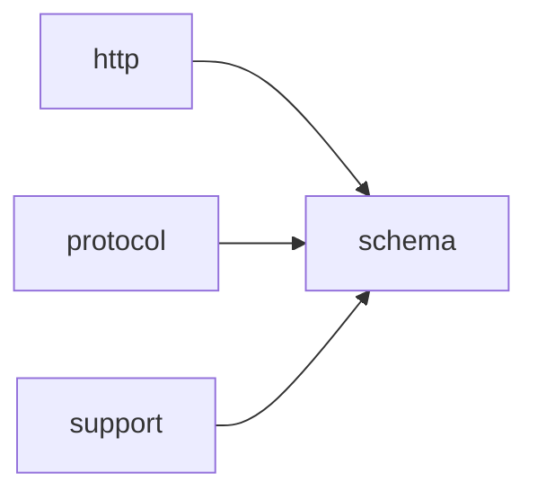

# Module `schema`

## Summary

The `schema` module is responsible for generating `OpenAI`‑compatible JSON Schemas from C++ types and validating those schemas. It provides the underlying implementation for constructing schemas used in LLM tool definitions and response formats, supported by compile‑time type introspection traits that detect containers (`std::vector`, `std::array`, `std::optional`) and extract their element types. The public API consists of the template functions `response_format` and `function_tool` within the `clore::net::schema` namespace, which produce schema representations for LLM interactions. Internal helpers handle schema creation (`make_schema_object`, `make_schema_value`, `populate_object_schema`, etc.), name sanitization, and validation routines that ensure JSON values, required‑property lists, type arrays, and entire schema objects conform to the expected constraints. These facilities are used by the higher‑level `protocol` module to enforce consistency in network communication.

## Imports

- [`http`](../http/index.md)
- [`protocol`](../protocol/index.md)
- [`support`](../support/index.md)

## Imported By

- [`agent:tools`](../agent/tools.md)
- [`anthropic`](../anthropic/index.md)
- [`client`](../client/index.md)
- [`openai`](../openai/index.md)
- [`provider`](../provider/index.md)

## Dependency Diagram

```mermaid
graph LR
    M0["schema"]
    I0["http"]
    I0 --> M0
    I1["protocol"]
    I1 --> M0
    I2["support"]
    I2 --> M0
```

## Types

### `clore::net::openai::schema::detail::array_inner`

Declaration: `src/network/schema.cppm:82`

Declaration: [`Namespace clore::net::openai::schema::detail`](../../namespaces/clore/net/openai/schema/detail/index.md)

The struct `clore::net::openai::schema::detail::array_inner` is a template helper that statically extracts the inner element type from an array-like type `T`. Its primary purpose is to support compile‑time deduction of the array’s element type during schema generation. The default definition remains empty or ill‑defined; meaningful implementations are provided through explicit specializations for known array representations (e.g., `std::vector` or `std::array`). An invariant of the implementation is that only types representing an array are valid template arguments, ensuring that misuse results in a compilation error. The struct typically exposes a nested `type` alias or a static constant used by higher‑level schema construction machinery.

#### Invariants

- Template parameter `T` determines the element type of the array
- Instantiations are expected to be valid for types used in array schemas

#### Usage Patterns

- Used internally within the `OpenAI` schema generation to model array element types
- Likely specialized or instantiated for different element types

### `clore::net::openai::schema::detail::is_array`

Declaration: `src/network/schema.cppm:73`

Definition: `src/network/schema.cppm:73`

Declaration: [`Namespace clore::net::openai::schema::detail`](../../namespaces/clore/net/openai/schema/detail/index.md)

The template `clore::net::openai::schema::detail::is_array` serves as the primary definition of a type trait whose sole invariant is that its static `value` member (inherited from `std::false_type`) is `false`. This base template provides the default behavior for types that are not arrays. The struct itself contains no data members or member functions beyond those inherited from the standard false type; its implementation is trivial and exists solely to be specialized for array forms, enabling compile‑time detection of array types. The true purpose of this struct is realized through explicit or partial specializations (not shown here), which would override the inherited `value` to be `true` for appropriate array‑like types.

#### Invariants

- The value is `false` for all non-specialized types.
- Template parameter `T` can be any type.
- Specializations for array types provide `true` value.

#### Key Members

- Inherited `value` member constant.
- Inherited `type` definition (`std::false_type`).

#### Usage Patterns

- Used as a type trait to query whether a type is an array.
- Likely specialized for `T[]` and `T[N]` to inherit from `std::true_type`.
- Employed in template metaprogramming within the `clore::net::openai::schema` namespace.

### `clore::net::openai::schema::detail::is_optional`

Declaration: `src/network/schema.cppm:33`

Definition: `src/network/schema.cppm:33`

Declaration: [`Namespace clore::net::openai::schema::detail`](../../namespaces/clore/net/openai/schema/detail/index.md)

The struct `clore::net::openai::schema::detail::is_optional` is a primary template for a type trait that defaults to `std::false_type`. It serves as a detection mechanism to determine whether a given type `T` is a specialization of `std::optional`. By inheriting from `std::false_type`, the base template indicates that any arbitrary type is not optional; only explicit specializations (not shown here) that inherit from `std::true_type` will mark a type as optional. This trait is defined in the `detail` namespace, indicating it is an internal implementation helper used to guide template metaprogramming within the schema layer, likely to enable conditional logic for handling optional fields in `OpenAI` API message structures.

#### Invariants

- Default `value` is always `false` unless explicitly specialized.
- Inherits all members from `std::false_type`, including `value`, `type`, and `operator()`.

#### Key Members

- `value` (inherited, compile-time boolean constant)
- `type` (inherited, `std::integral_constant<bool, false>`)

#### Usage Patterns

- Used in `std::enable_if` or `if constexpr` to conditionally handle optional types.
- Expected to be specialized for types like `std::optional` to provide `value = true`.

### `clore::net::openai::schema::detail::is_vector`

Declaration: `src/network/schema.cppm:53`

Definition: `src/network/schema.cppm:53`

Declaration: [`Namespace clore::net::openai::schema::detail`](../../namespaces/clore/net/openai/schema/detail/index.md)

The template `clore::net::openai::schema::detail::is_vector` provides a default type trait that inherits from `std::false_type`. Its primary template definition contains no member data or functions beyond the inherited `value` constant, which is `false` for all types `T` that are not specializations of `std::vector`. This structure establishes a base case for the trait; user-defined or partial specializations (e.g., for `std::vector<T, Alloc>`) would inherit from `std::true_type` to indicate that a type is a vector. The trait is trivially constructible and empty, serving solely as a compile-time predicate.

#### Invariants

- The primary template always yields `false`.
- Specializations for actual vector types should inherit from `std::true_type`.

#### Key Members

- Inherited `value` (static constexpr bool) from `std::false_type`

#### Usage Patterns

- Used in SFINAE or `enable_if` to conditionally enable functions for vector types.
- Likely employed within `clore::net::openai::schema` namespace to customize handling of vector types.

### `clore::net::openai::schema::detail::optional_inner`

Declaration: `src/network/schema.cppm:42`

Declaration: [`Namespace clore::net::openai::schema::detail`](../../namespaces/clore/net/openai/schema/detail/index.md)

The template struct `optional_inner` is an internal type within the `OpenAI` schema detail namespace, serving as the underlying storage for optional values during JSON serialization and deserialization. Its implementation manages the presence state and the contained value through a combination of a boolean flag and aligned storage, ensuring proper lifetimes and alignment for type `T`.

#### Invariants

- No invariants can be inferred from the given evidence.

#### Key Members

- No key members are documented in the evidence.

#### Usage Patterns

- Expected to be used internally within the `clore::net::openai::schema` module, possibly as a type trait or wrapper.

### `clore::net::openai::schema::detail::schema_subject`

Declaration: `src/network/schema.cppm:93`

Definition: `src/network/schema.cppm:93`

Declaration: [`Namespace clore::net::openai::schema::detail`](../../namespaces/clore/net/openai/schema/detail/index.md)

The template struct `clore::net::openai::schema::detail::schema_subject` is an internal type trait that normalizes a given type `T` by stripping cv-qualifiers and references. Its sole member, the alias `type`, is defined as `std::remove_cvref_t<T>`, ensuring that any type used in schema generation is reduced to its underlying non‑qualified, non‑reference form. This guarantees consistent type identity across different contextual usages (e.g., `const int&` becomes `int`). The implementation is trivial, with no data members or other logic; the entire struct is a thin wrapper around `std::remove_cvref_t`.

### `clore::net::openai::schema::detail::schema_subject_t`

Declaration: `src/network/schema.cppm:105`

Declaration: [`Namespace clore::net::openai::schema::detail`](../../namespaces/clore/net/openai/schema/detail/index.md)

The type alias `clore::net::openai::schema::detail::schema_subject_t` is a template alias that resolves to `typename schema_subject<T>::type`. It serves as a metafunction within the implementation details, providing a shorthand to obtain the type computed by the `schema_subject` template for a given `T`. The alias relies on the invariant that `schema_subject<T>` is a well-defined metafunction (typically a class template or traits type) exposing a `type` member alias. This indirection allows the rest of the internal machinery to refer to the deduced schema category without repeating the dependent name lookup. The implementation is a straightforward using-declaration that defers instantiation until the alias is used, consistent with typical C++ metaprogramming patterns.

#### Invariants

- Must be used only where `schema_subject<T>` defines a nested `type`.
- Alias is always well-formed if the primary template or a specialization is valid.

#### Key Members

- `schema_subject_t` (the alias itself)

#### Usage Patterns

- Used as a shorthand for `typename schema_subject<T>::type` in template metaprogramming.
- Expected to be used in contexts where the subject type for a given type `T` is needed.

### `clore::net::openai::schema::detail::vector_inner`

Declaration: `src/network/schema.cppm:62`

Declaration: [`Namespace clore::net::openai::schema::detail`](../../namespaces/clore/net/openai/schema/detail/index.md)

The `vector_inner` template struct is an internal helper used to represent a vector (array) type within the `OpenAI` schema generation. Internally, it holds a single member of type `T` that specifies the element type of the vector. The primary invariant is that any instance of `vector_inner` must contain a valid `T` object; construction and assignment maintain this invariant through default or value-initialization of the stored element. The struct provides direct access to the inner value, enabling conversion to schema representation and reuse of element‑type information.

## Variables

### `clore::net::openai::schema::detail::is_array_v`

Declaration: `src/network/schema.cppm:79`

Declaration: [`Namespace clore::net::openai::schema::detail`](../../namespaces/clore/net/openai/schema/detail/index.md)

It is declared as `constexpr bool is_array_v` within the `clore::net::openai::schema::detail` namespace. As a compile-time constant, it participates in type trait evaluations to branch on whether a type satisfies array characteristics.

#### Mutation

No mutation is evident from the extracted code.

#### Usage Patterns

- compile-time type trait checks

### `clore::net::openai::schema::detail::is_optional_v`

Declaration: `src/network/schema.cppm:39`

Declaration: [`Namespace clore::net::openai::schema::detail`](../../namespaces/clore/net/openai/schema/detail/index.md)

Its role is to evaluate to `true` if the type `T` is an optional-like type (e.g., `std::optional`). This trait is used in the schema generation logic to conditionally treat optional fields, ensuring that only present values are serialized. It is read exclusively during template instantiation and is never modified.

#### Mutation

No mutation is evident from the extracted code.

### `clore::net::openai::schema::detail::is_vector_v`

Declaration: `src/network/schema.cppm:59`

Declaration: [`Namespace clore::net::openai::schema::detail`](../../namespaces/clore/net/openai/schema/detail/index.md)

No further details are available from the evidence. The variable is a compile-time constant with no observable mutations or usage within the provided snippets.

#### Mutation

No mutation is evident from the extracted code.

## Functions

### `clore::net::detail::validate_response_format`

Declaration: `src/network/schema.cppm:537`

Definition: `src/network/schema.cppm:545`

Declaration: [`Namespace clore::net::detail`](../../namespaces/clore/net/detail/index.md)

The implementation performs two early-exit checks before delegating to the core validation machinery. If `format.schema` has no value, the function returns a default-constructed `std::expected<void, LLMError>`, indicating immediate success. If `format.name` is empty, it returns `std::unexpected` containing an `LLMError` with a descriptive message. Otherwise it invokes `openai::schema::detail::validate_openai_schema`, passing the dereferenced schema value, the format name as the representative path string, and `true` as the `is_root` flag. This flag signals that the schema is being validated at the top‑level response context, which influences required‑property and structure checks within the recursive validation pipeline. The function therefore acts as a thin, safe entry point that enforces the minimal preconditions of a non‑empty name and a present schema before handing off to the more detailed `OpenAI` schema validator.

#### Side Effects

No observable side effects are evident from the extracted code.

#### Reads From

- format`.name`
- format`.schema`
- *(format`.schema`)

#### Usage Patterns

- Validates response format before constructing a request
- Called during request validation

### `clore::net::detail::validate_tool_definition`

Declaration: `src/network/schema.cppm:539`

Definition: `src/network/schema.cppm:555`

Declaration: [`Namespace clore::net::detail`](../../namespaces/clore/net/detail/index.md)

The function first performs two simple validation checks on the input `FunctionToolDefinition`. It verifies that `tool.name` is non-empty; if empty, it returns `std::unexpected` with an `LLMError`. It then checks that `tool.description` is non-empty, returning a formatted error that includes the tool name if the description is missing. These early exits enforce the minimum requirements for a tool definition.

After the string checks pass, the core validation is delegated to `openai::schema::detail::validate_openai_schema`, called with `tool.parameters`, `tool.name` (used as a label in error messages), and the boolean `true` (indicating this is a root-level schema). This external function performs recursive schema validation on the parameters JSON object, enforcing `OpenAI`‑compatible schema rules. The function returns the result of that call — either success or an error — directly to the caller.

#### Side Effects

No observable side effects are evident from the extracted code.

#### Reads From

- `tool.name`
- `tool.description`
- `tool.parameters`

#### Usage Patterns

- Called before using a tool definition in LLM requests
- Used to ensure tool definitions meet validity constraints

### `clore::net::openai::schema::detail::make_any_of_schema`

Declaration: `src/network/schema.cppm:166`

Definition: `src/network/schema.cppm:166`

Declaration: [`Namespace clore::net::openai::schema::detail`](../../namespaces/clore/net/openai/schema/detail/index.md)

The function `clore::net::openai::schema::detail::make_any_of_schema` constructs a JSON schema `anyOf` node from a vector of pre‑generated schema values. It first allocates an empty JSON object via `clore::net::detail::make_empty_object` and an empty JSON array via `clore::net::detail::make_empty_array`. If either allocation fails (returning an unexpected result), the function immediately propagates the error as an `LLMError`. Otherwise, it moves each element of the `choices` vector into the array using a simple for loop, then inserts the completed array under the key `"anyOf"` into the object. The resulting object, wrapped in a `json::Value`, is returned as the expected result.

Internally, the function relies on two lower‑level allocation helpers and performs no validation on the individual choice values; it assumes they have already been properly formed by upstream logic. The control flow is linear with two early‑exit error checks, followed by a straightforward insertion operation. This utility is used within the schema generation pipeline to produce `anyOf` combinators for types that map to multiple JSON schema representations (e.g., `std::optional`, `std::variant`, or unions).

#### Side Effects

- heap allocation for JSON object
- heap allocation for JSON array
- moves elements from input vector into array
- constructs JSON value from object

#### Reads From

- parameter `choices` (vector of `json::Value`)
- error message string literals

#### Writes To

- local variable `object` (`json::Object`)
- local variable `any_of` (`json::Array`)
- return value (`json::Value`)

#### Usage Patterns

- Combines multiple schema choices into an `anyOf` schema for `OpenAI` API
- Called when a type can be one of several alternatives

### `clore::net::openai::schema::detail::make_scalar_type_schema`

Declaration: `src/network/schema.cppm:156`

Definition: `src/network/schema.cppm:156`

Declaration: [`Namespace clore::net::openai::schema::detail`](../../namespaces/clore/net/openai/schema/detail/index.md)

The function creates a minimal JSON schema object for a scalar type by first calling `clore::net::detail::make_empty_object` to obtain an empty JSON object, returning early with an error if that operation fails. On success, it inserts a `"type"` field into the object using the supplied `type_name` string and wraps the result in a `json::Value`. Error propagation relies on `std::expected<json::Value, LLMError>`, with the failure path forwarding the error from `make_empty_object`. No further validation or transformation is performed on the type name; it is used as a verbatim JSON string value.

#### Side Effects

- allocates a `json::Object`
- inserts a string value into the object

#### Reads From

- `type_name` parameter

#### Writes To

- allocated `json::Value` object
- return value of type `std::expected<json::Value, LLMError>`

#### Usage Patterns

- used to create a scalar schema object
- called from schema generation for scalar types

### `clore::net::openai::schema::detail::make_schema_object`

Declaration: `src/network/schema.cppm:142`

Definition: `src/network/schema.cppm:142`

Declaration: [`Namespace clore::net::openai::schema::detail`](../../namespaces/clore/net/openai/schema/detail/index.md)

The function `clore::net::openai::schema::detail::make_schema_object` implements a two‑step algorithm: it first delegates all type‑specific schema generation to the template helper `make_schema_value<T>`, which returns a `std::expected<json::Value, LLMError>`. If that call fails (contains an error), the function propagates the error by returning `std::unexpected` with the moved error. Otherwise, it attempts to extract a `json::Object` pointer from the successfully produced `json::Value`. If the extracted pointer is null—meaning the generated schema root is not a JSON object—the function returns an `LLMError` with a descriptive message. Finally, it copies and returns the validated `json::Object`. The control flow is linear: dependency on `make_schema_value` for the core schema logic, then a structural guard to satisfy the requirement that an `OpenAI` schema object must be a JSON object at the top level. No recursion or iterative processing occurs within this function; all recursive work is handled by the called helpers.

#### Side Effects

No observable side effects are evident from the extracted code.

#### Usage Patterns

- Used to create a JSON schema object from a C++ type

### `clore::net::openai::schema::detail::make_schema_value`

Declaration: `src/network/schema.cppm:139`

Definition: `src/network/schema.cppm:235`

Declaration: [`Namespace clore::net::openai::schema::detail`](../../namespaces/clore/net/openai/schema/detail/index.md)

The function `clore::net::openai::schema::detail::make_schema_value` is a template that resolves the schema type for `T` via `schema_subject_t<T>` and dispatches through a chain of `if constexpr` branches. For scalar types (`std::string`, `bool`, integral, floating-point) it delegates to `make_scalar_type_schema` with the appropriate JSON type name. For `std::optional` (detected by `is_optional_v`), it recursively generates the inner schema and a null schema, then combines both using `make_any_of_schema`. For `std::vector` (detected by `is_vector_v`), it recurses on the element type and builds an array object with a `"type": "array"` and an `"items"` field. `std::array` is handled similarly, but additionally sets `"minItems"` and `"maxItems"` to the compile‑time `std::tuple_size_v`. For a reflectable class (`meta::reflectable_class`), it creates an empty object via `clore::net::detail::make_empty_object` and calls `populate_object_schema` with an index sequence of field counts. The function returns `std::expected<json::Value, LLMError>`, propagating errors from all subsidiary calls (recursive schema creation, object construction, validation helpers like `make_scalar_type_schema` and `populate_object_schema`). It depends on trait aliases (`optional_inner_t`, `vector_inner_t`, `array_inner_t`) and the `schema_subject_t` metafunction, all within `clore::net::openai::schema::detail`.

#### Side Effects

- Allocates and populates JSON objects and values
- Moves values out of expected results

#### Writes To

- Returned `json::Value` object

#### Usage Patterns

- Called by higher-level schema generation functions
- Used to convert a C++ type to an `OpenAI`-compatible JSON Schema

### `clore::net::openai::schema::detail::populate_object_schema`

Declaration: `src/network/schema.cppm:183`

Definition: `src/network/schema.cppm:183`

Declaration: [`Namespace clore::net::openai::schema::detail`](../../namespaces/clore/net/openai/schema/detail/index.md)

The function `clore::net::openai::schema::detail::populate_object_schema` builds a core `OpenAI` JSON schema object by iterating over each field index of an `Object` type at compile time. It first asserts that `meta_attrs::validate_field_schema<Object>()` holds; if it fails, compilation stops. It then creates an empty JSON object for `properties` and an empty array for `required` using `clore::net::detail::make_empty_object` and `clore::net::detail::make_empty_array`, propagating any errors immediately as an unexpected `LLMError`.

A generic lambda `append_field` is defined to process a single field given a compile-time `index_constant`. For each field, it resolves metadata via `meta_attrs::resolve_field<Object, index>`. If the field is marked skipped, the lambda returns successfully without adding anything. If it is flattened, it returns an error because flattened fields are unsupported. Otherwise, it deduces the field’s type (`meta::field_type<Object, index>`), calls `make_schema_value<field_type>()` to produce its schema value, inserts that value into the `properties` object using the field’s `canonical_name`, and appends the same name to the `required` array.

The parameter pack `Indices...` is expanded inside a brace‑initialized `std::array` of `std::expected<void, LLMError>`, each element being the result of `append_field` for that index. After construction, a ranged `for` loop checks every status; if any is erroneous, the first encountered error is returned immediately. Finally, the function inserts four fixed entries into the JSON `object`: `"type": "object"`, the completed `properties` object, the `required` array, and `"additionalProperties": false`. If all steps succeed, it returns an empty expected (`{}`), indicating success.

#### Side Effects

- Mutates the `json::Object` parameter by inserting keys `type`, `properties`, `required`, and `additionalProperties`
- Allocates memory via `std::string` and `json::Value` moves

#### Reads From

- Parameter `object` (read-write reference)
- Compile-time field schemas via `meta_attrs::resolve_field`
- Type information via `make_schema_value` template instantiation
- Template parameter `Indices` pack

#### Writes To

- Parameter `object` (inserts schema keys)
- Local `properties` and `required` objects that are moved into `object`

#### Usage Patterns

- Called to auto-generate `OpenAI`-compatible JSON schema for a structured type
- Used in conjunction with `make_schema_object` as a building block

### `clore::net::openai::schema::detail::sanitize_schema_name`

Declaration: `src/network/schema.cppm:107`

Definition: `src/network/schema.cppm:107`

Declaration: [`Namespace clore::net::openai::schema::detail`](../../namespaces/clore/net/openai/schema/detail/index.md)

The function constructs a sanitized name from `raw_name` by iterating through each character and testing whether it falls within alphanumeric ASCII ranges (`'a'`–`'z'`, `'A'`–`'Z'`, `'0'`–`'9'`). Alphanumeric characters are copied directly; all other characters are replaced with an underscore (`'_'`). After building the string, leading underscores are erased in a loop that repeatedly removes the first character while it is an underscore. Trailing underscores are then popped from the back in the same manner. The resulting string is returned. The implementation uses only standard library facilities (`std::string`, `std::string_view`) and relies on manual unsigned‑char comparisons rather than locale‑dependent classification functions.

#### Side Effects

No observable side effects are evident from the extracted code.

#### Reads From

- `raw_name` parameter

#### Writes To

- local variable `sanitized`

#### Usage Patterns

- used to produce valid schema identifiers from arbitrary input

### `clore::net::openai::schema::detail::schema_type_name`

Declaration: `src/network/schema.cppm:130`

Definition: `src/network/schema.cppm:130`

Declaration: [`Namespace clore::net::openai::schema::detail`](../../namespaces/clore/net/openai/schema/detail/index.md)

The function first obtains the raw type name through `meta::type_name<T>()` and passes it to `sanitize_schema_name` to produce a clean, usable identifier. If the sanitization yields an empty string—for example, when the type name consists entirely of disallowed characters—the function returns `std::unexpected` containing an `LLMError` describing the failure. Otherwise, the sanitized name is returned as a valid `std::string`. This implementation depends on the two helper functions `meta::type_name` and `sanitize_schema_name`, both residing in the same `detail` namespace, and on the error type `LLMError` from the outer `clore::net` layer.

#### Side Effects

No observable side effects are evident from the extracted code.

#### Reads From

- `meta::type_name<T>()` to obtain the raw type name
- `sanitize_schema_name` function, which reads the input string

#### Usage Patterns

- Called in template metaprogramming to derive a schema name for a type
- Used by schema generation functions like `make_schema_object` to assign a name

### `clore::net::openai::schema::detail::validate_openai_schema`

Declaration: `src/network/schema.cppm:338`

Definition: `src/network/schema.cppm:383`

Declaration: [`Namespace clore::net::openai::schema::detail`](../../namespaces/clore/net/openai/schema/detail/index.md)

The function opens by checking for an `anyOf` property via a `clore::net::detail::ObjectView`. If `anyOf` is present and `is_root` is `true`, it returns an error immediately; otherwise it expects a non-empty array and recursively calls `validate_openai_schema_value` on each element. When no `anyOf` exists, the function requires a `type` field that is a string or an array of strings. It resolves the primary `schema_type` as the first non‑`null` type in the array, then enforces that a root schema must have type `"object"`.  

For object schemas it validates the mandatory `properties` (an object), `required` (an array of property names), and `additionalProperties` (must be `false`). It calls `validate_required_properties` to ensure all required names appear in `properties`, then recursively validates each property value. For array schemas it validates a mandatory `items` entry. Finally, if a `$defs` object exists, each definition is recursively validated. All error reporting uses `std::unexpected` with `LLMError`; the helper utilities `expect_array`, `expect_object`, `validate_openai_schema_value`, `validate_schema_array_of_types`, and `validate_required_properties` handle the detailed validation of sub‑schemas, array of types, and required‑property correspondence.

#### Side Effects

No observable side effects are evident from the extracted code.

#### Reads From

- `object` parameter (`json::Object`)
- `path` parameter (`std::string_view`)
- `is_root` parameter (bool)
- internal JSON fields accessed via `ObjectView`
- `clore::net::detail::expect_array`, `expect_object`
- `validate_openai_schema_value`, `validate_schema_array_of_types`, `validate_required_properties`

#### Usage Patterns

- Called during JSON schema validation for `OpenAI` API compatibility
- Used to ensure schema conforms to rules before further processing

### `clore::net::openai::schema::detail::validate_openai_schema_value`

Declaration: `src/network/schema.cppm:350`

Definition: `src/network/schema.cppm:350`

Declaration: [`Namespace clore::net::openai::schema::detail`](../../namespaces/clore/net/openai/schema/detail/index.md)

The function `clore::net::openai::schema::detail::validate_openai_schema_value` acts as a thin entry point for schema validation when the input is provided as a `json::Cursor`. It first attempts to extract a `json::Object` from the cursor by calling `clore::net::detail::expect_object`. If extraction fails, it returns the error immediately. Otherwise, it dereferences the obtained object and delegates the actual validation to `clore::net::openai::schema::detail::validate_openai_schema`, passing along the `path` and `is_root` flags.

The algorithm is straightforward: convert the cursor to an object, then rely on the core validation logic in `validate_openai_schema`. This separation keeps cursor-handling concerns (error reporting, object extraction) isolated from the recursive schema analysis. The function depends on `expect_object` for safe cursor navigation and on `validate_openai_schema` for the substantive validation of the object’s structure against JSON Schema rules.

#### Side Effects

No observable side effects are evident from the extracted code.

#### Reads From

- `json::Cursor` value
- `std::string_view` path
- bool `is_root`

#### Usage Patterns

- Used to validate a schema value at a given JSON path
- Called during `OpenAI` schema validation from cursor-based input

### `clore::net::openai::schema::detail::validate_openai_schema_value`

Declaration: `src/network/schema.cppm:341`

Definition: `src/network/schema.cppm:341`

Declaration: [`Namespace clore::net::openai::schema::detail`](../../namespaces/clore/net/openai/schema/detail/index.md)

This implementation first validates that the input JSON value is a JSON object by calling `clore::net::detail::expect_object`. The result of that call is checked; if the extraction fails (i.e., the value is not an object), the resulting error, typed as `LLMError`, is immediately returned. On success, the function dereferences the obtained `json::Object` and delegates all further validation to `clore::net::openai::schema::detail::validate_openai_schema`, passing along the same `path` and `is_root` flags. The control flow is therefore a simple two‑step sequence: enforce an object type at the current path, then hand over to the core recursive schema validator for the object’s contents.

#### Side Effects

No observable side effects are evident from the extracted code.

#### Reads From

- `value` (parameter)
- `path` (parameter)
- `is_root` (parameter)

#### Usage Patterns

- Entry point for validating a JSON value as an `OpenAI` schema
- Called from higher-level schema validation functions

### `clore::net::openai::schema::detail::validate_required_properties`

Declaration: `src/network/schema.cppm:359`

Definition: `src/network/schema.cppm:359`

Declaration: [`Namespace clore::net::openai::schema::detail`](../../namespaces/clore/net/openai/schema/detail/index.md)

The function `clore::net::openai::schema::detail::validate_required_properties` implements a two‑phase validation of a JSON Schema’s `properties` against its `required` array when strict structured output is enforced. In the first phase, it iterates over the `required` array view, calling `clore::net::detail::expect_string` on each element to extract a property name; these names are inserted into a `std::unordered_set<std::string>` called `required_names`. If any element cannot be parsed as a string, the function returns an `std::unexpected` with the resulting `LLMError`. In the second phase, it iterates over each entry in the `properties` object view. For each property key, it checks whether the key is present in `required_names`. If a property is not listed in the required set, an `LLMError` is returned with a message containing the `path` parameter and the missing property’s name. If all properties are covered by the required list, the function returns a success value (`std::expected<void, LLMError>` with no error). The implementation depends on `clore::net::detail::ObjectView` and `clore::net::detail::ArrayView` for structured access to JSON sub‑nodes, `std::format` for error message construction, and `std::unordered_set` for efficient name lookups.

#### Side Effects

No observable side effects are evident from the extracted code.

#### Reads From

- `clore::net::detail::ObjectView` properties
- `clore::net::detail::ArrayView` required
- `std::string_view` path

#### Usage Patterns

- Called during schema validation to enforce that object properties are present in required for strict output

### `clore::net::openai::schema::detail::validate_schema_array_of_types`

Declaration: `src/network/schema.cppm:305`

Definition: `src/network/schema.cppm:305`

Declaration: [`Namespace clore::net::openai::schema::detail`](../../namespaces/clore/net/openai/schema/detail/index.md)

The function `clore::net::openai::schema::detail::validate_schema_array_of_types` iterates over the provided `json::Array` of type specifiers. For each element it uses `clore::net::detail::expect_string` to extract a string type, returning an error if the element is not a string. It tracks a `saw_null` flag and a `primary_type` optional; if it encounters the string `"null"` it sets `saw_null` to `true` and continues, otherwise it records the first non-null type. If a second non-null type appears, the function immediately returns an `LLMError` indicating that only a single non-null type plus null is supported. After the loop, it checks that the schema is not the root (`is_root` is false) and that exactly one concrete type and `"null"` were present (`primary_type` has a value and `saw_null` is true). If either condition fails, an appropriate `LLMError` is produced. On success an empty `std::expected<void, LLMError>` is returned.

The control flow is linear: parse‑validate each entry, then a set of post‑conditions. The algorithm relies on `clore::net::detail::expect_string` for safe JSON string extraction and `LLMError` (via `std::format`) for descriptive error messages. No external schema construction is performed here; this function is a pure validator used by higher‑level schema processing.

#### Side Effects

No observable side effects are evident from the extracted code.

#### Reads From

- `const json::Array& array` parameter
- `std::string_view path` parameter
- `bool is_root` parameter

#### Usage Patterns

- called during schema validation to check type unions
- used when parsing `OpenAI` schema arrays that list allowed types

### `clore::net::schema::function_tool`

Declaration: `src/network/schema.cppm:530`

Definition: `src/network/schema.cppm:594`

Declaration: [`Namespace clore::net::schema`](../../namespaces/clore/net/schema/index.md)

The implementation of `clore::net::schema::function_tool` first resolves the root schema type as `schema_subject_t<T>` and enforces at compile time that this type is a reflectable class via `kota::meta::reflectable_class`. At runtime, it validates that both `name` and `description` are non‑empty, returning `std::unexpected(LLMError(...))` if either is missing. The core schema generation is delegated to `openai::schema::detail::make_schema_object<root_type>()`, which constructs an `OpenAI`‑compatible JSON schema object. If this call fails, the error is forwarded unchanged. On success, the function assembles a `FunctionToolDefinition` containing the given `name`, `description`, the generated `parameters` schema, and sets `strict` to `true`. The algorithm thus focuses on input validation, compile‑time type checking, and a single delegation to the schema factory, with no additional control flow or recursion.

#### Side Effects

- allocates memory for the returned `FunctionToolDefinition` and its nested schema object
- moves the input `name` and `description` strings, potentially consuming them

#### Reads From

- parameter `name`
- parameter `description`
- type `T` reflected metadata
- result of `openai::schema::detail::make_schema_object<root_type>()`

#### Writes To

- returned `FunctionToolDefinition` value (constructed via move)

#### Usage Patterns

- used to generate `OpenAI`-compatible function tool definitions
- requires a reflectable class type as template argument

### `clore::net::schema::response_format`

Declaration: `src/network/schema.cppm:527`

Definition: `src/network/schema.cppm:571`

Declaration: [`Namespace clore::net::schema`](../../namespaces/clore/net/schema/index.md)

The function `clore::net::schema::response_format` constructs a structured output schema for an arbitrary reflectable type `T`. It first extracts the root type using `openai::schema::detail::schema_subject_t<T>` and asserts, via `kota::meta::reflectable_class`, that the type supports reflection. It then calls `openai::schema::detail::schema_type_name<root_type>` to obtain the schema name and `openai::schema::detail::make_schema_object<root_type>` to build the full JSON Schema object. Both operations may return errors; if any fails, the error is forwarded via `std::unexpected`. On success, the function returns a `ResponseFormat` containing the name, the complete schema, and a `strict` flag set to `true`.

The implementation depends on several internal helpers from `clore::net::openai::schema::detail`: `schema_subject_t`, `schema_type_name`, and `make_schema_object`. It also relies on the `kota::meta::reflectable_class` compile-time trait. The control flow is linear and guarded by early returns on error, ensuring that malformed or non‑reflectable input types are reported before any schema construction occurs.

#### Side Effects

No observable side effects are evident from the extracted code.

#### Reads From

- type parameter `T` via `openai::schema::detail::schema_subject_t<T>`
- compile-time reflection via `kota::meta::reflectable_class<root_type>`
- `openai::schema::detail::schema_type_name<root_type>()`
- `openai::schema::detail::make_schema_object<root_type>()`

#### Usage Patterns

- Used to obtain a `ResponseFormat` for LLM structured output from a reflectable type
- Called in contexts where automatic JSON schema generation for response validation is needed

## Internal Structure

The `schema` module is decomposed into two primary layers: a public API under `clore::net::schema` that exposes `response_format` and `function_tool` template functions, and a private implementation under `clore::net::openai::schema::detail` housing the full machinery for `OpenAI` JSON Schema generation and validation. The module imports `http`, `protocol`, and `support`, using their networking, protocol type definitions, and utility functions as foundational dependencies. Internally, the `detail` layer is structured around template metaprogramming—type traits (`is_optional`, `is_vector`, `is_array`, `optional_inner`, `vector_inner`, `array_inner`, `schema_subject`) inspect C++ types, while functions like `sanitize_schema_name`, `make_schema_value`, `make_schema_object`, `make_scalar_type_schema`, `make_any_of_schema`, and `populate_object_schema` construct JSON Schema objects recursively. Separate validation functions (`validate_openai_schema`, `validate_openai_schema_value`, `validate_required_properties`, `validate_schema_array_of_types`) enforce semantic correctness. This layered architecture isolates the generic schema contracts from the `OpenAI`-specific generation and validation logic, enabling reuse of the public API while keeping the complex implementation details contained.

## Related Pages

- [Module http](../http/index.md)
- [Module protocol](../protocol/index.md)
- [Module support](../support/index.md)

