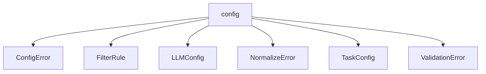

# Namespace `clore::config`

## Summary

The `clore::config` namespace provides a structured framework for loading, validating, and normalizing application configuration data. It defines core data types such as `LLMConfig`, `TaskConfig`, and `FilterRule` to represent distinct configuration domains, alongside dedicated error types (`ConfigError`, `NormalizeError`, `ValidationError`) for robust error handling. The namespace exposes entry points like `load_config` and `load_config_from_string` to ingest configuration from file paths or in-memory strings, returning integer status codes that callers must check. Supporting functions `validate` and `normalize` enforce constraints and transform configuration values as needed, ensuring that settings are consistent and correct before use.

## Diagram

## Types

### `clore::config::ConfigError`

Declaration: `config/load.cppm:15`

Definition: `config/load.cppm:15`

Implementation: [`Module config:load`](../../../modules/config/load.md)

Insufficient evidence to summarize; provide more EVIDENCE.

#### Invariants

- message contains descriptive error text

#### Key Members

- message

#### Usage Patterns

- thrown or returned as an error from configuration operations
- message is retrieved for logging or display

### `clore::config::FilterRule`

Declaration: `config/schema.cppm:7`

Definition: `config/schema.cppm:7`

Implementation: [`Module config:schema`](../../../modules/config/schema.md)

Insufficient evidence to summarize; provide more EVIDENCE.

#### Invariants

- The `include` and `exclude` vectors can be empty.
- No constraints exist on the content of the strings beyond being valid pattern representations.

#### Key Members

- `include`: list of patterns to include
- `exclude`: list of patterns to exclude

#### Usage Patterns

- Used as a configuration parameter to specify which items should be included or excluded in some processing.
- Typically populated from a configuration file or user input.
- Accessed by other code to filter collections based on the include/exclude lists.

### `clore::config::LLMConfig`

Declaration: `config/schema.cppm:12`

Definition: `config/schema.cppm:12`

Implementation: [`Module config:schema`](../../../modules/config/schema.md)

The `clore::config::LLMConfig` struct represents the configuration data for a large language model (LLM) component within the system. It is declared in the configuration schema module and is intended to hold settings such as model parameters, endpoints, or other model‑specific options. Alongside related types like `TaskConfig`, `FilterRule`, and various error types, `LLMConfig` forms part of the structured configuration framework that validates and normalizes settings before use.

### `clore::config::NormalizeError`

Declaration: `config/normalize.cppm:10`

Definition: `config/normalize.cppm:10`

Implementation: [`Module config:normalize`](../../../modules/config/normalize.md)

Insufficient evidence to summarize; provide more EVIDENCE.

#### Invariants

- No explicit invariants are documented.

#### Key Members

- `message`: a `std::string` describing the error.

#### Usage Patterns

- Used to report errors during configuration normalization.

### `clore::config::TaskConfig`

Declaration: `config/schema.cppm:17`

Definition: `config/schema.cppm:17`

Implementation: [`Module config:schema`](../../../modules/config/schema.md)

Insufficient evidence to summarize; provide more EVIDENCE.

#### Invariants

- All string fields are expected to contain valid filesystem paths
- `FilterRule` and `LLMConfig` are expected to be default-constructible

#### Key Members

- `compile_commands_path`
- `project_root`
- `output_root`
- `workspace_root`
- `filter`
- `llm`

#### Usage Patterns

- Loaded or populated by configuration parsing code
- Consumed by task execution logic to determine paths and behavior

### `clore::config::ValidationError`

Declaration: `config/validate.cppm:8`

Definition: `config/validate.cppm:8`

Implementation: [`Module config:validate`](../../../modules/config/validate.md)

Insufficient evidence to summarize; provide more EVIDENCE.

#### Invariants

- The `message` member always contains a non-empty string when used
- No other members or state exist

#### Key Members

- `clore::config::ValidationError::message`

#### Usage Patterns

- Returned from validation functions to indicate failure
- Used as the error type in `std::expected` or similar patterns

## Functions

### `clore::config::load_config`

Declaration: `config/load.cppm:19`

Definition: `config/load.cppm:81`

Implementation: [`Module config:load`](../../../modules/config/load.md)

`clore::config::load_config` is the primary entry point for loading a configuration. It accepts a `std::string_view` that identifies the configuration source (for example, a file path or an in‑memory string) and returns an `int` status code indicating the outcome. The caller is responsible for checking that the return value signals success before relying on any configuration state that may have been loaded.

#### Usage Patterns

- loading configuration from a file path
- error handling with `std::expected` return type
- setting workspace root automatically from config file location

### `clore::config::load_config_from_string`

Declaration: `config/load.cppm:21`

Definition: `config/load.cppm:110`

Implementation: [`Module config:load`](../../../modules/config/load.md)

The function `clore::config::load_config_from_string` accepts a configuration source provided as a `std::string_view` and returns an `int` indicating the result of the operation. It is the caller’s responsibility to supply a valid configuration string; the function is not expected to modify the input. The exact meaning of the return value (e.g., success, error code) is defined by the library’s error-reporting convention and may be further inspected or validated using associated functions such as `clore::config::validate`. This function serves as a string-based alternative to other loading entry points, offering a direct route from an in-memory buffer to a parsed configuration state.

#### Usage Patterns

- loading configuration from a string
- testing with inline TOML
- processing embedded configuration

### `clore::config::normalize`

Declaration: `config/normalize.cppm:14`

Definition: `config/normalize.cppm:22`

Implementation: [`Module config:normalize`](../../../modules/config/normalize.md)

The `clore::config::normalize` function accepts a mutable reference to an `int` representing a configuration value. It normalizes that value according to the configuration's rules, potentially modifying the referenced integer. The function returns an `int` status code indicating success or the nature of any error encountered. Callers should ensure the provided reference is valid and refers to a configuration parameter that supports normalization. The return value can be used to check whether normalization completed successfully or if an issue arose.

#### Usage Patterns

- called to normalize a `TaskConfig` after loading
- ensures all path fields are absolute and use forward slashes

### `clore::config::validate`

Declaration: `config/validate.cppm:12`

Definition: `config/validate.cppm:42`

Implementation: [`Module config:validate`](../../../modules/config/validate.md)

The function `clore::config::validate` determines whether an integer configuration value satisfies the applicable validation constraints. It accepts a `const int &` parameter representing the value to validate and returns an `int` status code: `0` on success, or a non‑zero error identifier on failure. Callers should check this return value; the input value is not altered by this function.

#### Usage Patterns

- Called after loading configuration to ensure validity before use
- May be called on both initial configuration and after modifications

## Related Pages

- [Namespace clore](../index.md)

