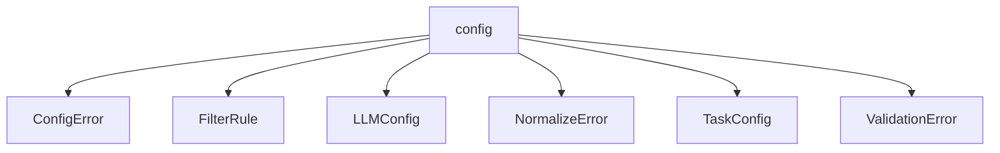

# Namespace `clore::config`

## Summary

The `clore::config` namespace provides the configuration subsystem for the Clore library, responsible for loading, validating, and normalizing configuration data. It defines core data structures such as `LLMConfig` and `TaskConfig` to represent application-specific settings, and error types including `ConfigError`, `NormalizeError`, `ValidationError`, and `FilterRule` to handle various failure modes. Key functions include `load_config` and `load_config_from_string` for retrieving configuration from file paths or inline strings, `validate` to verify configuration values meet constraints, and `normalize` to transform values into a canonical form.

The namespace acts as a centralized entry point for managing configuration throughout the application, ensuring consistency and correctness of settings. By separating concerns of parsing, validation, and normalization, it allows callers to rely on a uniform configuration interface, with return codes or error types signaling the result of each operation.

## Diagram

## Types

### `clore::config::ConfigError`

Declaration: `config/load.cppm:15`

Definition: `config/load.cppm:15`

Implementation: [`Module config:load`](../../../modules/config/load.md)

Insufficient evidence to summarize; provide more EVIDENCE.

#### Invariants

- The `message` member can be any string, including an empty string.
- No other members or base classes exist.

#### Key Members

- `message`

#### Usage Patterns

- Thrown as an exception to signal configuration errors.
- Returned as an error value from configuration parsing functions.
- The `message` member is read by error-handling code to display or log the error.

### `clore::config::FilterRule`

Declaration: `config/schema.cppm:7`

Definition: `config/schema.cppm:7`

Implementation: [`Module config:schema`](../../../modules/config/schema.md)

Insufficient evidence to summarize; provide more EVIDENCE.

#### Invariants

- No explicit invariants are documented; the members are independent `std::vector<std::string>` with no specified constraints.

#### Key Members

- `clore::config::FilterRule::include`
- `clore::config::FilterRule::exclude`

#### Usage Patterns

- Used as a data-only configuration type to specify inclusion and exclusion patterns for filtering operations.

### `clore::config::LLMConfig`

Declaration: `config/schema.cppm:12`

Definition: `config/schema.cppm:12`

Implementation: [`Module config:schema`](../../../modules/config/schema.md)

Insufficient evidence to summarize; provide more EVIDENCE.

#### Invariants

- `retry_limit` defaults to `0`
- `system_prompt` is a default-constructed `std::string` (empty)

#### Key Members

- `system_prompt`
- `retry_limit`

#### Usage Patterns

- Other code creates, reads, or modifies `clore::config::LLMConfig` instances directly by assigning values to its members

### `clore::config::NormalizeError`

Declaration: `config/normalize.cppm:10`

Definition: `config/normalize.cppm:10`

Implementation: [`Module config:normalize`](../../../modules/config/normalize.md)

The `clore::config::NormalizeError` struct is an error type that signifies a failure during the normalization step of configuration processing within the `clore::config` namespace. It is used in conjunction with other error and configuration types, such as `clore::config::ConfigError` and `clore::config::ValidationError`, to communicate issues that arise when configuration values are normalized to their canonical forms.

#### Invariants

- The `message` member contains a textual description of the error that occurred.

#### Key Members

- `message`: a `std::string` that holds the error description.

#### Usage Patterns

- Used as an exception type or error result to convey normalization failures.
- Its `message` member is accessed to retrieve error details.

### `clore::config::TaskConfig`

Declaration: `config/schema.cppm:17`

Definition: `config/schema.cppm:17`

Implementation: [`Module config:schema`](../../../modules/config/schema.md)

Insufficient evidence to summarize; provide more EVIDENCE.

#### Invariants

- No invariants are enforced by the type.

#### Key Members

- `project_root`
- `workspace_root`
- `output_root`
- `compile_commands_path`
- `filter`
- `llm`

#### Usage Patterns

- Defined as a data structure within the configuration module; its fields are publicly accessible for direct assignment and reading.

### `clore::config::ValidationError`

Declaration: `config/validate.cppm:8`

Definition: `config/validate.cppm:8`

Implementation: [`Module config:validate`](../../../modules/config/validate.md)

Insufficient evidence to summarize; provide more EVIDENCE.

#### Invariants

- The `message` member is a `std::string` with no additional constraints imposed by the struct.

#### Key Members

- `message` stores the error description.

#### Usage Patterns

- Returned or thrown by validation functions to indicate a configuration error.
- Likely compared or logged by callers to understand the validation failure.

## Functions

### `clore::config::load_config`

Declaration: `config/load.cppm:19`

Definition: `config/load.cppm:81`

Implementation: [`Module config:load`](../../../modules/config/load.md)

The `clore::config::load_config` function is the primary entry point for loading configuration data. It accepts a single `std::string_view` argument that identifies the configuration source (e.g., a file path or an inline configuration string) and returns an `int` value that indicates the outcome of the load operation. The caller is responsible for supplying a valid source; the return code communicates success or failure, with a value of zero typically meaning success and non‑zero indicating an error.  

This function is publicly accessible and forms part of the configuration subsystem’s public contract. The caller must ensure the provided string view remains valid for the duration of the call, and the returned `int` should be checked to determine whether the configuration was loaded successfully.

#### Usage Patterns

- load configuration at program startup
- parse a configuration file given its path

### `clore::config::load_config_from_string`

Declaration: `config/load.cppm:21`

Definition: `config/load.cppm:110`

Implementation: [`Module config:load`](../../../modules/config/load.md)

The function `clore::config::load_config_from_string` accepts a `std::string_view` that contains configuration data and returns an `int` status code. Callers provide the configuration content as a string; the function interprets this input and produces a result that indicates success or failure. A non‑zero return typically signals an error condition, while zero means the configuration was loaded successfully.

#### Usage Patterns

- called with TOML string from file contents or user input
- used to deserialize configuration in unit tests and programmatic config loading

### `clore::config::normalize`

Declaration: `config/normalize.cppm:14`

Definition: `config/normalize.cppm:22`

Implementation: [`Module config:normalize`](../../../modules/config/normalize.md)

The `clore::config::normalize` function accepts a mutable reference to an integer configuration value and transforms it into a standardized or canonical form. The integer is modified in place, and the function returns an integer result that typically indicates the operation’s success or an error code. Callers should provide a valid, modifiable reference and may assume that after a successful call the referenced value conforms to the expected configuration constraints.

#### Usage Patterns

- Called after loading a `TaskConfig` to ensure paths are absolute and use consistent separators
- Part of the configuration normalization pipeline before validation

### `clore::config::validate`

Declaration: `config/validate.cppm:12`

Definition: `config/validate.cppm:42`

Implementation: [`Module config:validate`](../../../modules/config/validate.md)

The function `clore::config::validate` accepts a `const int &` (presumably a configuration value) and returns an `int`. Its caller-facing responsibility is to verify whether the provided configuration value meets the expected constraints or rules defined by the application. The return value serves as a status code, typically indicating success (often zero) or a specific error condition (non-zero) that the caller must handle accordingly. Callers should only use the validated value after confirming a successful return from `validate`.

The contract of `validate` guarantees that if the function returns a successful status, the given `int` reference refers to a configuration value that is valid for downstream operations, such as those performed by `load_config`, `load_config_from_string`, or `normalize`. The function does not modify the value; it only inspects it. The caller retains ownership of the referenced integer and must ensure it remains alive throughout the validation call.

#### Usage Patterns

- Called after constructing or loading a `TaskConfig` to ensure configuration validity before use.
- Returned expected is typically checked with error handling, e.g., logging or propagating the `ValidationError`.

## Related Pages

- [Namespace clore](../index.md)

