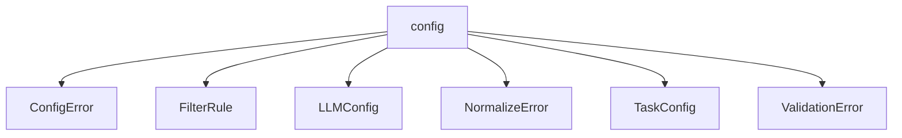

# Namespace `clore::config`

## Summary

The `clore::config` namespace is responsible for managing application configuration through a pipeline of loading, normalizing, and validating operations. Its primary public entry points are `load_config` and `load_config_from_string`, both of which accept configuration text (as `std::string_view`) and return an integer handle representing the loaded configuration. The `normalize` function transforms a configuration value into a canonical form in place, while `validate` checks the value against defined constraints, returning either success or a `ValidationError`. Supporting types like `LLMConfig`, `TaskConfig`, `FilterRule`, and error structs (`ConfigError`, `NormalizeError`, `ValidationError`) define the configuration model and error reporting.

Architecturally, the namespace enforces a clear separation of concerns: loading converts raw text into an internal representation, normalization ensures consistency, and validation confirms correctness. This layered design allows callers to safely process configuration before use, with each stage handling a specific aspect of configuration processing. The namespace serves as a central configuration subsystem, providing reusable components for parsing, canonicalization, and error handling.

## Diagram

```mermaid
graph TD
    NS["config"]
    T0["ConfigError"]
    NS --> T0
    T1["FilterRule"]
    NS --> T1
    T2["LLMConfig"]
    NS --> T2
    T3["NormalizeError"]
    NS --> T3
    T4["TaskConfig"]
    NS --> T4
    T5["ValidationError"]
    NS --> T5
```

## Types

### `clore::config::ConfigError`

Declaration: `src/config/load.cppm:30`

Definition: `src/config/load.cppm:30`

Implementation: [`Module config:load`](../../../modules/config/load.md)

Insufficient evidence to summarize; provide more EVIDENCE.

#### Key Members

- `message`

#### Usage Patterns

- Returned as an error type from config loading functions
- Caught or handled in code that processes configuration

### `clore::config::FilterRule`

Declaration: `src/config/schema.cppm:13`

Definition: `src/config/schema.cppm:13`

Implementation: [`Module config:schema`](../../../modules/config/schema.md)

Insufficient evidence to summarize; provide more EVIDENCE.

#### Invariants

- Each vector holds pattern strings
- Intended to be used together for include/exclude logic

#### Key Members

- include
- exclude

#### Usage Patterns

- Retrieved or populated from configuration sources
- Used to filter sets of items based on pattern matching

### `clore::config::LLMConfig`

Declaration: `src/config/schema.cppm:18`

Definition: `src/config/schema.cppm:18`

Implementation: [`Module config:schema`](../../../modules/config/schema.md)

Insufficient evidence to summarize; provide more EVIDENCE.

#### Invariants

- `retry_limit` is a non-negative integer (unsigned 32-bit)
- `system_prompt` is a string that can be empty or contain arbitrary text

#### Key Members

- `system_prompt`
- `retry_limit`

#### Usage Patterns

- Passed to functions that interact with an LLM to influence generation behavior
- Defaults to zero retries, meaning no retry is attempted unless explicitly configured

### `clore::config::NormalizeError`

Declaration: `src/config/normalize.cppm:17`

Definition: `src/config/normalize.cppm:17`

Implementation: [`Module config:normalize`](../../../modules/config/normalize.md)

Insufficient evidence to summarize; provide more EVIDENCE.

#### Invariants

- The `message` member stores a human-readable description of the error.

#### Key Members

- `std::string message`

#### Usage Patterns

- Used to represent a normalization error, typically returned or thrown from normalization functions.

### `clore::config::TaskConfig`

Declaration: `src/config/schema.cppm:23`

Definition: `src/config/schema.cppm:23`

Implementation: [`Module config:schema`](../../../modules/config/schema.md)

Insufficient evidence to summarize; provide more EVIDENCE.

#### Invariants

- Paths are expected to be valid filesystem paths but no validation is present.
- `filter` and `llm` are fully owned sub-configurations.

#### Key Members

- `compile_commands_path`: path to `compile_commands``.json`
- `project_root`: root directory of the project
- `output_root`: output directory for results
- `workspace_root`: workspace directory
- `filter`: filtering rules for the task
- `llm`: LLM configuration for the task

#### Usage Patterns

- Constructed by config parsing logic and passed to task execution.
- Accessed by task runners to read paths and sub-configurations.

### `clore::config::ValidationError`

Declaration: `src/config/validate.cppm:14`

Definition: `src/config/validate.cppm:14`

Implementation: [`Module config:validate`](../../../modules/config/validate.md)

Insufficient evidence to summarize; provide more EVIDENCE.

#### Invariants

- `message` contains a textual description of the validation error.
- The struct is trivially constructible and copyable.

#### Key Members

- `message`

#### Usage Patterns

- Returned from config validation functions to indicate a specific validation failure.
- Carried inside `std::expected` or similar error-handling types.

## Functions

### `clore::config::load_config`

Declaration: `src/config/load.cppm:34`

Definition: `src/config/load.cppm:96`

Implementation: [`Module config:load`](../../../modules/config/load.md)

`clore::config::load_config` loads a configuration from a provided `std::string_view` and returns an `int` that identifies the loaded configuration for subsequent operations. The caller is responsible for supplying a valid configuration string; the behavior is undefined if the input does not conform to the expected format. This function serves as the primary public entry point for parsing configuration data into a handle usable by other configuration utilities.

#### Usage Patterns

- load a task configuration file for an application
- retrieve configuration from a user-specified path

### `clore::config::load_config_from_string`

Declaration: `src/config/load.cppm:36`

Definition: `src/config/load.cppm:125`

Implementation: [`Module config:load`](../../../modules/config/load.md)

The function `clore::config::load_config_from_string` provides a string-based entry point for processing a configuration. It accepts a `std::string_view` containing the configuration data and returns an `int` that serves as a handle for the loaded configuration or signals an error condition. The caller is responsible for supplying valid configuration text; the function interprets the input and produces a result that can be passed to subsequent operations such as `clore::config::validate` or `clore::config::normalize`. A non‑negative return value typically indicates a successful load, while a negative value may denote a failure, which the caller should check before using the handle.

#### Usage Patterns

- Called to load a configuration from a TOML string
- Used in config loading pipelines

### `clore::config::normalize`

Declaration: `src/config/normalize.cppm:21`

Definition: `src/config/normalize.cppm:29`

Implementation: [`Module config:normalize`](../../../modules/config/normalize.md)

The `clore::config::normalize` function performs normalization on a configuration value in place. It accepts a mutable reference to an `int` and returns a `std::expected<void, NormalizeError>`. Callers are responsible for providing a configuration value that has been loaded (for example, via `clore::config::load_config` or `clore::config::load_config_from_string`). On success, the function modifies the referenced value to a canonical form and returns an empty `std::expected`. If normalization fails (e.g., the value cannot be adjusted to a valid canonical form), a `NormalizeError` is returned instead.

The function is designed to be invoked before validation with `clore::config::validate`. It does not perform full validation but ensures the value meets internal consistency requirements so that subsequent validation can assume a well‑formed input.

#### Usage Patterns

- Called after loading configuration via `load_config` or `load_config_from_string`
- Called before `validate` to ensure paths are in canonical form
- Used to sanitize and complete user‑provided configuration

### `clore::config::validate`

Declaration: `src/config/validate.cppm:18`

Definition: `src/config/validate.cppm:48`

Implementation: [`Module config:validate`](../../../modules/config/validate.md)

The function `clore::config::validate` performs validation on a given integer configuration value. It accepts a `const int &` and returns a `std::expected<void, ValidationError>` indicating whether the value is valid. If the value is invalid, the returned `ValidationError` provides details about the failure.

#### Usage Patterns

- called after loading config from file or string
- used before proceeding with task execution

## Related Pages

- [Namespace clore](../index.md)

