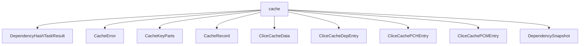

# Namespace `clore::extract::cache`

## Summary

The `clore::extract::cache` namespace provides a caching subsystem for the extraction pipeline, responsible for storing, retrieving, and validating cached results of compilation artifact extraction. It defines core data types such as `CacheRecord`, `CacheError`, `CacheKeyParts`, and `DependencySnapshot`, along with specialized entries for precompiled modules (`CliceCachePCMEntry`), precompiled headers (`CliceCachePCHEntry`), and dependencies (`CliceCacheDepEntry`). Key functions include `build_compile_signature` and `hash_file` for generating deterministic identifiers, `build_cache_key` and `split_cache_key` for constructing and decomposing composite cache keys, and paired load/save functions (`load_extract_cache`, `save_extract_cache`, `load_clice_cache`, `save_clice_cache`) to persist and retrieve extraction results. The namespace also provides `capture_dependency_snapshot` and `dependencies_changed` to track file modifications and determine when a cached entry is stale.

Architecturally, the namespace decouples caching logic from the core extraction algorithms, enabling reuse of previously computed results and efficient invalidation based on dependency changes. It acts as a centralized cache manager that normalizes file paths, computes hashes, and ensures thread-safe storage and retrieval, ultimately improving build performance by avoiding redundant work.

## Diagram

## Types

### `clore::extract::cache::CacheError`

Declaration: `extract/cache.cppm:20`

Definition: `extract/cache.cppm:20`

Implementation: [`Module extract:cache`](../../../../modules/extract/cache.md)

The `clore::extract::cache::CacheError` type represents an error that occurred during cache operations within the extraction layer. It is used to propagate and handle failures related to caching mechanisms such as record retrieval or data processing. The struct likely encapsulates an error code or descriptive information to aid in diagnosing cache-related issues.

#### Invariants

- The `message` member stores a human-readable error description.
- No other fields or invariants are implied by the evidence.

#### Key Members

- `message`

#### Usage Patterns

- Used to represent errors in cache operations.

### `clore::extract::cache::CacheKeyParts`

Declaration: `extract/cache.cppm:24`

Definition: `extract/cache.cppm:24`

Implementation: [`Module extract:cache`](../../../../modules/extract/cache.md)

The `clore::extract::cache::CacheKeyParts` struct represents the decomposed components of a cache key used within the extraction cache system. It isolates the individual fields or segments that together uniquely identify a cached entry, allowing key construction, comparison, or serialization to be performed at a granular level. The struct is typically employed when building or querying cache records such as `clore::extract::cache::CacheRecord` and interacts with dependency and PCM entries like `clore::extract::cache::CliceCacheDepEntry` and `clore::extract::cache::CliceCachePCMEntry`.

#### Invariants

- The struct is a trivial aggregate; all members are default‑initialized.
- `path` and `compile_signature` together form the complete cache key; no other fields contribute.
- The `compile_signature` is expected to be a non‑negative integer, but no range constraint is enforced by the type.

#### Key Members

- `path` of type `std::string`
- `compile_signature` of type `std::uint64_t`

#### Usage Patterns

- Instances of `CacheKeyParts` are created directly via aggregate initialization.
- The struct is used as a lookup key in cache maps or hash tables for extracted data.
- The two members are combined (e.g., by hashing) to produce a single cache key in cache implementations.

### `clore::extract::cache::CacheRecord`

Declaration: `extract/cache.cppm:36`

Definition: `extract/cache.cppm:36`

Implementation: [`Module extract:cache`](../../../../modules/extract/cache.md)

Insufficient evidence to summarize; provide more EVIDENCE.

#### Key Members

- `compile_signature`
- `source_hash`
- `ast_deps`
- `scan`
- `ast`

### `clore::extract::cache::CliceCacheData`

Declaration: `extract/cache.cppm:68`

Definition: `extract/cache.cppm:68`

Implementation: [`Module extract:cache`](../../../../modules/extract/cache.md)

Insufficient evidence to summarize; provide more EVIDENCE.

#### Invariants

- All vectors are default-constructible.
- Members are publicly accessible and directly modifiable.
- No member functions impose additional constraints.

#### Key Members

- paths
- pch
- pcm

#### Usage Patterns

- Constructed as a simple container for cache entries.
- Likely populated during cache loading and consumed by extraction logic.
- May be serialized or passed between components in the caching subsystem.

### `clore::extract::cache::CliceCacheDepEntry`

Declaration: `extract/cache.cppm:46`

Definition: `extract/cache.cppm:46`

Implementation: [`Module extract:cache`](../../../../modules/extract/cache.md)

The struct `clore::extract::cache::CliceCacheDepEntry` represents a single dependency entry within the clice workspace cache. It is part of a set of cache structures designed to be schema‑compatible with the server‑side `clice/src/server/workspace.cpp CacheData`, ensuring that cached dependency information can be reliably exchanged between the extract tool and the server. This entry typically captures metadata for a compiled dependency, such as its location, hash, or state, and is used together with other cache entries like `CliceCachePCMEntry` and `CliceCachePCHEntry` to form a complete `CacheRecord`.

#### Invariants

- Fields are POD types with zero-initialized defaults
- Struct layout is meant to be compatible with an existing schema

#### Key Members

- `path` (`std::uint32_t`)
- `hash` (`std::uint64_t`)

#### Usage Patterns

- Used as an entry in the clice workspace cache
- Stores an association between a path identifier and a content hash

### `clore::extract::cache::CliceCachePCHEntry`

Declaration: `extract/cache.cppm:51`

Definition: `extract/cache.cppm:51`

Implementation: [`Module extract:cache`](../../../../modules/extract/cache.md)

Insufficient evidence to summarize; provide more EVIDENCE.

#### Invariants

- hash is an integral value uniquely identifying the PCH content
- `source_file` indexes a source file in the associated source file table
- `build_at` stores a timestamp of when the PCH was built
- bound likely represents a count or limit for dependency tracking
- deps contains zero or more `CliceCacheDepEntry` objects that are valid dependencies

#### Key Members

- filename
- `source_file`
- hash
- bound
- `build_at`
- deps

#### Usage Patterns

- Used as an element in a cache container for PCH entries
- Likely compared or hashed via the `hash` field
- Serialized/deserialized for persistent caching
- Accessed by cache lookup or insertion routines

### `clore::extract::cache::CliceCachePCMEntry`

Declaration: `extract/cache.cppm:60`

Definition: `extract/cache.cppm:60`

Implementation: [`Module extract:cache`](../../../../modules/extract/cache.md)

The `CliceCachePCMEntry` struct represents a single cached entry for a precompiled module (PCM) within the Clice extract cache system. It encapsulates metadata and state necessary to track, store, and retrieve cached PCM data, including its associated dependencies and records. This type is used internally by the caching logic, working alongside related types such as `CliceCacheData`, `CacheRecord`, `CliceCacheDepEntry`, and `CliceCachePCHEntry` to manage the lifecycle of PCM cache entries across extraction operations.

#### Invariants

- `source_file` and `build_at` are default-initialized to `0`.
- `deps` may be empty; no size constraints are specified.

#### Key Members

- `filename`
- `module_name`
- `source_file`
- `build_at`
- `deps`

#### Usage Patterns

- Used as an element in a cache container for `PCMs`.
- Likely serialized or deserialized for persistence.
- Iterated over or accessed by other cache management functions.

### `clore::extract::cache::DependencySnapshot`

Declaration: `extract/cache.cppm:29`

Definition: `extract/cache.cppm:29`

Implementation: [`Module extract:cache`](../../../../modules/extract/cache.md)

Insufficient evidence to summarize; provide more EVIDENCE.

#### Invariants

- `build_at` defaults to `0`
- No explicit invariants enforced on vector sizes or values

#### Key Members

- `files`
- `hashes`
- `mtimes`
- `build_at`

#### Usage Patterns

- Used to serialize and cache dependency data
- Captures the state of dependencies at a specific build time

## Functions

### `clore::extract::cache::build_cache_key`

Declaration: `extract/cache.cppm:76`

Definition: `extract/cache.cppm:228`

Implementation: [`Module extract:cache`](../../../../modules/extract/cache.md)

`clore::extract::cache::build_cache_key` constructs a cache‑key string from a file‑path or identifier (first argument of type `std::string_view`) and a hash value (second argument of type `std::uint64_t`). The returned `std::string` is a deterministic composite key that uniquely identifies a cached extraction for a given source unit and its compile signature. Callers should supply the same raw identifier and the compile signature (typically obtained from `clore::extract::cache::build_compile_signature`) to produce a key that can later be decomposed with `clore::extract::cache::split_cache_key` or used directly with other cache storage and retrieval functions such as `clore::extract::cache::load_extract_cache` or `clore::extract::cache::save_extract_cache`.

#### Usage Patterns

- used to generate a cache key before storing or retrieving extract cache data
- called from `save_extract_cache` and `load_extract_cache` related flows

### `clore::extract::cache::build_compile_signature`

Declaration: `extract/cache.cppm:74`

Definition: `extract/cache.cppm:224`

Implementation: [`Module extract:cache`](../../../../modules/extract/cache.md)

The function `clore::extract::cache::build_compile_signature` computes a cache signature for a given compilation artifact identified by the supplied reference. It accepts a `const int &` parameter representing the source identity and returns a `std::uint64_t` value suitable as a key component in cache lookups. Callers must ensure the argument corresponds to a valid compilation unit; the function does not modify the argument and provides a deterministic result for identical inputs.

#### Usage Patterns

- Used within the cache system to compute a unique identifier for a compile entry.

### `clore::extract::cache::capture_dependency_snapshot`

Declaration: `extract/cache.cppm:83`

Definition: `extract/cache.cppm:282`

Implementation: [`Module extract:cache`](../../../../modules/extract/cache.md)

The function `clore::extract::cache::capture_dependency_snapshot` obtains a snapshot of the current dependency state associated with the given integer reference. Callers provide a `const int &` argument that identifies the context or artifact for which dependencies are to be captured. On success, the function returns a `DependencySnapshot` representing the captured dependency graph; on failure, it returns a `CacheError` indicating the reason. This function is the primary mechanism to record dependency information for later invalidation or comparison via `dependencies_changed`.

#### Usage Patterns

- Used to snapshot file dependencies before cache insertion or validation
- Called in conjunction with `dependencies_changed` to determine whether cached data is stale
- Supports cache invalidation logic in the extract pipeline by computing file hashes and modification times

### `clore::extract::cache::dependencies_changed`

Declaration: `extract/cache.cppm:86`

Definition: `extract/cache.cppm:401`

Implementation: [`Module extract:cache`](../../../../modules/extract/cache.md)

The function `clore::extract::cache::dependencies_changed` accepts a `DependencySnapshot` and returns `true` if any of the tracked dependencies have been modified since the snapshot was taken. It is the caller’s primary way to determine whether cached extraction results are still valid; a return value of `true` indicates that the snapshot no longer accurately reflects the current state of the filesystem and that a fresh extraction will be required.

This function examines each dependency in the snapshot, typically using file metadata or content hashes, and returns `true` as soon as a single changed dependency is detected. The caller should treat the return value as a boolean predicate: if the function returns `false`, the snapshot is still consistent and the corresponding cache entry can be reused.

#### Usage Patterns

- Called during cache validation to determine if a cached extraction is still valid
- Used in conjunction with `capture_dependency_snapshot` and `load_extract_cache`/`save_extract_cache` to manage cache freshness
- Employed in places where an up-to-date dependency check is needed before using cached data

### `clore::extract::cache::hash_file`

Declaration: `extract/cache.cppm:81`

Definition: `extract/cache.cppm:270`

Implementation: [`Module extract:cache`](../../../../modules/extract/cache.md)

The `clore::extract::cache::hash_file` function accepts a `std::string_view` identifying a file and returns a `std::expected<std::uint64_t, CacheError>`. On success, it yields a 64‑bit unsigned integer hash value that uniquely represents the file’s contents; on failure, it returns a `CacheError` indicating why the hash could not be computed (for example, if the file cannot be opened or read). Callers can use this hash to detect changes to the file and to construct cache keys or signatures within the caching subsystem.

#### Usage Patterns

- hashing source files for cache key generation
- computing file hashes for change detection in the caching system

### `clore::extract::cache::load_clice_cache`

Declaration: `extract/cache.cppm:95`

Definition: `extract/cache.cppm:670`

Implementation: [`Module extract:cache`](../../../../modules/extract/cache.md)

`clore::extract::cache::load_clice_cache` accepts a `std::string_view` identifying a cache entry and attempts to retrieve the corresponding `CliceCacheData`. On success it returns the cache data; on failure it returns a `CacheError` indicating the reason, such as a missing or corrupt cache entry. The caller must supply a valid cache key or path (as used when previously saving via `save_clice_cache`), and should handle the `std::expected` result to distinguish between a successful load and an error condition. This function does not modify the class state and remains exception‑safe with respect to the return type.

#### Usage Patterns

- call to load previously cached clice extraction data
- used before performing extraction to check for valid cache
- paired with `save_clice_cache` to persist cache data

### `clore::extract::cache::load_extract_cache`

Declaration: `extract/cache.cppm:88`

Definition: `extract/cache.cppm:457`

Implementation: [`Module extract:cache`](../../../../modules/extract/cache.md)

The function `clore::extract::cache::load_extract_cache` accepts a cache key as a `std::string_view` and returns an `int` indicating the result. It is responsible for retrieving a previously stored extract cache entry associated with the given key. The caller must ensure that a corresponding entry exists (e.g., has been saved via `clore::extract::cache::save_extract_cache`); otherwise, the function’s behavior is undefined. The returned integer represents the loaded cache data, and the caller should interpret it in conjunction with the cache validation functions, such as `clore::extract::cache::dependencies_changed`, to determine whether the cache is still valid.

#### Usage Patterns

- called to initialize or refresh the extract cache before performing extraction
- used in conjunction with `save_extract_cache` for cache persistence
- invoked to reuse previously cached extraction results across build sessions

### `clore::extract::cache::save_clice_cache`

Declaration: `extract/cache.cppm:97`

Definition: `extract/cache.cppm:710`

Implementation: [`Module extract:cache`](../../../../modules/extract/cache.md)

The function `clore::extract::cache::save_clice_cache` attempts to persist the given `CliceCacheData` to the cache storage using the provided cache key, which is typically a `std::string_view` representing a validated key obtained from `clore::extract::cache::build_cache_key` or a similar source. On success, it returns an empty `std::expected<void, CacheError>`; on failure, it returns a `CacheError` describing the serialization or I/O error. Callers must ensure the `CliceCacheData` object is complete and the key is valid, as the function does not validate key format internally.

#### Usage Patterns

- Called after extracting build data to persist the `CliceCacheData` for later reuse
- Used with `workspace_root` identifying the project root

### `clore::extract::cache::save_extract_cache`

Declaration: `extract/cache.cppm:91`

Definition: `extract/cache.cppm:533`

Implementation: [`Module extract:cache`](../../../../modules/extract/cache.md)

The function `clore::extract::cache::save_extract_cache` persists the cached result of an extraction for a given cache key and compile signature. The caller provides a `std::string_view` identifying the extraction source (typically a normalized path) and a `const int &` representing the compilation signature (for example, a hash of compile inputs). On success, the cache is stored so that a subsequent call to `clore::extract::cache::load_extract_cache` with the same key can retrieve it. If the operation fails, a `CacheError` value is returned to indicate the failure reason, such as a storage or permission issue. This function is the counterpart of `load_extract_cache` and is intended to be invoked after a successful extraction to update the cache for reuse.

#### Usage Patterns

- Used to persist extract cache data after extraction
- Called to save a snapshot of cache records to disk for later reloading

### `clore::extract::cache::split_cache_key`

Declaration: `extract/cache.cppm:79`

Definition: `extract/cache.cppm:238`

Implementation: [`Module extract:cache`](../../../../modules/extract/cache.md)

The function `clore::extract::cache::split_cache_key` accepts a `std::string_view` representing a composite cache key and returns a `std::expected<CacheKeyParts, CacheError>`. On success, the returned `CacheKeyParts` contains the individual components of the key, allowing callers to inspect or use them separately. On failure, a `CacheError` is returned indicating why the key could not be parsed—for example, if the input format is invalid or malformed.

Callers are expected to provide a cache key that was previously produced by `clore::extract::cache::build_cache_key` or a similar source. The function does not modify any state and is purely a decomposition utility. It is safe to call at any point; the result must be checked before using the contained `CacheKeyParts`.

#### Usage Patterns

- Used to decompose cache keys built by `build_cache_key`
- Called during cache lookups to extract the path and signature from a composite key
- Validates cache key format before further processing

## Related Pages

- [Namespace clore::extract](../index.md)

