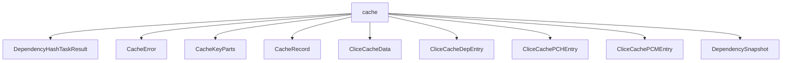

# Namespace `clore::extract::cache`

## Summary

The `clore::extract::cache` namespace provides a caching subsystem for the extraction pipeline, offering both a simple integer-based cache (via `load_extract_cache` and `save_extract_cache`) and a richer cache that stores structured dependency data (via `load_clice_cache` and `save_clice_cache`). It defines core data types such as `CacheRecord`, `CacheKeyParts`, `CacheError`, and the comprehensive `CliceCacheData` container, which aggregates entries for dependencies (`CliceCacheDepEntry`), `PCMs` (`CliceCachePCMEntry`), and `PCHs` (`CliceCachePCHEntry`). Supporting utilities like `build_cache_key`, `split_cache_key`, `build_compile_signature`, and `hash_file` enable deterministic key generation and file content fingerprinting.

Architecturally, this namespace bridges file-system snapshotting and extraction results by exposing `capture_dependency_snapshot` and `dependencies_changed` functions. These allow callers to detect changes in dependencies over time, ensuring cache validity. The cache structures are designed for serialization, likely to persistent storage, and are intended to be schema-compatible with similar structures in the broader clice workspace system. Overall, the namespace centralizes cache creation, lookup, invalidation, and key management, isolating the extraction logic from storage details.

## Diagram

## Types

### `clore::extract::cache::CacheError`

Declaration: `extract/cache.cppm:20`

Definition: `extract/cache.cppm:20`

Implementation: [`Module extract:cache`](../../../../modules/extract/cache.md)

Insufficient evidence to summarize; provide more EVIDENCE.

#### Invariants

- `message` contains a human-readable error description
- The struct is trivially constructible and copyable

#### Key Members

- `message`

#### Usage Patterns

- Returned or thrown to indicate an error during cache extraction
- Used as an error type in fallible operations within the `clore::extract::cache` namespace

### `clore::extract::cache::CacheKeyParts`

Declaration: `extract/cache.cppm:24`

Definition: `extract/cache.cppm:24`

Implementation: [`Module extract:cache`](../../../../modules/extract/cache.md)

Insufficient evidence to summarize; provide more EVIDENCE.

#### Invariants

- Both `path` and `compile_signature` must be populated before use as a cache key.
- The `compile_signature` is expected to be derived deterministically from compilation parameters.

#### Key Members

- `path` member
- `compile_signature` member

#### Usage Patterns

- Used as a key in associative containers (e.g., `std::map` or `std::unordered_map`) for caching extracted data.
- Compared via default equality `operator`s for cache lookup.
- Copied or moved when inserting or retrieving cache entries.

### `clore::extract::cache::CacheRecord`

Declaration: `extract/cache.cppm:36`

Definition: `extract/cache.cppm:36`

Implementation: [`Module extract:cache`](../../../../modules/extract/cache.md)

Insufficient evidence to summarize; provide more EVIDENCE.

#### Invariants

- All fields are public and default-initialized.
- `compile_signature` and `source_hash` are zero-initialized by default.
- The types `DependencySnapshot`, `ScanResult`, and `ASTResult` are assumed to be default-constructible.

#### Key Members

- `compile_signature`
- `source_hash`
- `ast_deps`
- `scan`
- `ast`

#### Usage Patterns

- Used as a record type for caching extracted data.
- Instances are likely stored in a map or container keyed by source hash or compile signature.

### `clore::extract::cache::CliceCacheData`

Declaration: `extract/cache.cppm:68`

Definition: `extract/cache.cppm:68`

Implementation: [`Module extract:cache`](../../../../modules/extract/cache.md)

`clore::extract::cache::CliceCacheData` is the primary data structure representing the state of the extraction cache for clice. It aggregates related cache elements such as `CacheRecord`, `CliceCacheDepEntry`, `CliceCachePCMEntry`, `CliceCachePCHEntry`, and `CacheError`, forming a complete snapshot that can be serialised for persistent storage or in-memory manipulation.

This struct is used throughout the cache subsystem to hold, read, and write the full set of cached extraction data. It is typically constructed from a `DependencySnapshot` or `CacheKeyParts` and then passed to functions that query or update the cache, making it the central container for all extracted dependency and PCM information.

#### Invariants

- No explicit invariants are documented in the evidence.

#### Key Members

- `paths`
- `pch`
- `pcm`

#### Usage Patterns

- Used to store and pass around cached extraction data.

### `clore::extract::cache::CliceCacheDepEntry`

Declaration: `extract/cache.cppm:46`

Definition: `extract/cache.cppm:46`

Implementation: [`Module extract:cache`](../../../../modules/extract/cache.md)

The struct `clore::extract::cache::CliceCacheDepEntry` represents a cache entry for a dependency within the clice workspace caching system. It is part of the set of workspace cache structures designed to be schema‑compatible with the `CacheData` structure defined in `clice/src/server/workspace.cpp`, ensuring consistent serialization and interoperability across different components.

This type is used in the extraction and caching of dependency information, likely serving as a serializable record that can be stored and retrieved to accelerate subsequent extracts by avoiding recomputation of dependency data.

#### Invariants

- Fields are default-initialized to zero
- Schema compatible with external `CacheData`

#### Key Members

- `path`
- `hash`

#### Usage Patterns

- Used in clice workspace cache structures
- Schema-compatible with clice/server/workspace`.cpp` `CacheData`

### `clore::extract::cache::CliceCachePCHEntry`

Declaration: `extract/cache.cppm:51`

Definition: `extract/cache.cppm:51`

Implementation: [`Module extract:cache`](../../../../modules/extract/cache.md)

Insufficient evidence to summarize; provide more EVIDENCE.

#### Invariants

- `hash` uniquely identifies the PCH content
- `source_file` references a valid source file index
- `deps` contains all source-level dependencies

#### Key Members

- `filename`
- `source_file`
- `hash`
- `bound`
- `build_at`
- `deps`

#### Usage Patterns

- looked up by `hash` to find cached PCH
- compared against current source file dependencies

### `clore::extract::cache::CliceCachePCMEntry`

Declaration: `extract/cache.cppm:60`

Definition: `extract/cache.cppm:60`

Implementation: [`Module extract:cache`](../../../../modules/extract/cache.md)

Insufficient evidence to summarize; provide more EVIDENCE.

#### Invariants

- `filename` and `module_name` together should uniquely identify a PCM entry.
- `source_file` is an index referencing an entry in an external source file table.
- `build_at` stores a timestamp in `int64_t` format, likely milliseconds or seconds since epoch.
- `deps` contains all direct dependencies of this PCM entry.

#### Key Members

- `filename`
- `module_name`
- `build_at`
- `source_file`
- `deps`

#### Usage Patterns

- Stored in a cache container indexed by `filename` or `module_name`.
- Used to compare timestamps and dependencies against the current build state.
- Serialized and deserialized for persistent caching between builds.
- Populated by the extraction phase and consulted during compilation to reuse `PCMs`.

### `clore::extract::cache::DependencySnapshot`

Declaration: `extract/cache.cppm:29`

Definition: `extract/cache.cppm:29`

Implementation: [`Module extract:cache`](../../../../modules/extract/cache.md)

Insufficient evidence to summarize; provide more EVIDENCE.

#### Invariants

- The `files`, `hashes`, and `mtimes` vectors have the same size when representing a consistent snapshot.
- `build_at` is expected to be a monotonic timestamp indicating when the snapshot was captured.

#### Key Members

- `files` - the list of dependency file paths.
- `hashes` - the hash values for each dependency file.
- `mtimes` - the last modification times for each dependency file.
- `build_at` - the timestamp of the snapshot creation.

#### Usage Patterns

- Used to cache and compare the state of dependency files across builds.
- Stored or serialized to detect changes in dependencies since the last build.

## Functions

### `clore::extract::cache::build_cache_key`

Declaration: `extract/cache.cppm:76`

Definition: `extract/cache.cppm:228`

Implementation: [`Module extract:cache`](../../../../modules/extract/cache.md)

The function `clore::extract::cache::build_cache_key` constructs a unique cache key string from a source file path (as `std::string_view`) and a compile signature (as `std::uint64_t`). The returned `std::string` serves as an opaque identifier for a specific cache entry, suitable for use with functions such as `clore::extract::cache::load_extract_cache` and `clore::extract::cache::save_extract_cache`. The caller is responsible for providing the correct compile signature, which should uniquely represent the compilation context; this is typically obtained via `clore::extract::cache::build_compile_signature`. The function does not validate the inputs; any valid pair of arguments produces a well-formed key.

#### Usage Patterns

- Used to generate a unique key for caching extraction results
- Called when saving or loading cache entries

### `clore::extract::cache::build_compile_signature`

Declaration: `extract/cache.cppm:74`

Definition: `extract/cache.cppm:224`

Implementation: [`Module extract:cache`](../../../../modules/extract/cache.md)

The function `clore::extract::cache::build_compile_signature` accepts a reference to an `int` representing a compile command and returns a `std::uint64_t` signature. The caller is responsible for providing a valid, stable identifier for a specific compile command; the function computes a deterministic hash of that command’s properties, which can be used to detect changes or to construct cache keys. This signature is intended to be consistent across invocations for identical inputs, supporting cache coherence in the extract pipeline.

#### Usage Patterns

- Computes a signature for cache key generation
- Called by `load_extract_cache` and `save_extract_cache`

### `clore::extract::cache::capture_dependency_snapshot`

Declaration: `extract/cache.cppm:83`

Definition: `extract/cache.cppm:282`

Implementation: [`Module extract:cache`](../../../../modules/extract/cache.md)

The function `clore::extract::cache::capture_dependency_snapshot` captures the current dependency state for a given open file descriptor. On success, it returns a `DependencySnapshot` that can later be compared with `dependencies_changed` to detect modifications. The caller must ensure the argument is a valid file descriptor; otherwise, a `CacheError` is returned.

#### Usage Patterns

- Called to capture the current state of dependency files before caching
- Used to compare against previously stored snapshots to detect changes

### `clore::extract::cache::dependencies_changed`

Declaration: `extract/cache.cppm:86`

Definition: `extract/cache.cppm:401`

Implementation: [`Module extract:cache`](../../../../modules/extract/cache.md)

The function `clore::extract::cache::dependencies_changed` takes a `const DependencySnapshot &` and returns a `bool`. It determines whether any of the dependencies recorded in the given snapshot have changed compared to their current state on disk. Callers use this function to decide whether cached extraction results are still valid: a return value of `true` indicates that at least one dependency has been modified and the cache should be invalidated. The snapshot itself is typically obtained from a prior capture, such as that produced by `clore::extract::cache::capture_dependency_snapshot`.

#### Usage Patterns

- used to decide whether to reuse cached compilation results
- called after loading a dependency snapshot to detect changes

### `clore::extract::cache::hash_file`

Declaration: `extract/cache.cppm:81`

Definition: `extract/cache.cppm:270`

Implementation: [`Module extract:cache`](../../../../modules/extract/cache.md)

The function `clore::extract::cache::hash_file` accepts a file path as a `std::string_view` and returns a `std::expected<std::uint64_t, CacheError>`. On success, it yields a `std::uint64_t` hash value representing the file’s content; on failure, it provides a `CacheError` describing the problem. Callers rely on this function to obtain a stable, content‑derived digest for the purposes of cache key construction or change detection, without needing to know the underlying hashing mechanism.

#### Usage Patterns

- Used to compute hash of source files for cache key generation
- Likely called by cache build or verification logic

### `clore::extract::cache::load_clice_cache`

Declaration: `extract/cache.cppm:95`

Definition: `extract/cache.cppm:670`

Implementation: [`Module extract:cache`](../../../../modules/extract/cache.md)

The function `clore::extract::cache::load_clice_cache` accepts a cache key as a `std::string_view` and returns a `std::expected<CliceCacheData, CacheError>`. On success, the caller receives the deserialized `CliceCacheData` associated with that key; on failure, a `CacheError` describes the reason (e.g., missing cache entry, I/O error, or data corruption). The caller is responsible for supplying a valid key that has been previously produced by a corresponding cache-writing operation (such as `save_clice_cache`). The function does not modify any external state and is safe to call concurrently if the underlying storage supports it.

#### Usage Patterns

- loading cached clice data for incremental compilation
- checking cache validity before extraction

### `clore::extract::cache::load_extract_cache`

Declaration: `extract/cache.cppm:88`

Definition: `extract/cache.cppm:457`

Implementation: [`Module extract:cache`](../../../../modules/extract/cache.md)

The function `clore::extract::cache::load_extract_cache` attempts to load a pre‑stored extract cache entry identified by the provided cache key, which is supplied as a `std::string_view`. It returns an `int` that conveys either the cached data value or the outcome of the load attempt. The exact interpretation of the returned integer is defined by the cache contract; callers should treat it as the result of the lookup—typically a successful load yields a meaningful cached integer, while a failure is signaled by a designated sentinel value.

This function complements `clore::extract::cache::save_extract_cache` and is part of the extract cache subsystem. It does not throw exceptions and does not use `std::expected` for error reporting; callers must rely solely on the returned integer to determine success or failure.

#### Usage Patterns

- called during initialization to restore previously saved extract cache
- typically used in conjunction with `save_extract_cache` and `dependencies_changed`

### `clore::extract::cache::save_clice_cache`

Declaration: `extract/cache.cppm:97`

Definition: `extract/cache.cppm:710`

Implementation: [`Module extract:cache`](../../../../modules/extract/cache.md)

`clore::extract::cache::save_clice_cache` accepts a `std::string_view` cache key and a `const CliceCacheData &` value, and persists the given cache data under that key. On success it returns `std::expected<void, CacheError>` representing a void result; on failure it returns a `CacheError` describing the failure. The caller is responsible for providing a valid, unique key and a populated `CliceCacheData` object.

#### Usage Patterns

- Called to persist extracted clice data to disk
- Used after successful compilation or extraction phases

### `clore::extract::cache::save_extract_cache`

Declaration: `extract/cache.cppm:91`

Definition: `extract/cache.cppm:533`

Implementation: [`Module extract:cache`](../../../../modules/extract/cache.md)

The function `clore::extract::cache::save_extract_cache` persists an integer cache entry for the given key. The caller supplies a `std::string_view` identifying the cache entry and a `const int &` value to be stored. On success the function returns a `std::expected<void, CacheError>` with a void value; on failure it returns a `CacheError` describing the problem. The saved entry is retrievable later by calling `load_extract_cache` with the same key.

#### Usage Patterns

- Called to persist the extract cache after building or updating cache records
- Used in the extract pipeline to save results for future reuse

### `clore::extract::cache::split_cache_key`

Declaration: `extract/cache.cppm:79`

Definition: `extract/cache.cppm:238`

Implementation: [`Module extract:cache`](../../../../modules/extract/cache.md)

The function `clore::extract::cache::split_cache_key` accepts a `std::string_view` representing a serialized cache key and returns a `std::expected<CacheKeyParts, CacheError>`.  
Its caller-facing responsibility is to parse the raw cache key into its structured components, enabling downstream operations to inspect or use the key’s logical parts. On success, a valid `CacheKeyParts` object is returned; on failure, a `CacheError` indicates the reason the key could not be decomposed.

#### Usage Patterns

- used in cache load/save operations to decompose a combined cache key

## Related Pages

- [Namespace clore::extract](../index.md)

