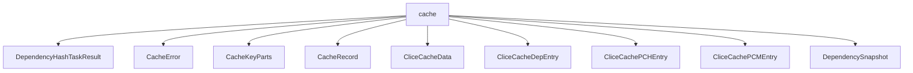

# Namespace `clore::extract::cache`

## Summary

The `clore::extract::cache` namespace provides a persistence and validation layer for the Clore extract phase, enabling reuse of previously computed compilation outputs. It defines core data structures such as `CacheRecord`, `CliceCacheDepEntry`, `CliceCacheData`, `CliceCachePCMEntry`, `CliceCachePCHEntry`, `CacheKeyParts`, and `DependencySnapshot` to represent cached extraction state, dependency entries, precompiled modules, and key components. These types work together with a family of functions—including `build_compile_signature`, `build_cache_key`, `hash_file`, `capture_dependency_snapshot`, `dependencies_changed`, `split_cache_key`, and the load/save pairs `load_extract_cache`/`save_extract_cache` and `load_clice_cache`/`save_clice_cache`—to generate deterministic cache keys, compute file hashes, snapshot dependency sets, detect staleness, and serialize entry data. The namespace’s primary architectural responsibility is to avoid redundant extraction work by storing and retrieving valid cached artifacts, thereby accelerating successive build operations while maintaining correctness through change detection.

## Diagram

```mermaid
graph TD
    NS["cache"]
    T0["DependencyHashTaskResult"]
    NS --> T0
    T1["CacheError"]
    NS --> T1
    T2["CacheKeyParts"]
    NS --> T2
    T3["CacheRecord"]
    NS --> T3
    T4["CliceCacheData"]
    NS --> T4
    T5["CliceCacheDepEntry"]
    NS --> T5
    T6["CliceCachePCHEntry"]
    NS --> T6
    T7["CliceCachePCMEntry"]
    NS --> T7
    T8["DependencySnapshot"]
    NS --> T8
```

## Types

### `clore::extract::cache::CacheError`

Declaration: `src/extract/cache.cppm:36`

Definition: `src/extract/cache.cppm:36`

Implementation: [`Module extract:cache`](../../../../modules/extract/cache.md)

`CacheError` is an error type representing failures that occur during cache extraction operations within the `clore::extract::cache` subsystem. It is used to communicate and handle error conditions when the cache layer encounters issues such as missing records, invalid state, or processing failures.

### `clore::extract::cache::CacheKeyParts`

Declaration: `src/extract/cache.cppm:40`

Definition: `src/extract/cache.cppm:40`

Implementation: [`Module extract:cache`](../../../../modules/extract/cache.md)

Insufficient evidence to summarize; provide more EVIDENCE.

#### Invariants

- `path` is expected to be a valid file path
- `compile_signature` is expected to be a unique identifier for a compilation configuration

#### Key Members

- `path`
- `compile_signature`

#### Usage Patterns

- Used as a key in caching mechanisms
- Combined to uniquely identify cache entries

### `clore::extract::cache::CacheRecord`

Declaration: `src/extract/cache.cppm:52`

Definition: `src/extract/cache.cppm:52`

Implementation: [`Module extract:cache`](../../../../modules/extract/cache.md)

Insufficient evidence to summarize; provide more EVIDENCE.

### `clore::extract::cache::CliceCacheData`

Declaration: `src/extract/cache.cppm:84`

Definition: `src/extract/cache.cppm:84`

Implementation: [`Module extract:cache`](../../../../modules/extract/cache.md)

Insufficient evidence to summarize; provide more EVIDENCE.

#### Invariants

- No invariants are enforced beyond the types of the members.

#### Key Members

- `paths`
- `pch`
- `pcm`

#### Usage Patterns

- Used to hold extracted cache data for PCH and PCM entries along with their paths.

### `clore::extract::cache::CliceCacheDepEntry`

Declaration: `src/extract/cache.cppm:62`

Definition: `src/extract/cache.cppm:62`

Implementation: [`Module extract:cache`](../../../../modules/extract/cache.md)

The struct `clore::extract::cache::CliceCacheDepEntry` represents a single entry in the workspace dependency cache. It is part of the set of cache structures designed to be schema‑compatible with the corresponding `CacheData` type in `clice/src/server/workspace.cpp`. This entry stores the cached information for one file dependency, allowing the extraction phase to reuse previously computed dependency data and avoid redundant processing.

#### Invariants

- Both fields are default-initialized to 0.
- The struct layout is compatible with an external schema.

#### Key Members

- `path`
- `hash`

#### Usage Patterns

- Used as an element in cache structures for clice workspace.
- Likely stored in collections (e.g., vectors) and serialized/deserialized for cache persistence.

### `clore::extract::cache::CliceCachePCHEntry`

Declaration: `src/extract/cache.cppm:67`

Definition: `src/extract/cache.cppm:67`

Implementation: [`Module extract:cache`](../../../../modules/extract/cache.md)

Insufficient evidence to summarize; provide more EVIDENCE.

#### Invariants

- filename corresponds to a valid PCH file path
- hash is computed from PCH content
- `build_at` stores a valid timestamp

#### Key Members

- hash
- deps
- filename
- `source_file`
- `build_at`
- bound

#### Usage Patterns

- Stored in a cache container keyed by PCH identity
- Checked for staleness using hash and deps
- Serialized/deserialized for persistent caching

### `clore::extract::cache::CliceCachePCMEntry`

Declaration: `src/extract/cache.cppm:76`

Definition: `src/extract/cache.cppm:76`

Implementation: [`Module extract:cache`](../../../../modules/extract/cache.md)

The struct `clore::extract::cache::CliceCachePCMEntry` represents a cache entry for a precompiled module (PCM). It is part of the `clore::extract::cache` subsystem, which stores and retrieves module-related data to avoid redundant extraction or compilation. This type is used alongside other cache entries, such as `CliceCachePCHEntry` and `CliceCacheDepEntry`, to form a complete record of the dependencies and compiled artifacts within the Clice cache.

#### Invariants

- Default initializers for numeric fields (`source_file`, `build_at`) are zero.
- String fields (`filename`, `module_name`) are default-constructed as empty strings.
- The `deps` vector is default-constructed as empty.

#### Key Members

- `filename` (`std::string`)
- `source_file` (`std::uint32_t`)
- `module_name` (`std::string`)
- `build_at` (`std::int64_t`)
- `deps` (`std::vector<CliceCacheDepEntry>`)

### `clore::extract::cache::DependencySnapshot`

Declaration: `src/extract/cache.cppm:45`

Definition: `src/extract/cache.cppm:45`

Implementation: [`Module extract:cache`](../../../../modules/extract/cache.md)

Insufficient evidence to summarize; provide more EVIDENCE.

## Functions

### `clore::extract::cache::build_cache_key`

Declaration: `src/extract/cache.cppm:92`

Definition: `src/extract/cache.cppm:244`

Implementation: [`Module extract:cache`](../../../../modules/extract/cache.md)

Constructs a composite cache key from a file path and a compile signature. The caller provides a `std::string_view` identifying a source file and a `std::uint64_t` compile signature obtained from the build environment. The returned `std::string` can be used to store and retrieve cached extraction data for that specific compilation unit, ensuring cache entries are unique per file and build configuration.

#### Usage Patterns

- called to generate a cache lookup key from a file path and its compile signature
- used prior to storing or retrieving cached extraction data

### `clore::extract::cache::build_compile_signature`

Declaration: `src/extract/cache.cppm:90`

Definition: `src/extract/cache.cppm:240`

Implementation: [`Module extract:cache`](../../../../modules/extract/cache.md)

The function `clore::extract::cache::build_compile_signature` accepts a `const int &` (typically an open file descriptor representing a compilation artefact or source file) and returns a `std::uint64_t` hash value. Its caller-facing responsibility is to produce a deterministic compile‑time signature that can later be used as part of a cache key to detect changes in the compilation inputs. The contract ensures that identical inputs produce the same signature, and different inputs are overwhelmingly likely to produce different signatures. This signature is an essential building block for the cache validity check, often combined with other metadata (e.g., via `build_cache_key`) to form a complete cache entry identifier. Callers should assume the signature is safe to compare for equality but must not rely on its internal representation.

#### Usage Patterns

- called to obtain a hash-based signature for a compile entry
- used internally by cache operations to identify compilation units

### `clore::extract::cache::capture_dependency_snapshot`

Declaration: `src/extract/cache.cppm:99`

Definition: `src/extract/cache.cppm:298`

Implementation: [`Module extract:cache`](../../../../modules/extract/cache.md)

The function `clore::extract::cache::capture_dependency_snapshot` accepts a cache entry identifier (`const int &`) and returns a `std::expected<DependencySnapshot, CacheError>`. It is the caller's responsibility to inspect the returned expected value; on success the contained `DependencySnapshot` records the current dependency state for the given entry, ready for comparison via functions like `dependencies_changed`. On failure, a `CacheError` reports why the snapshot could not be taken. This function does not alter the cache—it only captures a consistent view of dependencies for subsequent change‑detection workflows.

#### Usage Patterns

- capturing current dependency state for cache validation
- used before checking whether cached extraction data is stale

### `clore::extract::cache::dependencies_changed`

Declaration: `src/extract/cache.cppm:102`

Definition: `src/extract/cache.cppm:417`

Implementation: [`Module extract:cache`](../../../../modules/extract/cache.md)

The function `clore::extract::cache::dependencies_changed` accepts a `const DependencySnapshot &` and returns a `bool`. Its responsibility is to determine whether the set of dependencies captured in that snapshot has changed relative to an internally known prior state. It returns `true` if any dependency has changed, and `false` otherwise.

Callers should supply a valid snapshot obtained through an appropriate capture mechanism. The function provides a simple, caller‑facing query of dependency staleness, enabling cache‑invalidation decisions without exposing the underlying comparison logic.

#### Usage Patterns

- called to test whether a cached extract is still valid
- invoked after loading a cached dependency snapshot to detect changes

### `clore::extract::cache::hash_file`

Declaration: `src/extract/cache.cppm:97`

Definition: `src/extract/cache.cppm:286`

Implementation: [`Module extract:cache`](../../../../modules/extract/cache.md)

The function `hash_file` computes a deterministic hash of the file identified by the given path. It returns a `std::uint64_t` digest on success, or a `CacheError` if the file cannot be read or hashing fails. Callers can use this hash as a compact representation of file content for cache validation or key derivation.

#### Usage Patterns

- used to compute a content hash for caching decisions
- used by cache validation or key building routines

### `clore::extract::cache::load_clice_cache`

Declaration: `src/extract/cache.cppm:111`

Definition: `src/extract/cache.cppm:686`

Implementation: [`Module extract:cache`](../../../../modules/extract/cache.md)

The function `clore::extract::cache::load_clice_cache` accepts a `std::string_view` identifying the cache entry (typically a file path or cache key) and attempts to retrieve the corresponding `CliceCacheData`. On success it returns the cached data; on failure it returns a `CacheError` indicating the reason (e.g., missing cache entry, corrupted data, or permissions issue). Callers should handle both the success and error cases, and may use `save_clice_cache` to populate the cache before calling this function.

#### Usage Patterns

- loading clice cache data from a workspace
- initializing clice cache from disk before extraction

### `clore::extract::cache::load_extract_cache`

Declaration: `src/extract/cache.cppm:104`

Definition: `src/extract/cache.cppm:473`

Implementation: [`Module extract:cache`](../../../../modules/extract/cache.md)

Loads the extract cache associated with the provided identifier. The function accepts a `std::string_view` naming the cache entry and returns an `int` that signals the outcome of the load operation.

#### Usage Patterns

- called to load existing cache before extraction
- returns empty map if cache file does not exist

### `clore::extract::cache::save_clice_cache`

Declaration: `src/extract/cache.cppm:113`

Definition: `src/extract/cache.cppm:726`

Implementation: [`Module extract:cache`](../../../../modules/extract/cache.md)

The function `clore::extract::cache::save_clice_cache` persists a given `CliceCacheData` object into the cache, associating it with the provided identifier (typically a file path or cache key). On success, it returns `std::expected<void, CacheError>` with an empty value; on failure, it returns a `CacheError` describing the problem (e.g., I/O error, serialization failure). Callers must ensure the identifier is a valid cache location and that the `CliceCacheData` is fully constructed before calling this function. This function is the counterpart to `clore::extract::cache::load_clice_cache`, which retrieves previously saved data.

#### Usage Patterns

- Persists compiled cache data to disk
- Called after cache computation to save results
- Used in conjunction with `load_clice_cache` for cache retrieval

### `clore::extract::cache::save_extract_cache`

Declaration: `src/extract/cache.cppm:107`

Definition: `src/extract/cache.cppm:549`

Implementation: [`Module extract:cache`](../../../../modules/extract/cache.md)

Persist the extract cache entry identified by a string key and associated with the given compile signature. The function attempts to write the cache data to the underlying storage; on success it returns `std::expected<void, CacheError>` containing no value, and on failure it returns a `CacheError` describing the cause of the error.

#### Usage Patterns

- called after completing extraction to persist cache records
- used to update the extract cache with new data
- invoked with workspace root and collected `CacheRecord` map

### `clore::extract::cache::split_cache_key`

Declaration: `src/extract/cache.cppm:95`

Definition: `src/extract/cache.cppm:254`

Implementation: [`Module extract:cache`](../../../../modules/extract/cache.md)

The function `clore::extract::cache::split_cache_key` accepts a `std::string_view` representing a cache key and returns a `std::expected<CacheKeyParts, CacheError>`. It is the caller’s responsibility to provide a valid cache key, typically one produced by `build_cache_key`. If the supplied key cannot be parsed into its constituent parts—for example, if the format is malformed or the data is corrupt—the function returns a `CacheError` describing the failure. On success, the caller receives a `CacheKeyParts` value containing the decomposed components of the key, enabling access to the original fields used to construct the key.

#### Usage Patterns

- called to decompose a cache key into path and signature components for cache lookup or verification

## Related Pages

- [Namespace clore::extract](../index.md)

