# Namespace `clore::extract`

## Summary

The `clore::extract` namespace is the core extraction layer of the Clore analysis system. It provides the logic and data types to process compilation databases, scan source files, parse `ASTs`, and build a complete, queryable representation of a C++ project. Central types include `ProjectModel` (aggregating all extracted data), `CompilationDatabase`, `CompileEntry`, `ModuleUnit`, `SymbolInfo`, and `SymbolID`. The namespace also defines a family of error types (`ASTError`, `CompDbError`, `ScanError`, `PathResolveError`) and supports asynchronous workflows via functions like `extract_project_async` and `build_dependency_graph_async`.

Key functions handle symbol queries (`find_symbol`, `lookup_symbol`, `find_symbols`), module resolution (`find_module_by_name`, `find_module_by_source`), path normalization (`normalize_entry_file`, `canonical_graph_path`), and index reconstruction (`rebuild_model_indexes`, `rebuild_lookup_maps`). The namespace also includes utilities for merge (`merge_symbol_info`, `append_unique`), filtering (`matches_filter`, `filter_root_path`), and sanity‑checking compilation arguments (`sanitize_driver_arguments`, `sanitize_tool_arguments`). Overall, `clore::extract` implements the core extraction pipeline, transforming raw build database entries and source code into an enriched project model suitable for further analysis and symbol resolution.

## Diagram

```mermaid
graph TD
    NS["extract"]
    T0["LocalIndexData"]
    NS --> T0
    T1["ASTError"]
    NS --> T1
    T2["ASTResult"]
    NS --> T2
    T3["CompDbError"]
    NS --> T3
    T4["CompilationDatabase"]
    NS --> T4
    T5["CompileEntry"]
    NS --> T5
    T6["DependencyEdge"]
    NS --> T6
    T7["DependencyGraph"]
    NS --> T7
    T8["ExtractError"]
    NS --> T8
    T9["ExtractedRelation"]
    NS --> T9
    T10["FileInfo"]
    NS --> T10
    T11["IncludeInfo"]
    NS --> T11
    T12["ModuleUnit"]
    NS --> T12
    T13["NamespaceInfo"]
    NS --> T13
    T14["PathResolveError"]
    NS --> T14
    T15["ProjectModel"]
    NS --> T15
    T16["ScanCache"]
    NS --> T16
    T17["ScanError"]
    NS --> T17
    T18["ScanResult"]
    NS --> T18
    T19["SourceLocation"]
    NS --> T19
    T20["SourceRange"]
    NS --> T20
    T21["SymbolID"]
    NS --> T21
    T22["SymbolInfo"]
    NS --> T22
    T23["SymbolKind"]
    NS --> T23
    NSC0["cache"]
    NS --> NSC0
```



## Subnamespaces

- [`clore::extract::cache`](cache/index.md)

## Types

### `clore::extract::ASTError`

Declaration: `extract/ast.cppm:26`

Definition: `extract/ast.cppm:26`

Implementation: [`Module extract:ast`](../../../modules/extract/ast.md)

The `clore::extract::ASTError` struct represents an error condition that occurs during the extraction of abstract syntax tree (AST) information in the Clore extraction pipeline. It encapsulates details about failures encountered while parsing or analyzing source files, such as malformed code or unsupported language constructs. This type is used to propagate AST-related errors from extraction operations, allowing callers to handle or report specific extraction failures separately from other error types like `clore::extract::ScanError` or `clore::extract::CompDbError`.

#### Key Members

- message

#### Usage Patterns

- Thrown as an exception when AST extraction encounters an error.
- Caught by callers to inspect the error message and handle failure.

### `clore::extract::ASTResult`

Declaration: `extract/ast.cppm:37`

Definition: `extract/ast.cppm:37`

Implementation: [`Module extract:ast`](../../../modules/extract/ast.md)

The `clore::extract::ASTResult` struct represents the outcome of an AST extraction operation. It is used to hold the result of processing a single source file or translation unit, encapsulating both successfully extracted data and any errors that occurred during parsing or analysis. Together with related types such as `clore::extract::ScanResult` and `clore::extract::ExtractError`, it forms part of the extraction pipeline, where callers can inspect the result to retrieve extracted symbols, relations, or diagnostics.

#### Invariants

- No explicit invariants documented beyond the type being an aggregate.

#### Key Members

- symbols
- relations
- dependencies

#### Usage Patterns

- Returned as the result type from AST extraction functions.
- Consumed by downstream processes that analyze or transform the extracted data.

### `clore::extract::CompDbError`

Declaration: `extract/compiler.cppm:38`

Definition: `extract/compiler.cppm:38`

Implementation: [`Module extract:compiler`](../../../modules/extract/compiler.md)

The `clore::extract::CompDbError` struct represents an error that occurs during the handling of a compilation database within the extraction pipeline. It is used to signal failures when reading, parsing, or otherwise processing a `clore::extract::CompilationDatabase`, such as missing files, malformed data, or unsupported configurations. As one of several error types in the `clore::extract` module alongside `clore::extract::ASTError`, `clore::extract::ScanError`, and `clore::extract::ExtractError`, `CompDbError` provides a consistent mechanism for propagating and handling database‑related faults during code extraction.

#### Invariants

- The `message` member holds a valid `std::string` (default-constructed or assigned).

#### Key Members

- `message`: a `std::string` representing the error description.

#### Usage Patterns

- Returned as a result type from extraction operations to indicate failure.
- Inspected by callers to retrieve detailed error text.

### `clore::extract::CompilationDatabase`

Declaration: `extract/compiler.cppm:31`

Definition: `extract/compiler.cppm:31`

Implementation: [`Module extract:compiler`](../../../modules/extract/compiler.md)

Insufficient evidence to summarize; provide more EVIDENCE.

#### Invariants

- entries may be empty
- `toolchain_cache` maps toolchain identifiers to flag lists
- `has_cached_toolchain()` returns true if `toolchain_cache` contains any keys

#### Key Members

- entries
- `toolchain_cache`
- `has_cached_toolchain`

#### Usage Patterns

- Used to store and pass around parsed compilation database data
- `toolchain_cache` can be populated and queried to avoid repeated toolchain resolution

#### Member Functions

##### `clore::extract::CompilationDatabase::has_cached_toolchain`

Declaration: `extract/compiler.cppm:35`

Definition: `extract/compiler.cppm:229`

Implementation: [`Module extract:compiler`](../../../modules/extract/compiler.md)

###### Declaration

```cpp
auto () const -> bool;
```

### `clore::extract::CompileEntry`

Declaration: `extract/compiler.cppm:21`

Definition: `extract/compiler.cppm:21`

Implementation: [`Module extract:compiler`](../../../modules/extract/compiler.md)

Insufficient evidence to summarize; provide more EVIDENCE.

#### Invariants

- All string fields may be empty
- `compile_signature` is zero-initialized if not set
- `source_hash` is `std::nullopt` if not available

#### Key Members

- file
- directory
- arguments
- `normalized_file`
- `compile_signature`
- `source_hash`
- `cache_key`

#### Usage Patterns

- Used to store compilation entries from `clore::extract::Extractor`
- Populated from build system output like `compile_commands.json`
- Accessed by caching and reproducibility systems

### `clore::extract::DependencyEdge`

Declaration: `extract/scan.cppm:51`

Definition: `extract/scan.cppm:51`

Implementation: [`Module extract:scan`](../../../modules/extract/scan.md)

The struct `clore::extract::DependencyEdge` represents a single directed edge within a dependency graph, modeling a dependency relationship between two entities. It is typically used in conjunction with `clore::extract::DependencyGraph` to capture and navigate the interconnection of project components during extraction or scanning operations.

#### Invariants

- `from` and `to` are distinct identifiers (implied by edge semantics, not enforced)
- Members are public and may be mutated directly
- No ownership or lifetime constraints beyond those of `std::string`

#### Key Members

- `from`: the source node identifier
- `to`: the target node identifier

#### Usage Patterns

- Used to construct dependency graphs or lists
- Stored in containers such as `std::vector<DependencyEdge>`
- Iterated over to extract source/target pairs for further processing

### `clore::extract::DependencyGraph`

Declaration: `extract/scan.cppm:56`

Definition: `extract/scan.cppm:56`

Implementation: [`Module extract:scan`](../../../modules/extract/scan.md)

Insufficient evidence to summarize; provide more EVIDENCE.

#### Invariants

- No explicitly documented invariants.
- All members are public and default-initialized to empty vectors.

#### Key Members

- `files`
- `edges`

#### Usage Patterns

- Instantiated and populated by dependency extraction routines.
- Consumed by downstream analysis or serialization code.

### `clore::extract::ExtractError`

Declaration: `extract/extract.cppm:21`

Definition: `extract/extract.cppm:21`

Implementation: [`Module extract`](../../../modules/extract/index.md)

Insufficient evidence to summarize; provide more EVIDENCE.

#### Invariants

- No invariants beyond the validity of the underlying `std::string`

#### Key Members

- `message`

#### Usage Patterns

- Thrown or returned by extraction functions to indicate failure
- Caught or inspected by callers to obtain an error description

### `clore::extract::ExtractedRelation`

Declaration: `extract/ast.cppm:30`

Definition: `extract/ast.cppm:30`

Implementation: [`Module extract:ast`](../../../modules/extract/ast.md)

Insufficient evidence to summarize; provide more EVIDENCE.

#### Invariants

- `from` and `to` are valid `SymbolID` values.
- At most one of `is_call` or `is_inheritance` may be true? Not specified; both can be false or true.

#### Key Members

- `from`
- `to`
- `is_call`
- `is_inheritance`

#### Usage Patterns

- Used as part of the extraction output to record symbol relationships.
- Inspected to determine call or inheritance dependencies.

### `clore::extract::FileInfo`

Declaration: `extract/model.cppm:122`

Definition: `extract/model.cppm:122`

Implementation: [`Module extract:model`](../../../modules/extract/model.md)

The `clore::extract::FileInfo` struct represents metadata about a single file processed during extraction. It is part of the extraction model and is typically used to store identifying and descriptive information for source files encountered when scanning or compiling, such as their path, role, or extraction status. Alongside related types like `IncludeInfo`, `ModuleUnit`, and `SourceLocation`, `FileInfo` provides the foundation for tracking file-level details within extraction results such as `ScanResult` or `ASTResult`.

#### Invariants

- `path` should be a valid filesystem path
- `symbols` may be empty
- `includes` may be empty

#### Key Members

- `path`
- `symbols`
- `includes`

#### Usage Patterns

- Used as output of extraction to represent a translation unit
- Consumed by downstream processing that expects symbol and include lists

### `clore::extract::IncludeInfo`

Declaration: `extract/scan.cppm:24`

Definition: `extract/scan.cppm:24`

Implementation: [`Module extract:scan`](../../../modules/extract/scan.md)

Insufficient evidence to summarize; provide more EVIDENCE.

#### Invariants

- `is_angled` distinguishes angle-bracket includes from quoted includes.
- `path` can be any string, including empty.

#### Key Members

- `path`
- `is_angled`

#### Usage Patterns

- Returned by parsing functions to represent a single include directive.
- Consumed by downstream logic to determine include search behavior.

### `clore::extract::ModuleUnit`

Declaration: `extract/model.cppm:135`

Definition: `extract/model.cppm:135`

Implementation: [`Module extract:model`](../../../modules/extract/model.md)

The `clore::extract::ModuleUnit` struct represents a single C++20 module unit, whether an interface unit or a partition. It is part of the `clore::extract` namespace and is used to model module-level abstractions within the extraction and analysis pipeline. Each instance captures the identity and role of a particular module unit in the compiled project.

#### Invariants

- `is_interface` is true for export module declarations
- `name` is the fully qualified module name
- `source_file` is a normalized file path
- `imports` lists all module imports
- `symbols` contains all symbol `IDs` declared in this unit

#### Key Members

- `name`
- `is_interface`
- `source_file`
- `imports`
- `symbols`

#### Usage Patterns

- Populated by a module parser or extractor
- Gathered into a collection to represent an entire module's translation units
- Iterated over to analyze or serialize module structure

### `clore::extract::NamespaceInfo`

Declaration: `extract/model.cppm:128`

Definition: `extract/model.cppm:128`

Implementation: [`Module extract:model`](../../../modules/extract/model.md)

Insufficient evidence to summarize; provide more EVIDENCE.

#### Invariants

- All fields are public and can be freely modified.
- No invariants are enforced by the type itself; correctness depends on external usage.

#### Key Members

- `name`
- `symbols`
- `children`

#### Usage Patterns

- Used as a data container to represent a parsed namespace hierarchy.
- Instances are aggregated to form the full namespace tree during extraction.

### `clore::extract::PathResolveError`

Declaration: `extract/filter.cppm:8`

Definition: `extract/filter.cppm:8`

Implementation: [`Module extract:filter`](../../../modules/extract/filter.md)

The `clore::extract::PathResolveError` struct represents an error that occurs during path resolution within the extraction pipeline. It is used to indicate that a file path (e.g., from an include directive or compilation database entry) could not be successfully resolved to an actual file on disk, enabling callers to handle such failures gracefully. Alongside other error types in the `clore::extract` namespace, it participates in reporting and propagating extraction-related failures.

#### Invariants

- The `message` member is always initialized (default-constructed or assigned).

#### Key Members

- `std::string message`

#### Usage Patterns

- Constructed with a descriptive error message when path resolution fails.
- Likely returned as an error from functions or stored in `std::expected` or similar error-handling mechanisms.

### `clore::extract::ProjectModel`

Declaration: `extract/model.cppm:143`

Definition: `extract/model.cppm:143`

Implementation: [`Module extract:model`](../../../modules/extract/model.md)

The `clore::extract::ProjectModel` struct serves as the top-level representation of a C++ project’s extracted structure and metadata. It aggregates the results of scanning and parsing a compilation database, encompassing all relevant components such as compilation entries, file information, module units, include relationships, dependency graphs, and symbol tables. Use of `ProjectModel` typically occurs when the extraction phase completes, providing a unified, queryable description of the entire project to facilitate further analysis, indexing, or transformation.

#### Invariants

- `uses_modules` is true iff at least one module declaration exists
- `symbol_ids_by_qualified_name` may contain multiple `IDs` for overloaded names
- `modules` keys are normalized source file paths
- `module_name_to_sources` keys are exact module names
- `file_order` matches the order in which files were processed

#### Key Members

- `symbols`
- `files`
- `namespaces`
- `modules`
- `symbol_ids_by_qualified_name`
- `uses_modules`

#### Usage Patterns

- Used by generation and evidence building passes for qualified name lookup
- Used for cross-linking via module name lookup
- Provides access to all extracted symbols, files, and namespaces

### `clore::extract::ScanCache`

Declaration: `extract/scan.cppm:40`

Definition: `extract/scan.cppm:40`

Implementation: [`Module extract:scan`](../../../modules/extract/scan.md)

The `clore::extract::ScanCache` struct is a persistent cache intended to be reused across successive dependency scans of the same project. Its primary purpose is to avoid redundant work by storing information that remains valid as long as the compilation database and the file system state do not change. When either of those underlying data sources is modified (for example, after editing source files or updating build flags), callers are responsible for clearing or discarding this cache to ensure fresh results.

#### Invariants

- Cache entries are valid only until compilation DB or file system state changes.
- The `scan_results` map is unordered; iteration order is not guaranteed.

#### Key Members

- `scan_results`: maps file paths to cached `ScanResult` objects.

#### Usage Patterns

- Shared across successive dependency scans to avoid redundant work.
- Callers must clear or discard the cache when compilation DB or file system state changes.

### `clore::extract::ScanError`

Declaration: `extract/scan.cppm:20`

Definition: `extract/scan.cppm:20`

Implementation: [`Module extract:scan`](../../../modules/extract/scan.md)

Insufficient evidence to summarize; provide more EVIDENCE.

#### Invariants

- `message` may be empty or contain any valid string

#### Key Members

- `std::string message`

#### Usage Patterns

- Returned as an error result from scanning functions
- Likely used with `std::expected` or similar error-handling mechanisms

### `clore::extract::ScanResult`

Declaration: `extract/scan.cppm:29`

Definition: `extract/scan.cppm:29`

Implementation: [`Module extract:scan`](../../../modules/extract/scan.md)

Insufficient evidence to summarize; provide more EVIDENCE.

#### Invariants

- Fields are default-initialized to empty strings, false, or empty vectors.

#### Key Members

- `module_name`
- `is_interface_unit`
- includes
- `module_imports`

#### Usage Patterns

- Used as a return type from scanning functions
- Consumed to process module information

### `clore::extract::SourceLocation`

Declaration: `extract/model.cppm:64`

Definition: `extract/model.cppm:64`

Implementation: [`Module extract:model`](../../../modules/extract/model.md)

Insufficient evidence to summarize; provide more EVIDENCE.

#### Invariants

- `line == 0` indicates the location is unknown
- Valid source lines start at `1`
- `is_known()` returns `false` only when `line == 0`

#### Key Members

- `file` (string)
- `line` (`uint32_t`)
- `column` (`uint32_t`)
- `is_known()` method

#### Usage Patterns

- Used to capture source positions in extraction results
- Checked for validity via `is_known()`

#### Member Functions

##### `clore::extract::SourceLocation::is_known`

Declaration: `extract/model.cppm:70`

Definition: `extract/model.cppm:70`

Implementation: [`Module extract:model`](../../../modules/extract/model.md)

###### Declaration

```cpp
bool () const noexcept;
```

### `clore::extract::SourceRange`

Declaration: `extract/model.cppm:75`

Definition: `extract/model.cppm:75`

Implementation: [`Module extract:model`](../../../modules/extract/model.md)

The `clore::extract::SourceRange` type represents a contiguous span of source code within a translation unit. It is used alongside `clore::extract::SourceLocation` to describe the extent of extracted constructs—such as symbol declarations, macro expansions, or include directives—by capturing both the beginning and end positions. This struct is a fundamental building block in the extraction model, enabling precise mapping of extracted AST elements back to their original textual locations in the source files.

#### Invariants

- The `begin` and `end` members define the start and end of the range.
- No ordering or validity guarantees are specified in the evidence.

#### Key Members

- `begin`: the starting `SourceLocation` of the range.
- `end`: the ending `SourceLocation` of the range.

#### Usage Patterns

- Used as a field in other parsing or extraction structures to store the source location of a parsed construct.
- Returned by functions that produce a range covering a parsed token or node.

### `clore::extract::SymbolID`

Declaration: `extract/model.cppm:28`

Definition: `extract/model.cppm:28`

Implementation: [`Module extract:model`](../../../modules/extract/model.md)

Insufficient evidence to summarize; provide more EVIDENCE.

#### Invariants

- Valid `IDs` have non-zero hash.
- Zero hash represents invalid/null sentinel.
- Equality and ordering are based on both hash and signature.

#### Key Members

- `hash` field
- `signature` field
- `is_valid()` method
- `operator==`
- `operator<=>`

#### Usage Patterns

- Used as a key or identifier for symbols in extraction logic.
- Defaulted comparisons enable use in associative containers.
- Collision disambiguation relies on the signature field.

#### Member Functions

##### `clore::extract::SymbolID::is_valid`

Declaration: `extract/model.cppm:35`

Definition: `extract/model.cppm:35`

Implementation: [`Module extract:model`](../../../modules/extract/model.md)

###### Declaration

```cpp
bool () const noexcept;
```

##### `clore::extract::SymbolID::operator<=>`

Declaration: `extract/model.cppm:40`

Definition: `extract/model.cppm:40`

Implementation: [`Module extract:model`](../../../modules/extract/model.md)

###### Declaration

```cpp
auto (const SymbolID &) const;
```

##### `clore::extract::SymbolID::operator==`

Declaration: `extract/model.cppm:39`

Definition: `extract/model.cppm:39`

Implementation: [`Module extract:model`](../../../modules/extract/model.md)

###### Declaration

```cpp
bool (const SymbolID &) const;
```

### `clore::extract::SymbolInfo`

Declaration: `extract/model.cppm:80`

Definition: `extract/model.cppm:80`

Implementation: [`Module extract:model`](../../../modules/extract/model.md)

The `clore::extract::SymbolInfo` struct represents the metadata for a single symbol encountered during source code extraction. It is a core component of the extraction model, used to associate a `SymbolKind`, source location information (`SourceRange`, `SourceLocation`), and identity (`SymbolID`) with a particular declaration or reference in the codebase. This struct is typically populated during an AST traversal and collected within larger data structures such as `ASTResult` or `ScanResult` to form a complete picture of the extracted project.

#### Invariants

- `id` uniquely identifies the symbol across an extraction session
- `source_snippet_offset`, `source_snippet_length`, `source_snippet_file_size`, and `source_snippet_hash` are consistent if `source_snippet` is empty
- `declaration_location` is always present; `definition_location` is optional
- `parent`, `children`, `bases`, `derived`, `calls`, `called_by`, `references`, `referenced_by` store relationships as `SymbolID` values that refer to other `SymbolInfo` instances

#### Key Members

- `id`
- `kind`
- `name`
- `qualified_name`
- `declaration_location`
- `parent` and `children`
- `bases` and `derived`
- `calls` and `called_by`
- `references` and `referenced_by`
- `source_snippet` and related offset fields
- `doc_comment`

#### Usage Patterns

- Populated by extraction tools to describe each discovered symbol
- Traversed by code analysis utilities to build dependency graphs or inheritance hierarchies
- Linked via `SymbolID` fields to form a forest of symbol trees
- Examined to generate cross-references, call graphs, or documentation

### `clore::extract::SymbolKind`

Declaration: `extract/model.cppm:8`

Definition: `extract/model.cppm:8`

Implementation: [`Module extract:model`](../../../modules/extract/model.md)

Insufficient evidence to summarize; provide more EVIDENCE.

#### Invariants

- Each enumerator has a distinct integer value assigned by the compiler.
- The `Unknown` enumerator serves as a default or error indicator.
- The enum is intended to be used as a discriminator in variant-like structures or as a label in symbol metadata.

#### Key Members

- `Namespace`
- `Class`
- `Struct`
- `Union`
- `Enum`
- `EnumMember`
- `Function`
- `Method`
- `Variable`
- `Field`
- `TypeAlias`
- `Macro`
- `Template`
- `Concept`
- `Unknown`

#### Usage Patterns

- Other code compares against these enumerators to determine the kind of a symbol.
- The enum is likely used in switch statements or lookup tables.
- It may be serialized or compared with equality.

#### Member Variables

##### `clore::extract::SymbolKind::Class`

Declaration: `extract/model.cppm:10`

Implementation: [`Module extract:model`](../../../modules/extract/model.md)

###### Declaration

```cpp
Class
```

##### `clore::extract::SymbolKind::Concept`

Declaration: `extract/model.cppm:22`

Implementation: [`Module extract:model`](../../../modules/extract/model.md)

###### Declaration

```cpp
Concept
```

##### `clore::extract::SymbolKind::Enum`

Declaration: `extract/model.cppm:13`

Implementation: [`Module extract:model`](../../../modules/extract/model.md)

###### Declaration

```cpp
Enum
```

##### `clore::extract::SymbolKind::EnumMember`

Declaration: `extract/model.cppm:14`

Implementation: [`Module extract:model`](../../../modules/extract/model.md)

###### Declaration

```cpp
EnumMember
```

##### `clore::extract::SymbolKind::Field`

Declaration: `extract/model.cppm:18`

Implementation: [`Module extract:model`](../../../modules/extract/model.md)

###### Declaration

```cpp
Field
```

##### `clore::extract::SymbolKind::Function`

Declaration: `extract/model.cppm:15`

Implementation: [`Module extract:model`](../../../modules/extract/model.md)

###### Declaration

```cpp
Function
```

##### `clore::extract::SymbolKind::Macro`

Declaration: `extract/model.cppm:20`

Implementation: [`Module extract:model`](../../../modules/extract/model.md)

###### Declaration

```cpp
Macro
```

##### `clore::extract::SymbolKind::Method`

Declaration: `extract/model.cppm:16`

Implementation: [`Module extract:model`](../../../modules/extract/model.md)

###### Declaration

```cpp
Method
```

##### `clore::extract::SymbolKind::Namespace`

Declaration: `extract/model.cppm:9`

Implementation: [`Module extract:model`](../../../modules/extract/model.md)

###### Declaration

```cpp
Namespace
```

##### `clore::extract::SymbolKind::Struct`

Declaration: `extract/model.cppm:11`

Implementation: [`Module extract:model`](../../../modules/extract/model.md)

###### Declaration

```cpp
Struct
```

##### `clore::extract::SymbolKind::Template`

Declaration: `extract/model.cppm:21`

Implementation: [`Module extract:model`](../../../modules/extract/model.md)

###### Declaration

```cpp
Template
```

##### `clore::extract::SymbolKind::TypeAlias`

Declaration: `extract/model.cppm:19`

Implementation: [`Module extract:model`](../../../modules/extract/model.md)

###### Declaration

```cpp
TypeAlias
```

##### `clore::extract::SymbolKind::Union`

Declaration: `extract/model.cppm:12`

Implementation: [`Module extract:model`](../../../modules/extract/model.md)

###### Declaration

```cpp
Union
```

##### `clore::extract::SymbolKind::Unknown`

Declaration: `extract/model.cppm:23`

Implementation: [`Module extract:model`](../../../modules/extract/model.md)

###### Declaration

```cpp
Unknown
```

##### `clore::extract::SymbolKind::Variable`

Declaration: `extract/model.cppm:17`

Implementation: [`Module extract:model`](../../../modules/extract/model.md)

###### Declaration

```cpp
Variable
```

## Variables

### `clore::extract::append_unique`

Declaration: `extract/merge.cppm:12`

Implementation: [`Module extract:merge`](../../../modules/extract/merge.md)

A public function template `clore::extract::append_unique` declared at `extract/merge.cppm:12` with template parameter `<typename T>`. It returns `void` and is intended to append a value to a collection only if it is not already present.

### `clore::extract::append_unique_range`

Declaration: `extract/merge.cppm:19`

Implementation: [`Module extract:merge`](../../../modules/extract/merge.md)

A public variable template `append_unique_range` declared in `extract/merge.cppm` at line 19. The available evidence provides no additional context about its type, initialization, or how it is used in the codebase.

### `clore::extract::deduplicate`

Declaration: `extract/merge.cppm:49`

Implementation: [`Module extract:merge`](../../../modules/extract/merge.md)

The variable `clore::extract::deduplicate` is declared in `extract/merge.cppm:49` as `void deduplicate`.

## Functions

### `clore::extract::build_compile_signature`

Declaration: `extract/compiler.cppm:58`

Definition: `extract/compiler.cppm:110`

Implementation: [`Module extract:compiler`](../../../modules/extract/compiler.md)

`clore::extract::build_compile_signature` accepts a `const CompileEntry &` and returns a `std::uint64_t` that serves as a deterministic, content-based identifier for that compile entry. It is designed to produce a compact fingerprint that can be used by callers to cache or deduplicate compile actions, compare entries for equivalence, or track them across different stages of extraction. The function internally normalizes the entry file via `clore::extract::normalize_entry_file` and delegates to `clore::extract::(anonymous namespace)::build_compile_signature_impl` to compute the final value, ensuring that equivalent entries yield the same signature regardless of superficial representation differences.

#### Usage Patterns

- computing a unique hash for compile entries
- caching compile signatures to avoid redundant computation

### `clore::extract::build_dependency_graph_async`

Declaration: `extract/scan.cppm:61`

Definition: `extract/scan.cppm:370`

Implementation: [`Module extract:scan`](../../../modules/extract/scan.md)

The function `clore::extract::build_dependency_graph_async` asynchronously constructs a `DependencyGraph` for the project identified by the given integer handle. It accepts a reference to a `DependencyGraph` object that will be populated with the result, an optional `ScanCache` pointer (may be null to disable caching), and a `kota::event_loop` reference that schedules the asynchronous work. The caller must ensure the event loop remains active until the operation completes. The function returns an integer status code indicating success or failure; the actual graph data is made available through the output parameter after the asynchronous task finishes.

#### Usage Patterns

- Called to asynchronously compute a dependency graph for a project given a compilation database

### `clore::extract::canonical_graph_path`

Declaration: `extract/filter.cppm:21`

Definition: `extract/filter.cppm:103`

Implementation: [`Module extract:filter`](../../../modules/extract/filter.md)

`clore::extract::canonical_graph_path` computes a canonical representation of a graph path identified by an integer handle. The caller supplies a `const int &` referencing the input path identifier; the function returns an `int` that uniquely represents the canonical equivalent of that path. This contract ensures that different path descriptions that map to the same logical path are normalized to the same integer value, enabling consistent comparison and indexing within the extraction pipeline.

#### Usage Patterns

- normalizing paths for dependency graph nodes
- computing a unique key for a filesystem path

### `clore::extract::create_compiler_instance`

Declaration: `extract/compiler.cppm:65`

Definition: `extract/compiler.cppm:297`

Implementation: [`Module extract:compiler`](../../../modules/extract/compiler.md)

The function `clore::extract::create_compiler_instance` accepts a `const CompileEntry &` and returns an `int`. Its caller-facing responsibility is to materialize a compiler instance appropriate for the given compile entry, abstracting away the details of compiler selection and initialization. The caller must provide a valid `CompileEntry` describing the translation unit and its compilation parameters. The returned `int` serves as an opaque handle or status indicator representing the created compiler instance; the caller should treat this value as a resource that may require later cleanup or lifecycle management. No assumptions about the internal state or lifetime of the instance beyond the immediate call are warranted.

#### Usage Patterns

- Called in extraction pipeline to obtain a Clang compiler instance for a compilation unit.
- Used as part of the process to analyze source code and extract symbol information.

### `clore::extract::ensure_cache_key`

Declaration: `extract/compiler.cppm:60`

Definition: `extract/compiler.cppm:225`

Implementation: [`Module extract:compiler`](../../../modules/extract/compiler.md)

Declaration: [Declaration](functions/ensure-cache-key.md)

The function `clore::extract::ensure_cache_key` takes a mutable reference to a `CompileEntry` and returns `void`. It is responsible for ensuring that the given entry has a valid, unique cache key that can be used by caching mechanisms such as `clore::extract::query_toolchain_cached`. As a caller, you should invoke this function before operations that rely on cached toolchain information to avoid repeated, expensive computations. The function modifies the `CompileEntry` in place; after the call, the entry's internal cache key is guaranteed to be initialized and consistent.

#### Usage Patterns

- called by `query_toolchain_cached` before caching or querying toolchain for a compile entry

### `clore::extract::ensure_cache_key_impl`

Declaration: `extract/compiler.cppm:119`

Definition: `extract/compiler.cppm:119`

Implementation: [`Module extract:compiler`](../../../modules/extract/compiler.md)

Declaration: [Declaration](functions/ensure-cache-key-impl.md)

The function `clore::extract::ensure_cache_key_impl` serves as the core implementation for generating and assigning a cache key to a `CompileEntry`. It modifies the given entry in place to include a unique identifier that can later be used by caching subsystems such as `clore::extract::query_toolchain_cached`. As a caller, you should not invoke this function directly; instead, call `clore::extract::ensure_cache_key`, which delegates to this implementation. The cache key is derived from the normalized source file path, an optional source file content hash via `try_hash_source_file`, and the full compile signature produced by `build_compile_signature_impl`. After this function returns, the `CompileEntry` is guaranteed to have a valid and consistent cache key.

#### Usage Patterns

- called by `ensure_cache_key` to populate cache key for a compile entry

### `clore::extract::extract_project_async`

Declaration: `extract/extract.cppm:25`

Definition: `extract/extract.cppm:539`

Implementation: [`Module extract`](../../../modules/extract/index.md)

`clore::extract::extract_project_async` initiates asynchronous extraction of project data. It accepts a project identifier (passed as `const int &`) and a `kota::event_loop &` to schedule and drive the asynchronous work. The function returns an `int` — typically a status code or a handle that the caller can monitor for completion. This is the top-level entry point for extracting a project's symbols, modules, and dependency graphs; it is non-blocking and relies on the provided event loop for execution. Callers must ensure the event loop remains active until extraction finishes.

#### Usage Patterns

- called as the main extraction function in the clore extraction pipeline
- typically invoked from a command-line tool that provides config and event loop
- used in conjunction with async caching and AST extraction utilities

### `clore::extract::extract_symbols`

Declaration: `extract/ast.cppm:43`

Definition: `extract/ast.cppm:669`

Implementation: [`Module extract:ast`](../../../modules/extract/ast.md)

The function `clore::extract::extract_symbols` accepts a `const int &` identifier and returns an `int`. Callers supply a reference to an integer that designates a specific resource—such as a project model handle, compilation database identifier, or similar internal index—and receive a scalar integer result that typically indicates the number of symbols extracted or a status code. The precise interpretation of the parameter and return value is defined by the surrounding extraction pipeline; callers should refer to the associated documentation for the resource type and expected outcomes.

This function is the entry point for triggering symbol extraction from the given resource. It does not mutate the caller’s identifier. The returned integer allows the caller to assess the result of the operation (e.g., success or failure, extracted symbol count) without exposing internal extraction details.

#### Usage Patterns

- called to extract AST symbols and relations for a single compile entry
- used in vectorized or async extraction flows

### `clore::extract::filter_root_path`

Declaration: `extract/filter.cppm:27`

Definition: `extract/filter.cppm:161`

Implementation: [`Module extract:filter`](../../../modules/extract/filter.md)

The function `clore::extract::filter_root_path` accepts a root path identifier (as a constant integer reference) and returns an integer result. It is responsible for filtering or processing a root path, likely to restrict the scope of a subsequent extraction operation or to validate the path against project‑specific criteria. The caller supplies a valid root path identifier and expects a return value that indicates whether the path passed filtering or that provides a transformed identifier for use in further extraction steps.

#### Usage Patterns

- Obtain the normalized root path for filtering operations.

### `clore::extract::find_module_by_name`

Declaration: `extract/model.cppm:188`

Definition: `extract/model.cppm:416`

Implementation: [`Module extract:model`](../../../modules/extract/model.md)

Given a `const ProjectModel &` and an integer identifier for a module name, `clore::extract::find_module_by_name` returns a pointer to the corresponding `const ModuleUnit` if that module exists in the model. The integer parameter is expected to be a valid module-name index or identifier from the project’s internal naming system. If no module with the given name is found, the function returns `nullptr`. The caller is responsible for ensuring that the provided `ProjectModel` object is fully populated and that the name identifier references a known module in that model.

#### Usage Patterns

- Used by callers to resolve a module name to a single unambiguous module unit
- Typically invoked during project extraction or symbol lookup when a module context is needed

### `clore::extract::find_module_by_source`

Declaration: `extract/model.cppm:194`

Definition: `extract/model.cppm:449`

Implementation: [`Module extract:model`](../../../modules/extract/model.md)

The function `clore::extract::find_module_by_source` retrieves the module associated with a given source file within a project model. It accepts a reference to `const ProjectModel` and an integer that identifies a specific source entry (such as a compile entry index or source file ID). The function returns a pointer to `const ModuleUnit` if the source file is part of a module, or `nullptr` if no module is found for that source. The caller is responsible for ensuring the provided source identifier is valid within the model; the function performs no ownership transfer—the returned pointer remains valid only as long as the `ProjectModel` is alive and unchanged.

#### Usage Patterns

- used to retrieve a module unit by its source file path
- likely called when mapping a source location to its containing module

### `clore::extract::find_modules_by_name`

Declaration: `extract/model.cppm:191`

Definition: `extract/model.cppm:395`

Implementation: [`Module extract:model`](../../../modules/extract/model.md)

Searches the given `ProjectModel` for all modules matching a specific name identified by an integer identifier. The function returns an integer representing the result of the search, such as the number of modules found or a status code indicating success or failure.

#### Usage Patterns

- Used to retrieve all `ModuleUnit` pointers with a specific module name.
- Called when multiple sources define the same module name.

### `clore::extract::find_symbol`

Declaration: `extract/model.cppm:179`

Definition: `extract/model.cppm:371`

Implementation: [`Module extract:model`](../../../modules/extract/model.md)

Retrieves information about a symbol from the given `ProjectModel` using an integer identifier. Returns a pointer to a constant `SymbolInfo` object if the symbol is found, or `nullptr` if no matching symbol exists. Overloads of this function accept additional integer arguments to support more specific symbol lookups.

#### Usage Patterns

- Resolve a qualified name to a unique symbol
- Lookup symbol by fully qualified name

### `clore::extract::find_symbol`

Declaration: `extract/model.cppm:181`

Definition: `extract/model.cppm:379`

Implementation: [`Module extract:model`](../../../modules/extract/model.md)

The function `clore::extract::find_symbol` retrieves a pointer to a `const SymbolInfo` from the given `ProjectModel` using two integer parameters that together uniquely identify a symbol within the extracted model. The first integer typically denotes a source file or module index, and the second an offset, line, or internal symbol index; this composite key enables direct lookup when the caller has positional or internal identifiers rather than a `SymbolID` object. If no symbol matches the provided coordinates, the function returns a null pointer.

#### Usage Patterns

- Searching for a symbol by qualified name and signature
- Obtaining a symbol pointer for further inspection

### `clore::extract::find_symbols`

Declaration: `extract/model.cppm:185`

Definition: `extract/model.cppm:354`

Implementation: [`Module extract:model`](../../../modules/extract/model.md)

The function `clore::extract::find_symbols` is a query operation on a `ProjectModel`. It takes a reference to the project model and an integer parameter that serves as a search criterion or context identifier. The return value is an integer representing the number of matching symbols found, or a status code indicating the success or failure of the search.  

Callers should ensure the `ProjectModel` is fully constructed and that the integer parameter corresponds to a valid identifier (such as a file or module index) within the model. The function does not modify the model; it performs a read-only lookup to locate symbols that satisfy the given criterion.

#### Usage Patterns

- retrieve all symbols matching a qualified name

### `clore::extract::join_qualified_name_parts`

Declaration: `extract/model.cppm:59`

Definition: `extract/model.cppm:328`

Implementation: [`Module extract:model`](../../../modules/extract/model.md)

The function `clore::extract::join_qualified_name_parts` combines the specified qualified name parts into a single qualified name. It accepts a reference to the first part identifier and an integer count of parts to include, and returns an integer that represents the resulting joined name. This is typically used after splitting or processing name components to reconstruct a fully qualified name.

#### Usage Patterns

- reconstructing fully qualified symbol names from component parts
- building qualified names for lookup or display

### `clore::extract::load_compdb`

Declaration: `extract/compiler.cppm:42`

Definition: `extract/compiler.cppm:127`

Implementation: [`Module extract:compiler`](../../../modules/extract/compiler.md)

The function `load_compdb` accepts a `std::string_view` representing the file path of a compilation database. It attempts to load that database and returns an `int` that acts as a handle or status indicator. The caller must supply a valid, accessible path; the return value signals success or failure of the load operation, and a successful result can be passed to other extraction functions that require a database reference.

#### Usage Patterns

- Loading a compilation database from a path to `compile_commands.json`
- Initializing extraction processes for a project
- Providing compile commands to build dependency graphs or symbol indexes

### `clore::extract::lookup`

Declaration: `extract/compiler.cppm:44`

Definition: `extract/compiler.cppm:164`

Implementation: [`Module extract:compiler`](../../../modules/extract/compiler.md)

The function `clore::extract::lookup` performs a caller-facing lookup within a compilation database based on a given name or path. It accepts a `const CompilationDatabase &` and a `std::string_view` argument, and returns an `int`. The return value is intended to be used as an opaque identifier or index representing the result of the lookup, though its exact semantics are defined by the broader extraction framework. Callers should ensure the supplied `std::string_view` is valid for the lifetime of the call and that the `CompilationDatabase` has been properly initialized and populated before invoking this function.

#### Usage Patterns

- Used to find compile entries corresponding to a source file path
- Called during extraction to associate a source file with its build configuration

### `clore::extract::lookup_symbol`

Declaration: `extract/model.cppm:177`

Definition: `extract/model.cppm:349`

Implementation: [`Module extract:model`](../../../modules/extract/model.md)

The function `clore::extract::lookup_symbol` retrieves the `SymbolInfo` associated with a given `SymbolID` within a project model. It accepts a reference to a `ProjectModel` and a `SymbolID`, and returns a pointer to the constant `SymbolInfo` if the symbol is found, or `nullptr` if it is not present in the model.

The caller is responsible for ensuring that the `ProjectModel` is fully populated (e.g., after extraction) and that the `SymbolID` is valid—typically obtained from a prior query such as `clore::extract::find_symbol`. The returned pointer remains valid as long as the `ProjectModel` is not modified or destroyed.

#### Usage Patterns

- retrieving symbol details for a specific ID
- checking existence of a symbol
- used by code generation or analysis passes

### `clore::extract::matches_filter`

Declaration: `extract/filter.cppm:23`

Definition: `extract/filter.cppm:124`

Implementation: [`Module extract:filter`](../../../modules/extract/filter.md)

The function `clore::extract::matches_filter` determines whether a particular integer satisfies a filter condition defined by two additional integer arguments. It returns `true` if the condition is met, `false` otherwise. The exact semantics of the filter depend on the calling context, but the function serves as a generic predicate to decide inclusion or matching during extraction operations.

#### Usage Patterns

- filtering source files during symbol extraction
- applying user-defined include/exclude rules

### `clore::extract::merge_symbol_info`

Declaration: `extract/merge.cppm:54`

Definition: `extract/merge.cppm:211`

Implementation: [`Module extract:merge`](../../../modules/extract/merge.md)

The function `clore::extract::merge_symbol_info` merges the symbol information carried by the second argument into the first argument. The first argument is a mutable reference to an existing symbol info object, which will be updated or extended with the data from the second argument. The second argument is passed as an rvalue reference, indicating that the caller transfers ownership of that object — after the call, the second argument is left in a valid but unspecified state. Callers must ensure that the first argument is in a state suitable to receive merged data, and that the second argument is a temporary or has been moved. There is no return value; the merge is performed via side effects on the first argument.

#### Usage Patterns

- called during symbol extraction to combine partial symbol information
- used to merge newly discovered symbol attributes into an existing record

### `clore::extract::merge_symbol_info`

Declaration: `extract/merge.cppm:55`

Definition: `extract/merge.cppm:215`

Implementation: [`Module extract:merge`](../../../modules/extract/merge.md)

The function `clore::extract::merge_symbol_info` merges symbol information from a source into a target. The first argument is a mutable reference to the target symbol info that will be updated. The second argument provides the source symbol info; the const reference overload leaves the source unchanged, while the rvalue reference overload may move its contents. After the call, the target holds the combined information, typically including additional locations, definitions, or references from the source.

#### Usage Patterns

- Called by code that needs to combine symbol data from multiple sources
- Used during symbol extraction or update phases

### `clore::extract::namespace_prefix_from_qualified_name`

Declaration: `extract/model.cppm:62`

Definition: `extract/model.cppm:341`

Implementation: [`Module extract:model`](../../../modules/extract/model.md)

The function `clore::extract::namespace_prefix_from_qualified_name` accepts an integer representing a qualified name and returns an integer representing the namespace prefix extracted from that name. It is used to decompose qualified names into their namespace and local name components during symbol extraction.

#### Usage Patterns

- Used to derive the namespace scope of a qualified name
- Called during symbol extraction to separate namespace from name

### `clore::extract::normalize_argument_path`

Declaration: `extract/compiler.cppm:49`

Definition: `extract/compiler.cppm:188`

Implementation: [`Module extract:compiler`](../../../modules/extract/compiler.md)

The function `clore::extract::normalize_argument_path` accepts two `std::string_view` parameters and returns an `int`. It is responsible for normalizing a file path that appears as a command-line or compilation argument, converting it into a canonical form that can be used reliably by other extraction routines. The first argument is the path to normalize; the second likely specifies a base directory or root context for resolving relative components. The return value indicates success or failure, with a non‑zero value representing an error condition.

#### Usage Patterns

- Normalize compiler argument paths for consistent processing

### `clore::extract::normalize_entry_file`

Declaration: `extract/compiler.cppm:56`

Definition: `extract/compiler.cppm:91`

Implementation: [`Module extract:compiler`](../../../modules/extract/compiler.md)

Declaration: [Declaration](functions/normalize-entry-file.md)

The function `clore::extract::normalize_entry_file` accepts a `const CompileEntry &` and returns a `std::string` representing the resolved, canonical path to the source file associated with that entry. Callers rely on this function to obtain a normalized file identifier that serves as a stable, comparable key for caching and deduplication. The returned string is used by `clore::extract::build_compile_signature` and `clore::extract::ensure_cache_key_impl` to compute compile signatures and cache entries; when the `entry.normalized_file` field is empty or the compile signature has not yet been computed, this function is invoked to derive the normalized file path before proceeding with further processing. The contract guarantees a consistent, file‑system‑independent representation suitable for look‑up in the compilation database and for use as part of a cache key.

#### Usage Patterns

- Called by `build_compile_signature` to derive a unique signature for a compile entry.
- Called by `ensure_cache_key_impl` to produce a normalized file path for cache key computation.

### `clore::extract::path_prefix_matches`

Declaration: `extract/filter.cppm:12`

Definition: `extract/filter.cppm:33`

Implementation: [`Module extract:filter`](../../../modules/extract/filter.md)

`clore::extract::path_prefix_matches` takes two `int` arguments and returns a `bool`. It determines whether the path identified by the first argument is a path‑prefix of the path identified by the second argument. The exact interpretation of the integer arguments (e.g., path indices, handles, or integer‑encoded path components) depends on the caller’s context within the extraction pipeline. The function returns `true` if a prefix relationship holds, enabling the caller to filter or group paths based on directory ancestry. No side effects are expected, and the function does not modify any state visible to the caller.

#### Usage Patterns

- Used to filter compilation entries by file path prefixes
- Applied when checking if a source file belongs to a given directory pattern

### `clore::extract::project_relative_path`

Declaration: `extract/filter.cppm:14`

Definition: `extract/filter.cppm:64`

Implementation: [`Module extract:filter`](../../../modules/extract/filter.md)

The function `clore::extract::project_relative_path` accepts two parameters representing a project root path and a target path, both given as opaque identifiers (the `int` type). It computes and returns a relative path from the project root to the target path, also as an `int` identifier. The caller is responsible for providing valid path identifiers that correspond to actual filesystem locations. The returned identifier represents the resulting relative path, which may be used by other extraction functions in the `clore::extract` module.

#### Usage Patterns

- path validation before extraction
- ensuring file is within project root

### `clore::extract::query_toolchain_cached`

Declaration: `extract/compiler.cppm:62`

Definition: `extract/compiler.cppm:233`

Implementation: [`Module extract:compiler`](../../../modules/extract/compiler.md)

The function `clore::extract::query_toolchain_cached` retrieves toolchain information for a given `CompileEntry`, using the provided `CompilationDatabase` as the source and cache store. It first ensures the compile entry has a proper cache key (via `clore::extract::ensure_cache_key`), then either returns the cached toolchain result or performs a fresh query and caches it. The integer return value indicates success or an error condition; callers can rely on the database’s `has_cached_toolchain` method to check availability before invoking.

#### Usage Patterns

- Used to obtain sanitized tool arguments with memoization
- Callers rely on caching to avoid redundant calls to `sanitize_tool_arguments`

### `clore::extract::rebuild_lookup_maps`

Declaration: `extract/merge.cppm:59`

Definition: `extract/merge.cppm:428`

Implementation: [`Module extract:merge`](../../../modules/extract/merge.md)

The function `clore::extract::rebuild_lookup_maps` updates the internal lookup structures used for fast symbol resolution within the extraction model. It accepts a mutable reference to the underlying model state (represented as an `int`) and repopulates the name‑to‑symbol and location‑to‑symbol maps to reflect the current set of extracted symbols.

Callers should invoke this function after any batch of symbol extraction or model modifications that could invalidate the existing lookup tables. The contract guarantees that subsequent queries via functions such as `clore::extract::lookup_symbol` or `clore::extract::find_symbol` will operate on a consistent, up‑to‑date view of the model.

#### Usage Patterns

- Called after merging symbol info into a `ProjectModel`
- Invoked to refresh lookup caches when symbol or module data changes

### `clore::extract::rebuild_model_indexes`

Declaration: `extract/merge.cppm:57`

Definition: `extract/merge.cppm:219`

Implementation: [`Module extract:merge`](../../../modules/extract/merge.md)

The function `clore::extract::rebuild_model_indexes` is responsible for reconstructing the internal index structures of the project model. A caller invokes this function after performing modifications to the model that could invalidate its current indexing, ensuring that subsequent lookups and queries operate on a consistent state. The function takes a read‑only reference to an integer parameter (likely identifying the model or a change token) and a mutable reference to an integer (probably an output or state indicator), and returns `void`.

#### Usage Patterns

- called after extraction or merging to refresh indexes
- part of the model finalization pipeline
- ensures consistency of file, namespace, and parent-child associations

### `clore::extract::resolve_path_under_directory`

Declaration: `extract/filter.cppm:18`

Definition: `extract/filter.cppm:79`

Implementation: [`Module extract:filter`](../../../modules/extract/filter.md)

The function `clore::extract::resolve_path_under_directory` accepts two identifiers (represented as `const int &`) and returns a resolved identifier (also `int`). The first argument identifies a directory, and the second argument identifies a path that is expected to be relative to that directory. The call resolves the path under the given directory, producing a canonical or absolute identifier for the resulting location. The caller is responsible for providing valid identifiers that refer to existing directory and path objects within the current extraction context. The returned identifier may be used for subsequent operations that require a fully resolved location.

#### Usage Patterns

- Resolve compilation database entry file path
- Normalize relative source paths

### `clore::extract::resolve_source_snippet`

Declaration: `extract/model.cppm:200`

Definition: `extract/model.cppm:455`

Implementation: [`Module extract:model`](../../../modules/extract/model.md)

The function `clore::extract::resolve_source_snippet` populates the `source_snippet` member of a given `SymbolInfo` object by reading the referenced file from disk. It uses the offset and length fields already stored in the `SymbolInfo` to extract the exact text region. The function returns `true` if the snippet was successfully resolved (or was already cached), and `false` otherwise. The caller must supply a non-const `SymbolInfo` reference whose file-location metadata is valid.

#### Usage Patterns

- Called to lazily load a symbol's source text after extraction
- Invoked during symbol display or search result rendering
- Used to populate the snippet view in documentation or code navigation

### `clore::extract::sanitize_driver_arguments`

Declaration: `extract/compiler.cppm:52`

Definition: `extract/compiler.cppm:207`

Implementation: [`Module extract:compiler`](../../../modules/extract/compiler.md)

The function `clore::extract::sanitize_driver_arguments` processes a given `CompileEntry` to cleanse and normalize the driver‑level command‑line arguments it contains. Its caller‑facing responsibility is to accept a compile entry and produce a revised argument list that is safe and consistent for subsequent extraction steps. The precise interpretation of the returned `int` — whether it signals success, a count of sanitized arguments, or an error code — is part of the function’s contract; callers rely on this value to determine whether the sanitization succeeded and to proceed accordingly.

#### Usage Patterns

- used to remove the source file from compiler arguments
- called before building compile signature or invoking compiler

### `clore::extract::sanitize_tool_arguments`

Declaration: `extract/compiler.cppm:54`

Definition: `extract/compiler.cppm:221`

Implementation: [`Module extract:compiler`](../../../modules/extract/compiler.md)

`clore::extract::sanitize_tool_arguments` accepts a `const CompileEntry &` and returns an `int`. Its responsibility is to validate and normalize the compiler tool arguments extracted from the given compile entry, ensuring they conform to a canonical form required by later extraction stages. The function is part of the toolchain argument processing pipeline and is called before operations such as creating a compiler instance or building a compile signature. A non‑zero return value signals a failure to sanitize, typically due to invalid, missing, or malformed arguments in the entry.

#### Usage Patterns

- Used when normalizing compile arguments
- Called during extraction pipeline

### `clore::extract::scan_file`

Declaration: `extract/scan.cppm:44`

Definition: `extract/scan.cppm:238`

Implementation: [`Module extract:scan`](../../../modules/extract/scan.md)

The function `clore::extract::scan_file` accepts an integral identifier (likely a file descriptor or handle) and returns a `std::expected<ScanResult, ScanError>`. It is the primary entry point for scanning a single file within the extraction pipeline: on success the caller receives a `ScanResult` containing the extracted information from that file; on failure a `ScanError` describing the problem is returned. The caller must provide a valid, open file identifier and is responsible for checking the returned `std::expected` before using the result.

#### Usage Patterns

- called for each source file during project extraction
- used in conjunction with `extract_project_async` and dependency graph building
- typically invoked after compiling a compilation database entry
- may be called from worker threads in a parallel extraction pipeline

### `clore::extract::scan_module_decl`

Declaration: `extract/scan.cppm:49`

Definition: `extract/scan.cppm:141`

Implementation: [`Module extract:scan`](../../../modules/extract/scan.md)

Declaration: [Declaration](functions/scan-module-decl.md)

The caller provides a source text (as `std::string_view`) and a mutable reference to a `ScanResult` object. The function performs a fast scan of the source to extract the module declaration, using Clang's dependency directives scanner. It populates the `module_name`, `is_interface_unit`, and `module_imports` fields of the `ScanResult` without running the full preprocessor. This is a lightweight alternative to a full parse and is intended to be used during the initial scanning phase.

The caller must ensure the `std::string_view` remains valid for the duration of the call, and the `ScanResult` is in a default‑initialized state (or at least that its relevant fields are overwritten). After the call, the caller can inspect the populated fields to determine module‑related properties of the source. The function does not throw exceptions; any failure to extract the declaration is reflected by the state of the `ScanResult` after the call, typically as an empty or invalid `module_name`.

#### Usage Patterns

- called by `clore::extract::scan_file` to extract module information from source content
- used as a fast alternative to full preprocessing for module detection

### `clore::extract::split_top_level_qualified_name`

Declaration: `extract/model.cppm:57`

Definition: `extract/model.cppm:265`

Implementation: [`Module extract:model`](../../../modules/extract/model.md)

The function `clore::extract::split_top_level_qualified_name` decomposes a qualified name (for example, a C++ nested-name-specifier) into its outermost name component and the remaining nested portion. It is the caller’s responsibility to provide a valid representation of a qualified name; the function returns a structure or value that encodes the split result, enabling efficient access to the top-level segment without re-parsing the entire string. The split operation may be cached internally, but the interface guarantees a deterministic and reusable decomposition for a given input.

#### Usage Patterns

- parse qualified names for scope decomposition
- used by other extract functions needing top-level name parts
- cached to optimize repeated calls with the same qualified name

### `clore::extract::strip_compiler_path`

Declaration: `extract/compiler.cppm:47`

Definition: `extract/compiler.cppm:181`

Implementation: [`Module extract:compiler`](../../../modules/extract/compiler.md)

`clore::extract::strip_compiler_path` accepts a `const int &` representing a compiler‑associated identifier (such as a path index or handle) and returns an `int` that is the result of removing compiler‑specific components. The caller is responsible for ensuring that the input value is meaningful in the extraction context; the function does not modify the original value. The returned integer may be used as a canonical form for further processing, such as comparing or mapping paths without compiler‑embedded suffixes.

#### Usage Patterns

- used to obtain compiler flags without the program name

### `clore::extract::symbol_kind_name`

Declaration: `extract/model.cppm:26`

Definition: `extract/model.cppm:244`

Implementation: [`Module extract:model`](../../../modules/extract/model.md)

The function `clore::extract::symbol_kind_name` provides a caller-facing mechanism to obtain an integer representation corresponding to a given `SymbolKind`. The returned `int` serves as a stable, domain‑specific identifier for the symbol kind’s name, enabling callers to distinguish between different symbol categories without relying on the original enumeration values. The contract requires that the supplied `SymbolKind` be a valid member of its enumeration; the resulting integer is guaranteed to be non‑negative and unique within the set of known symbol kinds for the current extraction context.

#### Usage Patterns

- Used for logging or display of symbol kinds
- Obtain a string representation of a `SymbolKind`

### `clore::extract::topological_order`

Declaration: `extract/scan.cppm:66`

Definition: `extract/scan.cppm:495`

Implementation: [`Module extract:scan`](../../../modules/extract/scan.md)

The function `clore::extract::topological_order` accepts a `const DependencyGraph &` and returns an `int`. It computes a topological ordering of the graph’s nodes, providing the caller with a sequence that respects the partial order defined by dependencies. The returned integer indicates the outcome of the computation—commonly representing success or an error condition, or the count of nodes successfully ordered. The caller must supply an immutable graph reference; the function does not modify the graph.

#### Usage Patterns

- Ordering files for sequential processing according to include dependencies.

## Related Pages

- [Namespace clore](../index.md)
- [Namespace clore::extract::cache](cache/index.md)

