# Namespace `clore::extract`

## Summary

The `clore::extract` namespace provides the core extraction pipeline for analyzing C++ source code. It defines the types and operations responsible for scanning source files, parsing abstract syntax trees, building dependency graphs, and extracting symbol and module information from a compilation database. Central types include `CompileEntry`, `CompilationDatabase`, `ProjectModel`, `ModuleUnit`, `SymbolInfo`, `ScanResult`, `ScanCache`, and the `SymbolKind` enumeration, while error handling is addressed through distinct error types such as `ASTError`, `ExtractError`, `CompDbError`, `ScanError`, and `PathResolveError`.

Key operations within this namespace include loading and sanitizing compilation databases (`load_compdb`, `sanitize_driver_arguments`, `sanitize_tool_arguments`), scanning files and module declarations (`scan_file`, `scan_module_decl`), extracting symbols and building models (`extract_symbols`, `extract_project_async`), constructing dependency graphs (`build_dependency_graph_async`, `topological_order`), and providing lookup and query utilities (`find_symbol`, `lookup_symbol`, `find_module_by_name`, `find_modules_by_name`, `lookup`). Supporting functions handle path normalization, cache key management, signature computation, and data merging. Collectively, this namespace forms the data acquisition and transformation layer between raw build configurations and the structured project model used for further analysis.

## Diagram

```mermaid
graph TD
    NS["extract"]
    T0["LocalIndexData"]
    NS --> T0
    T1["ASTError"]
    NS --> T1
    T2["ASTResult"]
    NS --> T2
    T3["CompDbError"]
    NS --> T3
    T4["CompilationDatabase"]
    NS --> T4
    T5["CompileEntry"]
    NS --> T5
    T6["DependencyEdge"]
    NS --> T6
    T7["DependencyGraph"]
    NS --> T7
    T8["ExtractError"]
    NS --> T8
    T9["ExtractedRelation"]
    NS --> T9
    T10["FileInfo"]
    NS --> T10
    T11["IncludeInfo"]
    NS --> T11
    T12["ModuleUnit"]
    NS --> T12
    T13["NamespaceInfo"]
    NS --> T13
    T14["PathResolveError"]
    NS --> T14
    T15["ProjectModel"]
    NS --> T15
    T16["ScanCache"]
    NS --> T16
    T17["ScanError"]
    NS --> T17
    T18["ScanResult"]
    NS --> T18
    T19["SourceLocation"]
    NS --> T19
    T20["SourceRange"]
    NS --> T20
    T21["SymbolID"]
    NS --> T21
    T22["SymbolInfo"]
    NS --> T22
    T23["SymbolKind"]
    NS --> T23
    NSC0["cache"]
    NS --> NSC0
```



## Subnamespaces

- [`clore::extract::cache`](cache/index.md)

## Types

### `clore::extract::ASTError`

Declaration: `extract/ast.cppm:26`

Definition: `extract/ast.cppm:26`

Implementation: [`Module extract:ast`](../../../modules/extract/ast.md)

`clore::extract::ASTError` is a struct that represents a specific error that occurs during the AST extraction phase of the `clore` extraction pipeline. It is used to encapsulate failure information when the system encounters problems while parsing or analyzing the abstract syntax tree of a translation unit, as opposed to other extraction‑related errors such as `clore::extract::ScanError` or `clore::extract::ExtractError`. This type enables callers to distinguish and handle AST‑level failures separately from other categories of extraction errors.

### `clore::extract::ASTResult`

Declaration: `extract/ast.cppm:37`

Definition: `extract/ast.cppm:37`

Implementation: [`Module extract:ast`](../../../modules/extract/ast.md)

The struct `clore::extract::ASTResult` encapsulates the outcome of an Abstract Syntax Tree (AST) extraction operation within the extraction pipeline. It serves as a return type for functions that parse C++ sources, carrying either the extracted structured data or an error condition.

This type is central to the extraction process, providing a uniform way to propagate results—whether containing extracted symbols, relations, and file information, or indicating a failure via associated error types such as `ASTError`. As a result, `clore::extract::ASTResult` acts as the primary data carrier between extraction stages and downstream consumers like model builders and analysis tools.

### `clore::extract::CompDbError`

Declaration: `extract/compiler.cppm:38`

Definition: `extract/compiler.cppm:38`

Implementation: [`Module extract:compiler`](../../../modules/extract/compiler.md)

The `clore::extract::CompDbError` struct represents an error that occurs when interacting with a compilation database. It is used within the extraction pipeline to signal issues such as malformed database files, missing entries, or other failures that prevent reading or interpreting the compilation database. This type is part of the error handling hierarchy in the `clore::extract` module, alongside `clore::extract::ASTError`, `clore::extract::PathResolveError`, and `clore::extract::ScanError`, allowing callers to specifically catch and handle compilation database–related failures separately from other extraction errors.

#### Invariants

- The `message` member always contains a textual description of the error.
- No additional error codes or other data are stored.

#### Key Members

- `message` – the error description string

#### Usage Patterns

- Returned or thrown to indicate errors in compiler database extraction code.
- Likely used in conjunction with exception handling or error propagation in the `clore::extract` module.

### `clore::extract::CompilationDatabase`

Declaration: `extract/compiler.cppm:31`

Definition: `extract/compiler.cppm:31`

Implementation: [`Module extract:compiler`](../../../modules/extract/compiler.md)

Insufficient evidence to summarize; provide more EVIDENCE.

#### Invariants

- The `entries` vector holds all compile entries for the database and may be empty.
- The `toolchain_cache` maps toolchain identifiers to associated strings; its contents are managed externally.
- The struct does not enforce any relationship between `entries` and `toolchain_cache`.

#### Key Members

- `entries` : `std::vector<clore::extract::CompileEntry>`
- `toolchain_cache` : `std::unordered_map<std::string, std::vector<std::string>>`
- `has_cached_toolchain() const -> bool`

#### Usage Patterns

- Instantiated to store a set of compile commands and an optional toolchain cache.
- The `has_cached_toolchain()` method is used to query whether toolchain data has been previously stored.
- External code populates the `entries` vector and manages the `toolchain_cache` map.

#### Member Functions

##### `clore::extract::CompilationDatabase::has_cached_toolchain`

Declaration: `extract/compiler.cppm:35`

Definition: `extract/compiler.cppm:229`

Implementation: [`Module extract:compiler`](../../../modules/extract/compiler.md)

###### Declaration

```cpp
auto () const -> bool;
```

### `clore::extract::CompileEntry`

Declaration: `extract/compiler.cppm:21`

Definition: `extract/compiler.cppm:21`

Implementation: [`Module extract:compiler`](../../../modules/extract/compiler.md)

The struct `clore::extract::CompileEntry` represents an individual compilation entry within a compilation database. It encapsulates the information required to compile a single translation unit, such as the source file path, the working directory, and the command-line arguments. This type is employed throughout the extraction pipeline to record and manage the data for each compilation unit as it is processed, often as part of a collection held within a `clore::extract::CompilationDatabase`.

#### Invariants

- All fields are default-initialized as shown in the definition.
- `compile_signature` defaults to `0`, and `source_hash` is an empty `std::optional`.

#### Key Members

- `file`
- `directory`
- `arguments`
- `normalized_file`
- `compile_signature`
- `source_hash`
- `cache_key`

#### Usage Patterns

- Used throughout the extraction pipeline to represent individual compile commands from a compilation database.
- Derived fields are populated after the initial raw entry is read, enabling further processing such as deduplication and caching.

### `clore::extract::DependencyEdge`

Declaration: `extract/scan.cppm:51`

Definition: `extract/scan.cppm:51`

Implementation: [`Module extract:scan`](../../../modules/extract/scan.md)

The `clore::extract::DependencyEdge` struct represents a directed edge within a dependency graph, typically connecting two entities such as source files, modules, or symbols. It is used as a building block of the `clore::extract::DependencyGraph` type to capture dependencies extracted during source analysis, enabling traversal and querying of dependency relationships across a project.

#### Invariants

- both `from` and `to` are `std::string` objects with no additional constraints
- the struct has no user‑defined constructors, destructors, or member functions

#### Key Members

- `from`
- `to`

#### Usage Patterns

- used to model a directed dependency from `from` to `to` in dependency analysis
- likely aggregated into collections or graphs for further processing

### `clore::extract::DependencyGraph`

Declaration: `extract/scan.cppm:56`

Definition: `extract/scan.cppm:56`

Implementation: [`Module extract:scan`](../../../modules/extract/scan.md)

Insufficient evidence to summarize; provide more EVIDENCE.

#### Invariants

- All dependency information is stored in the two vectors.
- No additional constraints on the ordering or content of `files` or `edges` are indicated.

#### Key Members

- `files`: the list of file names involved
- `edges`: the list of dependency connections between files

#### Usage Patterns

- Filled by extraction logic and consumed by downstream processing steps.
- Expected to be passed by value or reference as a complete dependency snapshot.

### `clore::extract::ExtractError`

Declaration: `extract/extract.cppm:21`

Definition: `extract/extract.cppm:21`

Implementation: [`Module extract`](../../../modules/extract/index.md)

The `clore::extract::ExtractError` struct represents an error that occurs during the extraction process, such as when parsing source files or building the project model. It is used as the error type in operations within the `clore::extract` module that may fail, allowing callers to handle extraction-specific failures uniformly alongside other error types like `clore::extract::ASTError` or `clore::extract::ScanError`.

#### Invariants

- The `message` member conforms to all invariants of `std::string` (e.g., valid state, no null pointer).
- The `message` may be empty, indicating a generic error.

#### Key Members

- `std::string message`

#### Usage Patterns

- Used as the `what()` or error payload in exception types or `std::error_code`-based error handling.
- May be constructed with a string literal or localised error description.
- Potentially returned as part of a `std::expected` or similar outcome type.

### `clore::extract::ExtractedRelation`

Declaration: `extract/ast.cppm:30`

Definition: `extract/ast.cppm:30`

Implementation: [`Module extract:ast`](../../../modules/extract/ast.md)

Insufficient evidence to summarize; provide more EVIDENCE.

### `clore::extract::FileInfo`

Declaration: `extract/model.cppm:122`

Definition: `extract/model.cppm:122`

Implementation: [`Module extract:model`](../../../modules/extract/model.md)

Insufficient evidence to summarize; provide more EVIDENCE.

#### Invariants

- No invariants enforced beyond type safety of the fields
- All fields are public and mutable

#### Key Members

- `path`: the filesystem path of the source file
- `symbols`: a vector of `SymbolID` representing symbols defined or declared in the file
- `includes`: a vector of strings representing include directives encountered in the file

#### Usage Patterns

- Populated by extraction logic to record symbolic information per file
- Consumed by downstream analysis or serialization to retrieve file-level extraction results

### `clore::extract::IncludeInfo`

Declaration: `extract/scan.cppm:24`

Definition: `extract/scan.cppm:24`

Implementation: [`Module extract:scan`](../../../modules/extract/scan.md)

The `clore::extract::IncludeInfo` struct represents metadata associated with a source file inclusion directive (such as `#include`) encountered during code scanning or extraction. It is part of the `clore::extract` namespace, which provides types for modeling compilation units, dependencies, and extraction results. `IncludeInfo` is used alongside types like `FileInfo`, `ModuleUnit`, and `CompileEntry` to record the details of a file inclusion, including how and where the inclusion occurs. Its primary role is to enable analysis of include relationships within a project’s source files, supporting dependency graph construction and extraction tasks.

#### Invariants

- `path` may be empty or contain a file path string.
- `is_angled` is `true` for angle-bracket includes, `false` otherwise.

#### Key Members

- `path`
- `is_angled`

#### Usage Patterns

- Used as a record type to store include directive data during scanning.
- Likely populated by parsing include lines and then consumed for further processing or reporting.

### `clore::extract::ModuleUnit`

Declaration: `extract/model.cppm:135`

Definition: `extract/model.cppm:135`

Implementation: [`Module extract:model`](../../../modules/extract/model.md)

The `clore::extract::ModuleUnit` struct represents a single C++20 module unit, which may be an interface unit or a partition unit. It is used within the extraction and analysis pipeline to model the structural information of module units encountered during compilation database processing, typically as part of the data produced by scanning or parsing operations.

#### Invariants

- `name` is a full module name in `"module"` or `"module:partition"` form.
- `is_interface` is `true` for `export module` units, `false` for internal partition units.
- `source_file` is a normalized filesystem path.
- `imports` contains only module names, not header units or other imports.
- `symbols` lists all symbols declared within that unit.

#### Key Members

- `name`
- `is_interface`
- `source_file`
- `imports`
- `symbols`

#### Usage Patterns

- Populated during module extraction and used as a data carrier for further analysis.
- Accessed by other parts of `clore::extract` to query module metadata.
- Stored in collections or containers for processing across multiple module units.

### `clore::extract::NamespaceInfo`

Declaration: `extract/model.cppm:128`

Definition: `extract/model.cppm:128`

Implementation: [`Module extract:model`](../../../modules/extract/model.md)

The `clore::extract::NamespaceInfo` struct represents metadata about a namespace encountered during the extraction of C++ source code. It is part of the project model, sitting alongside types like `clore::extract::SymbolInfo` and `clore::extract::FileInfo`, and is used to capture namespace-related information for later analysis or building a `clore::extract::ProjectModel`. Instances of this struct are typically created during the extraction phase and stored within the model to document the namespace structure of the codebase.

#### Invariants

- The `name` uniquely identifies the namespace within its parent scope
- `symbols` contains only `IDs` of symbols defined directly in this namespace, not inherited
- `children` contains names of direct child namespaces, not transitive

#### Key Members

- `name`
- `symbols`
- `children`

#### Usage Patterns

- Populated during the namespace extraction phase by iterating over declarations
- Later read by documentation generators to produce namespace pages and links to contained symbols and sub-namespaces

### `clore::extract::PathResolveError`

Declaration: `extract/filter.cppm:8`

Definition: `extract/filter.cppm:8`

Implementation: [`Module extract:filter`](../../../modules/extract/filter.md)

Insufficient evidence to summarize; provide more EVIDENCE.

#### Invariants

- The struct is an aggregate with one data member.
- The `message` member may be empty or contain a human-readable error description.

#### Key Members

- `message` - the error description string

#### Usage Patterns

- No specific usage patterns are provided in the evidence; it is assumed to be used for error reporting.

### `clore::extract::ProjectModel`

Declaration: `extract/model.cppm:143`

Definition: `extract/model.cppm:143`

Implementation: [`Module extract:model`](../../../modules/extract/model.md)

Insufficient evidence to summarize; provide more EVIDENCE.

### `clore::extract::ScanCache`

Declaration: `extract/scan.cppm:40`

Definition: `extract/scan.cppm:40`

Implementation: [`Module extract:scan`](../../../modules/extract/scan.md)

The `clore::extract::ScanCache` struct is a persistent cache designed to store intermediate results across successive dependency scans. Its primary purpose is to avoid redundant computations and speed up repeated scanning of the same project. However, to ensure correctness, callers must clear or discard the cache whenever the compilation database or the underlying file system state changes; otherwise, the cached data may become stale.

#### Invariants

- Cache entries remain valid only while the compilation DB and file system state are unchanged.
- The `scan_results` map is initially empty.
- Callers are responsible for invalidating the cache when external state changes.

#### Key Members

- `scan_results` (`std::unordered_map<std::string, clore::extract::ScanResult>`)

#### Usage Patterns

- Stores and retrieves previously computed scan results by file path to avoid redundant scans.
- Passed into scan functions to provide cached results across successive invocations.
- Cleared or replaced by callers upon compilation DB or file system changes.

### `clore::extract::ScanError`

Declaration: `extract/scan.cppm:20`

Definition: `extract/scan.cppm:20`

Implementation: [`Module extract:scan`](../../../modules/extract/scan.md)

`clore::extract::ScanError` represents an error that occurs during the scanning phase of the code extraction process. It is used to report issues such as failures in parsing source files, resolving includes, or processing compilation database entries.  

This type is typically returned or thrown when a scanning operation cannot complete successfully, allowing callers to distinguish scanning-specific errors from other error categories like extraction errors or compilation database errors.

#### Invariants

- No explicit invariants documented.

#### Key Members

- `message`

#### Usage Patterns

- No usage patterns documented in the evidence.

### `clore::extract::ScanResult`

Declaration: `extract/scan.cppm:29`

Definition: `extract/scan.cppm:29`

Implementation: [`Module extract:scan`](../../../modules/extract/scan.md)

Insufficient evidence to summarize; provide more EVIDENCE.

#### Invariants

- Fields are default-initialized when the struct is value-initialized.
- No additional invariants are enforced by the struct.

#### Key Members

- `module_name`
- `is_interface_unit`
- `includes`
- `module_imports`

#### Usage Patterns

- Used as a return type for scanning operations.

### `clore::extract::SourceLocation`

Declaration: `extract/model.cppm:64`

Definition: `extract/model.cppm:64`

Implementation: [`Module extract:model`](../../../modules/extract/model.md)

Insufficient evidence to summarize; provide more EVIDENCE.

#### Invariants

- Line 0 signifies an unknown location; valid lines start at 1.
- Column may be 0 even for known locations, indicating an unknown column.
- The `file` string is stored as-is without validation.

#### Key Members

- `file` field
- `line` field
- `column` field
- `is_known()` method

#### Usage Patterns

- Track source positions in extracted or generated code.
- Check with `is_known()` before relying on `line` or `column` values.
- Default-constructed locations are treated as unknown.

#### Member Functions

##### `clore::extract::SourceLocation::is_known`

Declaration: `extract/model.cppm:70`

Definition: `extract/model.cppm:70`

Implementation: [`Module extract:model`](../../../modules/extract/model.md)

###### Declaration

```cpp
bool () const noexcept;
```

### `clore::extract::SourceRange`

Declaration: `extract/model.cppm:75`

Definition: `extract/model.cppm:75`

Implementation: [`Module extract:model`](../../../modules/extract/model.md)

Insufficient evidence to summarize; provide more EVIDENCE.

#### Invariants

- Both `begin` and `end` are valid `SourceLocation` values.
- The struct is trivially copyable and movable as an aggregate.

#### Key Members

- `begin`
- `end`

#### Usage Patterns

- Used to represent a source code span, likely for diagnostics or code extraction.
- Can be passed by value or returned from functions that produce a location range.
- Expected to be compared or ordered, though no `operator`s are shown in evidence.

### `clore::extract::SymbolID`

Declaration: `extract/model.cppm:28`

Definition: `extract/model.cppm:28`

Implementation: [`Module extract:model`](../../../modules/extract/model.md)

Insufficient evidence to summarize; provide more EVIDENCE.

#### Invariants

- A `SymbolID` with `hash == 0` is invalid/null; all valid `IDs` have non-zero hash.
- The `hash` and `signature` together form a unique identity for a symbol.

#### Key Members

- `std::uint64_t hash`
- `std::uint32_t signature`
- `bool is_valid() const noexcept`
- `bool operator==(const SymbolID&) const = default`
- `auto operator<=>(const SymbolID&) const = default`

#### Usage Patterns

- Used as a key or identifier for symbols in extraction pipelines.
- Comparison `operator`s enable use in sorted containers and equality checks.
- `is_valid()` guards against using default-constructed or sentinel values.

#### Member Functions

##### `clore::extract::SymbolID::is_valid`

Declaration: `extract/model.cppm:35`

Definition: `extract/model.cppm:35`

Implementation: [`Module extract:model`](../../../modules/extract/model.md)

###### Declaration

```cpp
bool () const noexcept;
```

##### `clore::extract::SymbolID::operator<=>`

Declaration: `extract/model.cppm:40`

Definition: `extract/model.cppm:40`

Implementation: [`Module extract:model`](../../../modules/extract/model.md)

###### Declaration

```cpp
auto (const SymbolID &) const;
```

##### `clore::extract::SymbolID::operator==`

Declaration: `extract/model.cppm:39`

Definition: `extract/model.cppm:39`

Implementation: [`Module extract:model`](../../../modules/extract/model.md)

###### Declaration

```cpp
bool (const SymbolID &) const;
```

### `clore::extract::SymbolInfo`

Declaration: `extract/model.cppm:80`

Definition: `extract/model.cppm:80`

Implementation: [`Module extract:model`](../../../modules/extract/model.md)

Insufficient evidence to summarize; provide more EVIDENCE.

### `clore::extract::SymbolKind`

Declaration: `extract/model.cppm:8`

Definition: `extract/model.cppm:8`

Implementation: [`Module extract:model`](../../../modules/extract/model.md)

Insufficient evidence to summarize; provide more EVIDENCE.

#### Invariants

- Each enumerator is a distinct integer value within `std::uint8_t` range.
- All possible symbol kinds are represented by named enumerators; `Unknown` acts as a catch-all.
- The enum is not a bitmask; values are mutually exclusive.

#### Key Members

- `Namespace`
- `Class`
- `Struct`
- `Union`
- `Enum`
- `EnumMember`
- `Function`
- `Method`
- `Variable`
- `Field`
- `TypeAlias`
- `Macro`
- `Template`
- `Concept`
- `Unknown`

#### Usage Patterns

- Used as a member in symbol data structures to indicate the kind of symbol.
- Switched upon in extraction or serialization logic to handle each kind appropriately.
- Stored alongside symbol name and location to enable type-safe operations on symbols.

#### Member Variables

##### `clore::extract::SymbolKind::Class`

Declaration: `extract/model.cppm:10`

Implementation: [`Module extract:model`](../../../modules/extract/model.md)

###### Declaration

```cpp
Class
```

##### `clore::extract::SymbolKind::Concept`

Declaration: `extract/model.cppm:22`

Implementation: [`Module extract:model`](../../../modules/extract/model.md)

###### Declaration

```cpp
Concept
```

##### `clore::extract::SymbolKind::Enum`

Declaration: `extract/model.cppm:13`

Implementation: [`Module extract:model`](../../../modules/extract/model.md)

###### Declaration

```cpp
Enum
```

##### `clore::extract::SymbolKind::EnumMember`

Declaration: `extract/model.cppm:14`

Implementation: [`Module extract:model`](../../../modules/extract/model.md)

###### Declaration

```cpp
EnumMember
```

##### `clore::extract::SymbolKind::Field`

Declaration: `extract/model.cppm:18`

Implementation: [`Module extract:model`](../../../modules/extract/model.md)

###### Declaration

```cpp
Field
```

##### `clore::extract::SymbolKind::Function`

Declaration: `extract/model.cppm:15`

Implementation: [`Module extract:model`](../../../modules/extract/model.md)

###### Declaration

```cpp
Function
```

##### `clore::extract::SymbolKind::Macro`

Declaration: `extract/model.cppm:20`

Implementation: [`Module extract:model`](../../../modules/extract/model.md)

###### Declaration

```cpp
Macro
```

##### `clore::extract::SymbolKind::Method`

Declaration: `extract/model.cppm:16`

Implementation: [`Module extract:model`](../../../modules/extract/model.md)

###### Declaration

```cpp
Method
```

##### `clore::extract::SymbolKind::Namespace`

Declaration: `extract/model.cppm:9`

Implementation: [`Module extract:model`](../../../modules/extract/model.md)

###### Declaration

```cpp
Namespace
```

##### `clore::extract::SymbolKind::Struct`

Declaration: `extract/model.cppm:11`

Implementation: [`Module extract:model`](../../../modules/extract/model.md)

###### Declaration

```cpp
Struct
```

##### `clore::extract::SymbolKind::Template`

Declaration: `extract/model.cppm:21`

Implementation: [`Module extract:model`](../../../modules/extract/model.md)

###### Declaration

```cpp
Template
```

##### `clore::extract::SymbolKind::TypeAlias`

Declaration: `extract/model.cppm:19`

Implementation: [`Module extract:model`](../../../modules/extract/model.md)

###### Declaration

```cpp
TypeAlias
```

##### `clore::extract::SymbolKind::Union`

Declaration: `extract/model.cppm:12`

Implementation: [`Module extract:model`](../../../modules/extract/model.md)

###### Declaration

```cpp
Union
```

##### `clore::extract::SymbolKind::Unknown`

Declaration: `extract/model.cppm:23`

Implementation: [`Module extract:model`](../../../modules/extract/model.md)

###### Declaration

```cpp
Unknown
```

##### `clore::extract::SymbolKind::Variable`

Declaration: `extract/model.cppm:17`

Implementation: [`Module extract:model`](../../../modules/extract/model.md)

###### Declaration

```cpp
Variable
```

## Variables

### `clore::extract::append_unique`

Declaration: `extract/merge.cppm:12`

Implementation: [`Module extract:merge`](../../../modules/extract/merge.md)

The variable `clore::extract::append_unique` is a public template variable declared at line 12 in `extract/merge.cppm`. Its type and initialization are not directly observable from the evidence.

### `clore::extract::append_unique_range`

Declaration: `extract/merge.cppm:19`

Implementation: [`Module extract:merge`](../../../modules/extract/merge.md)

`clore::extract::append_unique_range` is a public variable template declared at `extract/merge.cppm:19` with template parameter `<typename T>` and a type that suggests a function signature `void`. Its specific role is not documented by surrounding code.

### `clore::extract::deduplicate`

Declaration: `extract/merge.cppm:49`

Implementation: [`Module extract:merge`](../../../modules/extract/merge.md)

The variable `clore::extract::deduplicate` is a public template variable declared in `extract/merge.cppm` at line 49. The source snippet shows `void deduplicate`, indicating it is likely a function or function pointer with no parameters.

## Functions

### `clore::extract::build_compile_signature`

Declaration: `extract/compiler.cppm:58`

Definition: `extract/compiler.cppm:110`

Implementation: [`Module extract:compiler`](../../../modules/extract/compiler.md)

Computes a 64-bit identifier uniquely representing the full compilation context of a given `CompileEntry`. The caller can use the returned signature to detect equivalent compilation commands, cache toolchains or scan results, or index build artifacts. The function internally normalizes the entry file and applies a deterministic algorithm to produce the signature; it is intended to be stable across runs on the same build configuration.

#### Usage Patterns

- Called to retrieve or compute a compile signature for a `CompileEntry`
- Used for caching and deduplication of compilation invocations

### `clore::extract::build_dependency_graph_async`

Declaration: `extract/scan.cppm:61`

Definition: `extract/scan.cppm:370`

Implementation: [`Module extract:scan`](../../../modules/extract/scan.md)

Constructs a dependency graph for the project identified by the given project index. This asynchronous function populates the provided `DependencyGraph` with dependencies discovered from the source files, using the supplied `kota::event_loop` for scheduling and completion. The optional `ScanCache` can be used to reuse previously scanned results. It returns an integer status code indicating success or error; the caller must ensure the event loop remains active until the operation completes.

#### Usage Patterns

- Called to asynchronously build a dependency graph for a set of compilation entries
- Used in pipeline that constructs project model for code analysis

### `clore::extract::canonical_graph_path`

Declaration: `extract/filter.cppm:21`

Definition: `extract/filter.cppm:103`

Implementation: [`Module extract:filter`](../../../modules/extract/filter.md)

`clore::extract::canonical_graph_path` accepts a `const int &` representing a path identifier and returns an `int`. Its caller-facing responsibility is to compute a canonical form of the given graph path, producing a normalized representation that is consistent across equivalent inputs. The returned `int` serves as a stable key for use in graph traversal, comparison, or indexing operations within the extraction process. The function guarantees that identical logical paths always yield the same canonical identifier, while differing paths produce distinct values.

#### Usage Patterns

- Used to obtain a stable, canonical path key for graph nodes
- Called when constructing or looking up dependency graph entries
- Relies on filesystem to normalize path representations

### `clore::extract::create_compiler_instance`

Declaration: `extract/compiler.cppm:65`

Definition: `extract/compiler.cppm:297`

Implementation: [`Module extract:compiler`](../../../modules/extract/compiler.md)

The function `clore::extract::create_compiler_instance` accepts a `const CompileEntry &` and returns an `int`. It is responsible for creating a compiler instance based on the provided compilation entry. The caller must supply a valid `CompileEntry` that contains the necessary compilation parameters. The return value is an integer identifier that can be used to refer to the created compiler instance within the extraction framework.

#### Usage Patterns

- used to obtain a configured clang compiler instance for a compile entry
- typically called during extraction to set up a clang tool

### `clore::extract::ensure_cache_key`

Declaration: `extract/compiler.cppm:60`

Definition: `extract/compiler.cppm:225`

Implementation: [`Module extract:compiler`](../../../modules/extract/compiler.md)

Declaration: [Declaration](functions/ensure-cache-key.md)

The function `clore::extract::ensure_cache_key` modifies a given `CompileEntry` to guarantee that a valid cache key is present on the object. Its primary responsibility is to prepare the entry for use in caching mechanisms—most notably by `clore::extract::query_toolchain_cached`—so that subsequent cache lookups operate on a consistent, comparable key.

Callers that intend to perform cacheable operations on a `CompileEntry` should invoke this function beforehand. The contract is that after the call, the `CompileEntry` contains a key derived from its properties (for example, from the compiler, flags, or source file); the function is designed to be idempotent in the sense that it either sets the key if absent or ensures the existing key remains valid. The specific derivation logic is encapsulated in `clore::extract::ensure_cache_key_impl`, but direct callers need only rely on the postcondition that a cache key is established.

#### Usage Patterns

- Called by `query_toolchain_cached` to prepare a cache key before toolchain lookup

### `clore::extract::ensure_cache_key_impl`

Declaration: `extract/compiler.cppm:119`

Definition: `extract/compiler.cppm:119`

Implementation: [`Module extract:compiler`](../../../modules/extract/compiler.md)

Declaration: [Declaration](functions/ensure-cache-key-impl.md)

The function `clore::extract::ensure_cache_key_impl` is an internal helper that computes and assigns a cache key to a given `CompileEntry`. It is invoked by `clore::extract::ensure_cache_key` to perform the actual key derivation logic. The caller’s responsibility is to provide a `CompileEntry` with sufficient properties (e.g., source file path, compiler arguments) so that a meaningful key can be derived. After the call, the `CompileEntry` is guaranteed to hold a computed cache key that uniquely identifies the entry for caching purposes, such as for toolchain query caching. This function is not intended for direct external use; callers should prefer `clore::extract::ensure_cache_key` which delegates to this implementation.

#### Usage Patterns

- Called by `clore::extract::ensure_cache_key` to populate cache-related fields on a `CompileEntry`.

### `clore::extract::extract_project_async`

Declaration: `extract/extract.cppm:25`

Definition: `extract/extract.cppm:539`

Implementation: [`Module extract`](../../../modules/extract/index.md)

The function `clore::extract::extract_project_async` initiates an asynchronous extraction of project data. It accepts a project identifier as a `const int &` and a `kota::event_loop &` to schedule and drive the asynchronous work. The caller is responsible for ensuring the event loop remains active for the lifetime of the operation and that the referenced project identifier remains valid. The return value of `int` serves as a handle or status indicator for the initiated extraction; its exact semantics are defined by the surrounding extraction framework.

#### Usage Patterns

- top-level entry point for project extraction
- asynchronously called with a task configuration and event loop
- used in clore tool to generate project model from compile commands

### `clore::extract::extract_symbols`

Declaration: `extract/ast.cppm:43`

Definition: `extract/ast.cppm:669`

Implementation: [`Module extract:ast`](../../../modules/extract/ast.md)

The function `clore::extract::extract_symbols` accepts a `const int &` representing a source or identifier, extracts symbol information from it, and returns an `int` that indicates the outcome or a count of extracted symbols. The caller is responsible for providing a valid reference to an integer that identifies the extraction target; the return value communicates whether the extraction succeeded or how many symbols were found. No side effects on the argument are permitted, as the parameter is `const`.

#### Usage Patterns

- Used to extract symbols and relations from a single compilation entry during project analysis
- Likely invoked in a loop over compile entries to build a complete project model

### `clore::extract::filter_root_path`

Declaration: `extract/filter.cppm:27`

Definition: `extract/filter.cppm:161`

Implementation: [`Module extract:filter`](../../../modules/extract/filter.md)

The function `clore::extract::filter_root_path` accepts a root path (represented as a `const int &`) and returns an `int` that provides a filtered or normalized version of that path. It is a caller‑facing utility that performs transformation or validation of the root path, ensuring it meets the contract required by the extraction pipeline. Use this function to obtain a cleaned or canonical root path before passing it to other extraction operations.

#### Usage Patterns

- computing canonical root path for filtering operations
- providing a normalized base directory for path comparisons

### `clore::extract::find_module_by_name`

Declaration: `extract/model.cppm:188`

Definition: `extract/model.cppm:416`

Implementation: [`Module extract:model`](../../../modules/extract/model.md)

Searches for a module within the given `ProjectModel` using a numeric identifier that represents a module name. Returns a pointer to the `ModuleUnit` if found, or a null pointer if no matching module exists. The caller is responsible for providing a valid `ProjectModel` and a correct identifier.

#### Usage Patterns

- Resolving a unique module from a project model by name
- Handling ambiguous module name lookups after extraction

### `clore::extract::find_module_by_source`

Declaration: `extract/model.cppm:194`

Definition: `extract/model.cppm:449`

Implementation: [`Module extract:model`](../../../modules/extract/model.md)

The function `clore::extract::find_module_by_source` retrieves the module associated with a given source identifier within a project model. It accepts a `const ProjectModel &` and an `int` representing the source index, and returns a pointer to a `const ModuleUnit` if a matching module exists, or `nullptr` otherwise. The caller is responsible for ensuring the model is properly initialized and the source index is valid within the model's source collection.

#### Usage Patterns

- Used to obtain the module unit associated with a given source file path
- Typical in module resolution or when accessing module metadata from a source location

### `clore::extract::find_modules_by_name`

Declaration: `extract/model.cppm:191`

Definition: `extract/model.cppm:395`

Implementation: [`Module extract:model`](../../../modules/extract/model.md)

The `clore::extract::find_modules_by_name` function searches the provided `ProjectModel` for all modules that match the specified name identifier. The caller supplies a reference to the project model and an integer that represents the name (typically derived from the model’s internal name table). The function returns an integer that indicates the number of modules found, allowing the caller to process the set of matches. This is in contrast to the singular `find_module_by_name` function, which returns a pointer to a single matching `ModuleUnit`.

#### Usage Patterns

- Lookup all modules with a given name in the project model

### `clore::extract::find_symbol`

Declaration: `extract/model.cppm:179`

Definition: `extract/model.cppm:371`

Implementation: [`Module extract:model`](../../../modules/extract/model.md)

The function `clore::extract::find_symbol` performs a lookup in a given `ProjectModel` to locate a symbol identified by one or more integer parameters. It returns a pointer to a constant `SymbolInfo` if the symbol is found, or `nullptr` if no matching symbol exists. Multiple overloads accept different combinations of parameters, allowing the caller to specify the symbol by a direct identifier or by additional contextual keys such as a module or scope index. The caller is responsible for ensuring the `ProjectModel` is properly initialized and that the provided identifiers correspond to valid symbols as defined in the project's extraction data.

#### Usage Patterns

- Callers use this function when they need to look up a single symbol by its fully qualified name and expect exactly one match.
- Typically employed in code that resolves symbol names from user input or configuration where uniqueness is guaranteed.

### `clore::extract::find_symbol`

Declaration: `extract/model.cppm:181`

Definition: `extract/model.cppm:379`

Implementation: [`Module extract:model`](../../../modules/extract/model.md)

`clore::extract::find_symbol` searches for a symbol in a given `ProjectModel` using either a symbol identifier or source location coordinates. It accepts the model and one or two `int` parameters—the first overload interprets a single integer as a symbol identifier, while the second overload takes two integers representing a line and column offset. The function returns a pointer to the corresponding `SymbolInfo` structure if the symbol is found, or a null pointer if no match exists. Callers should ensure the `ProjectModel` contains populated symbol data before invoking this function, and must not dereference the returned pointer without first checking for null.

#### Usage Patterns

- Used internally for efficient symbol lookup by numeric `IDs`
- Complemented by `find_symbol` overloads using `std::string_view` parameters

### `clore::extract::find_symbols`

Declaration: `extract/model.cppm:185`

Definition: `extract/model.cppm:354`

Implementation: [`Module extract:model`](../../../modules/extract/model.md)

The function `clore::extract::find_symbols` locates symbols within a project model based on an integer criterion provided by the caller. The caller supplies a reference to a valid `ProjectModel` and an `int` argument that specifies which symbols to retrieve; the exact semantics of this criterion (for example, a module index or identifier) are defined by the extraction logic. The function returns an `int`, which may represent the number of matching symbols found or a status indicator. This function is intended for callers who need to query symbol information from the project model using a numeric key, complementing related lookup functions like `find_symbol` and `lookup_symbol`.

#### Usage Patterns

- retrieve all symbols that share a given qualified name
- query the model for multiple overloads or entities with the same name

### `clore::extract::join_qualified_name_parts`

Declaration: `extract/model.cppm:59`

Definition: `extract/model.cppm:328`

Implementation: [`Module extract:model`](../../../modules/extract/model.md)

The function `clore::extract::join_qualified_name_parts` combines two components of a qualified name, represented as integer values. The first component is passed by const reference, the second by value, and the result is an integer that encodes the fully qualified name formed by joining these parts. Callers should provide the parts in the order they appear in the qualified name, where the first part typically represents a prefix such as a namespace or class scope, and the second part is the immediate name to append.

#### Usage Patterns

- Used to reassemble qualified names from a split vector of components
- Likely called during symbol extraction or name resolution to construct fully qualified names

### `clore::extract::load_compdb`

Declaration: `extract/compiler.cppm:42`

Definition: `extract/compiler.cppm:127`

Implementation: [`Module extract:compiler`](../../../modules/extract/compiler.md)

The function `clore::extract::load_compdb` loads a compilation database from the provided `std::string_view` input. The caller supplies a path or textual representation of the database, and the function returns an `int` representing the outcome, such as a success indicator, a handle, or an error code. The caller is responsible for ensuring the input is valid, and the return value must be checked to determine whether the database was loaded successfully.

#### Usage Patterns

- Called to initialize a compilation database from a file path
- Used before extracting symbols or building dependency graphs

### `clore::extract::lookup`

Declaration: `extract/compiler.cppm:44`

Definition: `extract/compiler.cppm:164`

Implementation: [`Module extract:compiler`](../../../modules/extract/compiler.md)

The function `clore::extract::lookup` accepts a `CompilationDatabase` and a `std::string_view` identifier. It returns an `int` representing the result of a lookup operation—typically an index, a status code, or a handle that can be used for subsequent queries. The caller is responsible for providing a valid database and a string that conforms to the expected key format; the meaning of the returned integer is defined by the database’s contract and should be interpreted accordingly.

#### Usage Patterns

- Used to retrieve compile entries matching a given file path from the compilation database.

### `clore::extract::lookup_symbol`

Declaration: `extract/model.cppm:177`

Definition: `extract/model.cppm:349`

Implementation: [`Module extract:model`](../../../modules/extract/model.md)

The `clore::extract::lookup_symbol` function retrieves a pointer to the `const SymbolInfo` associated with a given `SymbolID` within the specified `ProjectModel`. It performs a direct lookup using the symbol’s unique identifier, returning `nullptr` if no symbol with that `SymbolID` exists in the model. The caller is responsible for ensuring that the provided `ProjectModel` and `SymbolID` are valid; the function does not modify the model or the identifier.

#### Usage Patterns

- Retrieve symbol information by ID
- Check if a symbol exists in the model
- Perform safe lookup with nullptr check

### `clore::extract::matches_filter`

Declaration: `extract/filter.cppm:23`

Definition: `extract/filter.cppm:124`

Implementation: [`Module extract:filter`](../../../modules/extract/filter.md)

The function `clore::extract::matches_filter` is a predicate that determines whether a given integer value satisfies a filter defined by two additional integer parameters. It returns `true` if the input matches the filter criteria, and `false` otherwise. The caller supplies the value to test and the two filter parameters, which together specify the rule for inclusion or exclusion; the exact interpretation of these parameters is encapsulated by the implementation and is not exposed.

#### Usage Patterns

- used in extraction pipeline to filter source files based on include/exclude rules
- called after obtaining a normalized file path and before further processing

### `clore::extract::merge_symbol_info`

Declaration: `extract/merge.cppm:54`

Definition: `extract/merge.cppm:211`

Implementation: [`Module extract:merge`](../../../modules/extract/merge.md)

The function `clore::extract::merge_symbol_info` accepts a mutable reference to a symbol info object as its first argument and a const reference to another symbol info object as its second argument. It merges the data from the second argument into the first, updating the first object with combined information. This operation is intended for situations where symbol data is gathered from multiple sources or extraction passes and must be unified into a single record.

Callers must provide two symbol info objects that are semantically compatible for merging; the function does not validate compatibility beyond its internal rules. The first argument is always modified in place. There is no return value beyond `void`.

### `clore::extract::merge_symbol_info`

Declaration: `extract/merge.cppm:55`

Definition: `extract/merge.cppm:215`

Implementation: [`Module extract:merge`](../../../modules/extract/merge.md)

The function `clore::extract::merge_symbol_info` merges symbol information from a source into a target. The first argument (a non-`const` reference) is updated in place with data contributed from the second argument (a `const` reference). The caller is responsible for providing a valid target that can accept the merge; the source remains unchanged. No return value is produced—the effect is purely a mutating operation on the first argument.

#### Usage Patterns

- called during symbol extraction to merge symbol information from multiple sources
- used when multiple compile entries contribute data to the same symbol

### `clore::extract::namespace_prefix_from_qualified_name`

Declaration: `extract/model.cppm:62`

Definition: `extract/model.cppm:341`

Implementation: [`Module extract:model`](../../../modules/extract/model.md)

The function `clore::extract::namespace_prefix_from_qualified_name` returns the portion of a qualified name that corresponds to its leading namespace scope. Given a qualified name (typically represented by an integer identifier in the extraction data model), it yields the length or index representing the namespace prefix—i.e., everything up to and including the last scope‑resolution `operator` (`::`), or an indication that no namespace prefix exists. Callers can use this to decompose a fully qualified symbol name into its enclosing namespace context and the local name part, enabling operations like grouping symbols by namespace or constructing relative references. The function does not modify the input; it is a pure query that assumes the provided identifier refers to a valid qualified name within the current extraction state.

#### Usage Patterns

- Extract namespace prefix from a fully qualified symbol name before further processing
- Utility used in symbol and namespace extraction logic

### `clore::extract::normalize_argument_path`

Declaration: `extract/compiler.cppm:49`

Definition: `extract/compiler.cppm:188`

Implementation: [`Module extract:compiler`](../../../modules/extract/compiler.md)

The `clore::extract::normalize_argument_path` function accepts two `std::string_view` arguments—typically a target path and a base or reference path—and returns an `int`. Its responsibility is to resolve and normalize the provided path argument into a canonical form, suitable for use in compiler argument processing. Contracts: the caller must supply valid path strings; the function returns a non‑negative value on success, or a negative error code if the path cannot be normalized or is invalid.

#### Usage Patterns

- normalizing file path arguments from compilation entries
- combining a relative path with a directory to obtain an absolute path
- producing a canonical path for argument paths that may contain symbolic links

### `clore::extract::normalize_entry_file`

Declaration: `extract/compiler.cppm:56`

Definition: `extract/compiler.cppm:91`

Implementation: [`Module extract:compiler`](../../../modules/extract/compiler.md)

Declaration: [Declaration](functions/normalize-entry-file.md)

`clore::extract::normalize_entry_file` accepts a `const CompileEntry &` and returns a `std::string` representing the normalized source file path for that entry. The function is responsible for producing a canonical, consistent form of the file path used by the caller to enable reliable caching, signature computation, and key derivation. Callers rely on this normalized path as a prerequisite for operations such as build signature calculation and cache entry construction. The contract guarantees that the returned string uniquely identifies the entry’s source file in a platform‑independent and directory‑resolved manner.

#### Usage Patterns

- Used by `build_compile_signature` to normalize the entry file path before hashing
- Used by `ensure_cache_key_impl` to produce a consistent file path representation

### `clore::extract::path_prefix_matches`

Declaration: `extract/filter.cppm:12`

Definition: `extract/filter.cppm:33`

Implementation: [`Module extract:filter`](../../../modules/extract/filter.md)

Checks whether a given path, identified by its first integer argument, begins with the prefix specified by its second integer argument. The function returns `true` if the path starts with the prefix, and `false` otherwise. The contract assumes both arguments are valid identifiers of previously resolved paths within the extraction context; no error is reported for invalid identifiers.

#### Usage Patterns

- used by path-filtering logic
- called by `matches_filter` in the extract module

### `clore::extract::project_relative_path`

Declaration: `extract/filter.cppm:14`

Definition: `extract/filter.cppm:64`

Implementation: [`Module extract:filter`](../../../modules/extract/filter.md)

The function `clore::extract::project_relative_path` computes the relative path of a given source path with respect to a designated project root. Both inputs are integer identifiers representing paths, and the function returns an integer identifier for the resulting relative path. The first argument should identify the root directory of the project, and the second argument should identify a path that lies under that root; the caller is responsible for ensuring this relationship holds. The returned integer handle can be used with other path‑related functions in the `clore::extract` namespace.

#### Usage Patterns

- Used to derive a project-local path for source files during extraction.
- Likely employed when normalizing file paths relative to a project root for indexing or analysis.

### `clore::extract::query_toolchain_cached`

Declaration: `extract/compiler.cppm:62`

Definition: `extract/compiler.cppm:233`

Implementation: [`Module extract:compiler`](../../../modules/extract/compiler.md)

The function `clore::extract::query_toolchain_cached` accepts a reference to a `CompilationDatabase` and a `const CompileEntry` and returns an `int`. It is responsible for retrieving or resolving the toolchain configuration (e.g., compiler path, arguments, and related options) for the given compile entry, leveraging an internal cache maintained by the database. The caller should provide a `CompilationDatabase` that supports caching (see `CompilationDatabase::has_cached_toolchain`), as the function relies on the database to store and retrieve previously computed toolchain data. The returned `int` indicates success or an error condition. Internally, the function may call `clore::extract::ensure_cache_key` to establish a cache key for the entry before performing the query.

#### Usage Patterns

- Used when a caller wants sanitized tool arguments with automatic caching
- Called internally by extraction routines to avoid redundant sanitization

### `clore::extract::rebuild_lookup_maps`

Declaration: `extract/merge.cppm:59`

Definition: `extract/merge.cppm:428`

Implementation: [`Module extract:merge`](../../../modules/extract/merge.md)

The function `clore::extract::rebuild_lookup_maps` accepts a reference to an `int` (representing a project model or similar data structure) and updates its internal lookup tables to reflect the current state of the extracted symbols and modules. After calling this function, name-based and identifier-based lookups (such as those performed by `lookup_symbol`, `find_module_by_name`, or `find_module_by_source`) will return results consistent with the most recent extraction or merging operations. The caller is responsible for ensuring that the referenced model has been fully populated with symbol and module data before invoking this function; no guaranteed behavior is provided for incomplete or partially modified models.

#### Usage Patterns

- Called after initial population of the `ProjectModel` to synchronize lookup indices
- May be invoked again after modifying symbols or modules to refresh cached maps

### `clore::extract::rebuild_model_indexes`

Declaration: `extract/merge.cppm:57`

Definition: `extract/merge.cppm:219`

Implementation: [`Module extract:merge`](../../../modules/extract/merge.md)

The function `clore::extract::rebuild_model_indexes` accepts an opaque model identifier (a constant `int` reference) and a mutable output `int` reference. It reconstructs internal index structures for the given model, ensuring that subsequent lookup and extraction operations see a consistent, up‑to‑date state. After the call, the caller can rely on the indexes being valid for the identified model; the function does not return a value but signals completion through the side effect of the output parameter. The caller is responsible for providing a valid model identifier and not modifying the model concurrently during the rebuild.

#### Usage Patterns

- called after merging symbol information to rebuild efficient lookup structures
- used to prepare a `ProjectModel` for queries or display
- invokes heavy parallelization to improve performance on large models

### `clore::extract::resolve_path_under_directory`

Declaration: `extract/filter.cppm:18`

Definition: `extract/filter.cppm:79`

Implementation: [`Module extract:filter`](../../../modules/extract/filter.md)

The function `clore::extract::resolve_path_under_directory` takes two integer handles: the first represents a target path, and the second represents a root directory. It resolves the target path strictly under the given directory, ensuring that the result is a normalized, directory-canonical path that does not escape the root. The return value is an integer handle referring to the resolved absolute path, or an error sentinel if the path cannot be resolved or is outside the directory. The caller must supply valid handles that correspond to previously registered path or directory objects; the function does not accept raw string inputs.

#### Usage Patterns

- Resolves file paths from `compile_commands``.json` entries
- Combines relative paths with the compilation directory
- Used as a helper for normalizing entry file paths

### `clore::extract::resolve_source_snippet`

Declaration: `extract/model.cppm:200`

Definition: `extract/model.cppm:455`

Implementation: [`Module extract:model`](../../../modules/extract/model.md)

`clore::extract::resolve_source_snippet` populates the `source_snippet` member of the provided `SymbolInfo` object by reading the on-disk file at the recorded `source_snippet_offset` and `source_snippet_length` fields. It returns `true` if the snippet was successfully resolved or if it was already cached in the `SymbolInfo`.

The caller must supply a valid `SymbolInfo` whose source location fields reference an existing file. After a successful call, the `source_snippet` is guaranteed to contain the extracted text. If the function returns `false`, the snippet was not resolved and the `source_snippet` remains unchanged; this typically indicates that the underlying file is missing or the recorded offset and length are invalid.

#### Usage Patterns

- Called to populate the `source_snippet` field of a `SymbolInfo` after extraction
- Used in symbol resolution pipelines to lazily load source text from disk

### `clore::extract::sanitize_driver_arguments`

Declaration: `extract/compiler.cppm:52`

Definition: `extract/compiler.cppm:207`

Implementation: [`Module extract:compiler`](../../../modules/extract/compiler.md)

The function `clore::extract::sanitize_driver_arguments` performs sanitization of driver-level arguments stored within a given `CompileEntry`. It is a caller-facing interface that modifies or validates the argument list to ensure it conforms to expected conventions before downstream processing. The contract specifies that the caller provides a valid `CompileEntry` reference; the function returns an `int` indicating success or failure.

#### Usage Patterns

- Called to strip the source file argument from a driver argument list
- Used to sanitize compile command arguments before further analysis

### `clore::extract::sanitize_tool_arguments`

Declaration: `extract/compiler.cppm:54`

Definition: `extract/compiler.cppm:221`

Implementation: [`Module extract:compiler`](../../../modules/extract/compiler.md)

The function `clore::extract::sanitize_tool_arguments` accepts a `CompileEntry` reference and returns an `int`. Its caller‑facing responsibility is to transform the tool arguments stored in the entry into a canonical, reproducible form. By removing or normalizing environment‑sensitive or non‑deterministic parts (such as temporary file paths, machine‑specific flags, or absolute paths), the function ensures that the resulting arguments can be reliably compared, cached, or used as part of a compilation signature. The returned integer serves as a status indicator—typically a non‑zero value signals success or a count of modifications, while zero may indicate failure or no change needed. This sanitization is a prerequisite for downstream operations like `build_compile_signature` or `ensure_cache_key`, which require a stable representation of the compilation command.

#### Usage Patterns

- normalize compile arguments before toolchain query
- strip compiler path and sanitize driver flags
- prepare argument list for further extraction steps

### `clore::extract::scan_file`

Declaration: `extract/scan.cppm:44`

Definition: `extract/scan.cppm:238`

Implementation: [`Module extract:scan`](../../../modules/extract/scan.md)

The function `clore::extract::scan_file` accepts a file identifier (as `const int &`) and returns a `std::expected<ScanResult, ScanError>`. It is the caller’s responsibility to supply a valid identifier representing a source file to be scanned. On success, the result contains the extracted information for that file; on failure, an error describing the cause is returned.

#### Usage Patterns

- Called to scan a single compile entry during project extraction
- Used after `normalize_entry_file` to process source files
- Part of the extraction pipeline that populates `ScanResult` with module and symbol information

### `clore::extract::scan_module_decl`

Declaration: `extract/scan.cppm:49`

Definition: `extract/scan.cppm:141`

Implementation: [`Module extract:scan`](../../../modules/extract/scan.md)

Declaration: [Declaration](functions/scan-module-decl.md)

The function `clore::extract::scan_module_decl` performs a fast scan of a C++ module declaration using Clang’s dependency directives scanner. It avoids running the full preprocessor and instead directly populates the `module_name`, `is_interface_unit`, and `module_imports` fields of a provided `ScanResult` object. The caller supplies a `std::string_view` containing the source text of the translation unit and a mutable reference to a `ScanResult` that will receive the extracted module information. The function returns `void` and relies on the caller to ensure the source text is valid and the `ScanResult` is properly initialized.

#### Usage Patterns

- called by `scan_file` to fill `ScanResult` fields without full preprocessing
- used as a fast module detection step before heavy parsing

### `clore::extract::split_top_level_qualified_name`

Declaration: `extract/model.cppm:57`

Definition: `extract/model.cppm:265`

Implementation: [`Module extract:model`](../../../modules/extract/model.md)

The function `clore::extract::split_top_level_qualified_name` accepts a qualified name (likely a string or identifier) and splits it into its top‑level component and the remainder of the qualified name. It returns a result that allows callers to isolate the outermost name (e.g., a namespace or class) from any nested parts. This operation is used internally when processing or decomposing fully qualified identifiers, and it may cache results to avoid redundant splitting.

#### Usage Patterns

- called during symbol name resolution to obtain top-level name components
- used internally to cache repeated splitting of the same qualified name
- employed in preprocessing steps for module or symbol identification

### `clore::extract::strip_compiler_path`

Declaration: `extract/compiler.cppm:47`

Definition: `extract/compiler.cppm:181`

Implementation: [`Module extract:compiler`](../../../modules/extract/compiler.md)

The function `clore::extract::strip_compiler_path` accepts a constant reference to an `int` and returns an `int`. It is responsible for removing the compiler path component from the supplied value, which typically represents a resource or path identifier. The caller can expect the returned integer to correspond to the same underlying entity but with the compiler path portion stripped away. The exact interpretation of the input and output values is determined by the broader extraction pipeline, but the contract guarantees that the compiler path is no longer present in the result.

#### Usage Patterns

- Extracting compile flags after discarding the compiler path
- Used in preprocessing compile entries like `sanitize_driver_arguments`
- Building compile signatures without the executable name

### `clore::extract::symbol_kind_name`

Declaration: `extract/model.cppm:26`

Definition: `extract/model.cppm:244`

Implementation: [`Module extract:model`](../../../modules/extract/model.md)

This function returns an integer that represents the textual name of a given `SymbolKind`. It provides a compact, deterministic mapping from the `SymbolKind` enumeration to an identifier suitable for use as a lookup key or internal label. The caller must supply a valid `SymbolKind` value; the returned `int` is guaranteed to be unique for each distinct kind and does not change over the lifetime of the process. The mapping is meant for efficient storage or comparison rather than human-readable output.

#### Usage Patterns

- converting symbol kind to display name
- serialization of symbol kind
- debug output

### `clore::extract::topological_order`

Declaration: `extract/scan.cppm:66`

Definition: `extract/scan.cppm:495`

Implementation: [`Module extract:scan`](../../../modules/extract/scan.md)

The function `clore::extract::topological_order` computes a topological ordering of the nodes in the provided `DependencyGraph`. It is the caller's responsibility to supply a fully constructed dependency graph; no modifications are made to the input. The returned `int` indicates the success or failure of the ordering operation—a non‑zero value signals that the graph contains a cycle or that ordering could not be produced.

#### Usage Patterns

- used to obtain a dependency-resolved sequence of files for compilation or analysis
- topological sort with cycle detection in a build system context

## Related Pages

- [Namespace clore](../index.md)
- [Namespace clore::extract::cache](cache/index.md)

