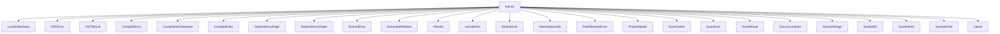

# Namespace `clore::extract`

## Summary

The `clore::extract` namespace provides the core extraction pipeline for analyzing C++ projects. It encompasses types and functions for loading and sanitizing compilation databases (`load_compdb`, `CompilationDatabase`, `CompileEntry`), performing symbol extraction (`extract_symbols`, `extract_project_async`, `SymbolInfo`, `SymbolKind`), building dependency graphs (`DependencyGraph`, `build_dependency_graph_async`, `DependencyEdge`), and managing the resulting project model (`ProjectModel`, `ModuleUnit`, `FileInfo`). Notable utility functions include path normalization (`canonical_graph_path`, `normalize_argument_path`, `project_relative_path`), qualified name manipulation (`namespace_prefix_from_qualified_name`, `join_qualified_name_parts`), and caching support (`ScanCache`, `ensure_cache_key`). The namespace serves as the intermediate layer between raw compilation databases and a structured representation of the project's symbols, dependencies, and module units.

## Diagram


```mermaid
graph TD
    NS["extract"]
    T0["LocalIndexData"]
    NS --> T0
    T1["ASTError"]
    NS --> T1
    T2["ASTResult"]
    NS --> T2
    T3["CompDbError"]
    NS --> T3
    T4["CompilationDatabase"]
    NS --> T4
    T5["CompileEntry"]
    NS --> T5
    T6["DependencyEdge"]
    NS --> T6
    T7["DependencyGraph"]
    NS --> T7
    T8["ExtractError"]
    NS --> T8
    T9["ExtractedRelation"]
    NS --> T9
    T10["FileInfo"]
    NS --> T10
    T11["IncludeInfo"]
    NS --> T11
    T12["ModuleUnit"]
    NS --> T12
    T13["NamespaceInfo"]
    NS --> T13
    T14["PathResolveError"]
    NS --> T14
    T15["ProjectModel"]
    NS --> T15
    T16["ScanCache"]
    NS --> T16
    T17["ScanError"]
    NS --> T17
    T18["ScanResult"]
    NS --> T18
    T19["SourceLocation"]
    NS --> T19
    T20["SourceRange"]
    NS --> T20
    T21["SymbolID"]
    NS --> T21
    T22["SymbolInfo"]
    NS --> T22
    T23["SymbolKind"]
    NS --> T23
    NSC0["cache"]
    NS --> NSC0
```

## Subnamespaces

- [`clore::extract::cache`](cache/index.md)

## Types

### `clore::extract::ASTError`

Declaration: `src/extract/ast.cppm:49`

Definition: `src/extract/ast.cppm:49`

Implementation: [`Module extract:ast`](../../../modules/extract/ast.md)

Insufficient evidence to summarize; provide more EVIDENCE.

#### Invariants

- `message` may be empty or non-empty; no further constraints are documented.

#### Key Members

- `message`

#### Usage Patterns

- Used as the value type in `std::expected` or similar error-handling patterns within extraction code.
- Likely returned or thrown to communicate extraction failures to callers.

### `clore::extract::ASTResult`

Declaration: `src/extract/ast.cppm:60`

Definition: `src/extract/ast.cppm:60`

Implementation: [`Module extract:ast`](../../../modules/extract/ast.md)

Insufficient evidence to summarize; provide more EVIDENCE.

#### Invariants

- Fields are initialized as empty vectors by default.
- All vectors are populated during extraction and are not modified afterward.

#### Key Members

- `symbols`
- `relations`
- `dependencies`

#### Usage Patterns

- Returned by extraction functions as the main output.
- Iterated over by consumers to process symbols, relations, and dependencies.

### `clore::extract::CompDbError`

Declaration: `src/extract/compiler.cppm:54`

Definition: `src/extract/compiler.cppm:54`

Implementation: [`Module extract:compiler`](../../../modules/extract/compiler.md)

`clore::extract::CompDbError` is an error type used to represent issues that arise when reading, parsing, or otherwise interacting with a compilation database. It is typically employed as an error result in operations that load or query the `CompilationDatabase`, allowing callers to distinguish database‑specific failures from other extraction errors.

#### Invariants

- The `message` member always contains a non-empty string when an error occurs
- The struct is trivially constructible and destructible

#### Key Members

- `message`: a `std::string` storing the error description

#### Usage Patterns

- Thrown as an exception in error paths of compilation database extraction
- Returned as part of a `std::expected` or similar error-handling mechanism
- Logged or displayed to the user to indicate what went wrong

### `clore::extract::CompilationDatabase`

Declaration: `src/extract/compiler.cppm:47`

Definition: `src/extract/compiler.cppm:47`

Implementation: [`Module extract:compiler`](../../../modules/extract/compiler.md)

Insufficient evidence to summarize; provide more EVIDENCE.

#### Invariants

- `entries` stores the compilation entries
- `toolchain_cache` maps a key (e.g., compiler path) to a list of command-line arguments
- `has_cached_toolchain` reflects the presence of cache entries

#### Key Members

- `entries`
- `toolchain_cache`
- `has_cached_toolchain`

#### Usage Patterns

- Used to represent a compilation database with associated toolchain caching
- Other code populates `entries` and may query `has_cached_toolchain` before accessing the cache

#### Member Functions

##### `clore::extract::CompilationDatabase::has_cached_toolchain`

Declaration: `src/extract/compiler.cppm:51`

Definition: `src/extract/compiler.cppm:245`

Implementation: [`Module extract:compiler`](../../../modules/extract/compiler.md)

###### Declaration

```cpp
auto () const -> bool;
```

### `clore::extract::CompileEntry`

Declaration: `src/extract/compiler.cppm:37`

Definition: `src/extract/compiler.cppm:37`

Implementation: [`Module extract:compiler`](../../../modules/extract/compiler.md)

Insufficient evidence to summarize; provide more EVIDENCE.

#### Invariants

- Each entry corresponds to exactly one compiler invocation.
- `file` and `directory` are expected to be non-empty for a valid entry.
- `compile_signature` is derived from the command-line arguments and file paths for deduplication.
- `cache_key` is computed from `normalized_file`, `compile_signature`, and optionally `source_hash`.

#### Key Members

- `file`
- `directory`
- `arguments`
- `normalized_file`
- `compile_signature`
- `source_hash`
- `cache_key`

#### Usage Patterns

- Populated by the compilation database extractor from JSON compile commands.
- Used as input to caching or deduplication logic via `compile_signature` and `cache_key`.
- `source_hash` is optionally computed during caching to detect source file changes.
- Stored in a container for export or analysis.

### `clore::extract::DependencyEdge`

Declaration: `src/extract/scan.cppm:69`

Definition: `src/extract/scan.cppm:69`

Implementation: [`Module extract:scan`](../../../modules/extract/scan.md)

The `clore::extract::DependencyEdge` struct represents a single directed edge within the dependency graph of a codebase. It captures the dependency relationship between two entities, such as source files or module units, as discovered during the extraction phase. This type is typically used in conjunction with `clore::extract::DependencyGraph` to model the structure of dependencies among translation units.

#### Invariants

- No explicit invariants
- Fields are user-supplied strings with no constraints on content

#### Key Members

- `from`
- `to`

#### Usage Patterns

- Used to represent a direct dependency relationship in extraction analysis
- Likely stored in a container as part of a larger dependency graph structure

### `clore::extract::DependencyGraph`

Declaration: `src/extract/scan.cppm:74`

Definition: `src/extract/scan.cppm:74`

Implementation: [`Module extract:scan`](../../../modules/extract/scan.md)

Insufficient evidence to summarize; provide more EVIDENCE.

#### Invariants

- `files` and `edges` are maintained in a consistent state
- Indices in `edges` are valid with respect to the size of `files`

#### Key Members

- `files` vector stores the list of file paths
- `edges` vector stores the dependency relationships

#### Usage Patterns

- Populated during the dependency scanning phase
- Consumed by downstream processing or serialization

### `clore::extract::ExtractError`

Declaration: `src/extract/extract.cppm:43`

Definition: `src/extract/extract.cppm:43`

Implementation: [`Module extract`](../../../modules/extract/index.md)

Insufficient evidence to summarize; provide more EVIDENCE.

#### Invariants

- `message` may be empty or contain a descriptive error text

#### Key Members

- `message` member

#### Usage Patterns

- Returned from extraction functions when an error occurs
- Accessed to display or log the error message

### `clore::extract::ExtractedRelation`

Declaration: `src/extract/ast.cppm:53`

Definition: `src/extract/ast.cppm:53`

Implementation: [`Module extract:ast`](../../../modules/extract/ast.md)

Insufficient evidence to summarize; provide more EVIDENCE.

#### Invariants

- The relation is directed from `from` to `to`.
- At most one of `is_call` or `is_inheritance` may be true at a time, but this is not enforced by the type.

#### Key Members

- `from`
- `to`
- `is_call`
- `is_inheritance`

#### Usage Patterns

- Used as an element in collections of extracted symbol relationships.
- Checked downstream to classify edges for graph construction or analysis.

### `clore::extract::FileInfo`

Declaration: `src/extract/model.cppm:139`

Definition: `src/extract/model.cppm:139`

Implementation: [`Module extract:model`](../../../modules/extract/model.md)

The `clore::extract::FileInfo` structure encapsulates metadata about a source file processed during the extraction pipeline. It stores identifying information—such as the file path—and is used in conjunction with related types like `IncludeInfo` and `CompileEntry` to track file dependencies and compilation context. This type serves as a fundamental building block for representing the file‑level details that drive scanning and symbol extraction within the `clore` extraction framework.

### `clore::extract::IncludeInfo`

Declaration: `src/extract/scan.cppm:42`

Definition: `src/extract/scan.cppm:42`

Implementation: [`Module extract:scan`](../../../modules/extract/scan.md)

Insufficient evidence to summarize; provide more EVIDENCE.

#### Invariants

- `is_angled` is true iff the include was written with angle brackets.
- path may be empty if not set.

#### Key Members

- path
- `is_angled`

#### Usage Patterns

- Used by the scanner to represent parsed include directives.
- Likely consumed by the extraction system to process includes.

### `clore::extract::ModuleUnit`

Declaration: `src/extract/model.cppm:152`

Definition: `src/extract/model.cppm:152`

Implementation: [`Module extract:model`](../../../modules/extract/model.md)

`clore::extract::ModuleUnit` models a single C++20 module unit, representing either an interface unit or a partition unit. This type is used within the extraction pipeline to capture and organize data about each module unit encountered during analysis, enabling downstream processing such as building a module dependency graph or generating symbol information.

#### Invariants

- `is_interface` is `true` for `export module` and `false` for `module`.
- `name` is the full module name as written in the source (e.g., `"foo"` or `"foo:bar"`).
- `source_file` is a normalized path (absolute or relative) to the source file.
- `imports` and `symbols` contain the parsed imports and symbols from the module unit.

#### Key Members

- `name`
- `is_interface`
- `source_file`
- `imports`
- `symbols`

#### Usage Patterns

- Stores the parsed result of a C++20 module unit in the extraction pipeline.
- Used as a data source for building module dependency graphs and symbol tables.
- Referenced by other structures in the `clore::extract` model to represent collection of module units.

### `clore::extract::NamespaceInfo`

Declaration: `src/extract/model.cppm:145`

Definition: `src/extract/model.cppm:145`

Implementation: [`Module extract:model`](../../../modules/extract/model.md)

Insufficient evidence to summarize; provide more EVIDENCE.

#### Invariants

- No explicit invariants are documented from the provided evidence.

#### Key Members

- `name`: the namespace name
- `symbols`: list of symbol identifiers belonging to this namespace
- `children`: names of child namespaces

#### Usage Patterns

- `NamespaceInfo` is used to model namespace hierarchy and symbol membership within the extraction framework.

### `clore::extract::PathResolveError`

Declaration: `src/extract/filter.cppm:17`

Definition: `src/extract/filter.cppm:17`

Implementation: [`Module extract:filter`](../../../modules/extract/filter.md)

Insufficient evidence to summarize; provide more EVIDENCE.

#### Invariants

- The `message` member is intended to provide explanatory text for the error.

#### Key Members

- `message` – a `std::string` that describes the error.

#### Usage Patterns

- No direct usage patterns are evident from the provided context.

### `clore::extract::ProjectModel`

Declaration: `src/extract/model.cppm:160`

Definition: `src/extract/model.cppm:160`

Implementation: [`Module extract:model`](../../../modules/extract/model.md)

Insufficient evidence to summarize; provide more EVIDENCE.

#### Invariants

- `uses_modules` is `true` if and only if at least one module declaration was found during extraction.
- Keys in `modules` are normalized source file paths.
- `symbol_ids_by_qualified_name` may contain multiple `SymbolID` entries per qualified name when overloads exist.
- All maps are populated only after extraction completes.

#### Key Members

- `symbols`
- `files`
- `namespaces`
- `modules`
- `symbol_ids_by_qualified_name`
- `module_name_to_sources`
- `file_order`
- `uses_modules`

#### Usage Patterns

- Used during code generation and evidence building to look up symbols by qualified name and modules by name.
- Accessed after extraction to retrieve the project model for downstream processing.

### `clore::extract::ScanCache`

Declaration: `src/extract/scan.cppm:58`

Definition: `src/extract/scan.cppm:58`

Implementation: [`Module extract:scan`](../../../modules/extract/scan.md)

The `clore::extract::ScanCache` struct represents a persistent cache that is shared across successive dependency scans. Its primary purpose is to store intermediate results or precomputed information that can be reused when scanning the same project multiple times, thereby avoiding redundant file system or compilation database accesses. To maintain correctness, callers must clear or discard the entire cache whenever the compilation database or file system state changes, as the cached data may become stale. This struct is typically used internally by the extraction pipeline to improve performance over repeated scanning runs.

#### Invariants

- Cache is valid only as long as the compilation database and file system state remain unchanged.
- Callers must clear or discard the cache after any relevant state change.

#### Key Members

- `scan_results`: the underlying unordered map storing cached `ScanResult` objects.

#### Usage Patterns

- Shared across successive dependency scans to avoid recomputation.
- Cleared or replaced by callers when the compilation DB or file system state changes.

### `clore::extract::ScanError`

Declaration: `src/extract/scan.cppm:38`

Definition: `src/extract/scan.cppm:38`

Implementation: [`Module extract:scan`](../../../modules/extract/scan.md)

Insufficient evidence to summarize; provide more EVIDENCE.

#### Invariants

- The `message` member may be empty or non-empty; no constraints are enforced.

#### Key Members

- `std::string message` - stores the error description.

#### Usage Patterns

- Returned or thrown by scanning functions to indicate an error.
- Used in `clore::extract` operations to communicate failure details.

### `clore::extract::ScanResult`

Declaration: `src/extract/scan.cppm:47`

Definition: `src/extract/scan.cppm:47`

Implementation: [`Module extract:scan`](../../../modules/extract/scan.md)

Insufficient evidence to summarize; provide more EVIDENCE.

#### Invariants

- No explicit invariants are documented or implied by the struct definition.

#### Key Members

- `module_name`
- `is_interface_unit`
- `includes`
- `module_imports`

#### Usage Patterns

- Used to aggregate and pass around scan results from module extraction.
- Consumed by downstream processing to query module name, imports, includes, and interface unit status.

### `clore::extract::SourceLocation`

Declaration: `src/extract/model.cppm:81`

Definition: `src/extract/model.cppm:81`

Implementation: [`Module extract:model`](../../../modules/extract/model.md)

The `clore::extract::SourceLocation` struct represents a specific position in a source file, typically capturing the file path, line number, and column number where a program element is declared or referenced. It is used throughout the extraction pipeline to associate extracted symbols, relations, and errors with their exact source provenance. Together with `clore::extract::SourceRange`, it provides the fundamental spatial reference for all location-aware data in the `clore::extract` namespace.

#### Invariants

- `line == 0` indicates an unknown location
- Valid source lines are positive integers (>=1)
- Default construction yields an unknown location

#### Key Members

- `file`
- `line`
- `column`
- `is_known()`

#### Usage Patterns

- Stored as a member in other extraction-related types
- Checked via `is_known()` to determine if location is valid
- Passed around as a value type to convey source provenance

#### Member Functions

##### `clore::extract::SourceLocation::is_known`

Declaration: `src/extract/model.cppm:87`

Definition: `src/extract/model.cppm:87`

Implementation: [`Module extract:model`](../../../modules/extract/model.md)

###### Declaration

```cpp
bool () const noexcept;
```

### `clore::extract::SourceRange`

Declaration: `src/extract/model.cppm:92`

Definition: `src/extract/model.cppm:92`

Implementation: [`Module extract:model`](../../../modules/extract/model.md)

Insufficient evidence to summarize; provide more EVIDENCE.

#### Invariants

- No documented invariants; the relationship between begin and end is not enforced by the type.

#### Key Members

- `begin`: the starting location of the range
- `end`: the ending location of the range

#### Usage Patterns

- Likely used to represent source regions for diagnostics or highlighting in `clore::extract` contexts.

### `clore::extract::SymbolID`

Declaration: `src/extract/model.cppm:45`

Definition: `src/extract/model.cppm:45`

Implementation: [`Module extract:model`](../../../modules/extract/model.md)

The `clore::extract::SymbolID` struct represents a unique identifier for a symbol within the extraction model. It is used to reference, track, and distinguish individual symbols—such as functions, types, or variables—across the extracted project data. As a core identity type, `SymbolID` serves as the key that connects related symbol information, including its kind, location, and relationships, throughout the extraction pipeline.

#### Invariants

- `hash == 0` denotes an invalid/null identifier.
- Valid `SymbolID` objects always have a non-zero `hash`.
- The `signature` field disambiguates the astronomically unlikely case of a 64-bit hash collision.

#### Key Members

- `hash`
- `signature`
- `is_valid()`

#### Usage Patterns

- Used as a unique, comparable identifier for symbols extracted from source code.
- Comparison `operator`s (`==`, `<=>`) allow sorting and hashing in containers.
- `is_valid()` is used to test whether a `SymbolID` represents an actual symbol.

#### Member Functions

##### `clore::extract::SymbolID::is_valid`

Declaration: `src/extract/model.cppm:52`

Definition: `src/extract/model.cppm:52`

Implementation: [`Module extract:model`](../../../modules/extract/model.md)

###### Declaration

```cpp
bool () const noexcept;
```

##### `clore::extract::SymbolID::operator<=>`

Declaration: `src/extract/model.cppm:57`

Definition: `src/extract/model.cppm:57`

Implementation: [`Module extract:model`](../../../modules/extract/model.md)

###### Declaration

```cpp
std::strong_ordering (const SymbolID &) const;
```

##### `clore::extract::SymbolID::operator==`

Declaration: `src/extract/model.cppm:56`

Definition: `src/extract/model.cppm:56`

Implementation: [`Module extract:model`](../../../modules/extract/model.md)

###### Declaration

```cpp
bool (const SymbolID &) const;
```

### `clore::extract::SymbolInfo`

Declaration: `src/extract/model.cppm:97`

Definition: `src/extract/model.cppm:97`

Implementation: [`Module extract:model`](../../../modules/extract/model.md)

The `clore::extract::SymbolInfo` struct holds the metadata for a single symbol discovered during source code extraction. It is a core data type within the extraction model, typically pairing a `SymbolID` with a `SymbolKind` and associated location information (`SourceLocation`, `SourceRange`) to represent how the symbol appears in the source. Instances of `SymbolInfo` are produced during scanning and are referenced by higher-level structures such as `ExtractedRelation`, `DependencyGraph`, and `ProjectModel` to build a complete representation of the project’s symbols and their relationships.

#### Invariants

- `id` is unique per symbol
- `name` is the unqualified name
- `source_snippet_offset`/`length`/`file_size`/`hash` are used only when `source_snippet` is empty
- `parent` and `children` are consistent for tree structure
- `bases` and `derived` are consistent for inheritance
- `calls` and `called_by` are consistent for call graph
- `references` and `referenced_by` are consistent for reference graph

#### Key Members

- `id`
- `kind`
- `name`
- `qualified_name`
- `declaration_location`
- `definition_location`
- `parent`
- `children`
- `bases`
- `derived`
- `calls`
- `called_by`
- `references`
- `referenced_by`
- `is_template`

#### Usage Patterns

- Used as the output of extraction
- Clients read fields to build documentation or analysis
- `parent`/`children` used for hierarchy
- `bases`/`derived` for inheritance
- `calls`/`called_by` for call graph
- `references`/`referenced_by` for usage tracking
- Lazy source snippet fields used for on-demand loading

### `clore::extract::SymbolKind`

Declaration: `src/extract/model.cppm:25`

Definition: `src/extract/model.cppm:25`

Implementation: [`Module extract:model`](../../../modules/extract/model.md)

The `clore::extract::SymbolKind` enumeration represents the classification of symbols encountered during code extraction. It categorizes each symbol (e.g., function, variable, type, namespace) to allow the extraction pipeline to handle and store different kinds of symbols uniformly. This enum is primarily used within structured types such as `clore::extract::SymbolInfo` and `clore::extract::ExtractedRelation` to identify the nature of a symbol, enabling downstream processing like indexing, dependency analysis, and project model construction.

#### Invariants

- Each enumerator represents a unique symbol category.
- The underlying type `std::uint8_t` ensures compact storage.
- The set of members is fixed and defined at compile time.

#### Key Members

- `Namespace`
- `Class`
- `Function`
- `Method`
- `Variable`
- `Unknown`

#### Usage Patterns

- Used to tag extracted symbols with their kind for downstream processing.
- Employed in switch statements or lookup tables to dispatch behavior per symbol type.
- Referenced in serialization or storage of symbol metadata.

#### Member Variables

##### `clore::extract::SymbolKind::Class`

Declaration: `src/extract/model.cppm:27`

Implementation: [`Module extract:model`](../../../modules/extract/model.md)

###### Declaration

```cpp
Class
```

##### `clore::extract::SymbolKind::Concept`

Declaration: `src/extract/model.cppm:39`

Implementation: [`Module extract:model`](../../../modules/extract/model.md)

###### Declaration

```cpp
Concept
```

##### `clore::extract::SymbolKind::Enum`

Declaration: `src/extract/model.cppm:30`

Implementation: [`Module extract:model`](../../../modules/extract/model.md)

###### Declaration

```cpp
Enum
```

##### `clore::extract::SymbolKind::EnumMember`

Declaration: `src/extract/model.cppm:31`

Implementation: [`Module extract:model`](../../../modules/extract/model.md)

###### Declaration

```cpp
EnumMember
```

##### `clore::extract::SymbolKind::Field`

Declaration: `src/extract/model.cppm:35`

Implementation: [`Module extract:model`](../../../modules/extract/model.md)

###### Declaration

```cpp
Field
```

##### `clore::extract::SymbolKind::Function`

Declaration: `src/extract/model.cppm:32`

Implementation: [`Module extract:model`](../../../modules/extract/model.md)

###### Declaration

```cpp
Function
```

##### `clore::extract::SymbolKind::Macro`

Declaration: `src/extract/model.cppm:37`

Implementation: [`Module extract:model`](../../../modules/extract/model.md)

###### Declaration

```cpp
Macro
```

##### `clore::extract::SymbolKind::Method`

Declaration: `src/extract/model.cppm:33`

Implementation: [`Module extract:model`](../../../modules/extract/model.md)

###### Declaration

```cpp
Method
```

##### `clore::extract::SymbolKind::Namespace`

Declaration: `src/extract/model.cppm:26`

Implementation: [`Module extract:model`](../../../modules/extract/model.md)

###### Declaration

```cpp
Namespace
```

##### `clore::extract::SymbolKind::Struct`

Declaration: `src/extract/model.cppm:28`

Implementation: [`Module extract:model`](../../../modules/extract/model.md)

###### Declaration

```cpp
Struct
```

##### `clore::extract::SymbolKind::Template`

Declaration: `src/extract/model.cppm:38`

Implementation: [`Module extract:model`](../../../modules/extract/model.md)

###### Declaration

```cpp
Template
```

##### `clore::extract::SymbolKind::TypeAlias`

Declaration: `src/extract/model.cppm:36`

Implementation: [`Module extract:model`](../../../modules/extract/model.md)

###### Declaration

```cpp
TypeAlias
```

##### `clore::extract::SymbolKind::Union`

Declaration: `src/extract/model.cppm:29`

Implementation: [`Module extract:model`](../../../modules/extract/model.md)

###### Declaration

```cpp
Union
```

##### `clore::extract::SymbolKind::Unknown`

Declaration: `src/extract/model.cppm:40`

Implementation: [`Module extract:model`](../../../modules/extract/model.md)

###### Declaration

```cpp
Unknown
```

##### `clore::extract::SymbolKind::Variable`

Declaration: `src/extract/model.cppm:34`

Implementation: [`Module extract:model`](../../../modules/extract/model.md)

###### Declaration

```cpp
Variable
```

## Functions

### `clore::extract::append_unique`

Declaration: `src/extract/merge.cppm:26`

Definition: `src/extract/merge.cppm:26`

Implementation: [`Module extract:merge`](../../../modules/extract/merge.md)

The `append_unique` function adds a new element of type `T` to the mutable collection referenced by the first integer argument. It guarantees that the collection never contains duplicate entries: if an element equal to the provided `T` value already exists, the insertion is silently skipped. Callers must supply a valid reference to a collection that supports unique-appending semantics; the collection’s equality criterion is determined by its underlying type. This function is useful for building de-duplicated lists during merge or extraction workflows.

#### Usage Patterns

- Insert unique elements into a container
- Avoid duplicates in merge or accumulation operations

### `clore::extract::append_unique_range`

Declaration: `src/extract/merge.cppm:33`

Definition: `src/extract/merge.cppm:33`

Implementation: [`Module extract:merge`](../../../modules/extract/merge.md)

Appends each element from a source range to a target collection, but only if that element is not already present in the target. The function preserves the relative order of newly added elements while avoiding duplicates; any element that compares equal to an existing element in the target is silently skipped.

The caller supplies a mutable reference to the target container and a const reference to the range of candidate elements. The target collection must support iteration and insertion (e.g., `std::vector`). The function uses element equality (typically via `operator==` or a project‑specific comparator) to detect duplicates. After the call, the target contains all its original elements plus those elements from the source range that were not already present.

#### Usage Patterns

- Used to merge collections while avoiding duplicates
- Called in repeated merge operations where `values` grows over time

### `clore::extract::build_compile_signature`

Declaration: `src/extract/compiler.cppm:74`

Definition: `src/extract/compiler.cppm:126`

Implementation: [`Module extract:compiler`](../../../modules/extract/compiler.md)

This function computes a compile signature for the provided `clore::extract::CompileEntry`. The returned `std::uint64_t` value acts as a compact, deterministic identifier for the compile action, enabling caching, deduplication, and efficient lookup of previously processed entries. Callers must supply a fully initialized `CompileEntry`; the signature remains stable across calls for the same input.

#### Usage Patterns

- called during compilation database processing to generate unique signatures for compile entries
- used for caching and deduplication of compile commands

### `clore::extract::build_dependency_graph_async`

Declaration: `src/extract/scan.cppm:79`

Definition: `src/extract/scan.cppm:388`

Implementation: [`Module extract:scan`](../../../modules/extract/scan.md)

The function `clore::extract::build_dependency_graph_async` initiates an asynchronous operation that constructs and populates a `DependencyGraph` for the project represented by the caller‑supplied identifier. The caller provides a reference to a `DependencyGraph` that will be filled with the resulting dependency data, an optional `ScanCache` pointer (which may be `nullptr` to bypass caching), and a reference to a `kota::event_loop` that drives the asynchronous work. The function returns an integer indicating success or an error condition. The caller is responsible for ensuring the `DependencyGraph` and `ScanCache` (if provided) remain valid until the asynchronous operation completes; completion is signalled through the event loop’s lifecycle.

#### Usage Patterns

- Called to build a dependency graph from a compilation database asynchronously.
- Part of the project extraction pipeline to capture file dependencies.
- Typically invoked once per project analysis session.

### `clore::extract::canonical_graph_path`

Declaration: `src/extract/filter.cppm:30`

Definition: `src/extract/filter.cppm:112`

Implementation: [`Module extract:filter`](../../../modules/extract/filter.md)

Declaration: [Declaration](functions/canonical-graph-path.md)

The function `clore::extract::canonical_graph_path` accepts a `const std::filesystem::path &` and returns a `std::string`. Its responsibility is to produce a canonical, portable string representation of the given path that can be used as a stable key or for equality comparisons—for example, when determining whether a file path matches filtering rules relative to a root directory. Callers should supply a valid filesystem path; the returned string is normalized so that semantically identical paths yield the same value, regardless of platform‑specific separators or symlink states. This guarantees consistent, predictable lookup and filtering behaviour across the extraction pipeline.

#### Usage Patterns

- Used by `clore::extract::matches_filter` to obtain a canonical string representation of a path for comparison

### `clore::extract::create_compiler_instance`

Declaration: `src/extract/compiler.cppm:81`

Definition: `src/extract/compiler.cppm:313`

Implementation: [`Module extract:compiler`](../../../modules/extract/compiler.md)

`clore::extract::create_compiler_instance` creates a new compiler instance corresponding to the provided `CompileEntry`. The returned `int` serves as an opaque handle for the created instance; this handle can be passed to other extraction functions that require a compiler context. The caller is responsible for supplying a valid `CompileEntry` that is consistent with the compilation database, typically obtained from `clore::extract::load_compdb`. The function internalises the compiler configuration and toolchain information needed to process the entry, but does not perform any extraction itself.

#### Usage Patterns

- Used to create a Clang compiler instance for further analysis or extraction.
- Typically called with a compile entry from a `CompilationDatabase`.
- Returned instance is passed to other functions like `extract_symbols` or `scan_file`.

### `clore::extract::deduplicate`

Declaration: `src/extract/merge.cppm:63`

Definition: `src/extract/merge.cppm:63`

Implementation: [`Module extract:merge`](../../../modules/extract/merge.md)

The template function `clore::extract::deduplicate` modifies a container in place by removing duplicate elements. It expects a reference to a collection whose element type `T` supports equality comparison. After the operation, the container retains only the first occurrence of each distinct value, preserving the relative order of those unique elements. The caller must ensure that the container type allows element removal (e.g., via `erase`).

#### Usage Patterns

- Called to remove duplicates from a sorted or unsorted vector before further processing.

### `clore::extract::ensure_cache_key`

Declaration: `src/extract/compiler.cppm:76`

Definition: `src/extract/compiler.cppm:241`

Implementation: [`Module extract:compiler`](../../../modules/extract/compiler.md)

Declaration: [Declaration](functions/ensure-cache-key.md)

The function `clore::extract::ensure_cache_key` accepts a `CompileEntry &` and ensures that the entry has a valid internal cache key computed. After the call, the entry is guaranteed to be in a state where its cached representation is ready for use with the compilation database’s caching mechanism. This function is intended to be called before any caching operation that depends on a stable, deduplicated key derived from the entry’s tool arguments. The operation is idempotent: invoking it multiple times on the same entry produces the same effect and does not invalidate prior results.

#### Usage Patterns

- Called by `query_toolchain_cached` to ensure a cache key is set for a compile entry before use.

### `clore::extract::ensure_cache_key_impl`

Declaration: `src/extract/compiler.cppm:135`

Definition: `src/extract/compiler.cppm:135`

Implementation: [`Module extract:compiler`](../../../modules/extract/compiler.md)

Declaration: [Declaration](functions/ensure-cache-key-impl.md)

The function `clore::extract::ensure_cache_key_impl` ensures that the given `CompileEntry` object holds a valid cache key that uniquely identifies the compilation for caching purposes. It modifies the entry in-place, setting or regenerating the key as needed. The caller must provide a reference to a `CompileEntry` that has been fully initialized with compilation data; after the call, the entry is guaranteed to contain a stable cache key suitable for use with the caching subsystem.

#### Usage Patterns

- Called by `clore::extract::ensure_cache_key` to ensure a compile entry's cache key is computed

### `clore::extract::extract_project_async`

Declaration: `src/extract/extract.cppm:47`

Definition: `src/extract/extract.cppm:561`

Implementation: [`Module extract`](../../../modules/extract/index.md)

The function `clore::extract::extract_project_async` starts the asynchronous extraction of project data (such as symbols, dependencies, and compilation units) for the project identified by the provided integer handle. It schedules the extraction work on the given `kota::event_loop` and returns an `int` handle that can be used to monitor or cancel the operation. The caller must ensure the event loop is actively running and remains alive until the extraction completes; the returned handle is only valid within the scope of that loop and should not be stored across loop iterations.

#### Usage Patterns

- top-level entry point for project extraction
- used with an event loop for asynchronous execution
- integrated with caching for incremental extraction
- called once per project analysis session

### `clore::extract::extract_symbols`

Declaration: `src/extract/ast.cppm:66`

Definition: `src/extract/ast.cppm:692`

Implementation: [`Module extract:ast`](../../../modules/extract/ast.md)

The function `clore::extract::extract_symbols` is the primary entry point for extracting symbol information from a given compilation context, represented by the `const int &` parameter. It returns a `std::expected<ASTResult, ASTError>`, where a successful extraction yields an `ASTResult` containing the resulting AST and symbol data, and a failure yields an `ASTError` describing the error condition.

Callers are responsible for providing a valid and properly initialized input argument that represents the relevant compilation database or project model. The function may perform asynchronous operations; the caller must therefore ensure that any required event loop or resource is available and that the referenced input remains valid for the duration of the call. The contract does not guarantee thread safety; concurrent invocations on the same input require external synchronization unless otherwise documented.

#### Usage Patterns

- Called after loading a compilation database and sanitizing arguments
- Used to extract per-translation-unit symbol information for a project

### `clore::extract::filter_root_path`

Declaration: `src/extract/filter.cppm:36`

Definition: `src/extract/filter.cppm:170`

Implementation: [`Module extract:filter`](../../../modules/extract/filter.md)

The function `clore::extract::filter_root_path` accepts a reference to a `const int` identifier and returns a `std::filesystem::path`. It is responsible for producing a filtered root path derived from the given identifier, typically representing an entry or handle within the extraction context. Callers must supply a valid identifier; the caller can expect the returned path to reflect the effective root after any filtering logic has been applied.

#### Usage Patterns

- Used to obtain a canonical root path for filtering operations.

### `clore::extract::find_module_by_name`

Declaration: `src/extract/model.cppm:205`

Definition: `src/extract/model.cppm:433`

Implementation: [`Module extract:model`](../../../modules/extract/model.md)

Given a populated `ProjectModel` and a module name string, `clore::extract::find_module_by_name` returns a pointer to the corresponding `ModuleUnit` if a module with exactly that name exists in the model, or `nullptr` otherwise. The caller is responsible for ensuring the `ProjectModel` refers to a valid, fully loaded project; the function performs a lookup by normalized name and does not modify the model.

#### Usage Patterns

- Resolve a module name to a single module unit, handling ambiguous definitions
- Used in contexts where a unique module is required for further analysis

### `clore::extract::find_module_by_source`

Declaration: `src/extract/model.cppm:211`

Definition: `src/extract/model.cppm:466`

Implementation: [`Module extract:model`](../../../modules/extract/model.md)

The function `clore::extract::find_module_by_source` searches the provided `ProjectModel` for a `ModuleUnit` whose source file matches the given `std::string_view` path. It returns a pointer to the matching `ModuleUnit`, or `nullptr` if no module is found for that source. The caller is responsible for ensuring the `ProjectModel` is valid and the source path is a non-empty, properly formatted path.

#### Usage Patterns

- used to obtain a module unit by its source path
- often called during project traversal or resolution

### `clore::extract::find_modules_by_name`

Declaration: `src/extract/model.cppm:208`

Definition: `src/extract/model.cppm:412`

Implementation: [`Module extract:model`](../../../modules/extract/model.md)

Searches the `ProjectModel` for every module unit whose name matches the given `std::string_view` name. The function returns an integer that indicates the result of the operation — typically a count of matching modules or a status code that signals success or failure.

The caller provides a reference to the `ProjectModel` and a non-owning view of the module name. The function does not modify the model and can be used to enumerate or validate module existence before further processing. The exact interpretation of the returned integer depends on the calling context and is consistent with other query functions in the `clore::extract` namespace.

#### Usage Patterns

- resolving module references by name
- enumerating module units with a specific name
- preparing data for module-related queries

### `clore::extract::find_symbol`

Declaration: `src/extract/model.cppm:198`

Definition: `src/extract/model.cppm:396`

Implementation: [`Module extract:model`](../../../modules/extract/model.md)

Declaration: [Declaration](functions/find-symbol.md)

`clore::extract::find_symbol` searches a `ProjectModel` for a symbol identified by two string arguments. The second `std::string_view` and third `std::string_view` specify the symbol name and an enclosing context (such as a source file path or a qualified scope) to disambiguate the lookup. If a matching symbol is found, the function returns a pointer to its `SymbolInfo`; otherwise, it returns `nullptr`. This overload provides more precise symbol resolution than the two-parameter variant.

#### Usage Patterns

- Lookup a symbol by name and signature
- Fallback to name-only lookup when signature is empty
- Iterate over matching symbols to find exact signature match

### `clore::extract::find_symbol`

Declaration: `src/extract/model.cppm:196`

Definition: `src/extract/model.cppm:388`

Implementation: [`Module extract:model`](../../../modules/extract/model.md)

Declaration: [Declaration](functions/find-symbol.md)

`clore::extract::find_symbol` looks up a symbol in the provided `ProjectModel` by its fully qualified name. It returns a pointer to the matching `SymbolInfo` if exactly one symbol with that name exists; otherwise it returns `nullptr`. This overload serves as the core qualified‑name lookup and is used by the three‑parameter overload that additionally filters by an optional `signature`.

#### Usage Patterns

- Used to resolve a uniquely identifiable symbol by qualified name.
- Called by the three-parameter overload to refine lookup by module.

### `clore::extract::find_symbols`

Declaration: `src/extract/model.cppm:202`

Definition: `src/extract/model.cppm:371`

Implementation: [`Module extract:model`](../../../modules/extract/model.md)

The function `clore::extract::find_symbols` accepts a reference to a `ProjectModel` and a symbol name as a `std::string_view`, and returns an `int` that serves as a handle to the set of symbols matching that name. It is the caller’s responsibility to provide a valid `ProjectModel`; the function performs a lookup across the model and produces an integer result that can be subsequently used to access or iterate over the found symbols. This handle does not imply any ownership or mutation of the model—the operation is purely query-oriented.

#### Usage Patterns

- Resolving all symbols with a given fully qualified name within a project model
- Displaying symbol information for autocompletion or navigation
- Finding overloads or multiple declarations of the same name

### `clore::extract::join_qualified_name_parts`

Declaration: `src/extract/model.cppm:76`

Definition: `src/extract/model.cppm:345`

Implementation: [`Module extract:model`](../../../modules/extract/model.md)

`clore::extract::join_qualified_name_parts` constructs a single qualified name string from a sequence of name parts. It accepts a reference to an integer representing the source of the parts and a `std::size_t` indicating the number of parts to join. The caller is expected to provide valid parts and a positive count; the function returns the resulting fully delimited qualified name.

#### Usage Patterns

- Reconstructing a qualified name from its individual components
- Used when combining namespace or type name parts

### `clore::extract::load_compdb`

Declaration: `src/extract/compiler.cppm:58`

Definition: `src/extract/compiler.cppm:143`

Implementation: [`Module extract:compiler`](../../../modules/extract/compiler.md)

The function `clore::extract::load_compdb` accepts a `std::string_view` identifying the path to a compilation database (typically a `compile_commands.json` file) and attempts to load it into a `CompilationDatabase` value. On success, it returns a `std::expected<CompilationDatabase, CompDbError>` containing the parsed database; on failure, the returned error value describes the nature of the failure, such as a missing file or a malformed database. Callers must be prepared to handle the error case and should treat the function as the primary entry point for obtaining a compilation database from a given path.

#### Usage Patterns

- called to load a compilation database from a JSON file for further processing
- used in extraction pipeline to obtain compile commands for symbol extraction
- typically invoked early in the extraction workflow

### `clore::extract::lookup`

Declaration: `src/extract/compiler.cppm:60`

Definition: `src/extract/compiler.cppm:180`

Implementation: [`Module extract:compiler`](../../../modules/extract/compiler.md)

The function `clore::extract::lookup` performs a lookup within the given `CompilationDatabase` using the provided `std::string_view` as a key. The caller must supply a valid reference to a `CompilationDatabase` and a non-null string view that identifies a resource (such as a symbol name, file path, or compile entry identifier) within the database.

The return value is an integer that represents the outcome of the lookup — typically an index, handle, or status code indicating whether the key was found and, if so, its associated data. The exact interpretation of the returned integer depends on the caller’s context, but the function guarantees that the result is determined solely by the database contents and the provided key, with no side effects beyond the lookup itself.

#### Usage Patterns

- look up compile entries for a given source file
- used to find compilation commands matching a file

### `clore::extract::lookup_symbol`

Declaration: `src/extract/model.cppm:194`

Definition: `src/extract/model.cppm:366`

Implementation: [`Module extract:model`](../../../modules/extract/model.md)

The function `clore::extract::lookup_symbol` retrieves the detailed information for a single symbol identified by its `SymbolID` from a given `ProjectModel`. The caller provides a reference to the project model and the unique identifier of the symbol; the function returns a pointer to a `const SymbolInfo` object if the symbol exists, or `nullptr` if the identifier is not found in the model. This function is the primary way to resolve a `SymbolID` back to its full metadata after extraction or during query operations, serving as a direct, identifier-based lookup counterpart to name‑based searches like `find_symbol`.

#### Usage Patterns

- Look up a symbol by its unique identifier
- Used in symbol resolution and merging operations

### `clore::extract::matches_filter`

Declaration: `src/extract/filter.cppm:32`

Definition: `src/extract/filter.cppm:133`

Implementation: [`Module extract:filter`](../../../modules/extract/filter.md)

The function `clore::extract::matches_filter` is a caller-facing predicate that determines whether a given entity—identified by a reference to an integer and a filesystem path—satisfies the conditions implied by the provided filter string. It returns a boolean value indicating a match, allowing callers to selectively include or exclude compilation entries or symbols during extraction operations based on filter criteria. The exact interpretation of the filter and the role of the integer reference are part of the function’s contract, but the result directly controls whether the entity passes the filter.

#### Usage Patterns

- Called during extract processing to filter source files
- Used to check if a file path matches include/exclude filtering rules

### `clore::extract::merge_symbol_info`

Declaration: `src/extract/merge.cppm:68`

Definition: `src/extract/merge.cppm:225`

Implementation: [`Module extract:merge`](../../../modules/extract/merge.md)

`clore::extract::merge_symbol_info` accepts a mutable reference to an existing symbol‑info container as its first argument and an rvalue reference to another symbol‑info object as its second. It merges the data from the second object into the first, transferring ownership of resources where appropriate. The caller must ensure that the first argument refers to a valid, modifiable symbol‑info container; the second argument is consumed and may be left in a valid but unspecified state after the call. The function returns no value.

#### Usage Patterns

- Called when combining symbol info from incremental extraction passes
- Used in batch processing pipelines to accumulate symbol metadata

### `clore::extract::merge_symbol_info`

Declaration: `src/extract/merge.cppm:69`

Definition: `src/extract/merge.cppm:229`

Implementation: [`Module extract:merge`](../../../modules/extract/merge.md)

The function `clore::extract::merge_symbol_info` accepts a mutable reference to a target object and a const reference to a source object of the same type (`int`). It merges the symbol information held in the source into the target, updating the target with the combined data. The caller is responsible for ensuring that both arguments refer to valid, properly initialized objects representing extracted symbol information. The operation does not modify the source and leaves the target extended or updated according to the merge semantics defined by the underlying type.

#### Usage Patterns

- Called to merge symbol information from one `SymbolInfo` into another.

### `clore::extract::namespace_prefix_from_qualified_name`

Declaration: `src/extract/model.cppm:79`

Definition: `src/extract/model.cppm:358`

Implementation: [`Module extract:model`](../../../modules/extract/model.md)

The function `clore::extract::namespace_prefix_from_qualified_name` extracts the namespace prefix from a given qualified name. The caller passes a `std::string_view` representing a qualified C++ name (e.g., `clore::extract::foo`), and the function returns the leading namespace components as a `std::string` (e.g., `clore::extract`). If the input contains no `::` separators, the function returns an empty string, indicating that the name is unqualified. This function does not modify the input and assumes the caller provides a valid qualified name; the result is the portion of the name that precedes the final unqualified identifier.

#### Usage Patterns

- Extract namespace prefix from qualified name
- Used in symbol processing to determine containing namespace

### `clore::extract::normalize_argument_path`

Declaration: `src/extract/compiler.cppm:65`

Definition: `src/extract/compiler.cppm:204`

Implementation: [`Module extract:compiler`](../../../modules/extract/compiler.md)

Declaration: [Declaration](functions/normalize-argument-path.md)

The function `clore::extract::normalize_argument_path` accepts two `std::string_view` arguments representing a base directory and a path string, and returns a `std::filesystem::path`. It resolves the given path relative to the base directory and produces a normalized, absolute filesystem path. Callers can rely on the result being in a canonical form suitable for subsequent comparison or deduplication of file arguments within a compilation entry.

#### Usage Patterns

- Called from `clore::extract::sanitize_driver_arguments` to normalize file arguments

### `clore::extract::normalize_entry_file`

Declaration: `src/extract/compiler.cppm:72`

Definition: `src/extract/compiler.cppm:107`

Implementation: [`Module extract:compiler`](../../../modules/extract/compiler.md)

Declaration: [Declaration](functions/normalize-entry-file.md)

Given a `CompileEntry`, `clore::extract::normalize_entry_file` produces a canonical `std::string` representing the entry's source file path. The caller can rely on the returned string being suitable as a stable, normalized key for caching and signature computation; it is used by `clore::extract::build_compile_signature` and `clore::extract::ensure_cache_key_impl` to populate the entry's `normalized_file` field. The function expects the `CompileEntry` to contain a valid file reference.

#### Usage Patterns

- normalize file path for compile entries
- used in `build_compile_signature`
- used in `ensure_cache_key_impl`

### `clore::extract::path_prefix_matches`

Declaration: `src/extract/filter.cppm:21`

Definition: `src/extract/filter.cppm:42`

Implementation: [`Module extract:filter`](../../../modules/extract/filter.md)

The function `clore::extract::path_prefix_matches` is a binary predicate that accepts two `std::string_view` arguments representing path strings and returns a `bool`. It determines whether the first path effectively starts with the second path as a prefix, typically applying path‑aware component matching (e.g., ensuring the prefix ends on a separator boundary). Callers use this utility to test if a given file or directory path lies under a specified root or sub‑directory, enabling filtering operations during the extraction workflow. The contract is a straightforward prefix‑match test; no path canonicalisation or normalisation is performed—inputs should already be in a comparable form.

#### Usage Patterns

- Path filtering in directory-based selection
- Matching file paths against prefix patterns

### `clore::extract::project_relative_path`

Declaration: `src/extract/filter.cppm:23`

Definition: `src/extract/filter.cppm:73`

Implementation: [`Module extract:filter`](../../../modules/extract/filter.md)

The function `clore::extract::project_relative_path` accepts two `const std::filesystem::path &` arguments: a project root directory and a target path. It computes the target path relative to the root and returns it as a `std::optional<std::filesystem::path>`. If the target path is not located under the project root, the function returns `std::nullopt`.

Callers can use this function to obtain a normalized, project-relative representation of a file path, which is useful for filtering, display, or storage within the extraction pipeline. The contract ensures that the returned path is relative and lexically normal, with no guarantee of existence or canonicalization beyond what the standard library provides.

#### Usage Patterns

- Converting absolute file path to project-relative path
- Validating that a file is under a given root directory

### `clore::extract::query_toolchain_cached`

Declaration: `src/extract/compiler.cppm:78`

Definition: `src/extract/compiler.cppm:249`

Implementation: [`Module extract:compiler`](../../../modules/extract/compiler.md)

`clore::extract::query_toolchain_cached` retrieves or computes the toolchain identifier associated with a given compile entry, using the provided compilation database's internal cache. It expects a non-const reference to a `CompilationDatabase` so that the cache can be updated, and a const reference to a `CompileEntry` describing the translation unit. The function ensures the entry has an appropriate cache key (via `ensure_cache_key`) before performing the lookup.

The returned integer represents an opaque handle or index for the resolved toolchain, which can be used in subsequent extraction steps. Callers must provide a valid `CompilationDatabase` and `CompileEntry`; the contract is that the function will not modify the entry beyond its cache key state and will return a valid toolchain identifier or an error indicator (if any).

#### Usage Patterns

- Called to retrieve or compute sanitized tool arguments with caching
- Used internally by toolchain processing functions

### `clore::extract::rebuild_lookup_maps`

Declaration: `src/extract/merge.cppm:73`

Definition: `src/extract/merge.cppm:442`

Implementation: [`Module extract:merge`](../../../modules/extract/merge.md)

The function `clore::extract::rebuild_lookup_maps` refreshes the internal lookup maps associated with a project model handle passed by non-const reference. After a successful call, the maps are guaranteed to be consistent with the current symbol and module data, enabling efficient name‑to‑symbol and source‑location‑to‑symbol resolution. The caller must supply a valid handle previously produced by functions such as `clore::extract::load_compdb` or `clore::extract::extract_project_async`; the handle is mutated in place to refer to the updated maps. No return value indicates success; on failure (e.g., invalid handle) the behavior is undefined.

#### Usage Patterns

- Called after merging symbol information to update lookup indices
- Used to maintain consistency of reverse maps in `ProjectModel`
- Prepares the model for fast symbol and module queries

### `clore::extract::rebuild_model_indexes`

Declaration: `src/extract/merge.cppm:71`

Definition: `src/extract/merge.cppm:233`

Implementation: [`Module extract:merge`](../../../modules/extract/merge.md)

`clore::extract::rebuild_model_indexes` takes a read-only reference to a project model and a mutable reference to the same model, and updates the model’s internal index structures so that subsequent queries (e.g., symbol lookup, module resolution) operate against a consistent and up-to‑date state.  
The caller is responsible for ensuring that the model’s data has been modified (for instance, through calls like `clore::extract::merge_symbol_info` or `clore::extract::deduplicate`) before invoking this function. After the call, the model is ready for indexed‑access operations; no particular ordering of prior modifications is required.

#### Usage Patterns

- Called after symbol extraction to rebuild lookup indexes
- Used during project model construction or update
- Invoked to ensure file, namespace, and parent–child associations are current

### `clore::extract::resolve_path_under_directory`

Declaration: `src/extract/filter.cppm:27`

Definition: `src/extract/filter.cppm:88`

Implementation: [`Module extract:filter`](../../../modules/extract/filter.md)

The function `clore::extract::resolve_path_under_directory` resolves a given path confined within a specified base directory. It accepts two strings: the base directory and the path to resolve, and returns a `std::expected<std::filesystem::path, PathResolveError>`. The caller must ensure that the resulting path is safely contained under the base directory; on success the function yields the canonical absolute path, and on failure it reports a `PathResolveError` if the input escapes the directory or cannot be resolved. This function enforces boundary safety and should be used whenever an externally provided path must be normalized and validated against a root directory.

#### Usage Patterns

- resolving file paths from `compile_commands``.json` entries
- used by other path normalization functions

### `clore::extract::resolve_source_snippet`

Declaration: `src/extract/model.cppm:217`

Definition: `src/extract/model.cppm:472`

Implementation: [`Module extract:model`](../../../modules/extract/model.md)

The function `clore::extract::resolve_source_snippet` attempts to populate the `source_snippet` field of a `SymbolInfo` object by reading the corresponding portion of the on-disk source file. It uses the `source_snippet_offset` and `source_snippet_length` fields already recorded in the `SymbolInfo` to determine which bytes to read.

The caller must ensure that the `SymbolInfo` contains valid offset and length values; otherwise the resolution will fail. The function returns `true` if the snippet was successfully resolved (either by reading the file now or because it was already cached in the `SymbolInfo`), and `false` otherwise. On success, the `source_snippet` field will contain the extracted text.

#### Usage Patterns

- Called to lazily resolve the source snippet for a `SymbolInfo`
- Used after symbol extraction to provide the source text
- May be invoked from display or export code paths

### `clore::extract::sanitize_driver_arguments`

Declaration: `src/extract/compiler.cppm:68`

Definition: `src/extract/compiler.cppm:223`

Implementation: [`Module extract:compiler`](../../../modules/extract/compiler.md)

Accepts a `CompileEntry` and returns an `int`. The function is responsible for sanitizing driver-level arguments recorded in that compilation entry, such as adjusting paths or normalizing flags to produce a consistent and valid argument list for subsequent processing. It relies on `clore::extract::normalize_argument_path` to resolve and clean up path arguments. The return value indicates success or failure of the sanitization operation.

#### Usage Patterns

- Used to clean compilation arguments before processing

### `clore::extract::sanitize_tool_arguments`

Declaration: `src/extract/compiler.cppm:70`

Definition: `src/extract/compiler.cppm:237`

Implementation: [`Module extract:compiler`](../../../modules/extract/compiler.md)

The function `clore::extract::sanitize_tool_arguments` takes a `const CompileEntry &` and returns an `int`. Its caller‑facing responsibility is to normalize and validate the tool‑specific arguments recorded in a compile entry, preparing them for subsequent extraction steps. The caller must supply a compile entry that is already loaded from a compilation database; the function then ensures that the arguments are in a canonical form (e.g., resolving relative paths, stripping unsupported flags) and that the entry is ready for use by the extraction pipeline. The returned integer signals success or failure — convention in the module associates a non‑negative value with a valid state, and a negative value with an error that should be handled by the caller.

#### Usage Patterns

- Used as part of tool argument sanitization pipeline in compilation database processing

### `clore::extract::scan_file`

Declaration: `src/extract/scan.cppm:62`

Definition: `src/extract/scan.cppm:256`

Implementation: [`Module extract:scan`](../../../modules/extract/scan.md)

The caller invokes `clore::extract::scan_file` to perform a full semantic scan of a compilation unit identified by the given integer handle. The function accepts a `const int &` that must reference a valid, already‑initialized unit (for example, obtained from a compilation database or a prior extraction step). On success it returns a `std::expected<ScanResult, ScanError>` containing the scan output; on failure the `expected` holds a `ScanError` that describes the reason. The caller is responsible for ensuring that the referenced integer remains valid for the duration of the call, and that any required prior state (such as toolchain caches or compilation entries) has been set up as appropriate for the target unit.

#### Usage Patterns

- called for each file in a compilation database to build project model
- used in extraction pipeline

### `clore::extract::scan_module_decl`

Declaration: `src/extract/scan.cppm:67`

Definition: `src/extract/scan.cppm:159`

Implementation: [`Module extract:scan`](../../../modules/extract/scan.md)

Declaration: [Declaration](functions/scan-module-decl.md)

`clore::extract::scan_module_decl` performs a fast scan of a C++ source file to extract module-related metadata without invoking the full preprocessor. It accepts the file's contents as a `std::string_view` and a reference to a `ScanResult` object. On success, it populates the `ScanResult`'s `module_name`, `is_interface_unit`, and `module_imports` fields using Clang's dependency directives scanner.

Callers should use this function when they need a quick, lightweight pass to identify module declarations and import dependencies from source text. The function relies solely on the raw source content and does not require a `CompileEntry` or compilation database, making it suitable for early analysis stages or contexts where only the module structure is needed. The supplied `ScanResult` must be default-initialized; existing fields not mentioned above remain unchanged.

#### Usage Patterns

- Called by `scan_file` to quickly obtain module metadata
- Used in the extraction pipeline for module scanning without full preprocessing

### `clore::extract::split_top_level_qualified_name`

Declaration: `src/extract/model.cppm:74`

Definition: `src/extract/model.cppm:282`

Implementation: [`Module extract:model`](../../../modules/extract/model.md)

The function `clore::extract::split_top_level_qualified_name` accepts a `std::string_view` representing a qualified C++ name (e.g., `"A::B::C"`) and returns an `int`. The return value indicates the split position or count separating the top‑level (outermost) name component from the remainder—for instance, the index after the first scope resolution `operator`, or a sentinel when no splitting is needed. This function is used internally to decompose qualified names during symbol extraction; it caches results via a dependency in an anonymous namespace to improve performance for repeated calls with the same input. Callers should treat the integer result as an opaque splitting token; its specific interpretation is consistent across related functions such as `namespace_prefix_from_qualified_name` and `join_qualified_name_parts`.

#### Usage Patterns

- decomposing qualified names for symbol lookup or matching
- cached parsing of qualified names to avoid repeated work

### `clore::extract::strip_compiler_path`

Declaration: `src/extract/compiler.cppm:63`

Definition: `src/extract/compiler.cppm:197`

Implementation: [`Module extract:compiler`](../../../modules/extract/compiler.md)

The function `clore::extract::strip_compiler_path` accepts an opaque handle (`const int &`) that identifies a compilation entry or database object. It removes or normalizes the compiler executable path from that entry, returning an `int` status code. A return value of zero typically indicates success; non‑zero values signal an error condition.  

The caller must ensure the handle refers to a valid, previously initialized compilation object. After the call, the internal representation of the entry is modified so that the compiler path field is stripped, enabling comparison or further processing that should not depend on the specific compiler location. The function does not modify the original handle itself; the handle remains valid for subsequent operations.

#### Usage Patterns

- Stripping compiler executable path from compilation command entries in a compilation database

### `clore::extract::symbol_kind_name`

Declaration: `src/extract/model.cppm:43`

Definition: `src/extract/model.cppm:261`

Implementation: [`Module extract:model`](../../../modules/extract/model.md)

The caller-facing function `clore::extract::symbol_kind_name` accepts a `SymbolKind` value and returns a `std::string_view` that provides a human‑readable name for that symbol kind. The returned view is guaranteed to be valid for the lifetime of the program and is intended for diagnostic or display purposes. The caller must supply a valid `SymbolKind`; the behavior for invalid or out‑of‑range values is unspecified.

#### Usage Patterns

- convert `SymbolKind` to string for logging or UI
- used in error messages
- used in debugging output

### `clore::extract::topological_order`

Declaration: `src/extract/scan.cppm:84`

Definition: `src/extract/scan.cppm:513`

Implementation: [`Module extract:scan`](../../../modules/extract/scan.md)

The function `clore::extract::topological_order` accepts a constant reference to a `DependencyGraph` and returns an `int`. Its purpose is to compute a topological ordering of the nodes in the graph. Callers are expected to provide a graph that is acyclic; if cycles are present, the function may return an error indicator.

The return value signals the outcome of the operation. A successful run typically yields a non‑negative integer (e.g., the number of nodes processed), while a negative value may indicate a cycle or other failure condition. Clients should check this integer to determine whether the ordering was successfully computed before relying on any side effects or the graph's state.

#### Usage Patterns

- Obtain a valid processing order of files after building the dependency graph
- Detect cycles in the include graph

## Related Pages

- [Namespace clore](../index.md)
- [Namespace clore::extract::cache](cache/index.md)

