# Namespace `clore::generate`

## Summary

The `clore::generate` namespace contains the orchestration and implementation of the documentation generation pipeline. It transforms analyzed symbol and file data into complete Markdown documentation pages. The namespace defines the core structural types that drive this process, such as `PagePlan`, `PagePlanSet`, `PageDocLayout`, `LinkResolver`, `SymbolAnalysisStore`, `EvidencePack`, and a hierarchy of Markdown node types (`MarkdownNode`, `Paragraph`, `CodeFence`, `BulletList`, `BlockQuote`, `MermaidDiagram`, etc.). It also provides the functions that carry out the actual generation work: building page plans and evidence (`build_page_plan_set`, `build_page_root`, `build_evidence_for_module_summary`, etc.), constructing Markdown content from those plans (`render_page_markdown`, `render_page_bundle`, `render_markdown`), formatting analysis results (`analysis_overview_markdown`, `analysis_details_markdown`), resolving cross‑page links (`build_link_resolver`, `make_link`, `make_link_target`), and writing the final output files (`write_pages`, `write_page`).

Architecturally, `clore::generate` serves as the bridge between the analysis and planning layers (which identify what content exists) and the final rendered output consumed by documentation generators. It encapsulates all page‑specific formatting, layout decisions, prompt construction, and error‑handling (via error types like `RenderError`, `PlanError`, `PathError`, `PromptError`, `GenerateError`). By centralizing these responsibilities, the namespace ensures that the generation process is modular, testable, and consistent across different kinds of pages (index, module, namespace, file, symbol).

## Diagram

```mermaid
graph TD
    NS["generate"]
    T0["SymbolSection"]
    NS --> T0
    T1["TextSection"]
    NS --> T1
    T2["BlockQuote"]
    NS --> T2
    T3["BulletList"]
    NS --> T3
    T4["CodeFence"]
    NS --> T4
    T5["CodeFragment"]
    NS --> T5
    T6["EvidencePack"]
    NS --> T6
    T7["Frontmatter"]
    NS --> T7
    T8["FunctionAnalysis"]
    NS --> T8
    T9["GenerateError"]
    NS --> T9
    T10["GeneratedPage"]
    NS --> T10
    T11["GenerationSummary"]
    NS --> T11
    T12["LinkFragment"]
    NS --> T12
    T13["LinkResolver"]
    NS --> T13
    T14["LinkTarget"]
    NS --> T14
    T15["ListItem"]
    NS --> T15
    T16["MarkdownDocument"]
    NS --> T16
    T17["MarkdownFragmentResponse"]
    NS --> T17
    T18["MarkdownNode"]
    NS --> T18
    T19["MermaidDiagram"]
    NS --> T19
    T20["PageDocLayout"]
    NS --> T20
    T21["PageIdentity"]
    NS --> T21
    T22["PagePlan"]
    NS --> T22
    T23["PagePlanSet"]
    NS --> T23
    T24["PageType"]
    NS --> T24
    T25["Paragraph"]
    NS --> T25
    T26["PathError"]
    NS --> T26
    T27["PlanError"]
    NS --> T27
    T28["PromptError"]
    NS --> T28
    T29["PromptKind"]
    NS --> T29
    T30["PromptRequest"]
    NS --> T30
    T31["RawMarkdown"]
    NS --> T31
    T32["RenderError"]
    NS --> T32
    T33["SemanticKind"]
    NS --> T33
    T34["SemanticSection"]
    NS --> T34
    T35["SymbolAnalysisStore"]
    NS --> T35
    T36["SymbolDocPlan"]
    NS --> T36
    T37["SymbolDocView"]
    NS --> T37
    T38["SymbolFact"]
    NS --> T38
    T39["SymbolTargetKeyView"]
    NS --> T39
    T40["TextFragment"]
    NS --> T40
    T41["TypeAnalysis"]
    NS --> T41
    T42["VariableAnalysis"]
    NS --> T42
    NSC0["__detail"]
    NS --> NSC0
    NSC1["cache"]
    NS --> NSC1
```



## Subnamespaces

- [`clore::generate::cache`](cache/index.md)

## Types

### `clore::generate::BlockQuote`

Declaration: `generate/markdown.cppm:62`

Definition: `generate/markdown.cppm:62`

Implementation: [`Module generate:markdown`](../../../modules/generate/markdown.md)

The `clore::generate::BlockQuote` struct represents a block quotation within a generated Markdown document. It is one of several structured content types in the `clore::generate` namespace, alongside `Paragraph`, `CodeFence`, `BulletList`, and `MermaidDiagram`, and is used to capture quoted or cited text that should be rendered as a distinct indented block. Instances of `BlockQuote` are expected to appear as nodes in a `MarkdownDocument` or similar tree, contributing to the final Markdown output.

### `clore::generate::BulletList`

Declaration: `generate/markdown.cppm:49`

Definition: `generate/markdown.cppm:49`

Implementation: [`Module generate:markdown`](../../../modules/generate/markdown.md)

Insufficient evidence to summarize; provide more EVIDENCE.

#### Invariants

- `items` contains all list items in order.

#### Key Members

- `items` : `std::vector<ListItem>`

#### Usage Patterns

- Used as a data container for generating markdown bullet lists.

### `clore::generate::CodeFence`

Declaration: `generate/markdown.cppm:53`

Definition: `generate/markdown.cppm:53`

Implementation: [`Module generate:markdown`](../../../modules/generate/markdown.md)

`clore::generate::CodeFence` represents a fenced code block in a Markdown document, analogous to the triple-backtick construct commonly used for syntax-highlighted code examples. It is part of the Markdown generation infrastructure, used to encapsulate the raw code content along with an optional language identifier so that renderers can produce properly formatted output. In practice, instances of this struct are produced when the system translates a code snippet from an analysis step into a structured Markdown fragment, enabling consistent rendering of code across generated pages.

#### Invariants

- `language` and `code` are independent strings with no inherent constraints.

#### Key Members

- `language`
- `code`

#### Usage Patterns

- Created and populated with language and code content, then passed to other generation functions to produce Markdown fences.

### `clore::generate::CodeFragment`

Declaration: `generate/markdown.cppm:29`

Definition: `generate/markdown.cppm:29`

Implementation: [`Module generate:markdown`](../../../modules/generate/markdown.md)

Insufficient evidence to summarize; provide more EVIDENCE.

#### Invariants

- The struct is a simple container with no explicit invariants.

#### Key Members

- The member `code` is the sole data member.

#### Usage Patterns

- Used to store and pass code fragments within the code generation process.

### `clore::generate::EvidencePack`

Declaration: `generate/evidence.cppm:22`

Definition: `generate/evidence.cppm:22`

Implementation: [`Module generate:evidence`](../../../modules/generate/evidence.md)

`clore::generate::EvidencePack` is a public struct that represents a collection of evidence used during the documentation generation process. It is declared within the `generate` module, which contains types related to plan creation, document analysis, and output generation. The purpose of `EvidencePack` is to aggregate relevant facts, analysis results, or other contextual data that inform how a page or documentation fragment should be generated. It may be consumed by planners, layout constructors, or rendering stages to produce coherent and accurate output. As part of the broader generation pipeline, this type helps decouple evidence gathering from generation logic, enabling a modular and testable design.

#### Invariants

- Fields are set externally and not validated internally.
- Vectors may be empty; no guarantee of non‑emptiness.
- `page_id` and `prompt_kind` are typically non‑empty strings.

#### Key Members

- `page_id`
- `prompt_kind`
- `subject_name`
- `subject_kind`
- `target_facts`
- `local_context`
- `dependency_context`
- `reverse_usage_context`
- `related_page_summaries`
- `source_snippets`

#### Usage Patterns

- Populated by evidence collectors and passed to generation pipelines.
- Consumed by prompt builders to construct input for LLM or template engines.
- Acts as the primary input for `clore::generate` functions.

### `clore::generate::Frontmatter`

Declaration: `generate/markdown.cppm:18`

Definition: `generate/markdown.cppm:18`

Implementation: [`Module generate:markdown`](../../../modules/generate/markdown.md)

Insufficient evidence to summarize; provide more EVIDENCE.

#### Invariants

- Fields `layout` and `page_template` default to `"doc"` if not explicitly set.

#### Key Members

- `title`
- `description`
- `layout`
- `page_template`

#### Usage Patterns

- Populated with page metadata before generating frontmatter in markdown output.
- Defaults for `layout` and `page_template` are commonly used for standard documentation pages.

### `clore::generate::FunctionAnalysis`

Declaration: `generate/model.cppm:81`

Definition: `generate/model.cppm:81`

Implementation: [`Module generate:model`](../../../modules/generate/model.md)

`clore::generate::FunctionAnalysis` represents the result of analyzing a function declaration within the documentation generation pipeline. It stores extracted metadata and facts about the function, such as its signature, parameters, return type, and associated documentation fragments. This struct is part of the model layer that feeds into later planning and rendering stages, enabling the system to produce accurate documentation pages for every function entity in the codebase.

During generation, an instance of `FunctionAnalysis` is created for each discovered function and typically aggregated into a `SymbolAnalysisStore` alongside analyses for other symbol kinds. Consumers like `PagePlan` or `PageDocLayout` then inspect the analysis to build structured page plans that dictate how the function’s documentation is presented in the final output.

#### Invariants

- `overview_markdown` and `details_markdown` are expected to contain markdown-formatted text.
- `has_side_effects` is `true` whenever `side_effects` is non-empty, but this relationship is not enforced by the type.

#### Key Members

- `overview_markdown`
- `details_markdown`
- `has_side_effects`
- `side_effects`
- `reads_from`
- `writes_to`
- `usage_patterns`

#### Usage Patterns

- Populated by analysis passes that examine function behavior.
- Consumed by documentation generators to produce human-readable function descriptions.
- Used to determine if a function has side effects or which resources it accesses.

### `clore::generate::GenerateError`

Declaration: `generate/model.cppm:69`

Definition: `generate/model.cppm:69`

Implementation: [`Module generate:model`](../../../modules/generate/model.md)

Insufficient evidence to summarize; provide more EVIDENCE.

### `clore::generate::GeneratedPage`

Declaration: `generate/model.cppm:55`

Definition: `generate/model.cppm:55`

Implementation: [`Module generate:model`](../../../modules/generate/model.md)

Insufficient evidence to summarize; provide more EVIDENCE.

#### Invariants

- All string members are default-initialized to empty.
- No invariants are enforced beyond standard string validity.

#### Key Members

- `title` – the display title of the page
- `relative_path` – the target file path relative to output root
- `content` – the rendered HTML or text content

#### Usage Patterns

- Created and filled by page generators.
- Consumed by output writers that serialize to disk.
- Passed by value or const reference in generation pipelines.

### `clore::generate::GenerationSummary`

Declaration: `generate/model.cppm:61`

Definition: `generate/model.cppm:61`

Implementation: [`Module generate:model`](../../../modules/generate/model.md)

Insufficient evidence to summarize; provide more EVIDENCE.

#### Invariants

- All fields are non-negative integers of type `std::size_t`.
- Fields are default-initialized to zero.

#### Key Members

- `written_output_count`
- `symbol_analysis_cache_hits`
- `symbol_analysis_cache_misses`
- `page_prompt_cache_hits`
- `page_prompt_cache_misses`

#### Usage Patterns

- Used to accumulate generation and caching statistics.
- Likely populated by generation logic and inspected for performance or debugging purposes.

### `clore::generate::LinkFragment`

Declaration: `generate/markdown.cppm:33`

Definition: `generate/markdown.cppm:33`

Implementation: [`Module generate:markdown`](../../../modules/generate/markdown.md)

The `clore::generate::LinkFragment` struct represents a component of a hyperlink within generated Markdown documentation. It is used to encapsulate the information needed to render a link, such as the display text and the target URL. This struct is part of the markdown generation pipeline, likely composed into larger structures like `MarkdownNode` or `Paragraph`, alongside other fragment types such as `TextFragment` and `CodeFragment`. The `LinkFragment` interacts with types like `LinkTarget` and `LinkResolver` to produce correctly formatted and resolved links in the final output.

#### Invariants

- `label` and `target` are arbitrary strings with no specified format constraints.
- `code_style` defaults to `false` and is used as a boolean flag.

#### Key Members

- `label`: the display text for the link.
- `target`: the URL or reference target.
- `code_style`: indicates whether the label should be rendered in code style.

#### Usage Patterns

- Constructed with designated initializers or aggregate initialization.
- Passed to markdown generation functions to produce link syntax.

### `clore::generate::LinkResolver`

Declaration: `generate/model.cppm:174`

Definition: `generate/model.cppm:174`

Implementation: [`Module generate:model`](../../../modules/generate/model.md)

The `clore::generate::LinkResolver` struct maps entity names—such as qualified type and namespace names, module names, and file paths—to their page‑relative paths within the output directory. It is used during documentation generation to create correct markdown cross‑reference links, enabling navigation between related pages. By translating source‑level identifiers to their final output locations, this resolver ensures that all generated links point to valid destinations.

#### Invariants

- Maps are populated before any resolve call.
- Resolve methods are const and do not modify maps.
- Each key maps to at most one path or title.
- Returned pointer is valid as long as the map is not modified.

#### Key Members

- `name_to_path`
- `namespace_to_path`
- `module_to_path`
- `page_id_to_title`
- `resolve`
- `resolve_namespace`
- `resolve_module`
- `resolve_page_title`

#### Usage Patterns

- Populated by other parts of the codebase with entity-to-path mappings.
- Called during markdown generation to resolve links for entities.
- Used to look up paths for namespaces, modules, and page identifiers.

#### Member Functions

##### `clore::generate::LinkResolver::resolve`

Declaration: `generate/model.cppm:180`

Definition: `generate/model.cppm:180`

Implementation: [`Module generate:model`](../../../modules/generate/model.md)

###### Declaration

```cpp
auto (const int &) const -> int;
```

##### `clore::generate::LinkResolver::resolve_module`

Declaration: `generate/model.cppm:190`

Definition: `generate/model.cppm:190`

Implementation: [`Module generate:model`](../../../modules/generate/model.md)

###### Declaration

```cpp
auto (const int &) const -> int;
```

##### `clore::generate::LinkResolver::resolve_namespace`

Declaration: `generate/model.cppm:185`

Definition: `generate/model.cppm:185`

Implementation: [`Module generate:model`](../../../modules/generate/model.md)

###### Declaration

```cpp
auto (const int &) const -> int;
```

##### `clore::generate::LinkResolver::resolve_page_title`

Declaration: `generate/model.cppm:195`

Definition: `generate/model.cppm:195`

Implementation: [`Module generate:model`](../../../modules/generate/model.md)

###### Declaration

```cpp
auto (const int &) const -> int;
```

### `clore::generate::LinkTarget`

Declaration: `generate/render/common.cppm:11`

Definition: `generate/render/common.cppm:11`

Implementation: [`Module generate:common`](../../../modules/generate/common.md)

Insufficient evidence to summarize; provide more EVIDENCE.

#### Invariants

- `label` and `target` are conventional strings with no additional constraints
- `code_style` defaults to `false` when not explicitly set

#### Key Members

- `label`: the visible link text
- `target`: the URL or destination
- `code_style`: if `true`, indicates link should be rendered in a code-style font

#### Usage Patterns

- Created via aggregate initialization, e.g., `LinkTarget{"text", "url", true}`
- Likely used in rendering contexts to produce anchor tags with optional inline code formatting
- May be stored in containers to represent multiple link targets for a document

### `clore::generate::ListItem`

Declaration: `generate/markdown.cppm:45`

Definition: `generate/markdown.cppm:45`

Implementation: [`Module generate:markdown`](../../../modules/generate/markdown.md)

`clore::generate::ListItem` represents a single entry within a generated list structure, such as a bulleted or numbered list. It serves as the fundamental unit for building list content in a Markdown document, typically containing the inner detail of one list element—whether a plain text string, inline formatting, or nested sub‑lists. This type is used alongside list‑oriented types like `clore::generate::BulletList` and `clore::generate::MarkdownNode` to compose structured, hierarchical list output in the code generation pipeline.

#### Key Members

- fragments

#### Usage Patterns

- Used to model individual items in a markdown list, where each item is composed of inline fragments.

### `clore::generate::MarkdownDocument`

Declaration: `generate/markdown.cppm:94`

Definition: `generate/markdown.cppm:94`

Implementation: [`Module generate:markdown`](../../../modules/generate/markdown.md)

Insufficient evidence to summarize; provide more EVIDENCE.

#### Invariants

- frontmatter may be absent
- children elements retain document order

#### Key Members

- frontmatter
- children

#### Usage Patterns

- Acts as the output data structure for document parsing
- Consumed by rendering or further processing

### `clore::generate::MarkdownFragmentResponse`

Declaration: `generate/model.cppm:77`

Definition: `generate/model.cppm:77`

Implementation: [`Module generate:model`](../../../modules/generate/model.md)

Insufficient evidence to summarize; provide more EVIDENCE.

#### Invariants

- The `markdown` string may be empty or contain valid markdown.
- No other constraints are implied by the evidence.

#### Key Members

- `markdown`

#### Usage Patterns

- Used as the return type for functions that generate Markdown fragments.
- Other code can directly access the `markdown` member to obtain the generated text.

### `clore::generate::MarkdownNode`

Declaration: `generate/markdown.cppm:73`

Definition: `generate/markdown.cppm:73`

Implementation: [`Module generate:markdown`](../../../modules/generate/markdown.md)

Insufficient evidence to summarize; provide more EVIDENCE.

#### Invariants

- The variant `value` always holds exactly one of the listed alternatives.
- The type of the contained element is known at compile time via the variant index.

#### Key Members

- `value`

#### Usage Patterns

- Constructed with a specific markdown element type to initialize the variant.
- Visited using `std::visit` to process different markdown constructs uniformly.
- Stored in containers to build a markdown document tree.

### `clore::generate::MermaidDiagram`

Declaration: `generate/markdown.cppm:58`

Definition: `generate/markdown.cppm:58`

Implementation: [`Module generate:markdown`](../../../modules/generate/markdown.md)

The `clore::generate::MermaidDiagram` struct represents a diagram defined in Mermaid syntax, intended for inclusion within generated Markdown documentation. It is used as a document node, similar to other content types such as `clore::generate::CodeFence`, `clore::generate::BlockQuote`, or `clore::generate::BulletList`, and is typically placed inside a `clore::generate::MarkdownDocument` or `clore::generate::MarkdownNode` tree. The struct likely stores the diagram source string and possibly generation options, allowing the rendering pipeline to produce a visual diagram from the Mermaid definition when the documentation is processed.

#### Invariants

- The `code` member stores the diagram source text.

#### Key Members

- `code` member of type `std::string`

#### Usage Patterns

- Constructed with or assigned a Mermaid diagram string.
- Accessed to retrieve the diagram code for rendering or output.

### `clore::generate::PageDocLayout`

Declaration: `generate/render/symbol.cppm:19`

Definition: `generate/render/symbol.cppm:19`

Implementation: [`Module generate:symbol`](../../../modules/generate/symbol.md)

Insufficient evidence to summarize; provide more EVIDENCE.

#### Invariants

- `index_paths` keys are unique as per `std::unordered_map`
- Each vector may be empty
- Elements in each vector are `SymbolDocPlan` instances

#### Key Members

- `type_docs`
- `variable_docs`
- `function_docs`
- `index_paths`

#### Usage Patterns

- Populated by documentation generation logic
- Consumed by page rendering code to produce final output

### `clore::generate::PageIdentity`

Declaration: `generate/model.cppm:207`

Definition: `generate/model.cppm:207`

Implementation: [`Module generate:model`](../../../modules/generate/model.md)

The `clore::generate::PageIdentity` struct represents a unique identifier for a documentation page within the generation model. It serves as a key that distinguishes one generated page from another, enabling the system to associate page‑specific data such as plans, content, and metadata. Each `PageIdentity` instance typically encapsulates a page path, a symbol reference, or another distinguishing attribute that allows the generation pipeline to track, look up, and correlate pages across different stages of the documentation process.

In practice, `PageIdentity` is used as a parameter or member in related types like `clore::generate::PagePlan`, `clore::generate::PageDocLayout`, and `clore::generate::GeneratedPage`. It allows the generation framework to map from a logical page identity to its rendered output, frontmatter, or analysis results, ensuring that each page is uniquely addressable throughout the system.

#### Invariants

- Fields are default-initialized; `page_type` defaults to `PageType::File`, string fields to empty.

#### Key Members

- `page_type`
- `normalized_owner_key`
- `qualified_name`
- `source_relative_path`

#### Usage Patterns

- Used as a data transfer object to carry page identity information during documentation generation.
- Likely constructed and passed to other components that generate or index pages.

### `clore::generate::PagePlan`

Declaration: `generate/model.cppm:39`

Definition: `generate/model.cppm:39`

Implementation: [`Module generate:model`](../../../modules/generate/model.md)

The `clore::generate::PagePlan` struct represents the plan for generating a single documentation page. It encapsulates the decisions about what content should appear on that page, including the page type, the target symbol identity, and the overall layout and semantic sections to be rendered. Each `PagePlan` is a self-contained description that drives the generation of one output page, for example a reference page for a class or a module overview page.  

Instances of `PagePlan` are typically collected into a `clore::generate::PagePlanSet`, which holds the complete set of pages to be produced for an entire documentation project. The plan is then processed by the generation pipeline to produce the final `clore::generate::GeneratedPage` output, often involving resolution of links, assembling of markdown fragments, and final rendering. As a core data type in the generation phase, `PagePlan` serves as the bridge between symbolic analysis and the actual page content.

#### Invariants

- `page_id` uniquely identifies the page
- `page_type` defaults to `PageType::File`
- vectors are initially empty

#### Key Members

- `page_id`
- `page_type`
- `title`
- `relative_path`
- `owner_keys`
- `depends_on_pages`
- `linked_pages`
- `prompt_requests`

#### Usage Patterns

- populated by generation frontend
- consumed by page generator
- stores inter-page dependencies and prompt specifications

### `clore::generate::PagePlanSet`

Declaration: `generate/model.cppm:50`

Definition: `generate/model.cppm:50`

Implementation: [`Module generate:model`](../../../modules/generate/model.md)

The `clore::generate::PagePlanSet` struct represents a collection of page plans, each described by a `clore::generate::PagePlan`. It is used to manage and organize the set of pages that need to be generated during the documentation generation process. Typically, a `PagePlanSet` is produced as part of the planning phase and consumed by the generation phase to produce final documentation output.

#### Invariants

- plans and `generation_order` may be empty

#### Key Members

- plans
- `generation_order`

#### Usage Patterns

- used to store page plans and their generation order

### `clore::generate::PageType`

Declaration: `generate/model.cppm:9`

Definition: `generate/model.cppm:9`

Implementation: [`Module generate:model`](../../../modules/generate/model.md)

Insufficient evidence to summarize; provide more EVIDENCE.

#### Invariants

- Each enumerator represents a distinct page type.
- The enum is scoped (`enum class`), so values must be qualified with `PageType::`.

#### Key Members

- `PageType::Index`
- `PageType::Module`
- `PageType::Namespace`
- `PageType::File`

#### Usage Patterns

- Used to select or identify the type of a page during documentation generation.
- May be used in switch statements or as a parameter to generation functions.

#### Member Variables

##### `clore::generate::PageType::File`

Declaration: `generate/model.cppm:13`

Implementation: [`Module generate:model`](../../../modules/generate/model.md)

###### Declaration

```cpp
File
```

##### `clore::generate::PageType::Index`

Declaration: `generate/model.cppm:10`

Implementation: [`Module generate:model`](../../../modules/generate/model.md)

###### Declaration

```cpp
Index
```

##### `clore::generate::PageType::Module`

Declaration: `generate/model.cppm:11`

Implementation: [`Module generate:model`](../../../modules/generate/model.md)

###### Declaration

```cpp
Module
```

##### `clore::generate::PageType::Namespace`

Declaration: `generate/model.cppm:12`

Implementation: [`Module generate:model`](../../../modules/generate/model.md)

###### Declaration

```cpp
Namespace
```

### `clore::generate::Paragraph`

Declaration: `generate/markdown.cppm:41`

Definition: `generate/markdown.cppm:41`

Implementation: [`Module generate:markdown`](../../../modules/generate/markdown.md)

The struct `clore::generate::Paragraph` represents a single paragraph of prose text within a generated Markdown document. It is one of the foundational node types used to build the document tree, standing alongside elements such as `CodeFence`, `BulletList`, `BlockQuote`, and `TextFragment`. In typical usage, a `Paragraph` holds one or more inline fragments (like `TextFragment` or `LinkFragment`) that combine to form the paragraph’s content. It appears as a direct or indirect child in the `MarkdownNode` hierarchy, providing a structured way to model and render narrative text in the final documentation output.

#### Invariants

- fragments are stored in order

#### Key Members

- fragments

#### Usage Patterns

- aggregated in lists or documents
- populated with inline content during generation

### `clore::generate::PathError`

Declaration: `generate/model.cppm:203`

Definition: `generate/model.cppm:203`

Implementation: [`Module generate:model`](../../../modules/generate/model.md)

The `clore::generate::PathError` structure represents an error that occurs when a path-related operation fails during content generation. It is one of several dedicated error types used within the `clore::generate` module alongside `RenderError`, `PlanError`, `GenerateError`, and `PromptError`. Instances of `PathError` are typically returned or thrown by functions that process file paths, such as when locating a source file, resolving a link target, or verifying that a required resource exists.

#### Invariants

- `message` should contain a human-readable description of the error.
- `message` is expected to be non-empty for meaningful errors.

#### Key Members

- `message` of type `std::string`

#### Usage Patterns

- Returned or thrown by generation functions to indicate failure.
- Checked by callers to obtain error details.

### `clore::generate::PlanError`

Declaration: `generate/planner.cppm:11`

Definition: `generate/planner.cppm:11`

Implementation: [`Module generate:planner`](../../../modules/generate/planner.md)

Insufficient evidence to summarize; provide more EVIDENCE.

#### Invariants

- `message` must contain a non-empty string describing the error.

#### Key Members

- `message`: a `std::string` holding error details.

#### Usage Patterns

- Returned or thrown by generation functions to indicate failure.
- Checked by callers to determine the cause of a plan generation error.

### `clore::generate::PromptError`

Declaration: `generate/evidence.cppm:90`

Definition: `generate/evidence.cppm:90`

Implementation: [`Module generate:evidence`](../../../modules/generate/evidence.md)

Insufficient evidence to summarize; provide more EVIDENCE.

#### Invariants

- The `message` member may contain any string, including an empty string.

#### Key Members

- The `message` member of type `std::string`

#### Usage Patterns

- Constructed with an error description string to represent a prompt generation error.

### `clore::generate::PromptKind`

Declaration: `generate/model.cppm:18`

Definition: `generate/model.cppm:18`

Implementation: [`Module generate:model`](../../../modules/generate/model.md)

Insufficient evidence to summarize; provide more EVIDENCE.

#### Invariants

- All enumerator values are distinct
- Enum fits in `uint8_t` storage

#### Key Members

- `NamespaceSummary`
- `ModuleSummary`
- `ModuleArchitecture`
- `IndexOverview`
- `FunctionAnalysis`
- `TypeAnalysis`
- `VariableAnalysis`
- `FunctionDeclarationSummary`
- `FunctionImplementationSummary`
- `TypeDeclarationSummary`
- `TypeImplementationSummary`

#### Usage Patterns

- Used as a tag to select the appropriate prompt template or generation logic
- Passed to functions that construct or format prompts for LLM queries
- Enables `switch` statements to handle each kind distinctly

#### Member Variables

##### `clore::generate::PromptKind::FunctionAnalysis`

Declaration: `generate/model.cppm:23`

Implementation: [`Module generate:model`](../../../modules/generate/model.md)

###### Declaration

```cpp
FunctionAnalysis
```

##### `clore::generate::PromptKind::FunctionDeclarationSummary`

Declaration: `generate/model.cppm:26`

Implementation: [`Module generate:model`](../../../modules/generate/model.md)

###### Declaration

```cpp
FunctionDeclarationSummary
```

##### `clore::generate::PromptKind::FunctionImplementationSummary`

Declaration: `generate/model.cppm:27`

Implementation: [`Module generate:model`](../../../modules/generate/model.md)

###### Declaration

```cpp
FunctionImplementationSummary
```

##### `clore::generate::PromptKind::IndexOverview`

Declaration: `generate/model.cppm:22`

Implementation: [`Module generate:model`](../../../modules/generate/model.md)

###### Declaration

```cpp
IndexOverview
```

##### `clore::generate::PromptKind::ModuleArchitecture`

Declaration: `generate/model.cppm:21`

Implementation: [`Module generate:model`](../../../modules/generate/model.md)

###### Declaration

```cpp
ModuleArchitecture
```

##### `clore::generate::PromptKind::ModuleSummary`

Declaration: `generate/model.cppm:20`

Implementation: [`Module generate:model`](../../../modules/generate/model.md)

###### Declaration

```cpp
ModuleSummary
```

##### `clore::generate::PromptKind::NamespaceSummary`

Declaration: `generate/model.cppm:19`

Implementation: [`Module generate:model`](../../../modules/generate/model.md)

###### Declaration

```cpp
NamespaceSummary
```

##### `clore::generate::PromptKind::TypeAnalysis`

Declaration: `generate/model.cppm:24`

Implementation: [`Module generate:model`](../../../modules/generate/model.md)

###### Declaration

```cpp
TypeAnalysis
```

##### `clore::generate::PromptKind::TypeDeclarationSummary`

Declaration: `generate/model.cppm:28`

Implementation: [`Module generate:model`](../../../modules/generate/model.md)

###### Declaration

```cpp
TypeDeclarationSummary
```

##### `clore::generate::PromptKind::TypeImplementationSummary`

Declaration: `generate/model.cppm:29`

Implementation: [`Module generate:model`](../../../modules/generate/model.md)

###### Declaration

```cpp
TypeImplementationSummary
```

##### `clore::generate::PromptKind::VariableAnalysis`

Declaration: `generate/model.cppm:25`

Implementation: [`Module generate:model`](../../../modules/generate/model.md)

###### Declaration

```cpp
VariableAnalysis
```

### `clore::generate::PromptRequest`

Declaration: `generate/model.cppm:34`

Definition: `generate/model.cppm:34`

Implementation: [`Module generate:model`](../../../modules/generate/model.md)

Insufficient evidence to summarize; provide more EVIDENCE.

#### Invariants

- Default values provide stable initial state for both fields.
- `target_key` may be empty; no constraints on its content.

#### Key Members

- `clore::generate::PromptRequest::kind`
- `clore::generate::PromptRequest::target_key`

#### Usage Patterns

- Passed to generation functions to specify what to document.
- Default-constructed for requests without a specific target.

### `clore::generate::RawMarkdown`

Declaration: `generate/markdown.cppm:66`

Definition: `generate/markdown.cppm:66`

Implementation: [`Module generate:markdown`](../../../modules/generate/markdown.md)

Insufficient evidence to summarize; provide more EVIDENCE.

#### Invariants

- No invariants are enforced; the struct is a plain aggregate.

#### Key Members

- `markdown` of type `std::string`

#### Usage Patterns

- Used to represent and pass raw markdown content.

### `clore::generate::RenderError`

Declaration: `generate/model.cppm:73`

Definition: `generate/model.cppm:73`

Implementation: [`Module generate:model`](../../../modules/generate/model.md)

The `clore::generate::RenderError` struct represents an error that occurs during the rendering phase of the documentation generation pipeline. It is one of several error types (`PlanError`, `PathError`, `GenerateError`, `PromptError`, etc.) that categorize failures at distinct stages of the generation process. Use `clore::generate::RenderError` to signal and handle problems specific to rendering output, such as formatting or content assembly issues.

#### Invariants

- The `message` field is expected to be non-empty when an error is present, but this is not enforced.

#### Key Members

- `message` (`std::string`)

#### Usage Patterns

- Returned or thrown to indicate a failure in rendering; typically caught or handled by checking the message contents.

### `clore::generate::SemanticKind`

Declaration: `generate/markdown.cppm:7`

Definition: `generate/markdown.cppm:7`

Implementation: [`Module generate:markdown`](../../../modules/generate/markdown.md)

Insufficient evidence to summarize; provide more EVIDENCE.

#### Invariants

- Each enumerator has a distinct integral value.
- Underlying type is `std::uint8_t`.

#### Key Members

- `Index`
- `Namespace`
- `Module`
- `Type`
- `Function`
- `Variable`
- `File`
- `Section`

#### Usage Patterns

- No direct usage patterns observed in the provided evidence.

#### Member Variables

##### `clore::generate::SemanticKind::File`

Declaration: `generate/markdown.cppm:14`

Implementation: [`Module generate:markdown`](../../../modules/generate/markdown.md)

###### Declaration

```cpp
File
```

##### `clore::generate::SemanticKind::Function`

Declaration: `generate/markdown.cppm:12`

Implementation: [`Module generate:markdown`](../../../modules/generate/markdown.md)

###### Declaration

```cpp
Function
```

##### `clore::generate::SemanticKind::Index`

Declaration: `generate/markdown.cppm:8`

Implementation: [`Module generate:markdown`](../../../modules/generate/markdown.md)

###### Declaration

```cpp
Index
```

##### `clore::generate::SemanticKind::Module`

Declaration: `generate/markdown.cppm:10`

Implementation: [`Module generate:markdown`](../../../modules/generate/markdown.md)

###### Declaration

```cpp
Module
```

##### `clore::generate::SemanticKind::Namespace`

Declaration: `generate/markdown.cppm:9`

Implementation: [`Module generate:markdown`](../../../modules/generate/markdown.md)

###### Declaration

```cpp
Namespace
```

##### `clore::generate::SemanticKind::Section`

Declaration: `generate/markdown.cppm:15`

Implementation: [`Module generate:markdown`](../../../modules/generate/markdown.md)

###### Declaration

```cpp
Section
```

##### `clore::generate::SemanticKind::Type`

Declaration: `generate/markdown.cppm:11`

Implementation: [`Module generate:markdown`](../../../modules/generate/markdown.md)

###### Declaration

```cpp
Type
```

##### `clore::generate::SemanticKind::Variable`

Declaration: `generate/markdown.cppm:13`

Implementation: [`Module generate:markdown`](../../../modules/generate/markdown.md)

###### Declaration

```cpp
Variable
```

### `clore::generate::SemanticSection`

Declaration: `generate/markdown.cppm:70`

Definition: `generate/markdown.cppm:84`

Implementation: [`Module generate:markdown`](../../../modules/generate/markdown.md)

Insufficient evidence to summarize; provide more EVIDENCE.

#### Invariants

- `level` is a non-zero unsigned integer suggesting heading depth
- `omit_if_empty` determines if a section with no children is skipped
- `kind` identifies the semantic type of the section
- `subject_key` is a key to associate with an entity
- `code_style_heading` toggles monospaced heading formatting

#### Key Members

- `kind`
- `subject_key`
- `heading`
- `level`
- `omit_if_empty`
- `code_style_heading`
- `children`

#### Usage Patterns

- Instantiated as part of markdown generation from code
- Populated with headings and child nodes
- Passed to a renderer that outputs markdown

### `clore::generate::SymbolAnalysisStore`

Declaration: `generate/model.cppm:125`

Definition: `generate/model.cppm:125`

Implementation: [`Module generate:model`](../../../modules/generate/model.md)

Insufficient evidence to summarize; provide more EVIDENCE.

#### Invariants

- All three cache members are always initialized
- Each cache corresponds exclusively to a specific symbol category

#### Key Members

- `functions`
- `types`
- `variables`

#### Usage Patterns

- Used as a container for symbol analysis results in the generate module
- Accessed by other components to retrieve cached analysis data for functions, types, and variables

### `clore::generate::SymbolDocPlan`

Declaration: `generate/render/symbol.cppm:13`

Definition: `generate/render/symbol.cppm:13`

Implementation: [`Module generate:symbol`](../../../modules/generate/symbol.md)

The `clore::generate::SymbolDocPlan` struct represents a documentation plan for a single code symbol within the generation pipeline. It encapsulates the decisions and layout instructions needed to produce the final rendered output for that symbol, serving as an intermediate representation between analysis and page generation. Typically, instances of this type are produced by the planning phase and then consumed by the rendering phase to create a `GeneratedPage` or similar output.

#### Invariants

- `symbol` may be null if no symbol info is associated
- `children` can be empty if the symbol has no sub-symbols
- Each `SymbolDocPlan` represents a node in a hierarchical documentation plan

#### Key Members

- `symbol`
- `index_path`
- `children`

#### Usage Patterns

- Used to construct a tree of documentation plans for symbols and their nested children
- Likely processed by a renderer to generate documentation output

### `clore::generate::SymbolDocView`

Declaration: `generate/render/common.cppm:17`

Definition: `generate/render/common.cppm:17`

Implementation: [`Module generate:common`](../../../modules/generate/common.md)

The `clore::generate::SymbolDocView` enumeration represents the different perspectives or filtering modes available when rendering documentation for a given symbol. It is used within the documentation generation pipeline to control which aspects of a symbol’s information — such as declarations, notes, or usage examples — are included in a particular documentation view.

#### Invariants

- Each member represents a distinct view mode.
- Values are ordered by increasing level of detail (Declaration → Implementation → Details).
- Only the three defined enumerators are valid.

#### Key Members

- `Declaration`
- `Implementation`
- `Details`

#### Usage Patterns

- Used to parameterize documentation rendering functions.
- Controls which parts of a symbol's documentation are displayed.

#### Member Variables

##### `clore::generate::SymbolDocView::Declaration`

Declaration: `generate/render/common.cppm:18`

Implementation: [`Module generate:common`](../../../modules/generate/common.md)

###### Declaration

```cpp
Declaration
```

##### `clore::generate::SymbolDocView::Details`

Declaration: `generate/render/common.cppm:20`

Implementation: [`Module generate:common`](../../../modules/generate/common.md)

###### Declaration

```cpp
Details
```

##### `clore::generate::SymbolDocView::Implementation`

Declaration: `generate/render/common.cppm:19`

Implementation: [`Module generate:common`](../../../modules/generate/common.md)

###### Declaration

```cpp
Implementation
```

### `clore::generate::SymbolFact`

Declaration: `generate/evidence.cppm:9`

Definition: `generate/evidence.cppm:9`

Implementation: [`Module generate:evidence`](../../../modules/generate/evidence.md)

Insufficient evidence to summarize; provide more EVIDENCE.

#### Invariants

- No documented invariants beyond default member initializers
- Fields may be empty or zero if not populated

#### Key Members

- `id`
- `qualified_name`
- `signature`
- `kind_label`
- `access`
- `is_template`
- `template_params`
- `declaration_file`
- `declaration_line`
- `doc_comment`

#### Usage Patterns

- Populated during extraction and used to represent a symbol's metadata
- Consumed by code generation stages

### `clore::generate::SymbolTargetKeyView`

Declaration: `generate/model.cppm:136`

Definition: `generate/model.cppm:136`

Implementation: [`Module generate:model`](../../../modules/generate/model.md)

Insufficient evidence to summarize; provide more EVIDENCE.

#### Invariants

- The struct is an aggregate and can be initialized with brace initialization.
- Both `qualified_name` and `signature` are non-owning views; the caller must ensure the underlying character data remains valid for the lifetime of the view.

#### Key Members

- `std::string_view qualified_name`
- `std::string_view signature`

#### Usage Patterns

- Used as a key or identifier for symbol targets, likely in lookup or comparison operations.
- Expected to be used in contexts where both the qualified name and signature are needed without copying strings.

### `clore::generate::TextFragment`

Declaration: `generate/markdown.cppm:25`

Definition: `generate/markdown.cppm:25`

Implementation: [`Module generate:markdown`](../../../modules/generate/markdown.md)

Insufficient evidence to summarize; provide more EVIDENCE.

#### Invariants

- No explicit invariants; the `text` member can be any string.

#### Key Members

- `text`: The only data member, holding the fragment content.

#### Usage Patterns

- No specific usage patterns evident from evidence.

### `clore::generate::TypeAnalysis`

Declaration: `generate/model.cppm:91`

Definition: `generate/model.cppm:91`

Implementation: [`Module generate:model`](../../../modules/generate/model.md)

The `clore::generate::TypeAnalysis` struct represents the analysis result for a type symbol encountered during documentation generation. It holds metadata and structural information about a type, such as its kind, members, base classes, and relationships, as part of the broader symbol analysis framework. It is typically stored within `SymbolAnalysisStore` alongside analyses for functions (`FunctionAnalysis`) and variables (`VariableAnalysis`), and is used by the generation pipeline to produce accurate type documentation pages and cross-references.

#### Invariants

- `overview_markdown` and `details_markdown` are Markdown fragments without headings or code fences
- invariants, `key_members`, and `usage_patterns` contain short phrases

#### Key Members

- `overview_markdown`
- `details_markdown`
- invariants
- `key_members`
- `usage_patterns`

#### Usage Patterns

- Cached and reused across documentation pages for namespace, module, file, and symbol contexts
- Populated by an analysis process that extracts information from source code

### `clore::generate::VariableAnalysis`

Declaration: `generate/model.cppm:99`

Definition: `generate/model.cppm:99`

Implementation: [`Module generate:model`](../../../modules/generate/model.md)

Insufficient evidence to summarize; provide more EVIDENCE.

#### Invariants

- `overview_markdown` and `details_markdown` hold Markdown text
- `is_mutated` reflects mutation state
- `mutation_sources` lists sources of mutation
- `usage_patterns` lists usage patterns

#### Key Members

- `overview_markdown` field
- `details_markdown` field
- `is_mutated` flag
- `mutation_sources` vector
- `usage_patterns` vector

#### Usage Patterns

- Populated by variable analysis routines
- Cached across module and file documentation
- Queried for generated documentation content

## Variables

### `clore::generate::add_prompt_output`

Declaration: `generate/render/common.cppm:142`

Implementation: [`Module generate:common`](../../../modules/generate/common.md)

Variable `clore::generate::add_prompt_output` is declared with deduced type `auto`, likely representing the result of adding a prompt output within the generation pipeline.

### `clore::generate::add_symbol_analysis_detail_sections`

Declaration: `generate/render/common.cppm:170`

Implementation: [`Module generate:common`](../../../modules/generate/common.md)

`clore::generate::add_symbol_analysis_detail_sections` is a callable declared at `generate/render/common.cppm:170`. It is used within the symbol documentation generation pipeline to produce detailed analysis sections for a symbol.

### `clore::generate::add_symbol_analysis_sections`

Declaration: `generate/render/common.cppm:176`

Implementation: [`Module generate:common`](../../../modules/generate/common.md)

The variable `clore::generate::add_symbol_analysis_sections` is declared with `auto` at line 176 of `generate/render/common.cppm`. Its deduced type and initialization are not shown in the evidence.

### `clore::generate::add_symbol_doc_links`

Declaration: `generate/render/symbol.cppm:43`

Implementation: [`Module generate:symbol`](../../../modules/generate/symbol.md)

A public variable `clore::generate::add_symbol_doc_links`, declared in `generate/render/symbol.cppm`, used in symbol documentation page generation.

#### Usage Patterns

- called by `render_symbol_page`

### `clore::generate::append_symbol_doc_pages`

Declaration: `generate/render/symbol.cppm:60`

Implementation: [`Module generate:symbol`](../../../modules/generate/symbol.md)

The variable `clore::generate::append_symbol_doc_pages` is declared at `generate/render/symbol.cppm:60` with deduced type via `auto`. It is part of the symbol documentation page generation pipeline.

### `clore::generate::append_type_member_sections`

Declaration: `generate/render/symbol.cppm:49`

Implementation: [`Module generate:symbol`](../../../modules/generate/symbol.md)

A variable named `clore::generate::append_type_member_sections` declared at `generate/render/symbol.cppm` line 49, likely used to hold a function or callable that appends sections for type members during documentation generation.

### `clore::generate::push_link_paragraph`

Declaration: `generate/render/common.cppm:92`

Implementation: [`Module generate:common`](../../../modules/generate/common.md)

Variable `clore::generate::push_link_paragraph` declared with `auto` at line 92 of `generate/render/common.cppm`.

### `clore::generate::push_location_paragraph`

Declaration: `generate/render/common.cppm:399`

Implementation: [`Module generate:common`](../../../modules/generate/common.md)

Variable `clore::generate::push_location_paragraph` declared in `generate/render/common.cppm` at line 399. It is used by `clore::generate::build_symbol_source_locations`.

#### Usage Patterns

- Called in `build_symbol_source_locations`

### `clore::generate::push_optional_link_paragraph`

Declaration: `generate/render/common.cppm:111`

Implementation: [`Module generate:common`](../../../modules/generate/common.md)

Variable `clore::generate::push_optional_link_paragraph` declared at `generate/render/common.cppm:111` with type deduced as `auto`. Its purpose in the generation pipeline is to represent a function or callable for optionally pushing a link paragraph into rendered output.

## Functions

### `clore::generate::analysis_details_markdown`

Declaration: `generate/model.cppm:157`

Definition: `generate/model.cppm:373`

Implementation: [`Module generate:model`](../../../modules/generate/model.md)

The function `clore::generate::analysis_details_markdown` generates a Markdown fragment that presents the detailed analysis for a specific symbol. It accepts a `const SymbolAnalysisStore &` holding the full set of computed analysis data and a `const int &` that identifies the target symbol or analysis context. The caller is responsible for ensuring that the store is properly populated and that the integer parameter corresponds to a valid entry within it. The function returns an `int` status code indicating the success or failure of the generation operation.

#### Usage Patterns

- Used to fetch the detailed analysis markdown for symbol documentation pages
- Called during page generation to include details in analysis sections

### `clore::generate::analysis_markdown`

Declaration: `generate/model.cppm:342`

Definition: `generate/model.cppm:342`

Implementation: [`Module generate:model`](../../../modules/generate/model.md)

`clore::generate::analysis_markdown` is a function template that produces Markdown content for a specific symbol analysis. It accepts a `const SymbolAnalysisStore &` containing the analysis data, a `const int &` identifying the symbol, and a `FieldAccessor &&` callable that customizes how field values are extracted from the analysis. The return type is `int`, representing an outcome such as a generated page identifier, a status code, or a handle to the resulting Markdown. Callers provide the accessor to define which fields to include and how they are formatted, enabling flexible generation of analysis sections.

#### Usage Patterns

- Used to extract overview or details markdown by passing a corresponding member pointer or lambda.

### `clore::generate::analysis_overview_markdown`

Declaration: `generate/model.cppm:154`

Definition: `generate/model.cppm:366`

Implementation: [`Module generate:model`](../../../modules/generate/model.md)

The function `clore::generate::analysis_overview_markdown` generates a Markdown overview for the analysis of a specific symbol. It accepts a reference to a `SymbolAnalysisStore` containing the complete analysis data, and an integer symbol identifier (passed as `const int &`) that indicates which symbol’s overview to produce. The function returns an `int` value, which likely represents a success status, page identifier, or another numeric result meaningful to the caller.

The caller must ensure that the provided symbol identifier corresponds to a valid entry within the `SymbolAnalysisStore`. The overview produced is intended to form part of the generated documentation for that symbol, summarizing the analysis findings in Markdown format.

#### Usage Patterns

- Called by documentation generation code to obtain the overview section for a symbol.

### `clore::generate::analysis_prompt_kind_for_symbol`

Declaration: `generate/analysis.cppm:27`

Definition: `generate/analysis.cppm:286`

Implementation: [`Module generate:analysis`](../../../modules/generate/analysis.md)

The function `clore::generate::analysis_prompt_kind_for_symbol` accepts a symbol identifier (as `const int &`) and returns the corresponding analysis prompt kind (as `int`).  Callers use this to determine which type of analysis prompt should be generated for the given symbol, allowing downstream logic to select the appropriate prompt template or behavior.  The contract requires that the provided symbol identifier is valid and stable within the current generation context; the returned value is a constant representing one of the predefined analysis prompt kinds.

#### Usage Patterns

- Used to determine which analysis prompt kind to generate for a symbol
- Called during page building to select analysis prompt template

### `clore::generate::apply_symbol_analysis_response`

Declaration: `generate/analysis.cppm:39`

Definition: `generate/analysis.cppm:348`

Implementation: [`Module generate:analysis`](../../../modules/generate/analysis.md)

The function `clore::generate::apply_symbol_analysis_response` integrates the result of a symbol analysis prompt into the page generation pipeline. The caller supplies a mutable context (`int &`), two immutable reference parameters (`const int &`), an integer flag or identifier, and a `std::string_view` containing the raw analysis response from an AI prompt. It returns an `int` code that indicates success or an error condition.

This function is part of the higher‑level code generation flow that consumes structured analysis responses and applies them to the documentation state. It is called after a symbol analysis prompt has been issued and its response parsed, making it a key step in transforming external analysis data into the internal document representation.

#### Usage Patterns

- Called to process a symbol analysis response and update the internal analysis store
- Used after receiving a response from a prompt request for a specific symbol and prompt kind

### `clore::generate::build_dry_run_page_summary_texts`

Declaration: `generate/dryrun.cppm:11`

Definition: `generate/dryrun.cppm:316`

Implementation: [`Module generate:dryrun`](../../../modules/generate/dryrun.md)

The function `clore::generate::build_dry_run_page_summary_texts` constructs the summary text content for a dry-run page during documentation generation. It accepts two `const int&` parameters that represent the necessary context (e.g., page plan identifiers or configuration settings) and returns an `int` indicating success or failure. Callers invoke this function to obtain the rendered summary sections that appear on a dry-run output page, relying on the function to correctly assemble and format the textual evidence snippets, code references, and other summary elements. The function assumes that the provided context identifies the relevant dry-run page and that all required data structures are already populated; it does not perform I/O or cache management itself.

#### Usage Patterns

- Called during dry-run page generation to pre-populate summary texts without real LLM inference
- Used to provide fallback summaries for prompt requests in a dry run context

### `clore::generate::build_evidence_for_function_analysis`

Declaration: `generate/evidence.cppm:40`

Definition: `generate/evidence_builder.cppm:53`

Implementation: [`Module generate:evidence_builder`](../../../modules/generate/index.md) | [`Module generate:evidence`](../../../modules/generate/evidence.md)

The function `clore::generate::build_evidence_for_function_analysis` is responsible for constructing the evidence data required to perform an in-depth analysis of a function symbol. It accepts the necessary identifiers that uniquely locate the function within the project’s symbol store, along with additional context, and returns an integer handle or identifier representing the assembled evidence. Callers should supply valid references to the function’s declaration and the analysis store to ensure the generated evidence accurately captures the function’s signature, body, and contextual information needed for downstream processing.

#### Usage Patterns

- used to construct evidence for function analysis documentation

### `clore::generate::build_evidence_for_function_declaration_summary`

Declaration: `generate/evidence.cppm:67`

Definition: `generate/evidence_builder.cppm:238`

Implementation: [`Module generate:evidence_builder`](../../../modules/generate/index.md) | [`Module generate:evidence`](../../../modules/generate/evidence.md)

The function `clore::generate::build_evidence_for_function_declaration_summary` constructs the evidence pack required to generate a declaration summary for a function. Callers provide the necessary context—typically references to the function’s symbol analysis data, its enclosing module or file, and a depth or filter indicator—and receive an integer result (e.g., an identifier or success code) that can be used to retrieve or associate the built evidence.

This function serves as the primary data preparation step for any code path that renders a function’s declaration summary view. It is the caller’s responsibility to ensure the supplied analysis store and symbol references are valid and consistent. The returned evidence is later consumed by page‑building and prompt‑construction routines to produce the final documentation output.

#### Usage Patterns

- Called during evidence construction for function declaration summary pages
- Used in the page generation pipeline for symbol documentation

### `clore::generate::build_evidence_for_function_implementation_summary`

Declaration: `generate/evidence.cppm:72`

Definition: `generate/evidence_builder.cppm:268`

Implementation: [`Module generate:evidence_builder`](../../../modules/generate/index.md) | [`Module generate:evidence`](../../../modules/generate/evidence.md)

The function `clore::generate::build_evidence_for_function_implementation_summary` is responsible for constructing the evidence data used to populate the implementation summary page for a given function symbol. It accepts three parameters: two `const int &` references (likely representing a symbol identifier and a page or analysis store handle) and an `int` (possibly a depth or flag). The function returns an `int` that indicates success or failure (e.g., zero for success, non-zero for an error).

Callers invoke this function to generate the structured evidence that will later be rendered into Markdown. It does not perform rendering directly; instead, it produces the evidence pack that other components (such as `clore::generate::render_page_markdown` or `clore::generate::format_evidence_text`) will consume. The contract guarantees that the returned evidence correctly reflects the current analysis state for the function implementation, and that the call is safe even if the symbol has no implementation—in that case, the evidence is expected to be empty or indicate an absence.

#### Usage Patterns

- called during evidence construction for function pages
- part of the page generation pipeline

### `clore::generate::build_evidence_for_index_overview`

Declaration: `generate/evidence.cppm:64`

Definition: `generate/evidence_builder.cppm:204`

Implementation: [`Module generate:evidence_builder`](../../../modules/generate/index.md) | [`Module generate:evidence`](../../../modules/generate/evidence.md)

The function `clore::generate::build_evidence_for_index_overview` constructs the evidence data required for rendering an index overview page. The caller is responsible for supplying two integer references that represent the relevant identifiers (such as a page plan or symbol context) used to locate and filter the index content. The returned integer indicates the outcome of the build, typically a status code or count of evidence items. Valid identifiers must correspond to entities already registered in the generation pipeline; otherwise the function’s behavior is unspecified.

#### Usage Patterns

- called during page generation for index overview
- used in documentation generation pipeline

### `clore::generate::build_evidence_for_module_architecture`

Declaration: `generate/evidence.cppm:58`

Definition: `generate/evidence_builder.cppm:173`

Implementation: [`Module generate:evidence_builder`](../../../modules/generate/index.md) | [`Module generate:evidence`](../../../modules/generate/evidence.md)

The function `clore::generate::build_evidence_for_module_architecture` produces formatted evidence data that characterizes the architecture of a given module. Callers provide the identifiers of the module and its related components, plus an integral parameter (commonly a limit or depth control), and receive an integer result that can be used as a key or status indicator in downstream generation steps.

This evidence is intended to be consumed by prompt construction or page rendering routines that require a structured architectural overview of a module. The caller is responsible for supplying valid identifiers and an appropriate integer value; the function does not modify the inputs and returns a single integer representing the outcome or a reference to the produced evidence.

#### Usage Patterns

- called when building documentation for a module to generate architecture evidence
- used in module page generation pipelines

### `clore::generate::build_evidence_for_module_summary`

Declaration: `generate/evidence.cppm:52`

Definition: `generate/evidence_builder.cppm:142`

Implementation: [`Module generate:evidence_builder`](../../../modules/generate/index.md) | [`Module generate:evidence`](../../../modules/generate/evidence.md)

The function `clore::generate::build_evidence_for_module_summary` assembles the evidence data required to generate a summary of a module. It accepts references to the module’s identity and related analysis context, and returns an integer representing the constructed evidence pack. Callers supply the module’s symbolic keys and any precomputed analysis results; the evidence is then used by downstream prompt-building functions to produce a human-readable module overview.

#### Usage Patterns

- called during generation of module summary pages
- used to produce the `EvidencePack` or markdown content for a module overview

### `clore::generate::build_evidence_for_namespace_summary`

Declaration: `generate/evidence.cppm:35`

Definition: `generate/evidence_builder.cppm:21`

Implementation: [`Module generate:evidence_builder`](../../../modules/generate/index.md) | [`Module generate:evidence`](../../../modules/generate/evidence.md)

The function `clore::generate::build_evidence_for_namespace_summary` constructs the evidence pack used to generate a namespace-level summary in the generated documentation. Callers supply identifying information for the namespace and its containing module or file context; the function collects relevant analysis data, symbol declarations, and structural details needed by downstream prompts or page builders. The returned evidence pack is later consumed by formatting and rendering functions to produce the final narrative summary for the namespace page.

#### Usage Patterns

- called during namespace summary page generation
- used in `build_namespace_page_root` or similar page assembly functions

### `clore::generate::build_evidence_for_type_analysis`

Declaration: `generate/evidence.cppm:44`

Definition: `generate/evidence_builder.cppm:82`

Implementation: [`Module generate:evidence_builder`](../../../modules/generate/index.md) | [`Module generate:evidence`](../../../modules/generate/evidence.md)

`clore::generate::build_evidence_for_type_analysis` accepts a reference to a symbol context, a reference to an analysis store, and an integer symbol identifier. It constructs and returns a packed evidence string suitable for inclusion in a type‑analysis prompt. Callers provide the necessary analysis data and target symbol; the function assembles the relevant evidence without performing any analysis itself.

#### Usage Patterns

- called during documentation generation to produce evidence for type analysis pages
- likely invoked by higher-level page building functions such as `build_page_root` or `build_page_plan_set`

### `clore::generate::build_evidence_for_type_declaration_summary`

Declaration: `generate/evidence.cppm:77`

Definition: `generate/evidence_builder.cppm:302`

Implementation: [`Module generate:evidence_builder`](../../../modules/generate/index.md) | [`Module generate:evidence`](../../../modules/generate/evidence.md)

The function `clore::generate::build_evidence_for_type_declaration_summary` constructs the evidence pack that drives the generation of a summary for a type declaration. The caller supplies the type’s identifier, its declaration source range, the enclosing module’s identifier, and a page count limit, and the function returns an integer handle to the assembled evidence. Its contract assumes that the specified type declaration exists, that its associated analysis store is available, and that the caller has already resolved the necessary source-location and module-scope information. The resulting evidence is later consumed by prompt-building routines to produce the final summary text. No implementation details are exposed; only the caller-facing responsibility and input/output contract are relevant.

#### Usage Patterns

- Called by other evidence-building functions or page generation routines to produce type declaration documentation

### `clore::generate::build_evidence_for_type_implementation_summary`

Declaration: `generate/evidence.cppm:82`

Definition: `generate/evidence_builder.cppm:334`

Implementation: [`Module generate:evidence_builder`](../../../modules/generate/index.md) | [`Module generate:evidence`](../../../modules/generate/evidence.md)

`clore::generate::build_evidence_for_type_implementation_summary` constructs the evidence pack required to generate a summary page for a type implementation. The caller supplies the necessary context (two constant references and an integer identifier) and receives an integer handle that can be used to retrieve or process the evidence. This function is invoked during page generation when a type implementation summary needs to be assembled from analysis data and source information. It abstracts the logic of selecting and formatting the relevant evidence, enabling the caller to produce a coherent summary without managing the underlying evidence construction details.

#### Usage Patterns

- Called during page building for type implementation summaries
- Part of the evidence generation step before rendering markdown

### `clore::generate::build_evidence_for_variable_analysis`

Declaration: `generate/evidence.cppm:48`

Definition: `generate/evidence_builder.cppm:113`

Implementation: [`Module generate:evidence_builder`](../../../modules/generate/index.md) | [`Module generate:evidence`](../../../modules/generate/evidence.md)

`clore::generate::build_evidence_for_variable_analysis` constructs an evidence pack for a specific variable’s analysis. It is the primary function callers use when assembling documentation content for a variable symbol, gathering analysis results and formatting them as structured evidence suitable for downstream prompt building or page rendering.

The function accepts a reference to a symbol analysis store, a reference to a variable identifier, and an integer representing the target context (such as a page ID or depth). It returns an integer handle to the resulting evidence pack, which can then be passed to other evidence‑consuming functions. Callers must provide valid references and a non‑negative context value; the function does not modify the analysis store.

#### Usage Patterns

- called by page building functions to include variable analysis evidence
- used in `build_symbol_analysis_prompt` and `render_page_markdown`

### `clore::generate::build_file_page_root`

Declaration: `generate/render/page.cppm:345`

Definition: `generate/render/page.cppm:345`

Implementation: [`Module generate:page`](../../../modules/generate/page.md)

The function `clore::generate::build_file_page_root` constructs the root content for a file documentation page. It accepts six opaque identifier arguments (each a `const int &`) that presumably distinguish the file, module, and other contextual information required to assemble the page’s top‑level structure. The caller is responsible for supplying valid identifiers that correspond to an existing file in the project. The function returns an `int` status code indicating whether the page root was built successfully; a non‑zero value signals an error.

#### Usage Patterns

- Used as a step in generating the content of a file documentation page
- Called by higher-level page generation functions

### `clore::generate::build_index_page_root`

Declaration: `generate/render/page.cppm:447`

Definition: `generate/render/page.cppm:447`

Implementation: [`Module generate:page`](../../../modules/generate/page.md)

`clore::generate::build_index_page_root` constructs the root page for an index—typically a top‑level documentation index—within the generated output. It accepts a set of integer identifiers that collectively define the page content, layout, and the cross‑reference context required to render the page. The function returns an integer status code that indicates whether the page was built successfully; a non‑zero value signals an error condition that the caller should handle.

#### Usage Patterns

- Called during page generation to create the root content of an index page
- Used by higher-level page building functions that assemble full pages

### `clore::generate::build_link_resolver`

Declaration: `generate/model.cppm:201`

Definition: `generate/model.cppm:471`

Implementation: [`Module generate:model`](../../../modules/generate/model.md)

Constructs a `LinkResolver` that interprets the given `PagePlanSet` to produce resolved link targets for symbols, modules, namespaces, and page titles. The caller supplies the set of plan objects; the returned resolver is then used during page generation to form correct cross-references, for instance via `LinkResolver::resolve`, `LinkResolver::resolve_module`, `LinkResolver::resolve_namespace`, or `LinkResolver::resolve_page_title`.

The function is the primary way to obtain a resolver instance that is bound to a specific set of page plans. The resulting `LinkResolver` does not outlive the referenced plans and must be used within the lifetime of the supplied `PagePlanSet`.

#### Usage Patterns

- called to create a `LinkResolver` from a `PagePlanSet` before link resolution
- used in page generation pipeline to enable ID-to-path and key-to-path lookups
- callers should use `resolve_module`/`resolve_namespace` for disambiguation when generic `name_to_path` may conflict

### `clore::generate::build_list_section`

Declaration: `generate/render/common.cppm:133`

Definition: `generate/render/common.cppm:133`

Implementation: [`Module generate:common`](../../../modules/generate/common.md)

The function `clore::generate::build_list_section` is responsible for constructing a list section within a generated Markdown document. It takes three integer parameters—typically specifying structural details such as list depth, starting index, or nesting configuration—and returns an integer that identifies the resulting section node for further composition. Callers should pass the appropriate parameters to define the list's structural properties; the returned value is intended to be used as a sub-element in larger page-building operations, such as those performed by related functions like `clore::generate::make_section` or `clore::generate::build_string_list`. The contract does not specify mutability or ownership of the parameters beyond their use as inputs.

#### Usage Patterns

- called by page-building functions to wrap a bullet list under a heading

### `clore::generate::build_llms_page`

Declaration: `generate/dryrun.cppm:19`

Definition: `generate/dryrun.cppm:333`

Implementation: [`Module generate:dryrun`](../../../modules/generate/dryrun.md)

The function `clore::generate::build_llms_page` constructs a documentation page dedicated to large language model (LLM) content. It accepts two reference parameters of type `const int &` and one `int` parameter, and returns an `int` value that indicates the result of the page‑building operation. Callers must supply valid identifiers or indices that correspond to the LLM‑related data the page should present; the contract does not define the semantics of the return value beyond signaling success or failure.

#### Usage Patterns

- called during documentation generation to produce the llms`.txt` page
- used as part of the page generation pipeline

### `clore::generate::build_module_page_root`

Declaration: `generate/render/page.cppm:255`

Definition: `generate/render/page.cppm:255`

Implementation: [`Module generate:page`](../../../modules/generate/page.md)

The function `clore::generate::build_module_page_root` constructs the root page content for a module. It accepts a set of parameters (all of type `const int &`) that collectively describe the module and its context within the page generation process. The function returns an `int` representing the result status or a handle to the constructed root page data. Callers should ensure that the arguments correctly identify the module and the surrounding page plan to obtain a coherent module page root.

#### Usage Patterns

- called during page generation to build the root section of a module page
- used in `build_page_root` or similar page assembly functions

### `clore::generate::build_namespace_page_root`

Declaration: `generate/render/page.cppm:165`

Definition: `generate/render/page.cppm:165`

Implementation: [`Module generate:page`](../../../modules/generate/page.md)

Constructs the root-level page content for a namespace documentation page.  
It accepts a set of immutable references representing the page plan, link resolver, namespace identifier, and other contextual data required to generate the top‑level hierarchy for a namespace page.  
The function returns an integer handle that identifies the generated root content; the caller is responsible for ensuring that all provided references are valid and that the returned value is used only within the page‑building pipeline.

#### Usage Patterns

- Called when building the root node for a namespace documentation page
- Used in conjunction with `append_standard_symbol_sections` and `build_related_page_targets`

### `clore::generate::build_page_doc_layout`

Declaration: `generate/render/symbol.cppm:37`

Definition: `generate/render/symbol.cppm:897`

Implementation: [`Module generate:symbol`](../../../modules/generate/symbol.md)

The function `clore::generate::build_page_doc_layout` constructs and returns a `PageDocLayout` that describes the structural arrangement of documentation for a single page. The two `const int &` parameters identify the specific page and its associated symbol context; the caller is responsible for supplying values that correspond to valid, previously registered elements within the generation pipeline. The returned `PageDocLayout` serves as a blueprint for rendering, guiding later phases (such as `for_each_symbol_doc_group` or `find_doc_index_path`) through the layout without exposing how the internal grouping or ordering is derived.

#### Usage Patterns

- Called during page documentation generation to construct a layout of symbol documentation plans categorized by kind

### `clore::generate::build_page_plan_set`

Declaration: `generate/planner.cppm:15`

Definition: `generate/planner.cppm:369`

Implementation: [`Module generate:planner`](../../../modules/generate/planner.md)

`clore::generate::build_page_plan_set` constructs a set of page plans from two input identifiers, each passed as a `const int &`. The function returns an `int` that serves as a handle or key to the resulting plan set, which can be used by downstream generation routines such as `clore::generate::build_link_resolver` or `clore::generate::build_page_root`. Callers must supply both identifiers to define the scope of the plan set; the contract does not specify the semantics of the inputs beyond their role in identifying the plan configuration.

#### Usage Patterns

- called as part of the page generation pipeline
- invoked after configuration and project model are available
- returned value used to drive subsequent page rendering steps

### `clore::generate::build_page_root`

Declaration: `generate/render/page.cppm:546`

Definition: `generate/render/page.cppm:546`

Implementation: [`Module generate:page`](../../../modules/generate/page.md)

The function `clore::generate::build_page_root` accepts seven integral identifiers (each passed as `const int &`) and returns an `int`. It serves as the primary entry point for constructing the top-level content of a generated documentation page. Callers provide the necessary keys—such as module, file, namespace, or symbol identifiers—and the function assembles the corresponding page root, dispatching to specialized builders like `clore::generate::build_module_page_root`, `clore::generate::build_file_page_root`, or `clore::generate::build_index_page_root` as appropriate. The returned `int` likely indicates success or failure, or a handle to the generated root structure.

#### Usage Patterns

- Called during page generation to obtain the root semantic section for a given page plan.

### `clore::generate::build_prompt`

Declaration: `generate/evidence.cppm:94`

Definition: `generate/evidence.cppm:651`

Implementation: [`Module generate:evidence`](../../../modules/generate/evidence.md)

The function `clore::generate::build_prompt` assembles a prompt from a caller-supplied symbol identifier and an `EvidencePack`. The first parameter is an `int` that typically identifies the symbol or context for which the prompt is built; the second parameter provides the collected evidence that the prompt should incorporate. The function returns an `int` representing either a handle to the constructed prompt or a status code. Callers should provide a valid symbol identifier and a populated evidence pack; the function does not modify either argument. It serves as an entry point to the prompt construction logic and is expected to produce a prompt suitable for subsequent use in the generation pipeline.

#### Usage Patterns

- construct prompt message for LLM
- generate prompt text from template and evidence

### `clore::generate::build_prompt_section`

Declaration: `generate/render/common.cppm:124`

Definition: `generate/render/common.cppm:124`

Implementation: [`Module generate:common`](../../../modules/generate/common.md)

The function `clore::generate::build_prompt_section` constructs a discrete section of a larger prompt for a code generation or analysis request. The caller supplies three opaque arguments—two integer identifiers and a pointer to an integer array—that carry the contextual data needed to assemble the section (for instance, references to symbol identifiers, evidence packs, or configuration flags). The function returns an integer handle that represents the completed prompt section, which can be passed to downstream steps such as `clore::generate::build_prompt` or `clore::generate::make_section` for further composition. The caller is responsible for providing valid, non‑null pointers and for ensuring that the integer arguments correctly identify the intended context; otherwise the behavior is undefined. No persistent ownership of the pointer’s data is assumed beyond the call.

#### Usage Patterns

- Constructing a section for a prompt
- Encapsulating a heading with optional output text

### `clore::generate::build_related_page_targets`

Declaration: `generate/render/common.cppm:504`

Definition: `generate/render/common.cppm:504`

Implementation: [`Module generate:common`](../../../modules/generate/common.md)

The function `clore::generate::build_related_page_targets` constructs a target identifier (returned as an `int`) for a page that is related to a given page or symbol context. It accepts two `const int &` parameters, which typically represent a page identity or symbol key and a page kind or category, and a third `int` parameter that specifies an index or variant within the related set. The caller can rely on the returned integer to be a unique, opaque handle that can be used with page resolution or linking facilities (such as `LinkResolver`) to obtain the actual page path or title. This function is part of the page-planning layer and is invoked during the construction of page bundles or dependency diagrams, ensuring that cross‑references between related pages are correctly computed and resolvable.

#### Usage Patterns

- Generates navigation links for related pages during page rendering

### `clore::generate::build_request_estimate_page`

Declaration: `generate/dryrun.cppm:15`

Definition: `generate/dryrun.cppm:230`

Implementation: [`Module generate:dryrun`](../../../modules/generate/dryrun.md)

Builds a page that provides an estimate for a given request, typically used to compute resource usage or page cost before generating the final output. The caller supplies three `const int &` parameters that identify the request context, such as the request kind, target symbol, or page configuration.

The function returns an `int` representing the outcome of the page build, which may be a page handle, a status code, or an identifier for the generated estimate page. This function is part of the page generation pipeline and is called when a request estimate is needed.

#### Usage Patterns

- Called during dry-run page generation to produce a request estimate page
- Used to inform users about the number of prompt tasks before actual execution

### `clore::generate::build_string_list`

Declaration: `generate/render/common.cppm:148`

Definition: `generate/render/common.cppm:148`

Implementation: [`Module generate:common`](../../../modules/generate/common.md)

The function `clore::generate::build_string_list` takes a `const int &` parameter and returns an `int`. It is responsible for constructing a representation of a string list based on the provided integer identifier, returning a handle or key that can be used to refer to the resulting list in subsequent rendering or generation steps. The exact semantics of the input and output are determined by the caller’s context within the `clore::generate` module.

#### Usage Patterns

- Used within page generation to produce bullet lists from collections of strings

### `clore::generate::build_symbol_analysis_prompt`

Declaration: `generate/analysis.cppm:46`

Definition: `generate/analysis.cppm:429`

Implementation: [`Module generate:analysis`](../../../modules/generate/analysis.md)

The function `clore::generate::build_symbol_analysis_prompt` constructs a prompt intended for use in symbol analysis workflows. It accepts several integer parameters—generally opaque handles or identifiers—that represent the target symbol, analysis context, and additional configuration. The caller must supply valid handles for each parameter; the function returns an integer handle to the built prompt object. This prompt can then be passed to other prompt-processing or analysis functions within the `clore::generate` namespace. The function does not execute the analysis itself but is responsible for assembling the structured prompt from its inputs, following the module's conventions for representing symbols and contexts as lightweight integer types.

#### Usage Patterns

- Called to build a prompt for a specific symbol analysis kind.
- Used in the documentation generation process to create LLM prompts for symbol analysis.

### `clore::generate::build_symbol_link_list`

Declaration: `generate/render/common.cppm:360`

Definition: `generate/render/common.cppm:360`

Implementation: [`Module generate:common`](../../../modules/generate/common.md)

The function `clore::generate::build_symbol_link_list` constructs a list of symbol links based on the provided arguments. Callers supply two reference contexts (each as a `const int &`), an integer count or index, and a boolean flag that controls how links are generated. The function returns an integer representing the resulting link list, which can be consumed by subsequent rendering steps in the page generation pipeline. Its contract is to produce a set of navigable cross‑references for symbols, enabling hyperlinked documentation.

#### Usage Patterns

- Used during page generation to create symbol index lists
- Supports both full and short display names
- Generates relative links based on current page path

### `clore::generate::build_symbol_source_locations`

Declaration: `generate/render/common.cppm:412`

Definition: `generate/render/common.cppm:412`

Implementation: [`Module generate:common`](../../../modules/generate/common.md)

The `clore::generate::build_symbol_source_locations` function constructs and returns a representation of source locations associated with a given symbol. It accepts three `const int &` arguments—each typically representing a distinct identifier such as a symbol key, module handle, or file handle—and a single `int` parameter that supplies additional context or configuration. The returned `int` value is an opaque handle to the built source-location data. Callers are responsible for providing the correct identifiers and configuration to obtain a valid source-location structure, which can then be consumed by other generation functions that need source-location information for symbols.

#### Usage Patterns

- Generates source location markdown nodes for symbol documentation
- Called during page rendering to show declaration and definition links

### `clore::generate::code_spanned_fragments`

Declaration: `generate/markdown.cppm:124`

Definition: `generate/markdown.cppm:693`

Implementation: [`Module generate:markdown`](../../../modules/generate/markdown.md)

The function `clore::generate::code_spanned_fragments` accepts a single integer argument—identifying a `SymbolNode` or other source element node—and returns an integer handle to a generated Markdown fragment. It is responsible for producing the Markdown representation of “code spanned” fragments (e.g., inline code spans or syntax-highlighted excerpts) for the specified element, suitable for embedding in documentation pages.

Callers must provide a valid node identifier that refers to a source element with associated code spans (such as a function or variable with documented inline code references). The returned integer represents an internally managed Markdown node that should be consumed by subsequent rendering or composition functions (e.g., `clore::generate::render_markdown`). The exact interpretation of the return value is opaque to the caller; it is not intended to be used outside the generation pipeline.

#### Usage Patterns

- Called when a vector of `InlineFragment` objects is needed from a `std::string_view`, likely as a building block for markdown rendering utilities like `code_spanned_markdown`.

### `clore::generate::code_spanned_markdown`

Declaration: `generate/markdown.cppm:126`

Definition: `generate/markdown.cppm:699`

Implementation: [`Module generate:markdown`](../../../modules/generate/markdown.md)

The function `clore::generate::code_spanned_markdown` is a utility within the Markdown generation pipeline. It accepts an integer identifier representing a code element and returns an integer handle to a Markdown string that wraps the element's text in inline code formatting (`` `code` `` spans). Callers must supply a valid identifier that corresponds to a previously registered code fragment. The resulting string is suitable for embedding in generated documentation where code references need syntactic highlighting or distinct styling.

#### Usage Patterns

- called during markdown rendering to apply code spans to non-fence lines

### `clore::generate::collect_implementation_symbols`

Declaration: `generate/render/common.cppm:314`

Definition: `generate/render/common.cppm:314`

Implementation: [`Module generate:common`](../../../modules/generate/common.md)

The function `clore::generate::collect_implementation_symbols` is a templated utility that collects identifiers of implementation symbols relevant to a given context. It accepts two `const int &` parameters representing context identifiers (such as a file or module and a specific symbol), and a forwarding reference `Predicate &&` that acts as a filter: the predicate is called for each candidate symbol identifier, and only those for which it returns `true` are collected. The function returns an `int`, which indicates the number of symbols that were collected. Callers are responsible for providing a valid predicate and ensuring the context identifiers are meaningful for the current generation pass. This function is used internally to build implementation-specific evidence or summaries during documentation generation.

#### Usage Patterns

- Called during page generation to gather all implementation symbols for a given page plan.
- Used in conjunction with `is_page_level_symbol` and a custom predicate to filter symbols.

### `clore::generate::collect_namespace_symbols`

Declaration: `generate/render/common.cppm:289`

Definition: `generate/render/common.cppm:289`

Implementation: [`Module generate:common`](../../../modules/generate/common.md)

The function `clore::generate::collect_namespace_symbols` is a template that collects symbols from a namespace based on a caller-supplied filter. It accepts a namespace identifier (as a `const int &`), an `int` parameter that controls the collection behavior, and a forwarding reference to a `Predicate` callable. The `Predicate` must be invocable with a symbol argument and return a value convertible to `bool`, determining which symbols are included. The function returns an `int` representing the result of the operation—typically a count of collected symbols or a status code. Callers are responsible for providing a valid predicate and ensuring that the namespace identifier and mode parameter refer to a known namespace and valid collection mode.

#### Usage Patterns

- called during namespace page generation to gather symbols that should appear on the page
- used with predicates that filter by symbol kind or other criteria

### `clore::generate::compute_page_path`

Declaration: `generate/model.cppm:214`

Definition: `generate/model.cppm:576`

Implementation: [`Module generate:model`](../../../modules/generate/model.md)

`clore::generate::compute_page_path` accepts a `const PageIdentity &` and returns an `int`. It computes the output path for a page identified by the given identity. Callers use this function to obtain a path representation (likely an integer index or identifier) that can be passed to other generation routines, such as `write_page`, to determine where the rendered page should be stored. The contract is that a valid `PageIdentity` yields a unique and consistent path value within the current generation run.

#### Usage Patterns

- called during page generation to determine output file paths
- used by `write_page` and related functions

### `clore::generate::doc_label`

Declaration: `generate/render/common.cppm:279`

Definition: `generate/render/common.cppm:279`

Implementation: [`Module generate:common`](../../../modules/generate/common.md)

The function `clore::generate::doc_label` accepts a `SymbolDocView` and returns an integer representing a documentation label. This label is used by the generation pipeline to identify or reference symbol documentation views, enabling consistent linkage and rendering across pages. Callers provide a `SymbolDocView` and receive an integer value that serves as a stable identifier for the associated documentation label, which may be used in subsequent rendering or lookup operations.

#### Usage Patterns

- used to generate label text for symbol documentation views
- called when rendering section headings

### `clore::generate::escape_mermaid_label`

Declaration: `generate/render/diagram.cppm:13`

Definition: `generate/render/diagram.cppm:109`

Implementation: [`Module generate:diagram`](../../../modules/generate/diagram.md)

The function `clore::generate::escape_mermaid_label` transforms a provided label into a form that is safe for embedding in Mermaid diagram syntax. Callers supply a label, represented as an integer handle to a string or string view, and receive a new integer handle for the escaped output. The function ensures that characters with special meaning in Mermaid (such as quotes, brackets, or newlines) are properly encoded, preventing syntax errors in generated diagram code.

#### Usage Patterns

- Used when generating Mermaid diagram code to ensure labels are properly formatted and do not break the diagram syntax.

### `clore::generate::find_declaration_page`

Declaration: `generate/render/common.cppm:473`

Definition: `generate/render/common.cppm:473`

Implementation: [`Module generate:common`](../../../modules/generate/common.md)

Given a set of identifiers—two `const int &` references and a third `int`—`clore::generate::find_declaration_page` returns an `int` representing the target declaration page. The caller must supply valid identifiers that refer to an existing declaration; otherwise the behavior is unspecified. The function is used primarily to locate the page associated with a declaration during documentation generation.

#### Usage Patterns

- Creating navigation links to declaration pages
- Cross-referencing symbols in generated documentation

### `clore::generate::find_doc_index_path`

Declaration: `generate/render/symbol.cppm:40`

Definition: `generate/render/symbol.cppm:804`

Implementation: [`Module generate:symbol`](../../../modules/generate/symbol.md)

Returns an integer representing the filesystem path for an index document associated with a given `PageDocLayout` and symbolic identifier.  
Callers supply the `PageDocLayout` describing the target page structure and an integer identifying the specific index or entity whose path should be resolved.

#### Usage Patterns

- lookup index path by qualified name
- used during page generation to resolve symbol paths

### `clore::generate::find_function_analysis`

Declaration: `generate/model.cppm:145`

Definition: `generate/model.cppm:323`

Implementation: [`Module generate:model`](../../../modules/generate/model.md)

This function retrieves the `FunctionAnalysis` associated with a function symbol identified by an integer identifier from the provided `SymbolAnalysisStore`. The caller is responsible for ensuring that the identifier corresponds to a function symbol that has been analyzed; otherwise, the function returns a null pointer. It is one of a family of lookup functions—including `find_variable_analysis` and `find_type_analysis`—that offer typed access to specific analysis records stored in the store.

#### Usage Patterns

- retrieve cached function analysis
- check if analysis exists for a function symbol target key

### `clore::generate::find_implementation_pages`

Declaration: `generate/render/common.cppm:433`

Definition: `generate/render/common.cppm:433`

Implementation: [`Module generate:common`](../../../modules/generate/common.md)

The function `clore::generate::find_implementation_pages` accepts several key references as input—likely identifying a declaration, module, file, or other context—and returns an integer result, typically the count of implementation pages found or a success indicator. Callers use this function to determine which generated pages correspond to the implementation bodies of a given symbol or set of declarations, enabling downstream rendering or linking logic. The caller must provide valid, consistent identifiers for the first, second, third, and fifth parameters (as `const int &`) and the fourth parameter (as `int`); the semantic meaning of each parameter is defined by the surrounding page‑generation framework.

#### Usage Patterns

- Used during page generation to gather link targets for symbol implementation pages
- Provides deduplicated list of module or file links for a symbol's definition and declaration

### `clore::generate::find_module_for_file`

Declaration: `generate/render/common.cppm:496`

Definition: `generate/render/common.cppm:496`

Implementation: [`Module generate:common`](../../../modules/generate/common.md)

`clore::generate::find_module_for_file` performs a lookup to determine which module a given source file belongs to. The caller provides a file identifier (as a `const int &`) and an additional `int` parameter that likely represents a generation context or a hint; the function returns an `int` representing the module identifier for that file. If no matching module is found, the return value indicates an invalid or sentinel module identifier. The caller must ensure that the file identifier refers to a valid file known in the current generation session.

#### Usage Patterns

- Querying module association for a file
- Used in page generation to determine file-to-module mapping

### `clore::generate::find_type_analysis`

Declaration: `generate/model.cppm:148`

Definition: `generate/model.cppm:329`

Implementation: [`Module generate:model`](../../../modules/generate/model.md)

Given a symbol analysis store and a symbol identifier, the function `clore::generate::find_type_analysis` searches for and returns a pointer to the corresponding `TypeAnalysis` object. It is the caller’s responsibility to ensure the provided integer represents a valid symbol ID within the store; if the analysis is not found, the function returns a null pointer. This non‑owning result must not be stored beyond the lifetime of the store.

#### Usage Patterns

- Retrieving type analysis from store
- Looking up type analysis by key

### `clore::generate::find_variable_analysis`

Declaration: `generate/model.cppm:151`

Definition: `generate/model.cppm:335`

Implementation: [`Module generate:model`](../../../modules/generate/model.md)

The function `clore::generate::find_variable_analysis` looks up the precomputed analysis data for a variable symbol within a given `SymbolAnalysisStore`. It accepts a `SymbolAnalysisStore` reference and an integer symbol identifier, and returns a pointer to a `const VariableAnalysis` if the analysis exists, or `nullptr` if it does not. This is a pure lookup operation that does not modify the store; the caller is responsible for checking the returned pointer before dereferencing it. The symbol identifier is expected to correspond to a variable symbol known to the analysis store.

#### Usage Patterns

- Look up variable analysis by symbol target key

### `clore::generate::for_each_symbol_doc_group`

Declaration: `generate/render/symbol.cppm:27`

Definition: `generate/render/symbol.cppm:27`

Implementation: [`Module generate:symbol`](../../../modules/generate/symbol.md)

The function `clore::generate::for_each_symbol_doc_group` is a template that accepts a `const PageDocLayout &` and a `Visitor &&` callable and returns `void`. It provides the caller with a mechanism to iterate over each symbol documentation group contained within the supplied page layout. The visitor is invoked for every group, enabling the caller to read, modify, or collect information from the documentation structure without managing the traversal itself. The caller is responsible for providing a visitor whose call signature is compatible with the group type; the function guarantees that each group is visited exactly once in a deterministic order, and no return value is expected from the visitor beyond its side effects.

#### Usage Patterns

- Iterating over all symbol doc groups in a page layout
- Applying a visitor to each group for rendering or analysis

### `clore::generate::format_evidence_text`

Declaration: `generate/evidence.cppm:86`

Definition: `generate/evidence.cppm:580`

Implementation: [`Module generate:evidence`](../../../modules/generate/evidence.md)

The function `clore::generate::format_evidence_text` accepts a const reference to an `EvidencePack` and returns an `int`. Its primary responsibility is to produce a formatted textual representation of the given evidence pack. The returned integer likely indicates success or failure, or perhaps a character count, and should be inspected by callers to verify the operation completed as expected.

This function is intended to be the default entry point for formatting an evidence pack into text. Callers should ensure the `EvidencePack` is fully populated and valid before passing it in; the behavior is otherwise unspecified if the pack is malformed. For more control over the formatting boundaries, consider using the related overload `clore::generate::format_evidence_text_bounded`, which accepts an additional integer parameter.

#### Usage Patterns

- Used to format evidence text when no size bound is required.

### `clore::generate::format_evidence_text_bounded`

Declaration: `generate/evidence.cppm:88`

Definition: `generate/evidence.cppm:584`

Implementation: [`Module generate:evidence`](../../../modules/generate/evidence.md)

`clore::generate::format_evidence_text_bounded` formats the evidence data contained in an `EvidencePack` into a textual representation, subject to a caller-supplied maximum length. The caller provides the evidence pack and an integer bound that caps the length of the output text. The function returns an `int` indicating the actual length of the formatted text (which will be at most the given bound). This allows callers to generate a compact, size‑limited evidence description, for use in contexts where a fixed or bounded text fragment is needed.

#### Usage Patterns

- used to format evidence text with a bounded length for inclusion in prompts or documents
- called by higher-level generation functions to prepare evidence content
- likely used when truncation of evidence is necessary to fit size constraints

### `clore::generate::generate_dry_run`

Declaration: `generate/generate.cppm:25`

Definition: `generate/scheduler.cppm:1888`

Implementation: [`Module generate:scheduler`](../../../modules/generate/scheduler.md) | [`Module generate`](../../../modules/generate/index.md)

The function `clore::generate::generate_dry_run` performs a simulation of the page generation process without committing any output to disk. It accepts two references to integers, which represent the inputs for the dry run, and returns an integer indicating the outcome (e.g., success or a count of generated items). Callers should use this function to validate generation logic or preview results without side effects, ensuring that the generation pipeline is sound before performing a full run. The contract guarantees no file system modifications are made during the call.

#### Usage Patterns

- Called to test generation logic without outputting generated pages.
- Used in validation or pre-flight checks before a full generation.

### `clore::generate::generate_pages`

Declaration: `generate/generate.cppm:28`

Definition: `generate/scheduler.cppm:1947`

Implementation: [`Module generate:scheduler`](../../../modules/generate/scheduler.md) | [`Module generate`](../../../modules/generate/index.md)

`clore::generate::generate_pages` is the synchronous entry point for the documentation page generation pipeline. It accepts two opaque resource handles (likely a page plan set and a symbol analysis store), an output directory path, a concurrency limit, and a file extension for generated output files. The function orchestrates the full generation process—including rendering, bundling, and writing—then returns an integer status code indicating success or failure. It is the blocking counterpart to `clore::generate::generate_pages_async` and ensures that all requested pages are written to the designated output before returning.

#### Usage Patterns

- Main entry point for generating documentation pages after analysis
- Typically called once per documentation generation run

### `clore::generate::generate_pages_async`

Declaration: `generate/generate.cppm:37`

Definition: `generate/scheduler.cppm:1925`

Implementation: [`Module generate:scheduler`](../../../modules/generate/scheduler.md) | [`Module generate`](../../../modules/generate/index.md)

`clore::generate::generate_pages_async` is an asynchronous page generation function that operates on the caller-provided `kota::event_loop`. It accepts integer identifiers, two `std::string_view` parameters, a `std::uint32_t`, and a reference to the event loop covering all execution. The function returns an integer, but the primary call-side contract is that callers must schedule the returned task on the event loop and run it to drive the asynchronous generation to completion.

#### Usage Patterns

- Called when asynchronous page generation is needed
- Callers must schedule the returned task on the event loop and run it

### `clore::generate::is_base_symbol_analysis_prompt`

Declaration: `generate/analysis.cppm:31`

Definition: `generate/analysis.cppm:325`

Implementation: [`Module generate:analysis`](../../../modules/generate/analysis.md)

The function `clore::generate::is_base_symbol_analysis_prompt` is a predicate that determines whether the provided prompt kind (represented by an integer) classifies as a base symbol analysis prompt. It returns `true` if the `PromptKind` satisfies the criteria for being a base symbol analysis prompt, otherwise `false`. This allows callers to distinguish between base and other types of symbol analysis prompts when organizing or processing analysis data.

#### Usage Patterns

- classifying prompt kinds as base symbol analysis
- filtering in conditional branches

### `clore::generate::is_declaration_summary_prompt`

Declaration: `generate/analysis.cppm:33`

Definition: `generate/analysis.cppm:330`

Implementation: [`Module generate:analysis`](../../../modules/generate/analysis.md)

The function `clore::generate::is_declaration_summary_prompt` accepts an integer value representing a `PromptKind` and returns a `bool` indicating whether that kind corresponds to a declaration summary prompt. It provides a simple predicate for callers that need to classify or filter prompt kinds during page generation, distinguishing declaration‑summary prompts from other prompt categories. The contract guarantees that the result is `true` only for prompt kinds that the generation infrastructure treats as declaration summaries, enabling consistent branching logic in higher‑level functions.

#### Usage Patterns

- used to filter prompt kinds for declaration summaries
- called to classify a `PromptKind` as a declaration-related prompt

### `clore::generate::is_function_kind`

Declaration: `generate/model.cppm:162`

Definition: `generate/model.cppm:393`

Implementation: [`Module generate:model`](../../../modules/generate/model.md)

The function `clore::generate::is_function_kind` determines whether a given integer value corresponds to a function kind in the symbol model. Callers pass an integral identifier representing a symbol kind classification, and the function returns `true` if that kind is a function kind, `false` otherwise. This predicate is used to branch logic that depends on whether a symbol is a function, such as when building analysis evidence, selecting prompt templates, or generating documentation sections specific to function symbols.

#### Usage Patterns

- Called to determine if a symbol kind corresponds to a function or method.

### `clore::generate::is_page_level_symbol`

Declaration: `generate/model.cppm:166`

Definition: `generate/model.cppm:405`

Implementation: [`Module generate:model`](../../../modules/generate/model.md)

Determines whether a given symbol qualifies as a page-level symbol within the documentation generation process. Accepts two identifiers (conventionally a symbol identifier and a context indicator) and returns `true` when the symbol is considered prominent enough to receive its own dedicated page, such as a top-level entity or a major component.

Callers use this function to filter or categorize symbols during page‑plan construction, ensuring that only appropriate symbols are assigned independent documentation pages while nested or auxiliary symbols are handled differently. The exact threshold for page‑level classification is defined by the generation logic, not exposed here.

#### Usage Patterns

- Used during page planning to decide which symbols should have dedicated documentation pages.

### `clore::generate::is_page_summary_prompt`

Declaration: `generate/model.cppm:133`

Definition: `generate/model.cppm:297`

Implementation: [`Module generate:model`](../../../modules/generate/model.md)

The function `clore::generate::is_page_summary_prompt` accepts a `PromptKind` value and returns a `bool` indicating whether that prompt kind corresponds to one of the page summary variants. Callers rely on this predicate to select the appropriate generation path or to distinguish page summary prompts from other prompt types such as declaration summaries or symbol analyses.

#### Usage Patterns

- Used to identify page summary prompts in generation logic
- Called to branch behavior for namespace or module summary prompts

### `clore::generate::is_symbol_analysis_prompt`

Declaration: `generate/model.cppm:134`

Definition: `generate/model.cppm:301`

Implementation: [`Module generate:model`](../../../modules/generate/model.md)

This function determines whether the provided `PromptKind` corresponds to a symbol analysis prompt. It returns `true` if the kind is one that requests analysis of a symbol (e.g., type, function, variable), and `false` otherwise. Callers can use this predicate to dispatch or filter prompt kinds that require symbol-specific processing, such as building evidence or rendering analysis markdown.

#### Usage Patterns

- used to categorize prompt kinds for symbol analysis
- used in conditional logic to dispatch analysis generation

### `clore::generate::is_type_kind`

Declaration: `generate/model.cppm:160`

Definition: `generate/model.cppm:380`

Implementation: [`Module generate:model`](../../../modules/generate/model.md)

`clore::generate::is_type_kind` is a predicate that determines whether the given integer value corresponds to a type kind within the code generation framework. Callers can use this function to test if a symbol kind, typically obtained from a `SymbolKind` or similar enumeration, represents a type. It returns `true` for values that denote types (e.g., class, struct, enum, union, etc.) and `false` otherwise. The function expects an `int` argument and produces a `bool` result.

#### Usage Patterns

- Used to classify symbol kinds as type definitions

### `clore::generate::is_variable_kind`

Declaration: `generate/model.cppm:164`

Definition: `generate/model.cppm:401`

Implementation: [`Module generate:model`](../../../modules/generate/model.md)

The function `clore::generate::is_variable_kind` determines whether a given integer value corresponds to a variable kind in the codebase's internal classification of symbols. It returns `true` if the argument represents a variable, and `false` otherwise. Callers can use this predicate to filter or branch logic when distinguishing variables from other symbol categories such as functions or types. The input is expected to be a valid symbol kind value; the behavior is otherwise undefined.

#### Usage Patterns

- categorizing symbols
- filtering symbol kinds
- checking if a symbol is variable-like

### `clore::generate::make_blockquote`

Declaration: `generate/markdown.cppm:113`

Definition: `generate/markdown.cppm:169`

Implementation: [`Module generate:markdown`](../../../modules/generate/markdown.md)

Constructs a `MarkdownNode` representing a blockquote from the provided integer argument. This function is part of the public API for building markdown AST nodes and returns a node that, when rendered, produces a Markdown block quote element. The caller supplies an integer that specifies the content of the blockquote, and the function returns the corresponding `MarkdownNode`.

#### Usage Patterns

- wrap text in a blockquote Markdown node

### `clore::generate::make_code`

Declaration: `generate/markdown.cppm:101`

Definition: `generate/markdown.cppm:136`

Implementation: [`Module generate:markdown`](../../../modules/generate/markdown.md)

The function `clore::generate::make_code` accepts an integer parameter and returns an integer representing a constructed Markdown element. Its purpose is to produce a code‑formatted node, typically used to embed source code or a code fragment within a generated documentation page. Callers provide a raw integer handle that encodes the content and formatting needed; the function returns an opaque identifier that can be passed to other rendering utilities in the `clore::generate` module.

The contract for `clore::generate::make_code` is that the input integer must be a valid handle previously obtained from a supported source (e.g., from a parsing or analysis phase). The returned integer is a `MarkdownNode` handle that can be composed with other nodes—such as `make_paragraph`, `make_blockquote`, or `make_code_fence`—to build a structured markdown document. The function does not perform any I/O or side effects; it purely constructs an in‑memory node representation.

#### Usage Patterns

- wrapping a code string into a markdown inline fragment

### `clore::generate::make_code_fence`

Declaration: `generate/markdown.cppm:109`

Definition: `generate/markdown.cppm:156`

Implementation: [`Module generate:markdown`](../../../modules/generate/markdown.md)

The function `clore::generate::make_code_fence` creates a Markdown fenced code block node (`MarkdownNode`). It accepts two `int` arguments: the first specifies the language identifier for syntax highlighting (e.g., `"cpp"`), and the second provides the code content. The caller is responsible for passing valid, non-empty arguments; the returned `MarkdownNode` represents a fully formed fenced code block suitable for inclusion in a `MarkdownDocument`. This function belongs to the family of Markdown node constructors that normalize document structure generation.

#### Usage Patterns

- Creating markdown code fences for code snippets in generated documentation

### `clore::generate::make_link`

Declaration: `generate/markdown.cppm:103`

Definition: `generate/markdown.cppm:140`

Implementation: [`Module generate:markdown`](../../../modules/generate/markdown.md)

The function `clore::generate::make_link` constructs a link representation from its three arguments: two integer identifiers and a boolean flag. It returns an integer identifying the resulting link object. Callers should supply the appropriate source and target symbol or page references via the integer parameters, and use the boolean to indicate a property such as whether the link is external or should be rendered inline. The returned value can be used in subsequent page-building operations that require a link handle.

#### Usage Patterns

- used to generate inline markdown link fragments
- likely called by rendering functions that produce markdown nodes

### `clore::generate::make_link_target`

Declaration: `generate/render/common.cppm:81`

Definition: `generate/render/common.cppm:81`

Implementation: [`Module generate:common`](../../../modules/generate/common.md)

The function `clore::generate::make_link_target` constructs a `LinkTarget` value from a set of integral parameters. It is designed to produce a target descriptor that can be used within the link resolution system, typically supplying the necessary identifiers (such as page, symbol, or location indices) and a boolean flag to control a behavior like relative addressing or formatting. Callers pass the three integers and a bool; the returned `LinkTarget` object represents a fully qualified link destination for use in rendered documentation or navigation structures.

#### Usage Patterns

- Building navigation links
- Constructing link targets for page generation

### `clore::generate::make_mermaid`

Declaration: `generate/markdown.cppm:111`

Definition: `generate/markdown.cppm:165`

Implementation: [`Module generate:markdown`](../../../modules/generate/markdown.md)

The function `clore::generate::make_mermaid` constructs a `MarkdownNode` that encapsulates a Mermaid diagram. The single integer parameter identifies the diagram data or context to be rendered. Callers should supply a valid identifier that corresponds to an existing diagram specification; the returned node can then be embedded into a larger markdown document. The caller is responsible for ensuring that the input integer is appropriate for the intended diagram type, but the function itself handles the conversion to the Mermaid markup syntax.

#### Usage Patterns

- Create Mermaid diagram nodes for markdown output
- Used in rendering page bundle markdown

### `clore::generate::make_paragraph`

Declaration: `generate/markdown.cppm:105`

Definition: `generate/markdown.cppm:148`

Implementation: [`Module generate:markdown`](../../../modules/generate/markdown.md)

`clore::generate::make_paragraph` constructs a `MarkdownNode` representing a paragraph in a Markdown document. It accepts an integer argument that carries the paragraph content (typically the result of a prior transformation or lookup), and returns a node that can be inserted into a larger document structure. The caller is responsible for supplying a valid content identifier; the function does not interpret the content itself but packages it as a paragraph-level block element.

#### Usage Patterns

- Used to create a paragraph Markdown node from a plain text string, likely as a helper within larger markdown generation functions.

### `clore::generate::make_raw_markdown`

Declaration: `generate/markdown.cppm:107`

Definition: `generate/markdown.cppm:152`

Implementation: [`Module generate:markdown`](../../../modules/generate/markdown.md)

The function `clore::generate::make_raw_markdown` accepts an integer identifier and returns a `MarkdownNode` that encapsulates a pre-formed raw markdown fragment. Callers use this function when they need to inject markdown content that should not be escaped, transformed, or re‑interpreted by the node‑building pipeline. The returned `MarkdownNode` can be directly appended to a `MarkdownDocument` or combined with other `MarkdownNode` values to form a complete page structure. The caller is responsible for providing a valid integer key that maps to an existing raw markdown source; the function does not validate the key’s existence or the content’s well‑formedness.

#### Usage Patterns

- create a markdown node from a raw markdown string
- used to embed non-parsed markdown into a `MarkdownNode`

### `clore::generate::make_relative_link_target`

Declaration: `generate/render/common.cppm:57`

Definition: `generate/render/common.cppm:57`

Implementation: [`Module generate:common`](../../../modules/generate/common.md)

The function `clore::generate::make_relative_link_target` accepts two integer arguments and returns an integer representing a relative link target identifier. It is used to produce a link target that is relative to the caller’s context, enabling cross‑referencing between pages without requiring an absolute path. The caller is responsible for providing the appropriate source and target identifiers (for example, page indices or symbol keys); the returned integer can later be consumed by link‑building utilities such as `clore::generate::make_link` to generate a valid relative hyperlink. The contract does not specify the exact encoding of the arguments or the return value, but the function guarantees that a consistent identifier is produced for each unique pair of inputs within the same generation session.

#### Usage Patterns

- computing relative links for page navigation

### `clore::generate::make_section`

Declaration: `generate/markdown.cppm:115`

Definition: `generate/markdown.cppm:173`

Implementation: [`Module generate:markdown`](../../../modules/generate/markdown.md)

The function `clore::generate::make_section` constructs a new section node within the Markdown generation pipeline. It accepts a `SemanticKind` to classify the section's purpose, four integer parameters that specify contextual identifiers (such as symbol keys or indices), and two boolean flags that control optional behavior. The function returns an `int` handle that identifies the created section and can be used by downstream functions like `clore::generate::build_list_section` or `clore::generate::render_page_markdown`. The caller must ensure that the provided parameters are valid for the intended section type; no I/O or external state modification is performed.

#### Usage Patterns

- Used to create section nodes for markdown document generation
- Called within page building functions to structure content

### `clore::generate::make_source_link_target`

Declaration: `generate/render/common.cppm:383`

Definition: `generate/render/common.cppm:383`

Implementation: [`Module generate:common`](../../../modules/generate/common.md)

The function `clore::generate::make_source_link_target` constructs a `LinkTarget` that points to a specific location in a source file. It accepts four integer arguments: three `const int &` references — representing, in order, the source file, the starting line, and the starting column — and a plain `int` that designates the length or offset of the targeted region. The returned `LinkTarget` object encodes these source coordinates so that the documentation generation pipeline can produce clickable links or cross‑references to the exact spot in source code.

This function is the caller’s mechanism for creating hyperlink targets based on source locations, rather than on symbolic names or page paths. Its contract is to accept a valid file identifier and non‑negative line and column values; the fourth parameter must be a positive integer indicating the extent of the source span. The resulting `LinkTarget` is valid for use in other rendering functions, such as `clore::generate::make_link` or `clore::generate::make_relative_link_target`, which require a target to produce navigable references in generated documentation.

#### Usage Patterns

- Used to create source link targets for documentation pages
- Called during rendering of page markdown and building link lists

### `clore::generate::make_source_relative`

Declaration: `generate/model.cppm:169`

Definition: `generate/model.cppm:432`

Implementation: [`Module generate:model`](../../../modules/generate/model.md)

The function `clore::generate::make_source_relative` accepts two integer parameters representing a source location (such as a file and a positional indicator) and returns an integer that encodes the location in a source-relative form. Callers should provide the appropriate identifiers to obtain a relative representation suitable for use in generated documentation, such as constructing links or references back to the original source code. Internally, the function leverages a cache (`source_relative_cache`) to avoid redundant computations, ensuring consistent results across multiple invocations.

#### Usage Patterns

- Used to convert absolute source paths to project-relative paths for documentation
- Called during page generation to produce link targets or paths

### `clore::generate::make_symbol_target_key`

Declaration: `generate/model.cppm:141`

Definition: `generate/model.cppm:306`

Implementation: [`Module generate:model`](../../../modules/generate/model.md)

The function `clore::generate::make_symbol_target_key` encodes a symbol target identifier into a compact integral key suitable for use as a lookup or reference within the documentation generation system. It accepts a constant reference to an integer representing the source identifier (for example, a symbol, file, or module index) and returns an `int` key that uniquely identifies that target.

Callers should treat the returned key as opaque; it can be passed to `clore::generate::parse_symbol_target_key` to obtain a view of the original target information. The function expects the input to be a valid identifier within the generation context; passing an invalid or incomplete index may produce an unusable key.

#### Usage Patterns

- generating lookup keys for symbol caches
- creating unique identifiers for symbols
- building keys for prompt requests

### `clore::generate::make_text`

Declaration: `generate/markdown.cppm:99`

Definition: `generate/markdown.cppm:132`

Implementation: [`Module generate:markdown`](../../../modules/generate/markdown.md)

`make_text` accepts an integer representing text content and returns an integer handle to a new plain-text markdown node. The returned node can be used as a building block inside larger markdown structures. Callers must ensure the provided integer is a valid reference to text content (for example, a string identifier or offset). The function does not perform formatting or escaping; it produces a literal-text node suitable for inclusion in a `MarkdownDocument`.

#### Usage Patterns

- Creating text fragments for markdown nodes
- Wrapping raw strings into `InlineFragment` objects

### `clore::generate::namespace_of`

Declaration: `generate/render/common.cppm:53`

Definition: `generate/render/common.cppm:53`

Implementation: [`Module generate:common`](../../../modules/generate/common.md)

Given a symbol identifier, `clore::generate::namespace_of` returns the identifier of the namespace that contains the symbol. Callers can use this function to retrieve the enclosing namespace for any symbol tracked by the generation system. The return value is an integer token that identifies the namespace; a caller may resolve it further using other facilities in the `clore::generate` module.

#### Usage Patterns

- Extracting namespace from a fully qualified symbol name

### `clore::generate::normalize_frontmatter_title`

Declaration: `generate/render/symbol.cppm:33`

Definition: `generate/render/symbol.cppm:885`

Implementation: [`Module generate:symbol`](../../../modules/generate/symbol.md)

The function `clore::generate::normalize_frontmatter_title` accepts a frontmatter title and returns its normalized form. It ensures the title conforms to consistent formatting rules, such as standardizing whitespace, casing, or punctuation, suitable for use in generated documentation. Callers provide the raw title value; the function returns the adjusted title ready for embedding in frontmatter. No side effects or dependencies beyond the input value are introduced.

#### Usage Patterns

- Used to normalize frontmatter titles before page rendering
- Called during documentation generation to clean titles

### `clore::generate::normalize_markdown_fragment`

Declaration: `generate/analysis.cppm:21`

Definition: `generate/analysis.cppm:267`

Implementation: [`Module generate:analysis`](../../../modules/generate/analysis.md)

`clore::generate::normalize_markdown_fragment` accepts two `std::string_view` arguments and returns an `int`. The function processes a Markdown fragment to produce a standardized form, suitable for consistent rendering or further textual analysis. The caller can expect that the returned `int` indicates the outcome of the normalization, such as a success code or the number of modifications applied. The precise semantics of the return value are defined by the function’s contract.

#### Usage Patterns

- Used to clean and standardize markdown fragments before embedding in generated documentation.

### `clore::generate::page_summary_cache_key_for_request`

Declaration: `generate/dryrun.cppm:23`

Definition: `generate/dryrun.cppm:293`

Implementation: [`Module generate:dryrun`](../../../modules/generate/dryrun.md)

`clore::generate::page_summary_cache_key_for_request` returns a deterministic cache key computed from two input parameters. Callers should use this key when caching page summary results, ensuring consistent retrieval and avoiding redundant generation of identical content.

#### Usage Patterns

- generates cache key for page summaries
- called when constructing cache entries for dry-run or generation

### `clore::generate::page_supports_symbol_subpages`

Declaration: `generate/render/symbol.cppm:35`

Definition: `generate/render/symbol.cppm:893`

Implementation: [`Module generate:symbol`](../../../modules/generate/symbol.md)

The function `clore::generate::page_supports_symbol_subpages` accepts a reference to `const int &` and returns a `bool`. It determines whether a given page, identified by the provided integer (likely a page identifier or page type), supports the creation of subpages for individual symbols.

Callers must supply a valid page identifier. The return value indicates whether the page can have symbol subpages, enabling callers to conditionally generate or omit subpage structures during page planning and rendering.

#### Usage Patterns

- Used in page generation to decide if subpages should be created for a given page plan.

### `clore::generate::page_type_name`

Declaration: `generate/model.cppm:16`

Definition: `generate/model.cppm:263`

Implementation: [`Module generate:model`](../../../modules/generate/model.md)

The function `clore::generate::page_type_name` maps a given `PageType` value to a corresponding integer identifier. It serves as a utility for translating page type enumerators into a compact integral form, typically used to generate unique keys, indices, or labels internally.

Callers provide a `PageType` enumerator and receive an `int` that uniquely identifies that type. The function is pure and deterministic; the same `PageType` input always yields the same integer output. No side effects or external state are involved, making it safe to use in contexts requiring stable, repeatable mappings.

#### Usage Patterns

- Used to convert a `PageType` to a string for documentation page naming or diagnostics.

### `clore::generate::parse_markdown_prompt_output`

Declaration: `generate/analysis.cppm:24`

Definition: `generate/analysis.cppm:281`

Implementation: [`Module generate:analysis`](../../../modules/generate/analysis.md)

The function `clore::generate::parse_markdown_prompt_output` takes two `std::string_view` parameters and returns an `int`. Its responsibility is to interpret the raw markdown output produced by a prior prompt—typically from a language model—and convert it into a structured, caller-usable result. The first parameter likely represents the markdown text to be parsed, while the second may specify a context or format hint (such as a prompt kind or expected structure).

The `int` return value serves as a contract: it signals success (e.g., zero) or an error code, and in some usage patterns it may also act as a handle to the parsed data. Callers should treat this return value as the primary indicator of whether the parsing succeeded and can rely on it for subsequent operations within the generation pipeline.

#### Usage Patterns

- Called to normalize the output of a markdown prompt before further processing
- Used in generation pipeline to clean up raw LLM responses

### `clore::generate::parse_structured_response`

Declaration: `generate/analysis.cppm:18`

Definition: `generate/analysis.cppm:252`

Implementation: [`Module generate:analysis`](../../../modules/generate/analysis.md)

The function template `clore::generate::parse_structured_response` is responsible for parsing a structured response from a pair of string views. The caller provides the raw response text and an associated format or schema specification. The function returns an integer indicating the outcome of the parse, typically zero for success or a non-zero error code. The template parameter `T` determines the target structure type into which the response is converted. This function forms a core part of the response handling pipeline, ensuring that external prompt outputs are reliably translated into internal structured representations.

#### Usage Patterns

- Parsing structured JSON responses from AI prompts
- Converting raw generative output into typed analysis objects

### `clore::generate::parse_symbol_target_key`

Declaration: `generate/model.cppm:143`

Definition: `generate/model.cppm:312`

Implementation: [`Module generate:model`](../../../modules/generate/model.md)

The function `clore::generate::parse_symbol_target_key` accepts an integer value and returns a `SymbolTargetKeyView`. It decodes the integer into a non-owning, structured representation of a symbol target key. This is the primary way callers convert a compact integer encoding of a target key into a form that can be inspected or used for further symbol analysis and page generation tasks.

The integer passed must correspond to a valid symbol target key; the caller is responsible for ensuring the value originates from an appropriate source within the generation pipeline. The returned `SymbolTargetKeyView` provides read-only access to the decoded key components without taking ownership of any underlying data.

#### Usage Patterns

- Parsing symbol target key strings into structured views
- Used during symbol identification from input

### `clore::generate::prompt_kind_name`

Declaration: `generate/model.cppm:32`

Definition: `generate/model.cppm:273`

Implementation: [`Module generate:model`](../../../modules/generate/model.md)

Returns an integer representation of the given `PromptKind`. The returned value uniquely identifies the kind and can be used for comparison, serialization, or as an index in contexts where a numeric key is needed. The caller guarantees that the argument is a valid `PromptKind` enumerator; the function does not perform validation and produces a well-defined result for every enumerator.

#### Usage Patterns

- called to obtain string key for prompt kind in caching or evidence-building logic
- used in context where prompt kind needs to be logged or stored as text

### `clore::generate::prompt_output_of`

Declaration: `generate/render/common.cppm:71`

Definition: `generate/render/common.cppm:71`

Implementation: [`Module generate:common`](../../../modules/generate/common.md)

`clore::generate::prompt_output_of` is a public function that produces the output corresponding to a prompt. The caller supplies a prompt context (via a `const int &`) along with two integer parameters that specify how the output is generated. The function returns an integer handle or identifier representing the generated output, which can be used in subsequent processing steps such as parsing or rendering. This function is part of the prompt generation pipeline, where it bridges the prompt specification and the resulting output that the rest of the system consumes.

#### Usage Patterns

- retrieving cached LLM responses by prompt kind and symbol target key
- checking whether a specific prompt output exists before rendering
- obtaining previously stored prompt results for page generation

### `clore::generate::prompt_request_key`

Declaration: `generate/model.cppm:131`

Definition: `generate/model.cppm:290`

Implementation: [`Module generate:model`](../../../modules/generate/model.md)

The function `clore::generate::prompt_request_key` computes a deterministic integer key from a given `PromptRequest`. This key is used internally to uniquely identify the request for purposes such as caching, lookup, or deduplication within the generation pipeline. The caller can rely on the returned `int` being stable across calls with equivalent `PromptRequest` values, enabling efficient matching or retrieval of previously computed results tied to that request.

#### Usage Patterns

- generating a cache key or identifier for a prompt request
- used when a unique string representation of a `PromptRequest` is needed

### `clore::generate::render_file_dependency_diagram_code`

Declaration: `generate/render/diagram.cppm:20`

Definition: `generate/render/diagram.cppm:222`

Implementation: [`Module generate:diagram`](../../../modules/generate/diagram.md)

Produces the diagram code for a file dependency graph, typically used to generate a Mermaid diagram that visualizes relationships between a source file and its dependencies. Callers supply three integer references representing the file identity and dependency context — likely a file identifier, a set of included files, and a configuration or limit value. The function returns an integer handle to the generated diagram code, which can be embedded into a Markdown document via other rendering utilities like `make_mermaid`. The exact semantics of each parameter are defined by the generation pipeline; the function assumes the provided references are valid and consistent with the current page plan.

#### Usage Patterns

- called by page rendering pipeline for file pages
- produces diagram code for file dependency visualization

### `clore::generate::render_import_diagram_code`

Declaration: `generate/render/diagram.cppm:15`

Definition: `generate/render/diagram.cppm:124`

Implementation: [`Module generate:diagram`](../../../modules/generate/diagram.md)

The function `clore::generate::render_import_diagram_code` is a generation utility that produces a textual representation of an import dependency diagram. It takes a single `const int &` parameter—an identifier that specifies the scope (such as a module or file) for which the import diagram is to be rendered. The return type is `int`, typically indicating success or failure.

Callers use this function to obtain the diagram code (often in Mermaid syntax) that visually captures the import relationships of the given entity. The caller must supply a valid, resolved identifier; the function assumes the identifier corresponds to a known module or file within the generation context. The returned integer acts as a status code, with nonzero values signaling an error. This function is part of a family of diagram renderers, alongside `clore::generate::render_file_dependency_diagram_code`, `clore::generate::render_namespace_diagram_code`, and `clore::generate::render_module_dependency_diagram_code`.

#### Usage Patterns

- called during module documentation generation to produce an import dependency diagram

### `clore::generate::render_markdown`

Declaration: `generate/markdown.cppm:122`

Definition: `generate/markdown.cppm:730`

Implementation: [`Module generate:markdown`](../../../modules/generate/markdown.md)

The function `clore::generate::render_markdown` accepts a constant reference to a `MarkdownDocument` and returns an `int` status. It is responsible for converting the structured document into its final rendered markdown output. The caller must supply a valid `MarkdownDocument`; the return value indicates the result of the rendering process.

#### Usage Patterns

- called by page-level rendering functions like `render_page_markdown` and `render_page_bundle` to produce the final Markdown output
- used to serialize a `MarkdownDocument` structure into a string

### `clore::generate::render_module_dependency_diagram_code`

Declaration: `generate/render/diagram.cppm:24`

Definition: `generate/render/diagram.cppm:289`

Implementation: [`Module generate:diagram`](../../../modules/generate/diagram.md)

The function `clore::generate::render_module_dependency_diagram_code` is responsible for generating a diagram code that visualizes the dependencies of a module. It accepts a constant reference to an integer identifier for the relevant module or its dependency data, and returns an integer that represents the outcome of the generation (such as a success indicator or the size of the produced diagram content). Callers provide the appropriate module identifier and receive a status or length value reflecting the result of the diagram rendering.

#### Usage Patterns

- called to produce module dependency diagram for documentation pages
- used within rendering pipeline to add Mermaid code blocks

### `clore::generate::render_namespace_diagram_code`

Declaration: `generate/render/diagram.cppm:17`

Definition: `generate/render/diagram.cppm:168`

Implementation: [`Module generate:diagram`](../../../modules/generate/diagram.md)

The function `clore::generate::render_namespace_diagram_code` generates the textual diagram code (for example, Mermaid syntax) that represents the internal structure of a namespace. It is designed to produce a visual overview of the symbols declared within the namespace, suitable for inclusion in generated documentation pages. The caller provides a reference to a namespace identifier and an integer controlling rendering options or depth, and the function returns an integer indicating the outcome of the generation process, such as a status code or the length of the generated content.

#### Usage Patterns

- called during namespace page generation to produce a Mermaid diagram

### `clore::generate::render_page_bundle`

Declaration: `generate/render/page.cppm:565`

Implementation: [`Module generate:page`](../../../modules/generate/page.md)

The function `clore::generate::render_page_bundle` accepts six `const int &` parameters that serve as opaque handles or identifiers for the page‑rendering context, such as the page plan, symbol analysis store, and output configuration. It produces a rendered bundle of documentation pages—typically a set of related pages that are logically grouped together. The return value is an integer status code that indicates success or failure of the bundle generation. Callers must supply valid handles that have been populated by earlier phases of the generation pipeline, and they should check the return value to determine whether the bundle was successfully produced.

#### Usage Patterns

- Called by `generate_pages` and `generate_pages_async` to render a batch of pages
- Used in page generation pipeline after planning and analysis phases

### `clore::generate::render_page_bundle`

Declaration: `generate/render/page.cppm:573`

Implementation: [`Module generate:page`](../../../modules/generate/page.md)

The function `clore::generate::render_page_bundle` renders a bundle of documentation pages. It is overloaded to accept either five or six `const int &` parameters, each representing a distinct component of the page context (such as symbol identifiers, analysis stores, or layout indices). The caller must provide exactly the set of arguments expected by the chosen overload. The return value is an `int` indicating success or providing a reference to the resulting bundle.

#### Usage Patterns

- invoked by `generate_pages` and `generate_pages_async` to produce final documentation output

### `clore::generate::render_page_markdown`

Declaration: `generate/render/page.cppm:582`

Definition: `generate/render/page.cppm:582`

Implementation: [`Module generate:page`](../../../modules/generate/page.md)

The function `clore::generate::render_page_markdown` accepts six `const int &` parameters that collectively specify the data required to produce a markdown representation for a single documentation page. It returns an `int` indicating the outcome of the rendering process. Callers must supply each argument as a valid handle or identifier understood by the generation subsystem; the meaning and ordering of these parameters are defined by the module's internal protocol. On success, the function produces the full markdown content for the page and returns a value that signals completion without error. A non‑zero return value indicates a failure during rendering, and callers should not use any generated output in that case.

#### Usage Patterns

- Extracts a single page's markdown from a full bundle
- Used to obtain the final markdown string for a specific page plan
- Called after generating the entire page bundle

### `clore::generate::render_page_markdown`

Declaration: `generate/render/page.cppm:602`

Definition: `generate/render/page.cppm:602`

Implementation: [`Module generate:page`](../../../modules/generate/page.md)

The function `clore::generate::render_page_markdown` renders a documentation page as a Markdown‑formatted string. It accepts five `const int &` arguments that identify the page plan, symbol analysis, or other contextual data required to generate the output. The return value is an `int` that signals the outcome of the rendering operation (for example, an error code or a size indicator). Callers should provide all necessary references through the parameters and rely on the return value to determine success or failure.

#### Usage Patterns

- called to obtain rendered page markdown for a given plan and configuration

### `clore::generate::short_name_of`

Declaration: `generate/render/common.cppm:45`

Definition: `generate/render/common.cppm:45`

Implementation: [`Module generate:common`](../../../modules/generate/common.md)

The function `clore::generate::short_name_of` accepts an integer (presumably a symbol key or internal index) and returns an integer representing a compact, human-readable short name for that entity. Callers should treat the returned value as an opaque identifier that is stable and unique within the same generation session—it is intended for use in contexts where brevity matters, such as labelling navigation elements, diagram nodes, or truncated references. No further semantics of the integer mapping are exposed; the function is a pure mapping from input to output.

#### Usage Patterns

- extracts short name from qualified name

### `clore::generate::should_emit_mermaid`

Declaration: `generate/render/diagram.cppm:11`

Definition: `generate/render/diagram.cppm:105`

Implementation: [`Module generate:diagram`](../../../modules/generate/diagram.md)

The function `clore::generate::should_emit_mermaid` determines whether a Mermaid diagram should be emitted during the generation process. It accepts two `int` parameters that represent conditions (such as element counts or configuration flags) relevant to the decision. The function returns a `bool` indicating whether the diagram is required, serving as a guard for callers who wish to conditionally include Mermaid output only when the specified criteria are met.

#### Usage Patterns

- called when deciding whether to render a Mermaid diagram in documentation pages

### `clore::generate::store_fallback_analysis`

Declaration: `generate/analysis.cppm:35`

Definition: `generate/analysis.cppm:335`

Implementation: [`Module generate:analysis`](../../../modules/generate/analysis.md)

The function `clore::generate::store_fallback_analysis` writes a fallback analysis result into the output parameter `int &`, using the two `const int &` inputs to determine the content. It is called when an AI‑generated or primary analysis is unavailable or has failed, ensuring that the caller receives a valid, default analysis that can be used to continue page generation without interruption. After the call, the first argument is guaranteed to hold a well‑formed fallback analysis suitable for downstream processing.

#### Usage Patterns

- Called when no real analysis is available to generate placeholder entries.
- Used during initial analysis phase to ensure every symbol has an entry.

### `clore::generate::strip_inline_markdown`

Declaration: `generate/render/common.cppm:33`

Definition: `generate/render/common.cppm:33`

Implementation: [`Module generate:common`](../../../modules/generate/common.md)

The function `clore::generate::strip_inline_markdown` strips inline markdown formatting from a given markdown fragment. It returns a new fragment that contains only the plain text content, with all inline syntax such as bold, italic, code spans, and links removed. Callers pass an opaque identifier representing the input markdown fragment and receive an identifier for the stripped result. This function is typically used to obtain a clean text version of a markdown string for operations where formatting is not desired, such as indexing or summary generation.

#### Usage Patterns

- cleaning markdown for plain text display
- sanitizing evidence text bounds

### `clore::generate::symbol_analysis_markdown_for`

Declaration: `generate/render/common.cppm:161`

Definition: `generate/render/common.cppm:161`

Implementation: [`Module generate:common`](../../../modules/generate/common.md)

The function `clore::generate::symbol_analysis_markdown_for` generates a Markdown representation of a symbol analysis from three opaque integer identifiers passed by reference. The caller supplies consistent and valid identifiers that collectively describe a symbol analysis context; the function returns an integer result that signals success or provides a handle to the produced content. The contract assumes the identifiers refer to existing, coherent analysis data within the caller's session.

#### Usage Patterns

- used to generate symbol analysis markdown, selecting overview or details based on page type

### `clore::generate::symbol_doc_view_for`

Declaration: `generate/render/common.cppm:269`

Definition: `generate/render/common.cppm:269`

Implementation: [`Module generate:common`](../../../modules/generate/common.md)

The function `clore::generate::symbol_doc_view_for` constructs a `SymbolDocView` for a given symbol, identified by two opaque integer references. The caller provides the necessary symbol identifiers; the returned view encapsulates the documentation content and structure associated with that symbol. This view is intended to be consumed by downstream rendering functions, such as `clore::generate::doc_label`, to produce the final documentation output for a symbol on a declaration page. The function does not modify its arguments and is a pure builder within the generation pipeline.

#### Usage Patterns

- Called when building documentation content to select how a symbol is rendered

### `clore::generate::symbol_prompt_kinds_for_symbol`

Declaration: `generate/analysis.cppm:29`

Definition: `generate/analysis.cppm:299`

Implementation: [`Module generate:analysis`](../../../modules/generate/analysis.md)

The function `clore::generate::symbol_prompt_kinds_for_symbol` accepts a single integer parameter (a symbol identifier passed by const reference) and returns an integer value that represents the set of `PromptKind` values applicable to that symbol. Callers use this function to determine which prompt categories (e.g., declaration summary, implementation analysis, variable analysis) should be generated for a given symbol during page construction. The returned integer is typically a bitmask of `PromptKind` enumerators; a non‑zero result indicates that at least one prompt kind is relevant for the symbol. The contract does not specify error conditions; callers must ensure that the provided symbol identifier is valid within the current analysis context.

#### Usage Patterns

- determining which prompts to generate for a given symbol

### `clore::generate::trim_ascii`

Declaration: `generate/render/common.cppm:23`

Definition: `generate/render/common.cppm:23`

Implementation: [`Module generate:common`](../../../modules/generate/common.md)

The `clore::generate::trim_ascii` function accepts an integer parameter representing a text fragment or string handle and returns an integer representing the input with leading and trailing ASCII whitespace removed. The caller is responsible for providing a valid handle that references a text value; the function does not modify the original input and produces a new trimmed result.

#### Usage Patterns

- used in text processing for markdown generation
- called to normalize whitespace in evidence or content strings

### `clore::generate::validate_no_path_conflicts`

Declaration: `generate/model.cppm:216`

Definition: `generate/model.cppm:644`

Implementation: [`Module generate:model`](../../../modules/generate/model.md)

The function `clore::generate::validate_no_path_conflicts` verifies that the generation process does not produce any conflicting output paths. It takes a single `const int` argument — likely an identifier or handle for the generation context — and returns an `int` result that indicates whether conflicts were detected (typically zero for success, nonzero otherwise). Callers are responsible for ensuring that the provided context is valid and that path definitions have been fully assembled before invoking this check. The function does not alter any state; it performs a read-only validation and reports the outcome.

#### Usage Patterns

- Called before page generation to ensure unique output paths
- Used to validate configuration or mapping inputs

### `clore::generate::write_page`

Declaration: `generate/render/page.cppm:666`

Definition: `generate/render/page.cppm:666`

Implementation: [`Module generate:page`](../../../modules/generate/page.md)

The function `clore::generate::write_page` is the primary entry point for writing a single generated documentation page to its designated output location. It accepts two integer arguments: the first is a const reference that identifies the page’s plan or document root, and the second specifies the page index or identifier within the generation set. The caller is responsible for ensuring that all prerequisite page structures and content have been built before invoking this function. A successful call returns a zero or positive value; a non‑zero return indicates an error during page serialization or file output.

#### Usage Patterns

- Called by `write_pages` to persist generated documentation pages

### `clore::generate::write_pages`

Declaration: `generate/generate.cppm:44`

Definition: `generate/scheduler.cppm:1966`

Implementation: [`Module generate:scheduler`](../../../modules/generate/scheduler.md) | [`Module generate`](../../../modules/generate/index.md)

The function `clore::generate::write_pages` writes the complete set of generated documentation pages to the output location specified by the caller. It accepts a reference to an integer representing the internal context (such as a page plan or configuration) and a `std::string_view` indicating the target output directory. The function returns an integer status code, where a non‑zero value typically signals an error condition. The caller is expected to provide a valid context and a writable path; the function performs no validation beyond what is implied by the contract of the generation pipeline.

#### Usage Patterns

- called during page generation to write rendered pages to files

## Related Pages

- [Namespace clore](../index.md)
- [Namespace clore::generate::cache](cache/index.md)

