# Namespace `clore::generate`

## Summary

The `clore::generate` namespace is the core documentation generation engine, responsible for transforming code analysis data into final Markdown-based documentation pages. It defines a comprehensive pipeline that includes evidence gathering (e.g., `EvidencePack`, `build_evidence_for_*` functions), page planning (e.g., `PagePlan`, `PagePlanSet`, `build_page_plan_set`), page construction (e.g., `build_page_root`, `build_file_page_root`, `build_namespace_page_root`), and rendered output (e.g., `render_page_markdown`, `render_markdown`, `write_pages`). Key declarations include the `PageType` and `PromptKind` enumerations for categorizing pages and prompts, along with supporting data types such as `LinkResolver`, `MarkdownDocument`, and the analysis structs (`FunctionAnalysis`, `TypeAnalysis`, `VariableAnalysis`) that encapsulate per-symbol information. The namespace orchestrates the entire flow from raw symbol facts to a cohesive set of generated documentation files.

## Diagram

```mermaid
graph TD
    NS["generate"]
    T0["SymbolSection"]
    NS --> T0
    T1["TextSection"]
    NS --> T1
    T2["BlockQuote"]
    NS --> T2
    T3["BulletList"]
    NS --> T3
    T4["CodeFence"]
    NS --> T4
    T5["CodeFragment"]
    NS --> T5
    T6["EvidencePack"]
    NS --> T6
    T7["Frontmatter"]
    NS --> T7
    T8["FunctionAnalysis"]
    NS --> T8
    T9["GenerateError"]
    NS --> T9
    T10["GeneratedPage"]
    NS --> T10
    T11["GenerationSummary"]
    NS --> T11
    T12["LinkFragment"]
    NS --> T12
    T13["LinkResolver"]
    NS --> T13
    T14["LinkTarget"]
    NS --> T14
    T15["ListItem"]
    NS --> T15
    T16["MarkdownDocument"]
    NS --> T16
    T17["MarkdownFragmentResponse"]
    NS --> T17
    T18["MarkdownNode"]
    NS --> T18
    T19["MermaidDiagram"]
    NS --> T19
    T20["PageDocLayout"]
    NS --> T20
    T21["PageIdentity"]
    NS --> T21
    T22["PagePlan"]
    NS --> T22
    T23["PagePlanSet"]
    NS --> T23
    T24["PageType"]
    NS --> T24
    T25["Paragraph"]
    NS --> T25
    T26["PathError"]
    NS --> T26
    T27["PlanError"]
    NS --> T27
    T28["PromptError"]
    NS --> T28
    T29["PromptKind"]
    NS --> T29
    T30["PromptRequest"]
    NS --> T30
    T31["RawMarkdown"]
    NS --> T31
    T32["RenderError"]
    NS --> T32
    T33["SemanticKind"]
    NS --> T33
    T34["SemanticSection"]
    NS --> T34
    T35["SymbolAnalysisStore"]
    NS --> T35
    T36["SymbolDocPlan"]
    NS --> T36
    T37["SymbolDocView"]
    NS --> T37
    T38["SymbolFact"]
    NS --> T38
    T39["SymbolTargetKeyView"]
    NS --> T39
    T40["TextFragment"]
    NS --> T40
    T41["TypeAnalysis"]
    NS --> T41
    T42["VariableAnalysis"]
    NS --> T42
    NSC0["__detail"]
    NS --> NSC0
    NSC1["cache"]
    NS --> NSC1
```



## Subnamespaces

- [`clore::generate::cache`](cache/index.md)

## Types

### `clore::generate::BlockQuote`

Declaration: `generate/markdown.cppm:62`

Definition: `generate/markdown.cppm:62`

Implementation: [`Module generate:markdown`](../../../modules/generate/markdown.md)

The `clore::generate::BlockQuote` struct represents a block quotation element within a generated markdown document. It is one of several markdown node types—alongside `Paragraph`, `CodeFence`, `BulletList`, and `TextFragment`—that together form the content structure used by the generation pipeline. This type is designed to hold the quoted content, typically as one or more `MarkdownNode` instances, and is rendered as an indented blockquote in the final output.

`BlockQuote` is commonly used when the generator needs to emphasize a cited excerpt, a verbatim warning, or a noteworthy extract from source code comments or documentation. It participates in the same composable node system as other markdown fragments, allowing builders to nest inline elements or continue with further document construction after the quote.

#### Invariants

- The `fragments` vector holds the sequence of inline elements within the block quote.
- An empty `fragments` vector represents an empty block quote.

#### Key Members

- `fragments`

#### Usage Patterns

- Constructed with a list of `InlineFragment` objects to define the quote content.
- Iterated over or accessed during markdown output generation to render the block quote.

### `clore::generate::BulletList`

Declaration: `generate/markdown.cppm:49`

Definition: `generate/markdown.cppm:49`

Implementation: [`Module generate:markdown`](../../../modules/generate/markdown.md)

Insufficient evidence to summarize; provide more EVIDENCE.

### `clore::generate::CodeFence`

Declaration: `generate/markdown.cppm:53`

Definition: `generate/markdown.cppm:53`

Implementation: [`Module generate:markdown`](../../../modules/generate/markdown.md)

The `clore::generate::CodeFence` struct represents a fenced code block within a generated Markdown document. It is used to encapsulate source code or other preformatted content, providing the appropriate Markdown fence syntax and optional language identifier as part of the document generation pipeline.

### `clore::generate::CodeFragment`

Declaration: `generate/markdown.cppm:29`

Definition: `generate/markdown.cppm:29`

Implementation: [`Module generate:markdown`](../../../modules/generate/markdown.md)

The `clore::generate::CodeFragment` struct represents a fragment of code content within a generated markdown document. It is used to encapsulate a code snippet or block, typically as part of a larger markdown fragment hierarchy that includes types like `TextFragment`, `LinkFragment`, and `RawMarkdown`. `CodeFragment` serves as a building block for constructing structured code-related output in the documentation generation pipeline.

#### Invariants

- The `code` member is a valid `std::string` object.
- No constraints on the content or length of the string are enforced.

#### Key Members

- `code` of type `std::string` stores the code fragment content.

#### Usage Patterns

- Instantiated directly with a string literal or variable containing code.
- Collected into larger objects or sequences for later assembly into complete generated output.

### `clore::generate::EvidencePack`

Declaration: `generate/evidence.cppm:22`

Definition: `generate/evidence.cppm:22`

Implementation: [`Module generate:evidence`](../../../modules/generate/evidence.md)

`clore::generate::EvidencePack` is a container type that aggregates collected evidence from code analysis, such as symbols, types, and functions, to be consumed by the documentation generation pipeline. It represents the intermediate knowledge state of the codebase under generation, serving as the primary input for planning and rendering pages. This pack bundles together objects like `SymbolFact`, `TypeAnalysis`, and `FunctionAnalysis` so that downstream stages—such as `PagePlan`, `GeneratedPage`, and `MarkdownDocument`—can access the full analytical context without re-querying the source.

#### Invariants

- All fields are expected to be populated before the struct is used for generation.
- `subject_name` and `subject_kind` must be non-empty strings.
- Vectors may be empty but should be consistent with the evidence collected.

#### Key Members

- `subject_name`
- `subject_kind`
- `page_id`
- `prompt_kind`
- `target_facts`
- `local_context`
- `dependency_context`
- `reverse_usage_context`
- `source_snippets`
- `related_page_summaries`

#### Usage Patterns

- `EvidencePack` is constructed by evidence collection logic that scans the codebase for facts about a symbol.
- It is passed to a prompt generator or LLM invocation to provide context for documentation generation.
- Each field is used to shape the final prompt, such as `subject_name` for identification and context vectors for relevance.

### `clore::generate::Frontmatter`

Declaration: `generate/markdown.cppm:18`

Definition: `generate/markdown.cppm:18`

Implementation: [`Module generate:markdown`](../../../modules/generate/markdown.md)

Insufficient evidence to summarize; provide more EVIDENCE.

#### Invariants

- `layout` defaults to `"doc"`
- `page_template` defaults to `"doc"`
- all members are `std::string`

#### Key Members

- `title`
- `description`
- `layout`
- `page_template`

#### Usage Patterns

- Populated with frontmatter data before generating markdown pages
- Consumed by functions that produce YAML header blocks in documentation output

### `clore::generate::FunctionAnalysis`

Declaration: `generate/model.cppm:81`

Definition: `generate/model.cppm:81`

Implementation: [`Module generate:model`](../../../modules/generate/model.md)

The `clore::generate::FunctionAnalysis` struct holds the results of analyzing a function symbol during the documentation generation pipeline. It belongs to a family of analysis types—including `TypeAnalysis`, `VariableAnalysis`, and `SymbolFact`—that collectively model the semantic information extracted from a codebase. Its primary role is to capture function-specific details such as parameters, return type, and any associated constraints, which are then used by downstream generation components (e.g., `PagePlan`, `SymbolDocPlan`) to produce accurate and context-rich documentation pages. The struct is typically stored within a `SymbolAnalysisStore` alongside analyses for other symbol kinds, enabling uniform processing across the generation workflow.

#### Invariants

- All members are public and mutable.
- `has_side_effects` defaults to `false` and is independent of the contents of `side_effects`.

#### Key Members

- `overview_markdown`
- `details_markdown`
- `has_side_effects`
- `side_effects`
- `reads_from`
- `writes_to`
- `usage_patterns`

#### Usage Patterns

- The struct is used as a cacheable result container for per-function analysis, populated by analysis passes and consumed by documentation generation.

### `clore::generate::GenerateError`

Declaration: `generate/model.cppm:69`

Definition: `generate/model.cppm:69`

Implementation: [`Module generate:model`](../../../modules/generate/model.md)

Insufficient evidence to summarize; provide more EVIDENCE.

#### Invariants

- Message contains a descriptive error string

#### Key Members

- `message` - a `std::string` holding the error description

#### Usage Patterns

- Constructed with an error description when a generation fails
- Likely thrown as an exception or returned from a function indicating an error

### `clore::generate::GeneratedPage`

Declaration: `generate/model.cppm:55`

Definition: `generate/model.cppm:55`

Implementation: [`Module generate:model`](../../../modules/generate/model.md)

Insufficient evidence to summarize; provide more EVIDENCE.

#### Invariants

- all fields are `std::string` values, possibly empty
- the struct has no other invariants beyond the default string invariants

#### Key Members

- `title` – the page title
- `relative_path` – the relative file path for the generated page
- `content` – the full page content

#### Usage Patterns

- constructed using aggregate initialization `GeneratedPage{...}`
- fields are read or modified directly to configure a generated page
- passes completed page data from generation logic to output or serialization

### `clore::generate::GenerationSummary`

Declaration: `generate/model.cppm:61`

Definition: `generate/model.cppm:61`

Implementation: [`Module generate:model`](../../../modules/generate/model.md)

Insufficient evidence to summarize; provide more EVIDENCE.

#### Invariants

- All counter members are non-negative integers.
- Every counter begins at zero on default construction.
- Cache hit and miss counts for a given category are independent (no enforced relationship).

#### Key Members

- `written_output_count`
- `symbol_analysis_cache_hits`
- `symbol_analysis_cache_misses`
- `page_prompt_cache_hits`
- `page_prompt_cache_misses`

#### Usage Patterns

- Instances are populated during generation to record performance metrics.
- Consumers read these values to report or log generation statistics.

### `clore::generate::LinkFragment`

Declaration: `generate/markdown.cppm:33`

Definition: `generate/markdown.cppm:33`

Implementation: [`Module generate:markdown`](../../../modules/generate/markdown.md)

Insufficient evidence to summarize; provide more EVIDENCE.

#### Invariants

- `code_style` defaults to `false`
- No invariants enforced; all members are mutable public strings and bool

#### Key Members

- `label`
- `target`
- `code_style`

#### Usage Patterns

- No explicit usage is described in the evidence; the struct likely serves as input to markdown generation functions where a link fragment with optional code styling is needed.

### `clore::generate::LinkResolver`

Declaration: `generate/model.cppm:174`

Definition: `generate/model.cppm:174`

Implementation: [`Module generate:model`](../../../modules/generate/model.md)

The `LinkResolver` struct is a key component for generating hyperlinks within markdown documentation. It maintains a mapping from entity names—such as qualified type and namespace names, module names, and file paths—to their corresponding page-relative paths within the output directory. When producing cross-reference links in markdown, the resolver is consulted to translate a symbolic name into the correct relative URL, ensuring that all internal references point to the intended target page.

#### Invariants

- Each `unordered_map` is keyed by a string representing an entity name, page ID, or similar identifier.
- All lookup methods return `nullptr` when the key is not present in the respective map.
- The maps are read-only after construction; no mutating methods are provided.

#### Key Members

- `name_to_path`
- `namespace_to_path`
- `module_to_path`
- `page_id_to_title`
- `resolve`
- `resolve_namespace`
- `resolve_module`
- `resolve_page_title`

#### Usage Patterns

- Used by link generation code to resolve entity names to relative paths for markdown cross-reference links.
- Typically populated by a builder component that collects namespace, module, and type information.
- Queried via the four `resolve*` methods during documentation page generation.

#### Member Functions

##### `clore::generate::LinkResolver::resolve`

Declaration: `generate/model.cppm:180`

Definition: `generate/model.cppm:180`

Implementation: [`Module generate:model`](../../../modules/generate/model.md)

###### Declaration

```cpp
auto (const int &) const -> int;
```

##### `clore::generate::LinkResolver::resolve_module`

Declaration: `generate/model.cppm:190`

Definition: `generate/model.cppm:190`

Implementation: [`Module generate:model`](../../../modules/generate/model.md)

###### Declaration

```cpp
auto (const int &) const -> int;
```

##### `clore::generate::LinkResolver::resolve_namespace`

Declaration: `generate/model.cppm:185`

Definition: `generate/model.cppm:185`

Implementation: [`Module generate:model`](../../../modules/generate/model.md)

###### Declaration

```cpp
auto (const int &) const -> int;
```

##### `clore::generate::LinkResolver::resolve_page_title`

Declaration: `generate/model.cppm:195`

Definition: `generate/model.cppm:195`

Implementation: [`Module generate:model`](../../../modules/generate/model.md)

###### Declaration

```cpp
auto (const int &) const -> int;
```

### `clore::generate::LinkTarget`

Declaration: `generate/render/common.cppm:11`

Definition: `generate/render/common.cppm:11`

Implementation: [`Module generate:common`](../../../modules/generate/common.md)

Insufficient evidence to summarize; provide more EVIDENCE.

### `clore::generate::ListItem`

Declaration: `generate/markdown.cppm:45`

Definition: `generate/markdown.cppm:45`

Implementation: [`Module generate:markdown`](../../../modules/generate/markdown.md)

`clore::generate::ListItem` represents a single entry within a generated list, such as a bullet list or ordered list. It is typically used as a child element of `clore::generate::BulletList` or analogous container types, encapsulating the text, fragments, or other inline content that constitutes one item of the list. During document generation, `ListItem` is assembled to form the rendered markdown or plain-text output corresponding to each list entry.

#### Invariants

- The `fragments` vector may be empty or non-empty; no constraint is imposed.
- `ListItem` is a simple aggregate with no special constructors or invariants beyond those of its member types.

#### Key Members

- `fragments` – stores the list item's content as a vector of inline fragments

#### Usage Patterns

- Defined in the `clore::generate` module for markdown generation.
- Likely used as part of a larger list structure (e.g., `ListBlock` or similar) but no evidence of such usage is provided.

### `clore::generate::MarkdownDocument`

Declaration: `generate/markdown.cppm:94`

Definition: `generate/markdown.cppm:94`

Implementation: [`Module generate:markdown`](../../../modules/generate/markdown.md)

The `clore::generate::MarkdownDocument` struct represents a complete Markdown document generated by the Clore documentation system. It serves as the primary container for structured Markdown content, assembling various document elements such as headings, paragraphs, code blocks, lists, and other formatted fragments into a cohesive output.

This type is typically produced by rendering a `PagePlan` or similar generation pipeline and is used as the final output form before writing to a file or stream. It integrates with related types like `MarkdownNode`, `Frontmatter`, and `RawMarkdown` to ensure the generated document adheres to the desired layout and Markdown specification.

#### Invariants

- The `frontmatter` may be absent (`std::nullopt`).
- The `children` vector may be empty, and its elements are stored in document order.

#### Key Members

- `frontmatter`
- `children`

#### Usage Patterns

- Other code populates the fields and then traverses or serializes the structure.

### `clore::generate::MarkdownFragmentResponse`

Declaration: `generate/model.cppm:77`

Definition: `generate/model.cppm:77`

Implementation: [`Module generate:model`](../../../modules/generate/model.md)

The `clore::generate::MarkdownFragmentResponse` type represents the structured result of generating a single Markdown fragment within the documentation pipeline. It is used to encapsulate the output produced when a fragment—such as a code block, list, table, or paragraph—is generated from a prompt or plan. As a model type in the generation layer, it pairs with related types like `MarkdownNode`, `RawMarkdown`, or `TextFragment`, and likely carries the generated content along with associated metadata or success status. Callers of fragment-generation functions receive this response to inspect or embed the resulting Markdown fragment into a larger page or document.

#### Invariants

- No documented invariants; the struct is trivially copyable and movable.
- The `markdown` member holds any valid `std::string` value.

#### Key Members

- `std::string markdown`

#### Usage Patterns

- Used as a return type for functions that produce markdown fragments.
- Can be aggregate-initialized with a string literal or `std::string`.

### `clore::generate::MarkdownNode`

Declaration: `generate/markdown.cppm:73`

Definition: `generate/markdown.cppm:73`

Implementation: [`Module generate:markdown`](../../../modules/generate/markdown.md)

Insufficient evidence to summarize; provide more EVIDENCE.

### `clore::generate::MermaidDiagram`

Declaration: `generate/markdown.cppm:58`

Definition: `generate/markdown.cppm:58`

Implementation: [`Module generate:markdown`](../../../modules/generate/markdown.md)

The `clore::generate::MermaidDiagram` struct represents a node in a generated Markdown document that holds the content of a Mermaid diagram. It is used within the documentation generation pipeline to embed a Mermaid diagram as a distinct Markdown element, which can later be rendered or processed as a code block of type `mermaid`. This struct is part of the set of Markdown fragment types (such as `CodeFence`, `RawMarkdown`, etc.) that together form the output page content.

#### Invariants

- The `code` member is a free-form string; no validity of Mermaid syntax is enforced.

#### Key Members

- `code` of type `std::string`

#### Usage Patterns

- Instances are created with a diagram string and passed to functions that generate output.
- Acts as a straightforward value type for representing Mermaid diagram content.

### `clore::generate::PageDocLayout`

Declaration: `generate/render/symbol.cppm:19`

Definition: `generate/render/symbol.cppm:19`

Implementation: [`Module generate:symbol`](../../../modules/generate/symbol.md)

Insufficient evidence to summarize; provide more EVIDENCE.

#### Invariants

- `type_docs`, `variable_docs`, and `function_docs` each contain only `SymbolDocPlan` objects relevant to their category
- All keys in `index_paths` are unique
- The struct is intended to be fully populated before use

#### Key Members

- `index_paths`
- `type_docs`
- `variable_docs`
- `function_docs`

#### Usage Patterns

- Populated by a layout builder during documentation generation
- Consumed by a renderer to produce the final page output
- Used to categorize symbol documentation by type, variable, and function

### `clore::generate::PageIdentity`

Declaration: `generate/model.cppm:207`

Definition: `generate/model.cppm:207`

Implementation: [`Module generate:model`](../../../modules/generate/model.md)

The `clore::generate::PageIdentity` struct represents an identifier or descriptor for a documentation page within the generation pipeline. It is used to associate a page with its originating source element, such as a declaration or symbol, and to distinguish different pages across the generated output. This type is commonly referenced in higher-level planning and rendering types like `clore::generate::PagePlan` and `clore::generate::GeneratedPage` to map generation intent to concrete page instances.

#### Invariants

- `page_type` should be a valid member of the `PageType` enumeration
- All string members may be empty unless set externally

#### Key Members

- `page_type`
- `normalized_owner_key`
- `qualified_name`
- `source_relative_path`

#### Usage Patterns

- Not evident from provided context; used as a data container for page identification

### `clore::generate::PagePlan`

Declaration: `generate/model.cppm:39`

Definition: `generate/model.cppm:39`

Implementation: [`Module generate:model`](../../../modules/generate/model.md)

The `clore::generate::PagePlan` struct represents a single page's generation blueprint within the documentation generation subsystem. It encapsulates the information needed to produce one output page, such as its identity, structure, content sections, and associated rendering instructions. A `clore::generate::PagePlan` is typically created during the planning phase and later consumed by page rendering logic to produce the final page output. It plays a central role in organizing the overall documentation into a coherent set of pages, often grouped under a `clore::generate::PagePlanSet`.

#### Invariants

- `page_type` defaults to `PageType::File` if not otherwise set.
- All string and vector fields are default-initialized to empty values.
- The struct itself does not enforce inter-field consistency; it is a plain aggregate.

#### Key Members

- `page_id`
- `page_type`
- `title`
- `relative_path`
- `owner_keys`
- `depends_on_pages`
- `linked_pages`
- `prompt_requests`

#### Usage Patterns

- Used as a data container to specify all attributes needed to generate a page.
- Consumed by page generation logic to determine the page's identity, dependencies, and content requests.
- Likely populated by other components (e.g., parsing, planning) before being passed to generation.

### `clore::generate::PagePlanSet`

Declaration: `generate/model.cppm:50`

Definition: `generate/model.cppm:50`

Implementation: [`Module generate:model`](../../../modules/generate/model.md)

Insufficient evidence to summarize; provide more EVIDENCE.

#### Invariants

- No explicit invariants are provided in the evidence.

#### Key Members

- `plans` – the container of `PagePlan` instances
- `generation_order` – a sequence of strings tracking generation order

#### Usage Patterns

- No usage patterns are shown in the evidence.

### `clore::generate::PageType`

Declaration: `generate/model.cppm:9`

Definition: `generate/model.cppm:9`

Implementation: [`Module generate:model`](../../../modules/generate/model.md)

The `clore::generate::PageType` enumeration categorizes the different kinds of pages produced during documentation generation. It classifies a page by its structural role—such as an overview, a detail page for a single symbol, an index, or a table of contents—allowing the generation pipeline to select appropriate layouts and content strategies. This type is used throughout the generation phases, for example in `PageIdentity`, `PagePlan`, and `GeneratedPage`, to consistently label and process pages according to their intended purpose.

#### Invariants

- Only four distinct page types exist
- Each enumerator maps to a unique `std::uint8_t` value
- The enum is stored in `uint8_t` for space efficiency

#### Key Members

- `clore::generate::PageType::Index`
- `clore::generate::PageType::Module`
- `clore::generate::PageType::Namespace`
- `clore::generate::PageType::File`

#### Usage Patterns

- Used as a parameter or field to indicate the kind of page being generated
- Switched on to produce different layout or content logic
- Passed to page creation functions to specialize output

#### Member Variables

##### `clore::generate::PageType::File`

Declaration: `generate/model.cppm:13`

Implementation: [`Module generate:model`](../../../modules/generate/model.md)

###### Declaration

```cpp
File
```

##### `clore::generate::PageType::Index`

Declaration: `generate/model.cppm:10`

Implementation: [`Module generate:model`](../../../modules/generate/model.md)

###### Declaration

```cpp
Index
```

##### `clore::generate::PageType::Module`

Declaration: `generate/model.cppm:11`

Implementation: [`Module generate:model`](../../../modules/generate/model.md)

###### Declaration

```cpp
Module
```

##### `clore::generate::PageType::Namespace`

Declaration: `generate/model.cppm:12`

Implementation: [`Module generate:model`](../../../modules/generate/model.md)

###### Declaration

```cpp
Namespace
```

### `clore::generate::Paragraph`

Declaration: `generate/markdown.cppm:41`

Definition: `generate/markdown.cppm:41`

Implementation: [`Module generate:markdown`](../../../modules/generate/markdown.md)

Insufficient evidence to summarize; provide more EVIDENCE.

#### Invariants

- The fragments are stored in a `std::vector` in the order they were added.
- The vector may be empty, indicating an empty paragraph.
- Each element in the vector is an `InlineFragment`.

#### Key Members

- `fragments` — the vector of inline fragments composing the paragraph.

#### Usage Patterns

- Constructed with a list of `InlineFragment` objects to form a paragraph.
- Iterated over to render or process the paragraph content.
- Likely part of a larger markup or document generation system where paragraphs are assembled from inline elements.

### `clore::generate::PathError`

Declaration: `generate/model.cppm:203`

Definition: `generate/model.cppm:203`

Implementation: [`Module generate:model`](../../../modules/generate/model.md)

Insufficient evidence to summarize; provide more EVIDENCE.

#### Invariants

- `message` contains a human-readable error description
- the struct is default-constructible and copyable via implicit compiler-generated special members

#### Key Members

- `message`

#### Usage Patterns

- returned or thrown to indicate a path-related error
- used in contexts where a descriptive string error is sufficient

### `clore::generate::PlanError`

Declaration: `generate/planner.cppm:11`

Definition: `generate/planner.cppm:11`

Implementation: [`Module generate:planner`](../../../modules/generate/planner.md)

Insufficient evidence to summarize; provide more EVIDENCE.

#### Invariants

- No explicit constraints are placed on the value of `message`; it may be any valid `std::string`.
- The struct has no invariant beyond those inherent to `std::string`.

#### Key Members

- `message`

#### Usage Patterns

- Returned or thrown to indicate a plan‑generation error.
- Logged or inspected by callers to diagnose the cause of failure.

### `clore::generate::PromptError`

Declaration: `generate/evidence.cppm:90`

Definition: `generate/evidence.cppm:90`

Implementation: [`Module generate:evidence`](../../../modules/generate/evidence.md)

Insufficient evidence to summarize; provide more EVIDENCE.

#### Key Members

- `message`: a `std::string` that holds a descriptive error message.

#### Usage Patterns

- The struct is used to represent errors that occur during prompt generation, likely as a thrown exception or a return value from generation-related functions.

### `clore::generate::PromptKind`

Declaration: `generate/model.cppm:18`

Definition: `generate/model.cppm:18`

Implementation: [`Module generate:model`](../../../modules/generate/model.md)

Insufficient evidence to summarize; provide more EVIDENCE.

#### Invariants

- Each enumerator value corresponds to a specific kind of prompt.
- The underlying type is `std::uint8_t`, ensuring compact storage.
- All enumerators are mutually exclusive and distinct.

#### Key Members

- `clore::generate::PromptKind::NamespaceSummary`
- `clore::generate::PromptKind::ModuleSummary`
- `clore::generate::PromptKind::ModuleArchitecture`
- `clore::generate::PromptKind::FunctionAnalysis`
- `clore::generate::PromptKind::TypeAnalysis`
- `clore::generate::PromptKind::VariableAnalysis`
- `clore::generate::PromptKind::FunctionDeclarationSummary`
- `clore::generate::PromptKind::FunctionImplementationSummary`
- `clore::generate::PromptKind::TypeDeclarationSummary`
- `clore::generate::PromptKind::TypeImplementationSummary`
- `clore::generate::PromptKind::IndexOverview`

#### Usage Patterns

- Used to select generation behavior in switch or if-else chains.
- Passed as a parameter to indicate which type of prompt to generate.
- May be stored in configuration or state to drive the generation process.

#### Member Variables

##### `clore::generate::PromptKind::FunctionAnalysis`

Declaration: `generate/model.cppm:23`

Implementation: [`Module generate:model`](../../../modules/generate/model.md)

###### Declaration

```cpp
FunctionAnalysis
```

##### `clore::generate::PromptKind::FunctionDeclarationSummary`

Declaration: `generate/model.cppm:26`

Implementation: [`Module generate:model`](../../../modules/generate/model.md)

###### Declaration

```cpp
FunctionDeclarationSummary
```

##### `clore::generate::PromptKind::FunctionImplementationSummary`

Declaration: `generate/model.cppm:27`

Implementation: [`Module generate:model`](../../../modules/generate/model.md)

###### Declaration

```cpp
FunctionImplementationSummary
```

##### `clore::generate::PromptKind::IndexOverview`

Declaration: `generate/model.cppm:22`

Implementation: [`Module generate:model`](../../../modules/generate/model.md)

###### Declaration

```cpp
IndexOverview
```

##### `clore::generate::PromptKind::ModuleArchitecture`

Declaration: `generate/model.cppm:21`

Implementation: [`Module generate:model`](../../../modules/generate/model.md)

###### Declaration

```cpp
ModuleArchitecture
```

##### `clore::generate::PromptKind::ModuleSummary`

Declaration: `generate/model.cppm:20`

Implementation: [`Module generate:model`](../../../modules/generate/model.md)

###### Declaration

```cpp
ModuleSummary
```

##### `clore::generate::PromptKind::NamespaceSummary`

Declaration: `generate/model.cppm:19`

Implementation: [`Module generate:model`](../../../modules/generate/model.md)

###### Declaration

```cpp
NamespaceSummary
```

##### `clore::generate::PromptKind::TypeAnalysis`

Declaration: `generate/model.cppm:24`

Implementation: [`Module generate:model`](../../../modules/generate/model.md)

###### Declaration

```cpp
TypeAnalysis
```

##### `clore::generate::PromptKind::TypeDeclarationSummary`

Declaration: `generate/model.cppm:28`

Implementation: [`Module generate:model`](../../../modules/generate/model.md)

###### Declaration

```cpp
TypeDeclarationSummary
```

##### `clore::generate::PromptKind::TypeImplementationSummary`

Declaration: `generate/model.cppm:29`

Implementation: [`Module generate:model`](../../../modules/generate/model.md)

###### Declaration

```cpp
TypeImplementationSummary
```

##### `clore::generate::PromptKind::VariableAnalysis`

Declaration: `generate/model.cppm:25`

Implementation: [`Module generate:model`](../../../modules/generate/model.md)

###### Declaration

```cpp
VariableAnalysis
```

### `clore::generate::PromptRequest`

Declaration: `generate/model.cppm:34`

Definition: `generate/model.cppm:34`

Implementation: [`Module generate:model`](../../../modules/generate/model.md)

`clore::generate::PromptRequest` is a data structure that represents a request to generate a prompt, typically used as input to a prompt construction pipeline. It encapsulates the parameters and context required to produce a prompt tailored to a specific generation task, such as documentation or code creation. Within the `clore::generate` namespace, this type works alongside other prompt‑related types like `PromptKind`, `PromptError`, and evidence‑gathering structures to control and drive the generation process.

#### Invariants

- `kind` is always a valid `PromptKind` value
- `target_key` is a string, possibly empty
- Default initialization sets `kind` to `PromptKind::NamespaceSummary` and `target_key` to an empty string
- Both fields are publicly accessible for direct manipulation

#### Key Members

- `kind` field
- `target_key` field

#### Usage Patterns

- Instances are constructed with specific `kind` and `target_key` values to request a prompt for a particular entity
- The struct is passed to functions that generate prompts based on its contents
- Default-constructed instances represent a request for a namespace summary with an unspecified target

### `clore::generate::RawMarkdown`

Declaration: `generate/markdown.cppm:66`

Definition: `generate/markdown.cppm:66`

Implementation: [`Module generate:markdown`](../../../modules/generate/markdown.md)

The `clore::generate::RawMarkdown` struct represents an unprocessed block of Markdown content within the documentation generation pipeline. It is used to hold raw Markdown text that has not yet been parsed or structured into higher-level representations such as `MarkdownNode` or `MarkdownDocument`. This type serves as a basic container for intermediate or final Markdown strings, enabling collection of fragments from prompts, external sources, or fallback output before rendering or further processing.

#### Invariants

- The `markdown` string may be empty or contain any valid Markdown text.
- No validation is performed on the content of `markdown`.

#### Key Members

- `markdown`: the `std::string` holding the Markdown content.

#### Usage Patterns

- Used as an input or output type in functions that handle Markdown generation.
- Constructed directly from a string literal or variable.
- The member `markdown` is accessed directly for reading or writing.

### `clore::generate::RenderError`

Declaration: `generate/model.cppm:73`

Definition: `generate/model.cppm:73`

Implementation: [`Module generate:model`](../../../modules/generate/model.md)

Insufficient evidence to summarize; provide more EVIDENCE.

### `clore::generate::SemanticKind`

Declaration: `generate/markdown.cppm:7`

Definition: `generate/markdown.cppm:7`

Implementation: [`Module generate:markdown`](../../../modules/generate/markdown.md)

Insufficient evidence to summarize; provide more EVIDENCE.

#### Invariants

- Each enumerator corresponds to a unique semantic category.
- The underlying type is `std::uint8_t`.
- All possible values of `SemanticKind` are explicitly listed as enumerators.

#### Key Members

- `clore::generate::SemanticKind::Type`
- `clore::generate::SemanticKind::Index`
- `clore::generate::SemanticKind::Function`
- `clore::generate::SemanticKind::File`
- `clore::generate::SemanticKind::Module`
- `clore::generate::SemanticKind::Namespace`
- `clore::generate::SemanticKind::Variable`
- `clore::generate::SemanticKind::Section`

#### Usage Patterns

- Used to categorize documentation symbols in the `clore::generate` module.
- Likely used as a discriminator in a variant or as a tag in a switch statement.

#### Member Variables

##### `clore::generate::SemanticKind::File`

Declaration: `generate/markdown.cppm:14`

Implementation: [`Module generate:markdown`](../../../modules/generate/markdown.md)

###### Declaration

```cpp
File
```

##### `clore::generate::SemanticKind::Function`

Declaration: `generate/markdown.cppm:12`

Implementation: [`Module generate:markdown`](../../../modules/generate/markdown.md)

###### Declaration

```cpp
Function
```

##### `clore::generate::SemanticKind::Index`

Declaration: `generate/markdown.cppm:8`

Implementation: [`Module generate:markdown`](../../../modules/generate/markdown.md)

###### Declaration

```cpp
Index
```

##### `clore::generate::SemanticKind::Module`

Declaration: `generate/markdown.cppm:10`

Implementation: [`Module generate:markdown`](../../../modules/generate/markdown.md)

###### Declaration

```cpp
Module
```

##### `clore::generate::SemanticKind::Namespace`

Declaration: `generate/markdown.cppm:9`

Implementation: [`Module generate:markdown`](../../../modules/generate/markdown.md)

###### Declaration

```cpp
Namespace
```

##### `clore::generate::SemanticKind::Section`

Declaration: `generate/markdown.cppm:15`

Implementation: [`Module generate:markdown`](../../../modules/generate/markdown.md)

###### Declaration

```cpp
Section
```

##### `clore::generate::SemanticKind::Type`

Declaration: `generate/markdown.cppm:11`

Implementation: [`Module generate:markdown`](../../../modules/generate/markdown.md)

###### Declaration

```cpp
Type
```

##### `clore::generate::SemanticKind::Variable`

Declaration: `generate/markdown.cppm:13`

Implementation: [`Module generate:markdown`](../../../modules/generate/markdown.md)

###### Declaration

```cpp
Variable
```

### `clore::generate::SemanticSection`

Declaration: `generate/markdown.cppm:70`

Definition: `generate/markdown.cppm:84`

Implementation: [`Module generate:markdown`](../../../modules/generate/markdown.md)

Insufficient evidence to summarize; provide more EVIDENCE.

#### Invariants

- Default `level` is 2
- Default `omit_if_empty` is true
- Default `code_style_heading` is false
- `children` vector may be empty
- Default `kind` is `SemanticKind::Section`

#### Key Members

- `kind`
- `heading`
- `level`
- `children`
- `omit_if_empty`
- `subject_key`
- `code_style_heading`

#### Usage Patterns

- Used to represent sections in markdown generation
- Likely aggregated into a hierarchy via the `children` vector
- Defaults allow trivial creation of simple sections without explicit configuration

### `clore::generate::SymbolAnalysisStore`

Declaration: `generate/model.cppm:125`

Definition: `generate/model.cppm:125`

Implementation: [`Module generate:model`](../../../modules/generate/model.md)

Insufficient evidence to summarize; provide more EVIDENCE.

#### Invariants

- Each cache is expected to be fully populated before use.
- The struct is intended to be shared across multiple documentation generation contexts.

#### Key Members

- `functions`
- `types`
- `variables`

#### Usage Patterns

- Accessed as a shared cache by documentation generators.
- Populated once and then reused for multiple pages.

### `clore::generate::SymbolDocPlan`

Declaration: `generate/render/symbol.cppm:13`

Definition: `generate/render/symbol.cppm:13`

Implementation: [`Module generate:symbol`](../../../modules/generate/symbol.md)

The `clore::generate::SymbolDocPlan` struct is a key component in the documentation generation pipeline, representing the plan for documenting a single symbol. It combines symbol-specific facts, a documentation view, and a page plan to define how a symbol's documentation should be rendered.

#### Invariants

- No explicit invariants beyond default initialization
- `symbol` may be null if not set
- `index_path` may be empty
- `children` vector may be empty

#### Key Members

- `symbol` member
- `index_path` member
- `children` member

#### Usage Patterns

- Used by documentation generation infrastructure to represent a hierarchical plan for symbol documentation
- Other code likely populates instances of `SymbolDocPlan` by assigning the `symbol`, `index_path`, and `children` fields
- The recursive `children` vector allows building a tree structure of nested symbol documentation plans

### `clore::generate::SymbolDocView`

Declaration: `generate/render/common.cppm:17`

Definition: `generate/render/common.cppm:17`

Implementation: [`Module generate:common`](../../../modules/generate/common.md)

Insufficient evidence to summarize; provide more EVIDENCE.

#### Invariants

- Each enumerator is a unique value of type `std::uint8_t`.
- Values are non-negative and ordered as declared.

#### Key Members

- `Declaration`
- `Implementation`
- `Details`

#### Usage Patterns

- Used to parameterize rendering logic for symbol documentation.
- Consumed by code that generates different output sections based on the selected view.

#### Member Variables

##### `clore::generate::SymbolDocView::Declaration`

Declaration: `generate/render/common.cppm:18`

Implementation: [`Module generate:common`](../../../modules/generate/common.md)

###### Declaration

```cpp
Declaration
```

##### `clore::generate::SymbolDocView::Details`

Declaration: `generate/render/common.cppm:20`

Implementation: [`Module generate:common`](../../../modules/generate/common.md)

###### Declaration

```cpp
Details
```

##### `clore::generate::SymbolDocView::Implementation`

Declaration: `generate/render/common.cppm:19`

Implementation: [`Module generate:common`](../../../modules/generate/common.md)

###### Declaration

```cpp
Implementation
```

### `clore::generate::SymbolFact`

Declaration: `generate/evidence.cppm:9`

Definition: `generate/evidence.cppm:9`

Implementation: [`Module generate:evidence`](../../../modules/generate/evidence.md)

Insufficient evidence to summarize; provide more EVIDENCE.

#### Invariants

- id holds a valid `SymbolID` from the extraction phase
- `qualified_name`, signature, `kind_label`, access are populated with corresponding extracted values
- `is_template` is false by default and true only for templated symbols
- `declaration_line` defaults to 0 if unknown
- `doc_comment` may be empty if no comment exists

#### Key Members

- id
- `qualified_name`
- signature
- `kind_label`
- access
- `is_template`
- `template_params`
- `declaration_file`
- `declaration_line`
- `doc_comment`

#### Usage Patterns

- Created after symbol extraction to hold per-symbol facts
- Consumed by generation code to produce documentation output
- Stored in containers and passed by value or const reference
- Fields are read directly without abstraction

### `clore::generate::SymbolTargetKeyView`

Declaration: `generate/model.cppm:136`

Definition: `generate/model.cppm:136`

Implementation: [`Module generate:model`](../../../modules/generate/model.md)

Insufficient evidence to summarize; provide more EVIDENCE.

#### Invariants

- The underlying character data for both `qualified_name` and `signature` must outlive the `SymbolTargetKeyView` instance.
- The struct has no owning or allocating behavior; it is a passive view into externally managed strings.

#### Key Members

- `std::string_view qualified_name`
- `std::string_view signature`

#### Usage Patterns

- Used as a key type for symbol identification in maps or sets without copying qualified names or signatures.
- Likely constructed by passing pointers or string views from persistent symbol tables or string storage.
- Expected to be compared or hashed for efficient lookup of symbol targets.

### `clore::generate::TextFragment`

Declaration: `generate/markdown.cppm:25`

Definition: `generate/markdown.cppm:25`

Implementation: [`Module generate:markdown`](../../../modules/generate/markdown.md)

`clore::generate::TextFragment` represents a contiguous block of plain text within a generated Markdown document. It is one of several fragment types used to compose the final output, alongside `LinkFragment`, `CodeFragment`, and `RawMarkdown`. Each `TextFragment` holds the raw string content that should appear as regular text in the rendered page. The struct is typically embedded in larger composition structures, such as `MarkdownFragmentResponse` or `Paragraph`, and its primary purpose is to supply the textual portion of a Markdown element without any formatting or special syntax.

#### Invariants

- The `text` member is a valid `std::string` object.
- The struct has no user-defined constructors, destructors, or assignment `operator`s.
- All members are public and directly accessible.

#### Key Members

- `text`

#### Usage Patterns

- Instances are created as aggregate initializers or default-constructed.
- Other code populates the `text` member and reads it to obtain the textual content.
- Serves as a building block within the generation system for passing string data.

### `clore::generate::TypeAnalysis`

Declaration: `generate/model.cppm:91`

Definition: `generate/model.cppm:91`

Implementation: [`Module generate:model`](../../../modules/generate/model.md)

The `clore::generate::TypeAnalysis` struct represents the analysis data derived from a C++ type entity—such as a class, struct, or enumeration—during the documentation generation pipeline. It is one of several specialization structs (alongside `FunctionAnalysis` and `VariableAnalysis`) that hold entity‑specific information used to produce the final documentation output. This struct forms part of the generation model and is typically stored within or referenced by larger analysis containers like `SymbolAnalysisStore`, enabling the renderer to access type‑related facts when constructing documentation pages.

#### Invariants

- Fields are of standard library types (`std::string` and `std::vector<std::string>`).
- Each field holds independently maintained documentation text.

#### Key Members

- `overview_markdown`
- `details_markdown`
- `invariants`
- `key_members`
- `usage_patterns`

#### Usage Patterns

- Cached and reused across namespace, module, file, and symbol documentation pages.
- Stores analysis output for later retrieval by documentation generation.

### `clore::generate::VariableAnalysis`

Declaration: `generate/model.cppm:99`

Definition: `generate/model.cppm:99`

Implementation: [`Module generate:model`](../../../modules/generate/model.md)

The `clore::generate::VariableAnalysis` struct holds the result of analyzing a variable declaration during documentation generation. It belongs to a family of per-symbol analysis types, alongside `clore::generate::FunctionAnalysis` and `clore::generate::TypeAnalysis`, and is stored within a `clore::generate::SymbolAnalysisStore`. This struct captures facts about a variable needed to produce the corresponding documentation pages, such as its type, constness, storage class, or initializer information. It is typically created by code analysis passes and consumed by page-planning stages to render the variable’s documentation.

#### Invariants

- `is_mutated` is initialized to `false`
- `mutation_sources` and `usage_patterns` start as empty vectors
- All fields are expected to be populated by an analysis pass before use

#### Key Members

- `overview_markdown`
- `details_markdown`
- `is_mutated`
- `mutation_sources`
- `usage_patterns`

#### Usage Patterns

- Created and populated by variable analysis routines within the `clore::generate` library
- Consumed by documentation generation to produce structured content for variable symbols

## Variables

### `clore::generate::add_prompt_output`

Declaration: `generate/render/common.cppm:142`

Implementation: [`Module generate:common`](../../../modules/generate/common.md)

The variable `clore::generate::add_prompt_output` is a public variable declared at line 142 in the `generate/render/common.cppm` module with an `auto` type. Its name suggests it is involved in managing or producing prompt outputs within the code generation rendering process.

### `clore::generate::add_symbol_analysis_detail_sections`

Declaration: `generate/render/common.cppm:170`

Implementation: [`Module generate:common`](../../../modules/generate/common.md)

The variable `clore::generate::add_symbol_analysis_detail_sections` is declared with `auto` at line 170 of `generate/render/common.cppm`. Its type is deduced by the compiler; the name suggests it is a callable responsible for adding detailed analysis sections for symbols.

#### Usage Patterns

- likely invoked to add analysis detail sections

### `clore::generate::add_symbol_analysis_sections`

Declaration: `generate/render/common.cppm:176`

Implementation: [`Module generate:common`](../../../modules/generate/common.md)

The variable `clore::generate::add_symbol_analysis_sections` is declared in `generate/render/common.cppm` at line 176. It appears to be a callable object, likely a function or lambda, that participates in generating symbol documentation pages.

#### Usage Patterns

- Called to add analysis sections for a symbol

### `clore::generate::add_symbol_doc_links`

Declaration: `generate/render/symbol.cppm:43`

Implementation: [`Module generate:symbol`](../../../modules/generate/symbol.md)

Public variable `clore::generate::add_symbol_doc_links` declared at `generate/render/symbol.cppm:43` with deduced `auto` type. It is used within the anonymous namespace function `render_symbol_page` to add documentation links for symbols.

#### Usage Patterns

- called or referenced inside `render_symbol_page` to add symbol documentation links

### `clore::generate::append_symbol_doc_pages`

Declaration: `generate/render/symbol.cppm:60`

Implementation: [`Module generate:symbol`](../../../modules/generate/symbol.md)

The variable `clore::generate::append_symbol_doc_pages` is declared with `auto` at `generate/render/symbol.cppm:60`. Based on its name and the surrounding context of other documentation-generation variables, it likely provides the logic or callable for appending symbol documentation pages during rendering.

### `clore::generate::append_type_member_sections`

Declaration: `generate/render/symbol.cppm:49`

Implementation: [`Module generate:symbol`](../../../modules/generate/symbol.md)

Public variable `clore::generate::append_type_member_sections` declared at `generate/render/symbol.cppm:49`. Its type is deduced via `auto` and its purpose is not fully described in the available evidence.

### `clore::generate::push_link_paragraph`

Declaration: `generate/render/common.cppm:92`

Implementation: [`Module generate:common`](../../../modules/generate/common.md)

A variable named `push_link_paragraph` declared at `generate/render/common.cppm:92` with `auto` type in the `clore::generate` namespace.

### `clore::generate::push_location_paragraph`

Declaration: `generate/render/common.cppm:399`

Implementation: [`Module generate:common`](../../../modules/generate/common.md)

Variable `clore::generate::push_location_paragraph` is declared with `auto` at `generate/render/common.cppm:399` and is publicly accessible. It is a callable object (likely a lambda or function wrapper) that encapsulates the logic for generating a location paragraph in the documentation rendering pipeline.

#### Usage Patterns

- called by `build_symbol_source_locations`

### `clore::generate::push_optional_link_paragraph`

Declaration: `generate/render/common.cppm:111`

Implementation: [`Module generate:common`](../../../modules/generate/common.md)

The variable `clore::generate::push_optional_link_paragraph` is declared at `generate/render/common.cppm:111` with `auto` type and public access. Its name suggests involvement in rendering link paragraphs for documentation pages.

## Functions

### `clore::generate::analysis_details_markdown`

Declaration: `generate/model.cppm:157`

Definition: `generate/model.cppm:373`

Implementation: [`Module generate:model`](../../../modules/generate/model.md)

The function `clore::generate::analysis_details_markdown` produces a Markdown representation of the analysis details for a specific symbol. It accepts a reference to a `SymbolAnalysisStore` containing the analysis data, and a reference to an integer identifying the target symbol. The return value is an integer handle that can be used to embed the resulting Markdown fragment into a document page. Callers must ensure that the provided symbol identifier is valid within the given store; the function assumes the symbol exists and has been populated with analysis information.

#### Usage Patterns

- Called to retrieve the details markdown for rendering in documentation pages

### `clore::generate::analysis_markdown`

Declaration: `generate/model.cppm:342`

Definition: `generate/model.cppm:342`

Implementation: [`Module generate:model`](../../../modules/generate/model.md)

`clore::generate::analysis_markdown` is a generic function template that generates markdown documentation from a given `SymbolAnalysisStore` and a symbol index, using a custom `FieldAccessor` to extract and format specific analysis fields. The caller supplies the `FieldAccessor` to control which aspects of the symbol’s analysis are rendered. The function returns an integer that represents the resulting markdown content for further processing or output. This abstraction allows reuse of the generation logic across different analysis contexts without duplicating the markdown formatting pipeline.

#### Usage Patterns

- accessing overview or details markdown for function, type, or variable analysis
- template used with field accessors like `&FunctionAnalysis::overview` or `&TypeAnalysis::details`
- lookup by symbol key in analysis store

### `clore::generate::analysis_overview_markdown`

Declaration: `generate/model.cppm:154`

Definition: `generate/model.cppm:366`

Implementation: [`Module generate:model`](../../../modules/generate/model.md)

`clore::generate::analysis_overview_markdown` generates a Markdown overview of the analysis performed for a given symbol. It accepts a `const SymbolAnalysisStore &` containing the analysis data and a `const int &` identifying the target symbol. The function returns an `int` that represents the generated markdown content—typically a reference to an internal node or a status code indicating success. Callers must ensure the provided store includes analysis for the specified symbol; the function does not validate symbol existence or store completeness. The overview is intended for inclusion in a higher-level documentation page, such as a module or namespace summary.

#### Usage Patterns

- Used as a convenience accessor for the overview markdown of a symbol's analysis.

### `clore::generate::analysis_prompt_kind_for_symbol`

Declaration: `generate/analysis.cppm:27`

Definition: `generate/analysis.cppm:286`

Implementation: [`Module generate:analysis`](../../../modules/generate/analysis.md)

The function `clore::generate::analysis_prompt_kind_for_symbol` accepts a symbol identifier (represented as `const int &`) and returns the corresponding `PromptKind` value (as an `int`). It maps a symbol to the analysis prompt kind that should be used when generating an analysis prompt for that symbol. Callers rely on this function to determine the appropriate prompt category—for example, to differentiate between variable, function, or type analysis prompts—ensuring that the correct prompt template and evidence strategy is applied for the given symbol.

#### Usage Patterns

- Used to select the appropriate `PromptKind` when constructing analysis evidence and prompts for a symbol

### `clore::generate::apply_symbol_analysis_response`

Declaration: `generate/analysis.cppm:39`

Definition: `generate/analysis.cppm:348`

Implementation: [`Module generate:analysis`](../../../modules/generate/analysis.md)

The caller passes a mutable state reference (first parameter, `int &`), two immutable data references (second and third parameters, each `const int &`), an integral flag or index (fourth parameter, `int`), and a response string (fifth parameter, `std::string_view`). The function processes a symbol‑analysis response and returns an `int` result, typically indicating success, failure, or a count of applied changes. This function expects the response to be well‑formed according to the symbol‑analysis protocol; it does not perform its own analysis but rather applies the externally produced result to the generation state.

#### Usage Patterns

- Called by generation infrastructure to integrate AI responses into the analysis store
- Typically invoked after sending a prompt for a specific symbol and `PromptKind`
- The response is parsed and merged, with fallback logic for robustness

### `clore::generate::build_dry_run_page_summary_texts`

Declaration: `generate/dryrun.cppm:11`

Definition: `generate/dryrun.cppm:316`

Implementation: [`Module generate:dryrun`](../../../modules/generate/dryrun.md)

The function `clore::generate::build_dry_run_page_summary_texts` generates the textual summary content that appears on a dry-run documentation page. It accepts two `const int &` parameters—likely representing a page identity and a symbol key or other context identifier—and returns an `int` indicating the result status (for example, a success code or the number of texts produced). Callers can use this function to obtain a set of pre‑formatted summary texts that describe what the dry‑run page would contain, such as symbol names, evidence snippets, or page titles. The function expects its arguments to refer to valid, already‑resolved entities within the generation pipeline; it does not perform any rendering or I/O itself, but rather assembles the text fragments that downstream code can embed into the final page layout.

#### Usage Patterns

- called during dry-run page generation to produce summary key-value pairs

### `clore::generate::build_evidence_for_function_analysis`

Declaration: `generate/evidence.cppm:40`

Definition: `generate/evidence_builder.cppm:53`

Implementation: [`Module generate:evidence_builder`](../../../modules/generate/index.md) | [`Module generate:evidence`](../../../modules/generate/evidence.md)

The function `clore::generate::build_evidence_for_function_analysis` is responsible for assembling the evidence pack required for analyzing a specific function symbol. It takes three parameters: two constant references to an `int` (likely representing the function's identifier and some context) and an `int` (perhaps a page or depth control), and returns an `int` indicating success or the number of evidence items produced. Callers must provide valid identifiers and may use the return value to track processing status.

#### Usage Patterns

- Invoked as part of the evidence preparation pipeline for function analysis, alongside similar builders for other symbol kinds.

### `clore::generate::build_evidence_for_function_declaration_summary`

Declaration: `generate/evidence.cppm:67`

Definition: `generate/evidence_builder.cppm:238`

Implementation: [`Module generate:evidence_builder`](../../../modules/generate/index.md) | [`Module generate:evidence`](../../../modules/generate/evidence.md)

The caller’s responsibility is to provide the necessary identifiers and analysis information for a function declaration. The function `clore::generate::build_evidence_for_function_declaration_summary` constructs the evidence block that appears on the summary page for a function’s declaration. It accepts references to the function’s identity, its owning context, and the associated analysis store, along with a page index; the returned `int` is used as a handle or a status indicator for the generated evidence structure.

#### Usage Patterns

- called to build evidence for a function declaration summary during page generation
- likely invoked by higher-level page builders like `build_page_root` or `render_page_markdown`

### `clore::generate::build_evidence_for_function_implementation_summary`

Declaration: `generate/evidence.cppm:72`

Definition: `generate/evidence_builder.cppm:268`

Implementation: [`Module generate:evidence_builder`](../../../modules/generate/index.md) | [`Module generate:evidence`](../../../modules/generate/evidence.md)

The function `clore::generate::build_evidence_for_function_implementation_summary` is responsible for constructing an evidence pack that serves as the input data for generating a summary of a function’s implementation. Callers supply the relevant symbol references and a numeric symbol identifier, which the function uses to gather and structure the contextual information needed by downstream generation steps.

This function fulfills a contract: it returns an evidence object (type indicated by the return) that encapsulates all necessary details about the function implementation, such as its source location, associated analysis, and any related declarations. It is a pure query that never mutates its arguments; the caller is expected to provide valid, resolved symbol identifiers and references from the same generation session.

### `clore::generate::build_evidence_for_index_overview`

Declaration: `generate/evidence.cppm:64`

Definition: `generate/evidence_builder.cppm:204`

Implementation: [`Module generate:evidence_builder`](../../../modules/generate/index.md) | [`Module generate:evidence`](../../../modules/generate/evidence.md)

The function `clore::generate::build_evidence_for_index_overview` constructs the evidence data required for generating an index overview page. It accepts two `const int &` parameters that identify the target page and its context within the generation pipeline, and returns an `int` handle representing the assembled evidence structure. Callers use this evidence to produce the final markdown content for the index overview, ensuring all necessary symbol analysis and linkage information is included.

#### Usage Patterns

- used when generating the index overview page in the documentation generation pipeline.

### `clore::generate::build_evidence_for_module_architecture`

Declaration: `generate/evidence.cppm:58`

Definition: `generate/evidence_builder.cppm:173`

Implementation: [`Module generate:evidence_builder`](../../../modules/generate/index.md) | [`Module generate:evidence`](../../../modules/generate/evidence.md)

`clore::generate::build_evidence_for_module_architecture` constructs and returns an evidence pack (represented as an integer) that describes the high-level architectural structure of a module. Callers invoke this function to obtain the evidence necessary for generating documentation pages that summarize a module’s overall design, dependencies, and organizational patterns. The returned evidence is later consumed by other generation functions (such as those that produce markdown or module page roots) to produce the final output.

The function takes five arguments: four reference-to-const integers that identify the target module and its associated analysis data, and one plain integer that likely controls the scope or detail level of the evidence. The exact contract is that the caller must supply valid, consistent identifiers that have already been resolved within the generation context. The return value is an opaque integer handle to the evidence object, which should not be directly inspected but passed to downstream formatting functions.

#### Usage Patterns

- Called during the generation of documentation evidence for module architecture pages.

### `clore::generate::build_evidence_for_module_summary`

Declaration: `generate/evidence.cppm:52`

Definition: `generate/evidence_builder.cppm:142`

Implementation: [`Module generate:evidence_builder`](../../../modules/generate/index.md) | [`Module generate:evidence`](../../../modules/generate/evidence.md)

The function `clore::generate::build_evidence_for_module_summary` constructs the evidence pack necessary for generating a summary page for a module. It accepts a set of context identifiers—typically including the module and related file or symbol identifiers—and an integer flag or count. The caller is responsible for providing valid, coherent identifiers; the function returns an integer representing the evidence artifact or status, which subsequent generation steps use to produce the final module summary content. This function is one of several parallel evidence builders that feed into the page generation pipeline for different summary types.

#### Usage Patterns

- Called during the generation of module summary documentation

### `clore::generate::build_evidence_for_namespace_summary`

Declaration: `generate/evidence.cppm:35`

Definition: `generate/evidence_builder.cppm:21`

Implementation: [`Module generate:evidence_builder`](../../../modules/generate/index.md) | [`Module generate:evidence`](../../../modules/generate/evidence.md)

The function `clore::generate::build_evidence_for_namespace_summary` constructs a bundle of evidence data used to generate a namespace summary page. It takes identifiers for a namespace, its associated analysis store, a page plan, and additional contextual parameters, and returns a representation of the gathered evidence. Calling this function is a prerequisite for any caller that needs to produce a summary of namespace‑level declarations, analysis results, or relationships as part of the documentation generation pipeline.

#### Usage Patterns

- Called during namespace page generation to provide evidence for AI summary prompts
- Used by `clore::generate::build_namespace_page_root` and similar page root builders

### `clore::generate::build_evidence_for_type_analysis`

Declaration: `generate/evidence.cppm:44`

Definition: `generate/evidence_builder.cppm:82`

Implementation: [`Module generate:evidence_builder`](../../../modules/generate/index.md) | [`Module generate:evidence`](../../../modules/generate/evidence.md)

The `clore::generate::build_evidence_for_type_analysis` function constructs the evidence pack necessary for performing type analysis on a type symbol. It accepts two reference parameters that supply the symbol and analysis context, and an integer parameter that identifies the specific analysis prompt or evidence category. The function returns an integer handle to the assembled evidence pack, which can then be used by other analysis functions such as `clore::generate::build_symbol_analysis_prompt` to generate prompt content. Callers must ensure that the provided context and prompt index are valid and consistent with the symbol under analysis.

#### Usage Patterns

- Used during documentation generation for type symbols to build a structured evidence pack.
- Probably called from `clore::generate::build_prompt` or similar orchestration functions.
- Part of a family of `build_evidence_for_*_analysis` functions for different symbol kinds.

### `clore::generate::build_evidence_for_type_declaration_summary`

Declaration: `generate/evidence.cppm:77`

Definition: `generate/evidence_builder.cppm:302`

Implementation: [`Module generate:evidence_builder`](../../../modules/generate/index.md) | [`Module generate:evidence`](../../../modules/generate/evidence.md)

`clore::generate::build_evidence_for_type_declaration_summary` constructs the evidence content used to generate the summary section on a type's declaration page. It accepts references to the `SymbolAnalysisStore`, `PagePlanSet`, and `LinkResolver` (represented by integer handles) along with a depth parameter, and returns a handle to a `MarkdownNode` or evidence pack. The caller must ensure that the provided handles are valid and that the type analysis data has been populated. The function is responsible for assembling the relevant declaration details, such as the type name, namespace, and base types, into a concise summary suitable for inclusion in the page's overview. It follows the same pattern as other `build_evidence_for_*_summary` functions within the `clore::generate` module, focusing on extracting just the declaration-level information without implementation or analysis details.

#### Usage Patterns

- Used in the page generation pipeline for type declaration documentation
- Called by higher-level builders to create evidence for type summaries

### `clore::generate::build_evidence_for_type_implementation_summary`

Declaration: `generate/evidence.cppm:82`

Definition: `generate/evidence_builder.cppm:334`

Implementation: [`Module generate:evidence_builder`](../../../modules/generate/index.md) | [`Module generate:evidence`](../../../modules/generate/evidence.md)

The function `build_evidence_for_type_implementation_summary` constructs the evidence data that populates a summary for a type's implementation. The caller supplies parameters that identify the type symbol, the analysis store, and a context index; the function returns an integer that may serve as an identifier or status for the generated evidence. This routine is part of the evidence-building pipeline for type-related content and is intended to be invoked when assembling the markdown for a type's implementation summary page.

#### Usage Patterns

- called during generation of type implementation summary pages
- used to build evidence data for type documentation
- likely invoked from higher-level page generation functions like `build_symbol_analysis_prompt`

### `clore::generate::build_evidence_for_variable_analysis`

Declaration: `generate/evidence.cppm:48`

Definition: `generate/evidence_builder.cppm:113`

Implementation: [`Module generate:evidence_builder`](../../../modules/generate/index.md) | [`Module generate:evidence`](../../../modules/generate/evidence.md)

This function constructs the evidence data for a variable analysis within the code generation process. It takes a reference to a `SymbolAnalysisStore`, a reference to a variable identifier key, and an integer parameter (likely page depth or limit), and returns an integer representing the evidence pack or status. Callers use this function to obtain the necessary evidence for rendering variable analysis sections in generated documentation pages.

### `clore::generate::build_file_page_root`

Declaration: `generate/render/page.cppm:345`

Definition: `generate/render/page.cppm:345`

Implementation: [`Module generate:page`](../../../modules/generate/page.md)

The function `clore::generate::build_file_page_root` constructs the root node of a documentation page for a single file. It accepts six integer parameters that together identify the target file and its surrounding context (such as its module, namespace, or analysis store) and returns an integer representing the newly created page root. Callers are responsible for supplying the correct identifiers; the function then initializes the page’s top‑level structure, making it ready for subsequent content assembly and rendering steps.

#### Usage Patterns

- called to generate the root semantic section for a file page in the documentation generation pipeline
- used within page-building functions such as `build_page_root`
- combines multiple sections into a single root for a file-level document

### `clore::generate::build_index_page_root`

Declaration: `generate/render/page.cppm:447`

Definition: `generate/render/page.cppm:447`

Implementation: [`Module generate:page`](../../../modules/generate/page.md)

Constructs the root content for an index page within the generated documentation. Callers provide five integer references that collectively identify the necessary components—such as target page identity, link resolver, or symbol context—used to produce the page’s base content. The function returns an integer handle to the resulting root node, which is later composed into the full page structure.

#### Usage Patterns

- called during index page generation in the documentation pipeline
- used to compose the root content of a generated index page

### `clore::generate::build_link_resolver`

Declaration: `generate/model.cppm:201`

Definition: `generate/model.cppm:471`

Implementation: [`Module generate:model`](../../../modules/generate/model.md)

The function `clore::generate::build_link_resolver` constructs a `LinkResolver` from a `PagePlanSet`. The returned resolver is used to look up page titles, namespaces, and modules during page generation, enabling the creation of cross-references and navigation links. Callers supply the complete set of page plans; the resolver provides a read-only, queryable interface for resolving symbolic references to their final page destinations.

#### Usage Patterns

- Building a `LinkResolver` from a `PagePlanSet`
- Used by page generation to provide a mapping from `IDs` to titles and paths

### `clore::generate::build_list_section`

Declaration: `generate/render/common.cppm:133`

Definition: `generate/render/common.cppm:133`

Implementation: [`Module generate:common`](../../../modules/generate/common.md)

The function `clore::generate::build_list_section` constructs a list section within a generated document. It accepts three integer parameters that represent the content, formatting options, and structural position of the list, and returns an integer that identifies the resulting section or indicates the outcome of the operation. Callers provide the necessary numeric identifiers for list data and configuration; the function handles the assembly of a complete list section element suitable for inclusion in the output document.

#### Usage Patterns

- Called by page builders to generate a list section with a heading
- Used when a documentation section requires a bullet list as content
- Likely invoked in the generation of overview, analysis, or summary pages

### `clore::generate::build_llms_page`

Declaration: `generate/dryrun.cppm:19`

Definition: `generate/dryrun.cppm:333`

Implementation: [`Module generate:dryrun`](../../../modules/generate/dryrun.md)

`clore::generate::build_llms_page` constructs and returns a page representation dedicated to `LLMs` (large language models) within the documentation generation pipeline. The caller provides two reference-to-const integer arguments and one integer argument, which together specify the context and content parameters for the LLM‑related page. The function returns an integer indicating the outcome of the build operation. This function is part of the `clore::generate` page‑building infrastructure, alongside analogous builders for index, module, file, namespace, and request‑estimate pages, and is responsible for producing the LLM‑specific page content for the generated documentation set.

#### Usage Patterns

- called as part of the page generation pipeline to produce the `LLMs` overview file

### `clore::generate::build_module_page_root`

Declaration: `generate/render/page.cppm:255`

Definition: `generate/render/page.cppm:255`

Implementation: [`Module generate:page`](../../../modules/generate/page.md)

The function `clore::generate::build_module_page_root` constructs the root page content for a module in the generated documentation. It takes as input the module's identifier along with associated analysis and context data, and returns an integer representing the constructed root page (e.g., a handle or status indicator). Callers should provide the necessary module-specific data and ensure that all referenced data remains valid for the duration of the call.

#### Usage Patterns

- called during page generation for module pages
- part of the page building pipeline alongside `build_file_page_root` and `build_namespace_page_root`
- invoked with page plan, configuration, project model, analysis outputs, and layout to produce a modular documentation section

### `clore::generate::build_namespace_page_root`

Declaration: `generate/render/page.cppm:165`

Definition: `generate/render/page.cppm:165`

Implementation: [`Module generate:page`](../../../modules/generate/page.md)

Constructs the root page for a namespace-scoped documentation page within the generation pipeline. The caller supplies the seven required context references (typically identifiers for the namespace, its parent, the containing module, a page plan set, a link resolver, a prompt cache, and an analysis store) and receives an integer handle representing the fully built page root. The function guarantees that all immediate sub-pages, evidence sections, and navigation links for the namespace are resolved and attached, so the returned root can be consumed directly by the page rendering step.

#### Usage Patterns

- Called during namespace page generation to produce the root content section
- Used as a stage in the page building pipeline where the result is later rendered to markdown
- Typically invoked once per namespace from `generate_pages` or similar orchestration functions

### `clore::generate::build_page_doc_layout`

Declaration: `generate/render/symbol.cppm:37`

Definition: `generate/render/symbol.cppm:897`

Implementation: [`Module generate:symbol`](../../../modules/generate/symbol.md)

The function `clore::generate::build_page_doc_layout` accepts two constant integer references and returns a `PageDocLayout`. It is responsible for constructing the layout structure that governs how documentation content is arranged for a given page. Callers should supply the appropriate identifiers—typically a symbol identifier and a page context identifier—to obtain the fully defined layout. The returned `PageDocLayout` serves as the blueprint for rendering the page’s documentation sections, and its contract ensures that the layout is consistent with the page’s type and associated metadata.

#### Usage Patterns

- Called during page documentation generation to create subpage layouts for types, variables, and functions
- Used as part of building the overall page structure for module, namespace, or implementation pages

### `clore::generate::build_page_plan_set`

Declaration: `generate/planner.cppm:15`

Definition: `generate/planner.cppm:369`

Implementation: [`Module generate:planner`](../../../modules/generate/planner.md)

Constructs a page plan set. Callers provide two identifiers (as `const int &`) and receive an `int` representing the resulting plan set. The returned value serves as a handle that can be used by downstream generation stages to iterate over or evaluate the planned pages. This function is part of the page-building pipeline and should be invoked before tasks such as rendering or evidence collection that depend on the plan set.

#### Usage Patterns

- Called by high-level generation entry points to create a plan set from configuration and project model
- Used as a prerequisite before rendering or writing pages based on the plan

### `clore::generate::build_page_root`

Declaration: `generate/render/page.cppm:546`

Definition: `generate/render/page.cppm:546`

Implementation: [`Module generate:page`](../../../modules/generate/page.md)

`clore::generate::build_page_root` is the primary entry point for constructing the top-level representation of a generated documentation page. It accepts seven `const int &` parameters that together identify the page context (for example, a symbol, file, module, or namespace identifier along with associated analysis and layout indices). The function assembles the root content structure and returns an `int` that indicates the outcome (typically zero for success or a negative error code). Callers must supply valid, resolved identifiers that correspond to entities already prepared in the current generation session; the function relies on these to delegate section building to specialized helpers such as `clore::generate::build_file_page_root` or `clore::generate::build_namespace_page_root`.

#### Usage Patterns

- Called during page rendering to select the appropriate page builder based on `PageType`
- Used as a central dispatch point in the page generation pipeline, likely invoked by `render_page_markdown` or similar functions

### `clore::generate::build_prompt`

Declaration: `generate/evidence.cppm:94`

Definition: `generate/evidence.cppm:651`

Implementation: [`Module generate:evidence`](../../../modules/generate/evidence.md)

The `clore::generate::build_prompt` function constructs a prompt by combining an integer identifier (likely representing a prompt kind or target context) with a const reference to an `EvidencePack`. It returns an integer handle that identifies the built prompt for later use. Callers are responsible for providing a valid evidence pack and an appropriate prompt kind; the returned handle is opaque and must be consumed according to the conventions of the prompt-building subsystem.

#### Usage Patterns

- Used to construct a prompt string for a given `PromptKind` and `EvidencePack`
- Returns either the prompt string or a `PromptError`

### `clore::generate::build_prompt_section`

Declaration: `generate/render/common.cppm:124`

Definition: `generate/render/common.cppm:124`

Implementation: [`Module generate:common`](../../../modules/generate/common.md)

The function `clore::generate::build_prompt_section` assembles a discrete section of a prompt, accepting a section identifier, a size or limit parameter, and an optional pointer to an integer array. It returns an `int` that indicates the outcome of the operation—for instance, a status code or the number of elements processed.

Callers are responsible for providing valid arguments: the pointer must point to a memory region of sufficient capacity when non‑null, and the integer parameters must satisfy any preconditions enforced by the function (such as non‑negativity or bounds). The precise meaning of the return value is determined by the caller’s context and is typically checked against an expected range or sentinel.

#### Usage Patterns

- Building prompt sections with optional output text for documentation generation
- Used in combination with `make_section` and `make_raw_markdown` to structure prompt content

### `clore::generate::build_related_page_targets`

Declaration: `generate/render/common.cppm:504`

Definition: `generate/render/common.cppm:504`

Implementation: [`Module generate:common`](../../../modules/generate/common.md)

The function `clore::generate::build_related_page_targets` constructs a collection of page targets that are related to a given element or resource, based on the provided identifiers and a depth or scope parameter. Callers supply the necessary resource and context identifiers as `const int &` arguments, along with an `int` value that controls the extent of relatedness (e.g., number of link hops or target limit). The return value is an `int` that represents the result of the construction—typically a status code or a handle to the generated target set. This function is used during page rendering to produce cross-reference links, enabling navigation between related documentation pages.

#### Usage Patterns

- called during page generation to collect related page links
- used to populate a "related pages" section in a documentation page

### `clore::generate::build_request_estimate_page`

Declaration: `generate/dryrun.cppm:15`

Definition: `generate/dryrun.cppm:230`

Implementation: [`Module generate:dryrun`](../../../modules/generate/dryrun.md)

The function `clore::generate::build_request_estimate_page` constructs the page content for estimating a build request. It accepts three `const int &` parameters that represent the identifiers required to locate and scope the estimate (for example, a project, module, or symbol key). The caller must supply valid, corresponding identifiers; the function returns an `int` that signals the result of the operation or provides a handle to the generated page.

#### Usage Patterns

- called during dry run generation to produce the estimate page
- likely invoked by `clore::generate::generate_dry_run`

### `clore::generate::build_string_list`

Declaration: `generate/render/common.cppm:148`

Definition: `generate/render/common.cppm:148`

Implementation: [`Module generate:common`](../../../modules/generate/common.md)

Constructs and returns a string list derived from the provided identifier. The caller supplies a `const int &` parameter, which identifies the source data used to produce the list. The return value is an `int` that may represent a handle, a result code, or a count; its semantics are defined by the caller's usage context within the generation pipeline.

#### Usage Patterns

- Constructs a markdown bullet list from a list of strings
- Used in generating symbol lists and evidence sections in documentation pages
- Relies on `code_spanned_fragments` for inline code formatting

### `clore::generate::build_symbol_analysis_prompt`

Declaration: `generate/analysis.cppm:46`

Definition: `generate/analysis.cppm:429`

Implementation: [`Module generate:analysis`](../../../modules/generate/analysis.md)

`clore::generate::build_symbol_analysis_prompt` constructs a prompt that is used to request an AI-based analysis of a code symbol. The caller supplies the contextual parameters that identify the symbol and the analysis scope; the exact meaning of each parameter is defined by the internal prompt-building protocol. The function returns an opaque `int` value that acts as a handle to the generated prompt, which can be passed to further processing or evaluation stages. This function is part of the code-generation pipeline and is not intended to be called directly by consumer code; instead, it is invoked by higher-level orchestration when preparing analysis requests for individual symbols.

#### Usage Patterns

- generating prompts for function, type, and variable analysis
- called from higher-level generation functions to produce LLM prompts

### `clore::generate::build_symbol_link_list`

Declaration: `generate/render/common.cppm:360`

Definition: `generate/render/common.cppm:360`

Implementation: [`Module generate:common`](../../../modules/generate/common.md)

Constructs a linked list of symbol references based on the provided parameters. The caller supplies a primary symbol identifier as a `const int &`, an integer count or depth as `int`, an auxiliary symbol identifier as a `const int &`, and a `bool` flag that controls inclusion or filtering behavior. The returned `int` handle represents the resulting list of links; valid identifiers and appropriate flag semantics must be ensured by the caller for the current generation context.

#### Usage Patterns

- building navigable symbol lists for documentation pages
- creating bullet lists of related symbols with resolved hyperlinks
- used in page generation to render symbol cross-references

### `clore::generate::build_symbol_source_locations`

Declaration: `generate/render/common.cppm:412`

Definition: `generate/render/common.cppm:412`

Implementation: [`Module generate:common`](../../../modules/generate/common.md)

The function `clore::generate::build_symbol_source_locations` accepts several integer parameters — three by `const int &` and one by `int` — and returns an `int` that represents the constructed source‑location information for a symbol. Callers supply identifiers that collectively designate a symbol, a source file, and position details; the function assembles these into a compact, internal representation and returns a handle that can be used to retrieve or reference the locations later in the generation pipeline. The `int` result serves as an opaque key or index into the stored location data, and the caller must treat it as valid only within the current generation context.

#### Usage Patterns

- Used to build source location sections in generated documentation pages

### `clore::generate::code_spanned_fragments`

Declaration: `generate/markdown.cppm:124`

Definition: `generate/markdown.cppm:693`

Implementation: [`Module generate:markdown`](../../../modules/generate/markdown.md)

The function `clore::generate::code_spanned_fragments` is a core generator routine that produces a collection of code-spanned fragments for Markdown rendering. It accepts an integer token representing a source entity and returns an integer that encodes the resulting fragment list. Callers supply the token of the entity (e.g., a symbol index or analysis store handle) and receive the identifier of the generated fragment set, which can then be consumed by downstream rendering functions such as `clore::generate::render_page_markdown` or composed with other fragment types. The exact semantics of the integer parameters and return value are defined by the broader generation pipeline; the function is not intended to be invoked in isolation and should be called only within the context of page assembly.

#### Usage Patterns

- Parse markdown text into inline fragments based on code spans

### `clore::generate::code_spanned_markdown`

Declaration: `generate/markdown.cppm:126`

Definition: `generate/markdown.cppm:699`

Implementation: [`Module generate:markdown`](../../../modules/generate/markdown.md)

`clore::generate::code_spanned_markdown` accepts an integer representing a markdown node or fragment and returns an integer representing a transformed node. This function is responsible for identifying and wrapping inline code segments within the provided markdown content, ensuring that code spans are properly delimited according to the expected markup conventions. Callers can rely on this function to produce a markdown node where all inline code spans have been correctly formatted, ready for further processing or rendering.

#### Usage Patterns

- used in generation pipeline to format documentation markdown
- called when rendering page content with code span handling

### `clore::generate::collect_implementation_symbols`

Declaration: `generate/render/common.cppm:314`

Definition: `generate/render/common.cppm:314`

Implementation: [`Module generate:common`](../../../modules/generate/common.md)

The function `clore::generate::collect_implementation_symbols` is a public template function that accepts two integer parameters and a forwarding predicate (`Predicate &&`). It returns an integer result. The caller provides identifiers and a predicate to filter symbols, and the function collects the set of implementation symbols that satisfy the given condition. The exact nature of the integer inputs and the meaning of the return value are defined by the broader code generation context; this function is intended to be used as part of symbol analysis or page-building pipelines that require a filtered collection of symbol definitions.

#### Usage Patterns

- Called to gather all implementation symbols for a given page plan and project model
- Typically used to populate the symbol list for rendering a page, with a predicate filtering by symbol kind or other criteria

### `clore::generate::collect_namespace_symbols`

Declaration: `generate/render/common.cppm:289`

Definition: `generate/render/common.cppm:289`

Implementation: [`Module generate:common`](../../../modules/generate/common.md)

The function `clore::generate::collect_namespace_symbols` is a template function parameterized by `Predicate`. It accepts an identifier (presumably a namespace identifier), an integer parameter, and a forwarding reference to a callable `Predicate` object. The function returns an integer value. Its behavior is determined by the provided predicate, which is evaluated for each candidate symbol; the semantics of the return value serve as a handle or count of collected symbols. Callers provide a filtered traversal over namespace contents, with the predicate controlling which symbols are gathered. The function is designed to be used in contexts where a caller needs to enumerate symbols within a namespace under a custom selection criterion, typically as part of page-building or analysis workflows.

#### Usage Patterns

- called by page‑building functions to gather namespace symbols for documentation generation

### `clore::generate::compute_page_path`

Declaration: `generate/model.cppm:214`

Definition: `generate/model.cppm:576`

Implementation: [`Module generate:model`](../../../modules/generate/model.md)

The function `clore::generate::compute_page_path` accepts a `const PageIdentity &` and returns an `int`.  It is responsible for determining the file-system path associated with a given page identity during page generation.  

Callers supply a valid `PageIdentity` object, and the function produces an integral value that represents the computed path.  The exact interpretation of the returned `int` is part of the internal page‑generation protocol; callers should treat the result as an opaque handle or identifier that can be passed to other generation functions expecting a path argument.

#### Usage Patterns

- Called during page generation to determine the output file path for a given `PageIdentity`.
- Used by page building functions such as `build_page_root` and `write_page` to produce the final file location.

### `clore::generate::doc_label`

Declaration: `generate/render/common.cppm:279`

Definition: `generate/render/common.cppm:279`

Implementation: [`Module generate:common`](../../../modules/generate/common.md)

The function `clore::generate::doc_label` computes a unique integer label for a given `SymbolDocView`. Callers supply the symbol documentation view to identify, and the returned `int` can be used as a compact, stable key for referencing that view in documentation generation pipelines. The caller is responsible for passing a valid `SymbolDocView`; the resulting label is suitable for use in hashing, indexing, or linking operations within the generation framework.

#### Usage Patterns

- Used to obtain a display label for a symbol documentation view
- Called in contexts where a human-readable heading or tag is needed for the declaration, implementation, or details section

### `clore::generate::escape_mermaid_label`

Declaration: `generate/render/diagram.cppm:13`

Definition: `generate/render/diagram.cppm:109`

Implementation: [`Module generate:diagram`](../../../modules/generate/diagram.md)

The function `clore::generate::escape_mermaid_label` accepts a label identifier (represented as an integer handle) and returns an escaped version of that label suitable for embedding within Mermaid diagram code. Callers are responsible for providing a label that may contain characters special to Mermaid syntax; the function guarantees that the returned integer handle refers to a string with all such characters properly escaped, making it safe for inclusion in diagram declarations. This ensures that generated Mermaid diagrams remain syntactically valid regardless of the original label content.

#### Usage Patterns

- used to prepare label strings for Mermaid diagram generation
- called when constructing Mermaid diagram code to ensure label text does not break syntax

### `clore::generate::find_declaration_page`

Declaration: `generate/render/common.cppm:473`

Definition: `generate/render/common.cppm:473`

Implementation: [`Module generate:common`](../../../modules/generate/common.md)

`clore::generate::find_declaration_page` locates the page associated with a declaration given contextual identifiers. It accepts references to two constant integers (likely representing a symbol analysis store and a symbol or node identifier) and a third integer that selects the specific declaration page. The function returns an integer representing the found page’s identity or index. Callers can use this result to obtain a page handle for rendering, linking, or further processing within the documentation generation pipeline.

#### Usage Patterns

- Used during page layout construction to generate a 'Declaration' link for symbols
- Called when building symbol documentation pages to provide navigation to declaration site
- Invoked as part of rendering a page bundle to include declaration backlinks

### `clore::generate::find_doc_index_path`

Declaration: `generate/render/symbol.cppm:40`

Definition: `generate/render/symbol.cppm:804`

Implementation: [`Module generate:symbol`](../../../modules/generate/symbol.md)

Returns the integer path index for a given doc entry within a `PageDocLayout` and a symbolic identifier. Callers use this function to retrieve the specific index path that corresponds to a particular symbol or grouping within the layout, enabling navigation or further processing of that entry.

The caller is responsible for ensuring that the supplied identifier is valid and relevant to the provided `PageDocLayout`. The result is the path index used by other generation functions to reference that doc entry.

#### Usage Patterns

- Lookup of index page paths during documentation generation
- Retrieving a path for a symbol after constructing a `PageDocLayout`

### `clore::generate::find_function_analysis`

Declaration: `generate/model.cppm:145`

Definition: `generate/model.cppm:323`

Implementation: [`Module generate:model`](../../../modules/generate/model.md)

Looks up a `FunctionAnalysis` in the given `SymbolAnalysisStore` for the function identified by the provided integer identifier. Returns a pointer to the analysis object if found, or `nullptr` if no analysis exists for that function.

The caller is responsible for ensuring the identifier corresponds to a valid function symbol; the store must outlive the returned pointer. This function is the primary entry point for retrieving the detailed analysis data for a function from the analysis store.

#### Usage Patterns

- Retrieve existing `FunctionAnalysis` for a symbol key
- Check if a function analysis has been cached
- Used by other generation functions to access analysis data

### `clore::generate::find_implementation_pages`

Declaration: `generate/render/common.cppm:433`

Definition: `generate/render/common.cppm:433`

Implementation: [`Module generate:common`](../../../modules/generate/common.md)

The function `clore::generate::find_implementation_pages` resolves the documentation page identifier for the implementation of a given symbol or scope. It accepts a set of integer references and one integer value that together uniquely identify the target entity within the project model—typically including a symbol target key, module, file, and optional page kind. The returned integer can be directly used by other generation functions (such as `clore::generate::build_evidence_for_function_implementation_summary` or `clore::generate::build_evidence_for_type_implementation_summary`) to retrieve or link to the implementation page. Callers rely on this function to obtain a stable page identifier for cross-referencing implementation‑level documentation.

#### Usage Patterns

- Collecting link targets for implementation pages of a symbol during documentation generation

### `clore::generate::find_module_for_file`

Declaration: `generate/render/common.cppm:496`

Definition: `generate/render/common.cppm:496`

Implementation: [`Module generate:common`](../../../modules/generate/common.md)

The function `clore::generate::find_module_for_file` retrieves the module that owns a given source file. The first argument is the file's identifier; the second argument supplies a secondary key or hint that refines the lookup (e.g., a module index or fallback). It returns the corresponding module identifier, or an indicator that no module was found.

Callers must supply a valid file identifier and a suitable secondary parameter. The function does not modify its arguments and is safe to call concurrently with different inputs.

#### Usage Patterns

- Mapping source file paths to module names for documentation generation
- Used as a helper in page-building functions such as `build_page_root` and `build_file_page_root`

### `clore::generate::find_type_analysis`

Declaration: `generate/model.cppm:148`

Definition: `generate/model.cppm:329`

Implementation: [`Module generate:model`](../../../modules/generate/model.md)

The function `clore::generate::find_type_analysis` retrieves the type analysis for a given symbol identifier from the provided `SymbolAnalysisStore`. It accepts a const reference to the store and an integer symbol ID, and returns a pointer to a `TypeAnalysis` object. The function returns `nullptr` if no type analysis is associated with the given symbol ID in the store. Callers must ensure that the symbol ID corresponds to a type symbol; calling this function with a non-type symbol ID yields undefined behavior. The returned pointer remains valid only as long as the referenced `SymbolAnalysisStore` is not modified.

#### Usage Patterns

- Look up an existing type analysis for rendering
- Called from other analysis retrieval functions

### `clore::generate::find_variable_analysis`

Declaration: `generate/model.cppm:151`

Definition: `generate/model.cppm:335`

Implementation: [`Module generate:model`](../../../modules/generate/model.md)

The function `clore::generate::find_variable_analysis` performs a lookup within a given `SymbolAnalysisStore` for the analysis data associated with a variable symbol identified by an integral symbol key. It accepts a store and a symbol identifier, and returns a pointer to a `const VariableAnalysis` if a corresponding record exists, or a null pointer if the symbol is not a variable or lacks a stored analysis. Callers must check for a null return before dereferencing the pointer; the function does not own or extend the lifetime of the returned analysis object, which remains valid only as long as the supplied `SymbolAnalysisStore` is alive. This function is the variable-specific counterpart of `clore::generate::find_type_analysis` and `clore::generate::find_function_analysis`, providing a uniform interface for retrieving per-symbol analysis data within the code generation pipeline.

#### Usage Patterns

- Retrieve variable analysis for a given symbol target key
- Used by functions that build evidence or markdown for variable symbols

### `clore::generate::for_each_symbol_doc_group`

Declaration: `generate/render/symbol.cppm:27`

Definition: `generate/render/symbol.cppm:27`

Implementation: [`Module generate:symbol`](../../../modules/generate/symbol.md)

`clore::generate::for_each_symbol_doc_group` iterates over the symbol documentation groups defined within the provided `PageDocLayout`, invoking the given `Visitor` callable for each group. The visitor is called with the representation of each symbol doc group as its argument; the exact group type is determined by the layout. The function returns `void` and has no special preconditions beyond a valid layout and a callable visitor. This function enables structured, consumer‑driven processing of all symbol doc groups that constitute a page’s documentation layout.

#### Usage Patterns

- used to apply a visitor to each of the three symbol documentation groups (type, variable, function) from a `PageDocLayout`

### `clore::generate::format_evidence_text`

Declaration: `generate/evidence.cppm:86`

Definition: `generate/evidence.cppm:580`

Implementation: [`Module generate:evidence`](../../../modules/generate/evidence.md)

The function `clore::generate::format_evidence_text` accepts a const reference to an `EvidencePack` and returns an integer. Its caller-facing responsibility is to generate a formatted textual representation of the evidence data contained in the provided pack. The returned integer serves as a handle or identifier for the resulting formatted text, allowing callers to reference the output during page generation or prompt construction. The contract requires that the supplied `EvidencePack` is valid and populated; the function does not modify the input.

#### Usage Patterns

- Used as a convenience wrapper around `format_evidence_text_bounded` to produce unbounded evidence text.
- Called when the full evidence string is needed without any truncation.

### `clore::generate::format_evidence_text_bounded`

Declaration: `generate/evidence.cppm:88`

Definition: `generate/evidence.cppm:584`

Implementation: [`Module generate:evidence`](../../../modules/generate/evidence.md)

The public function `clore::generate::format_evidence_text_bounded` accepts a reference to an `EvidencePack` and an integer bound, and returns an integer result. It is responsible for formatting the evidence text contained in the pack, subject to a length or size constraint specified by the bound parameter. The caller provides the evidence data and a limit, and receives back either the formatted output length or a status indicator. The contract guarantees that the formatting operation will respect the given bound, making it suitable for scenarios where output size must be controlled. The exact semantics of the return value should be consulted in the function’s documentation, but it is intended to convey the outcome of the bounded formatting process.

#### Usage Patterns

- Called to produce a length-limited evidence markdown string for inclusion in prompt building or document generation contexts

### `clore::generate::generate_dry_run`

Declaration: `generate/generate.cppm:25`

Definition: `generate/scheduler.cppm:1932`

Implementation: [`Module generate:scheduler`](../../../modules/generate/scheduler.md) | [`Module generate`](../../../modules/generate/index.md)

The function `clore::generate::generate_dry_run` performs a dry-run simulation of the page generation workflow. It accepts two `const int &` parameters that identify the generation context (e.g., a module or page plan) and returns an `int` result, commonly representing the number of pages that would be produced or a success status. As a dry-run, it does not commit any output or side effects, enabling callers to preview the generation outcome without modifying the output directory.

### `clore::generate::generate_pages`

Declaration: `generate/generate.cppm:28`

Definition: `generate/scheduler.cppm:1991`

Implementation: [`Module generate:scheduler`](../../../modules/generate/scheduler.md) | [`Module generate`](../../../modules/generate/index.md)

The function `clore::generate::generate_pages` is the synchronous entry point for the documentation page generation pipeline. It accepts opaque resource identifiers (as `const int &` arguments), an initial file or configuration path as `std::string_view`, a concurrency limit as `std::uint32_t`, and an output directory as `std::string_view`. On success it returns zero; a non‑zero value signals an error. Callers are responsible for ensuring the input identifiers refer to valid, previously loaded compilation data and that the output directory is writable.

#### Usage Patterns

- Primary invocation point for generating all documentation pages after analysis is complete
- Called by higher-level generation orchestration code, possibly `generate_pages_async` for asynchronous execution

### `clore::generate::generate_pages_async`

Declaration: `generate/generate.cppm:37`

Definition: `generate/scheduler.cppm:1969`

Implementation: [`Module generate:scheduler`](../../../modules/generate/scheduler.md) | [`Module generate`](../../../modules/generate/index.md)

The function `clore::generate::generate_pages_async` initiates asynchronous page generation on the provided `kota::event_loop &`. It accepts two integer references, a `std::string_view`, a `std::uint32_t`, and another `std::string_view` as input parameters. The return value is an `int` representing a task that callers must explicitly schedule on the event loop and then execute. The caller is responsible for ensuring the returned task is properly integrated into the loop's execution model to complete the generation.

#### Usage Patterns

- callers must schedule the returned task on the loop and run it
- used to run page generation asynchronously in a cooperating event loop

### `clore::generate::is_base_symbol_analysis_prompt`

Declaration: `generate/analysis.cppm:31`

Definition: `generate/analysis.cppm:325`

Implementation: [`Module generate:analysis`](../../../modules/generate/analysis.md)

The function `clore::generate::is_base_symbol_analysis_prompt` accepts an integer representing a `PromptKind` value and returns `bool`. It defines whether the given prompt kind qualifies as a base-level symbol analysis prompt — a fundamental category used to identify prompts that drive the core analysis of symbols, as opposed to more specialized or synthesized prompt variants. Callers rely on this predicate to classify prompts during prompt construction and evidence gathering, ensuring that only foundational analysis prompts are treated as such within the generation pipeline.

#### Usage Patterns

- used to determine whether a given prompt kind belongs to the base symbol analysis category
- called when building prompts or caching keys for symbol analysis

### `clore::generate::is_declaration_summary_prompt`

Declaration: `generate/analysis.cppm:33`

Definition: `generate/analysis.cppm:330`

Implementation: [`Module generate:analysis`](../../../modules/generate/analysis.md)

The function `clore::generate::is_declaration_summary_prompt` accepts an `int` value that represents a prompt kind and returns a `bool`. It determines whether the given prompt kind corresponds to a declaration summary—that is, a prompt intended to generate a concise summary describing the declaration of a symbol such as a function, type, or variable. A return value of `true` indicates that the prompt kind is a declaration summary prompt; `false` indicates it is not. This predicate is used by callers to classify prompt kinds and to dispatch the appropriate generation logic for declaration-oriented summarization tasks.

#### Usage Patterns

- classifying prompt kinds
- determining if a prompt is a declaration summary

### `clore::generate::is_function_kind`

Declaration: `generate/model.cppm:162`

Definition: `generate/model.cppm:393`

Implementation: [`Module generate:model`](../../../modules/generate/model.md)

Determines whether the provided integer represents a function kind. This predicate is used to classify symbol or entity kinds in the generation pipeline, allowing callers to branch on whether the entity is a function.

#### Usage Patterns

- Checking if a symbol kind corresponds to a function (including method)
- Filtering symbols in meta-programming or generation logic
- Branching on symbol classification in `SymbolAnalysisStore` processing

### `clore::generate::is_page_level_symbol`

Declaration: `generate/model.cppm:166`

Definition: `generate/model.cppm:405`

Implementation: [`Module generate:model`](../../../modules/generate/model.md)

The function `clore::generate::is_page_level_symbol` determines whether a given symbol qualifies as a page-level symbol in the documentation generation process. It accepts two `const int &` parameters, which typically represent a symbol identifier and contextual information (such as the containing page or module), and returns a `bool` value indicating whether the symbol should be rendered as an independent documentation page.

Callers use this predicate to filter symbols that warrant their own generated page, as opposed to being summarized or grouped within other pages. The function provides a yes/no decision based on the symbol's properties and the current generation context; its exact criteria are an internal detail of the `clore::generate` module.

#### Usage Patterns

- Filtering symbols for page-level documentation generation
- Used in functions like `build_page_plan_set`, `collect_namespace_symbols`, and `collect_implementation_symbols`

### `clore::generate::is_page_summary_prompt`

Declaration: `generate/model.cppm:133`

Definition: `generate/model.cppm:297`

Implementation: [`Module generate:model`](../../../modules/generate/model.md)

`clore::generate::is_page_summary_prompt` accepts a `PromptKind` and returns `bool`. It indicates whether the provided prompt kind corresponds to a page-level summary prompt. Callers use this function to classify prompt types, typically to decide which generation or evidence‑building logic applies, without needing to know the specific set of prompt kinds that qualify as page summaries. The contract is straightforward: it returns `true` when the kind is a page summary prompt and `false` otherwise.

#### Usage Patterns

- Used as a predicate to distinguish page-level summary prompts from other prompt kinds.
- Likely called when building prompts for namespace or module summary pages.

### `clore::generate::is_symbol_analysis_prompt`

Declaration: `generate/model.cppm:134`

Definition: `generate/model.cppm:301`

Implementation: [`Module generate:model`](../../../modules/generate/model.md)

The function `clore::generate::is_symbol_analysis_prompt` determines whether a given `PromptKind` corresponds to a symbol analysis prompt. It returns `true` for kinds that request analysis of a specific symbol (such as type, function, or variable analysis) and `false` otherwise.

The caller’s contract is straightforward: pass a `PromptKind` value; the function returns a `bool` indicating if that kind belongs to the set of symbol analysis prompt kinds. This is used to branch behavior in the generation pipeline, particularly when selecting or building prompts and evidence for symbol-level analysis pages.

#### Usage Patterns

- branching on prompt kind in build or dispatch logic
- filtering symbol analysis prompts from other prompt kinds

### `clore::generate::is_type_kind`

Declaration: `generate/model.cppm:160`

Definition: `generate/model.cppm:380`

Implementation: [`Module generate:model`](../../../modules/generate/model.md)

The function `clore::generate::is_type_kind` accepts an integer and returns a `bool`. It indicates whether the provided integer corresponds to a type kind in the kind classification used during page generation. Callers can use this predicate to selectively process symbols based on whether their kind designator represents a type.

#### Usage Patterns

- Used as a predicate to filter or classify symbol kinds as type-like
- Likely called in type analysis or evidence building functions

### `clore::generate::is_variable_kind`

Declaration: `generate/model.cppm:164`

Definition: `generate/model.cppm:401`

Implementation: [`Module generate:model`](../../../modules/generate/model.md)

`clore::generate::is_variable_kind` is a predicate that accepts an `int` value representing a symbol kind identifier and returns `bool`. It determines whether the given identifier corresponds to a variable kind. This function is part of the code generation symbol classification utilities and is used to filter or branch on symbol types when building documentation pages. The caller must supply a valid kind identifier; the function performs no side effects and does not modify any state.

#### Usage Patterns

- used as a predicate to classify symbol kinds
- likely called in `clore::generate` symbol processing or filtering

### `clore::generate::make_blockquote`

Declaration: `generate/markdown.cppm:113`

Definition: `generate/markdown.cppm:169`

Implementation: [`Module generate:markdown`](../../../modules/generate/markdown.md)

The function `clore::generate::make_blockquote` constructs a `MarkdownNode` representing a blockquote. It accepts an integer parameter that identifies or provides the content to be placed inside the blockquote. The callee returns an opaque `MarkdownNode` object that can be further composed into a larger `MarkdownDocument`. The caller is responsible for ensuring the integer argument refers to valid, preprocessed content; no validation of the argument is performed by this function itself. The resulting node, when rendered, produces the standard blockquote formatting in the output markdown.

#### Usage Patterns

- Used to create a blockquote Markdown element

### `clore::generate::make_code`

Declaration: `generate/markdown.cppm:101`

Definition: `generate/markdown.cppm:136`

Implementation: [`Module generate:markdown`](../../../modules/generate/markdown.md)

`clore::generate::make_code` constructs a `MarkdownNode` that represents an inline code span. The caller supplies an integer argument that identifies the code content to be wrapped; the function returns a `MarkdownNode` suitable for inclusion in a Markdown document tree.

The contract is minimal: the integer parameter must reference a valid content identifier as understood by the generation pipeline. The returned node can be combined with other nodes (such as paragraphs, sections, or links) to produce formatted documentation output.

#### Usage Patterns

- Used to create inline code fragments for markdown pages
- Called by other generation functions to produce code snippets

### `clore::generate::make_code_fence`

Declaration: `generate/markdown.cppm:109`

Definition: `generate/markdown.cppm:156`

Implementation: [`Module generate:markdown`](../../../modules/generate/markdown.md)

`clore::generate::make_code_fence` constructs a `MarkdownNode` that represents a fenced code block suitable for embedding in a generated Markdown document. The caller provides a language identifier and the code content as integer handles; the resulting node encapsulates the block-level formatting required by the Markdown specification (e.g., triple backticks and optional language tag). This function is part of the high-level Markdown generation API and is typically used when rendering source code snippets or example blocks.

#### Usage Patterns

- building code fence nodes for Markdown generation
- used in page rendering functions like `render_page_markdown`
- paired with other `MarkdownNode` factories such as `make_blockquote` or `make_mermaid`

### `clore::generate::make_link`

Declaration: `generate/markdown.cppm:103`

Definition: `generate/markdown.cppm:140`

Implementation: [`Module generate:markdown`](../../../modules/generate/markdown.md)

The function `clore::generate::make_link` creates a link identifier from a source identifier, a target identifier, and a boolean flag. The caller supplies the source and target as integer identifiers, and a boolean that controls a property of the link, such as its relativity or resolution mode. It returns an integer representing the generated link, which can be used in further link resolution or rendering steps.

The contract expects valid source and target identifiers; passing invalid identifiers may result in undefined behavior. The returned link identifier is consistent for the same combination of inputs and is intended for use within the same generation context.

#### Usage Patterns

- Create link fragments for Markdown rendering
- Used to generate hyperlinks in documentation pages

### `clore::generate::make_link_target`

Declaration: `generate/render/common.cppm:81`

Definition: `generate/render/common.cppm:81`

Implementation: [`Module generate:common`](../../../modules/generate/common.md)

The function `clore::generate::make_link_target` constructs a `LinkTarget` value from three integer arguments and a boolean flag. Callers supply the fundamental identifiers needed to designate a target—typically encoding a symbol, page, or location key—and the boolean parameter controls a linking property such as whether the target is relative or absolute. The returned `LinkTarget` is intended for use in downstream link resolution and rendering within generated documentation.

#### Usage Patterns

- used to generate relative link targets for cross-referencing pages
- called by page rendering utilities that produce documentation hyperlinks

### `clore::generate::make_mermaid`

Declaration: `generate/markdown.cppm:111`

Definition: `generate/markdown.cppm:165`

Implementation: [`Module generate:markdown`](../../../modules/generate/markdown.md)

`clore::generate::make_mermaid` constructs a `MarkdownNode` representing a Mermaid diagram block. It accepts an integer parameter that identifies the diagram content or source. The caller is responsible for providing a valid diagram specification; the returned node is suitable for inclusion in a Markdown document and will be rendered as a Mermaid code block.

#### Usage Patterns

- Wrapping Mermaid diagram code for inclusion in generated Markdown documents

### `clore::generate::make_paragraph`

Declaration: `generate/markdown.cppm:105`

Definition: `generate/markdown.cppm:148`

Implementation: [`Module generate:markdown`](../../../modules/generate/markdown.md)

`clore::generate::make_paragraph` constructs a `MarkdownNode` that represents a Markdown paragraph element. The caller provides an `int` argument that encodes the content to be placed inside the paragraph; the function interprets this argument and produces the corresponding node. The returned `MarkdownNode` is intended for inclusion in a larger `MarkdownDocument` and satisfies the contract that the resulting paragraph will be valid Markdown.

#### Usage Patterns

- used to create paragraph nodes when building markdown page content
- likely called by higher-level page generators like `render_page_markdown` or `build_page_root`

### `clore::generate::make_raw_markdown`

Declaration: `generate/markdown.cppm:107`

Definition: `generate/markdown.cppm:152`

Implementation: [`Module generate:markdown`](../../../modules/generate/markdown.md)

The function `clore::generate::make_raw_markdown` constructs a `MarkdownNode` from a given integer value. It is the caller's responsibility to supply a valid integer that identifies or encodes the raw markdown content; the function itself does not parse or validate the provided data. The returned `MarkdownNode` represents unprocessed markdown intended for direct inclusion in a document without further transformation.

#### Usage Patterns

- Called by generation functions to create a `MarkdownNode` holding raw markdown text.
- Used when the markdown content does not require further structure like paragraphs or code blocks.

### `clore::generate::make_relative_link_target`

Declaration: `generate/render/common.cppm:57`

Definition: `generate/render/common.cppm:57`

Implementation: [`Module generate:common`](../../../modules/generate/common.md)

`clore::generate::make_relative_link_target` accepts two integer arguments and returns an integer representing a relative link target. Callers use this function to produce a cross-reference target that is relative to the current context, typically for navigation within generated documentation.

The contract requires that the first argument identifies the source location and the second argument identifies the target location. The returned integer serves as an opaque handle that can be passed to other rendering functions (such as `make_link`) to insert the relative target into generated markup. The caller is responsible for ensuring that both arguments correspond to valid, previously registered locations within the page plan.

#### Usage Patterns

- Generating relative links between documentation pages
- Computing href attributes in generated Markdown

### `clore::generate::make_section`

Declaration: `generate/markdown.cppm:115`

Definition: `generate/markdown.cppm:173`

Implementation: [`Module generate:markdown`](../../../modules/generate/markdown.md)

The function `clore::generate::make_section` constructs a Markdown section node that represents a particular semantic category within a generated document. It accepts a `SemanticKind` enumerator indicating the type of section, three integer parameters that typically serve as identifiers or indices for the content being sectioned, and two boolean flags that control structural options such as whether the section is collapsible or includes an explicit header. The caller must supply a valid `SemanticKind` and integer values consistent with the document model; the returned integer is an opaque handle that uniquely identifies the generated section, suitable for passing to downstream rendering functions like `render_page_markdown`.

#### Usage Patterns

- Used to construct a `SemanticSection` for semantic analysis output
- Commonly called by page building functions to create structured sections

### `clore::generate::make_source_link_target`

Declaration: `generate/render/common.cppm:383`

Definition: `generate/render/common.cppm:383`

Implementation: [`Module generate:common`](../../../modules/generate/common.md)

Constructs a `LinkTarget` that resolves to a source-code location. Callers supply three identifiers (presumably a file, a line, and a column) plus an additional `int` parameter; the returned `LinkTarget` can be used within generated documentation to create a hyperlink directly to the corresponding position in the source file.

The function is a convenience wrapper over the generic `clore::generate::make_link_target`, specialized for source‑code references. It guarantees a valid `LinkTarget` for any combination of the given arguments, under the constraint that the source‑location identifiers are valid within the current project’s index.

#### Usage Patterns

- Called when generating source-reference links in documentation pages
- Used to create clickable source file locations with line numbers

### `clore::generate::make_source_relative`

Declaration: `generate/model.cppm:169`

Definition: `generate/model.cppm:432`

Implementation: [`Module generate:model`](../../../modules/generate/model.md)

`clore::generate::make_source_relative` transforms an absolute source path into a path relative to a designated base directory, suitable for embedding in generated documentation. It accepts two source location identifiers (likely representing file paths or positions) and returns an integer representing the relative path offset or identifier.

The function is typically used by page generation routines to produce portable file references. Callers should ensure both arguments refer to valid, resolved source locations; the function caches results internally for efficiency, using a private `source_relative_cache` to avoid recomputation.

#### Usage Patterns

- computing relative source file paths for documentation generation
- used by other generate functions to obtain relative paths from project root

### `clore::generate::make_symbol_target_key`

Declaration: `generate/model.cppm:141`

Definition: `generate/model.cppm:306`

Implementation: [`Module generate:model`](../../../modules/generate/model.md)

`clore::generate::make_symbol_target_key` constructs an integral key from a given `int` value. The returned `int` is an opaque handle that can later be decomposed by `clore::generate::parse_symbol_target_key` into a structured `SymbolTargetKeyView`. Callers should use this function when they need a compact, passable representation of a symbol target, such as for indexing, caching, or inter-function communication within the generation pipeline. The function accepts its argument by const reference and yields a key that uniquely identifies the original value within the current generation context.

#### Usage Patterns

- Generating unique keys for symbol targets in page plan or link resolution
- Creating cache keys for symbol analysis requests
- Mapping symbol identifiers to stable strings for output generation

### `clore::generate::make_text`

Declaration: `generate/markdown.cppm:99`

Definition: `generate/markdown.cppm:132`

Implementation: [`Module generate:markdown`](../../../modules/generate/markdown.md)

`clore::generate::make_text` constructs a text element from a given numeric identifier and returns a representation suitable for inclusion in generated documentation or prompts. Callers provide an integer parameter and receive an integer result that can be used in further processing. This function is part of the text-building utilities within the generate module.

#### Usage Patterns

- Called to wrap a plain string into a markdown text node.
- Used in constructing markdown document content from strings.

### `clore::generate::namespace_of`

Declaration: `generate/render/common.cppm:53`

Definition: `generate/render/common.cppm:53`

Implementation: [`Module generate:common`](../../../modules/generate/common.md)

The function `clore::generate::namespace_of` accepts an integer argument and returns an integer. It is a utility used within the page‑generation pipeline to map a given symbol or context identifier to its corresponding namespace representation. Callers can rely on this function to obtain a compact namespace handle suitable for further processing in documentation generation tasks; the returned integer is intended to be consumed by other generation functions that require namespace information.

#### Usage Patterns

- Obtaining the namespace part of a symbol's qualified name for grouping or display
- Used internally within page-building functions to determine namespace context

### `clore::generate::normalize_frontmatter_title`

Declaration: `generate/render/symbol.cppm:33`

Definition: `generate/render/symbol.cppm:885`

Implementation: [`Module generate:symbol`](../../../modules/generate/symbol.md)

`clore::generate::normalize_frontmatter_title` accepts a symbol identifier and returns a normalized title string suitable for embedding as a frontmatter title in generated Markdown pages. The function ensures the title is consistently formatted, trimmed, and free of extraneous markup or characters, so that callers can rely on it as a clean, uniform label for the page header.

Callers should pass an identifier obtained from a symbol in the documentation graph and expect a string identifier representing the normalized title. The returned value is intended for direct use in frontmatter blocks (for example, in YAML `title:` fields) without further sanitization.

#### Usage Patterns

- used to normalize titles for frontmatter in documentation page generation
- ensures a clean, non-empty title for metadata rendering

### `clore::generate::normalize_markdown_fragment`

Declaration: `generate/analysis.cppm:21`

Definition: `generate/analysis.cppm:267`

Implementation: [`Module generate:analysis`](../../../modules/generate/analysis.md)

The function `clore::generate::normalize_markdown_fragment` accepts two `std::string_view` arguments and returns an `int`. It is responsible for normalizing a raw Markdown fragment — typically extracted from structured analysis output or generated documentation — into a consistent, well-formed representation suitable for embedding in a larger Markdown document. The first parameter supplies the fragment to be cleaned or standardized, while the second provides additional context (such as a language identifier or processing hint) that governs the normalization rules.

The return value serves as a status code: a zero value indicates successful normalization, while a nonzero value signals an unrecoverable malformation or processing error. Callers must ensure both string views remain valid for the duration of the call and should check the returned status before using the normalized output stored in an internal buffer or returned through an out‑parameter (not visible in this declaration). This function is a low‑level utility used by higher‑level rendering and page‑building routines to guarantee that Markdown fragments are safe and consistently formatted before they are concatenated into a final document.

#### Usage Patterns

- Called when a raw markdown fragment needs to be validated and normalized before further processing; returns an error if the fragment is empty.

### `clore::generate::page_summary_cache_key_for_request`

Declaration: `generate/dryrun.cppm:23`

Definition: `generate/dryrun.cppm:293`

Implementation: [`Module generate:dryrun`](../../../modules/generate/dryrun.md)

The function `clore::generate::page_summary_cache_key_for_request` computes an integer cache key that uniquely identifies a page summary for a given request. It accepts two `const int &` parameters representing the request and returns an `int` key. Callers can use this key to store or retrieve previously generated page summaries, avoiding redundant computation when the same request is encountered again. The function is deterministic: identical inputs produce the same key.

#### Usage Patterns

- Used to derive a cache key for page summaries, particularly for namespace and module summaries.

### `clore::generate::page_supports_symbol_subpages`

Declaration: `generate/render/symbol.cppm:35`

Definition: `generate/render/symbol.cppm:893`

Implementation: [`Module generate:symbol`](../../../modules/generate/symbol.md)

The function `clore::generate::page_supports_symbol_subpages` queries whether the symbol identified by the given symbol ID can have subpages in the generated documentation. A caller uses this predicate to decide whether to attempt subpage generation for that symbol; if it returns `true`, the symbol is expected to support hierarchical subpage content below its main page. The exact criterion for “support” is an internal design property of the symbol (e.g., its kind or structural role), not a runtime or configuration choice.

#### Usage Patterns

- Called in page generation logic to decide whether to generate symbol subpages for a given page plan.
- Used by functions such as `clore::generate::build_page_root` and `clore::generate::build_namespace_page_root` to conditionally include subpage structures.

### `clore::generate::page_type_name`

Declaration: `generate/model.cppm:16`

Definition: `generate/model.cppm:263`

Implementation: [`Module generate:model`](../../../modules/generate/model.md)

The function `clore::generate::page_type_name` accepts a `PageType` enumerator and returns an `int` value that serves as a compact identifier or handle for the name of that page type. This mapping allows callers to reference or compare page types using a simple integer, which is useful in contexts where string names are inconvenient or where a stable, efficient key is required for tables or caches.

The contract: the input must be a valid `PageType` value; the returned integer is unique for each distinct page type name within the same generation session. Callers should not assume any particular ordering or semantic meaning of the returned integers beyond identity and reuse for the same `PageType` value.

#### Usage Patterns

- used to obtain a string label for a page type during page generation
- likely called in functions such as `build_page_root` or `compute_page_path` to derive path components or metadata

### `clore::generate::parse_markdown_prompt_output`

Declaration: `generate/analysis.cppm:24`

Definition: `generate/analysis.cppm:281`

Implementation: [`Module generate:analysis`](../../../modules/generate/analysis.md)

The function `clore::generate::parse_markdown_prompt_output` accepts two `std::string_view` arguments and returns an `int`. Callers supply the raw markdown text produced by a prompt invocation—typically the output of a language model—and a second string that identifies the expected output structure (for example, a prompt key or format identifier). The function interprets the markdown content according to the specified format and returns an integer representing the outcome: a non‑negative value indicates success (often the number of parsed items or a status code), while a negative value signals a parse failure or contract violation. This function is the caller‑facing entry point for extracting structured information from unstructured model responses; it does not modify the input strings and assumes the markdown is well‑formed as per the associated prompt specification.

#### Usage Patterns

- Used as a wrapper to normalize markdown prompt output fragments.
- Likely called when processing raw text from LLM responses or similar sources.

### `clore::generate::parse_structured_response`

Declaration: `generate/analysis.cppm:18`

Definition: `generate/analysis.cppm:252`

Implementation: [`Module generate:analysis`](../../../modules/generate/analysis.md)

The function `clore::generate::parse_structured_response` is a template function parameterized by type `<typename T>`. It accepts two `std::string_view` arguments: a raw response string and a format or schema descriptor. The function returns an `int` representing the result status or parsed identifier. Callers must supply a well‑formed response that matches the specified format and ensure that the chosen type `T` is compatible with the expected structure of the parsed output.

#### Usage Patterns

- parsing structured responses from AI prompts
- handling JSON parse errors with context
- normalizing parsed analysis objects

### `clore::generate::parse_symbol_target_key`

Declaration: `generate/model.cppm:143`

Definition: `generate/model.cppm:312`

Implementation: [`Module generate:model`](../../../modules/generate/model.md)

The `clore::generate::parse_symbol_target_key` function converts an encoded integer representation of a symbol target key into a lightweight `SymbolTargetKeyView`. Callers pass a key value (likely from a previously recorded or computed identifier) and receive a view that provides structured access to the decomposed components of that key without copying or owning the underlying data. The function assumes the input integer represents a valid, well‑formed symbol target key; no validation is performed, so callers must ensure the key was produced by a trusted source such as `make_symbol_target_key`. This parse operation is intended for contexts where the raw key must be inspected or used for lookups within the generation pipeline, but the caller does not need to manage its lifetime separately.

#### Usage Patterns

- Converting a raw target key string into a `SymbolTargetKeyView` for subsequent processing

### `clore::generate::prompt_kind_name`

Declaration: `generate/model.cppm:32`

Definition: `generate/model.cppm:273`

Implementation: [`Module generate:model`](../../../modules/generate/model.md)

`clore::generate::prompt_kind_name` converts a `PromptKind` value into an integer that corresponds to the kind’s name.  Callers can use this to obtain a numeric identifier for a prompt kind, for example when logging, comparing, or indexing.

The returned integer is deterministic and consistent for the same `PromptKind` across different invocations.  No other behavior or side effects are guaranteed; the mapping is intended solely to provide a stable numeric representation of the prompt kind’s name.

#### Usage Patterns

- obtain a string name for a `PromptKind`
- map enum value to corresponding string constant

### `clore::generate::prompt_output_of`

Declaration: `generate/render/common.cppm:71`

Definition: `generate/render/common.cppm:71`

Implementation: [`Module generate:common`](../../../modules/generate/common.md)

The function `clore::generate::prompt_output_of` retrieves the output text generated for a specific prompt request. Callers supply the prompt's identifier (via `const int &`) along with two additional `int` parameters that further qualify which output to obtain, such as a sub‑index or version. The return value is an `int` that represents or provides access to the prompt's output content, which can be used in subsequent rendering or composition steps. This function is part of the prompt generation pipeline and is expected to be called after the prompt has been produced, typically to extract the result for a given page or symbol.

#### Usage Patterns

- Look up existing analysis output
- Retrieve prompt response for a given kind
- Check if a prompt has been generated for a symbol

### `clore::generate::prompt_request_key`

Declaration: `generate/model.cppm:131`

Definition: `generate/model.cppm:290`

Implementation: [`Module generate:model`](../../../modules/generate/model.md)

The function `clore::generate::prompt_request_key` computes an integer key from a given `const PromptRequest &`. Callers use this key to identify or look up a specific prompt request, for example in caching or deduplication. The returned `int` value uniquely represents the content of the request, and the caller should treat it as opaque.

#### Usage Patterns

- caching prompt responses
- creating lookup keys for prompt requests
- generating identifiers for page key computation

### `clore::generate::render_file_dependency_diagram_code`

Declaration: `generate/render/diagram.cppm:20`

Definition: `generate/render/diagram.cppm:222`

Implementation: [`Module generate:diagram`](../../../modules/generate/diagram.md)

The function `clore::generate::render_file_dependency_diagram_code` produces the diagram code (typically a Mermaid or similar representation) that visualizes the dependency relationships for a given source file. Its contract accepts three integer parameters that identify the file, its enclosing namespace or module, and an additional context or configuration identifier. The return value signals success or failure of the rendering operation. Callers must supply valid identifiers that refer to existing elements within the current generation state.

#### Usage Patterns

- Called during page rendering to produce file dependency diagrams
- Used in combination with `render_cached_diagram` for efficiency

### `clore::generate::render_import_diagram_code`

Declaration: `generate/render/diagram.cppm:15`

Definition: `generate/render/diagram.cppm:124`

Implementation: [`Module generate:diagram`](../../../modules/generate/diagram.md)

The function `clore::generate::render_import_diagram_code` generates the textual representation of an import diagram for a given entity identified by the parameter. The caller provides a reference to an entity identifier (e.g., a module or file index) and receives an integer result code indicating success or failure of the rendering. This function is part of the diagram-generation subsystem and is intended to produce a complete, embeddable diagram snippet (likely in Mermaid or similar notation) that visualises the import relationships of the specified entity. The caller is responsible for ensuring the provided identifier is valid and that the necessary analysis data has been populated before invocation.

#### Usage Patterns

- Called when building module page documentation to embed an import dependency diagram.
- Used in the generation of `clore::generate::render_page_markdown` or similar rendering functions.

### `clore::generate::render_markdown`

Declaration: `generate/markdown.cppm:122`

Definition: `generate/markdown.cppm:730`

Implementation: [`Module generate:markdown`](../../../modules/generate/markdown.md)

The `clore::generate::render_markdown` function accepts a fully constructed `MarkdownDocument` and returns an `int` status code. It is responsible for translating the internal document representation into final rendered Markdown output, typically for writing to a file or stream. The caller must ensure the `MarkdownDocument` argument has been populated with all necessary content; the function handles the output generation and signals success or failure through the returned integer (zero indicates success, non-zero an error).

#### Usage Patterns

- called to produce the final Markdown output for a document
- used by page rendering or file writing functions

### `clore::generate::render_module_dependency_diagram_code`

Declaration: `generate/render/diagram.cppm:24`

Definition: `generate/render/diagram.cppm:289`

Implementation: [`Module generate:diagram`](../../../modules/generate/diagram.md)

This function generates a Mermaid-formatted module dependency diagram code snippet. It accepts a reference to a module identifier (as a `const int &`) and returns an integer handle to the generated diagram code. The resulting diagram illustrates the dependencies among the selected module and its related modules, intended for embedding within a documentation page. Callers use the returned handle to incorporate the diagram code into a Markdown document, typically in conjunction with `clore::generate::make_mermaid` or similar rendering utilities.

#### Usage Patterns

- Called when generating module dependency diagrams for documentation pages
- Used in the page rendering pipeline for module overviews

### `clore::generate::render_namespace_diagram_code`

Declaration: `generate/render/diagram.cppm:17`

Definition: `generate/render/diagram.cppm:168`

Implementation: [`Module generate:diagram`](../../../modules/generate/diagram.md)

The function `clore::generate::render_namespace_diagram_code` produces the diagram code—typically in Mermaid syntax—that visualizes the structure of a given namespace, including its nested namespaces and their relationships. Callers supply a namespace identifier (as a `const int &`) and an additional integer parameter (likely controlling depth or generation mode), and receive an integer result that either represents the generated code handle or a status indicator. This function is one of a family of diagram code generators used to create visual representations of code organization within the documentation pipeline.

#### Usage Patterns

- called to generate a namespace dependency diagram for documentation pages
- result is embedded in Markdown content for namespace overviews
- invoked within cached diagram generation to avoid redundant computation

### `clore::generate::render_page_bundle`

Declaration: `generate/render/page.cppm:565`

Implementation: [`Module generate:page`](../../../modules/generate/page.md)

`clore::generate::render_page_bundle` produces the rendered output for a collection of related documentation pages. Callers supply five integer handles that identify the page bundle components—such as a page plan set, a link resolver, or source locations—and the function returns an integer handle to the rendered bundle. The caller is responsible for providing valid, consistent handles and for interpreting the returned integer as an opaque identifier for the resulting rendered content.

#### Usage Patterns

- core orchestration function for page bundle rendering
- invoked by higher-level page generation workflows

### `clore::generate::render_page_bundle`

Declaration: `generate/render/page.cppm:573`

Implementation: [`Module generate:page`](../../../modules/generate/page.md)

The function `clore::generate::render_page_bundle` accepts a set of five integer references that identify the page bundle context and returns an integer indicating the outcome. It is responsible for rendering a complete page bundle—a collection of related documentation pages—into their final output form. Callers invoke this function after setting up the page plan and analysis data; the contract requires that all provided identifiers are valid and that the page bundle has been properly initialized. The return value communicates success (typically zero) or an error code if rendering fails.

#### Usage Patterns

- core rendering function
- called by page generation orchestrators
- used to produce final page content

### `clore::generate::render_page_markdown`

Declaration: `generate/render/page.cppm:582`

Definition: `generate/render/page.cppm:582`

Implementation: [`Module generate:page`](../../../modules/generate/page.md)

`clore::generate::render_page_markdown` accepts six integer references that collectively describe a complete page plan, and returns an integer representing the outcome of the rendering process. Callers must supply valid, internally consistent identifiers obtained from the page‑building infrastructure; the function then produces the corresponding markdown content for a single documentation page. The returned integer signals success or failure, with callers expected to check that value before further use of the rendered output.

#### Usage Patterns

- called by higher-level page generation functions
- used to retrieve markdown for a specific page after a bundle is rendered

### `clore::generate::render_page_markdown`

Declaration: `generate/render/page.cppm:602`

Definition: `generate/render/page.cppm:602`

Implementation: [`Module generate:page`](../../../modules/generate/page.md)

The function `clore::generate::render_page_markdown` is responsible for producing the full Markdown content of a generated documentation page. The caller supplies identifiers (as `const int &` parameters) that specify the page’s source module, symbol, analysis data, and other context needed to compose the page. The returned `int` value indicates the outcome of the rendering process, typically a success code or an error identifier. The caller must ensure that all provided identifiers refer to valid, previously initialized objects within the generation environment; the function assumes that the referenced data is available and consistent.

#### Usage Patterns

- Entry point for page rendering
- Delegating to full overload with empty analysis store
- Called from page generation pipelines

### `clore::generate::short_name_of`

Declaration: `generate/render/common.cppm:45`

Definition: `generate/render/common.cppm:45`

Implementation: [`Module generate:common`](../../../modules/generate/common.md)

The function `clore::generate::short_name_of` derives a shortened, caller-facing name from an integral identifier.  It is used to produce concise labels for symbols or entities within generated documentation output.  The caller provides a valid identifier (typically representing a symbol or object key), and the function returns a corresponding short name suitable for embedding in rendered pages or references.

#### Usage Patterns

- extract unqualified symbol names from fully qualified identifiers
- build short display names for namespaces, classes, and functions
- strip leading namespace or module qualifiers when presenting symbol names

### `clore::generate::should_emit_mermaid`

Declaration: `generate/render/diagram.cppm:11`

Definition: `generate/render/diagram.cppm:105`

Implementation: [`Module generate:diagram`](../../../modules/generate/diagram.md)

The function `clore::generate::should_emit_mermaid` determines whether a Mermaid diagram should be emitted based on two integer inputs. It returns `true` if the diagram is warranted, and `false` otherwise. Callers use this to decide whether to generate diagram code via related rendering functions. The exact threshold or condition is not part of the public contract.

#### Usage Patterns

- Used by diagram rendering functions such as `render_file_dependency_diagram_code` and `make_mermaid` to conditionally include diagrams

### `clore::generate::store_fallback_analysis`

Declaration: `generate/analysis.cppm:35`

Definition: `generate/analysis.cppm:335`

Implementation: [`Module generate:analysis`](../../../modules/generate/analysis.md)

The function `clore::generate::store_fallback_analysis` stores a fallback analysis into a caller‑supplied storage location. The first argument is a mutable reference of type `int &` that will be overwritten with the computed fallback result. The second and third arguments, both of type `const int &`, provide the input data from which the fallback analysis is derived. This function is intended for use when primary analysis is unavailable or incomplete, ensuring that a default analysis is always present for downstream consumers.

#### Usage Patterns

- Called to store a fallback analysis for a symbol when direct analysis is missing or incomplete.
- Used in contexts where a symbol must have an analysis entry before further processing.

### `clore::generate::strip_inline_markdown`

Declaration: `generate/render/common.cppm:33`

Definition: `generate/render/common.cppm:33`

Implementation: [`Module generate:common`](../../../modules/generate/common.md)

The function `clore::generate::strip_inline_markdown` accepts an input (represented as an `int` handle) and returns a new `int` handle representing the same content with all inline Markdown formatting removed. Callers use this utility to obtain a plain‑text version of a string that originally contained inline markup such as bold, italic, code spans, or links. The function does not modify the original input; it returns a fresh handle to the stripped result.

### `clore::generate::symbol_analysis_markdown_for`

Declaration: `generate/render/common.cppm:161`

Definition: `generate/render/common.cppm:161`

Implementation: [`Module generate:common`](../../../modules/generate/common.md)

The function `clore::generate::symbol_analysis_markdown_for` produces a Markdown fragment that represents the analysis of a specific symbol. It accepts three arguments—likely a symbol identifier, an analysis store, and an additional context parameter—and returns an integer handle to the generated Markdown node. Callers use this function when they need to embed the detailed analysis of a symbol into a larger Markdown document, such as a declaration or summary page. The returned handle can be composed with other Markdown structures via the library’s rendering pipeline.

#### Usage Patterns

- Used during page generation to retrieve symbol analysis markdown for rendering
- Called by functions like `render_page_markdown` to obtain analysis content

### `clore::generate::symbol_doc_view_for`

Declaration: `generate/render/common.cppm:269`

Definition: `generate/render/common.cppm:269`

Implementation: [`Module generate:common`](../../../modules/generate/common.md)

Constructs a `SymbolDocView` for the symbol identified by the two integer arguments. The caller provides the symbol’s identifier together with a context identifier, typically a page or scope index. The returned `SymbolDocView` provides a structured, read-only representation of the documentation content associated with that symbol, suitable for subsequent rendering steps such as page layout and markdown generation.

This function is called during the page generation pipeline to obtain the documentation view for a given symbol without exposing the underlying storage or creation logic. The contract assumes the provided identifiers refer to a valid, already-resolved symbol and context; behavior is undefined otherwise.

#### Usage Patterns

- Called when building documentation views to determine the detail level of a symbol on a page
- Used in rendering logic to decide whether to show declaration, implementation, or full details

### `clore::generate::symbol_prompt_kinds_for_symbol`

Declaration: `generate/analysis.cppm:29`

Definition: `generate/analysis.cppm:299`

Implementation: [`Module generate:analysis`](../../../modules/generate/analysis.md)

Given a symbol identifier, `clore::generate::symbol_prompt_kinds_for_symbol` returns a bitmask of `PromptKind` values that are applicable to that symbol. Callers use this function to determine which prompting contexts (e.g., declaration summary, function analysis) are relevant for the symbol when building generation plans or evidence packs.

The function accepts the symbol identifier as a `const int &` and returns an `int` whose bits correspond to the set of active prompt kinds. The caller is responsible for ensuring that the symbol identifier is valid within the current analysis store; the function performs no validation and assumes the identifier refers to an already‑registered symbol.

#### Usage Patterns

- Called to decide which prompt variants to generate for a symbol (e.g., declaration summary, implementation summary).

### `clore::generate::trim_ascii`

Declaration: `generate/render/common.cppm:23`

Definition: `generate/render/common.cppm:23`

Implementation: [`Module generate:common`](../../../modules/generate/common.md)

`clore::generate::trim_ascii` accepts an integer parameter representing a string (likely an identifier or handle into an internal string table) and returns a new integer that refers to the same string with leading and trailing ASCII whitespace characters removed. The caller is responsible for supplying a valid input handle; the function guarantees that the returned handle is valid and points to a freshly trimmed copy of the original text. This utility is used within the documentation generation pipeline to sanitize or normalize ASCII content before further processing.

#### Usage Patterns

- preprocess text before analysis
- sanitize leading/trailing whitespace
- normalize markdown fragment content

### `clore::generate::validate_no_path_conflicts`

Declaration: `generate/model.cppm:216`

Definition: `generate/model.cppm:644`

Implementation: [`Module generate:model`](../../../modules/generate/model.md)

The function `clore::generate::validate_no_path_conflicts` accepts a single `int` argument representing a path or resource identifier and returns an `int` indicating whether a conflict exists. A return value of zero signals that no conflict is present; a non-zero value indicates that the path would collide with an already‑registered path. Callers should invoke this function before committing a new path to the generation output to guarantee that generated files, page routes, or resource names remain unique.

#### Usage Patterns

- validate path uniqueness before building page plans
- ensure no duplicate keys in symbol-to-page mapping

### `clore::generate::write_page`

Declaration: `generate/render/page.cppm:666`

Definition: `generate/render/page.cppm:666`

Implementation: [`Module generate:page`](../../../modules/generate/page.md)

The function `clore::generate::write_page` is responsible for writing a single documentation page to the output filesystem. It accepts a page plan (identified by the first `const int &` parameter) and a page index (the second `int` parameter). The function returns an `int` that typically indicates success or signals an error condition. As a caller, you provide the necessary identifiers for the page to be persisted; the function handles the actual file I/O and ensures the page is written as part of the generation pipeline.

#### Usage Patterns

- Called during the page output phase after generation
- Likely invoked in a loop by `write_pages` or similar batch writer
- Part of the `clore::generate` module's rendering pipeline

### `clore::generate::write_pages`

Declaration: `generate/generate.cppm:44`

Definition: `generate/scheduler.cppm:2010`

Implementation: [`Module generate:scheduler`](../../../modules/generate/scheduler.md) | [`Module generate`](../../../modules/generate/index.md)

`clore::generate::write_pages` accepts a reference to an internal generation context (the `const int &`) and an output base specification (`std::string_view`). It writes all generated documentation pages to the location indicated by the string argument. The function returns an `int` status code: zero indicates success, and a nonzero value signals an error condition.

The caller is responsible for providing a valid context handle and a meaningful path string. After a successful call, the output directory will contain the complete set of rendered pages produced by the generation process.

#### Usage Patterns

- likely invoked during the page generation pipeline
- probably called from higher-level generators such as `clore::generate::generate_pages`

## Related Pages

- [Namespace clore](../index.md)
- [Namespace clore::generate::cache](cache/index.md)

