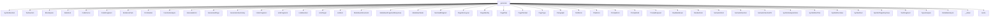

# Namespace `clore::generate`

## Summary

The `clore::generate` namespace provides the core infrastructure for transforming code analysis results into structured documentation pages. It orchestrates the entire generation pipeline, from constructing page plans and assembling evidence for LLM prompts to rendering final Markdown output. Key architectural roles include page planning (via `PagePlan` and `PagePlanSet`), evidence collection and prompt building (through `EvidencePack` and `build_prompt`), and final page assembly using `MarkdownDocument` and `GeneratedPage`. The namespace also centralizes cross‑reference resolution with `LinkResolver`, which maps entity names to page‑relative paths, and manages error handling through types like `PromptError`, `PlanError`, and `GenerateError`.

Notable declarations include the high‑level entry points `generate_pages` and `generate_pages_async`, which synchronously or asynchronously drive the full generation workflow. Lower‑level builders such as `build_page_root`, `render_page_markdown`, and `render_page_bundle` produce content for individual pages, while utilities like `make_link_target` and `format_evidence_text` support link generation and evidence formatting. The namespace’s design cleanly separates analysis storage (`SymbolAnalysisStore`), page layout (`PageDocLayout`), and rendering into self‑contained units, enabling modular extension and testing of the documentation generator.

## Diagram


```mermaid
graph TD
    NS["generate"]
    T0["SymbolSection"]
    NS --> T0
    T1["TextSection"]
    NS --> T1
    T2["BlockQuote"]
    NS --> T2
    T3["BulletList"]
    NS --> T3
    T4["CodeFence"]
    NS --> T4
    T5["CodeFragment"]
    NS --> T5
    T6["EvidencePack"]
    NS --> T6
    T7["Frontmatter"]
    NS --> T7
    T8["FunctionAnalysis"]
    NS --> T8
    T9["GenerateError"]
    NS --> T9
    T10["GeneratedPage"]
    NS --> T10
    T11["GenerationSummary"]
    NS --> T11
    T12["InlineFragment"]
    NS --> T12
    T13["LinkFragment"]
    NS --> T13
    T14["LinkResolver"]
    NS --> T14
    T15["LinkTarget"]
    NS --> T15
    T16["ListItem"]
    NS --> T16
    T17["MarkdownDocument"]
    NS --> T17
    T18["MarkdownFragmentResponse"]
    NS --> T18
    T19["MarkdownNode"]
    NS --> T19
    T20["MermaidDiagram"]
    NS --> T20
    T21["PageDocLayout"]
    NS --> T21
    T22["PageIdentity"]
    NS --> T22
    T23["PagePlan"]
    NS --> T23
    T24["PagePlanSet"]
    NS --> T24
    T25["PageType"]
    NS --> T25
    T26["Paragraph"]
    NS --> T26
    T27["PathError"]
    NS --> T27
    T28["PlanError"]
    NS --> T28
    T29["PromptError"]
    NS --> T29
    T30["PromptKind"]
    NS --> T30
    T31["PromptRequest"]
    NS --> T31
    T32["RawMarkdown"]
    NS --> T32
    T33["RenderError"]
    NS --> T33
    T34["SemanticKind"]
    NS --> T34
    T35["SemanticSection"]
    NS --> T35
    T36["SemanticSectionPtr"]
    NS --> T36
    T37["SymbolAnalysisStore"]
    NS --> T37
    T38["SymbolDocPlan"]
    NS --> T38
    T39["SymbolDocView"]
    NS --> T39
    T40["SymbolFact"]
    NS --> T40
    T41["SymbolTargetKeyView"]
    NS --> T41
    T42["TextFragment"]
    NS --> T42
    T43["TypeAnalysis"]
    NS --> T43
    T44["VariableAnalysis"]
    NS --> T44
    NSC0["__detail"]
    NS --> NSC0
    NSC1["cache"]
    NS --> NSC1
```

## Subnamespaces

- [`clore::generate::cache`](cache/index.md)

## Types

### `clore::generate::BlockQuote`

Declaration: `src/generate/markdown.cppm:73`

Definition: `src/generate/markdown.cppm:73`

Implementation: [`Module generate:markdown`](../../../modules/generate/markdown.md)

Insufficient evidence to summarize; provide more EVIDENCE.

#### Key Members

- fragments

#### Usage Patterns

- Used by markdown generation code to structure block quotes
- May be populated with inline fragments representing styled text or inline elements

### `clore::generate::BulletList`

Declaration: `src/generate/markdown.cppm:60`

Definition: `src/generate/markdown.cppm:60`

Implementation: [`Module generate:markdown`](../../../modules/generate/markdown.md)

`clore::generate::BulletList` is a data type used in the markdown generation subsystem to represent an unordered (bulleted) list structure within a document. It typically appears as a node in a tree of `clore::generate::MarkdownNode` variants, allowing the renderer to emit a proper markdown bullet list when building the final output. `BulletList` is often composed of one or more `clore::generate::ListItem` instances, and it may be nested inside other block-level constructs such as `clore::generate::Section` or `clore::generate::Paragraph` contexts.

#### Invariants

- Items are stored in sequence as they appear in the vector
- The vector may be empty, representing an empty bullet list

#### Key Members

- `items`: `std::vector<ListItem>` containing the list entries

#### Usage Patterns

- Populated with `ListItem` objects and passed to rendering functions for markdown output
- Likely constructed by builders or parsers during document generation

### `clore::generate::CodeFence`

Declaration: `src/generate/markdown.cppm:64`

Definition: `src/generate/markdown.cppm:64`

Implementation: [`Module generate:markdown`](../../../modules/generate/markdown.md)

`clore::generate::CodeFence` represents a fenced code block within a generated Markdown document. It encapsulates the language identifier and the body of the code, serving as a structured fragment that can be composed into larger output structures such as `MarkdownDocument` or `GeneratedPage`. This type is typically used during the rendering phase to produce correctly formatted code fences, enabling syntax highlighting and clear separation of code from surrounding text.

#### Invariants

- Both `language` and `code` are arbitrary `std::string` objects; no content restrictions are enforced.
- The struct has no user-declared constructors, destructors, or assignment `operator`s, so it is an aggregate type.

#### Key Members

- `language`: the language identifier for the code fence (e.g., "cpp", "python").
- `code`: the actual source code content enclosed in the fence.

#### Usage Patterns

- Direct initialization and member assignment are used to set `language` and `code`.
- Other code accesses the members to read the stored values, likely for serialization into markdown text.

### `clore::generate::CodeFragment`

Declaration: `src/generate/markdown.cppm:40`

Definition: `src/generate/markdown.cppm:40`

Implementation: [`Module generate:markdown`](../../../modules/generate/markdown.md)

Insufficient evidence to summarize; provide more EVIDENCE.

#### Invariants

- No invariants beyond those of `std::string`.

#### Key Members

- `code`

#### Usage Patterns

- Used as a data carrier for code fragments.

### `clore::generate::EvidencePack`

Declaration: `src/generate/evidence.cppm:34`

Definition: `src/generate/evidence.cppm:34`

Implementation: [`Module generate:evidence`](../../../modules/generate/evidence.md)

Insufficient evidence to summarize; provide more EVIDENCE.

#### Invariants

- All vector fields may be empty
- Scalar string fields may be empty

#### Key Members

- `target_facts`
- `local_context`
- `subject_name`
- `subject_kind`

#### Usage Patterns

- Assembled by evidence collectors and consumed by generation logic
- Each field is independently populated

### `clore::generate::Frontmatter`

Declaration: `src/generate/markdown.cppm:29`

Definition: `src/generate/markdown.cppm:29`

Implementation: [`Module generate:markdown`](../../../modules/generate/markdown.md)

The `clore::generate::Frontmatter` struct represents the metadata block (frontmatter) that accompanies a generated Markdown document. It stores properties such as title, description, and other page‑level attributes that appear between `---` delimiters at the top of the output file. This struct is part of the document generation infrastructure and is typically populated during page planning, then consumed when rendering the final Markdown document.

#### Invariants

- No enforced invariants; all members are freely assignable strings.

#### Key Members

- `title`
- `description`
- `layout`
- `page_template`

#### Usage Patterns

- No usage patterns observed in the provided evidence.

### `clore::generate::FunctionAnalysis`

Declaration: `src/generate/model.cppm:97`

Definition: `src/generate/model.cppm:97`

Implementation: [`Module generate:model`](../../../modules/generate/model.md)

Insufficient evidence to summarize; provide more EVIDENCE.

#### Invariants

- Default value of `has_side_effects` is false
- All vector fields may be empty
- Strings contain plain markdown fragments

#### Key Members

- `overview_markdown`
- `details_markdown`
- `has_side_effects`
- `side_effects`
- `reads_from`
- `writes_to`
- `usage_patterns`

#### Usage Patterns

- Cached and reused across namespace, module, file, and symbol documentation pages
- Populated by code analysis passes
- Consumed by documentation generators

### `clore::generate::GenerateError`

Declaration: `src/generate/model.cppm:85`

Definition: `src/generate/model.cppm:85`

Implementation: [`Module generate:model`](../../../modules/generate/model.md)

Insufficient evidence to summarize; provide more EVIDENCE.

#### Invariants

- The `message` field is intended to be non-empty when the struct is used to represent an actual error.

#### Key Members

- `message`

#### Usage Patterns

- Returned or thrown from generation functions to indicate failure.
- Inspected by callers to obtain error details.

### `clore::generate::GeneratedPage`

Declaration: `src/generate/model.cppm:71`

Definition: `src/generate/model.cppm:71`

Implementation: [`Module generate:model`](../../../modules/generate/model.md)

The `clore::generate::GeneratedPage` struct represents the final output of a single documentation page after the generation process completes. It serves as a container that aggregates the structured content produced from semantic analysis and rendering, including text sections, symbol facts, semantic sections, and other page components. This type is typically used as the result type in page-generation workflows, where a `clore::generate::PagePlan` is transformed into a fully resolved page suitable for downstream formatting or writing.

Within the `clore::generate` namespace, `GeneratedPage` works alongside related types such as `PageIdentity`, `PagePlan`, and `SemanticSection` to form the core data model for the documentation generator. It encapsulates the final state of a page after all prompts, symbol lookups, and rendering steps have been applied, making it a key output type for consumers that need to emit final documentation files.

#### Invariants

- All fields are default-initialized to empty strings.

#### Key Members

- `title`
- `relative_path`
- `content`

#### Usage Patterns

- Returned from page generation functions.
- Passed to serialization or file writing routines.

### `clore::generate::GenerationSummary`

Declaration: `src/generate/model.cppm:77`

Definition: `src/generate/model.cppm:77`

Implementation: [`Module generate:model`](../../../modules/generate/model.md)

Insufficient evidence to summarize; provide more EVIDENCE.

#### Invariants

- All fields are initialized to zero by default
- Counters are non-negative integers

#### Key Members

- `written_output_count`
- `symbol_analysis_cache_hits`
- `symbol_analysis_cache_misses`
- `page_prompt_cache_hits`
- `page_prompt_cache_misses`

#### Usage Patterns

- Collected and read by generation logic to report performance statistics
- Used as a return or output parameter from generation functions

### `clore::generate::InlineFragment`

Declaration: `src/generate/markdown.cppm:50`

Implementation: [`Module generate:markdown`](../../../modules/generate/markdown.md)

Insufficient evidence to summarize; provide more EVIDENCE.

#### Invariants

- Only one alternative is active at a time

#### Key Members

- `std::variant`
- `TextFragment`
- `CodeFragment`
- `LinkFragment`

#### Usage Patterns

- Used to store and process inline elements in Markdown generation

### `clore::generate::LinkFragment`

Declaration: `src/generate/markdown.cppm:44`

Definition: `src/generate/markdown.cppm:44`

Implementation: [`Module generate:markdown`](../../../modules/generate/markdown.md)

Insufficient evidence to summarize; provide more EVIDENCE.

#### Invariants

- No explicit invariants are documented; the struct is a plain aggregate.
- `code_style` defaults to `false`.
- All members are public and can be directly accessed.

#### Key Members

- `label` - the display text of the link fragment
- `target` - the URL target of the link fragment
- `code_style` - whether the label should be rendered as inline code

#### Usage Patterns

- Not specified in evidence; the struct is only defined in the provided snippet.

### `clore::generate::LinkResolver`

Declaration: `src/generate/model.cppm:190`

Definition: `src/generate/model.cppm:190`

Implementation: [`Module generate:model`](../../../modules/generate/model.md)

`clore::generate::LinkResolver` is a struct that maps entity names—such as qualified type names, namespace names, module names, or file paths—to their corresponding page-relative paths within the output directory. Its primary purpose is to enable the generation of Markdown cross-reference links by providing the target path for any documented entity.

During the documentation generation process, `LinkResolver` is used to resolve the destination of links between generated pages. When a piece of content references an entity, the resolver looks up the stored mapping and produces the correct relative path, ensuring that hyperlinks in the final Markdown output point to the appropriate page for that entity.

#### Invariants

- All maps are fully populated before any resolve call.
- Keys in each map are unique.
- Returned pointers remain valid as long as the map is not modified.

#### Key Members

- `name_to_path`
- `namespace_to_path`
- `module_to_path`
- `page_id_to_title`
- `resolve`
- `resolve_namespace`
- `resolve_module`
- `resolve_page_title`

#### Usage Patterns

- Called during documentation generation to resolve cross-reference links.
- Used to convert entity names to output-relative paths.
- Supports separate lookups for names, namespaces, modules, and page titles.

#### Member Functions

##### `clore::generate::LinkResolver::resolve`

Declaration: `src/generate/model.cppm:196`

Definition: `src/generate/model.cppm:196`

Implementation: [`Module generate:model`](../../../modules/generate/model.md)

###### Declaration

```cpp
auto (const std::string &) const -> const std::string *;
```

##### `clore::generate::LinkResolver::resolve_module`

Declaration: `src/generate/model.cppm:206`

Definition: `src/generate/model.cppm:206`

Implementation: [`Module generate:model`](../../../modules/generate/model.md)

###### Declaration

```cpp
auto (const std::string &) const -> const std::string *;
```

##### `clore::generate::LinkResolver::resolve_namespace`

Declaration: `src/generate/model.cppm:201`

Definition: `src/generate/model.cppm:201`

Implementation: [`Module generate:model`](../../../modules/generate/model.md)

###### Declaration

```cpp
auto (const std::string &) const -> const std::string *;
```

##### `clore::generate::LinkResolver::resolve_page_title`

Declaration: `src/generate/model.cppm:211`

Definition: `src/generate/model.cppm:211`

Implementation: [`Module generate:model`](../../../modules/generate/model.md)

###### Declaration

```cpp
auto (const std::string &) const -> const std::string *;
```

### `clore::generate::LinkTarget`

Declaration: `src/generate/render/common.cppm:22`

Definition: `src/generate/render/common.cppm:22`

Implementation: [`Module generate:common`](../../../modules/generate/common.md)

The `clore::generate::LinkTarget` struct represents a destination for a hyperlink within generated documentation. It encapsulates the necessary information to resolve a cross-reference to a particular symbol, page, or section, such as the target’s identifier, location, or other addressing details. Instances of `LinkTarget` are typically produced by a `LinkResolver` and consumed by rendering components to create correct HTML or Markdown links, ensuring that all internal references in the documentation point to valid targets.

#### Invariants

- No invariants beyond the default value of `code_style` being `false`.

#### Key Members

- `label`
- `target`
- `code_style`

#### Usage Patterns

- Used as a data holder for constructing links in generated documentation or reports.

### `clore::generate::ListItem`

Declaration: `src/generate/markdown.cppm:56`

Definition: `src/generate/markdown.cppm:56`

Implementation: [`Module generate:markdown`](../../../modules/generate/markdown.md)

`clore::generate::ListItem` is a struct that models a single entry within a generated markdown list. It is typically used as a component of list containers such as `BulletList`, where each `ListItem` holds the content for that entry, which may consist of inline fragments, paragraphs, or nested structures. The type facilitates structured generation of list items in documentation output.

#### Key Members

- fragments

### `clore::generate::MarkdownDocument`

Declaration: `src/generate/markdown.cppm:105`

Definition: `src/generate/markdown.cppm:105`

Implementation: [`Module generate:markdown`](../../../modules/generate/markdown.md)

The `clore::generate::MarkdownDocument` struct is a container for a complete generated Markdown document. It assembles the output from individual sections such as `TextSection`, `SymbolSection`, and `SemanticSection`, as well as other structural nodes like `Paragraph`, `CodeFence`, and `BulletList`. This struct is typically produced by the documentation generation pipeline after all analysis and planning are completed.

At the generation step, a `MarkdownDocument` is constructed from a `PagePlan` or `PageDocLayout` and then rendered into final Markdown text. It represents the fully structured document that includes frontmatter, content sections, and any generated diagrams or code examples. The document is subsequently processed by downstream stages, such as file writing or inclusion in a larger documentation set.

#### Invariants

- `frontmatter` may be `std::nullopt`
- `children` may be empty

#### Key Members

- `frontmatter`
- `children`

#### Usage Patterns

- Used to represent the result of generating a Markdown document
- Can be constructed with or without frontmatter

### `clore::generate::MarkdownFragmentResponse`

Declaration: `src/generate/model.cppm:93`

Definition: `src/generate/model.cppm:93`

Implementation: [`Module generate:model`](../../../modules/generate/model.md)

The `clore::generate::MarkdownFragmentResponse` struct represents the result of a markdown fragment generation operation within the documentation generation pipeline. It encapsulates the output produced when a prompt or a generation request yields structured markdown content, as distinct from a full `MarkdownDocument` or a raw text response.

This type is employed in conjunction with `clore::generate::PromptRequest` and `clore::generate::RenderError` to model the outcomes of fragment-level generation steps. It serves as a building block in the larger process of assembling `clore::generate::GeneratedPage` objects, allowing generation stages to produce atomic markdown units that can be composed or processed further.

### `clore::generate::MarkdownNode`

Declaration: `src/generate/markdown.cppm:84`

Definition: `src/generate/markdown.cppm:84`

Implementation: [`Module generate:markdown`](../../../modules/generate/markdown.md)

`clore::generate::MarkdownNode` is a struct that represents a single node within a structured Markdown document hierarchy. It serves as a fundamental building block for the Markdown generation pipeline, encapsulating a portion of rendered content such as text, code, links, or other formatting elements. This node is typically composed into larger structures like `clore::generate::MarkdownDocument` and is processed by the generation machinery to produce final Markdown output.

#### Invariants

- The `value` variant always holds exactly one of the listed types.
- The node does not enforce any additional structural constraints beyond the variant's type safety.

#### Key Members

- `value` of type `std::variant<...>`

#### Usage Patterns

- Used as a building block in a Markdown document model.
- Likely traversed or visited to generate output Markdown text.
- Can be combined with `SemanticSectionPtr` for hierarchical document structure.

### `clore::generate::MermaidDiagram`

Declaration: `src/generate/markdown.cppm:69`

Definition: `src/generate/markdown.cppm:69`

Implementation: [`Module generate:markdown`](../../../modules/generate/markdown.md)

Insufficient evidence to summarize; provide more EVIDENCE.

#### Invariants

- The `code` string contains the Mermaid diagram source.

#### Key Members

- `code` (`std::string`) – the Mermaid diagram source code.

#### Usage Patterns

- Other code creates instances of `MermaidDiagram` and assigns to the `code` member, or uses it to pass diagram data between components.

### `clore::generate::PageDocLayout`

Declaration: `src/generate/render/symbol.cppm:37`

Definition: `src/generate/render/symbol.cppm:37`

Implementation: [`Module generate:symbol`](../../../modules/generate/symbol.md)

The struct `clore::generate::PageDocLayout` represents the structural layout of a generated documentation page within the code generation pipeline. It organizes the various content sections—such as symbol documentation, semantic sections, and text blocks—that make up the final page. This type is used during the rendering phase to assemble the page from planned components, working alongside related types like `PagePlan`, `SymbolSection`, and `SemanticSection`. It plays a key role in determining how generated documentation is decomposed and then composed into a coherent output, such as a Markdown document.

#### Invariants

- No explicit invariants are documented in the evidence.

#### Key Members

- `type_docs`
- `variable_docs`
- `function_docs`
- `index_paths`

#### Usage Patterns

- Populated during documentation generation and used by rendering functions to produce the final page content.

### `clore::generate::PageIdentity`

Declaration: `src/generate/model.cppm:223`

Definition: `src/generate/model.cppm:223`

Implementation: [`Module generate:model`](../../../modules/generate/model.md)

The struct `clore::generate::PageIdentity` represents the unique identity of a page within the documentation generation system. It is used to distinguish one generated page from another, serving as a key or handle in various generation and planning structures such as `clore::generate::PagePlanSet`, `clore::generate::GeneratedPage`, and `clore::generate::PageDocLayout`. The exact fields are not specified here, but its role is to encapsulate the distinguishing characteristics of a page—likely including something like a symbolic reference, a page type (`clore::generate::PageType`), or a path—so that renderers and planners can associate different pieces of information (plans, errors, facts) with the correct output. In essence, `PageIdentity` is the fundamental identifier that binds together all stages of the generation pipeline for a single document page.

#### Invariants

- Fields are default-initialized.
- No explicit invariants documented.

#### Key Members

- `page_type`
- `normalized_owner_key`
- `qualified_name`
- `source_relative_path`

#### Usage Patterns

- Not provided in evidence.

### `clore::generate::PagePlan`

Declaration: `src/generate/model.cppm:55`

Definition: `src/generate/model.cppm:55`

Implementation: [`Module generate:model`](../../../modules/generate/model.md)

The `clore::generate::PagePlan` struct represents a blueprint for generating a single documentation page. It captures the page's identity, the set of semantic sections to render, and any associated symbol facts or other structural information needed to produce the final output. This type is central to the generation pipeline, acting as the intermediate plan from which a `clore::generate::GeneratedPage` is ultimately produced.

Typically, a `PagePlan` is created by the planner component and then processed by a renderer, which uses the plan's content to construct the page layout, apply formatting, and resolve cross-references. It works in concert with types such as `clore::generate::PagePlanSet` (a collection of plans) and `clore::generate::PageDocLayout` (which governs the arrangement of sections) to drive the generation workflow.

#### Invariants

- Fields are initialized to default values (empty strings, File type, empty vectors).
- No internal invariants are enforced; valid values depend on the caller.

#### Key Members

- `page_id`
- `page_type`
- `title`
- `relative_path`
- `owner_keys`
- `depends_on_pages`
- `linked_pages`
- `prompt_requests`

#### Usage Patterns

- Constructed and populated by code that determines page generation requirements.
- Passed to a generator function that processes the plan to produce final page output.

### `clore::generate::PagePlanSet`

Declaration: `src/generate/model.cppm:66`

Definition: `src/generate/model.cppm:66`

Implementation: [`Module generate:model`](../../../modules/generate/model.md)

Insufficient evidence to summarize; provide more EVIDENCE.

#### Invariants

- Both `plans` and `generation_order` are default-constructed as empty
- No further invariants are specified

#### Key Members

- `plans`: a vector of `PagePlan` objects
- `generation_order`: a vector of strings indicating generation order

#### Usage Patterns

- Used to represent a set of page generation plans with an associated ordering
- Likely consumed by code generation logic that processes pages in the specified order

### `clore::generate::PageType`

Declaration: `src/generate/model.cppm:25`

Definition: `src/generate/model.cppm:25`

Implementation: [`Module generate:model`](../../../modules/generate/model.md)

Insufficient evidence to summarize; provide more EVIDENCE.

#### Member Variables

##### `clore::generate::PageType::File`

Declaration: `src/generate/model.cppm:29`

Implementation: [`Module generate:model`](../../../modules/generate/model.md)

###### Declaration

```cpp
File
```

##### `clore::generate::PageType::Index`

Declaration: `src/generate/model.cppm:26`

Implementation: [`Module generate:model`](../../../modules/generate/model.md)

###### Declaration

```cpp
Index
```

##### `clore::generate::PageType::Module`

Declaration: `src/generate/model.cppm:27`

Implementation: [`Module generate:model`](../../../modules/generate/model.md)

###### Declaration

```cpp
Module
```

##### `clore::generate::PageType::Namespace`

Declaration: `src/generate/model.cppm:28`

Implementation: [`Module generate:model`](../../../modules/generate/model.md)

###### Declaration

```cpp
Namespace
```

### `clore::generate::Paragraph`

Declaration: `src/generate/markdown.cppm:52`

Definition: `src/generate/markdown.cppm:52`

Implementation: [`Module generate:markdown`](../../../modules/generate/markdown.md)

The struct `clore::generate::Paragraph` models a paragraph within generated markdown documentation. It is a building block used to represent a semantically distinct block of prose or inline content, typically composed of text, code fragments, links, or other inline elements. This type appears alongside other markdown nodes such as `ListItem`, `BlockQuote`, and `CodeFence`, and is likely aggregated within a `MarkdownDocument` or `MarkdownNode` to form the final textual output during the document generation process.

### `clore::generate::PathError`

Declaration: `src/generate/model.cppm:219`

Definition: `src/generate/model.cppm:219`

Implementation: [`Module generate:model`](../../../modules/generate/model.md)

Insufficient evidence to summarize; provide more EVIDENCE.

#### Key Members

- message

#### Usage Patterns

- Returned or thrown by path generation functions to indicate failure
- Inspected by callers to retrieve the error description

### `clore::generate::PlanError`

Declaration: `src/generate/planner.cppm:28`

Definition: `src/generate/planner.cppm:28`

Implementation: [`Module generate:planner`](../../../modules/generate/planner.md)

Insufficient evidence to summarize; provide more EVIDENCE.

#### Invariants

- `message` may be empty or contain arbitrary error text.
- No other state is stored.

#### Key Members

- `message` field - stores the error description.

#### Usage Patterns

- Returned or thrown as an error type in generation planner functions.
- Likely used in conjunction with other error handling mechanisms.

### `clore::generate::PromptError`

Declaration: `src/generate/evidence.cppm:102`

Definition: `src/generate/evidence.cppm:102`

Implementation: [`Module generate:evidence`](../../../modules/generate/evidence.md)

The struct `clore::generate::PromptError` represents an error that occurs during the construction or validation of a prompt used in document generation. It is one of several error types in the `clore::generate` namespace alongside `GenerateError`, `RenderError`, `PlanError`, and `PathError`. When a prompt request cannot be formed or contains invalid data, functions may return or throw a `PromptError` to signal the specific failure point, allowing callers to distinguish prompt‑related errors from other stages of the generation pipeline.

#### Invariants

- The `message` string is expected to be non-empty when representing an actual error.

#### Key Members

- `message`: a `std::string` that holds the error description.

#### Usage Patterns

- Used as the exception type or error result in prompt generation contexts, such as in `clore::generate::PromptGenerator` or related functions.

### `clore::generate::PromptKind`

Declaration: `src/generate/model.cppm:34`

Definition: `src/generate/model.cppm:34`

Implementation: [`Module generate:model`](../../../modules/generate/model.md)

The `clore::generate::PromptKind` enum classifies the variety of prompts used within the code generation pipeline. It encodes the semantic intent of a prompt, enabling the system to select appropriate formatting, processing, or validation logic based on the prompt's purpose. This type is typically employed as a member of prompt‑related structures (such as `PromptRequest`) to distinguish between different documentation‑generation tasks or query types.

#### Invariants

- All enumerator values are distinct within the enum.
- The enum is scoped (`enum class`), preventing implicit conversion to integers.
- The set of enumerators is fixed at compile time.

#### Key Members

- `clore::generate::PromptKind::NamespaceSummary`
- `clore::generate::PromptKind::ModuleSummary`
- `clore::generate::PromptKind::ModuleArchitecture`
- `clore::generate::PromptKind::IndexOverview`
- `clore::generate::PromptKind::FunctionAnalysis`
- `clore::generate::PromptKind::TypeAnalysis`
- `clore::generate::PromptKind::VariableAnalysis`
- `clore::generate::PromptKind::FunctionDeclarationSummary`
- `clore::generate::PromptKind::FunctionImplementationSummary`
- `clore::generate::PromptKind::TypeDeclarationSummary`
- `clore::generate::PromptKind::TypeImplementationSummary`

#### Usage Patterns

- Used to select the appropriate prompt template or generation function.
- Passed as an argument to query a prompt registry or dispatcher.
- May be stored to indicate the kind of analysis requested.

#### Member Variables

##### `clore::generate::PromptKind::FunctionAnalysis`

Declaration: `src/generate/model.cppm:39`

Implementation: [`Module generate:model`](../../../modules/generate/model.md)

###### Declaration

```cpp
FunctionAnalysis
```

##### `clore::generate::PromptKind::FunctionDeclarationSummary`

Declaration: `src/generate/model.cppm:42`

Implementation: [`Module generate:model`](../../../modules/generate/model.md)

###### Declaration

```cpp
FunctionDeclarationSummary
```

##### `clore::generate::PromptKind::FunctionImplementationSummary`

Declaration: `src/generate/model.cppm:43`

Implementation: [`Module generate:model`](../../../modules/generate/model.md)

###### Declaration

```cpp
FunctionImplementationSummary
```

##### `clore::generate::PromptKind::IndexOverview`

Declaration: `src/generate/model.cppm:38`

Implementation: [`Module generate:model`](../../../modules/generate/model.md)

###### Declaration

```cpp
IndexOverview
```

##### `clore::generate::PromptKind::ModuleArchitecture`

Declaration: `src/generate/model.cppm:37`

Implementation: [`Module generate:model`](../../../modules/generate/model.md)

###### Declaration

```cpp
ModuleArchitecture
```

##### `clore::generate::PromptKind::ModuleSummary`

Declaration: `src/generate/model.cppm:36`

Implementation: [`Module generate:model`](../../../modules/generate/model.md)

###### Declaration

```cpp
ModuleSummary
```

##### `clore::generate::PromptKind::NamespaceSummary`

Declaration: `src/generate/model.cppm:35`

Implementation: [`Module generate:model`](../../../modules/generate/model.md)

###### Declaration

```cpp
NamespaceSummary
```

##### `clore::generate::PromptKind::TypeAnalysis`

Declaration: `src/generate/model.cppm:40`

Implementation: [`Module generate:model`](../../../modules/generate/model.md)

###### Declaration

```cpp
TypeAnalysis
```

##### `clore::generate::PromptKind::TypeDeclarationSummary`

Declaration: `src/generate/model.cppm:44`

Implementation: [`Module generate:model`](../../../modules/generate/model.md)

###### Declaration

```cpp
TypeDeclarationSummary
```

##### `clore::generate::PromptKind::TypeImplementationSummary`

Declaration: `src/generate/model.cppm:45`

Implementation: [`Module generate:model`](../../../modules/generate/model.md)

###### Declaration

```cpp
TypeImplementationSummary
```

##### `clore::generate::PromptKind::VariableAnalysis`

Declaration: `src/generate/model.cppm:41`

Implementation: [`Module generate:model`](../../../modules/generate/model.md)

###### Declaration

```cpp
VariableAnalysis
```

### `clore::generate::PromptRequest`

Declaration: `src/generate/model.cppm:50`

Definition: `src/generate/model.cppm:50`

Implementation: [`Module generate:model`](../../../modules/generate/model.md)

Insufficient evidence to summarize; provide more EVIDENCE.

#### Invariants

- `kind` defaults to `PromptKind::NamespaceSummary`
- `target_key` defaults to an empty string
- No user-defined constructors or destructors; trivial type

#### Key Members

- `kind`
- `target_key`

#### Usage Patterns

- Instantiated and passed to prompt generation functions
- Used to specify prompt type and associated identifier

### `clore::generate::RawMarkdown`

Declaration: `src/generate/markdown.cppm:77`

Definition: `src/generate/markdown.cppm:77`

Implementation: [`Module generate:markdown`](../../../modules/generate/markdown.md)

Insufficient evidence to summarize; provide more EVIDENCE.

#### Invariants

- The `markdown` string can be any valid UTF-8 or ASCII content.

#### Key Members

- `markdown`: the raw markdown string

#### Usage Patterns

- Used as a wrapper to pass or store raw markdown content.

### `clore::generate::RenderError`

Declaration: `src/generate/model.cppm:89`

Definition: `src/generate/model.cppm:89`

Implementation: [`Module generate:model`](../../../modules/generate/model.md)

Insufficient evidence to summarize; provide more EVIDENCE.

#### Invariants

- The `message` field holds a descriptive error string

#### Key Members

- message

#### Usage Patterns

- Returned or thrown from generation functions to indicate errors
- Used as a lightweight error carrier

### `clore::generate::SemanticKind`

Declaration: `src/generate/markdown.cppm:18`

Definition: `src/generate/markdown.cppm:18`

Implementation: [`Module generate:markdown`](../../../modules/generate/markdown.md)

Insufficient evidence to summarize; provide more EVIDENCE.

#### Invariants

- Each enumerator value is unique and non-overlapping.
- The enum is used as a discriminator for documentation generation logic.

#### Key Members

- `Index`
- `Namespace`
- `Module`
- `Type`
- `Function`
- `Variable`
- `File`
- `Section`

#### Usage Patterns

- Used in tag dispatch or `switch` statements to select documentation generation behavior.
- Passed as a parameter to functions in the `clore::generate` module.

#### Member Variables

##### `clore::generate::SemanticKind::File`

Declaration: `src/generate/markdown.cppm:25`

Implementation: [`Module generate:markdown`](../../../modules/generate/markdown.md)

###### Declaration

```cpp
File
```

##### `clore::generate::SemanticKind::Function`

Declaration: `src/generate/markdown.cppm:23`

Implementation: [`Module generate:markdown`](../../../modules/generate/markdown.md)

###### Declaration

```cpp
Function
```

##### `clore::generate::SemanticKind::Index`

Declaration: `src/generate/markdown.cppm:19`

Implementation: [`Module generate:markdown`](../../../modules/generate/markdown.md)

###### Declaration

```cpp
Index
```

##### `clore::generate::SemanticKind::Module`

Declaration: `src/generate/markdown.cppm:21`

Implementation: [`Module generate:markdown`](../../../modules/generate/markdown.md)

###### Declaration

```cpp
Module
```

##### `clore::generate::SemanticKind::Namespace`

Declaration: `src/generate/markdown.cppm:20`

Implementation: [`Module generate:markdown`](../../../modules/generate/markdown.md)

###### Declaration

```cpp
Namespace
```

##### `clore::generate::SemanticKind::Section`

Declaration: `src/generate/markdown.cppm:26`

Implementation: [`Module generate:markdown`](../../../modules/generate/markdown.md)

###### Declaration

```cpp
Section
```

##### `clore::generate::SemanticKind::Type`

Declaration: `src/generate/markdown.cppm:22`

Implementation: [`Module generate:markdown`](../../../modules/generate/markdown.md)

###### Declaration

```cpp
Type
```

##### `clore::generate::SemanticKind::Variable`

Declaration: `src/generate/markdown.cppm:24`

Implementation: [`Module generate:markdown`](../../../modules/generate/markdown.md)

###### Declaration

```cpp
Variable
```

### `clore::generate::SemanticSection`

Declaration: `src/generate/markdown.cppm:81`

Definition: `src/generate/markdown.cppm:95`

Implementation: [`Module generate:markdown`](../../../modules/generate/markdown.md)

The struct `clore::generate::SemanticSection` represents a unit of generated content with an explicitly labeled semantic kind. It is used to assemble structured markdown output, where each section corresponds to a specific type of documentation element such as a paragraph, code fence, or list. The related type alias `SemanticSectionPtr` indicates that instances are typically managed through pointers, enabling polymorphic composition within page plans or document trees. This type is central to the generation system's representation of content sections that carry both structural and semantic information.

#### Invariants

- All fields have default values that serve as sensible starting points.
- The `children` vector is initially empty unless populated.

#### Key Members

- `kind` – discriminates the semantic role of the section.
- `heading` – the section's headline text.
- `children` – nested child nodes for hierarchical structure.
- `level` – the heading level (e.g., `<h2>` for 2).
- `omit_if_empty` – controls whether an empty section is dropped.
- `code_style_heading` – indicates if the heading should be rendered as code.

#### Usage Patterns

- Created as a simple value type and populated with field-assignment syntax.
- Passed to markdown generation routines that iterate `children` and use `kind`, `heading`, `level`, etc., to emit formatted output.
- Used in conjunction with `MarkdownNode` to build document trees.

### `clore::generate::SemanticSectionPtr`

Declaration: `src/generate/markdown.cppm:82`

Implementation: [`Module generate:markdown`](../../../modules/generate/markdown.md)

`clore::generate::SemanticSectionPtr` is a type alias representing a pointer (commonly `std::unique_ptr` or `std::shared_ptr`) to a `SemanticSection` object. It is used throughout the generation pipeline to manage ownership and lifecycle of semantic sections, which encapsulate structured documentation content for symbols or pages. The alias streamlines memory management and clearly conveys the intended usage when passing or storing these sections.

#### Invariants

- Exclusive ownership of a single `SemanticSection` object
- Can be null if uninitialized or moved from

#### Key Members

- Underlying `std::unique_ptr` interface (e.g., `get`, `reset`, `operator*`, `operator->`)

#### Usage Patterns

- Used to manage the lifetime of `SemanticSection` objects
- Passed by value to transfer ownership
- Stored in containers or as class members

### `clore::generate::SymbolAnalysisStore`

Declaration: `src/generate/model.cppm:141`

Definition: `src/generate/model.cppm:141`

Implementation: [`Module generate:model`](../../../modules/generate/model.md)

The `clore::generate::SymbolAnalysisStore` struct represents a container that holds aggregated analysis data for a single symbol within the documentation generation pipeline. It is used to collect and organise results from various analysis passes—such as `FunctionAnalysis`, `TypeAnalysis`, and `VariableAnalysis`—making them accessible for later stages like plan creation and page generation.

#### Invariants

- The three cache fields are distinct and likely initialized together.

#### Key Members

- `functions`
- `types`
- `variables`

#### Usage Patterns

- The struct is used to hold the analysis results for symbols, likely populated during analysis phase and queried during generation.

### `clore::generate::SymbolDocPlan`

Declaration: `src/generate/render/symbol.cppm:31`

Definition: `src/generate/render/symbol.cppm:31`

Implementation: [`Module generate:symbol`](../../../modules/generate/symbol.md)

Insufficient evidence to summarize; provide more EVIDENCE.

#### Invariants

- `symbol` may be nullptr for a container/grouper node
- `children` forms a tree with no cycles (expected but not enforced)
- `index_path` is unique among siblings in a well-formed plan

#### Key Members

- `symbol` — the symbol being documented
- `children` — child documentation plans
- `index_path` — deterministic path for indexing output

#### Usage Patterns

- Built by a planner that traverses the symbol hierarchy
- Traversed recursively by renderers to produce documentation pages
- Used as input to index generation via `index_path`

### `clore::generate::SymbolDocView`

Declaration: `src/generate/render/common.cppm:28`

Definition: `src/generate/render/common.cppm:28`

Implementation: [`Module generate:common`](../../../modules/generate/common.md)

The `clore::generate::SymbolDocView` enum defines the perspective or modality under which a symbol's documentation is generated or rendered. It is used within the planning and rendering pipeline—likely alongside types such as `clore::generate::PageType` and `clore::generate::SymbolDocPlan`—to select the appropriate content structure, level of detail, or context (for example, a brief declaration view versus a full documentation view). By encoding the intended view, the enum enables the generation logic to adjust output without altering the underlying symbol data.

#### Invariants

- The three enumerators are the only valid values
- Each value corresponds to a mutually exclusive view
- Underlying type is `std::uint8_t`

#### Key Members

- `Declaration`
- `Implementation`
- `Details`

#### Usage Patterns

- Used to select which portion of a symbol’s documentation to generate or display
- Likely passed as a parameter to rendering functions

#### Member Variables

##### `clore::generate::SymbolDocView::Declaration`

Declaration: `src/generate/render/common.cppm:29`

Implementation: [`Module generate:common`](../../../modules/generate/common.md)

###### Declaration

```cpp
Declaration
```

##### `clore::generate::SymbolDocView::Details`

Declaration: `src/generate/render/common.cppm:31`

Implementation: [`Module generate:common`](../../../modules/generate/common.md)

###### Declaration

```cpp
Details
```

##### `clore::generate::SymbolDocView::Implementation`

Declaration: `src/generate/render/common.cppm:30`

Implementation: [`Module generate:common`](../../../modules/generate/common.md)

###### Declaration

```cpp
Implementation
```

### `clore::generate::SymbolFact`

Declaration: `src/generate/evidence.cppm:21`

Definition: `src/generate/evidence.cppm:21`

Implementation: [`Module generate:evidence`](../../../modules/generate/evidence.md)

Insufficient evidence to summarize; provide more EVIDENCE.

#### Invariants

- Fields are expected to be populated with consistent data from extraction
- `is_template` defaults to `false` if not set
- `declaration_line` defaults to `0` if not provided

#### Key Members

- `id`
- `qualified_name`
- `signature`
- `kind_label`
- `access`
- `is_template`
- `template_params`
- `declaration_file`
- `declaration_line`
- `doc_comment`

#### Usage Patterns

- Instantiated by extraction phases to hold symbol data
- Consumed by generation phases to produce documentation output
- Stored or passed between components as a value type

### `clore::generate::SymbolTargetKeyView`

Declaration: `src/generate/model.cppm:152`

Definition: `src/generate/model.cppm:152`

Implementation: [`Module generate:model`](../../../modules/generate/model.md)

The `clore::generate::SymbolTargetKeyView` struct provides a lightweight, non-owning view into a key used to identify a `SymbolTarget` within the generation pipeline. It is designed to facilitate lookups or comparisons involving symbol targets without requiring ownership or copying of the underlying key data. This type is typically employed when inspecting or querying a collection of symbol targets, such as in `SymbolFact` or `SymbolAnalysisStore`, to efficiently reference a target's identity during documentation generation.

#### Invariants

- The referenced strings must outlive the view
- `qualified_name` and `signature` refer to valid, stable data

#### Key Members

- `qualified_name`
- `signature`

#### Usage Patterns

- Used as a key for symbol target lookup or storage
- Passed as a parameter to functions requiring symbol identity without copying

### `clore::generate::TextFragment`

Declaration: `src/generate/markdown.cppm:36`

Definition: `src/generate/markdown.cppm:36`

Implementation: [`Module generate:markdown`](../../../modules/generate/markdown.md)

Insufficient evidence to summarize; provide more EVIDENCE.

#### Key Members

- text

### `clore::generate::TypeAnalysis`

Declaration: `src/generate/model.cppm:107`

Definition: `src/generate/model.cppm:107`

Implementation: [`Module generate:model`](../../../modules/generate/model.md)

`clore::generate::TypeAnalysis` represents the collected analysis data for a type symbol within the code generation pipeline. It is one of several symbol-specific analysis structures used to capture metadata and semantic information necessary for producing documentation. The struct serves as a component of the broader `SymbolAnalysisStore` and is typically employed in conjunction with other analysis types such as `FunctionAnalysis` or `VariableAnalysis` to provide a complete picture of a symbol's documentation requirements.

#### Invariants

- Fields are populated consistently for a given type analysis
- No field is null or undefined after initialization

#### Key Members

- `overview_markdown`
- `details_markdown`
- `invariants`
- `key_members`
- `usage_patterns`

#### Usage Patterns

- Created once per type and reused across documentation pages
- Populated by analysis logic and consumed by documentation generators

### `clore::generate::VariableAnalysis`

Declaration: `src/generate/model.cppm:115`

Definition: `src/generate/model.cppm:115`

Implementation: [`Module generate:model`](../../../modules/generate/model.md)

`clore::generate::VariableAnalysis` is a structure that captures the semantic analysis results for a variable declaration within the documentation generation pipeline. It represents the properties and metadata discovered about a variable during the analysis phase, serving as input for later rendering steps.

The structure is typically populated by the analysis pass and consumed by page planning or fragment generation. It belongs to the same family of analysis types as `clore::generate::FunctionAnalysis` and `clore::generate::TypeAnalysis`, and may be stored within a `clore::generate::SymbolAnalysisStore` to correlate analysis data with its corresponding symbol.

#### Invariants

- `is_mutated` is initialized to false
- `mutation_sources` and `usage_patterns` are initially empty

#### Key Members

- overview and detail documentation strings
- mutation flag and source list
- usage pattern list

#### Usage Patterns

- Used to store results of variable analysis, likely populated by analysis functions
- Consumed by documentation generation to produce variable pages

## Functions

### `clore::generate::add_prompt_output`

Declaration: `src/generate/render/common.cppm:153`

Definition: `src/generate/render/common.cppm:153`

Implementation: [`Module generate:common`](../../../modules/generate/common.md)

The function `clore::generate::add_prompt_output` appends the content of an optional prompt output string into a mutable output context represented by an `int&`. It expects a pointer to a `const std::string` that may be null; when the pointer is non‑null, the string’s contents are incorporated into the output. This allows callers to conditionally insert prompt output without needing to manage empty or missing results explicitly. The output context is updated in‑place, and the function returns nothing.

#### Usage Patterns

- Used to add a prompt's output to a list of markdown nodes, typically when building a page's markdown content.

### `clore::generate::add_symbol_analysis_detail_sections`

Declaration: `src/generate/render/common.cppm:181`

Definition: `src/generate/render/common.cppm:196`

Implementation: [`Module generate:common`](../../../modules/generate/common.md)

The function `clore::generate::add_symbol_analysis_detail_sections` accepts a mutable reference `int &` (representing the output container or page builder), three `const int &` arguments that provide symbol analysis data and identification, and a `std::uint8_t` value likely denoting a nesting level or section depth. Its responsibility is to populate or extend the given builder with detailed analysis sections for a specific symbol, drawing from the supplied analysis stores. The caller must supply valid analysis references and a correct level indicator; the function guarantees that the builder is updated with the relevant detail content, but does not handle validation of the analysis data or its context.

#### Usage Patterns

- Called from higher-level page generation functions to populate detail sections.
- Typically invoked per symbol during rendering of analysis pages.

### `clore::generate::add_symbol_analysis_sections`

Declaration: `src/generate/render/common.cppm:187`

Definition: `src/generate/render/common.cppm:187`

Implementation: [`Module generate:common`](../../../modules/generate/common.md)

The function `clore::generate::add_symbol_analysis_sections` appends analysis‑related sections to a mutable page or document structure, using the provided symbol analysis data. The caller passes a non‑const `int &` representing the target context to be extended, followed by three `const int &` parameters that supply the necessary symbol, analysis store, and layout information, and a `std::uint8_t` that typically indicates a nesting level or section depth. The function returns `void` and operates by side‑effect, ensuring that the target accumulates the appropriate symbol analysis sections without altering the input data.

#### Usage Patterns

- called during symbol page generation to include analysis sections
- used when building documentation for a symbol's analysis

### `clore::generate::add_symbol_doc_links`

Declaration: `src/generate/render/symbol.cppm:61`

Definition: `src/generate/render/symbol.cppm:828`

Implementation: [`Module generate:symbol`](../../../modules/generate/symbol.md)

The function `clore::generate::add_symbol_doc_links` inserts hyperlinks to the documentation pages of a symbol into an in‑progress output document structure. It accepts a mutable reference to the document root (represented as `int &`), a `std::string_view` identifying the symbol, a `const PageDocLayout &` describing the page’s link‑resolution context, and two additional integer parameters that likely control indexing or filtering. The function modifies the output structure in place by appending inline link fragments or paragraphs that point to the target symbol’s declaration page, using the provided layout to compute relative paths and resolve page titles. Callers must ensure the document structure is in a state that can accept new link nodes, and that the symbol exists in the page plan so that a valid `LinkTarget` can be constructed.

#### Usage Patterns

- Used during page generation to add cross-reference links for symbol documentation.

### `clore::generate::analysis_details_markdown`

Declaration: `src/generate/model.cppm:173`

Definition: `src/generate/model.cppm:389`

Implementation: [`Module generate:model`](../../../modules/generate/model.md)

`clore::generate::analysis_details_markdown` accepts a `const SymbolAnalysisStore &` and a `const int &` (representing a symbol identifier) and returns `const std::string *`. The function produces a detailed analysis description in Markdown form for the specified symbol. On success, it returns a pointer to a string containing that Markdown; if no details are available for the given identifier, it returns `nullptr`. The caller receives a non‑owning pointer—the string’s lifetime is managed internally and must not be mutated or freed by the caller.

#### Usage Patterns

- Used during documentation generation to retrieve the detailed analysis section for a symbol.

### `clore::generate::analysis_markdown`

Declaration: `src/generate/model.cppm:358`

Definition: `src/generate/model.cppm:358`

Implementation: [`Module generate:model`](../../../modules/generate/model.md)

This function generates a markdown string that describes the analysis results for a specific symbol. The caller supplies a `SymbolAnalysisStore` containing the analysis data, an integer identifier (typically a symbol or page ID), and a `FieldAccessor` callable used to retrieve relevant fields from the store. The return value is a pointer to a `const std::string` containing the rendered markdown, or `nullptr` if no analysis is available for the given identifier.

#### Usage Patterns

- Retrieving overview markdown for a symbol analysis
- Retrieving details markdown for a symbol analysis
- Extracting specific analysis fields via an accessor

### `clore::generate::analysis_overview_markdown`

Declaration: `src/generate/model.cppm:170`

Definition: `src/generate/model.cppm:382`

Implementation: [`Module generate:model`](../../../modules/generate/model.md)

The function `clore::generate::analysis_overview_markdown` accepts a `const SymbolAnalysisStore &` and a `const int &` (interpreted as a symbol or page identifier) and returns a `const std::string *`. It is the caller’s responsibility to provide a valid analysis store and a meaningful integer key; the function returns a pointer to a string containing a Markdown overview of the analysis for that symbol or page. If no overview is available, the function returns `nullptr`. The resulting string is intended for direct embedding into a generated documentation page and represents the high-level summary portion of the symbol’s analysis.

#### Usage Patterns

- Used to obtain overview markdown for a symbol analysis
- Likely called by documentation rendering functions such as `render_page_markdown` or `build_symbol_analysis_prompt`

### `clore::generate::analysis_prompt_kind_for_symbol`

Declaration: `src/generate/analysis.cppm:43`

Definition: `src/generate/analysis.cppm:302`

Implementation: [`Module generate:analysis`](../../../modules/generate/analysis.md)

The function `clore::generate::analysis_prompt_kind_for_symbol` returns the *prompt kind* — an integer discriminant — associated with a given symbol, identified by its internal symbol handle (`const int &`). Callers use this value to select the appropriate analysis prompt template or processing branch for that symbol during documentation generation. The contract assumes a valid symbol handle is provided; the function maps the symbol’s semantic role (e.g., function, variable, type) to a corresponding `PromptKind` that guides how the symbol’s analysis is structured in the generated output.

#### Usage Patterns

- used to map a symbol to its required analysis prompt kind

### `clore::generate::append_symbol_doc_pages`

Declaration: `src/generate/render/symbol.cppm:78`

Definition: `src/generate/render/symbol.cppm:975`

Implementation: [`Module generate:symbol`](../../../modules/generate/symbol.md)

The function `clore::generate::append_symbol_doc_pages` populates a document builder (the first `int &` parameter) with generated documentation pages for symbols. It accepts an additional series of opaque identifier handles (each `const int &`) that represent the symbol, analysis stores, and page‑building context, together with a `const PageDocLayout &` that specifies the structural layout of the resulting pages. The caller is responsible for supplying these handles from valid, previously initialized state and a fully constructed `PageDocLayout`. The return value of `int` indicates the outcome—typically a count of appended pages or a non‑zero error code on failure. This function is a high‑level entry point in the page generation pipeline, intended to be called after all prerequisite analysis and layout construction are complete.

#### Usage Patterns

- Recursively processes a tree of `SymbolDocPlan` to generate symbol documentation pages.

### `clore::generate::append_type_member_sections`

Declaration: `src/generate/render/symbol.cppm:67`

Definition: `src/generate/render/symbol.cppm:842`

Implementation: [`Module generate:symbol`](../../../modules/generate/symbol.md)

`clore::generate::append_type_member_sections` appends documentation sections for the members of a type to an output document. It is called during page generation to populate member groups such as member functions, member variables, nested types, and related entities. The caller provides a mutable output object (passed as the first `int &` parameter), several identifiers that identify the type and its analysis context (each `const int &`), a `PageDocLayout` that controls the structure and ordering of sections, a `std::string_view` specifying the member group or symbol name, and a `std::uint8_t` that defines the heading level at which sections are inserted. The function modifies the output object in place, adding markdown content for each member. It does not return a value; the caller is responsible for ensuring that the output object is in a valid state before and after the call, and that the provided identifiers and layout are consistent with the current page being built.

#### Usage Patterns

- Called during type documentation page generation to populate member sections.

### `clore::generate::apply_symbol_analysis_response`

Declaration: `src/generate/analysis.cppm:55`

Definition: `src/generate/analysis.cppm:364`

Implementation: [`Module generate:analysis`](../../../modules/generate/analysis.md)

The function `clore::generate::apply_symbol_analysis_response` is responsible for incorporating the result of a symbol analysis into a mutable target object. It accepts a mutable reference to the target (likely a page or document builder), followed by const references to the relevant symbol and analysis contexts, an integer code or kind identifier, and a `std::string_view` containing the analysis response text. The return value is an integer indicating the outcome—typically the number of changes applied or a status code.

Callers invoke this function after obtaining a symbol analysis response (for example, from an LLM or a cached result) to update the generation state in place. The contract ensures that the target is modified to reflect the analysis, while the analysis inputs remain unchanged. The response string is interpreted according to the kind parameter; invalid or empty responses may be safely ignored.

#### Usage Patterns

- Called after receiving a prompt response to store analysis results
- Used in a loop over multiple prompt responses

### `clore::generate::build_dry_run_page_summary_texts`

Declaration: `src/generate/dryrun.cppm:27`

Definition: `src/generate/dryrun.cppm:332`

Implementation: [`Module generate:dryrun`](../../../modules/generate/dryrun.md)

`clore::generate::build_dry_run_page_summary_texts` constructs the summary text content for each page during a dry-run generation workflow. The caller supplies two parameters of type `const int &` that identify the page plan set and symbol analysis store to use as context for the summary generation. The function returns an `int` indicating success or the number of summaries produced. This allows callers to preview the generated page summaries without writing them to output, fulfilling the dry-run contract of producing all derived content in memory for inspection.

#### Usage Patterns

- Dry run generation to build a map of summary texts per prompt request
- Aggregates cached or fallback summaries for later use

### `clore::generate::build_evidence_for_function_analysis`

Declaration: `src/generate/evidence.cppm:52`

Definition: `src/generate/evidence_builder.cppm:61`

Implementation: [`Module generate:evidence_builder`](../../../modules/generate/index.md) | [`Module generate:evidence`](../../../modules/generate/evidence.md)

The function `clore::generate::build_evidence_for_function_analysis` assembles the evidence pack required to perform a detailed analysis of a single function symbol. Callers provide a reference to the analysis store, a reference to the function's identity, and a `std::string_view` representing the function's qualified name. The function returns an `int` that acts as a handle or status code for the resulting evidence structure, which downstream prompt-building routines then consume to generate the analysis text. This function is the primary entry point for collecting all contextual information—such as the function's declaration, implementation, usage patterns, and cross-references—needed to produce a coherent analysis prompt for that function.

#### Usage Patterns

- called by other evidence-building functions
- used in analysis generation workflows

### `clore::generate::build_evidence_for_function_declaration_summary`

Declaration: `src/generate/evidence.cppm:79`

Definition: `src/generate/evidence_builder.cppm:246`

Implementation: [`Module generate:evidence_builder`](../../../modules/generate/index.md) | [`Module generate:evidence`](../../../modules/generate/evidence.md)

The function `clore::generate::build_evidence_for_function_declaration_summary` constructs the evidence data needed to generate a natural‑language summary for a function declaration. Callers supply three opaque identifier handles (the first three `const int &` parameters) that collectively specify the target function, the owning page structure, and the overall document context, along with a `std::string_view` that provides an additional resolver key or name qualifier. The function returns an `int` representing a success status or a handle to the assembled evidence object; it is the caller’s responsibility to ensure that the provided identifiers correspond to a valid function declaration within the current page plan and analysis store. This function is part of the evidence‑building pipeline and is typically invoked before the generated evidence is passed to a prompt‑construction or rendering step.

### `clore::generate::build_evidence_for_function_implementation_summary`

Declaration: `src/generate/evidence.cppm:84`

Definition: `src/generate/evidence_builder.cppm:276`

Implementation: [`Module generate:evidence_builder`](../../../modules/generate/index.md) | [`Module generate:evidence`](../../../modules/generate/evidence.md)

`clore::generate::build_evidence_for_function_implementation_summary` assembles the evidence data required to produce an implementation summary for a given function symbol. It accepts two opaque integer identifiers (likely representing the function's symbol index and a related page or analysis context) and a `std::string_view` that qualifies the enclosing scope (e.g., a module or namespace name). The caller is responsible for providing valid identifiers that correspond to entries in the symbol store and for ensuring the string view outlives the call. The function returns an `int` status code, where zero typically indicates success and a non-zero value signals an error or failure to build the evidence.

#### Usage Patterns

- used to generate evidence for function implementation summaries during documentation generation

### `clore::generate::build_evidence_for_index_overview`

Declaration: `src/generate/evidence.cppm:76`

Definition: `src/generate/evidence_builder.cppm:212`

Implementation: [`Module generate:evidence_builder`](../../../modules/generate/index.md) | [`Module generate:evidence`](../../../modules/generate/evidence.md)

`clore::generate::build_evidence_for_index_overview` constructs the evidence data required to generate the top‑level index overview page. It accepts two integer arguments—typically identifiers that refer to the document layout and the page plan—and returns an integer that represents either a success status or a handle to the assembled evidence pack. The caller relies on this function to supply the necessary information (such as symbol summaries, links, and structural metadata) that drives the rendering of the index page, ensuring the overview is populated with accurate content derived from the entire documentation set.

### `clore::generate::build_evidence_for_module_architecture`

Declaration: `src/generate/evidence.cppm:70`

Definition: `src/generate/evidence_builder.cppm:181`

Implementation: [`Module generate:evidence_builder`](../../../modules/generate/index.md) | [`Module generate:evidence`](../../../modules/generate/evidence.md)

The function `clore::generate::build_evidence_for_module_architecture` constructs an evidence pack that captures the architectural structure of a module. It accepts a set of resource identifiers (as `const int &` parameters) and a module name as a `std::string_view`; the caller must supply valid identifiers for the relevant symbol, analysis, and page contexts, along with the fully qualified module name. The function returns an `int` representing either a status code or a handle to the built evidence, which is then consumed by downstream page‑generation or prompt‑building logic.

#### Usage Patterns

- Called during page generation for module documentation
- Invoked as part of the evidence-building pipeline for module-level pages

### `clore::generate::build_evidence_for_module_summary`

Declaration: `src/generate/evidence.cppm:64`

Definition: `src/generate/evidence_builder.cppm:150`

Implementation: [`Module generate:evidence_builder`](../../../modules/generate/index.md) | [`Module generate:evidence`](../../../modules/generate/evidence.md)

The function `clore::generate::build_evidence_for_module_summary` constructs the evidence needed for generating a module summary page. It accepts a set of parameters that collectively identify the module, its context (such as the analysis store and page plan), and provides a module name via `std::string_view`. The caller is expected to supply valid handles for the module and related structures; the return value is an integer handle to the resulting evidence object, which can later be used by downstream generation functions (e.g., `build_prompt` or `format_evidence_text`). This function does not produce the final page content but prepares the structured input for subsequent prompt construction.

#### Usage Patterns

- called when constructing module summary evidence for a code generation page
- used in the page building pipeline for module documentation

### `clore::generate::build_evidence_for_namespace_summary`

Declaration: `src/generate/evidence.cppm:47`

Definition: `src/generate/evidence_builder.cppm:29`

Implementation: [`Module generate:evidence_builder`](../../../modules/generate/index.md) | [`Module generate:evidence`](../../../modules/generate/evidence.md)

The function `clore::generate::build_evidence_for_namespace_summary` constructs the evidence data required to generate a namespace summary page. It accepts opaque handles or identifiers representing the page plan, symbol analysis store, and related infrastructure, along with a `std::string_view` specifying the target namespace. The call returns an integer status or handle that the caller can use to reference the assembled evidence for subsequent rendering steps.

Callers invoke this function during page generation to produce the structured information needed by a namespace summary page, such as symbol listings, documentation links, and analysis prompts. The resulting evidence is typically consumed by other generation functions like `clore::generate::render_page_bundle` or `clore::generate::build_prompt`.

### `clore::generate::build_evidence_for_type_analysis`

Declaration: `src/generate/evidence.cppm:56`

Definition: `src/generate/evidence_builder.cppm:90`

Implementation: [`Module generate:evidence_builder`](../../../modules/generate/index.md) | [`Module generate:evidence`](../../../modules/generate/evidence.md)

The function `clore::generate::build_evidence_for_type_analysis` constructs the evidence pack used to drive type‑analysis prompts within the documentation generation pipeline. It accepts two integer references (likely representing the relevant symbol store and the target type symbol) and a `std::string_view` (perhaps the fully qualified name or a cache key), and returns an integer status—typically indicating success or the number of evidence items produced.

Callers invoke this function when a page or prompt requires type‑level analysis evidence (e.g., for a class, struct, or enum). The evidence it builds feeds into later stages such as prompt assembly or markdown rendering. The function assumes that the provided symbol references are valid and that the evidence context (e.g., pre‑loaded analysis results) is available; it does not perform validation on its own.

#### Usage Patterns

- Called during page generation for type symbols
- Used to prepare evidence for type analysis prompts

### `clore::generate::build_evidence_for_type_declaration_summary`

Declaration: `src/generate/evidence.cppm:89`

Definition: `src/generate/evidence_builder.cppm:310`

Implementation: [`Module generate:evidence_builder`](../../../modules/generate/index.md) | [`Module generate:evidence`](../../../modules/generate/evidence.md)

The function `clore::generate::build_evidence_for_type_declaration_summary` is responsible for assembling the evidence data necessary to generate a summary page for a type declaration. It accepts internal identifiers (represented as `const int &` parameters) that reference the relevant page plan, symbol analysis store, and page root, along with a `std::string_view` that specifies the fully qualified name of the type. Its return value of type `int` is an opaque handle that refers to the constructed evidence pack, which callers can later use when building prompts or rendering the page. This function is part of the evidence-building pipeline and is invoked during page generation for type declarations, ensuring that the summary section receives all required contextual and analytical information.

#### Usage Patterns

- invoked during type declaration summary generation

### `clore::generate::build_evidence_for_type_implementation_summary`

Declaration: `src/generate/evidence.cppm:94`

Definition: `src/generate/evidence_builder.cppm:342`

Implementation: [`Module generate:evidence_builder`](../../../modules/generate/index.md) | [`Module generate:evidence`](../../../modules/generate/evidence.md)

Constructs the evidence required for generating an implementation summary page for a type. The caller supplies two opaque integer references representing the type analysis and the broader generation context, along with a `std::string_view` identifying the relevant scope or namespace. The function returns an `int` value that signals the outcome — typically zero for success or a positive count of evidence items prepared. It governs the extraction and formatting of all supporting information that an implementation summary page needs, such as member details, inheritance, and usage context, following the same contract as the analogous `build_evidence_for_function_implementation_summary` for function types.

#### Usage Patterns

- called during generation of type implementation summary pages
- invoked by higher-level page building functions like `clore::generate::append_type_member_sections`

### `clore::generate::build_evidence_for_variable_analysis`

Declaration: `src/generate/evidence.cppm:60`

Definition: `src/generate/evidence_builder.cppm:121`

Implementation: [`Module generate:evidence_builder`](../../../modules/generate/index.md) | [`Module generate:evidence`](../../../modules/generate/evidence.md)

The function `clore::generate::build_evidence_for_variable_analysis` assembles the evidence pack required for analyzing a variable symbol. It accepts a reference to a symbol analysis store, a reference to a page plan set (or similar synthesis context), and a `std::string_view` identifying the variable. The caller is responsible for ensuring that the provided identifiers are valid and that the variable exists in the analysis store. The return value indicates success or failure of the evidence construction process.

#### Usage Patterns

- Called during documentation generation for variable symbols
- Part of the evidence building pipeline for analysis

### `clore::generate::build_file_page_root`

Declaration: `src/generate/render/page.cppm:364`

Definition: `src/generate/render/page.cppm:364`

Implementation: [`Module generate:page`](../../../modules/generate/page.md)

The function `clore::generate::build_file_page_root` constructs the root element of a page dedicated to a source file within the generated documentation. It accepts six opaque integer handles—likely representing the file, its enclosing project or module, and the generation context—and returns an integer indicating success or failure (or a handle to the built root). Callers invoke it during page generation to establish the top-level structure for a file's documentation page, which will later be populated with analysis, symbols, and rendered content.

#### Usage Patterns

- Called during documentation page generation to create the top-level semantic structure for a file page.

### `clore::generate::build_index_page_root`

Declaration: `src/generate/render/page.cppm:466`

Definition: `src/generate/render/page.cppm:466`

Implementation: [`Module generate:page`](../../../modules/generate/page.md)

The function `clore::generate::build_index_page_root` is responsible for constructing the foundational content of a generated index page. Callers provide five contextual identifiers (passed as `const int &` references) that specify the project state, page set, or other generation artifacts required to produce the page root. The function returns an `int` that indicates success or an error condition; callers should check this value after invocation. As a page-building operation, it participates in the same pipeline as other `build_*_page_root` functions and is expected to be called during the page generation workflow rather than in isolation.

#### Usage Patterns

- Called during index page generation to produce the root section
- Used as part of the page construction pipeline

### `clore::generate::build_link_resolver`

Declaration: `src/generate/model.cppm:217`

Definition: `src/generate/model.cppm:487`

Implementation: [`Module generate:model`](../../../modules/generate/model.md)

Constructs a `LinkResolver` from a `PagePlanSet`. The returned resolver translates symbolic identifiers—such as module names, namespace names, and page titles—into their corresponding page targets during documentation generation. Callers should provide the complete set of page plans; the resolver is built to reflect all planned pages and their relationships. The resulting `LinkResolver` can then be queried via its `resolve`, `resolve_module`, `resolve_namespace`, and `resolve_page_title` methods to obtain link targets without requiring repeated access to the original plan set.

#### Usage Patterns

- Called to build a `LinkResolver` for later use in resolving page titles, namespaces, and modules
- Used by other functions that need to map symbol keys or page `IDs` to relative paths

### `clore::generate::build_list_section`

Declaration: `src/generate/render/common.cppm:144`

Definition: `src/generate/render/common.cppm:144`

Implementation: [`Module generate:common`](../../../modules/generate/common.md)

The function `clore::generate::build_list_section` accepts a `std::string` representing the section title, a `std::uint8_t` for the nesting depth (likely indentation level), and an `int` parameter whose exact role is determined by the caller. It returns an `int` that typically serves as a handle or a status code indicating success or failure. Callers can use this function to add a structured list section to a page being generated; the contract does not guarantee the internal format of the returned integer aside from its use in subsequent page‑building operations.

#### Usage Patterns

- Used to generate a section with a bullet list for documentation pages (e.g., symbol lists, option lists).

### `clore::generate::build_llms_page`

Declaration: `src/generate/dryrun.cppm:35`

Definition: `src/generate/dryrun.cppm:349`

Implementation: [`Module generate:dryrun`](../../../modules/generate/dryrun.md)

The function `clore::generate::build_llms_page` constructs the documentation page that serves as the overview or index for all large language models (`LLMs`) within the project. It accepts a reference to the generation context and a reference to the page plan, along with a `std::string_view` providing the name or identifier of the LLM data source. The returned `int` value indicates whether the page was built successfully, with a non‑zero value typically representing an error condition.

#### Usage Patterns

- Used in page generation pipeline to produce the LLMS index file

### `clore::generate::build_module_page_root`

Declaration: `src/generate/render/page.cppm:274`

Definition: `src/generate/render/page.cppm:274`

Implementation: [`Module generate:page`](../../../modules/generate/page.md)

The function `clore::generate::build_module_page_root` generates the root documentation page content for a module. It accepts contextual references (such as cached page plan data, symbol analysis stores, and module identity) through a set of integer handles. Callers must ensure that the passed identifiers correspond to a valid module and that all required precomputed data (e.g., the page plan set) is available. The return value is an integral status code where zero typically indicates success and non-zero indicates an error.

#### Usage Patterns

- Called during module page generation to build the top-level section.
- Used within `build_page_root` dispatch for module page types.

### `clore::generate::build_namespace_page_root`

Declaration: `src/generate/render/page.cppm:184`

Definition: `src/generate/render/page.cppm:184`

Implementation: [`Module generate:page`](../../../modules/generate/page.md)

The function `clore::generate::build_namespace_page_root` is responsible for constructing the root-level structure of a generated namespace documentation page. It accepts seven `const int &` parameters that together identify the page plan, the namespace, and the surrounding generation context, and it returns an `int` indicating success or failure. Callers invoke this function during page generation when the target page type corresponds to a namespace overview, ensuring that the initial page skeleton (including links, metadata, and layout placeholders) is correctly assembled before sub-sections are appended. The precise contract of each parameter is defined by the page planning infrastructure; all provided identifiers must be valid within the active generation run.

#### Usage Patterns

- called during namespace page generation
- used to build the top-level section of a namespace page

### `clore::generate::build_page_doc_layout`

Declaration: `src/generate/render/symbol.cppm:55`

Definition: `src/generate/render/symbol.cppm:915`

Implementation: [`Module generate:symbol`](../../../modules/generate/symbol.md)

The function `clore::generate::build_page_doc_layout` accepts two integer identifiers (presumably a page identity and an associated symbol or context) and returns a `PageDocLayout`.  
Its caller‑facing responsibility is to produce a complete, structured layout that dictates how documentation sections are arranged for the given page. The contract requires valid integer inputs; the returned `PageDocLayout` is then used by downstream rendering or assembly functions to organise and emit the final document content.

#### Usage Patterns

- Called during page generation to organize symbol documentation groups based on a page plan and project model.

### `clore::generate::build_page_plan_set`

Declaration: `src/generate/planner.cppm:32`

Definition: `src/generate/planner.cppm:386`

Implementation: [`Module generate:planner`](../../../modules/generate/planner.md)

The function `clore::generate::build_page_plan_set` constructs a comprehensive plan set for page generation. It accepts two opaque integer references that represent the document analysis context and the overall generation configuration. The function returns an integer handle to the resulting `PagePlanSet`, which can be used to build link resolvers and individual page roots. Callers must invoke this function before any page-specific builders to establish the complete set of page plans.

#### Usage Patterns

- Called during page generation to produce a sorted set of plans
- Used by higher-level generation functions like `generate_pages`

### `clore::generate::build_page_root`

Declaration: `src/generate/render/page.cppm:565`

Definition: `src/generate/render/page.cppm:565`

Implementation: [`Module generate:page`](../../../modules/generate/page.md)

`clore::generate::build_page_root` is the entry point for constructing the root content of a generated documentation page. It accepts seven `const int &` parameters that collectively identify the page's symbol, analysis data, page plan, document layout, and supporting context. The function assembles the top‑level sections, metadata, and structural elements required for a complete page, and returns an integer status (typically zero for success). Callers should provide the correct identifiers from earlier stages of the generation pipeline and expect the function to produce all common page infrastructure before any child or supplementary sections are added.

#### Usage Patterns

- called during page generation to create the root semantic section
- used as a central point for type-based page root construction

### `clore::generate::build_prompt`

Declaration: `src/generate/evidence.cppm:106`

Definition: `src/generate/evidence.cppm:663`

Implementation: [`Module generate:evidence`](../../../modules/generate/evidence.md)

The function `clore::generate::build_prompt` accepts an integer representing a prompt kind and a const `EvidencePack` containing gathered evidence. It constructs a complete prompt string suitable for an LLM request by formatting the evidence and instantiating the corresponding prompt template. On success, it returns an `std::string`; on failure, it returns a `PromptError` indicating the reason for failure. This is the primary entry point for assembling a prompt from a given kind and evidence.

#### Usage Patterns

- called by prompt-building infrastructure
- used to generate documentation prompts from evidence packs

### `clore::generate::build_prompt_section`

Declaration: `src/generate/render/common.cppm:135`

Definition: `src/generate/render/common.cppm:135`

Implementation: [`Module generate:common`](../../../modules/generate/common.md)

`clore::generate::build_prompt_section` accepts a title string, a heading depth (as a `std::uint8_t`), and an optional content string (as a `const std::string *`, which may be null). It constructs a markdown section suitable for inclusion in a generated prompt. The caller is responsible for providing a valid depth (typically 1–6) and a non‑null title. The optional content, if provided, will be inserted as the body of the section.

The function returns an integer representing either a section handle or a status code that indicates success or failure. This return value is used by other prompt‑building infrastructure within the generation pipeline.

#### Usage Patterns

- Called to construct a section with optional raw markdown content within a prompt page

### `clore::generate::build_related_page_targets`

Declaration: `src/generate/render/common.cppm:515`

Definition: `src/generate/render/common.cppm:515`

Implementation: [`Module generate:common`](../../../modules/generate/common.md)

`clore::generate::build_related_page_targets` constructs a representation of target references for documentation pages that are related to a given context. The caller supplies two integer identifiers and a string view, and receives an integer result that can be used to refer to the built targets in subsequent page-generation steps. This function is part of the cross-reference resolution pipeline: it is called when a page needs to emit links or references to other pages that are semantically related, such as sibling symbols, associated modules, or supporting analysis pages. The caller is responsible for passing the correct identifiers—typically referencing entity or page-plan keys—and a string view that provides the necessary context (for example, a qualified name or a page path). The returned integer acts as a handle to the constructed target list, which can later be consumed by functions like `clore::generate::push_link_paragraph` or `clore::generate::build_symbol_link_list`. The contract requires that the provided integers and string view are valid within the current generation session; otherwise the behavior is undefined.

#### Usage Patterns

- Used during page generation to collect cross-reference link targets for related pages
- Called when building navigation or 'related pages' sections in documentation output

### `clore::generate::build_request_estimate_page`

Declaration: `src/generate/dryrun.cppm:31`

Definition: `src/generate/dryrun.cppm:246`

Implementation: [`Module generate:dryrun`](../../../modules/generate/dryrun.md)

The function `clore::generate::build_request_estimate_page` constructs a page that provides an estimate or summary of request-related data. It accepts three `const int &` parameters, which likely represent identifiers or quantities needed to compute the estimate. The function returns an `int`, typically indicating success or a handle to the generated page content. Callers should provide the appropriate integer arguments that drive the estimation logic; the exact semantics of each parameter are defined by the call site in the page-building pipeline.

#### Usage Patterns

- Used during dry run generation to produce the estimate page
- Called by the dry run orchestrator to generate the request estimate page

### `clore::generate::build_string_list`

Declaration: `src/generate/render/common.cppm:159`

Definition: `src/generate/render/common.cppm:159`

Implementation: [`Module generate:common`](../../../modules/generate/common.md)

Constructs a list of strings from the given integer argument, returning an integer handle that identifies the resulting list. The caller provides the integer input and receives an opaque handle; no additional ownership or lifetime management is implied by the return value.

#### Usage Patterns

- building bullet lists from string collections
- generating markdown lists from code-annotated text

### `clore::generate::build_symbol_analysis_prompt`

Declaration: `src/generate/analysis.cppm:62`

Definition: `src/generate/analysis.cppm:445`

Implementation: [`Module generate:analysis`](../../../modules/generate/analysis.md)

`clore::generate::build_symbol_analysis_prompt` constructs the prompt used to request analysis of a symbol. It accepts context information about the symbol—such as its declaration, usage, and documentation—and returns a status indicating whether the prompt was successfully built.

This function is the primary entry point for generating prompts in the symbol analysis pipeline; callers use it to obtain the prompt that will be sent to an analysis service. It is typically invoked during page generation to drive documentation or insight extraction for a given symbol.

#### Usage Patterns

- used to generate prompts for symbol analysis pipelines
- called when building prompts for function, type, or variable analysis
- typically invoked by higher-level prompt construction routines like `apply_symbol_analysis_response` or `build_dry_run_page_summary_texts`

### `clore::generate::build_symbol_link_list`

Declaration: `src/generate/render/common.cppm:371`

Definition: `src/generate/render/common.cppm:371`

Implementation: [`Module generate:common`](../../../modules/generate/common.md)

The function `clore::generate::build_symbol_link_list` constructs a structured list of hyperlink targets for related symbols, typically used to populate cross‑reference sections or navigation menus in generated documentation. Callers provide an identifier for the symbol collection context, a string path or name to filter or organize the links, an additional configuration handle, and a boolean flag controlling inclusion or grouping behavior.

The return value is an opaque handle to the resulting link list, which can be passed subsequently to rendering functions. The caller is responsible for ensuring that the first and third arguments refer to valid internal states and that the string view remains valid for the duration of the call.

#### Usage Patterns

- Called during page rendering to build a list of links to related symbols
- Used in documentation generation pipelines to produce navigation or reference lists

### `clore::generate::build_symbol_source_locations`

Declaration: `src/generate/render/common.cppm:423`

Definition: `src/generate/render/common.cppm:423`

Implementation: [`Module generate:common`](../../../modules/generate/common.md)

The function `clore::generate::build_symbol_source_locations` constructs source location information for a given symbol. It accepts three integer parameters that identify the symbol (such as symbol, file, and line indices) and a `std::string_view` that may provide additional context, such as a file path or label. The function returns an `int` that indicates the outcome of the operation, typically a success code or a handle to the built location data. Callers supply the necessary identifiers and text, and the function produces a structured representation of the symbol’s source locations for use in documentation generation.

#### Usage Patterns

- used in page rendering to generate source location link sections

### `clore::generate::code_spanned_fragments`

Declaration: `src/generate/markdown.cppm:135`

Definition: `src/generate/markdown.cppm:704`

Implementation: [`Module generate:markdown`](../../../modules/generate/markdown.md)

Declaration: [Declaration](functions/code-spanned-fragments.md)

The function `clore::generate::code_spanned_fragments` accepts a `std::string_view` and returns a `std::vector<InlineFragment>`. It is responsible for extracting inline code spans from Markdown source text, providing the caller with a decomposed list of fragments that correspond to code spans. This allows downstream processing to treat each code span as a distinct inline element.

#### Usage Patterns

- Used by `clore::generate::(anonymous namespace)::append_rendered_text` to break up text into fragments for rendering

### `clore::generate::code_spanned_markdown`

Declaration: `src/generate/markdown.cppm:137`

Definition: `src/generate/markdown.cppm:710`

Implementation: [`Module generate:markdown`](../../../modules/generate/markdown.md)

The function `clore::generate::code_spanned_markdown` accepts a `std::string_view` input and returns a `std::string` containing the input formatted as inline code spans in Markdown. It is responsible for escaping or wrapping the input so that it renders as monospaced, inline code when included in a Markdown document. The caller provides a plain text string (often a code fragment, symbol name, or literal), and receives a valid Markdown fragment suitable for embedding in a larger document. The contract guarantees that the output is safe against Markdown misinterpretation of special characters (e.g., backticks) and is ready for direct insertion into a document’s paragraph or inline context.

### `clore::generate::collect_implementation_symbols`

Declaration: `src/generate/render/common.cppm:325`

Definition: `src/generate/render/common.cppm:325`

Implementation: [`Module generate:common`](../../../modules/generate/common.md)

`clore::generate::collect_implementation_symbols` is a template function that collects a set of implementation symbols (such as those belonging to a namespace or module) that match a caller-supplied predicate. The caller provides two integer-like opaque references (likely handles to analysis data and page planning structures) and a `Predicate` callable that selects which symbols to include. The function returns an integer representing the count of collected symbols or a handle to the resulting collection. The predicate is forwarded with its exact type and is expected to return a truthy value for each symbol that should be retained; the function’s contract is to traverse the available implementation symbols and return those for which the predicate evaluates to `true`.

#### Usage Patterns

- called to gather symbols for implementation documentation pages
- used with a plan and model to filter symbols that are page-level and match a predicate

### `clore::generate::collect_namespace_symbols`

Declaration: `src/generate/render/common.cppm:300`

Definition: `src/generate/render/common.cppm:300`

Implementation: [`Module generate:common`](../../../modules/generate/common.md)

The template function `clore::generate::collect_namespace_symbols` accepts a `const int &` (presumably a context or store identifier), a `std::string_view` naming the target namespace, and a `Predicate &&` callable that determines which symbols to include. It returns an `int` representing a handle or collection of references to the matching symbols from that namespace. The caller supplies the predicate to filter symbols (e.g., by kind or name pattern); the function enumerates declarations belonging to the namespace and yields a result that can be passed to subsequent generation steps. The `Predicate` type is deduced from the argument, and the contract requires it to be invocable with the element type used internally to represent a symbol.

#### Usage Patterns

- called from namespace page builders to gather symbols
- used with a predicate to filter symbols for analysis or rendering
- provides sorted list of namespace symbols for further processing

### `clore::generate::compute_page_path`

Declaration: `src/generate/model.cppm:230`

Definition: `src/generate/model.cppm:592`

Implementation: [`Module generate:model`](../../../modules/generate/model.md)

The function `clore::generate::compute_page_path` maps a `PageIdentity` to its corresponding output file path. It returns a `std::expected<std::string, PathError>`: on success, the result holds the computed path as a string; on failure, it contains a `PathError` describing why the path could not be derived. Callers must check the returned `std::expected` for an error before using the path. This function is a core part of the page generation pipeline, translating abstract page identities into concrete filesystem locations.

#### Usage Patterns

- called during page generation to determine output file path for each page

### `clore::generate::doc_label`

Declaration: `src/generate/render/common.cppm:290`

Definition: `src/generate/render/common.cppm:290`

Implementation: [`Module generate:common`](../../../modules/generate/common.md)

`clore::generate::doc_label` accepts a `SymbolDocView` and returns a `std::string_view` representing a short, human-readable label for the documented symbol. This label is intended for use in page titles, navigation elements, or within generated documentation content where a compact textual identifier is required. The caller must ensure that the provided `SymbolDocView` is valid and corresponds to a symbol whose label is meaningful in the current documentation context; the returned view remains valid only as long as the underlying data persists.

#### Usage Patterns

- used to get display labels for documentation sections
- used in rendering markdown for symbol documentation
- provides human-readable string for each `SymbolDocView` value

### `clore::generate::escape_mermaid_label`

Declaration: `src/generate/render/diagram.cppm:27`

Definition: `src/generate/render/diagram.cppm:123`

Implementation: [`Module generate:diagram`](../../../modules/generate/diagram.md)

Declaration: [Declaration](functions/escape-mermaid-label.md)

The function `clore::generate::escape_mermaid_label` takes a `std::string_view` and returns a `std::string` that is sanitized for safe inclusion as a label in Mermaid diagram markup. Callers should supply any raw text that may contain characters special to Mermaid label syntax—such as quotes, parentheses, newlines, or angle brackets—and the returned value can be directly embedded in Mermaid diagram code without breaking the syntax or causing rendering errors. This is required when generating diagram text from user‑facing or symbol‑derived strings, as in the `render_namespace_diagram_code` function, to ensure the output remains valid Mermaid.

#### Usage Patterns

- Sanitizing labels for Mermaid diagrams
- Called by `clore::generate::render_namespace_diagram_code`

### `clore::generate::find_declaration_page`

Declaration: `src/generate/render/common.cppm:484`

Definition: `src/generate/render/common.cppm:484`

Implementation: [`Module generate:common`](../../../modules/generate/common.md)

Returns the `LinkTarget` for the declaration page corresponding to the given symbol and context identifiers. If no such page exists, returns `std::nullopt`. The first two parameters are opaque identifiers that together specify the symbol and its enclosing scope; the third parameter is a string view that typically conveys the qualified name or a path hint for the declaration.

Callers use this function to resolve cross-references to declaration pages during page generation. It is part of the link resolution layer and does not perform any rendering or mutation of state. The return type `std::optional<LinkTarget>` indicates a potentially missing target; callers must handle the absence gracefully, for example by skipping the link.

#### Usage Patterns

- Called during page rendering to add a link to the declaration page of a symbol

### `clore::generate::find_doc_index_path`

Declaration: `src/generate/render/symbol.cppm:58`

Definition: `src/generate/render/symbol.cppm:822`

Implementation: [`Module generate:symbol`](../../../modules/generate/symbol.md)

Given a `PageDocLayout` and an identifier (such as a symbol name) expressed as a `std::string_view`, `clore::generate::find_doc_index_path` returns a pointer to a `const std::string` representing the documentation index path for that identifier, or `nullptr` if no such path exists in the layout. The caller must ensure the provided `PageDocLayout` is valid and that the `string_view` outlives the call. The returned pointer (if non-null) remains valid as long as the associated layout or internal storage is alive; the function does not transfer ownership.

#### Usage Patterns

- Used to resolve documentation index paths during page generation

### `clore::generate::find_function_analysis`

Declaration: `src/generate/model.cppm:161`

Definition: `src/generate/model.cppm:339`

Implementation: [`Module generate:model`](../../../modules/generate/model.md)

The function `clore::generate::find_function_analysis` accepts a reference to a `SymbolAnalysisStore` and a `std::string_view` identifying the function. It returns a pointer to a `const FunctionAnalysis` representing the stored analysis for that function. The caller must ensure the provided string view refers to a valid function identifier within the store; if no matching analysis is found, the function returns `nullptr`. This allows callers to conditionally retrieve function-specific analysis details without creating a new analysis entry.

#### Usage Patterns

- Lookup function analysis by symbol key for further processing
- Check existence of analysis before accessing detailed fields

### `clore::generate::find_implementation_pages`

Declaration: `src/generate/render/common.cppm:444`

Definition: `src/generate/render/common.cppm:444`

Implementation: [`Module generate:common`](../../../modules/generate/common.md)

The function `clore::generate::find_implementation_pages` locates documentation pages that correspond to the implementation of a given code element. It accepts a set of integer identifiers (likely representing a module, file, and symbol), a `std::string_view` key or name, and a `const std::string&` type or context qualifier. The return value is an integer that indicates the result of the lookup, such as a page handle or status code. This function is designed to be used during page generation to connect implementation entities with their generated documentation pages, enabling cross-referencing and navigation.

#### Usage Patterns

- called during document generation to collect implementation page links for symbols

### `clore::generate::find_module_for_file`

Declaration: `src/generate/render/common.cppm:507`

Definition: `src/generate/render/common.cppm:507`

Implementation: [`Module generate:common`](../../../modules/generate/common.md)

The function `clore::generate::find_module_for_file` determines the C++ module to which a given file belongs within a specific generation or analysis context. It accepts an opaque identifier (likely representing a compilation unit, project, or analysis store) as the first parameter and a file path as the second. If the file is part of a module, the function returns that module’s name as a `std::string` wrapped in `std::optional`; otherwise, it returns `std::nullopt`. Callers should ensure the provided context handle and file path are valid, and that the context has been fully populated before invoking this function.

#### Usage Patterns

- Used to determine the module for a file during page generation or link resolution

### `clore::generate::find_type_analysis`

Declaration: `src/generate/model.cppm:164`

Definition: `src/generate/model.cppm:345`

Implementation: [`Module generate:model`](../../../modules/generate/model.md)

The function `clore::generate::find_type_analysis` looks up a type analysis record within the provided `SymbolAnalysisStore` using the given identifier as a string view. It returns a pointer to a constant `TypeAnalysis` object, or `nullptr` if no analysis exists for that type name. The caller must ensure that the store remains valid for the lifetime of the returned pointer, and should not modify the pointed-to analysis. This function is the primary way to retrieve precomputed semantic analysis for a type symbol during documentation generation.

#### Usage Patterns

- Retrieve type analysis for a symbol during documentation generation
- Used by higher-level analysis formatting functions like `analysis_details_markdown` or `analysis_overview_markdown`

### `clore::generate::find_variable_analysis`

Declaration: `src/generate/model.cppm:167`

Definition: `src/generate/model.cppm:351`

Implementation: [`Module generate:model`](../../../modules/generate/model.md)

The `clore::generate::find_variable_analysis` function performs a lookup in a `SymbolAnalysisStore` for the analysis data associated with a given variable. It accepts a reference to the analysis store and a `std::string_view` identifying the variable (typically its qualified name). The function returns a pointer to a `const VariableAnalysis` if the variable is found in the store; otherwise, it returns `nullptr`.  

Callers must ensure that the provided store is properly initialized and that the variable identifier matches the keying convention used by the store (e.g., full qualified name). The function does not modify the store and is intended for read‑only retrieval of pre‑computed analysis results. It is a lightweight lookup with no side effects, suitable for use during documentation generation where variable analysis details are needed.

#### Usage Patterns

- retrieve a `VariableAnalysis`* for a given symbol target key
- check if variable analysis exists

### `clore::generate::for_each_symbol_doc_group`

Declaration: `src/generate/render/symbol.cppm:45`

Definition: `src/generate/render/symbol.cppm:45`

Implementation: [`Module generate:symbol`](../../../modules/generate/symbol.md)

The function `clore::generate::for_each_symbol_doc_group` is a template that accepts a `const PageDocLayout &` and a `Visitor &&` callable. It iterates over each symbol documentation group present in the layout and invokes the visitor with that group. The caller is responsible for providing a callable whose signature matches the expected group type; the function itself returns `void` and does not retain or modify the layout.

The template parameter `Visitor` is deduced from the argument and must be invocable with a single argument representing a symbol documentation group (the exact type is not exposed in this interface). This enables generic traversal of grouped symbol documentation data, decoupling the iteration logic from the specific processing applied by the visitor.

#### Usage Patterns

- Iterate over symbol doc groups in a layout to generate documentation sections
- Apply a transformation or collection function to each doc group

### `clore::generate::format_evidence_text`

Declaration: `src/generate/evidence.cppm:98`

Definition: `src/generate/evidence.cppm:592`

Implementation: [`Module generate:evidence`](../../../modules/generate/evidence.md)

Declaration: [Declaration](functions/format-evidence-text.md)

The function `clore::generate::format_evidence_text` accepts a reference to an `EvidencePack` and returns a `std::string` containing a formatted representation of the evidence data. It is designed to produce the complete evidence text that is later embedded into a prompt template by `clore::generate::build_prompt`. The caller provides the entire `EvidencePack`, and the function returns a single string that consolidates all evidence entries into a readable, prompt‑ready format. There is no limit on the output length; for size‑constrained use cases, the related `clore::generate::format_evidence_text_bounded` provides a bounded alternative.

#### Usage Patterns

- called by `clore::generate::build_prompt` to obtain the full evidence text for a prompt

### `clore::generate::format_evidence_text_bounded`

Declaration: `src/generate/evidence.cppm:100`

Definition: `src/generate/evidence.cppm:596`

Implementation: [`Module generate:evidence`](../../../modules/generate/evidence.md)

Declaration: [Declaration](functions/format-evidence-text-bounded.md)

The function `clore::generate::format_evidence_text_bounded` accepts a `const EvidencePack &` and a `std::size_t` limiting the total length of the output. It generates a single `std::string` that contains a human‑readable representation of all evidence items in the pack, formatted in a consistent textual style suitable for inclusion in prompt contexts or logs.

The caller must provide the bound as the second argument; the resulting string is guaranteed not to exceed that length. If formatting all evidence would exceed the bound, the function truncates the output at the boundary, preserving as much content as possible from earlier evidence items. The function is primarily invoked by `clore::generate::format_evidence_text`, which supplies an effectively unbounded size to obtain the complete text.

#### Usage Patterns

- called by `clore::generate::format_evidence_text`
- used to generate bounded evidence strings for prompts

### `clore::generate::generate_dry_run`

Declaration: `src/generate/generate.cppm:42`

Definition: `src/generate/scheduler.cppm:1957`

Implementation: [`Module generate:scheduler`](../../../modules/generate/scheduler.md) | [`Module generate`](../../../modules/generate/index.md)

The function `clore::generate::generate_dry_run` lets the caller simulate the full documentation generation pipeline without writing any output files. It accepts two `const int &` parameters that represent internal generation state (for example, a page plan set and a configuration handle) and returns an `int` status code: `0` if the dry run finds no problems, and a non‑zero value if a real generation would encounter an error. This makes it possible to validate the generation plan, estimate the number of pages, and detect issues (e.g., through side‑channel diagnostic output) before committing to an actual run of `generate_pages`.

The contract of `generate_dry_run` is purely inspect‑and‑report: it performs the same validation and traversal steps as a normal generation, but discards all generated page bundles, evidence packs, and prompt outputs. Callers use it to answer questions like “will the input set produce a consistent page structure?” and “how much work would the real generation involve?” without side effects. Success or failure is indicated solely by the return value.

### `clore::generate::generate_pages`

Declaration: `src/generate/generate.cppm:45`

Definition: `src/generate/scheduler.cppm:2016`

Implementation: [`Module generate:scheduler`](../../../modules/generate/scheduler.md) | [`Module generate`](../../../modules/generate/index.md)

The function `clore::generate::generate_pages` is the primary synchronous entry point for the page generation pipeline. It accepts two `const int &` handles (typically representing an analysis store and a page plan set), a `std::string_view` output directory path, a `std::uint32_t` concurrency limit, and a `std::string_view` project root path. It returns an `int` status code indicating success or failure. Callers must have fully prepared the analysis state and page plan before invocation; this function orchestrates the entire generation workflow, including rendering all pages and writing them to the output directory.

#### Usage Patterns

- main driver for documentation generation
- called from the top-level CLI or build system entry point

### `clore::generate::generate_pages_async`

Declaration: `src/generate/generate.cppm:54`

Definition: `src/generate/scheduler.cppm:1994`

Implementation: [`Module generate:scheduler`](../../../modules/generate/scheduler.md) | [`Module generate`](../../../modules/generate/index.md)

`clore::generate::generate_pages_async` initiates asynchronous page generation. It accepts the same configuration parameters as `clore::generate::generate_pages` — including page indices, output path, concurrency limit, and a content directory — plus a reference to a `kota::event_loop`. The function returns a task object that performs the actual generation work. Callers must schedule the returned task on the provided event loop and run it; no work begins until the task is executed. The contract requires the event loop to remain alive for the duration of the task’s execution.

#### Usage Patterns

- Callers schedule the returned task on the event loop and run it.
- Used for asynchronous documentation generation.

### `clore::generate::is_base_symbol_analysis_prompt`

Declaration: `src/generate/analysis.cppm:47`

Definition: `src/generate/analysis.cppm:341`

Implementation: [`Module generate:analysis`](../../../modules/generate/analysis.md)

The function `clore::generate::is_base_symbol_analysis_prompt` takes a prompt kind (represented as an `int`) and returns a `bool` indicating whether that kind corresponds to a base symbol analysis prompt. It is used to categorize a `PromptKind` as a base analysis prompt specifically for a symbol, as opposed to other prompt types such as declaration summaries or page summaries. This predicate helps callers branch behavior based on the prompt’s intended analysis scope.

#### Usage Patterns

- Used to test whether a prompt kind should trigger a base symbol analysis
- Possibly called before dispatching to analysis-specific builders

### `clore::generate::is_declaration_summary_prompt`

Declaration: `src/generate/analysis.cppm:49`

Definition: `src/generate/analysis.cppm:346`

Implementation: [`Module generate:analysis`](../../../modules/generate/analysis.md)

The function `clore::generate::is_declaration_summary_prompt` is a predicate that tests whether a given prompt kind (represented as an `int`) corresponds to a declaration summary prompt. It returns `true` if the provided kind is such a prompt, and `false` otherwise. Callers use this function to classify `PromptKind` values and to dispatch generation logic that is specific to declaration summary prompts, such as assembling evidence or building the prompt structure for a declaration page.

#### Usage Patterns

- used to branch prompt generation logic based on prompt kind
- called in contexts that need to treat declaration summary prompts distinctly

### `clore::generate::is_function_kind`

Declaration: `src/generate/model.cppm:178`

Definition: `src/generate/model.cppm:409`

Implementation: [`Module generate:model`](../../../modules/generate/model.md)

Determines whether the supplied integer corresponds to a function kind in the symbol‑kind classification used by the generation pipeline. The caller passes an opaque kind value (typically drawn from a symbol‑analysis or page‑plan set), and the function returns `true` if that value represents a function, `false` otherwise.

This predicate is commonly employed during page construction and evidence building to dispatch behaviour based on the nature of the target symbol. It forms part of a family of similar queries—such as `clore::generate::is_type_kind` and `clore::generate::is_variable_kind`—that collectively map an integral kind identifier to a specific symbolic category.

#### Usage Patterns

- filtering symbol kinds
- guard conditions when deciding how to process a symbol

### `clore::generate::is_page_level_symbol`

Declaration: `src/generate/model.cppm:182`

Definition: `src/generate/model.cppm:421`

Implementation: [`Module generate:model`](../../../modules/generate/model.md)

Determines whether a given symbol qualifies as a page-level symbol. This is a predicate used during page plan construction to decide which symbols should produce their own documentation page. It accepts two opaque symbol identifiers and returns `true` if the symbol represented by the first identifier should be promoted to a page-level entity, and `false` otherwise.

The function is typically invoked during page layout and index generation to filter symbols that require independent rendering. Its contract is to provide the caller with a boolean decision that guides downstream page creation and linking logic.

#### Usage Patterns

- Called during page generation to filter symbols that warrant a dedicated documentation page

### `clore::generate::is_page_summary_prompt`

Declaration: `src/generate/model.cppm:149`

Definition: `src/generate/model.cppm:313`

Implementation: [`Module generate:model`](../../../modules/generate/model.md)

`clore::generate::is_page_summary_prompt` tests whether a given `PromptKind` represents a prompt that generates a summary for an entire documentation page. The function returns `true` for prompt kinds that produce page‑level overview text (such as for a namespace, module, file, or index page) and `false` otherwise. Callers use this predicate to classify prompts for routing, caching, or conditional logic that depends on whether the prompt is a whole‑page summary rather than a symbol‑specific or declaration‑specific prompt.

#### Usage Patterns

- Called to classify whether a prompt kind corresponds to a page summary
- Used in conditional logic for prompt generation or caching

### `clore::generate::is_symbol_analysis_prompt`

Declaration: `src/generate/model.cppm:150`

Definition: `src/generate/model.cppm:317`

Implementation: [`Module generate:model`](../../../modules/generate/model.md)

The function `clore::generate::is_symbol_analysis_prompt` is a pure predicate that accepts a `PromptKind` value and returns `bool`. Its sole responsibility is to determine whether the given prompt kind belongs to the category of symbol analysis prompts. Callers can use this to conditionally branch on prompt kinds that require symbol-analysis-specific processing, such as building analysis evidence or rendering analysis sections. The function imposes no side effects and communicates its classification through the boolean result: `true` if the kind is a symbol analysis prompt, `false` otherwise.

#### Usage Patterns

- Used to classify prompt kinds as symbol analysis prompts
- Likely invoked when deciding whether a prompt belongs to symbol analysis category

### `clore::generate::is_type_kind`

Declaration: `src/generate/model.cppm:176`

Definition: `src/generate/model.cppm:396`

Implementation: [`Module generate:model`](../../../modules/generate/model.md)

The function `clore::generate::is_type_kind` accepts an integer value and returns `true` if that value corresponds to a type kind within the symbol‑kind enumeration used by the generation pipeline. Callers can use this predicate to test whether a given symbol kind represents a type (for example, a class, struct, union, or enum) as opposed to a function, variable, or namespace. The argument should be a valid member of the relevant symbol‑kind enumerator; the result is unspecified for arbitrary integer values. No side effects occur.

#### Usage Patterns

- called to classify symbol kinds in generation logic
- used as a condition in control flow for type-specific processing

### `clore::generate::is_variable_kind`

Declaration: `src/generate/model.cppm:180`

Definition: `src/generate/model.cppm:417`

Implementation: [`Module generate:model`](../../../modules/generate/model.md)

The function `clore::generate::is_variable_kind` determines whether a given symbol kind identifier corresponds to a variable kind. It accepts a single `int` value that represents a symbol kind (such as those defined for semantic analysis) and returns `true` if the identifier denotes a variable, variable template, or a similar variable‑related entity; otherwise it returns `false`. The caller is responsible for supplying a valid symbol kind identifier; the function does not validate the input and assumes it originates from the internal classification system used during symbol analysis and page generation.

#### Usage Patterns

- Used in symbol classification
- Called during analysis or page generation

### `clore::generate::make_blockquote`

Declaration: `src/generate/markdown.cppm:124`

Definition: `src/generate/markdown.cppm:180`

Implementation: [`Module generate:markdown`](../../../modules/generate/markdown.md)

The function `clore::generate::make_blockquote` accepts a `std::string` containing the quoted content and returns a `MarkdownNode`. It constructs a blockquote element suitable for inclusion in generated Markdown output, wrapping the provided text in the blockquote formatting (`> `). Callers use this function to semantically represent quoted or cited passages within documentation pages, ensuring the resulting node integrates consistently with other Markdown nodes produced by the generation pipeline.

#### Usage Patterns

- Building blockquote elements for documentation.
- Creating markdown nodes for text quotations.

### `clore::generate::make_code`

Declaration: `src/generate/markdown.cppm:112`

Definition: `src/generate/markdown.cppm:147`

Implementation: [`Module generate:markdown`](../../../modules/generate/markdown.md)

Declaration: [Declaration](functions/make-code.md)

The function `clore::generate::make_code` accepts a `std::string` and returns an `InlineFragment`. It is responsible for creating an inline fragment that represents a code span in generated markdown content. The caller supplies the raw text that should be rendered as inline code; the returned `InlineFragment` encapsulates that text with the appropriate semantic markup.

This function is a factory for building code spans, analogous to `clore::generate::make_text` for plain text or `clore::generate::make_link` for hyperlinks. It is used internally by code-aware formatting routines to preserve pre‑existing code spans in markdown fragments, ensuring they are correctly represented in the final output. The contract does not prescribe how the code span is formatted, only that the provided string is treated as literal code content.

#### Usage Patterns

- creating inline code fragments in `append_existing_code_span`
- creating inline code fragments in `append_code_aware_text`
- wrapping a string into a code span fragment

### `clore::generate::make_code_fence`

Declaration: `src/generate/markdown.cppm:120`

Definition: `src/generate/markdown.cppm:167`

Implementation: [`Module generate:markdown`](../../../modules/generate/markdown.md)

The function `clore::generate::make_code_fence` constructs a `MarkdownNode` that represents a fenced code block in the output Markdown. It takes two `std::string` arguments: a language identifier (such as `"cpp"` or `"python"`) and the literal code content to be placed inside the fence. The caller is responsible for providing a well-formed language tag and the exact code text; the function does not perform escaping or formatting beyond constructing the fence syntax. The returned `MarkdownNode` is designed to be composed with other nodes through the structured document API, allowing it to appear as part of a larger `MarkdownDocument`.

#### Usage Patterns

- building markdown code blocks
- generating fenced code regions for documentation output

### `clore::generate::make_link`

Declaration: `src/generate/markdown.cppm:114`

Definition: `src/generate/markdown.cppm:151`

Implementation: [`Module generate:markdown`](../../../modules/generate/markdown.md)

Constructs an `InlineFragment` that represents a Markdown hyperlink.  
The caller provides the link text as a `std::string`, the link target as another `std::string`, and a boolean flag that controls an aspect of the link’s rendering or resolution. The returned `InlineFragment` can be combined with other fragments (e.g., from `clore::generate::make_text` or `clore::generate::make_code`) to build a Markdown document. This function is a convenience factory for producing inline links that are later rendered by the Markdown generation pipeline; it does not itself validate the target or guarantee that the target is reachable.

#### Usage Patterns

- Used to create inline link fragments for markdown rendering

### `clore::generate::make_link_target`

Declaration: `src/generate/render/common.cppm:92`

Definition: `src/generate/render/common.cppm:92`

Implementation: [`Module generate:common`](../../../modules/generate/common.md)

The function `clore::generate::make_link_target` constructs a `LinkTarget` from a base path, a target identifier, an optional anchor, and a boolean flag. The contract expects the caller to supply a qualified or relative path string (first parameter), a display or target string (second parameter), an optional fragment or anchor suffix (third parameter), and a flag that controls whether the resulting link should be treated as absolute or relative (fourth parameter). The function returns a fully formed `LinkTarget` suitable for insertion into generated Markdown or HTML output. It is a low-level building block used by higher-level link construction utilities such as `clore::generate::make_relative_link_target` and is typically called when assembling links to symbols, source files, or documentation pages.

#### Usage Patterns

- creating hyperlink targets for page navigation
- building link data for markdown rendering

### `clore::generate::make_mermaid`

Declaration: `src/generate/markdown.cppm:122`

Definition: `src/generate/markdown.cppm:176`

Implementation: [`Module generate:markdown`](../../../modules/generate/markdown.md)

The function `clore::generate::make_mermaid` accepts a Mermaid diagram source string and returns a `MarkdownNode` that encapsulates the diagram in a format suitable for inclusion in a generated Markdown document. The caller is responsible for providing a syntactically valid Mermaid diagram definition; the returned node can be inserted into a document tree and will be rendered as a fenced code block with the `mermaid` language identifier.

#### Usage Patterns

- creating Mermaid diagram nodes for markdown generation

### `clore::generate::make_paragraph`

Declaration: `src/generate/markdown.cppm:116`

Definition: `src/generate/markdown.cppm:159`

Implementation: [`Module generate:markdown`](../../../modules/generate/markdown.md)

`clore::generate::make_paragraph` accepts a plain text string and returns a `MarkdownNode` representing a single markdown paragraph. Callers provide the paragraph content as a `std::string`, and the function produces a paragraph-level node suitable for inclusion in a larger `MarkdownDocument` or as a standalone node. This function is a pure factory with no side effects; the returned node carries exactly the supplied text as its body, without any additional wrapping or formatting.

#### Usage Patterns

- creating paragraph nodes from plain text
- building markdown paragraph content

### `clore::generate::make_raw_markdown`

Declaration: `src/generate/markdown.cppm:118`

Definition: `src/generate/markdown.cppm:163`

Implementation: [`Module generate:markdown`](../../../modules/generate/markdown.md)

The function `clore::generate::make_raw_markdown` constructs a `MarkdownNode` that represents verbatim, unprocessed Markdown content. The caller provides a `std::string` containing the raw Markdown text, and receives a node that can be inserted directly into a `MarkdownDocument` tree. The function does not parse, validate, or modify the input; the content is preserved exactly as given, including any embedded Markdown syntax. This is the primary way to inject literal Markdown fragments into the generation pipeline.

#### Usage Patterns

- creating a markdown node from raw string
- as a building block for more complex markdown generation

### `clore::generate::make_relative_link_target`

Declaration: `src/generate/render/common.cppm:68`

Definition: `src/generate/render/common.cppm:68`

Implementation: [`Module generate:common`](../../../modules/generate/common.md)

Declaration: [Declaration](functions/make-relative-link-target.md)

The function `clore::generate::make_relative_link_target` computes a relative filesystem path between two paths, both provided as `std::string_view`, and returns the resulting relative path as a `std::string`. It is a utility used internally when constructing link targets for generated documentation pages. The caller is responsible for supplying a valid source path and a valid target path; the function resolves the relative relationship between them without any side effects. The returned string is intended to be used as the path component of a `LinkTarget`, as seen in the caller `clore::generate::make_link_target`, which combines this relative path with a label and an optional code-style flag into a complete `LinkTarget` object.

#### Usage Patterns

- Called by `clore::generate::make_link_target` to produce a relative link target for documentation pages.

### `clore::generate::make_section`

Declaration: `src/generate/markdown.cppm:126`

Definition: `src/generate/markdown.cppm:184`

Implementation: [`Module generate:markdown`](../../../modules/generate/markdown.md)

Constructs a semantic section for use in documentation generation. The caller provides a `SemanticKind` to classify the section’s purpose, a heading string, a body string, a heading level as a `std::uint8_t`, and two boolean flags that control section behavior (such as collapsibility and default open state). The function returns a `SemanticSectionPtr` owning the newly created section. This function is a fundamental building block for assembling structured markdown documents, allowing higher-level routines to compose sections with consistent semantics.

#### Usage Patterns

- called to create section nodes for documentation page building
- used within page rendering logic to encapsulate semantic content

### `clore::generate::make_source_link_target`

Declaration: `src/generate/render/common.cppm:394`

Definition: `src/generate/render/common.cppm:394`

Implementation: [`Module generate:common`](../../../modules/generate/common.md)

The function `clore::generate::make_source_link_target` constructs a `LinkTarget` that identifies a specific location in a source file. It accepts three integer references representing the file, line, and column, along with a `std::string_view` that typically provides a label or additional context for the target. Callers use this function to produce a linkable reference to a source code position, which can later be attached to paragraphs or other page elements via functions like `clore::generate::push_location_paragraph`. The returned `LinkTarget` encapsulates the resolved path and anchor information needed to generate a hyperlink in the generated documentation output.

#### Usage Patterns

- Used to generate a source link target for navigation within generated documentation pages.
- Called by rendering functions that need to link to source code locations.

### `clore::generate::make_source_relative`

Declaration: `src/generate/model.cppm:185`

Definition: `src/generate/model.cppm:448`

Implementation: [`Module generate:model`](../../../modules/generate/model.md)

The function `clore::generate::make_source_relative` computes a relative file path from one source location to another. It accepts two `const std::string &` arguments representing the base path and the target path, and returns a `std::string` containing the relative path as determined by the underlying file system semantics. Callers should treat the result as a normalized relative path suitable for use in link generation or other contexts where a source‑relative reference is required. The function may reuse internal caching to avoid repeated path calculations for the same pair of inputs.

#### Usage Patterns

- Used to normalize file paths for consistent relative references in generated documentation.

### `clore::generate::make_symbol_target_key`

Declaration: `src/generate/model.cppm:157`

Definition: `src/generate/model.cppm:322`

Implementation: [`Module generate:model`](../../../modules/generate/model.md)

The function `clore::generate::make_symbol_target_key` accepts a symbol identifier (a reference to `const int`) and returns a `std::string` that serves as a unique key for that symbol's target. Callers use this key to index, store, or look up symbol target information within the generation infrastructure.

The contract guarantees that for the same integer identifier, the returned key is consistent and uniquely maps to that symbol target. The key is designed to be a lightweight, deterministic string suitable for use in associative containers or as a lookup token in further processing steps.

#### Usage Patterns

- Called to generate a lookup key for a symbol analysis.
- Used in `parse_symbol_target_key` to reverse the operation.
- Employed as part of key construction for caching symbol data.

### `clore::generate::make_text`

Declaration: `src/generate/markdown.cppm:110`

Definition: `src/generate/markdown.cppm:143`

Implementation: [`Module generate:markdown`](../../../modules/generate/markdown.md)

Declaration: [Declaration](functions/make-text.md)

`clore::generate::make_text` accepts a `std::string` and returns an `InlineFragment`. This function is the primary factory for creating plain, unformatted text fragments within the markdown generation pipeline. It is used by higher-level functions such as `clore::generate::make_paragraph` and `clore::generate::make_blockquote` to supply the textual content that those nodes wrap. Calling `make_text` with an arbitrary string guarantees an `InlineFragment` that represents exactly that string with no additional markdown interpretation or decoration.

#### Usage Patterns

- used to embed plain text in inline fragments
- called by `make_paragraph`, `make_blockquote`, and `append_text_fragment`

### `clore::generate::namespace_of`

Declaration: `src/generate/render/common.cppm:64`

Definition: `src/generate/render/common.cppm:64`

Implementation: [`Module generate:common`](../../../modules/generate/common.md)

The function `clore::generate::namespace_of` accepts a `std::string_view` and returns a `std::string`. Its responsibility is to extract the namespace component from a qualified name or identifier. The caller provides a fully qualified name, and the function returns the portion that represents the enclosing namespace, or an empty string if the name belongs to the global namespace. The contract assumes the input is a valid C++ qualified name (e.g., `A::B::C` yields `A::B`). The result does not include a trailing `::`.

#### Usage Patterns

- obtaining namespace portion of a fully qualified symbol name

### `clore::generate::normalize_frontmatter_title`

Declaration: `src/generate/render/symbol.cppm:51`

Definition: `src/generate/render/symbol.cppm:903`

Implementation: [`Module generate:symbol`](../../../modules/generate/symbol.md)

Declaration: [Declaration](functions/normalize-frontmatter-title.md)

Returns a normalized version of the provided frontmatter title string. The input is a raw title string, and the output is a processed, canonical form suitable for embedding in the YAML frontmatter of generated documentation pages. This function ensures consistent formatting of title metadata across all generated pages, typically by trimming whitespace, removing extraneous characters, and applying any standard transformations required by the generation pipeline.

#### Usage Patterns

- Used to normalize frontmatter titles for documentation pages

### `clore::generate::normalize_markdown_fragment`

Declaration: `src/generate/analysis.cppm:37`

Definition: `src/generate/analysis.cppm:283`

Implementation: [`Module generate:analysis`](../../../modules/generate/analysis.md)

`clore::generate::normalize_markdown_fragment` accepts two `std::string_view` parameters—the first is a Markdown fragment to be normalized, and the second provides contextual information (for example, a base path or reference document identifier). The function returns an `int` that indicates the result of the normalization operation, such as a success code, an error status, or a count of modifications applied.

Callers supply a raw Markdown fragment together with a context string and rely on the function to produce a consistently formatted fragment suitable for embedding in generated documentation. The returned `int` allows the caller to verify that normalization completed successfully or to reason about any changes made.

#### Usage Patterns

- Called during markdown fragment processing to ensure well-formed output
- Used to validate and normalize markdown content before embedding in generated documentation

### `clore::generate::page_summary_cache_key_for_request`

Declaration: `src/generate/dryrun.cppm:39`

Definition: `src/generate/dryrun.cppm:309`

Implementation: [`Module generate:dryrun`](../../../modules/generate/dryrun.md)

Generates an optional cache key string for a page summary request identified by the two provided integer values. Returns `std::nullopt` when no valid key can be derived from the given inputs, indicating that caching is not applicable for this particular request. Callers must supply valid, non‑default identifiers; the function does not modify those arguments.

#### Usage Patterns

- used as a cache key computation for page summaries
- determines if a page summary can be cached based on prompt kind

### `clore::generate::page_supports_symbol_subpages`

Declaration: `src/generate/render/symbol.cppm:53`

Definition: `src/generate/render/symbol.cppm:911`

Implementation: [`Module generate:symbol`](../../../modules/generate/symbol.md)

The function `clore::generate::page_supports_symbol_subpages` accepts a page identifier (as a `const int &`) and returns a `bool` indicating whether that page is permitted to contain symbol subpages. Callers use this contract to guard the generation of nested symbol content: if the result is `false`, subpage generation for that page should be skipped.

This is a caller-facing decision point that controls the structure of generated documentation. The function does not modify any state; it purely queries the page’s capability.

#### Usage Patterns

- Used to conditionally generate symbol subpages for namespace and module pages

### `clore::generate::page_type_name`

Declaration: `src/generate/model.cppm:32`

Definition: `src/generate/model.cppm:279`

Implementation: [`Module generate:model`](../../../modules/generate/model.md)

The function `clore::generate::page_type_name` maps a `PageType` enumerator to its corresponding human-readable name as a `std::string_view`. Callers supply a `PageType` value representing the kind of documentation page (e.g., a module page, namespace page, or type page) and receive a concise, non‑owning string that can be used for labeling, logging, or constructing page titles and references. The contract guarantees that every valid `PageType` enumerator yields a non‑empty, distinct `std::string_view`; the returned view remains valid for the lifetime of the program.

#### Usage Patterns

- Get human-readable name of a page type for documentation or logging
- Label page generation targets
- Map page types to output file names or identifiers

### `clore::generate::parse_markdown_prompt_output`

Declaration: `src/generate/analysis.cppm:40`

Definition: `src/generate/analysis.cppm:297`

Implementation: [`Module generate:analysis`](../../../modules/generate/analysis.md)

The function `clore::generate::parse_markdown_prompt_output` interprets the raw text output produced in response to a markdown-based prompt, extracting or validating its content for subsequent processing. It accepts two `std::string_view` arguments: the first is the markdown output string to be parsed, and the second supplies contextual metadata (such as a prompt kind or expected schema). The return value is an integer that signals the outcome—typically the number of successfully parsed elements or a status code indicating success or failure. This function is part of the pipeline that consumes LLM-generated markdown responses within the generation framework.

#### Usage Patterns

- Used to parse and normalize markdown output from prompt responses before further processing.
- Called with the raw prompt output and the context in which the output was generated.

### `clore::generate::parse_structured_response`

Declaration: `src/generate/analysis.cppm:34`

Definition: `src/generate/analysis.cppm:268`

Implementation: [`Module generate:analysis`](../../../modules/generate/analysis.md)

The template function `clore::generate::parse_structured_response` accepts two `std::string_view` arguments: the first is the raw structured response text, and the second provides a contextual identifier or expected format. It returns an `int` indicating the outcome, such as a count of items parsed or a success code.  

The template parameter `T` lets the caller specify the expected structure type, enabling the function to perform appropriate parsing and validation. This design ties the caller’s knowledge of the response format to the function’s logic without exposing internal data structures.

#### Usage Patterns

- Used to parse and validate structured AI responses within the generation pipeline.
- Typically called after receiving a prompt output, passing the raw response and a contextual identifier for error messages.

### `clore::generate::parse_symbol_target_key`

Declaration: `src/generate/model.cppm:159`

Definition: `src/generate/model.cppm:328`

Implementation: [`Module generate:model`](../../../modules/generate/model.md)

The function `clore::generate::parse_symbol_target_key` accepts a `std::string_view` and returns a `SymbolTargetKeyView`. It is responsible for parsing a string representation of a symbol target key into a structured view that can be used to identify and locate symbols within the generation pipeline. Callers should provide a string that conforms to the expected key format; the returned view offers a lightweight, non‑owning reference to the parsed components.

#### Usage Patterns

- Used to parse symbol target keys for lookups or formatting.

### `clore::generate::prompt_kind_name`

Declaration: `src/generate/model.cppm:48`

Definition: `src/generate/model.cppm:289`

Implementation: [`Module generate:model`](../../../modules/generate/model.md)

Declaration: [Declaration](functions/prompt-kind-name.md)

Converts a given `PromptKind` value to its corresponding human-readable string name. The function returns a `std::string_view` that serves as a stable text identifier for the kind, suitable for use in key construction, logging, or diagnostic output. It is called by `prompt_request_key` to obtain the kind portion of a unique request key.

#### Usage Patterns

- Called by `clore::generate::prompt_request_key` to derive a string key for a given prompt request.

### `clore::generate::prompt_output_of`

Declaration: `src/generate/render/common.cppm:82`

Definition: `src/generate/render/common.cppm:82`

Implementation: [`Module generate:common`](../../../modules/generate/common.md)

`clore::generate::prompt_output_of` returns a pointer to a constant string representing the output text generated for a given prompt request. The first argument is a reference to an identifier (such as a page or session handle), the second argument specifies the prompt kind or variant, and the third argument provides a contextual key (often a symbol name or query). The function yields a pointer to the resulting prompt output, or a null pointer if no output is available for the specified parameters.

The caller must not dereference the returned pointer without first checking for a null value. The function does not transfer ownership of the pointed-to string; the caller must not modify or deallocate the data. The reference parameter will not be modified by this function.

#### Usage Patterns

- Used to look up prompt outputs by kind and target key from a collection of generated results

### `clore::generate::prompt_request_key`

Declaration: `src/generate/model.cppm:147`

Definition: `src/generate/model.cppm:306`

Implementation: [`Module generate:model`](../../../modules/generate/model.md)

The function `clore::generate::prompt_request_key` derives a standardized string key from a given `PromptRequest`. This key uniquely identifies the request for purposes such as caching, comparison, or lookup. The key incorporates the result of `clore::generate::prompt_kind_name` to reflect the kind of prompt. Callers can rely on the returned string to be deterministic for equivalent requests.

#### Usage Patterns

- caching prompt requests
- identifying prompt requests

### `clore::generate::push_link_paragraph`

Declaration: `src/generate/render/common.cppm:103`

Definition: `src/generate/render/common.cppm:103`

Implementation: [`Module generate:common`](../../../modules/generate/common.md)

The function `clore::generate::push_link_paragraph` appends a paragraph containing a hyperlink to the document being built. It accepts a mutable reference to a paragraph builder (accumulating onto a document output), a `std::string` for the display text of the paragraph, and a `const int &` that serves as a link target or identifier. The caller is responsible for providing a valid target that has already been associated with a resolvable location; the function does not validate the target but relies on earlier registration. It returns `void` and modifies the builder in place.

#### Usage Patterns

- Building link paragraphs in markdown generation pipelines
- Similar to `push_location_paragraph` and `push_optional_link_paragraph` for rendering symbol documentation

### `clore::generate::push_location_paragraph`

Declaration: `src/generate/render/common.cppm:410`

Definition: `src/generate/render/common.cppm:410`

Implementation: [`Module generate:common`](../../../modules/generate/common.md)

The function `clore::generate::push_location_paragraph` appends a paragraph containing a hyperlink to a specified location to the document node provided as the first argument. The caller supplies a mutable reference to the document builder (e.g., a `MarkdownNode` handle), a textual label for the link, and a resolved `LinkTarget` that identifies the destination. After the call, the document node is extended with an inline link paragraph that points to the given target, using the supplied text as the visible label. The `LinkTarget` must be a valid, resolved target; if it is absent, use `push_optional_link_paragraph` instead.

#### Usage Patterns

- Constructs a location paragraph node and appends it to the markdown node list.

### `clore::generate::push_optional_link_paragraph`

Declaration: `src/generate/render/common.cppm:122`

Definition: `src/generate/render/common.cppm:122`

Implementation: [`Module generate:common`](../../../modules/generate/common.md)

`clore::generate::push_optional_link_paragraph` appends a paragraph to a document builder (the `int &` parameter) consisting of the provided `std::string` label. If the `const std::optional<LinkTarget> &` argument contains a valid target, the paragraph is rendered as a hyperlink pointing to that target; otherwise, the paragraph is inserted as plain text without a link. The caller is responsible for supplying the label and an optional link target, and the function handles the branching logic for link inclusion.

#### Usage Patterns

- used to conditionally add a paragraph containing a text label and a link to the nodes list

### `clore::generate::render_file_dependency_diagram_code`

Declaration: `src/generate/render/diagram.cppm:34`

Definition: `src/generate/render/diagram.cppm:236`

Implementation: [`Module generate:diagram`](../../../modules/generate/diagram.md)

The function `clore::generate::render_file_dependency_diagram_code` produces a string containing the Mermaid diagram code that visualizes file‑dependency relationships for a given context. It accepts three `const int &` arguments, which together identify the file scope and its relevant dependency information. The caller is responsible for providing valid identifiers that reference the file and its surrounding project or analysis state; the returned `std::string` is complete diagram text suitable for embedding in a Markdown page. This function is part of a family of diagram generators that includes `render_import_diagram_code`, `render_module_dependency_diagram_code`, and `render_namespace_diagram_code`, each tailored to a specific kind of structural graph.

#### Usage Patterns

- Used to generate Mermaid diagram code for file dependency visualization in documentation pages.

### `clore::generate::render_import_diagram_code`

Declaration: `src/generate/render/diagram.cppm:29`

Definition: `src/generate/render/diagram.cppm:138`

Implementation: [`Module generate:diagram`](../../../modules/generate/diagram.md)

The function `clore::generate::render_import_diagram_code` accepts a reference to an integer that identifies a code entity (such as a module, file, or namespace) and returns a `std::string` containing the diagram code—typically in Mermaid format—that visualizes the entity’s import dependencies. The returned string is intended for direct embedding into a generated Markdown page. The caller must provide a valid identifier that corresponds to an existing, fully processed entity; the function does not validate the referenced entity and assumes it has been correctly computed beforehand. If the entity has no import relationships or does not support an import diagram, the returned string is empty.

#### Usage Patterns

- called during module page rendering to generate import dependency diagrams
- used in conjunction with other diagram renderers like `render_module_dependency_diagram_code`

### `clore::generate::render_markdown`

Declaration: `src/generate/markdown.cppm:133`

Definition: `src/generate/markdown.cppm:741`

Implementation: [`Module generate:markdown`](../../../modules/generate/markdown.md)

`clore::generate::render_markdown` accepts a `MarkdownDocument` and returns the corresponding Markdown text as a `std::string`. The caller provides a document model built from other generation primitives, and the function serializes it into a Markdown buffer, ensuring correct syntax for elements such as headings, code blocks, lists, links, and inline formatting. The returned string is ready for writing to a file or embedding in a larger Markdown output.

#### Usage Patterns

- Used to convert a `MarkdownDocument` into a string for writing to a file
- Called during page generation to produce Markdown output

### `clore::generate::render_module_dependency_diagram_code`

Declaration: `src/generate/render/diagram.cppm:38`

Definition: `src/generate/render/diagram.cppm:303`

Implementation: [`Module generate:diagram`](../../../modules/generate/diagram.md)

The function `clore::generate::render_module_dependency_diagram_code` accepts a module identifier (represented as a `const int &`) and returns a `std::string` containing the diagram code that visually depicts the dependency relationships among modules seen from that identifier. The returned string is intended for direct embedding into generated documentation pages, typically as Mermaid or other diagram markup that can be rendered by a documentation tool.

As a caller, you provide the index or reference to the module whose dependencies should be diagrammed. The function assumes that the supplied identifier corresponds to a valid module analysis or index accessible within the generation context; no validation is performed by this function. The output is a complete diagram code fragment suitable for use with the documentation system’s diagram rendering pipeline.

#### Usage Patterns

- Called to produce a Mermaid diagram for module dependency visualization
- Used in module-level documentation pages
- Embedded in markdown via a Mermaid code fence

### `clore::generate::render_namespace_diagram_code`

Declaration: `src/generate/render/diagram.cppm:31`

Definition: `src/generate/render/diagram.cppm:182`

Implementation: [`Module generate:diagram`](../../../modules/generate/diagram.md)

The function `clore::generate::render_namespace_diagram_code` produces the textual source code for a visual diagram that depicts the structure and dependencies of a given namespace. The caller supplies a namespace identifier via the first argument of type `const int &` and a namespace name or qualifier as a `std::string_view`. The function returns a `std::string` containing the complete diagram code (for example, a Mermaid diagram), which is ready to be embedded into generated documentation. The caller is responsible for passing valid references that correspond to an existing namespace in the analysis data; the exact meaning of the integer handle is an internal implementation detail. This function does not write or render the diagram—it only produces the code.

#### Usage Patterns

- called when rendering namespace documentation pages
- used to produce Mermaid diagram embed in namespace overview

### `clore::generate::render_page_bundle`

Declaration: `src/generate/render/page.cppm:592`

Definition: `src/generate/render/page.cppm:592`

Implementation: [`Module generate:page`](../../../modules/generate/page.md)

The function `clore::generate::render_page_bundle` renders a bundle of generated pages. It accepts five integer handles (each passed by const reference) that identify the pages to be combined into the bundle. The caller is responsible for providing the correct handles in the expected order; the function returns an integer result that indicates the outcome of the rendering operation.

#### Usage Patterns

- Used to generate a page bundle from a plan without symbol analysis

### `clore::generate::render_page_bundle`

Declaration: `src/generate/render/page.cppm:584`

Definition: `src/generate/render/page.cppm:629`

Implementation: [`Module generate:page`](../../../modules/generate/page.md)

The function `clore::generate::render_page_bundle` accepts six opaque integer references representing internal handles or state identifiers and returns an integer status code. It is responsible for rendering a set of pages as a cohesive bundle, combining the individual page content that would be produced by calls such as `render_page_markdown` into a single output unit. Callers supply the necessary context through the integer references and interpret the return value as a success indicator or a count of rendered elements. The exact mapping of parameters is part of the internal contract and must be provided consistently with the caller's page generation pipeline.

#### Usage Patterns

- Called from higher-level page generation routines such as `generate_pages` and `generate_pages_async`
- Used to produce a complete page bundle from a single page plan, including subpages when applicable

### `clore::generate::render_page_markdown`

Declaration: `src/generate/render/page.cppm:601`

Definition: `src/generate/render/page.cppm:601`

Implementation: [`Module generate:page`](../../../modules/generate/page.md)

The function `clore::generate::render_page_markdown` accepts a set of const int references that identify the page’s context—such as its symbol, plan, layout, and analysis components—and returns an int indicating the outcome of the rendering process. It is responsible for producing the complete Markdown representation of a single documentation page, composing the title, sections, code diagrams, and evidence blocks from the provided identifiers. The contract requires that the caller supply valid integers that reference internal page‑building data structures; the function returns a non‑negative value on success or a negative error code on failure.

#### Usage Patterns

- Called to obtain the final rendered markdown for a specific page plan
- Used as a high-level entry point for page rendering

### `clore::generate::render_page_markdown`

Declaration: `src/generate/render/page.cppm:621`

Definition: `src/generate/render/page.cppm:621`

Implementation: [`Module generate:page`](../../../modules/generate/page.md)

`clore::generate::render_page_markdown` renders the complete Markdown content for a single documentation page. It accepts five opaque integer references representing internal identifiers for the page plan, analysis store, page documentation layout, link resolver, and generation configuration. The function returns an `int` status code that indicates success (zero) or failure (non-zero), allowing the caller to check whether the rendering completed without error.

#### Usage Patterns

- Called to obtain markdown content for a page before writing it to disk
- Used as a convenience overload when symbol analysis is not required

### `clore::generate::short_name_of`

Declaration: `src/generate/render/common.cppm:56`

Definition: `src/generate/render/common.cppm:56`

Implementation: [`Module generate:common`](../../../modules/generate/common.md)

Given a fully qualified name as `std::string_view`, `clore::generate::short_name_of` returns the local, unqualified portion of that name — typically the last segment after the last `::` or similar delimiter. The function assumes the input is a syntactically valid qualified name (e.g., `"ns::Foo::bar"` becomes `"bar"`). It does not modify or escape the returned portion. This is a pure, side‑effect‑free transformation used when a short display label is needed instead of the full qualified path.

#### Usage Patterns

- extracting short symbol names for display
- stripping namespace prefixes from qualified names

### `clore::generate::should_emit_mermaid`

Declaration: `src/generate/render/diagram.cppm:25`

Definition: `src/generate/render/diagram.cppm:119`

Implementation: [`Module generate:diagram`](../../../modules/generate/diagram.md)

The function `clore::generate::should_emit_mermaid` takes two `std::size_t` arguments and returns a `bool`. It determines whether a Mermaid diagram should be generated for the given dimensions. Callers provide the sizes that characterize the diagram’s complexity (for example, the number of nodes and edges), and the function decides if the resulting diagram is worth emitting. This allows diagram-rendering code to skip trivial or overly large diagrams that would not be useful in the output.

#### Usage Patterns

- Called by diagram rendering functions to decide whether to include a Mermaid diagram

### `clore::generate::store_fallback_analysis`

Declaration: `src/generate/analysis.cppm:51`

Definition: `src/generate/analysis.cppm:351`

Implementation: [`Module generate:analysis`](../../../modules/generate/analysis.md)

The function `clore::generate::store_fallback_analysis` accepts a mutable reference to an integer (likely representing a symbol analysis store or context) and two constant integer references representing identifiers or keys for a symbol and its associated entity. It stores a fallback analysis into the provided store, using the given identifiers to locate or derive the corresponding analysis data. The function returns `void` and is intended to be called when a primary, more specific analysis is unavailable or incomplete; it populates the store with a default or summary-level analysis for the referenced symbol. Callers must ensure that the first argument refers to a valid mutable analysis store and that the two constant integer arguments correspond to existing symbols or entities within the generation context.

#### Usage Patterns

- called when a symbol's analysis fails or is missing
- used as a default handler in analysis building pipelines

### `clore::generate::strip_inline_markdown`

Declaration: `src/generate/render/common.cppm:44`

Definition: `src/generate/render/common.cppm:44`

Implementation: [`Module generate:common`](../../../modules/generate/common.md)

`clore::generate::strip_inline_markdown` accepts a `std::string_view` representing inline Markdown text and returns a `std::string` with all inline formatting removed. The function strips standard inline Markdown constructs such as bold, italic, code spans, and links, returning plain text content. It is intended to produce a clean, readable string suitable for contexts where Markdown syntax must be eliminated, such as generating plain-text summaries or labels.

The caller is responsible for providing a valid Markdown fragment. The function does not handle block-level Markdown structures or preserve any markup. The resulting string is trimmed of leading and trailing whitespace via `clore::generate::trim_ascii`. The operation is purely syntactic and does not interpret semantic content.

#### Usage Patterns

- sanitizing user-provided or generated markdown text before comparison or display in plain text contexts
- stripping inline formatting from markdown strings during rendering or evidence building

### `clore::generate::symbol_analysis_markdown_for`

Declaration: `src/generate/render/common.cppm:172`

Definition: `src/generate/render/common.cppm:172`

Implementation: [`Module generate:common`](../../../modules/generate/common.md)

The function `clore::generate::symbol_analysis_markdown_for` retrieves the precomputed Markdown content for a given symbol’s analysis. It accepts three parameters that together identify the symbol and its analysis context. It returns a pointer to a constant `std::string` containing the Markdown fragment, or `nullptr` if no such analysis exists for the specified symbol. The caller can safely dereference the pointer when it is non-null; the pointed-to string remains valid as long as the underlying analysis store is not modified. This function is used by higher-level rendering routines to embed analysis results into generated documentation pages.

#### Usage Patterns

- Used to select the appropriate analysis markdown for a symbol based on the page type
- Dispatches to overview or detail markdown generation

### `clore::generate::symbol_doc_view_for`

Declaration: `src/generate/render/common.cppm:280`

Definition: `src/generate/render/common.cppm:280`

Implementation: [`Module generate:common`](../../../modules/generate/common.md)

The function `clore::generate::symbol_doc_view_for` creates and returns a `SymbolDocView` for a given symbol identified by two opaque handles (passed as `const int &` references). Callers provide the necessary symbol identifiers, and the function produces a view that can be used to retrieve doc labels or other documentation-related information for that symbol. The returned `SymbolDocView` is intended to be passed to related utilities such as `clore::generate::doc_label`.

#### Usage Patterns

- called during page generation to select the appropriate documentation view for a symbol
- used to distinguish between declaration, details, and implementation views per page type

### `clore::generate::symbol_prompt_kinds_for_symbol`

Declaration: `src/generate/analysis.cppm:45`

Definition: `src/generate/analysis.cppm:315`

Implementation: [`Module generate:analysis`](../../../modules/generate/analysis.md)

The function `clore::generate::symbol_prompt_kinds_for_symbol` takes a symbol identifier (as a `const int &`) and returns an `int` representing the set of prompt kinds applicable to that symbol. The caller can use the returned integer as a bitmask or enumeration to determine which prompts (e.g., declaration summary, analysis details) should be generated for the given symbol. This function encapsulates the mapping from a symbol to its relevant prompt categories, allowing the generation pipeline to select the appropriate prompting strategy without exposing the decision logic.

#### Usage Patterns

- Determining the set of analysis prompts to generate for a symbol in page generation

### `clore::generate::trim_ascii`

Declaration: `src/generate/render/common.cppm:34`

Definition: `src/generate/render/common.cppm:34`

Implementation: [`Module generate:common`](../../../modules/generate/common.md)

Declaration: [Declaration](functions/trim-ascii.md)

`clore::generate::trim_ascii` is a utility function that accepts a `std::string_view` and returns a `std::string_view` pointing to the same underlying characters with all leading and trailing ASCII whitespace removed. The result is a non-owning view; no heap allocation or copying occurs. Callers use this function to normalize short text fragments—for example, after stripping inline Markdown syntax from a string, or before checking whether a raw text output is non‑empty. By trimming whitespace boundaries, the function helps ensure that further processing (such as appending content to a section or evaluating emptiness) operates only on meaningful content.

#### Usage Patterns

- Used to trim whitespace from prompt texts
- Used in stripping inline markdown
- Used when adding prompt output

### `clore::generate::validate_no_path_conflicts`

Declaration: `src/generate/model.cppm:232`

Definition: `src/generate/model.cppm:660`

Implementation: [`Module generate:model`](../../../modules/generate/model.md)

The function `clore::generate::validate_no_path_conflicts` checks whether a given set of path information (represented by its integer parameter) would cause any path conflicts during the page generation process. It accepts a single `const int &` parameter that identifies the paths to validate, and returns a `std::expected<void, PathError>`. On success the call completes normally; on failure it yields a `PathError` describing the conflicting path(s). Callers should invoke this function before committing a path that must be unique across the generated output, and must handle the error case to avoid producing invalid or overlapping output paths.

#### Usage Patterns

- called before inserting path mappings to ensure uniqueness
- used in page path computation to avoid collisions

### `clore::generate::write_page`

Declaration: `src/generate/render/page.cppm:685`

Definition: `src/generate/render/page.cppm:685`

Implementation: [`Module generate:page`](../../../modules/generate/page.md)

The function `clore::generate::write_page` writes a single generated documentation page to a file. It accepts a page identifier as `const int &` and an output file path as `std::string_view`. The function returns an `int` serving as a status code (zero on success, non‑zero on failure). Callers must supply a valid page identifier that refers to a fully constructed page (for example, produced by one of the `build_*_page_root` functions), and must ensure the output path is writable. The content is serialized in the page’s designated format, typically Markdown.

#### Usage Patterns

- called by page generation pipeline to persist rendered pages
- used as a final step in file-based output generation

### `clore::generate::write_pages`

Declaration: `src/generate/generate.cppm:61`

Definition: `src/generate/scheduler.cppm:2035`

Implementation: [`Module generate:scheduler`](../../../modules/generate/scheduler.md) | [`Module generate`](../../../modules/generate/index.md)

The function `clore::generate::write_pages` writes the fully constructed page set to a specified output location. It accepts a reference to the page plan or root handle (represented as a `const int &`) and a `std::string_view` indicating the destination directory or path, and returns an `int` status code.

The caller is responsible for ensuring that all page structures have been built (e.g., via calls to `build_page_root` or similar) and that the output path is valid and writable. A zero return typically signals success; a nonzero value indicates an error that prevented some or all pages from being written.

## Related Pages

- [Namespace clore](../index.md)
- [Namespace clore::generate::cache](cache/index.md)

